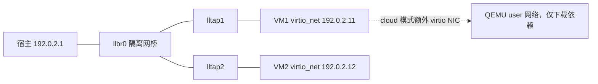

# Linux 6.18 网络实验环境

本篇回答：宿主能否使用 KVM、怎样编译并启动实验内核、怎样重复收包追踪与 GDB 调试？前置阅读：根目录 `AGENTS.md`，`notes/00-kernel-basics/README.md`。预计阅读时间：15 分钟，首次依赖安装和编译另计。

源码基准：`/home/chen/code/linux-lab/src/linux-6.18`，执行前确认 `git describe --always --dirty --tags` 为 `v6.18`。本目录脚本已完成静态检查和依赖失败路径检查，**完整编译、两种 VM 启动和收包追踪尚未实跑成功**，详见 [REPORT.md](REPORT.md)。

## 宿主结论（2026-10-03）

| 检查 | 实际宿主结果 | 含义 |
|---|---|---|
| 发行版 / 内核 | Ubuntu 22.04.5 LTS / 6.8.0-124-generic，x86_64 | 不能把宿主追踪结果当作 v6.18 |
| CPU / 虚拟化检测 | i7-10700，`vmx`；`systemd-detect-virt` 输出 `none` | 未检测到 WSL2/虚拟机；不需要假设嵌套虚拟化 |
| KVM | `/dev/kvm` 存在；chen 属 kvm 组；API=12，`KVM_CREATE_VM` 成功 | 已验证可创建临时 KVM 实例，随后立即关闭 |
| TAP | `/dev/net/tun` 存在 | 建桥仍需显式 root/CAP_NET_ADMIN，未实际建桥 |
| 已有工具 | QEMU 6.2.0、gcc 11.4、GDB 12.1、Python 3.10、ip、iperf3、tcpdump、ethtool、bpftool、perf 命令 | 命令存在不代表客户机兼容性已验证 |
| 缺少 | pahole、virtme-ng、bpftrace、cloud-localds、podman | 阻止完整运行，未自动安装 |

最初在受限沙箱内 `/dev/kvm`、`/dev/net/tun` 不可见，netlink 返回 EPERM；随后通过获授权的宿主只读检查得到上表。**缺设备的是沙箱视图，真实宿主支持 KVM/TAP。** 不要据沙箱结果去修改 BIOS 或判断这是 WSL。

本次读取了 [podman-build skill](/home/chen/.codex/skills/podman-build-skill/SKILL.md)，宿主没有 podman，无法检查/启动 `env0`。此仓库明确要求 Linux Kbuild、外置 `O=`；提供的脚本按该要求生成，不运行其他项目的 `nsbuild_git`。没有安装容器或修改内核源码树。

## 文件与阅读顺序

先读本文件，再读 [KCONFIG-SOURCES.md](KCONFIG-SOURCES.md)，随后进入 [追踪说明](../traces/README.md)。

| 文件 | 用途 |
|---|---|
| `common.sh` | 路径、版本、VM ID 和专用 SSH key 公共逻辑 |
| `build-kernel.sh`、`kconfig/net-debug.config` | defconfig + kvm_guest + 调试配置；外置增量编译、BTF、clangd、模块 |
| `topology.sh` | 宿主隔离网桥和两条 TAP，支持两台 VM |
| `prepare-cloud.sh` | 镜像校验、持久化 overlay、cloud-init 工具和 SSH 配置 |
| `up.sh`、`down.sh`、`ssh.sh` | 两种模式统一启动、停止、SSH |
| `guest-quick.sh` | virtme guest 内初始化实验网卡、iperf3 和专用 sshd |
| `traffic.sh`、`gdb.sh` | TCP/UDP 发流和 QEMU gdbstub 调试 |
| `selftest.sh` | 编译 → 启动 → 实际流量 → GRO/TCP 探针非零检查 |
| `KCONFIG-SOURCES.md` | 每个配置符号的 v6.18 Kconfig 行号 |
| `REPORT.md`、`OPEN-QUESTIONS.md` | 实测范围、未完成项、待决定事项 |

所有大文件、密钥、控制台日志默认在 `$HOME/.cache/linux-learning`，不提交仓库。可用 `LL_STATE`、`BUILD_DIR` 覆盖，必须在内核源码树和学习仓库之外。脚本路径暂不支持空格、逗号和引号。

## 一次性准备

以下是供你执行的安装命令，本次没有运行 `sudo apt install`：

```bash
sudo apt update
sudo apt install build-essential flex bison bc libelf-dev libssl-dev dwarves \
  pkg-config python3 python3-venv python3-pip python3-dev \
  qemu-system-x86 qemu-utils cloud-image-utils busybox-static \
  openssh-client openssh-server curl cpio rsync gdb \
  iproute2 iperf3 tcpdump ethtool linux-tools-common linux-tools-generic
python3 -m venv "$HOME/.local/share/ll-virtme-venv"
"$HOME/.local/share/ll-virtme-venv/bin/pip" install virtme-ng
export PATH="$HOME/.local/share/ll-virtme-venv/bin:$HOME/.local/bin:$PATH"
virtme-run --help
```

virtme-ng 的 PyPI 安装入口和依赖依据已访问的 [上游安装说明](https://github.com/arighi/virtme-ng/blob/main/README.md)。这里使用该项目附带的 `virtme-run`，因为它能直接表达已有内核、专用 TAP 和共享目录；不是使用旧发行版里同名但参数不同的 virtme 包。启动参数已对照 [上游 parser](https://raw.githubusercontent.com/arighi/virtme-ng/main/virtme/commands/run.py)，安装后仍需核对本机 `--help`。

快速模式直接复用宿主工具，要求 **bpftrace ≥ 0.21**。当前宿主 `apt-cache policy bpftrace` 的候选为 0.14.0，直接安装它不满足本追踪库要求。可选择完整模式，其 cloud-init 安装 Debian trixie 的 bpftrace；本次访问的 [Debian 包页面](https://packages.debian.org/trixie/bpftrace) 显示 0.23.2-1。快速模式需先从 [bpftrace 官方 release](https://github.com/bpftrace/bpftrace/releases/tag/v0.24.2) 获取并核对适用于宿主的发行产物，或自行构建新版；版本/安装方式见 `OPEN-QUESTIONS.md`，没有编造不可访问的二进制 URL。取得可执行文件后的安装命令为（放入 sudo 与 guest 都能找到的路径）：

```bash
sudo install -m 0755 /path/to/verified-bpftrace /usr/local/bin/bpftrace
bpftrace --version
```

quick guest 的 sshd 用自定义配置，只接受实验公钥。virtme 的 `--empty-passwords` 处理 guest 临时账号视图，避免宿主 root 锁定状态妨碍 SSH；自定义 sshd 禁止密码和键盘交互认证。共享的 key 目录只有公钥，私钥不作为额外共享目录传入 guest。virtme 仍会复用宿主根目录视图，所以它是你自己的调试环境，不用于隔离不可信程序。

## 编译与代码跳转

```bash
env/build-kernel.sh --check
env/build-kernel.sh                 # 再次运行会保留 .config 并增量编译
```

首次 `defconfig` 后，合并 `kernel/configs/kvm_guest.config` 和本目录片段；每次运行 `olddefconfig`，随后逐项检查要求是否保留，依赖不满足就失败。调试片段是权威要求，手工关闭其中开关会在下次运行时被重新打开。`DEBUG_INFO_DWARF5` 选择 `DEBUG_INFO`；BTF 的 pahole 版本门槛见 `lib/Kconfig.debug:377`。本脚本要求 pahole ≥ 1.21。

输出包括 `arch/x86/boot/bzImage`、`vmlinux`、`.config`、`Module.symvers`、`compile_commands.json`、`vmlinux-gdb.py`、`guest-modules/lib/modules/`。clangd 参数：`--compile-commands-dir=$HOME/.cache/linux-learning/build-6.18`，不需要向源码根目录写软链接。compile database 使用 `scripts/clang-tools/gen_compile_commands.py:43` 的外置目录参数；只包含本配置实际编译的源文件。

与后续 labs 的关系：veth、AF_XDP、BPF、CUBIC、BBR、netem、iptables/nftables 和主要网卡/文件系统功能均要求内置 `=y`。`CONFIG_XDP_SOCKETS` 存在于 `net/xdp/Kconfig:2`，不保证每个驱动/队列组合都支持 zero-copy。v6.18 的 legacy iptables 还需 `net/netfilter/Kconfig:761` 与 `net/ipv4/netfilter/Kconfig:14` 两个独立开关，片段已包含。

外置实验模块在**宿主**编译，避免使用宿主 6.8 的 `/lib/modules/$(uname -r)/build`：

```bash
# MODULE_DIR 指向已有实验模块的外置副本；本任务不生成实验模块实现。
make -C /home/chen/code/linux-lab/src/linux-6.18 \
  O="$HOME/.cache/linux-learning/build-6.18" M="$MODULE_DIR" modules
```

将 `.ko` 复制到 `/work` 对应的实验目录后，在 guest `sudo insmod /work/实际模块路径.ko`。自带内核模块统一安装到外置 `guest-modules`，guest 在 `/kernel-build` 只读可见；完整模式需要加载额外 `=m` 功能时，可执行 `sudo cp -a /kernel-build/guest-modules/lib/modules/$(uname -r) /lib/modules/` 后 `sudo depmod -a`。quick 默认 `--mods=none`，依靠内置实验功能；若自行改为模块，需调整为 `--mods=auto` 或显式装入匹配 `.ko`。修改配置后重编内核和模块，不能混用旧 `Module.symvers`。

## 两种启动方式与两机拓扑



建立拓扑一次，QEMU 本身用普通用户运行：

```bash
sudo env/topology.sh up "$(id -u)"
env/up.sh quick 1
env/ssh.sh 1
# 第二台可选：env/up.sh quick 2
```

`topology.sh` 只管理 alias 为 `linux-learning:P3` 的三个接口；同名的其他接口会使脚本失败。它不改宿主已有 `virbr0`、默认路由、转发设置和防火墙。若宿主已有 Docker/防火墙转发限制导致两机不通，先查规则，不清空宿主防火墙。宿主到 guest 和 guest1 到 guest2 都走 TAP/bridge；cloud 的第二张 virtio 网卡仅提供包下载通道，实验使用 `lab0`。

完整模式：

```bash
env/prepare-cloud.sh 1
env/up.sh cloud 1
env/ssh.sh 1 'sudo cloud-init status --wait'
# 第二台：env/prepare-cloud.sh 2 && env/up.sh cloud 2
```

默认镜像下载与 SHA512 校验由脚本完成；也可 `BASE_IMAGE=/绝对路径/已校验镜像.qcow2 env/prepare-cloud.sh 1`。默认下载目录此次未能通过网页工具访问，**镜像下载、分区和 cloud-init 首启均未验证**；脚本对下载/校验失败会退出。已访问的 [Debian 官方 cloud 目录镜像](https://cloudfront.debian.net/cdimage/cloud/trixie/daily/latest/) 可用于核对镜像命名。为固定实验环境，应设置 `CLOUD_URL`/`CLOUD_IMAGE_NAME` 为固定发布版本，或保留已校验本地 `BASE_IMAGE`。

cloud 使用外置内核直接引导、无需本脚本生成 initramfs，假定 ext4 根分区是 `/dev/vda1`；若所选镜像不同，用 `ROOT_DEVICE` 指定。cloud-init 配置持久保留，不会因为重生成 seed 就重复安装。首次包下载可能很慢，等 `cloud-init status --wait` 成功后再追踪。两种模式均把仓库放在 `/work`，使用 9p；virtiofs 驱动已编入，但启动脚本选择 9p，避免依赖额外 virtiofsd 服务。

显式 `ACCEL=tcg env/up.sh ...` 可不使用 KVM，速度与计时不代表真实硬件；它仍需要 TAP。快速模式“几秒启动”是工具定位，本机尚无实测时间。

停止并保留磁盘：`env/down.sh 1`。先请求 guest 关机，10 秒仍在运行则通过专属 QMP 退出；后者不是 guest 的有序关机。所有 VM 停止后 `sudo env/topology.sh down` 拆除实验网络。

## 标准操作（每次最多五步）

1. `env/build-kernel.sh`；首次先完成上面的依赖准备。
2. `sudo env/topology.sh up "$(id -u)"`，选择 `env/up.sh quick 1` 或已准备镜像的 `env/up.sh cloud 1`。
3. 终端 A：`env/ssh.sh 1 'sudo /work/traces/run.sh rx-path 20'`；等到 `READY`。
4. 终端 B：`env/traffic.sh tcp 20M 10 1`，或 `env/traffic.sh udp 5M 10 1`；对照 [追踪说明](../traces/README.md)。
5. `env/down.sh 1`；全部实验结束时 `sudo env/topology.sh down`。

自动化替代：在依赖和 TAP 已就绪后运行 `env/selftest.sh quick 1` 或 `env/selftest.sh cloud 1`。它验证 6.18、实验 MAC 对应 `virtio_net` 驱动、iperf3 成功、两个真实探针计数大于零，不把 banner 非空当作成功。SSH 本身也会产生 TCP 流量，所以计数证明探针工作，不证明只有 iperf3 被统计。

## GDB 示例

```bash
PAUSE=1 env/up.sh quick 1
env/gdb.sh 1
```

```text
(gdb) hbreak tcp_v4_rcv
(gdb) continue
# 等 guest SSH 就绪，从另一终端运行 traffic.sh
(gdb) bt
(gdb) lx-dmesg
(gdb) lx-symbols
(gdb) delete breakpoints
(gdb) continue
```

端口仅监听 `127.0.0.1:12341`（VM2 为 12342）；`nokaslr` 让 vmlinux 符号地址匹配。`tcp_v4_rcv` 定义在 `net/ipv4/tcp_ipv4.c:2202`。`hbreak` 可在 guest 启动前设置，避免软件断点被解压覆盖；进入函数后用 `next`/`step`/`finish` 检查。暂停全 VM 会扰动 TCP 定时器和对端重传，不能用单步时延推断吞吐。辅助命令以 `Documentation/process/debugging/gdb-kernel-debugging.rst:68`、`Documentation/process/debugging/gdb-kernel-debugging.rst:76`、`Documentation/process/debugging/gdb-kernel-debugging.rst:111` 为依据；编译生成链接见 `Makefile:1849`。

## 要点回顾

- 真实宿主支持 KVM；沙箱设备不可见不等于宿主不支持。
- 所有构建产物、模块、镜像和密钥在树外，内核源码保持 v6.18。
- quick 复用宿主工具，cloud 提供持久 Debian 用户态。
- 一条 TAP 对应一台 VM，第二台复用隔离网桥。
- 自检必须检查探针计数；源码定义、编译后可见、实际触发是三道不同检查。

## 自测题

1. 为什么不能给 6.18 guest 加载用宿主默认 `/lib/modules/.../build` 编译的模块？
2. 为什么 KVM 可用，`selftest.sh` 仍然可能在启动前失败？
3. 为什么 `ip_rcv` 次数可能远小于收到的包数？

<details><summary>答案</summary>

1. 宿主运行 6.8，配置、符号版本和结构布局可能不同；必须使用本次 6.18 输出目录。
2. 编译工具、BTF 的 pahole、virtme/cloud 工具、网桥权限任何一项都可能缺失。
3. GRO 后批量协议分发可走 `ip_list_rcv`；函数调用数也不是线速包数。

</details>

## 与 DPDK/VPP 的对照

| 熟悉的做法 | 本环境的对应物 | 类比边界 |
|---|---|---|
| 用户态测试进程 + 配置启动 | QEMU guest + 外置内核 | guest 含调度器、驱动、协议栈整个系统 |
| 测试端口/虚拟接口互联 | virtio_net + TAP + bridge | TAP 仍进入宿主内核，吞吐不是纯 PMD 路径 |
| 给主线程设断点 | QEMU gdbstub 暂停 guest | 暂停影响全 guest vCPU 和网络时间行为 |
| mbuf/ring 统计 | IRQ、NAPI、GRO 计数 | 一次通知、一次 poll、一个 skb 均不等于一个线速包 |
