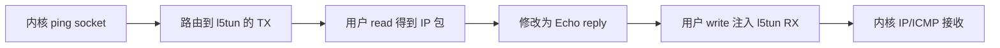

# L05 参考答案

本篇回答：怎样从 TUN 收到内核发包并回复 ICMP？前置：[L05 题面](../../L05-tun/)。预计阅读 15 分钟。

文件 `tun_echo.c` 是原创最小示例；先读方向，再读 `make_reply`，最后运行。已严格编译并做不依赖 TUN 设备的构包逻辑校验；VM/TUN 实际运行【未实跑】。它只响应目的 `10.77.0.2`、IHL=5、无分片、checksum 正确的 IPv4 Echo request。`--sink` 只读并计数，结束时输出累计计数。

```bash
cc -std=c11 -Wall -Wextra -Werror -O2 /work/labs/solutions/L05-tun/tun_echo.c -o /tmp/l05-echo
sudo /tmp/l05-echo
```

按题面在另一终端配置 `.1/24`，之后 ping `.2`。不要把 `.2` 配在任何内核接口，否则可能由内核直接回应。代码交换源/目的 IP，保留 id/seq/payload，设置 Echo reply 类型并重算 ICMP 与 IPv4 checksum。奇数长度最后一个字节作为 16 位字的高位补零。拒绝分片位，避免把一片误当完整消息；payload 大的 ping 失败符合本示例边界。



方向依据是 `drivers/net/tun.c:1999` 的写入调用及 `drivers/net/tun.c:2184` 的读取复制。`tun_get_user` 是“内核从用户取得包”，不是“用户从网卡收包”。

<details><summary>四道思考题答案</summary>

1. read 取的是内核通过虚拟设备发出的包；write 向内核设备接收方向注入包。
2. `.2` 必须由实验程序代表，避免与本地地址处理冲突。
3. 覆盖一补码 checksum 对末尾奇数字节的补零规则。
4. 可能包含内核路由、skb 分配/排队、系统调用/复制与调度；具体数量需测，不能用概念图直接给性能倍数。

</details>

要点回顾：方向以设备看；保留 payload；验证边界后变更；非持久 fd 关闭清理。与 DPDK/VPP 对照：TUN 是内核软件 L3 接口，可接用户态应用，但不是 DMA 到用户态 mbuf 的 PMD。
