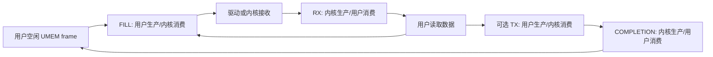

# L08 参考答案

本篇回答：怎样理解 UMEM 所有权与对照结果？前置：[L08 题面](../../L08-af-xdp/)。预计阅读 15 分钟。

文件：`icmp-load.py` 是原创的 ICMP/Ethernet 有界发流与 RTT 观察工具；先做题，再读本页，再检查脚本。已通过 Python 语法检查与离线帧/checksum/反射识别测试，真实 raw socket 发流与 AF_XDP **未实跑**。无 TCP 代码，未复制 xdp-tools 源码。

工具固定 VM2 源 IPv4 `.12`、目标 `10.77.0.2`，MAC 由接口和参数取得；Ethernet+IP+ICMP header 为 42 字节，`--size` 是 ICMP payload 字节数。RTT 使用 VM2 的单调时钟和 payload 内的原始序号/时间戳，逐包等待最多 1 秒；因此它不是高吞吐延迟探针。burst 模式只测发送与对端接收计数，不同时测 RTT。实际 pps 根据本次发送时间计算，调度精度和 Python 开销会限制发流能力。

图示为 ownership（所有权）交接，不是允许用户和内核同时写同一 frame。方向依据 `Documentation/networking/af_xdp.rst:42`；绑定和 XSKMAP 限制见同文件 `:53`、`:220`。工具承担 UMEM/ring 配置，本实验不手写省略内存序的“简易 ring”。

四道思考题答案

1. 不能，缺少可用 buffer 会造成接收停顿/丢包；正确 redirect 不会自动创造 UMEM frame。
2. 确认应用不再访问该 frame 后才能回 FILL；若把它交给 TX，须等 COMPLETION 再复用，不能同一 frame 同时 RX/FILL/TX。
3. AF_XDP 是接口和队列模型；copy 与 zero-copy 是数据搬运模式。`include/uapi/linux/if_xdp.h:17`、`:18` 明确定义两种 bind 强制选项。
4. 不能。TUN 轮次包含内核 IPv4 转发、用户态 ICMP 校验/改写和返程路由；xsk-tx 只做 L2 反射，还有批处理、等待策略、VM 调度等区别。

xsk-tx 返回的 IPv4 地址和 ICMP 类型保持原样，普通 ping 不能把它当 Echo reply；工具用 MAC、payload 和类型识别反射。TUN 返回真正的 Echo reply。两者都只比较同一端发出到收到的完整 RTT。通过同样输入帧消除了一部分变量，但没有消除不同处理工作的成本，报告中必须保留这一限制。

若 copy 模式也收不到：先查工具加载/bind 错误、queue 0 是否真有流量、程序挂载是否对应接口、XSKMAP 目标与 UMEM 资源；不要首先认定是“零拷贝不支持”。virtio 的 pool enable 在 `drivers/net/virtio_net.c:5921`，headroom 不满足在 `:5932` 返回错误。将真实错误记录下来，不能把存在该函数当成所有后端均支持。

要点回顾：ring 操作即所有权交接；强制模式揭示协商失败；用户态计数要对应实际输入；RTT 不是单向时延。与 DPDK/VPP 对照：UMEM/frame/ring 与 mbuf/mempool/descriptor 有相似职责，驱动管理、内存序和 socket 生命周期仍属 AF_XDP 模型。
