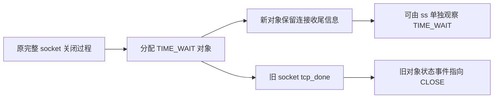

# L10 参考推导

本篇回答：为什么事件时间线与协议逻辑图不同？前置：[L10 题面](../../L10-tcp-trace/)。预计阅读 12 分钟。顺序：自己采样、读本推导、检查 `tcp-events.bt` 和 `one-connection.py`。前者是 IPv4 tracepoint 观察器；后者只是普通内核 socket 客户端/服务端。Python 已做离线语法检查，BPF 编译、guest 交互及事件结果均【未实跑】。

## 状态编号与对象边界

编号来自 `/home/chen/code/linux-lab/src/linux-6.18/include/net/tcp_states.h:12`：

| 数字 | 状态 |
|---|---|
| 1 | ESTABLISHED |
| 2 | SYN_SENT |
| 3 | SYN_RECV |
| 4 | FIN_WAIT1 |
| 5 | FIN_WAIT2 |
| 6 | TIME_WAIT |
| 7 | CLOSE |
| 8 | CLOSE_WAIT |
| 9 | LAST_ACK |
| 10 | LISTEN |
| 11 | CLOSING |
| 12 | NEW_SYN_RECV |

这张表不是“每个对象都会经过的序列”。`inet_sk_set_state` 和 `inet_sk_state_store` 在写完整 socket 状态前发出状态 tracepoint，见 `/home/chen/code/linux-lab/src/linux-6.18/net/ipv4/af_inet.c:1345` 与 `/home/chen/code/linux-lab/src/linux-6.18/net/ipv4/af_inet.c:1352`。

服务端最初的 request_sock 在 `/home/chen/code/linux-lab/src/linux-6.18/net/ipv4/inet_connection_sock.c:938` 直接赋 `TCP_NEW_SYN_RECV`，不走这个事件。完整 child 创建时才在 `/home/chen/code/linux-lab/src/linux-6.18/net/ipv4/inet_connection_sock.c:1271` 设置 SYN_RECV；它与 listener、request 并非同一地址。因此不应要求同一个 child 指针从 CLOSE 开始记录整个握手。

进入 TIME_WAIT 时，`tcp_time_wait` 分配另一个对象，见 `/home/chen/code/linux-lab/src/linux-6.18/net/ipv4/tcp_minisocks.c:328`；新对象在 `/home/chen/code/linux-lab/src/linux-6.18/net/ipv4/inet_timewait_sock.c:201` 直接设置 `tw_state`。随后原完整 socket 经过 `tcp_done`，在 `/home/chen/code/linux-lab/src/linux-6.18/net/ipv4/tcp.c:5000` 设置 CLOSE。这解释了旧 skaddr 的 FIN_WAIT2→CLOSE 与 ss 的 TIME_WAIT 可以同时成立，不需要补造一个 TIME_WAIT tracepoint。

下面仅是**源码解释图**，没有宣称为本次观测：



## 重传事件的含义

普通重传的 tracepoint 位于 `/home/chen/code/linux-lab/src/linux-6.18/net/ipv4/tcp_output.c:3625` 的统一返回路径。此前可能因 skb 仍在主机队列而返回 `-EBUSY`，见 `/home/chen/code/linux-lab/src/linux-6.18/net/ipv4/tcp_output.c:3499`。因此必须保留 `err`，不能把每个事件都计成成功发出的线上重传段；事件也没有提供 RTO/其他恢复机制的直接分类。

SYN-ACK 使用独立事件，定义于 `/home/chen/code/linux-lab/src/linux-6.18/include/trace/events/tcp.h:289`。通常以监听 socket 和 request 作为上下文，不能用其中的 skaddr 直接等同后续 child。短选做脚本如下，运行前核对 `-lv`；同样【未实跑】：

```bpftrace
tracepoint:tcp:tcp_retransmit_synack
/args.family == 2 && args.sport == 5229/
{
  printf("%llu SYNACK_RETRANS sk=%p req=%p %s:%u->%s:%u\n",
         nsecs, args.skaddr, args.req, ntop(args.saddr), args.sport,
         ntop(args.daddr), args.dport);
}
```

<details><summary>五道思考题答案</summary>

1. 不能。一个事件记录旧完整 socket，TIME_WAIT 常由另一个 minisock 保存；应按四元组和实验时间范围对照不同对象。
2. 不一定，通常是 listener/request 的上下文；后续 accepted child 是另一个对象。遇到特殊握手方式还要回到实际调用路径分析。
3. 它的 TRACE_EVENT 没有声明这些字段；名称相似不能推断字段相同，更不能在读不到时凭结构偏移猜。
4. 接收、定时器与重传处理可在软中断等上下文执行，当前 PID/comm 不是 socket 所有者的稳定标识。
5. 先证明 `-lv`/挂载成功，记录 READY、流量起止与 qdisc 生效，再核对数据四元组。条件成立但无事件可报告“本窗口未观察到”；条件缺失就报告未覆盖或不可用，不把三者写成同一种零值。

</details>

要点回顾：事件按真实字段使用；完整 socket 不等于所有协议对象；时间排序与因果区分；失败重传另计；TIME_WAIT 另取证。与 DPDK/VPP 对照：如果你自己的用户态连接管理跨阶段复用同一个 connection ID，日志关联可能更直接；内核对象分工不同，指针只是阶段性身份。尚未完成动态验证，不提供虚构事件或保证每次出现固定状态序列。
