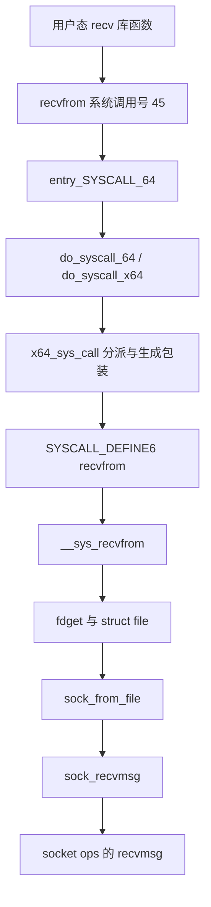

# 02 recv() 怎样进入 socket 层

本篇回答：用户态 recv 对应哪个系统调用？fd 怎样变为 socket？它是否必经 VFS read_iter？
前置阅读：[01 执行上下文](01-execution-context.md)。预计阅读时间：15 分钟。
源码基准：Linux v6.18；架构限定 x86-64 原生 64 位 ABI，不覆盖 x32、32 位兼容 ABI。

## 先分清库函数、系统调用号、内核函数

用户调用的 `recv()` 是 libc 接口；内核不保证有一个与其同名的系统调用号。v6.18 的 x86-64 表在 `arch/x86/entry/syscalls/syscall_64.tbl:57` 给出 45 号 `recvfrom`，没有原生 `recv` 项。

作为明确版本的用户态例子，glibc 2.39 的 Linux `recv.c` 在提供 recvfrom 系统调用的路径上，以地址参数为空来完成 recv 语义。这里不把该实现当成所有 libc 的保证。[glibc 2.39 recv.c](https://raw.githubusercontent.com/bminor/glibc/glibc-2.39/sysdeps/unix/sysv/linux/recv.c)、[kernel-features.h](https://raw.githubusercontent.com/bminor/glibc/glibc-2.39/sysdeps/unix/sysv/linux/kernel-features.h)。实际机器以 strace 结果确认。

x86-64 的 `syscall` 指令进入 `entry_SYSCALL_64`，入口保存寄存器并建立内核执行环境，再调用 `do_syscall_64`。源码锚点是 `arch/x86/entry/entry_64.S:87`、`arch/x86/entry/entry_64.S:121`。这里切换的是 CPU 权限与执行环境，不意味着一定换成另一个进程。

“系统调用表”是编号到处理逻辑的映射。不要把旧版本的函数指针数组调用方式直接套过来：v6.18 的 `x64_sys_call` 使用生成的 case 语句，见 `arch/x86/entry/syscall_64.c:34`；`do_syscall_64` 经 `do_syscall_x64` 到这里，见同文件 `:54`、`:87`。



图从 libc 到 recvfrom 的边限定上述 ABI 与 libc 路径；系统调用分派中的符号包装由宏生成，不要求源码中有同名手写函数体。内核还定义了 `SYSCALL_DEFINE4(recv, ...)`，见 `net/socket.c:2316`，这是供有相应 ABI 入口的架构使用，不能据此认定 x86-64 有 recv 系统调用号。

## fd、VFS 与 socket 的边界

VFS（虚拟文件系统）提供统一的文件对象与 fd 机制。fd 是当前进程文件描述符表中的索引，不是 socket 指针，也不是网卡队列编号。

`__sys_recvfrom` 先建立用户缓冲区的迭代器，然后解析 fd：

```c
CLASS(fd, f)(fd);
/* 省略空 fd 检查 */
sock = sock_from_file(fd_file(f));
/* 省略错误与 flag 处理 */
err = sock_recvmsg(sock, &msg, flags);
```

出处：`net/socket.c:2284`。`CLASS(fd, f)` 是带作用域清理的 C 宏，获取时执行 `fdget`，退出作用域时执行 `fdput`，定义见 `include/linux/file.h:85`。`fdget` 最终从当前 task 的 `files` 查找文件；单引用与共享文件表存在不同优化路径，见 `fs/file.c:1153`。这里不要简单推断“每次系统调用都增减同一个 file 引用计数”。

`sock_from_file` 检查文件的操作表是不是 `socket_file_ops`，然后取得 `private_data` 中的 socket，见 `net/socket.c:530`。这就是本例中 VFS 文件抽象参与的主要位置。

**recvfrom 不经过 VFS 的通用 read 路径。** 对 socket 调用文件读取接口时，`socket_file_ops.read_iter` 指向 `sock_read_iter`，后者也调用 `sock_recvmsg`，见 `net/socket.c:158`、`net/socket.c:1153`。两条路径在 socket 层汇合，不能画成 `recv → read_iter → socket`。

## socket 层入口到此为止

`sock_recvmsg` 做安全检查，然后进入接收分派，见 `net/socket.c:1096`。其辅助函数的关键部分是：

```c
int ret = INDIRECT_CALL_INET(READ_ONCE(sock->ops)->recvmsg,
                             inet6_recvmsg,
                             inet_recvmsg, sock, msg,
                             msg_data_left(msg), flags);
```

出处：`net/socket.c:1075`。读者现在只需识别：这里从 socket 的 ops 表选择协议族实现。IPv4 stream 表把 recvmsg 设置为 `inet_recvmsg`，见 `net/ipv4/af_inet.c:1054`、`net/ipv4/af_inet.c:1071`。TCP 如何等待数据、何时复制给应用，留给 TCP 专章。

## 动手：验证 recv 的系统调用名字

下面只是使用操作系统 socket API 的观测程序，不实现协议栈。在实验 VM 执行，需要 python3、strace。此实验未在 v6.18 VM 实跑。

```sh
strace -e trace=recvfrom,recvmsg python3 - <<'PYCODE'
import socket
left, right = socket.socketpair()
try:
    left.sendall(b'x')
    print(right.recv(1))
finally:
    left.close()
    right.close()
PYCODE
```

在常见 x86-64 Linux/CPython 环境应看到 recvfrom 调用与返回 1；具体运行库路径需以实际结果为准。socketpair 的地址族是本地域，只用于隔离验证用户接口与系统调用名字，不能据此确认 IPv4 的 ops 分派。

下一步手工沿源码查 `CLASS(fd, f)`、`fdget` 和 `sock_from_file`，分别回答“找到文件”“检查类型”“取得 socket”发生在哪里。

## 要点回顾

- libc 接口名不一定与当前架构系统调用名相同。
- v6.18 x86-64 的系统调用分派包含生成的 switch case。
- fd 经文件表得到 struct file，再由文件类型得到 socket。
- recvfrom 与 read_iter 是不同入口，汇合到 sock_recvmsg。
- 系统调用进入内核后仍代表调用它的 task 执行。

## 自测

1. 看到 `SYSCALL_DEFINE4(recv)`，能确认本机有 recv 系统调用号吗？
2. 给 recvfrom 传普通文件的 fd，应在哪一层发现类型不对？
3. recvfrom 调用 sock_read_iter 吗？

<details><summary>答案</summary>

1. 不能，必须核对架构 ABI 的系统调用表。
2. fd 解析之后，sock_from_file 检查 socket_file_ops；不匹配时上层返回 ENOTSOCK。
3. 本篇 v6.18 路径没有这个调用。socket 的文件读取路径才使用 read_iter，二者在 sock_recvmsg 汇合。

</details>

## 与 DPDK/VPP 的对照

调用 PMD 的接收接口通常直接进入进程中的驱动逻辑；recv 则跨越用户/内核权限边界并解析进程的 fd。socket 更接近“应用持有的协议通信端点”，不能与 RX queue 一一对应。一个队列上的流量可以被内核分发到很多 socket。
