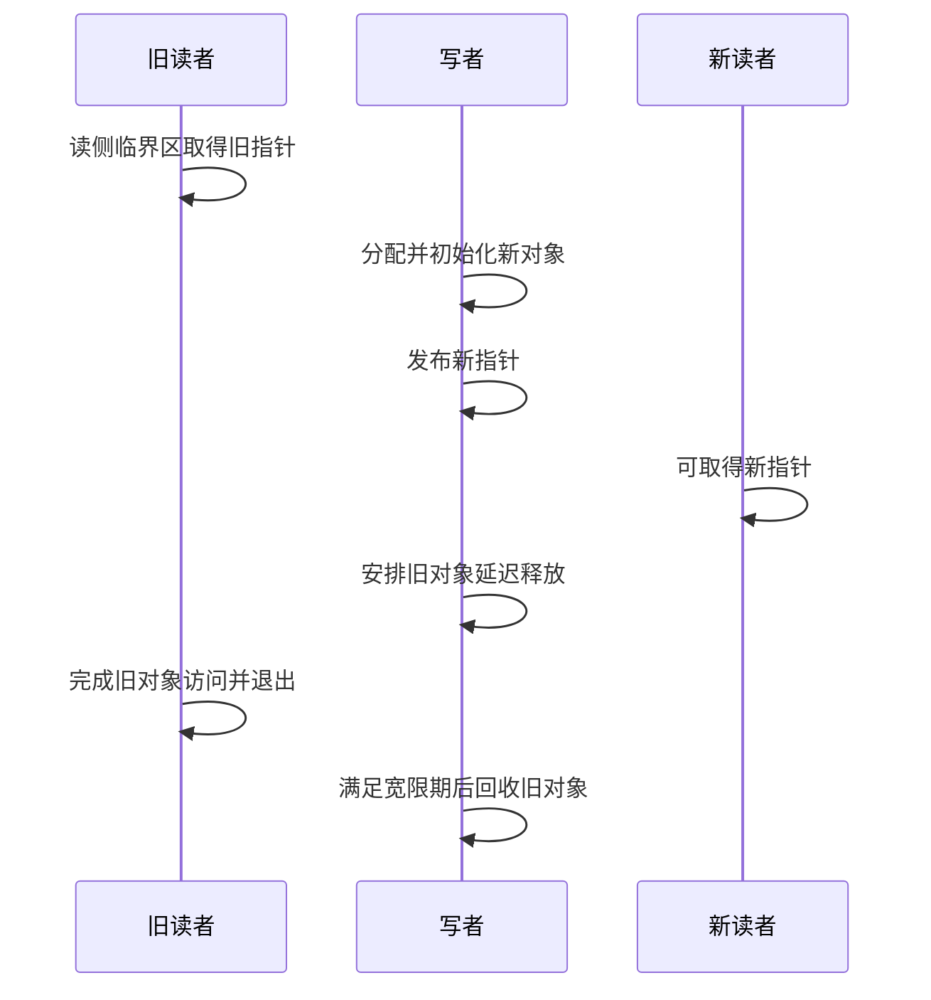

# 04 同步：到底在防谁

本篇回答：spinlock 变体分别阻止什么并发？mutex 与 atomic 的边界是什么？RCU 为什么读得便宜、写得复杂？
前置阅读：[01 执行上下文](01-execution-context.md)、[03 内存](03-memory-and-lifetime.md)。预计阅读时间：18 分钟。
源码基准：Linux v6.18；spinlock 表格以非 PREEMPT_RT 为前提。

## 先列竞争者，再选锁

同一对象可能被其他 CPU、当前 CPU 的软中断、当前 CPU 的硬中断访问。锁负责不同 CPU/执行流的互斥；关闭本地某类执行负责避免当前持锁者被同类竞争者打断后自锁。

| 操作 | 跨 CPU 互斥 | 本 CPU 额外限制 | 典型问题 |
|---|---|---|---|
| spin_lock | 是，仅限所有访问者使用同一把锁 | 非 RT 下持锁期间禁止任务抢占 | 不自动阻止本地硬/软中断进入同一把锁 |
| spin_lock_bh | 是 | 禁止本地 bottom half（软中断执行） | 进程上下文与本地软中断共享状态 |
| spin_lock_irqsave | 是 | 保存 IRQ 状态并禁用本地 IRQ | 与硬中断共享状态；退出恢复原 IRQ 状态 |
| mutex_lock | 是 | 等待锁时可睡眠 | 仅适用于允许睡眠的位置 |

`_bh`、`_irqsave` 不会全局关闭别的 CPU。spinlock 临界区不得睡眠；也不要先持普通 spinlock，再去等待 mutex。PREEMPT_RT 的 spinlock_t 有不同实现，甚至 `_irqsave` 的名字也不能照搬为“硬件 IRQ 一定关闭”，见 `Documentation/locking/locktypes.rst:245`。

网络例子：socket 锁等待代码在睡前显式释放 `_bh` 自旋锁，醒来后再取回：

```c
spin_unlock_bh(&sk->sk_lock.slock);
schedule();
spin_lock_bh(&sk->sk_lock.slock);
```

出处：`net/core/sock.c:3154`。这几行足以反证“可以拿着该自旋锁睡眠”。不要把整个 socket 锁机制等同于单纯 spinlock；上层还维护 socket 所有权和 backlog。

接收 backlog 的锁根据 RPS 或 backlog thread 设置选择 IRQ 保存与自旋锁组合，见 `net/core/dev.c:231`。接口别名更新则使用 mutex，见 `net/core/dev.c:1528`。先找到所有访问者，才知道每个后缀的必要性。

## atomic 与 per-CPU 分别缩小了什么问题

atomic（原子操作）可让一个规定的读改写操作不可分割，不会自动把多个字段的更新组合成事务。网络内存记账使用 `atomic_sub`，见 `net/core/sock.c:2753`：

```c
atomic_sub(len, &sk->sk_rmem_alloc);
```

读计数再根据结果修改另一个字段，仍然可能竞争。引用计数应优先按对象既有的 refcount/kref 协议处理，不能因为 atomic 会加减就替代它。

per-CPU（每 CPU 副本）让常见本地更新避免跨核共享一个 cache line，但不等于永远无锁。网络软中断取本地状态的例子：

```c
struct softnet_data *sd = this_cpu_ptr(&softnet_data);
```

出处：`net/core/dev.c:7747`。如果取得某 CPU 指针后 task 可以迁移，或者远端 CPU 也会访问同一对象，就要另行保证正确性。RPS 可以把包排入目标 CPU backlog，见 `net/core/dev.c:5261`，所以“每 CPU 一个队列”不等于“永远只有单生产者”。

## RCU 的完整例子：接口别名

RCU（Read-Copy Update，读复制更新）适合读多写少、允许旧读者暂时观察旧版本的对象。它把“让新读者找到新对象”和“何时回收旧对象”分开。

写侧先分配、初始化新别名，然后串行更换指针，最后延迟释放旧对象：

```c
mutex_lock(&ifalias_mutex);
new_alias = rcu_replace_pointer(dev->ifalias, new_alias,
                                mutex_is_locked(&ifalias_mutex));
mutex_unlock(&ifalias_mutex);
if (new_alias)
    kfree_rcu(new_alias, rcuhead);
```

出处：`net/core/dev.c:1528`。赋值完成后，局部变量 new_alias 保存的是被替换的旧对象，不再是开始创建的新对象。

读侧只包围短暂使用：

```c
rcu_read_lock();
alias = rcu_dereference(dev->ifalias);
if (alias)
    ret = snprintf(name, len, "%s", alias->ifalias);
rcu_read_unlock();
```

出处：`net/core/dev.c:1553`。读者无需竞争写侧 mutex，也无需对每次读取都修改该对象的共享引用计数。这是其低开销的重要来源。具体是否禁止抢占、用了什么记账取决于 RCU 配置；“几乎没有开销”不等于所有构建下空指令或完全没有 cache miss。



grace period（宽限期）让先前可能持有旧指针的读侧临界区结束后，旧对象才可回收。写侧因此付出额外对象空间、发布次序、写者互斥、延迟回收和更复杂的寿命推理。RCU 不会自动让对象内部任意原地修改都安全；读侧临界区结束后也不能未经额外保护继续保存、使用该裸指针。

## 内存屏障只需先懂这一层

memory barrier（内存屏障）约束观察次序；mutex/spinlock/RCU 的发布读取 API 已承担各自协议所需的一部分次序保证。上面的新对象必须先初始化，再让读者看见它；仅仅把指针声明为 `volatile` 不构成这个协议。

`READ_ONCE`/`WRITE_ONCE` 不是跨字段事务，也不是万能内存屏障。内核说明见 `Documentation/memory-barriers.txt:231`、`Documentation/memory-barriers.txt:479`。网络中的真实发布和读取例子就是上述 `rcu_replace_pointer` 与 `rcu_dereference`。第一遍读代码先保持原有配对，不自行删屏障“优化”。

## 动手：画访问者表

本练习是源码阅读，已核对命令目标；不修改运行系统。

```sh
cd /home/chen/code/linux-lab/src/linux-6.18
rg -n 'ifalias_mutex|rcu_replace_pointer|rcu_dereference' net/core/dev.c
rg -n 'spin_(lock|unlock)_bh|schedule\(' net/core/sock.c
rg -n 'backlog_lock_irq|input_pkt_queue' net/core/dev.c
```

给接口别名画三列：“新对象何时完整”“旧指针何时不再发布”“旧对象何时释放”。再解释为什么 mutex 解锁后仍不能立刻释放旧别名。

## 要点回顾

- 锁后缀补的是本地上下文限制，跨 CPU 仍依赖同一把锁。
- atomic 只覆盖规定操作，per-CPU 只减少共享范围。
- RCU 读者避免逐次竞争写侧锁和修改共享引用计数。
- RCU 写者承担发布、写者串行化与旧版本回收。
- 对象寿命、字段一致性、访问次序要分别确认。

## 自测

1. spin_lock_bh 会禁止其他 CPU 的软中断吗？
2. 用 RCU 发布新别名后，旧别名能立刻 kfree 吗？
3. this_cpu_ptr 返回的指针能在任意可迁移位置一直保留吗？
4. atomic 更新一个计数能保证旁边两个普通字段一致吗？

<details><summary>答案</summary>

1. 不会。它限制本 CPU 的软中断执行，其他 CPU 的互斥靠锁。
2. 不能，旧读者可能还在使用它，须遵守宽限期/回收协议。
3. 不能据此假设，需保证所需的 CPU 归属与并发条件。
4. 不能，多字段一致性需要额外协议。

</details>

## 与 DPDK/VPP 的对照

per-lcore 数据与 per-CPU 数据都有减少共享的作用，但内核还要面对任务迁移、IRQ 和 softirq。用户态的数据面单所有者模型不能直接代替内核锁协议。DPDK 中熟悉的延迟回收思想有助于理解 RCU，但内核 RCU 的读侧约束与宽限期实现必须按其 API 阅读。
