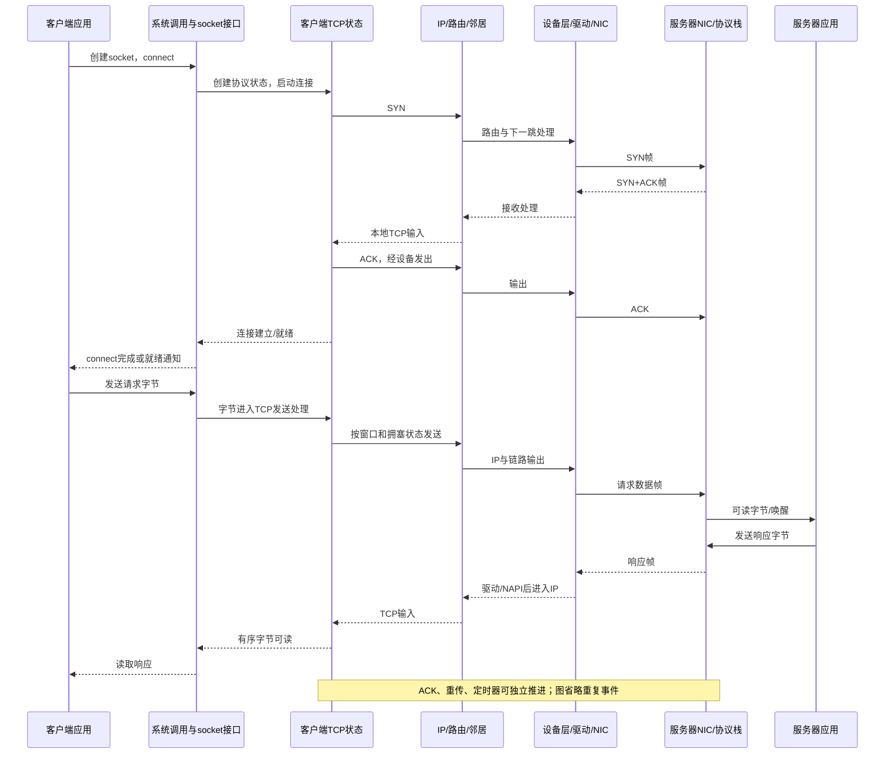

# 01 一个请求的旅程

本篇回答：一次 TCP 请求经过哪些层？连接状态和报文字节分别在哪里？发送返回为何不代表对端收到？

前置阅读：具备 TCP、网卡队列、mbuf 的使用经验；内核上下文可随后补读 `../00-kernel-basics/`。预计阅读时间：12 分钟。源码基准：Linux v6.18。

## 故事的边界

场景是客户端经以太网、IPv4、TCP 访问另一台机器上的服务器。默认已知服务器 IP，不展开 DNS、TLS、隧道、代理和特殊 offload（卸载）路径。发送和接收不是一次从上到下再原路返回的同步函数调用：进程执行、驱动事件、协议定时器可以在不同时间推进同一连接。

### 1. 应用提出连接请求

应用先创建 socket（套接字），再连接服务器地址和端口。文件描述符只是在当前进程中找到内核文件对象的编号，不是 TCP 连接本身。内核把应用可操作的接口对象与协议状态对象关联起来；后者可以在应用暂时不执行时继续处理 ACK（确认）和超时。入口与文件绑定见 net/socket.c:1759、net/socket.c:476。

### 2. socket 层选择协议实现

系统调用检查参数并找到 `struct socket`，通过其操作表交给所选地址族和 socket 类型的实现。对普通 IPv4 TCP，接口操作表是 `inet_stream_ops`，TCP 协议操作表是 `tcp_prot`。前者连接应用接口与 INET 层，后者连接 TCP 状态和算法；不要把它们当成两个连接。注册关系见 net/ipv4/af_inet.c:1155、操作表见 net/ipv4/af_inet.c:1054 与 net/ipv4/tcp_ipv4.c:3485。

### 3. TCP 启动握手

TCP 选择本地端点，准备连接状态，发出 SYN（同步序号）并等待后续握手事件。阻塞连接调用可能等待；非阻塞调用可以先返回，再由就绪通知报告进展。握手和后续数据复用网络层、设备层、驱动的发送通路，而不是握手专有的一条线路。IPv4 连接实现入口见 net/ipv4/tcp_ipv4.c:224。

### 4. IP、路由和邻居决定怎样到达下一跳

IP 层准备 IP 报文，并利用路由确定输出接口、下一跳等信息。邻居子系统解决下一跳的链路层可达性，例如 IPv4 以太网中的 ARP（地址解析协议）。目的 IP 可能在远端网络，帧的目的 MAC 则属于本地链路的下一跳；邻居未解析时，数据可能先排队等待。IPv4 输出与邻居交接见 net/ipv4/ip_output.c:200、net/ipv4/ip_output.c:237。

### 5. 设备层、驱动和网卡发出帧

设备无关层选择发送队列，并按 qdisc（排队规则）的配置处理排队和调度；并非每个设备都使用有实际排队行为的 qdisc。驱动把待发数据交给硬件描述符，网卡通过 DMA（直接内存访问）读取缓冲区并发送。驱动完成一次发送、TCP 收到对端 ACK、应用读到响应是三个不同事件。公共发送路径见 net/core/dev.c:4670，交给驱动的接口见 include/linux/netdevice.h:5248。

### 6. 收到握手应答后，应用写入请求字节

应用发送请求时，TCP 接受的是字节流，不保留一次应用写入对应一个报文的边界。TCP 根据发送窗口、拥塞控制、分段和调度条件决定何时送出哪些字节，并保留可靠传输所需的信息。发送接口成功通常意味着这些字节已被内核接受，并不证明它们已经离开网卡，更不证明服务器业务处理成功。发送字节处理与发包决策位置见 net/ipv4/tcp.c:1078、net/ipv4/tcp_output.c:2901。

### 7. 服务器收包并交给业务

服务器网卡将数据写入接收缓冲区，驱动通过 NAPI（网络事件轮询机制）处理接收事件，把合适的数据送入协议栈。IP 判断这是本机流量，TCP 找到连接、检查序号并推进接收状态，应用随后读取可交付的字节。中断通常只是触发处理的入口；NAPI 常在 softirq（软中断）上下文执行，也支持线程和 busy polling（忙轮询），不能把它写成“硬中断里处理完 TCP”。依据见 Documentation/networking/napi.rst:9、net/ipv4/ip_input.c:248、net/ipv4/tcp_ipv4.c:2202。

### 8. 响应沿对称的分层方向返回

服务器业务写出响应，服务器 TCP 发包；客户端再经历驱动、IP、TCP、本地读取的接收过程。TCP 的 ACK 可能独立发送，也可能与反向数据一起携带，因此时序图中的响应不能替代所有 ACK。客户端读取到的是有序字节流；一次读取也不保证拿到完整应用消息，消息边界应由应用协议定义。接收字节流入口见 net/ipv4/tcp.c:2633，已建立连接处理见 net/ipv4/tcp_input.c:6259。

### 9. 应用退出不等于协议状态瞬间消失

关闭文件描述符结束的是应用对这个接口的一份引用。TCP 仍可能有待发字节、关闭握手和定时器工作，协议对象的回收条件与文件对象不同。正常关闭、复位和超时是不同分支，本篇只标出生命周期边界，具体状态留给 TCP 机制篇。关闭实现见 net/ipv4/tcp.c:3123、net/socket.c:688。

## 亲眼观察

在后续 `../../labs/` 的两端 TCP 实验中，同时保留应用的系统调用时间线和两端抓包。标出连接调用、三次握手、应用写入、线上报文、应用读取这五类事件，再数一次写入对应多少帧。此处未执行运行时实验；GSO（通用分段卸载）/GRO（通用接收聚合）会影响主机抓包呈现，抓包中的“大包”不能直接当成线上的一个以太网帧，依据 Documentation/networking/segmentation-offloads.rst:121。

## 要点回顾

- 应用接口对象、TCP 状态、报文缓冲区属于不同生命周期。
- TCP 处理字节流，IP 和设备处理报文与帧。
- 路由选择下一跳，邻居机制处理下一跳链路地址。
- 发送返回、设备完成、TCP 确认、业务响应是不同事件。
- 接收、定时器、进程调用共同推进连接。

## 自测题

1. 应用发送成功后服务器一定收到请求了吗？
2. 为什么目的 IP 和目的 MAC 可以分别指向服务器和网关？
3. 一个请求能否跨多个 TCP 段，一次读取能否包含两个请求？

答案

1. 不一定；成功表示字节被接受，后续仍可能排队、丢包或超时。
2. IP 描述最终网络层目的地，MAC 描述当前以太网链路上的下一跳。
3. 都可以。TCP 不保存应用写入边界，应用必须自己定义消息边界。

## 与 DPDK/VPP 的对照

你熟悉的收包、分类、查表、改写、发包仍在这张图上。新增的主线是应用文件接口、连接状态、可靠传输缓存、定时器和唤醒；一个转发节点完成一次处理，不能类比成 TCP 已经完成这批字节的可靠交付。
