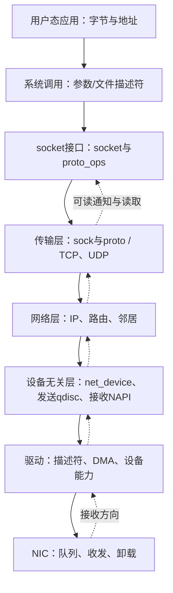
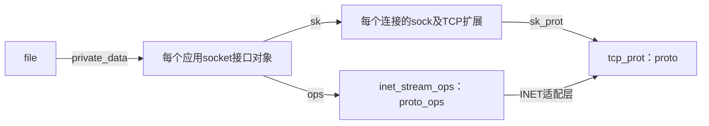

# 02 分层架构与接口

本篇回答：各层负责什么、对象和代码在哪里？`socket`、`proto_ops`、`proto` 如何配合？NAPI 和 qdisc 为什么都属于设备层却不对称？

前置阅读：[01 一个请求的旅程](01-request-journey.md)。预计阅读时间：15 分钟。源码基准：Linux v6.18。

## 一张方向图

图是职责关系，不是每个包都逐格调用的固定流水线。转发包通常不进入本机 TCP；回环和虚拟设备没有物理 NIC；XDP 可以提前丢弃或重定向。接收驱动向上交付数据，发送栈向下调用驱动，两个方向的执行模型不同。

| 层 | 职责与核心对象 | 代码位置与核实锚点 | 对上/对下接口 |
|---|---|---|---|
| 用户态 | 定义请求响应、连接策略和消息边界；持有 fd（文件描述符） | 内核接入点 net/socket.c:1759 | 上接业务；下用 socket API（套接字接口） |
| 系统调用/VFS（虚拟文件系统） | 找到文件、检查用户参数、转换调用；`struct file` | net/socket.c:476；include/linux/fs.h:1211 | 上接 fd 与用户缓冲区；下取 socket 并分派操作 |
| socket 接口 | 统一 bind/connect/listen/send/recv 等操作；`struct socket`、`struct proto_ops` | include/linux/net.h:116、include/linux/net.h:161；net/socket.c | 上接文件操作与系统调用；下接地址族/协议实现 |
| 传输层 | TCP 连接、字节流、可靠性、流控、拥塞控制；UDP 报文交付；`struct sock`、`struct tcp_sock`、`struct proto` | include/net/sock.h:354、include/net/sock.h:1259；include/linux/tcp.h:200；net/ipv4/tcp*.c | 上处理应用读写；下借 IP 输出并接受 IP 分用后的输入 |
| IP 与路由 | 解析 IP、判断本地/转发、选路、处理网络层边界；`struct rtable`、`struct dst_entry`、FIB（转发信息库） | net/ipv4/、net/ipv6/；include/net/route.h:57、include/net/dst.h:26、net/ipv4/fib_frontend.c:910 | 上按协议分用到传输层；下选择设备和下一跳 |
| 邻居子系统 | 维护下一跳链路可达性、地址解析与等待发送；`struct neighbour` | net/core/neighbour.c；include/net/neighbour.h:138；net/ipv4/arp.c、net/ipv6/ndisc.c | 上接 IP 输出；下构造链路发送条件并交设备 |
| 设备无关层 | 屏蔽设备差异，提供收包分发和发包调度；`struct net_device`、`struct Qdisc`、`struct napi_struct` | net/core/dev.c；net/sched/；include/linux/netdevice.h:2089、include/net/sch_generic.h:73 | 上接网络协议和虚拟设备；下调驱动操作表/轮询回调 |
| 驱动 | 管理硬件描述符、DMA、队列和完成通知 | drivers/net/；驱动发送接口 include/linux/netdevice.h:1413 | 上交接报文及事件；下配置并操作硬件 |
| 网卡 | 从线上收帧，按队列规则投递，发送帧并执行受支持的卸载 | 具体硬件行为由设备与驱动共同决定 | 上接 DMA 缓冲区与描述符；下接链路 |

这里把“邻居”列在网络层与链路层之间是阅读安排，并不是声称 ARP 是 IP 载荷。IPv4、IPv6 的协议代码分别有自己的差异，第一轮先读 IPv4 TCP 主线。

## 三个名字、两张操作表

`struct socket` 是实例；`struct proto_ops` 和 `struct proto` 是操作描述，不是每个连接都复制一份的新状态。普通 IPv4 TCP 的选择表同时给出 `inet_stream_ops` 和 `tcp_prot`，见 net/ipv4/af_inet.c:1155。

`socket.ops` 中的操作多数接受 `struct socket *`，描述应用侧接口；`sock.sk_prot` 中的操作接受 `struct sock *`，描述传输协议实现。发送路径中，上层入口先经 socket 操作，INET 层再委托给协议操作；它们不是同一张表的两个别名。两个定义的参数形态可对照 include/linux/net.h:161、include/net/sock.h:1259；已注册的发送成员见 net/ipv4/af_inet.c:1070、net/ipv4/tcp_ipv4.c:3502。

TCP 状态还通过 C 结构嵌套扩展：`tcp_sock` 包含 `inet_connection_sock`，后者包含 `inet_sock`，后者包含 `sock`。这不是 C++ 继承，却提供了从公共部分找到协议专用状态的布局；依据 include/linux/tcp.h:207、include/net/inet_connection_sock.h:80、include/net/inet_sock.h:214。`socket` 与这些内嵌协议状态是分开的对象。

## 为什么接收不是倒着调用发送接口

发送常从进程写入开始，qdisc 可以排队并安排发送；驱动通过发送操作得到报文。接收常由设备事件调度 NAPI，其 `poll`（轮询回调）按工作预算处理事件，再把接收数据交给协议层；NAPI 也常回收 TX 完成资源。一个 NAPI 实例与一个 RX 队列经常相关，但内核 API 不强制一一对应，见 Documentation/networking/napi.rst:150。

`net_device` 代表网络接口，也可以代表回环、veth 等软件设备，所以“经过设备层”不等于“访问硬件”。发送队列、qdisc、NAPI 和硬件描述符队列是不同层次，不能用一个“队列”概念合并掉。

## 亲眼观察

只读观察可使用 `ip -details link show` 和 `tc qdisc show`，在虚拟机中对比回环与以太网设备，再在源码打开 `net/core/dev.c` 中的 qdisc 选择与 NAPI 轮询位置。观察目标是确认：一个接口有配置、队列与状态，而 TCP 连接另有状态。命令未在本任务的运行内核上执行，不据此声称具体驱动行为。

## 要点回顾

- 分层是职责划分，实际路径有转发、虚拟设备和提前处理分支。
- `socket` 是应用接口，`sock` 是协议状态。
- `proto_ops` 面向 socket 接口，`proto` 面向传输协议。
- qdisc 的发送调度与 NAPI 的事件处理不构成镜像。
- 网络接口不必对应物理网卡。

## 自测题

1. 两条 TCP 连接会共用操作表吗？状态能否也共用？
2. 转发路由器上的一个 TCP 包是否必定进入本机 `tcp_sock`？
3. NAPI 是否只能接收，是否一定一实例对应一 RX 队列？

答案

1. 普通同类连接可以共用操作表，但各自有协议状态；扩展功能可能替换操作表。
2. 不必；普通 IP 转发不在本机终结 TCP。
3. 不是。NAPI 也可处理 TX 完成，一一对应只是常见驱动安排。

## 与 DPDK/VPP 的对照

驱动和设备无关层大致对应你熟悉的设备抽象与收发接口，IP/邻居部分对应查表和重写逻辑。Linux 的 socket/VFS、阻塞唤醒和 TCP 连接对象没有与一个 VPP graph node（图节点）一一对应的关系；也不能把 qdisc 当成网卡 TX ring 的别名。
