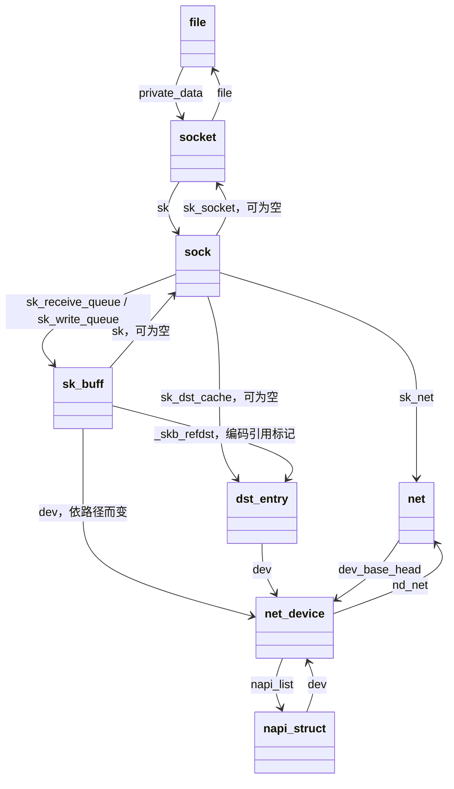

# 03 核心对象：引用与生命周期

本篇回答：谁代表一个包、一个连接、一个接口？八个核心对象如何关联？应用关闭后哪些对象仍可能存活？

前置阅读：[02 分层架构](02-layered-architecture.md)；引用计数、RCU（读侧低开销的并发回收机制）可补读 `../00-kernel-basics/`。预计阅读时间：15 分钟。源码基准：Linux v6.18。

## 按对象回答问题

| 对象 | 它代表什么 | 不应误认为 |
|---|---|---|
| `struct file` | 打开的文件对象，socket 也接入文件接口 | 一个 fd 数字；多个 fd 可以引用同一个文件 |
| `struct socket` | 应用可操作的套接字接口、操作表及等待设施 | TCP 全部状态 |
| `struct sock` | 公共协议状态，TCP 有进一步扩展 | 线上一个 TCP 包 |
| `struct sk_buff` | 报文描述及其数据引用、元数据 | 永远连续的一块内存，或永远一个线上帧 |
| `struct net_device` | 一个网络接口 | 仅物理网卡 |
| `struct napi_struct` | 一组网络事件的调度/轮询状态 | 一条连接，或必定一条硬件队列 |
| `struct dst_entry` | 路由结果等目的地处理信息的公共部分 | FIB 中的一条配置记录 |
| `struct net` | network namespace（网络命名空间）的网络状态容器 | 进程本身，或一个独占 CPU 的实例 |

## 关系图：箭头不是所有权证明

这是一张“可以沿什么字段找到谁”的图，不是八个对象同时存在、相互强引用的承诺。例如接收 skb 未必关联本地 socket，纯转发报文更不会凭空创建本机 TCP 连接；skb 的设备含义也随收发阶段改变。`_skb_refdst` 还带有是否持有引用的标记，必须通过辅助接口解释，不能当成普通裸指针处理，见 include/linux/skbuff.h:1146。

| 图中关系 | v6.18 核实位置 |
|---|---|
| file ↔ socket | net/socket.c:492；include/linux/fs.h:1216 |
| socket → sock、socket → 操作表 | include/linux/net.h:116 |
| sock → socket / net / dst | include/net/sock.h:448；include/net/sock.h:386；include/net/sock.h:498 |
| sock 的收发队列 | include/net/sock.h:399；include/net/sock.h:479 |
| skb → dev / sk / dst 编码 | include/linux/skbuff.h:885；include/linux/skbuff.h:906；include/linux/skbuff.h:922 |
| dst → dev | include/net/dst.h:26 |
| net_device → net / NAPI 列表 | include/linux/netdevice.h:2155；include/linux/netdevice.h:2183 |
| NAPI → dev / poll | include/linux/netdevice.h:379 |
| net → 设备列表 | include/net/net_namespace.h:101 |

## 谁让它出生，谁允许它回收

| 对象 | 创建/注册方 | 回收条件与负责者 | 源码锚点 |
|---|---|---|---|
| file | socket 创建路径接入 VFS 的文件分配 | 最后文件引用释放后由 VFS 释放并调用 socket 文件释放逻辑；关一个 fd 未必最后引用 | net/socket.c:476；net/socket.c:1453；fs/file_table.c:442 |
| socket | socket 核心分配，底层接入 socket inode（索引节点） | socket 释放路径调用协议 release；内核 socket 与绑定 file 的 socket 回收入口不同 | net/socket.c:688 |
| sock | 协议创建时分配；TCP 的对象包含扩展状态 | 协议释放队列、哈希、定时器等资源，引用和相关内存记账条件满足后回收；不要简化成 close 立即 free | net/ipv4/af_inet.c:328；include/net/sock.h:1969；net/core/sock.c:2404 |
| sk_buff | 驱动或协议等当前生产者分配/构造 | 当前持有者转交、消费或释放；skb 描述符引用与共享数据的引用分别管理，clone（克隆）不等于完整复制 | include/linux/skbuff.h:1097；include/linux/skbuff.h:593；net/core/skbuff.c:1164 |
| net_device | 驱动或虚拟接口实现分配，核心注册 | 停止使用并注销、解除外部依赖后由设备生命周期路径释放；注销和立即 free 不是一回事 | net/core/dev.c:12036；net/core/dev.c:12362 |
| napi_struct | 常嵌入驱动私有对象；驱动向设备注册 | 停用轮询、删除 NAPI、满足同步要求后才可回收承载它的对象 | include/linux/netdevice.h:2906；net/core/dev.c:7506 |
| dst_entry | 路由等子系统分配 | 引用释放到末尾后经 RCU 延迟销毁；可被 socket 或 skb 缓存关联 | net/core/dst.c:165 |
| net | namespace 核心创建，子系统初始化 per-net（每命名空间）状态 | namespace 引用和清理流程共同管理，各网络子系统退出后回收 | net/core/net_namespace.c:435；net/core/net_namespace.c:658 |

### 三种常见错觉

**“skb 是一个包的一切。”** skb 描述符与数据缓冲区可以分离，数据可以是非线性的，也可以被多个描述符共享。GSO/GRO 进一步打破“一 skb 等于一线上帧”的直觉。

**“TCP 一关闭，所有关系同时断开。”** 用户接口寿命与协议寿命不同。协议还可能处理关闭、重传和定时器；TIME_WAIT（连接关闭后的等待状态）也有专用的较小对象，不应把所有状态都画成永远持有完整 `tcp_sock`，定义见 include/net/inet_timewait_sock.h:33。

**“指针存在，所以计数一定加一。”** 许多指针由锁、RCU 或其他对象保证有效期，而非每个字段都持有独立强引用。对生命周期的判断必须追创建、转交、释放路径；include/net/sock.h:1958 还明确说明某些接收排队场景不能简单为包增加 socket 引用。

## 亲眼观察

对一个持续连接，在测试环境分别观察进程 fd、socket 状态、接口统计，再关闭应用接口。把看到的每项输出写在上表对应对象旁，回答“这个观测对象是否一定有一个 fd”。运行时观察留给 `../../labs/`，本篇未执行；对象回收顺序以源码为依据，不根据一次采样未看到某状态就认定它不存在。

## 要点回顾

- 八个对象覆盖文件、连接、包、设备、路由和命名空间等不同层次。
- 关系图的箭头只证明关联，不证明引用计数或独占所有权。
- skb 描述符与报文数据有不同的共享关系。
- 应用关闭与协议状态回收不是同一时刻。
- NAPI 的对象生命周期依附驱动/设备，轮询生命周期还需同步。

## 自测题

1. skb 的 `sk` 为 NULL 是否说明数据非法？
2. `dst_entry` 与 FIB 配置是否可以当成同一个对象？
3. 为什么不能看到一个字段指针就认定被指对象引用计数加了一？
4. 一个 TCP 连接是否必定一直有对应的用户态 fd？

答案

1. 否；不同路径对这个字段的需求不同，转发包不需要本地 TCP socket。
2. 不能；FIB 提供选路信息，dst 是路径结果/处理信息的公共抽象。
3. 有效期可能由锁、RCU 或其他对象保证，且可能是编码的无引用关联。
4. 否；协议对象可以在文件接口关闭后继续存在，监听建立过程也有不同的中间对象。

## 与 DPDK/VPP 的对照

skb 与 mbuf 都把数据和元数据关联起来，但 skb 还深入参与 socket 内存记账、协议重传、路由引用和共享数据生命周期。`net_device` 可类比接口抽象，`struct net` 可帮助理解一组隔离网络配置；它不等于 VPP 的一个转发表 ID，也不保证独立 CPU 或独立网卡。
