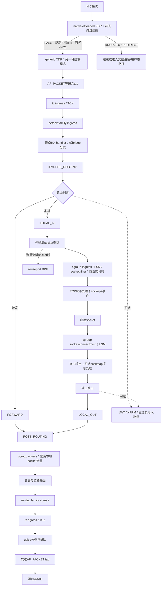

# 04 挂载点地图：在哪里处理与观察流量

本篇回答：XDP、tc、netfilter、socket filter、sockops 各在哪里？哪些点看本机流量，哪些点也看转发？安全产品为什么选择不同的位置？

前置阅读：[01](01-request-journey.md)、[02](02-layered-architecture.md)、[03](03-core-objects.md)。预计阅读时间：20 分钟。源码基准：Linux v6.18。

## 按经过的位置读图

hook（钩子）是已有路径中允许扩展处理的位置，不是一个统一的执行层。下图覆盖普通 IPv4 以太网主线与题目要求的主要可编程接口；bridge（网桥）、隧道、XFRM（IPsec 变换框架）和路由扩展另有分支，不能把一张主线图当成所有配置下的完整调用图。图中的可选节点只有在已配置且流量符合条件时才有程序运行。

图中 native/offloaded 和 generic XDP 表示可选模式，不暗示一个挂载必然执行两次。generic XDP 已有 skb；native XDP 通常在驱动接收的 skb 构造前运行，且具体驱动路径必须单独核查。接收 tap 的主线位置在 tc ingress 前，发送 tap 在后部设备发送路径；提前被 XDP 丢弃的包不能指望在常规 packet socket 抓包中看见。

## 包级位置和用途

| 挂载位置 | 能看见/改变什么 | 典型用途与边界 | v6.18 锚点 |
|---|---|---|---|
| XDP（可编程快速收包入口） | 较早解析报文字节，放行、丢弃、回送或重定向；offload 需硬件支持 | 入口粗粒度过滤、DDoS（分布式拒绝服务）清洗、四层分发；不自动提供完整 TCP 字节流 | 驱动例子 drivers/net/ethernet/intel/ixgbe/ixgbe_main.c:2417；generic net/core/dev.c:5889 |
| tc ingress / TCX（tc 的 BPF 连接机制） | skb 级分类、标记、丢弃、重定向，能结合设备与栈元数据 | 容器接口策略、东西向过滤、镜像、重定向；普通 ingress 不是一个等待后再发送的整形队列 | net/core/dev.c:4389；net/core/dev.c:5930 |
| tc egress / TCX | 输出设备处处理 skb，在实际发送排队前运行 | 出口策略、标记、流量重定向；不等于已发到线上 | net/core/dev.c:4453；net/core/dev.c:4705 |
| qdisc 分类/调度 | 在发送队列前分类、排队、调度或丢弃 | QoS（服务质量）、整形、主动队列管理；不同 qdisc 能力不同 | net/core/dev.c:4729；include/net/sch_generic.h:73 |
| netfilter 的 IPv4/IPv6 协议钩子 | 根据协议阶段检查、修改、丢弃、排队等 | 状态防火墙、NAT（网络地址转换）、连接跟踪；功能来自所注册的规则/模块，并非 hook 名字自带 | IPv4 五处见下表 |
| netfilter netdev ingress/egress | 在设备层挂接，与 IPv4 五钩子是不同 family（协议族） | 设备入口/出口过滤，包括尚未走到 IP 钩子的处理 | include/linux/netfilter_netdev.h:31；net/core/dev.c:4697 |
| socket filter（套接字过滤器） | 过滤交给某个 socket 的数据；也可作用于抓包 socket | 选择性采集、应用接收过滤；不是全机防火墙入口 | net/core/filter.c:134；net/packet/af_packet.c:2114 |
| AF_PACKET tap（链路报文旁路交付） | 把设备路径上的报文交给 packet socket | 抓包、被动 IDS（入侵检测）；抓到不代表 TCP 或应用最后接收成功 | net/core/dev.c:5911；net/core/dev.c:2528 |

这里的 netfilter 是调用框架，nftables（规则表达与执行框架）等实现把处理程序挂到它上面。conntrack（连接跟踪）描述防火墙观察到的流状态，不是应用 TCP socket 的替代品；普通转发防火墙可以跟踪 TCP 流而不终结 TCP 连接。

## 五个 netfilter 钩子不是一条串联链

| 内核名称 | IPv4 主线位置 | 适合回答的问题 | 源码锚点 |
|---|---|---|---|
| `NF_INET_PRE_ROUTING` | 收到 IP 包、首次路由决定前 | 进入的包是谁、目的地址是否需要先转换 | net/ipv4/ip_input.c:573 |
| `NF_INET_LOCAL_IN` | 已决定交给本机，上交传输协议前 | 是否允许到本机服务 | net/ipv4/ip_input.c:260 |
| `NF_INET_FORWARD` | 已决定转发 | 是否允许通过这台路由/安全设备 | net/ipv4/ip_forward.c:162 |
| `NF_INET_LOCAL_OUT` | 本机产生的 IP 包进入输出路径；通常已有初次路由结果 | 是否允许本机发起/发出这类流量 | net/ipv4/ip_output.c:120 |
| `NF_INET_POST_ROUTING` | 输出侧后段、普通邻居输出之前 | 出口过滤或源地址转换等 | net/ipv4/ip_output.c:438 |

典型本机输入经过 PRE_ROUTING → LOCAL_IN，转发经过 PRE_ROUTING → FORWARD → POST_ROUTING，本机输出经过 LOCAL_OUT → POST_ROUTING。修改地址、隧道、重定向、回环以及 bridge 配置可能导致再查路由或再入路径；主线不能推导“每包只经过某点一次”。同一 hook 上还存在优先级，不能把 conntrack、NAT、过滤规则当作任意互换的固定步骤。

## socket 与事件级扩展

| 接口 | 所在阶段和用途 | 核实锚点 |
|---|---|---|
| cgroup socket / sock_addr（按控制组管理 socket 或地址操作） | 创建 socket、connect/bind 等动作处约束或修改应用端点；适合按工作负载身份下发连接策略 | net/ipv4/af_inet.c:392；net/ipv4/af_inet.c:459；net/ipv4/tcp_ipv4.c:220 |
| cgroup skb ingress/egress | 对归属相应 socket/cgroup 的收发流量做策略；不要假定覆盖所有纯转发包 | net/core/filter.c:150；net/ipv4/ip_output.c:322 |
| sockops（socket 操作事件 BPF） | 在 TCP 事件处观察连接状态、调节允许的参数、获得回调；不是每包防火墙 | include/net/tcp.h:2780；net/ipv4/tcp_input.c:179 |
| sockmap/sockhash + sk_msg/sk_skb | 针对已纳入映射的 socket 执行消息判决、流解析/判决和重定向；用于代理等连接间数据处理 | net/core/sock_map.c:1486 |
| reuseport BPF（同端口 socket 选择） | 在一组复用端口的 socket 中选择接收目标；是本机服务分发的一种方式 | net/core/filter.c:1627；include/uapi/linux/bpf.h:1062 |
| LWT BPF（轻量隧道路由扩展） | 路由相关的输入、输出、发送扩展；适合选定路由的封装和重定向 | include/uapi/linux/bpf.h:1051 |
| flow dissector BPF（流字段解析） | 为栈的流解析需求提供字段，不是一条全包默认放行/丢弃链 | include/uapi/linux/bpf.h:1063 |
| LSM（Linux 安全模块） | socket 调用和接收等安全检查，与包过滤框架不同 | net/core/filter.c:157；net/socket.c:737 |
| tracepoint/kprobe 等追踪接口 | 观察处理事件、延迟、丢包原因；普通追踪程序不是通用转发判决入口 | 已核实的 NAPI trace 调用 net/core/dev.c:7595；完整追踪方案见 `../../traces/` |

这些接口有程序类型、允许访问的上下文和配置限制。不能因为都是 eBPF（内核验证并执行的可编程机制），就把一份程序原封不动地从 XDP 挪到 sockops；也不能认为 sockops 会自动重组 TCP 应用消息。

## 安全产品的选择：由位置推导

以下是基于位置和可用状态的选型建议，不是对特定产品实现的事实断言。

- **入口抗洪泛**：先用硬件过滤或 native XDP 拦截可低成本判定的流量，减少后续 skb、协议和状态处理开销。需要复杂关联或已重组内容的判决应移到有相应状态的位置；越早不等于能看见越多语义。
- **路由型状态防火墙**：围绕 netfilter 的转发路径和连接跟踪设计策略，明确本机管理服务另走输入路径。NAT 会改变不同钩子看到的地址，日志必须说明采样位置。
- **容器/主机微隔离**：tc 适合接口与转发视角，cgroup socket 接口适合应用身份与连接动作视角。跨 namespace 和虚拟设备可能多次经过设备路径，应先画实际拓扑再选 hook。
- **被动 IDS 与抓包**：packet socket 或镜像便于复制观察；需要说明采样前是否已被 XDP/tc 等丢弃，以及 GRO/GSO 对包形态的影响。被动观察点不能直接保证阻断效果。
- **代理、WAF（Web 应用防火墙）、应用层审计**：若判决依赖完整请求甚至明文，通常需要流重组、协议解析和适当的 TLS 终结位置。单个早期包级 hook 不自动具有这些条件；sockmap 等只是可用构件，不代替业务解析。

## 亲眼观察

在隔离实验拓扑中为 ingress、FORWARD、LOCAL_IN 分别配置计数，再比较“发给安全设备自身”和“穿过设备”的同一类流量。把早期丢弃点移动到 XDP 或 tc 后，再观察 packet socket 能否看见，记录设备、namespace、卸载开关和挂载模式。此处未运行规则/程序实验，不能把图中路径当作测得的计数结果。

## 要点回顾

- 主机输入、转发、主机输出走不同 netfilter 钩子组合。
- XDP 模式决定所处位置和可用条件。
- tc 与 qdisc 有分类/处理和排队调度的职责差异。
- socket filter、cgroup、sockops 面向不同对象与事件。
- 抓包可见性取决于观测点之前发生了什么。
- 安全判决需要的语义决定位置，不能只按早晚选点。

## 自测题

1. 纯转发 TCP 包是否会经过本机 LOCAL_IN 和普通应用 sockops？
2. 为什么 tcpdump 没抓到包不能证明网卡没有收到？
3. 为什么 connect 策略适合 cgroup socket 接口而不一定适合 XDP？
4. 拦截完整 HTTP 请求需要早期 hook 自动提供哪些实际并不保证存在的条件？

答案

1. 普通转发主线不会；它不在本机终结该 TCP 连接。
2. 包可能在观测点前被硬件或 XDP 丢弃，或走了其他路径。
3. connect 动作有应用/socket 上下文；XDP 处通常只有早期报文和设备等上下文。
4. 跨包的有序流、完整消息边界、协议解析；加密流量还需要合适的解密条件。

## 与 DPDK/VPP 的对照

可把 hook 看作已建数据路径中的扩展入口，把 tc/XDP 的处理链与熟悉的分类和 graph 处理作有限类比。Linux hook 的上下文、生命周期、可见对象各异；VPP 自行设计一段 graph 的自由度，不能直接套成“任何 hook 都能任意做全栈操作”。
