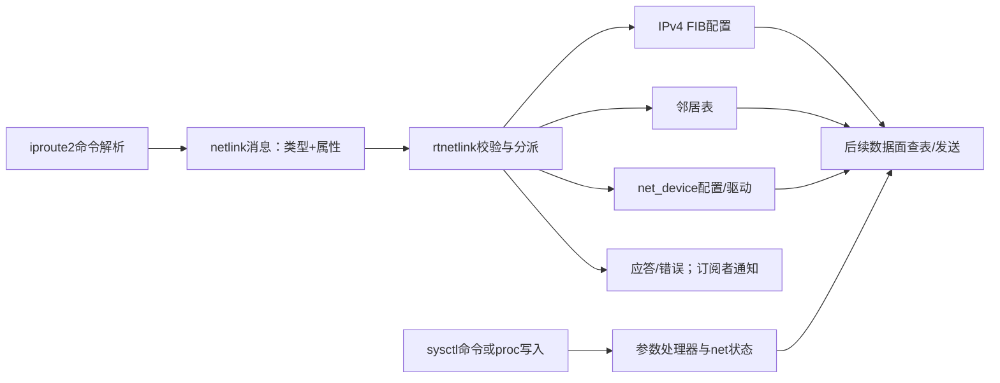

# 05 控制面：配置如何进入网络栈

本篇回答：iproute2 如何改变路由、邻居和设备？netlink 与 rtnetlink 有何区别？sysctl 改的是哪里，何时生效？

前置阅读：[02 分层架构](02-layered-architecture.md)、[03 核心对象](03-core-objects.md)。预计阅读时间：15 分钟。源码基准：Linux v6.18；用户态命令映射另核对 iproute2 v6.18.0。

## 配置不是直接修改某个数据包

data plane（数据面）用已有配置处理每个包；control plane（控制面）维护接口、地址、路由和策略。配置命令可以影响之后的包处理，但控制命令成功只说明相应内核操作成功，不证明某个目的地可达，也不证明一个 TCP 请求成功。

netlink（内核与用户态之间的消息接口）是通信机制。rtnetlink 是承载路由、设备、地址、邻居等管理消息的 netlink 接口。它和 `net/ipv4/route.c` 不是同一个东西；rtnetlink 命令处理最终会委托给相应子系统。



## 三条配置链

下表中的命令是语义示例，`IFACE` 是实验接口占位符；本篇没有执行这些修改。先在 `../../env/` 准备的隔离环境选择真实接口，避免把示例网络当成当前主机拓扑。

| 命令意图 | 用户态到消息 | 内核分派与结果 |
|---|---|---|
| `ip route add 198.51.100.0/24 via 192.0.2.1 dev IFACE` | `RTM_NEWROUTE`，附目标前缀、网关、接口等属性；add 还带创建/排他标志 | net/ipv4/fib_frontend.c:1695 注册处理；net/ipv4/fib_frontend.c:910 解析配置并插入目标 FIB 表 |
| `ip neigh replace 192.0.2.1 lladdr 02:00:00:00:00:01 dev IFACE nud permanent` | `RTM_NEWNEIGH`，允许创建或替换，带邻居地址、链路地址、接口和状态 | net/core/neighbour.c:3917 注册；net/core/neighbour.c:1993 更新邻居子系统 |
| `ip link set dev IFACE mtu 1400` | iproute2 的 set 使用 `RTM_NEWLINK`，这里不应只凭名字写成 `RTM_SETLINK` | net/core/rtnetlink.c:7054 注册；net/core/rtnetlink.c:3954 处理已有设备的属性更新或相应新建分支 |

上述用户态映射来自实际访问的 [iproute2 v6.18.0 路由命令源码](https://raw.githubusercontent.com/iproute2/iproute2/v6.18.0/ip/iproute.c)、[邻居命令源码](https://raw.githubusercontent.com/iproute2/iproute2/v6.18.0/ip/ipneigh.c)、[设备命令源码](https://raw.githubusercontent.com/iproute2/iproute2/v6.18.0/ip/iplink.c)。这里固定版本核对命令行为，不假定实验机恰好安装同版本。

内核共同分派入口见 net/core/rtnetlink.c:6852。FIB（转发信息库）负责网络层选路，邻居表负责当前链路下一跳可达性，设备配置决定接口行为；它们有关联但不替代彼此。添加一条路由不等于已经得到下一跳 MAC，静态邻居项也不自动建立一条到远端网段的路由。

读取与修改走相同管理体系中的不同请求。用于监视的订阅通知允许管理程序跟踪变化，但不能把某次 dump（批量查询）当成对所有网络状态永久一致的快照；数据面与配置仍在并发变化。

## sysctl：先找参数表，再找读取点

sysctl（运行时内核参数接口）通常通过 `/proc/sys/` 暴露参数，但名字相似不表示都在一个文件里实现。下面的名字与读写锚点均已核实。

| 参数 | 注册/处理位置 | 生效思路 |
|---|---|---|
| `net.ipv4.tcp_rmem` | net/ipv4/sysctl_net_ipv4.c:1429 | TCP 接收内存的三档参数；初始化 socket 使用中间值，不能简单说修改后所有既有连接立刻改成这个值 |
| `net.ipv4.tcp_wmem` | net/ipv4/sysctl_net_ipv4.c:1421 | TCP 发送内存的三档参数；初始化和运行期间不同路径读取不同元素 |
| `net.ipv4.ip_forward` | net/ipv4/devinet.c:2734 | IPv4 转发配置，带专门处理器；不能因名字在 ipv4 下就断定实现在 sysctl_net_ipv4.c |

`tcp_rmem`/`tcp_wmem` 的初始化读取见 net/ipv4/tcp.c:491；发送处理中读取最低档的例子见 net/ipv4/tcp.c:1017。因此理解一个参数至少要回答三个问题：写入哪个变量、谁读取、读取时连接处于哪个阶段。参数范围检查、特例和内存压力行为留到 TCP 设计篇。

网络命名空间让许多网络状态和参数拥有各自实例。v6.18 的 IPv4 sysctl 注册会为新 namespace 调整表项的数据指针；同时明确处理没有独立数据指针的全局条目，所以不能泛化成“所有网络 sysctl 都按 namespace 隔离”，见 net/ipv4/sysctl_net_ipv4.c:1617。`struct net` 的 IPv4、设备列表和 rtnetlink 状态可在 include/net/net_namespace.h:101、include/net/net_namespace.h:136 定位。

## 亲眼观察

以下都是只读命令，可在实验 namespace 内分别运行，比较路由、实际选路结果、邻居状态和参数：

```sh
ip route show
ip route get 198.51.100.2
ip neigh show
ip -details link show
sysctl net.ipv4.tcp_rmem net.ipv4.tcp_wmem net.ipv4.ip_forward
```

观察任务：解释为什么“有路由但邻居未解析”与“无匹配路由”是两类故障；再记录命令运行所在 namespace。该实验未在本任务执行，不提供伪造的输出。命令若不存在，先按环境篇安装工具；不要从命令失败推断内核不支持该网络机制。

## 要点回顾

- netlink 是消息机制，rtnetlink 管理多种网络对象。
- 命令最终更新的是子系统状态，数据面随后使用它。
- FIB、邻居表、接口配置解决三个不同问题。
- iproute2 的 link set 可以使用 RTM_NEWLINK。
- 参数表和参数读取点共同决定 sysctl 的生效范围与时机。
- namespace 隔离有具体实现边界，不能一概而论。

## 自测题

1. 路由添加成功能否证明网关 MAC 已经可用？
2. 为什么不能从 `ip link set` 的文字猜出消息一定叫 RTM_SETLINK？
3. 修改 TCP 默认内存参数是否必然重置所有既有 socket？
4. 如何在源码里判断一个 sysctl 是否按 namespace 保存？

<details>
<summary>答案</summary>

1. 不能；选路与邻居可达性是分开的状态。
2. 用户态命令语义与消息名不是机械映射；固定版本源码显示其使用 RTM_NEWLINK。
3. 不必然；要查读取点，有些值在初始化时使用，另一些在运行中读取。
4. 查注册表指针、新 namespace 初始化和实际读取路径，不只看 `/proc/sys/net` 的目录名。

</details>

## 与 DPDK/VPP 的对照

可把 iproute2 → rtnetlink → 子系统状态类比成控制程序通过 API 更新数据面表项。Linux 的 FIB 与邻居、设备对象相互关联，且受 namespace、权限和并发回收约束；一个 VPP CLI 命令的存在不意味着 Linux 有完全相同的表结构或更新时序。
