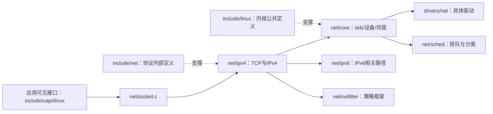

# 06 源码目录地图与实际规模

本篇回答：从哪些目录开始读？网络代码有多大？以用户态 TCP 栈为目标，哪里应精读、了解或暂缓？

前置阅读：[02 分层架构](02-layered-architecture.md)、[03 核心对象](03-core-objects.md)。预计阅读时间：12 分钟。源码基准：Linux v6.18。

## 先辨认实现、内部接口和用户接口

`net/` 以协议和公共网络子系统实现为主。`include/net/` 放大量栈内部协议对象和接口；`include/linux/` 放内核公共设施以及 skb、设备、TCP 等结构定义，但整个目录远不止网络。`drivers/net/` 面向具体设备或设备类型；`include/uapi/linux/` 则提供面向用户态的接口定义，不应把 UAPI（用户态应用接口）与内核内部对象混用。



同一机制的定义与实现可以跨多个目录。比如 TCP 的对象见 include/linux/tcp.h:200、内部协议接口见 include/net/tcp.h:1230，而算法主体在 `net/ipv4/tcp*.c`。TCP 的不少公共算法也服务 IPv6，不能把 `net/ipv4/` 误读为“只会处理 IPv4 的全部代码”。

## 统计方法与结果

本次实际在 v6.18 源码上执行了 `wc -l`。只计 `git ls-files` 返回的、后缀为 `.c` 或 `.h` 的已跟踪文件；统计的是物理行数，**包括注释与空行，不是去除注释后的净代码行数**。不计 Kconfig、Makefile、文档、汇编和未跟踪文件；`include/linux` 全量结果不能当成网络子集的大小。

| 目录/集合 | C/H 文件数 | 物理行数 | 阅读定位 |
|---|---:|---:|---|
| `net/` | 1,811 | 1,304,636 | 整体参考，不要求通读 |
| `net/core/` | 74 | 88,089 | 精读 skb、sock、设备主线；其他按需 |
| `net/ipv4/` | 134 | 114,700 | 精读 TCP 与 IPv4 主线；并非所有文件同等优先 |
| `net/ipv6/` | 103 | 77,813 | 了解；IPv4 主线后补 IPv6 差异 |
| `net/sched/` | 81 | 62,658 | 了解；精读与 pacing/排队相关的小范围 |
| `net/netfilter/` | 257 | 131,739 | 了解；安全产品方向可单独深化 |
| `net/packet/` | 3 | 5,239 | 了解；用于抓包可见性 |
| `net/netlink/` | 6 | 5,798 | 了解；控制面消息基础 |
| `net/bridge/` | 62 | 37,268 | 了解；透明安全设备需要深化 |
| `net/xdp/` | 9 | 4,117 | 了解；XDP 代码还分布在 core、BPF 和驱动中 |
| `net/xfrm/` | 22 | 23,405 | 可先不管；IPsec 产品需求另论 |
| `net/mptcp/` | 24 | 17,831 | 可先不管；先完成普通 TCP 心智模型 |
| `net/unix/` | 6 | 5,286 | 可先不管；保留 socket 不只等于 TCP 的认识 |
| `include/net/` | 383 | 116,215 | 精读当前协议对象和接口；不连续读完整目录 |
| `include/linux/` 全量 | 2,747 | 640,312 | 混合全内核头文件，仅作规模参照 |
| `include/linux/` 指定 22 个网络相关头文件 | 22 | 21,956 | 精读核心对象，其他了解；不是完整网络头文件集合 |
| `drivers/net/` | 6,049 | 5,185,739 | 选一种实验驱动了解主线，其余可先不管 |
| `drivers/net/ethernet/` | 3,044 | 2,620,918 | 按 NIC 选目录，不逐厂商阅读 |
| `drivers/net/wireless/` | 2,090 | 1,933,741 | 可先不管 |
| `drivers/net/phy/` | 118 | 92,331 | 可先不管；链路故障再深入 |

父目录包含子目录，表中各行不能相加求总数。22 个头文件的精确清单保存在统计脚本的 `SELECTED_HEADERS`；选择集合是为本篇对象地图服务，不能用这 21,956 行声称涵盖全部网络公共定义。

原始结果见 [SOURCE-STATS.tsv](SOURCE-STATS.tsv)，复现脚本见 [count-source-lines.py](count-source-lines.py)。在本仓库根目录运行：

```sh
python3 notes/01-overview/count-source-lines.py /home/chen/code/linux-lab/src/linux-6.18
```

脚本先核对 `git describe --always --dirty --tags` 为 `v6.18`，再分批调用 `wc -l`；只读源码，不修改内核仓库。行数表达阅读范围，不能用来推算算法复杂度、运行开销或学习天数。

## 三档阅读清单

| 档位 | 目录/文件 | 读到什么程度 | 对应后续章节 |
|---|---|---|---|
| **做用户态 TCP 栈需要精读** | `net/ipv4/tcp.c`、`tcp_input.c`、`tcp_output.c`、`tcp_timer.c` | 字节流接口、状态推进、发送/确认/重传、定时器触发条件 | `../02-datapath/tcp/`、`../03-tcp-design/` |
| **做用户态 TCP 栈需要精读** | `tcp_ipv4.c`、`tcp_minisocks.c`、`tcp_cong.c` | 端点查找、建立/关闭的对象转换、拥塞算法接口；按主线选择片段 | 同上 |
| **做用户态 TCP 栈需要精读** | `include/linux/tcp.h`、`include/net/tcp.h`、`include/net/sock.h` | 状态字段、计时单位、队列归属、公共/协议专用部分 | TCP 机制与设计 |
| **做用户态 TCP 栈需要精读** | `include/linux/skbuff.h`、`net/core/skbuff.c` | 缓冲区、共享、引用与数据所有权；不要求复制 Linux 内存布局 | `../02-datapath/rx-tx/` |
| **做用户态 TCP 栈需要精读** | `ip_input.c`、`ip_output.c`、`route.c` 的交接点 | TCP 需要 IP 提供什么、错误与 MTU 信息如何关联 | 收发路径 |
| **需要了解** | `net/socket.c`、`net/ipv4/af_inet.c`、`net/core/sock.c` | Linux 应用 API、操作表、内存与并发边界 | 内核基础、TCP 设计 |
| **需要了解** | `net/core/dev.c`、`net/sched/`、`include/linux/netdevice.h` | NAPI、发送调度、驱动交接；区分机制与部署参数 | 收发路径 |
| **需要了解** | `net/ipv4/fib_*`、`net/core/neighbour.c`、`net/ipv4/arp.c` | 路由、邻居和控制面的职责；先不钻完整 trie 实现 | 本目录 05、收发路径 |
| **需要了解** | `net/ipv6/`、`net/netfilter/`、`net/packet/`、`net/xdp/` | 主线差异、策略位置、抓包边界、可编程入口 | 本目录 04、实验 |
| **需要了解** | 实验实际使用的一种 `drivers/net/` 驱动 | RX/TX、DMA 和完成处理，认清驱动特例 | 收发路径 |
| **可以先不管** | 其他 NIC、无线、PHY 的硬件细节；MPTCP、IPsec、冷门协议 | 知道位置即可，有需求再展开 | 后续专题 |

这里的档位是围绕用户态 TCP 学习目标的建议，不是源码重要性排名。你已有 DPDK/VPP 经验，应把时间优先用在连接状态、重传和应用交付的差异上，设备描述符细节可以按实验需要补足。

核实过的定位入口：TCP 文件清单来自 net/ipv4/Makefile:10；FIB 文件清单来自 net/ipv4/Makefile:15；NAPI 主循环见 net/core/dev.c:7745；IPv4 本地交付见 net/ipv4/ip_input.c:248；TCP 拥塞控制接口见 include/net/tcp.h:1230。

## 要点回顾

- 先定位对象和主线，再读完整机制。
- `net/ipv4/` 含大量 TCP 公共逻辑，IPv6 也复用相关机制。
- include/net 与 include/linux 是接口/对象入口，不是独立数据路径。
- 本次统计是 C/H 物理行数，不是净代码行数。
- 驱动目录规模很大，但不构成阅读 TCP 的全量前置。

## 自测题

1. 为什么不能把表中所有行相加？
2. 为什么读到 include/linux/tcp.h 还不等于找到 TCP 状态转换实现？
3. 第一轮学习为什么不要求通读所有 NIC 驱动？

<details>
<summary>答案</summary>

1. 父子目录重叠，且选定头文件又属于 include/linux 全量集合。
2. 这里主要定义状态布局；状态更新在协议实现路径中。
3. 驱动有大量硬件差异，目标是掌握交接契约与 TCP 机制，选一种可实验的驱动已能建立主线。

</details>

## 与 DPDK/VPP 的对照

像读 DPDK 时不会先通读所有 PMD（轮询模式驱动）一样，读 Linux TCP 也不需要先穷尽驱动目录。不同之处是 Linux 中大量共享协议逻辑、应用接口和并发设施跨目录分布，需要同时维护对象图与执行上下文图。
