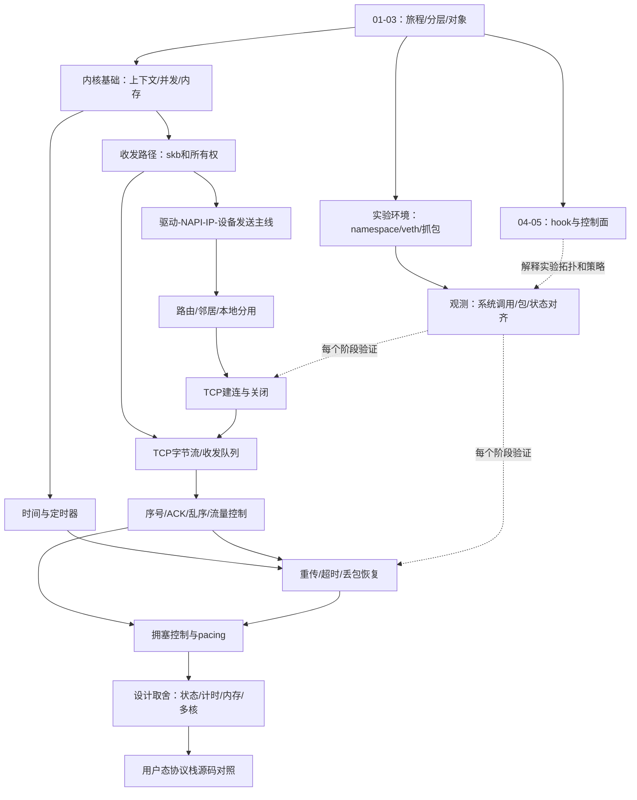

# 08 学习依赖图与推荐顺序

本篇回答：学习 TCP 机制前必须先掌握什么？哪些主题可并行补充？怎样用实验验证自己的理解？

前置阅读：[01 一个请求的旅程](01-request-journey.md)、[06 源码目录地图](06-source-map.md)。预计阅读时间：10 分钟。源码基准：Linux v6.18；本篇是课程安排建议，不是内核调用图。

## 依赖的是问题，不是阅读页数

长期目标是独立设计用户态 TCP 栈，因此先掌握字节流、连接状态、可靠交付、计时和资源所有权，再研究 Linux 的具体优化。已有 DPDK/VPP 经验可以减少网卡队列、收发循环、路由基础的补课时间，但不能跳过“数据被网卡消费后，为何仍需为重传保存”的生命周期问题。

实线表示建议先具备的理解，虚线表示验证和补充关系。图不要求“所有内核基础学完才开始抓包”：第一次抓包可以立即做，不理解的上下文和对象再回补。

## 八个学习站点

| 站点 | 阅读范围 | 应能回答的问题 | 动手验收：在隔离环境中观察 |
|---|---|---|---|
| 1. 建地图 | 本目录 01–03；基础目录的导读 | 包、连接、fd 各由谁表示？ | 在同一次连接中对齐应用、socket 与接口三个视角 |
| 2. 能复现实验 | `../../env/`、`../../traces/`、本目录 05 | 这条路由、邻居和参数属于哪个 namespace？ | 画拓扑，记录路由/邻居，确认流量是本机还是转发 |
| 3. 缓冲区与执行上下文 | 基础目录、收发路径目录 | 哪段代码在进程/NAPI 上下文？谁持有数据？ | 对比发送接口完成、设备完成、TCP ACK 的时间点 |
| 4. 建连、交付、关闭 | TCP 机制目录的状态与接口主题 | 为什么监听、建立请求、已连接对象不同？ | 抓握手和关闭，并对齐应用 accept/读取行为 |
| 5. 可靠性与流控 | TCP 机制目录的序号、ACK、乱序、窗口 | 缺一段数据时哪些字节可交付？ | 受控丢包/乱序与慢读，分开观察恢复和零窗口 |
| 6. 超时、拥塞与节奏 | TCP 机制、TCP 设计目录 | 超时与 ACK 分别触发什么？窗口与速率有何不同？ | 受控延迟/丢包改变反馈，记录重传与在途变化 |
| 7. 架构取舍 | TCP 设计目录、用户态协议栈目录 | 若改变线程与内存模型，哪些协议不变量仍要保留？ | 对照两个栈的状态归属、计时源、队列和驱动交接 |
| 8. 回到安全场景 | 本目录 04、收发路径、实验目录 | 安全判决需要哪些层次的状态？ | 对比入口过滤、转发规则、本机 socket 规则的可见性 |

动手项是学习验收标准，不是本任务已执行的实验记录；实际脚本、预期结果和参考答案由 `../../labs/` 提供。本目录不实现用户态 TCP 栈，也不要求用自己写的半成品栈来验证最初概念。

## 阅读时固定问五句话

1. 当前输入是应用字节、skb、协议事件还是配置消息？
2. 当前状态属于连接、设备、CPU 还是 namespace？
3. 谁持有数据，函数返回或事件完成后谁继续负责？
4. 下一步是立即执行、排队等待，还是仅安排定时器？
5. 这个结论是协议约束、Linux 实现选择，还是实验部署条件？

这些问题对应的源码定位点是：socket 绑定 net/socket.c:476、skb 描述 include/linux/skbuff.h:885、TCP 输入 net/ipv4/tcp_input.c:6259、TCP 输出 net/ipv4/tcp_output.c:2901、NAPI 主循环 net/core/dev.c:7745。这里仅给定位，不展开逐函数跟读。

## 何时回补，何时暂缓

看到 `sock` 字段却不知道谁释放它，回补对象与并发；看到某次重传却不知道定时器为何已启动，回补时间线；抓包与程序写入次数不同，先查字节流和卸载，不急着判断 TCP 错了。碰到不影响当前实验问题的某厂商寄存器、无线协议或 MPTCP 扩展，可以按第 06 篇暂缓。

第一轮以“能解释并复现”作为完成标准。第二轮再追慢路径和异常路径，例如资源不足、半连接压力、并发关闭、路由变化与大量重传；这些是用户态栈设计的重要输入，但不应让第一次建立整体地图停在某个细节里。

## 要点回顾

- 地图、环境和基础可以交错推进。
- 对象所有权与时间线是从转发经验走向 TCP 设计的桥梁。
- 先掌握可靠性与流控，再深入拥塞控制和性能取舍。
- 每阶段都用一项可观察现象验收。
- 协议不变量与 Linux 实现选择应分开记录。

## 自测题

1. 为什么已熟悉 TX ring 仍需学习 TCP 发送数据的生命周期？
2. ACK 驱动处理与超时驱动处理为何需要一起读？
3. 想解释 tc 与 netfilter 计数不同，最先应画什么图？
4. 第一轮读到无线驱动特例时，是否必须把它读完才能继续 TCP？

答案

1. TX 完成只是设备交接结束，可靠传输还需要处理确认、重传和字节流交付。
2. 同一连接可由收到反馈或时间事件推进，不同时理解会遗漏触发条件与状态约束。
3. 实际网络拓扑与挂载点路径图，注明 namespace、本机/转发方向和提前处理点。
4. 不必；先判断它是否属于当前问题的依赖，按目标选择阅读范围。

## 与 DPDK/VPP 的对照

你已有的包处理经验使第 2、3 站更容易开展。真正需要新增的能力，是把一批独立报文串成跨时间推进的连接状态，并把资源回收、ACK、超时和应用可读事件放在同一条因果链上。
