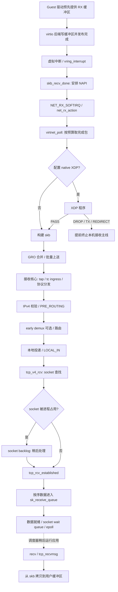

# 01 收包：从 virtqueue 到 recv()

本篇回答：谁提供 RX 缓冲区？中断、NAPI 和软中断分别做什么？skb 怎样找到 TCP socket？数据就绪、epoll 唤醒和 `recv()` 拷贝是什么关系？

前置阅读：熟悉 Ethernet/IPv4/TCP、DPDK RX descriptor 与 mbuf 即可；内核基础章可并行阅读，不要求已经完成。预计阅读时间：45–60 分钟，实验另需 30 分钟。

源码基准：`/home/chen/code/linux-lab/src/linux-6.18`，本次已执行 `git describe --always --dirty --tags`，结果为 `v6.18`。下文 `文件路径:行号` 均相对该源码根目录。

范围：x86_64、普通非 PREEMPT_RT 内核、virtio-net PCI、IPv4、本机已建立 TCP 连接、普通 socket copy 接口。主线默认没有 native XDP 程序、没有 AF_XDP、没有 RPS、没有 threaded NAPI/busy polling；分支在相应位置说明。这里的“包”可能已经是合并后的大 skb，不保证等于一个线上的 Ethernet frame（以太网帧）。

## 总览：两段执行，中间靠队列衔接



上半段由接收事件推动；下半段由应用执行系统调用推动。唤醒只是使等待者可以继续运行，不是立即把数据拷进用户缓冲区。应用也可能先调用阻塞 `recv()`，睡眠后再继续同一次调用。

## 1. 缓冲区先到位，设备才能收包

DPDK PMD 会先把可写 buffer 地址交给 RX descriptor。virtio-net guest 驱动也必须预先交出可写缓冲区，但“网卡 DMA 写入 RX ring”要拆成两个对象：设备把报文内容写到 descriptor 指向的缓冲区，再发布 descriptor 完成状态；报文不存放在 ring 元数据里。

对于 QEMU 的软件 virtio 后端，guest 看到的是 virtqueue（虚拟队列）协议，不能把它一律理解成物理 PCIe 网卡 DMA。具体由 QEMU、vhost 或其他后端怎样访问 guest 内存，超出本篇 guest 源码核查范围；是否真实 DMA 取决于后端。这不是每包先进入 guest 内核某个“统一 RX ring”的软件调用。

| 函数与位置 | 做什么 |
|---|---|
| `try_fill_recv()`，`drivers/net/virtio_net.c:2827` | 按协商后的 RX 模式补充 virtqueue；空闲 descriptor 用完或分配失败时结束，必要时通知后端。 |
| `add_recvbuf_small()`，`drivers/net/virtio_net.c:2668` | `skb_page_frag_refill()` 配合 `rq->alloc_frag` 提供页片段，经 `virtnet_rq_alloc()` 取得 buffer，再提交预映射的输入 scatterlist（离散内存列表）。 |
| `add_recvbuf_big()`，`drivers/net/virtio_net.c:2700` | 用 `get_a_page()` 取得多个 page，以 `page->private` 串起缓存页链，组织较大的 scatterlist。 |
| `add_recvbuf_mergeable()`，`drivers/net/virtio_net.c:2766` | 使用页片段；一个报文可消费多个可合并 RX buffer，后续按 virtio header 的 `num_buffers` 取回。 |
| `virtnet_receive()`，`drivers/net/virtio_net.c:3022` | 消费一批之后根据空闲 descriptor 数补充；原子分配失败可安排延迟 refill 工作。 |

**v6.18 的 virtio_net 没有使用 page_pool。** 已对 `drivers/net/virtio_net.c` 搜索 `page_pool`，无匹配，实际分配路径如上。`page_pool`（页池）是可由驱动选择使用的页分配、回收及 DMA 映射管理设施，不能画进所有驱动的必经链。其接口说明见 `include/net/page_pool/helpers.h:14`，分配入口是 `net/core/page_pool.c:669` 的 `page_pool_alloc_pages()`，释放接口是 `include/net/page_pool/helpers.h:360` 的 `page_pool_put_page()`；启用 DMA 映射和同步还依赖池参数。`rq->xsk_pool` 非空时，virtio-net 又走 `try_fill_recv()` 中单独的 AF_XDP buffer 路径，本篇不展开。

物理网卡可对照 `igb_alloc_rx_buffers()`，`drivers/net/ethernet/intel/igb/igb_main.c:9208`，以及 `ice_alloc_rx_bufs()`，`drivers/net/ethernet/intel/ice/ice_txrx.c:883`：它们填设备专用 descriptor，使用设备 DMA 地址。不要因为它们是物理驱动就自动假定使用 page_pool；本次检查的这两个普通 RX 源文件同样以自身页面管理路径为主。

## 2. 中断负责安排工作，poll 才收包

以下为每队列 MSI-X（消息信号中断扩展）的一条代表路径；共享中断还会经过 virtio PCI 分发器。

| 顺序 | 函数与源码位置 | 状态变化与后续影响 |
|---|---|---|
| 1 | `vring_interrupt()`，`drivers/virtio/virtio_ring.c:2693` | 检查是否存在 used buffer，调用该 virtqueue 的 callback；每队列 IRQ 注册见 `drivers/virtio/virtio_pci_common.c:365`。 |
| 2 | `skb_recv_done()`，`drivers/net/virtio_net.c:2861` | 找到 RX queue，把其 NAPI 实例交给 `virtqueue_napi_schedule()`。 |
| 3 | `virtqueue_napi_schedule()`，`drivers/net/virtio_net.c:751` | `napi_schedule_prep()` 防重复调度，抑制 virtqueue 回调，再 `__napi_schedule()`。 |
| 4 | `__napi_schedule()`，`net/core/dev.c:6588` → `____napi_schedule()`，`net/core/dev.c:4842` | 普通模式把 NAPI 放到当前 CPU 的 poll list，需要时 raise `NET_RX_SOFTIRQ`（网络接收软中断）。 |
| 5 | `net_rx_action()`，`net/core/dev.c:7745` | 从该 CPU 的 poll list 取实例，经 `napi_poll()`，`net/core/dev.c:7647` 调度。 |
| 6 | `__napi_poll()`，`net/core/dev.c:7580` | 以 `napi->weight` 作为本次驱动 budget，调用 `napi->poll()`。 |
| 7 | `virtnet_poll()`，`drivers/net/virtio_net.c:3114` | 先尝试清理 TX，再调用 `virtnet_receive()`；`virtnet_receive_packets()`，`drivers/net/virtio_net.c:2994` 按预算取 RX 完成包。 |
| 8 | `virtqueue_napi_complete()`，`drivers/net/virtio_net.c:760` | 当接收数小于 budget 时尝试完成本轮；准备恢复回调后再次检查队列，避免“最后检查与重新开通知之间有新包”的丢唤醒竞争。 |

NAPI 是中断触发、批量轮询接收的一套调度接口，不是一个必须永久占用 CPU 的线程。源码也支持 threaded NAPI：`____napi_schedule()` 可直接唤醒 NAPI 线程；本篇图画的是普通软中断模式。软中断可在中断退出后的合适位置执行，负载等条件下也可交给 `ksoftirqd`；因此 trace 中的进程名不固定为 `ksoftirqd`。通用执行与限时逻辑见 `kernel/softirq.c:579` 的 `handle_softirqs()`。

不要把三个预算混为一个：

1. **驱动本次 poll 的包预算**：`__napi_poll()` 传入 `weight`。virtio-net 的 `virtnet_receive_packets()` 按完成的报文数递增；mergeable 的一个报文可能用掉多个 buffer。TX 清理不是同一个“收了几个包”的计数。
2. **本 CPU 一轮 net_rx_action 的总预算**：`net/core/dev.c:7749` 读取 `netdev_budget_usecs` 与 `netdev_budget`，每完成一次 `napi_poll()` 后扣已完成工作并检查时间。时间使用 jiffies 检查，不是能在驱动函数中途强行打断的精确微秒闸门；最后一个 poll 也可能让总包预算被越过。
3. **通用 softirq 的执行限制**：`kernel/softirq.c:543` 与 `kernel/softirq.c:579` 还有全局软中断处理的时间/重试限制。这不是把 NET_RX 的 budget 简单重复一遍。

`work == weight` 时，通用 NAPI 代码按“可能还有工作”处理并安排 repoll；它不能据此断言 ring 一定没清空。virtio-net RX 权重赋值与 RX/TX NAPI 注册见 `drivers/net/virtio_net.c:6557`。

## 3. native XDP、skb、GRO 是不同阶段

`receive_buf()`，`drivers/net/virtio_net.c:2618` 根据模式进入 `receive_small()`（`drivers/net/virtio_net.c:2044`）、`receive_big()`（`drivers/net/virtio_net.c:2096`）或 `receive_mergeable()`（`drivers/net/virtio_net.c:2462`）。这些模式不能硬套一条完全相同的 skb 构建链。

small 的 native XDP 分支在 `receive_small_xdp()`，`drivers/net/virtio_net.c:1953`；mergeable 的入口在 `receive_mergeable_xdp()`，`drivers/net/virtio_net.c:2359`。它们在构建最终交给协议栈的 skb 前调用 `virtnet_xdp_handler()`，`drivers/net/virtio_net.c:1791`。XDP（eXpress Data Path，靠近驱动的可编程包处理）返回 PASS 才继续本机协议栈；DROP 丢弃，TX 回发，REDIRECT 重定向。big 分支没有这个 native XDP 调用，能否安装程序受 `virtnet_xdp_set()`，`drivers/net/virtio_net.c:6042` 的配置检查限制，不能据此认为“任何 RX 模式都支持同一个 XDP 路径”。

构建 skb 不等于复制整包。small 可围绕原来的页片段构建 metadata；mergeable 会组合多个 buffer 的 page fragment。`page_to_skb()`，`drivers/net/virtio_net.c:847` 内又有头部拷贝与 fragment 组织，不能一律声称“完全零拷贝”。

`virtnet_receive_done()`，`drivers/net/virtio_net.c:2577` 检查 virtio 的 checksum/GSO 元信息，记录 RX queue，调用 `eth_type_trans()` 设置协议，然后进入 GRO（Generic Receive Offload，通用接收合并）：

| 函数与位置 | 作用 |
|---|---|
| `napi_gro_receive()`，`include/linux/netdevice.h:4190` | v6.18 中是内联包装，调用 `gro_receive_skb()`；不要把它当成必然可挂 kprobe 的独立符号。 |
| `gro_receive_skb()`，`net/core/gro.c:624` | 经 `dev_gro_receive()` 与 `gro_skb_finish()` 决定合并、暂存或正常上送。 |
| `gro_normal_one()`，`include/net/gro.h:538` | 把正常上送的 skb 加入 list，达到批量阈值可批量提交。 |
| `gro_normal_list()`，`include/net/gro.h:520` | 调用 `netif_receive_skb_list_internal()`，送出当前 batch；flush 也能触发。 |

GRO 是减少后续协议栈逐包工作，不是 TCP 字节流乱序重组，也不是 `recv()` 一次读到几个报文的保证。GRO 合并与 virtio 的 mergeable buffers 是两回事：前者合并协议兼容的 skb，后者是设备的一条报文占用多个 RX buffer。

## 4. 协议无关接收核心到 IPv4 本地投递

这一段在 v6.18 常见的是 **list 路径**，不能只追单包 `ip_rcv()`：

| 函数与位置 | 做什么 |
|---|---|
| `netif_receive_skb_list_internal()`，`net/core/dev.c:6283` | 做时间戳与可选 RPS 分流，再进入 `__netif_receive_skb_list()`，`net/core/dev.c:6197`。 |
| `__netif_receive_skb_list_core()`，`net/core/dev.c:6131` | 每个 skb 先经过协议无关核心，再把可同批提交的 skb 按 packet type 聚在一起。 |
| `__netif_receive_skb_core()`，`net/core/dev.c:5849` | 可选 generic XDP、VLAN 处理、抓包 tap、tc ingress、netfilter ingress、RX handler，再按链路层协议分发。 |
| `__netif_receive_skb_list_ptype()`，`net/core/dev.c:6111` | 对 IPv4 可调用 `ip_list_rcv()`；IPv4 注册同时提供 `.func = ip_rcv` 与 `.list_func = ip_list_rcv`，见 `net/ipv4/af_inet.c:1879`。 |
| `ip_list_rcv()`，`net/ipv4/ip_input.c:648` → `ip_sublist_rcv()`，`net/ipv4/ip_input.c:639` | 经 `ip_rcv_core()` 检查 IPv4 基础合法性，走 `NF_INET_PRE_ROUTING`，再进入 list finish。 |
| `ip_list_rcv_finish()`，`net/ipv4/ip_input.c:602` → `ip_rcv_finish_core()`，`net/ipv4/ip_input.c:322` | 尝试路由 hint、early demux，再根据需要做输入路由；不能假定每个 skb 都完整重查路由。 |
| `ip_sublist_rcv_finish()`，`net/ipv4/ip_input.c:578` → `dst_input()` | 根据路由结果调用输入处理；本地路由的 `dst.input` 可设成 `ip_local_deliver()`，见 `net/ipv4/route.c:1668`。 |
| `ip_local_deliver()`，`net/ipv4/ip_input.c:248` | 必要时先做 IPv4 分片重组，再走 `NF_INET_LOCAL_IN`。 |
| `ip_local_deliver_finish()`，`net/ipv4/ip_input.c:227` → `ip_protocol_deliver_rcu()`，`net/ipv4/ip_input.c:187` | 移过 IP header，按 IP protocol 分发到 `tcp_v4_rcv()`。 |

单包路径为 `ip_rcv()`，`net/ipv4/ip_input.c:564` → PRE_ROUTING → `ip_rcv_finish()`，`net/ipv4/ip_input.c:439` → 同一个 `ip_rcv_finish_core()` → `dst_input()`。若只对 `ip_rcv` 计数，GRO 的 list 上送可能让你误以为“没有进 IP”。

抓包 tap 在 `ptype_all` 遍历中被投递，见 `net/core/dev.c:5911`；`sch_handle_ingress()` 的调用位于 `net/core/dev.c:5930`。所以本机 tcpdump 看见 skb，不表示它已经穿过 tc ingress、IP netfilter 或 TCP 校验。反过来，native XDP 可在 skb/tap 之前丢包。generic XDP 的挂载点在接收核心中，已经有 skb，不能与驱动 native XDP 的成本等同。

### early demux 到底省了什么

`ip_rcv_finish_core()` 的条件是：开关允许、尚无 dst、尚无 socket、不是 IP fragment；TCP 还须启用 TCP early demux，见 `net/ipv4/ip_input.c:337`。`tcp_v4_early_demux()`，`net/ipv4/tcp_ipv4.c:1982` 查 established 表，将找到的 socket 记录到 `skb->sk`；若 socket 的接收 dst 缓存有效且入口匹配，再挂到 skb 上。

这发生在通常的输入路由查询**之前**，但在 PRE_ROUTING **之后**。它不跳过 netfilter，也不保证命中、路由可复用或是本机已建立普通数据包。路由 hint 已经提供 dst 的 batch 包可以跳过 early demux。后续 `__inet_lookup_skb()`，`include/net/inet_hashtables.h:472` 先尝试取走预取 socket，没得到才走查表路径；不是每个包一定查两遍 TCP hash table。

## 5. TCP：查 socket、串行化、接收队列

| 函数与位置 | 做什么 |
|---|---|
| `tcp_v4_rcv()`，`net/ipv4/tcp_ipv4.c:2202` | 检查 TCP 基础长度/checksum，`__inet_lookup_skb()` 查找连接；无 socket、TIME_WAIT、监听等另有分支。 |
| `tcp_v4_rcv()` 内 `bh_lock_sock_nested()`，`net/ipv4/tcp_ipv4.c:2370` | 获取 socket 的底半部锁；若 socket 当前被用户进程占用，`tcp_add_backlog()` 暂存，不能并发修改同一 TCP 状态。 |
| `__release_sock()`，`net/core/sock.c:3163` | 进程释放 socket 所有权过程中排空 backlog，通过 `sk_backlog_rcv()` 执行协议接收工作。 |
| `tcp_v4_do_rcv()`，`net/ipv4/tcp_ipv4.c:1906` | 已建立连接进入 `tcp_rcv_established()`；其他状态另走状态机。 |
| `tcp_rcv_established()`，`net/ipv4/tcp_input.c:6259` | 先做 header prediction（首部预测）判断；按序、标志/窗口匹配、ACK 合法等条件才进入进一步的快速检查。 |
| `tcp_queue_rcv()`，`net/ipv4/tcp_input.c:5283` | 按序数据可与队尾 coalesce，推进 `rcv_nxt`，必要时挂入 `sk_receive_queue` 并计接收内存账。 |
| `tcp_data_queue()`，`net/ipv4/tcp_input.c:5358` | 慢路径处理顺序、窗口、内存与乱序；可进入 `out_of_order_queue`，不会把有洞的字节流直接交给应用。 |
| `tcp_data_ready()`，`net/ipv4/tcp_input.c:5352` | 满足可读门槛或相应完成条件才调用 `sk->sk_data_ready()`。 |

数据快速分支在 `net/ipv4/tcp_input.c:6395` **直接调用 `tcp_queue_rcv()`**，随后 `tcp_data_ready()`；慢路径才在 `net/ipv4/tcp_input.c:6448` 调用 `tcp_data_queue()`。因此“快速路径必经 tcp_data_queue”是错误的。进入 `tcp_rcv_established()` 也不代表已经命中 header prediction。

同样要区分两种队列：socket backlog 中的 skb 还等待协议状态处理；`sk_receive_queue` 中的普通数据已经成为可连续读取的字节流片段。它们不是“都等应用 recv 的同一条队列”。

## 6. 唤醒 epoll 与 recv 拷贝

默认数据就绪回调在 `net/core/sock.c:3662` 初始化为 `sock_def_readable()`：

1. `sock_def_readable()`，`net/core/sock.c:3542` 从 `sk->sk_wq` 找到 socket wait queue，按可读事件唤醒等待项。
2. 若应用已经通过 epoll 注册该 socket，`ep_ptable_queue_proc()`，`fs/eventpoll.c:1358` 把 `ep_poll_callback()` 注册为等待回调，见 `fs/eventpoll.c:1374`。
3. `ep_poll_callback()`，`fs/eventpoll.c:1247` 按事件掩码将 item 放入 epoll ready list，或在并发发送事件时放入 overflow list，再唤醒 epoll 的等待队列，见 `fs/eventpoll.c:1290`。
4. 被唤醒的进程由调度器安排运行；epoll 报告的是可读性，不会搬运 TCP payload（有效载荷）。直接阻塞 `recv()` 的等待入口则是 `sk_wait_data()`，`net/core/sock.c:3224`。

普通接收系统调用路径：

| 函数与位置 | 作用 |
|---|---|
| `__sys_recvfrom()`，`net/socket.c:2269` | 建立用户 buffer 的 iterator，再通过 `sock_recvmsg()`，`net/socket.c:1096` 进入 socket 层；x86_64 上 libc 的 `recv()` 通常使用 recvfrom 系统调用接口，libc 实现【未确认】，本实验直接追内核公共入口。 |
| `inet_recvmsg()`，`net/ipv4/af_inet.c:875` | IPv4 socket 接口分发到协议 `.recvmsg`；TCP 绑定见 `net/ipv4/tcp_ipv4.c:3501`。 |
| `tcp_recvmsg()`，`net/ipv4/tcp.c:2913` → `tcp_recvmsg_locked()`，`net/ipv4/tcp.c:2633` | 持有 socket 所有权，按 `copied_seq` 找接收队列字节；不足时等待、满足条件时返回。 |
| `skb_copy_datagram_msg()`，`include/linux/skbuff.h:4214` → `skb_copy_datagram_iter()`，`net/core/datagram.c:531` | 普通可 CPU 访问的 skb 数据拷入用户 iterator；实际调用点 `net/ipv4/tcp.c:2823`。 |

一段 TCP 数据可以跨多个 skb 被一次 `recv()` 读走，也可一个 skb 被多次 `recv()` 读完。`MSG_PEEK`、`MSG_TRUNC`、设备内存接收等有不同语义，本篇限定普通 copy 接收。`rcv_nxt` 表示下一字节期望从网络收到的序号，`copied_seq` 表示下一字节尚未交给应用的序号；二者的差异是理解“已收到”和“已读走”的起点。

## 7. 关键结构，只看沿途需要的字段

| 结构 / 字段 | 本章用途与源码 |
|---|---|
| `receive_queue.vq / napi / xdp_prog / alloc_frag` | 对应队列、调度实例、XDP 程序与页片段分配状态，`drivers/net/virtio_net.c:326`。 |
| `napi_struct.poll_list / state / weight / poll / gro` | 调度归属、并发状态、单次预算、驱动入口、GRO 状态，`include/linux/netdevice.h:379`。 |
| `sk_buff` 的 `data / len / data_len / dev / sk / protocol` | 数据视图、非线性长度、接口/socket 上下文和协议；结构见 `include/linux/skbuff.h:885`。skb 的 metadata 和 packet storage 并非同一个对象。 |
| `sock.sk_receive_queue / sk_backlog / sk_wq / sk_data_ready` | 已接收字节队列、待处理协议包、等待者和通知回调，`include/net/sock.h:399`、`include/net/sock.h:408`、`include/net/sock.h:435`。 |
| `tcp_sock.copied_seq / out_of_order_queue / pred_flags / rcv_nxt` | 用户读取进度、乱序树、快速路径条件、网络接收进度，`include/linux/tcp.h:244`、`include/linux/tcp.h:255`、`include/linux/tcp.h:302`。 |

## 8. 支线：多核分发与丢包

RSS（Receive Side Scaling，接收侧多队列散列）在驱动 poll 之前决定 RX queue，IRQ affinity（中断亲和性）进一步影响处理 CPU。virtio 是否支持 RSS/hash report 取决于协商能力；其 hash 元信息转换见 `virtio_skb_set_hash()`，`drivers/net/virtio_net.c:2548`，不能由“virtio 有多队列”直接推出“后端一定启用了 RSS”。

RPS（Receive Packet Steering，软件收包 CPU 分发）的入口是 `get_rps_cpu()`，`net/core/dev.c:4988`，然后 `enqueue_to_backlog()`，`net/core/dev.c:5246`。它把 skb 交给目标 CPU 的 backlog；这与单个 socket 的 `sk_backlog` 是不同的队列。GRO 的 list 入口同样可以在 `net/core/dev.c:6299` 执行 RPS。

RFS（Receive Flow Steering，按应用位置引导流）在 `get_rps_cpu()` 内结合 socket flow table 与 RX flow table 选择 CPU，并考虑旧 CPU 尚未处理完的队列，减少流迁移造成的乱序；相关判断见 `net/core/dev.c:5025`。RSS、RPS、RFS 的精确设置命令留给环境与实验目录，本篇不将它们同时打开，以免打乱初次观察。

| 位置 | 例子 | 怎样观察 / 限制 |
|---|---|---|
| 驱动 / XDP | RX 短包、分配失败、XDP_DROP | `receive_buf()`，`drivers/net/virtio_net.c:2628` 与 XDP 处理的计数。尚未形成 skb 的丢包不会出现在 skb free tracepoint。 |
| 接收核心 | 未支持的协议、内存保留条件限制 | `__netif_receive_skb_core()` 的 `kfree_skb_reason()`，`net/core/dev.c:6053`。 |
| IPv4 | 头校验、路由、反向路径检查失败 | `ip_rcv_core()`，`net/ipv4/ip_input.c:460`；路由错误出口 `net/ipv4/ip_input.c:433`。 |
| TCP | 没有 socket、checksum、窗口、接收内存不足 | `tcp_v4_rcv()`，`net/ipv4/tcp_ipv4.c:2387`；`tcp_data_queue()`，`net/ipv4/tcp_input.c:5387`。 |

`skb:kfree_skb` 定义在 `include/trace/events/skb.h:24`，携带 location 与 drop reason（丢弃原因）。理由不够具体的调用仍可能显示 `NOT_SPECIFIED`；不是所有释放都有明确 reason，也不能把所有 skb 消失都解释为网络丢包，GRO 合并和正常消费会释放对象。

## 9. 为什么这样设计

以下是结合上述代码行为作出的设计解释，不是声称查到了作者唯一动机。

- **中断通知加有预算 poll**：低负载及时发现新包，高负载批量处理；预算在吞吐与其他任务的 CPU 机会之间取舍。与 DPDK busy loop 的差别首先是调度模型，不是“Linux 不批处理”。
- **page fragment 与 skb metadata 分离**：可共享/组合存储，减少整包复制；代价是引用计数、内存计账和释放路径更复杂，不能只按 payload 长度估内存成本。
- **GRO 加 list 接口**：既可能减少 skb 数量，也能对未合并 skb 批量调用上层；这两层优化不同，类似 VPP vector 批处理的是后者。
- **每 socket 串行化与 backlog**：软中断与系统调用能来自不同上下文，单连接状态却必须有一致的更新顺序。接收包不能无条件在另一个 CPU 上改同一 socket。
- **通知和数据读取分开**：同一个协议栈同时服务阻塞 recv、poll/epoll 等接口，代价是 wait queue、调度和 copy 路径。用户态协议栈若同核直接交付，可以选择更简单的所有权接口。

## 10. 在 QEMU guest 中验证

**执行状态：以下命令已按 v6.18 源码核对入口与事件，尚未在 QEMU 中运行；输出为示意，不是实测。** 需要 root、tracefs、带 `CONFIG_FUNCTION_TRACER` 与 `CONFIG_FUNCTION_GRAPH_TRACER` 的测试内核（定义见 `kernel/trace/Kconfig:225`、`kernel/trace/Kconfig:244`）。请通过 QEMU 控制台执行，客户端必须在另一台机器或 host 的另一侧；guest 内访问自己的地址可能走本地路由，无法观察 virtio RX。

在 guest 先确认 `uname -r` 与目标构建对应，`ip -br link` 找接口，再用 `ethtool -i <接口>` 确认驱动是 `virtio_net`。tracefs 已挂载时不重复挂载：

```sh
sudo mkdir -p /sys/kernel/tracing
mountpoint -q /sys/kernel/tracing || sudo mount -t tracefs tracefs /sys/kernel/tracing
```

### 实验 A：一次接收跨越中断、poll 和应用

在 guest 的 root shell 中配置独立 tracing instance（跟踪实例），不要覆盖其他会话的全局 filter：

```sh
sudo bash <<'SH'
set -eu
RX_TRACE=/sys/kernel/tracing/instances/ll-rx
mkdir "$RX_TRACE"                 # 已存在就停下，先检查上次记录
printf '0\n' > "$RX_TRACE/tracing_on"
printf 'function_graph\n' > "$RX_TRACE/current_tracer"
for fn in net_rx_action virtnet_poll tcp_recvmsg; do
    grep -qw "$fn" /sys/kernel/tracing/available_filter_functions
    printf '%s\n' "$fn" >> "$RX_TRACE/set_graph_function"
done
printf '1\n' > "$RX_TRACE/events/irq/irq_handler_entry/enable"
printf '1\n' > "$RX_TRACE/events/irq/softirq_entry/enable"
printf '1\n' > "$RX_TRACE/events/napi/napi_poll/enable"
printf '1\n' > "$RX_TRACE/tracing_on"
SH
```

在 guest 第二个终端运行这个普通 socket 应用；它只调用内核 TCP，不是协议栈实现：

```sh
python3 - <<'PY'
import select, socket
with socket.socket() as listener:
    listener.setsockopt(socket.SOL_SOCKET, socket.SO_REUSEADDR, 1)
    listener.bind(('0.0.0.0', 9000))
    listener.listen(1)
    connection, _ = listener.accept()
    with connection, select.epoll() as events:
        events.register(connection.fileno(), select.EPOLLIN)
        print('waiting for data', flush=True)
        print('ready:', events.poll(20), flush=True)
        print('recv:', connection.recv(4096), flush=True)
PY
```

在 host/对端执行，将 `GUEST_IP` 改成可达的 guest 地址；延迟一秒用于让 guest 进入 epoll 等待，不用于性能计时：

```sh
GUEST_IP=192.0.2.10 python3 - <<'PY'
import os, socket, time
with socket.create_connection((os.environ['GUEST_IP'], 9000)) as s:
    time.sleep(1)
    s.sendall(b'hello-from-peer\n')
PY
```

最后在 guest 停止并导出，保存完成后才删除本实例：

```sh
sudo bash <<'SH'
set -eu
RX_TRACE=/sys/kernel/tracing/instances/ll-rx
printf '0\n' > "$RX_TRACE/tracing_on"
cat "$RX_TRACE/trace" > /tmp/ll-rx.trace
printf '0\n' > "$RX_TRACE/events/enable"
printf 'nop\n' > "$RX_TRACE/current_tracer"
printf '\n' > "$RX_TRACE/set_graph_function"
rmdir "$RX_TRACE"
SH
less /tmp/ll-rx.trace
```

预期可辨认这样的片段，实际名称、内联省略、CPU 与层次依构建而变：

```text
irq_handler_entry: irq=... name=virtio...-input.0
softirq_entry: vec=... [action=NET_RX]
net_rx_action() {
  ... virtnet_poll() { ... gro_receive_skb() ... }
  ... ip_list_rcv() ... tcp_v4_rcv() ... tcp_rcv_established() ...
  ... sock_def_readable() ... ep_poll_callback() ...
  napi_poll: napi poll on napi struct ... for device ... work 1 budget ...
}
... tcp_recvmsg() { ... skb_copy_datagram_iter() ... }
```

这不是保证严格相邻的单包调用树：GRO flush 时机、ACK、握手和其他流量都会增加分支。epoll 注册晚于数据到达时，可能直接看到现成可读状态，不一定观察到这次等待的回调链；再运行一次并保留客户端延迟。不要用应用 PID 过滤整个 RX 实验，软中断处理未必在该 PID 上。

### 实验 B：观察预算与丢弃理由

`perf` 也可仅记录 tracepoint，降低函数级追踪干扰：

```sh
sudo perf record -a -o /tmp/ll-rx-events.data \
  -e napi:napi_poll -e skb:kfree_skb -e irq:softirq_entry -- sleep 15
sudo perf script -i /tmp/ll-rx-events.data
```

15 秒内从对端向 guest 已关闭的 TCP 端口发起一次连接，并做一段普通 TCP 流量。对应 tracepoint 分别确认于 `include/trace/events/napi.h:14`、`include/trace/events/skb.h:24`、`include/trace/events/irq.h:128`。可期望看到：

```text
napi_poll: ... work 1 budget 64
kfree_skb: ... location=tcp_v4_rcv+... reason: NO_SOCKET
```

`64` 只是示例，以实际 NAPI weight 为准。关闭端口还可能受防火墙影响；不出现 `NO_SOCKET` 时先判断包是否到了 TCP 层。高负载下 `work == budget` 较多支持“本轮预算用尽”，不直接证明丢包。只有结合驱动计数、drop reason 和协议统计，才能定位损失；本实验没有人为制造所有丢包位置。

## 要点回顾

- RX 缓冲区由 guest 驱动预先提供；本版 virtio_net 普通 RX 不使用 page_pool。
- 硬中断安排 NAPI；poll 执行接收；单次 poll、NET_RX 总预算、通用 softirq 限制互不相同。
- native XDP 在最终 skb 构建之前；GRO、virtio mergeable、TCP 乱序队列是三种不同机制。
- GRO 常走 IPv4 list 接口，单独追 `ip_rcv` 可能漏掉主路径。
- early demux 在 PRE_ROUTING 后、必要的路由查询前尝试复用 socket/dst，不是必经命中。
- TCP 快速数据分支直接进入 `tcp_queue_rcv`；backlog 与可读接收队列不同。
- 可读通知、进程运行、recv 拷贝是三个时点。

## 自测题

1. 一次 NAPI poll 返回 64，budget 也是 64，可以推断 ring 一定还有包吗？
2. 为什么打开 tcpdump 能看到一个包，却不能证明应用将读到它？
3. 为什么 GRO 开着时只追踪 `ip_rcv()` 可能误判？
4. `rcv_nxt` 已推进，但 `copied_seq` 没动，能说明什么？
5. socket backlog 与 `sk_receive_queue`、epoll ready list 分别存什么？

<details>
<summary>参考答案</summary>

1. 不能。驱动报告预算用尽，NAPI 通用层按可能有工作安排 repoll；刚好清空也可能返回满额。
2. tap 之后仍有 tc ingress、netfilter、IPv4/TCP 校验和 socket 队列处理；native XDP 丢弃的包则可能根本到不了 tap。
3. GRO flush 常批量调用 `netif_receive_skb_list_internal()` → `ip_list_rcv()`，不必逐个调用 `ip_rcv()`。
4. TCP 已接收新的连续序号，应用尚未读走对应字节。要结合其他状态解释，不能仅用它推断丢包。
5. backlog 存等待 TCP 状态处理的 skb；receive queue 存供应用连续读取的数据 skb；epoll ready list 存就绪 item，不存 TCP payload。

</details>

## 与 DPDK/VPP 的对照，以及对用户态协议栈的启示

| DPDK/VPP 经验 | Linux 对应与边界 |
|---|---|
| RX descriptor 交出 mbuf 的 data buffer | virtqueue 提交可写 buffer；skb 可以后建，metadata 和存储生命周期不等于一个 mbuf 对象。 |
| PMD 持续 poll、每次 burst 有上限 | NAPI 也批量 poll，但受内核调度、IRQ、softirq 预算约束；不能把 NAPI 当成固定专用线程。 |
| VPP graph 按 vector 批处理 | skb list 接口也摊薄调度成本；GRO 还会改变上层看到的数据单元，超出“批处理”的含义。 |
| RSS 后固定 worker 拥有 flow | 内核还要应对 socket 系统调用、RPS 与调度迁移，使用锁/backlog 维护状态串行。 |

对以后自写用户态 TCP 的启示：先画清 buffer 与连接状态的所有权移交；把“网络已收字节”“可交付字节”“应用已消费字节”分别记账；先用容易验证的单 worker flow 归属，再考虑跨核交接与唤醒优化。本章不提供用户态 TCP 实现。
