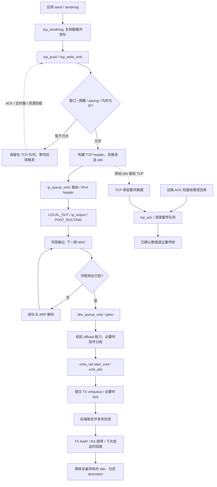

# 02 发包：从 send() 到 virtqueue 回收

本篇回答：`send()` 成功意味着数据走到哪一步？TCP 在哪里决定分段与发送时机？IPv4、邻居、qdisc 怎样衔接？TX completion 与 TCP ACK 为何不能混同？

前置阅读：[01 收包路径](01-receive-path.md)，以及 MSS、TCP 序号/ACK、ARP 和 DPDK TX burst 的使用经验。预计阅读时间：35–45 分钟，实验另需 20 分钟。

源码基准：`/home/chen/code/linux-lab/src/linux-6.18`，本次已执行 `git describe --always --dirty --tags` 确认 `v6.18`。所有源码位置相对该目录。范围为 x86_64、IPv4、已建立普通 TCP socket、virtio_net、普通 copy send；不展开零拷贝、隧道和 TCP 重传算法。

## 总览：发送尝试、设备回收、远端确认是三条相关路径



图中的邻居等待、qdisc 排队、设备消费、ACK 都可能跨越执行上下文。`send()` 返回表示本次调用已接受的字节数；不是“这些字节已经完成 TX”，更不是“对端应用已读到”。对端 ACK 也只说明 TCP 接收进度，不代表对端应用消费进度。

## 1. send 系统调用到 TCP 写队列

x86_64 用户程序的具体 libc 包装不是本仓库的一部分，本篇以已核查的内核 `sendto`/`sendmsg` 公共分发为准；libc `send()` 的具体封装【未确认】。

| 顺序 | 函数与源码位置 | 做什么 |
|---|---|---|
| 1 | `__sys_sendto()`，`net/socket.c:2209` | 导入用户 buffer 为 iterator，找到 socket，处理 flags，进入 `__sock_sendmsg()`。 |
| 2 | `__sock_sendmsg()`，`net/socket.c:737` → `sock_sendmsg_nosec()`，`net/socket.c:725` | 通过安全检查后调用 socket 的 `.sendmsg` 操作。 |
| 3 | `inet_sendmsg()`，`net/ipv4/af_inet.c:846` | IPv4 socket 分发到 `sk->sk_prot->sendmsg`，TCP 绑定见 `net/ipv4/tcp_ipv4.c:3502`。 |
| 4 | `tcp_sendmsg()`，`net/ipv4/tcp.c:1408` | `lock_sock()` 获得 socket 所有权，调用 `tcp_sendmsg_locked()`，完成后释放。 |
| 5 | `tcp_sendmsg_locked()`，`net/ipv4/tcp.c:1078` | 确定 MSS 与 size goal，尽量向队尾追加；需要时分配新 skb 并通过 `tcp_skb_entail()` 排入写队列。 |
| 6 | `skb_copy_to_page_nocache()` 调用点，`net/ipv4/tcp.c:1272` | 普通 copy send 把用户数据拷入 page fragment，更新 fragment 与 skb；`write_seq` 在 `net/ipv4/tcp.c:1338` 推进。 |
| 7 | `tcp_push()`，`net/ipv4/tcp.c:745` → `__tcp_push_pending_frames()`，`net/ipv4/tcp_output.c:3172` | 根据 MSG_MORE、Nagle/cork 等状态尝试发送；可能继续等待积累数据或资源。 |

不要把一次 `send()`、一个 skb 和一个 TCP segment（报文段）画成一一对应。`size_goal` 可以大于 MSS，数据可能跨多个 page fragment，发送队尾也可能继续追加。内存不足时发送调用可能等待或短写；收到 ACK、窗口变化或后续定时器事件也能继续驱动发送，不必等待应用再次调用 `send()`。

## 2. TCP 发送控制：先决定能发多少，再交给 IP

主循环是 `tcp_write_xmit()`，`net/ipv4/tcp_output.c:2901`。对本次未发送队头，它依次处理这些约束：

| 检查 / 操作 | 源码锚点 | 含义 |
|---|---|---|
| `tcp_pacing_check()` | `net/ipv4/tcp_output.c:2943` | 检查 pacing（按时间调速）是否暂时阻止发送。 |
| `tcp_cwnd_test()` | 定义 `net/ipv4/tcp_output.c:2238`，调用 `net/ipv4/tcp_output.c:2946` | 根据拥塞窗口与已在途报文估算可用 quota。 |
| `tcp_snd_wnd_test()` | 定义 `net/ipv4/tcp_output.c:2295`，调用 `net/ipv4/tcp_output.c:2961` | 对端通告接收窗口也必须允许发送。 |
| `tcp_nagle_test()` / `tcp_tso_should_defer()` | `net/ipv4/tcp_output.c:2966` | 单 segment 与多 segment skb 分别考虑小包合并/延迟发出的条件。 |
| `tcp_mss_split_point()` / `tso_fragment()` | `net/ipv4/tcp_output.c:2978` | 确定本次可发长度，需要时把队头 skb 拆成两部分。 |
| `tcp_small_queue_check()` | 定义 `net/ipv4/tcp_output.c:2770`，调用 `net/ipv4/tcp_output.c:2988` | TSQ（TCP Small Queues，限制 TCP 在下层排队的机制）约束下层仍占用的发送内存，避免单连接积压过多。 |
| `tcp_transmit_skb()` | `net/ipv4/tcp_output.c:1643`，调用 `net/ipv4/tcp_output.c:2999` | 进入实际的 TCP header 构建和下层提交。 |

拥塞窗口与接收窗口控制的不是同一件事：前者限制网络在途负担，后者限制接收端还能接受的序号范围。TSQ 也不等同于任何一个窗口，它关注本机下层排队/内存占用。图里的“允许”是这一组检查的简化，不是单个 `min(cwnd, rwnd)` 就能完整替代源码。

`__tcp_transmit_skb()`，`net/ipv4/tcp_output.c:1447` 对普通数据发送通常接到 `clone_it = 1`。它用 `skb_clone()`，必要时用 `pskb_copy()`，保留 TCP 持有的原始 skb，并为实际发送构建 TCP header、options、校验和/offload 元信息。`skb_shared_info.gso_segs / gso_size` 在 `net/ipv4/tcp_output.c:1616` 填好，再经 IPv4 的 `.queue_xmit = ip_queue_xmit`，`net/ipv4/tcp_ipv4.c:2484` 交给 IP。

成功提交后，`tcp_event_new_data_sent()`，`net/ipv4/tcp_output.c:69` 推进 `snd_nxt`，从 `sk_write_queue` 移除该原始 skb，插入 `tcp_rtx_queue`（TCP 重传红黑树），增加在途计数并按需启动 RTO。这一步表明 TCP 已作发送提交，不证明设备已经完成传输。

### 三种容易混淆的“分段”

- **TCP 对当前可发范围的切分**：`tso_fragment()` 把 TCP 写队列 skb 按窗口/本次长度拆开；拆出来的发送 skb 仍可能包含多个 segment。
- **GSO/TSO 按 MSS 形成报文段**：GSO（Generic Segmentation Offload，通用分段卸载）用一个大 skb 描述多个 segment；设备支持时可交给 TSO（TCP Segmentation Offload，TCP 分段卸载）。设备不支持所需能力时，`validate_xmit_skb()`，`net/core/dev.c:3977` 调用 `skb_gso_segment()` 在软件中分段。
- **IPv4 fragmentation（IP 分片）**：是 IP 数据报的另一层机制，不等同 TCP 分段。`__ip_finish_output()`，`net/ipv4/ip_output.c:297` 单独检查 MTU 和 GSO；`ip_finish_output_gso()`，`net/ipv4/ip_output.c:249` 对 GSO segment 长度是否符合 MTU 做检查。普通 TCP 尽量按路径 MSS 发送，不能据“大 skb 长于 MTU”就断言发生 IP 分片。

QEMU virtio-net 可把 GSO 信息交给后端，实际在哪一层完成分段取决于协商的能力和后端；本文只确认 guest 提交的 metadata，不断言一定由物理网卡做 TSO。

## 3. IPv4 输出与 netfilter 挂载点

| 函数与位置 | 做什么 |
|---|---|
| `ip_queue_xmit()`，`net/ipv4/ip_output.c:546` → `__ip_queue_xmit()`，`net/ipv4/ip_output.c:463` | 复用有效 socket 路由缓存；需要时 `ip_route_output_flow()` 查路由，然后构建 IPv4 header。 |
| `ip_local_out()`，`net/ipv4/ip_output.c:125` → `__ip_local_out()`，`net/ipv4/ip_output.c:102` | 更新 IP 长度/checksum，经过 `NF_INET_LOCAL_OUT`；放行后经 `dst_output()` 继续。 |
| `ip_output()`，`net/ipv4/ip_output.c:428` | 确定出口设备，经过 `NF_INET_POST_ROUTING`，通常以 `ip_finish_output()` 为后续处理。 |
| `ip_finish_output()`，`net/ipv4/ip_output.c:318` → `__ip_finish_output()`，`net/ipv4/ip_output.c:297` | 可执行 cgroup egress BPF，检查 GSO 与 MTU/分片条件，再进入二层输出。 |
| `ip_finish_output2()`，`net/ipv4/ip_output.c:200` | 准备链路层 headroom，通过 `ip_neigh_for_gw()` 找下一跳邻居，调用 `neigh_output()`。 |

这里是本地 socket 发包，因此是 LOCAL_OUT；收到后再转发的包是另一条入口。netfilter 可丢弃、排队、改变路由相关信息，不能把图中的 hook 都理解成只执行观察回调。经过 hook 的包也不保证最终提交到驱动。

## 4. 邻居子系统：路由给下一跳，ARP 给二层地址

`neigh_output()`，`include/net/neighbour.h:534` 有两类代表路径：

| 条件 / 函数 | 作用 |
|---|---|
| 邻居已连接且 header cache 可用 → `neigh_hh_output()`，`include/net/neighbour.h:494` | 把缓存的链路层 header 填入 skb，再 `dev_queue_xmit()`；可省去重复构建。 |
| 走邻居 `.output` → `neigh_resolve_output()`，`net/core/neighbour.c:1575` | `neigh_event_send()` 判断状态；地址可用时构建链路层 header 再下送。IPv4 ARP 操作绑定见 `net/ipv4/arp.c:130`。 |
| 需要解析 → `__neigh_event_send()`，`net/core/neighbour.c:1200` | `NUD_INCOMPLETE` 时把 skb 加入 `arp_queue`，触发探测；超出队列限制可丢弃旧项。ARP 请求生成入口为 `arp_solicit()`，`net/ipv4/arp.c:333`。 |

邻居的 key 是路由选出的下一跳；跨网段通信通常解析网关的 MAC，不是远端主机的 MAC。`arp_queue` 保留的是等待二层解析的待发 skb，和 TCP 的未确认数据不是同一队列。邻居解析完成才继续出队，所以 `send()` 至 `start_xmit()` 的间隔可能包括 ARP 等待。

## 5. qdisc 与驱动发送

qdisc（queueing discipline，排队规则）位于协议输出和设备提交之间，提供排队、调度及拥塞时的处理策略。它是软件层，不是 NIC TX ring。

| 顺序 | 函数与位置 | 做什么 |
|---|---|---|
| 1 | `dev_queue_xmit()` → `__dev_queue_xmit()`，`net/core/dev.c:4670` | 处理 egress hook/分类，挑选 TX queue，取得对应 qdisc。`dev_queue_xmit` 是内联包装，见 `include/linux/netdevice.h:3363`。 |
| 2 | `__dev_xmit_skb()`，`net/core/dev.c:4124` | 队列有 enqueue 操作时，经 qdisc 排队；若 qdisc 支持 bypass 且为空、满足运行条件，可直接发送。 |
| 3 | `__qdisc_run()`，`net/sched/sch_generic.c:415` → `qdisc_restart()`，`net/sched/sch_generic.c:393` | 以 quota 出队，交给 `sch_direct_xmit()`；用完预算后可重新安排。 |
| 4 | `sch_direct_xmit()`，`net/sched/sch_generic.c:319` | 在适当锁保护下验证发送 skb，再调用 `dev_hard_start_xmit()`。 |
| 5 | `validate_xmit_skb_list()`，`net/core/dev.c:4036` → `validate_xmit_skb()`，`net/core/dev.c:3977` | 检查设备支持的 offload，需要时软件 GSO、线性化或补 checksum。 |
| 6 | `dev_hard_start_xmit()`，`net/core/dev.c:3851` → `xmit_one()`，`net/core/dev.c:3834` | 对实际提交的 skb 调用 `netdev_start_xmit()`；后者经 `.ndo_start_xmit` 进入驱动，见 `include/linux/netdevice.h:5243`。 |
| 7 | virtio-net `start_xmit()`，`drivers/net/virtio_net.c:3369` | 选择已映射的 send queue，准备发送并按余量决定是否停止队列；必要时通知后端。 |
| 8 | `xmit_skb()`，`drivers/net/virtio_net.c:3315` → `virtnet_add_outbuf()`，`drivers/net/virtio_net.c:571` | 组织 virtio header 和 skb scatterlist，经 `virtqueue_add_outbuf()` 提交 descriptor。 |

这里的列表是依赖关系，不意味着每个包都会 enqueue、再 dequeue、再经历一次软中断。qdisc bypass 可以当场进入 `sch_direct_xmit()`；无 enqueue 的设备还可走 `__dev_queue_xmit()` 的直接路径。普通应用发包可以在进程上下文一路执行到驱动；排队后的后续工作可由 `net_tx_action()`，`net/core/dev.c:5652` 驱动，相关调度入口 `__netif_schedule()` 在 `net/core/dev.c:3374`。

驱动调用失败也要按 ownership（所有权）解释。通用 qdisc 看到 `NETDEV_TX_BUSY` 可重新排队，见 `net/sched/sch_generic.c:361`。但本版 virtio-net `start_xmit()` 的意外提交失败分支会计 `tx_dropped`、释放 skb，然后返回 `NETDEV_TX_OK`，见 `drivers/net/virtio_net.c:3391`；这里的 OK 表示 skb 已被驱动消费，不能当作“线上成功”。平时驱动通过停止/唤醒 TX queue 避免 ring 没余量时继续收包。

`start_xmit()` 使用 `xmit_more` 与队列状态决定是否 kick（通知后端），见 `drivers/net/virtio_net.c:3414`，而不是每个 skb 无条件一次通知。物理驱动则提交各自设备的 descriptor 与 doorbell；代表入口是 `igb_xmit_frame_ring()`，`drivers/net/ethernet/intel/igb/igb_main.c:6529` 和 `ice_start_xmit()`，`drivers/net/ethernet/intel/ice/ice_txrx.c:2701`。三者在 netdev 接口之下的 ring 格式、映射与通知机制不同。

## 6. TX 完成后：谁释放哪一份数据

后端在 virtqueue 发布完成，仅表示它不再以原先提交方式占用该 descriptor/buffer。软件后端可能已经复制或转交数据；这不构成“对端 TCP 已确认”或“物理链路已发完”的通用证明。

本版 virtio-net 的回收存在三条路径，不能只画“TX 中断 → 释放”：

| 条件 / 入口 | 实际回收行为 |
|---|---|
| TX completion 回调 `skb_xmit_done()`，`drivers/net/virtio_net.c:778`；TX NAPI 有非零 weight | 抑制重复回调并调度 TX NAPI，后续 `virtnet_poll_tx()`，`drivers/net/virtio_net.c:3255` 调用 `free_old_xmit()`。 |
| RX NAPI 正在运行 | `virtnet_poll_cleantx()`，`drivers/net/virtio_net.c:3062` 可尝试获取对应 TX queue 锁，顺带回收完成项。 |
| TX NAPI 未启用 | `start_xmit()`，`drivers/net/virtio_net.c:3380` 在下一次发送时尝试回收；完成回调可唤醒子队列。此模式提交后还会 `skb_orphan()`，见 `drivers/net/virtio_net.c:3403`。 |

普通 skb 的实际释放链为 `free_old_xmit()`，`drivers/net/virtio_net.c:1078` → `virtnet_free_old_xmit()`，`drivers/net/virtio_net.c:634` → `__free_old_xmit()`，`drivers/net/virtio_net.c:590`。它循环 `virtqueue_get_buf()`，按 buffer 类型释放 skb/XDP frame 等；普通 skb 经 `napi_consume_skb()`，同时上报已完成字节/包数。满足 descriptor 余量后唤醒停止的队列，见 `drivers/net/virtio_net.c:3279`。

`napi_tx` 模块参数默认值为 true，见 `drivers/net/virtio_net.c:33`；实际使用还看队列 NAPI weight，且可受配置影响。普通 TX 回收与 AF_XDP 发包有不同计数：非 AF_XDP 的 `virtnet_poll_tx()` 可以清理完成项后返回 `0`，见 `drivers/net/virtio_net.c:3312`。所以 NAPI tracepoint 显示 `work 0` 不代表没释放 TX buffer，也不能用 RX budget 推断“每轮最多回收这么多个 TX skb”。

设备释放克隆 skb 时，其 destructor 可触发 `tcp_wfree()`，`net/ipv4/tcp_output.c:1350`，用于下层内存记账与 TSQ 后续发送调度；本版可把待处理 socket 加入 `system_bh_wq` 的工作，见 `net/ipv4/tcp_output.c:1381`。**TCP 持有的原始重传数据仍需等待 ACK。** ACK 的接收处理中，`tcp_clean_rtx_queue()`，`net/ipv4/tcp_input.c:3382` 清理已确认数据；释放入口调用见 `net/ipv4/tcp_input.c:3478`。`snd_una` 的推进也是 TCP ACK 处理的一部分，更新函数见 `net/ipv4/tcp_input.c:3688`。

发送中至少有三个进度标记：`write_seq` 是应用已交给 TCP 的字节尾端，`snd_nxt` 是 TCP 已作发送提交的尾端，`snd_una` 是尚未累计确认的起点。这三个值与“TX ring 当前有多少 descriptor”不能互相替代。

## 7. 关键数据结构

| 结构 / 字段 | 本章用途与源码 |
|---|---|
| `sock.sk_write_queue / tcp_rtx_queue / sk_wmem_queued` | 未发送队列、已发未确认的重传树、TCP 排队内存账，`include/net/sock.h:472`。 |
| `tcp_sock.write_seq / snd_nxt / snd_una` | 应用写入、TCP 发送、ACK 三个序号进度，`include/linux/tcp.h:272`、`include/linux/tcp.h:306`。 |
| `tcp_sock.snd_wnd / snd_cwnd` | 对端接收窗口与本端拥塞窗口，`include/linux/tcp.h:226`。 |
| `skb_shared_info.nr_frags / frags / gso_size / gso_segs` | page fragment 与卸载分段描述，`include/linux/skbuff.h:596`、`include/linux/skbuff.h:628`。 |
| `neighbour.nud_state / ha / arp_queue / output` | 邻居状态、链路层地址、待解析队列和输出方法，`include/net/neighbour.h:138`。 |
| `Qdisc.enqueue / dequeue`，`netdev_queue.qdisc` | 软件调度方法与设备 TX queue 的关联，`include/net/sch_generic.h:73`、`include/linux/netdevice.h:678`。 |
| `send_queue.vq / sg / napi` | virtqueue、scatterlist 与 TX 回收调度，`drivers/net/virtio_net.c:302`。 |

## 8. 为什么这样设计

以下为依据源码行为的设计解释。

- **TCP 保存重传数据，驱动消费发送副本**：一个字节经历 TCP 可靠性和设备 DMA/后端消费两个生命周期。把它们分开，才能在本地 TX 完成后仍重传；共享 packet storage 避免每次完整复制，却要求明确引用计数。
- **发送窗口与本机排队约束分层**：cwnd/rwnd 处理端到端限制，TSQ、qdisc、设备 queue 处理本机资源与公平性。只扩大 TX ring 不能解除接收窗口限制，还可能增加排队时延。
- **大 skb 向下传递 offload 元信息**：尽量把逐 segment 工作推迟，减少协议栈重复处理；软件 fallback 保留兼容性。上层 skb 长度不再直接等于线上包长，观测必须说明位置。
- **qdisc 与硬件 ring 分开**：调度策略可以独立于设备替换，设备只处理可提交的数据；bypass 又减少队列为空时的额外成本。
- **批量 kick 与批量回收**：摊薄通知/完成处理成本。选择不同回收上下文也意味着延迟和内存回收时点不同，不能假设“每次 send 都同步收拾完”。

## 9. 在 QEMU guest 中验证

**执行状态：未在 QEMU 中实跑；下列输出全部为示意。** 沿用收包章的 v6.18 guest、tracefs、function graph 配置，从控制台操作。让 guest 向 guest 外的对端发包，并确认 `ip route get <对端地址>` 走 virtio-net 接口；loopback 不适用于驱动验证。

### 实验 A：把发送调用和异步回收放在同一条时间线上

在 host/对端启动普通 TCP 接收应用：

```sh
python3 - <<'PY'
import socket
with socket.socket() as listener:
    listener.setsockopt(socket.SOL_SOCKET, socket.SO_REUSEADDR, 1)
    listener.bind(('0.0.0.0', 9001))
    listener.listen(1)
    connection, _ = listener.accept()
    total = 0
    with connection:
        while True:
            data = connection.recv(65536)
            if not data:
                break
            total += len(data)
    print('received bytes:', total)
PY
```

guest 配置独立实例（若第 1 章没有挂载 tracefs，先按该章挂载）：

```sh
sudo bash <<'SH'
set -eu
TX_TRACE=/sys/kernel/tracing/instances/ll-tx
mkdir "$TX_TRACE"
printf '0\n' > "$TX_TRACE/tracing_on"
printf 'function_graph\n' > "$TX_TRACE/current_tracer"
for fn in tcp_sendmsg net_tx_action virtnet_poll virtnet_poll_tx; do
    grep -qw "$fn" /sys/kernel/tracing/available_filter_functions
    printf '%s\n' "$fn" >> "$TX_TRACE/set_graph_function"
done
printf '1\n' > "$TX_TRACE/events/net/net_dev_start_xmit/enable"
printf '1\n' > "$TX_TRACE/events/net/net_dev_xmit/enable"
printf '1\n' > "$TX_TRACE/events/napi/napi_poll/enable"
printf '1\n' > "$TX_TRACE/tracing_on"
SH
```

在 guest 发 128 KiB 数据；替换示例 IP。短暂停留是留出观察完成/ACK 的窗口，不用于测量 RTT：

```sh
PEER_IP=192.0.2.1 python3 - <<'PY'
import os, socket, time
with socket.create_connection((os.environ['PEER_IP'], 9001)) as s:
    s.sendall(b'x' * 131072)
    print('sendall returned', flush=True)
    time.sleep(1)
PY
```

完成后停止、导出并清理实例：

```sh
sudo bash <<'SH'
set -eu
TX_TRACE=/sys/kernel/tracing/instances/ll-tx
printf '0\n' > "$TX_TRACE/tracing_on"
cat "$TX_TRACE/trace" > /tmp/ll-tx.trace
printf '0\n' > "$TX_TRACE/events/enable"
printf 'nop\n' > "$TX_TRACE/current_tracer"
printf '\n' > "$TX_TRACE/set_graph_function"
rmdir "$TX_TRACE"
SH
less /tmp/ll-tx.trace
```

预计能辨认以下关系；内联函数可能不显示，qdisc 和完成路径也依配置变化：

```text
tcp_sendmsg() {
  ... tcp_sendmsg_locked() ... tcp_write_xmit() ... __tcp_transmit_skb() ...
  ... ip_queue_xmit() ... ip_output() ... __dev_queue_xmit() ...
  ... net_dev_start_xmit: dev=... len=... gso_size=... gso_segs=...
  ... start_xmit() ...
}
... virtnet_poll_tx() { ... free_old_xmit() ... }
... napi_poll: ... work 0 budget ...
... virtnet_poll() { ... tcp_rcv_established() ... tcp_clean_rtx_queue() ... }
```

最后两行不保证按这个顺序。发送数据很少时 TX completion、ACK 与函数返回的相对顺序都可能变化；RX NAPI 还可能直接清 TX。判读时分别寻找“驱动释放发送副本”和“ACK 清 TCP 重传数据”，不要强求一个固定回调顺序。`tcp_clean_rtx_queue` 若被内联，需从包含它的 ACK 函数与协议状态验证，不能凭缺少符号断言没有清理。

### 实验 B：看到 GSO metadata，而不是猜线上的包长

保留对端接收程序，重新启动它，然后在 guest 先开启 15 秒事件采集，再从另一终端重复上面的发送程序：

```sh
sudo perf record -a -o /tmp/ll-tx-events.data \
  -e net:net_dev_queue -e net:net_dev_start_xmit -e net:net_dev_xmit \
  -e napi:napi_poll -- sleep 15
sudo perf script -i /tmp/ll-tx-events.data
```

事件定义已核查：`net_dev_start_xmit` 在 `include/trace/events/net.h:14`，`net_dev_xmit` 在 `include/trace/events/net.h:72`，`net_dev_queue` 在 `include/trace/events/net.h:144`。`net_dev_xmit` 是驱动发送函数**返回**事件，不是硬件/后端完成事件。预期示意：

```text
net_dev_start_xmit: dev=ens3 ... len=32768 gso_size=1448 gso_segs=... 
net_dev_xmit: dev=ens3 ... rc=0
napi_poll: ... for device ens3 work 0 budget 64
```

示例数值不能当成断言：MSS 受 MTU 与 options 影响，GSO 大小受窗口、发送批量和设备能力影响。若看到长度大于接口 MTU 且 GSO metadata 非零，说明在该 tracepoint 处仍由大 skb 表示多个 segment；不能声称线上的 Ethernet frame 也这么大。若没有观察到，则查看 `ethtool -k <接口>`、实际发送长度与窗口，不要立即归因于 tracer 失效。

trace 实例按停止/导出命令清理；perf 输出保存在 `/tmp/ll-tx-events.data`，分析完后可删除。符号预检若失败，先记录缺少的名字，再执行停止/导出段清理本实例；不能跳过预检后把空 trace 当成路径不存在。函数级追踪有开销，不应用这些结果测吞吐。

## 要点回顾

- `send()` 接受数据，不保证设备完成或对端应用收到。
- MSS、TCP skb 切分、GSO/TSO 与 IP 分片不能混为一谈。
- cwnd、rwnd、pacing、TSQ 和 qdisc 约束不同阶段。
- IPv4 路由决定下一跳，邻居解析取得它的二层地址。
- qdisc 可以排队，也可以 bypass；发包不必先进入 NET_TX_SOFTIRQ。
- virtio TX 可由 TX NAPI、RX NAPI 顺带或后续发送回收。
- TX completion 释放下层副本，ACK 清理 TCP 重传数据，二者独立。

## 自测题

1. `send()` 返回 128 KiB，是否可以释放本地 TX descriptor？是否说明远端应用已读到？
2. `net_dev_start_xmit` 中的 skb 长度超过 MTU，就能判定网络在传 jumbo frame 吗？
3. 为什么 TCP 在交给 IP 后还保留重传数据？设备完成为什么不能代替 ACK？
4. `virtnet_poll_tx` 的 trace 显示 `work 0`，为什么可能已经释放多个 skb？
5. 一个 send 没有经过 qdisc enqueue 或 NET_TX_SOFTIRQ，是否说明绕过了整个内核协议栈？

<details>
<summary>参考答案</summary>

1. 都不能这样推出。用户 buffer 在普通 copy send 返回后可按已接受字节语义复用；descriptor 的所有权由驱动和设备完成协议管理。远端应用是否读取与本地返回无关。
2. 不能。它可能仍是 GSO skb，需结合 gso_size/gso_segs 和设备能力理解；观测位置在驱动调用前。
3. 网络仍可能丢包，需要重传。TX completion 只说明本地设备/后端不再按提交方式占用 buffer；ACK 来自远端 TCP 的接收状态。
4. 普通 TX 回收不按 RX 完成包数记账，源码可调用 free_old_xmit 后返回 0；AF_XDP 还有其他分支。
5. 不是。qdisc 可 bypass，进程上下文也能直接走到驱动；IP/TCP 与设备层仍然都可能执行。

</details>

## 与 DPDK/VPP 的对照，以及对用户态协议栈的启示

| DPDK/VPP 经验 | Linux 对应与边界 |
|---|---|
| TX burst 把成功提交的 mbuf 所有权交给 PMD | `.ndo_start_xmit` 也有 ownership 协议，但返回码不能简单解释为线上成功；virtio 错误路径也可消费 skb 后返回 OK。 |
| PMD 读取完成状态、回收 mbuf | virtio 取 used buffer 后释放发送副本；TCP 还有独立的重传持有，DPDK 数据面框架本身不会替你完成 TCP ACK 记账。 |
| 软件 TX 调度和网卡 ring 分开设计 | qdisc 与设备 queue 体现这种分层；TCP 自身还有端到端发送限制，不能只看 ring free count。 |
| mbuf 中携带分段/校验和 offload 信息 | skb shared info 与 virtio header 也传递元信息；支持情况取决于逐层能力，软件可能提前分段。 |

对用户态 TCP 的启示：把应用写入、协议可发送、设备可提交和 TCP 已确认分别建模；先保证重传数据的存储生命周期正确，再优化 clone/refcount；观测点同时记录字节序号、逻辑 segment 数和 descriptor 数，避免用一种计数解释所有性能现象。本章不提供用户态 TCP 实现。
