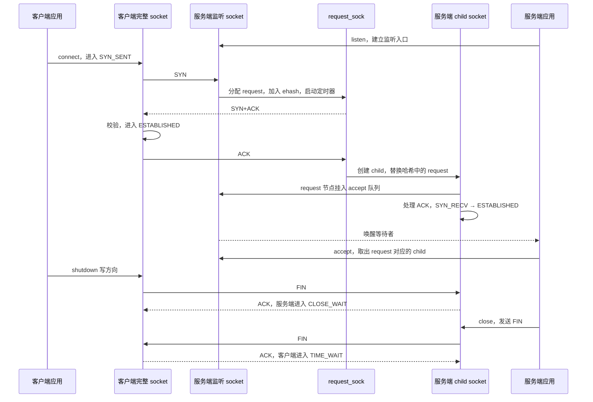

# 第 3 章：TCP 连接生命周期

本篇回答：`listen()`、三次握手和 `accept()` 分别创建或移交什么对象？半连接与全连接存在哪里？syncookies 改变了哪段路径？正常关闭如何进入 TIME_WAIT？

前置阅读：熟悉 TCP 报文标志、序列号和 socket API 即可；内核对象入门可另读 `notes/00-kernel-basics/`，不依赖同时生成的收发包章节。预计阅读时间：45 分钟，实验另需 20 分钟。

范围：x86_64、IPv4、普通 TCP。源码根目录 `/home/chen/code/linux-lab/src/linux-6.18`，本次核验 `git describe --always --dirty --tags` 为 `v6.18`。以下引用均相对该根目录。主线不启用 TCP Fast Open（握手阶段携带应用数据）和 `TCP_DEFER_ACCEPT`（延后向应用交付连接），它们会改变“第三个 ACK 到达后即可 accept”的条件。

## 1. 总览：监听 socket 不会变成已连接 socket



图中 `ehash` 是 established hash（已建立连接查找表）的惯用名称；v6.18 中它也存放握手请求对象。不能由表名推断“表里只有 ESTABLISHED”。正常第三个 ACK 的处理还会先将 child 放入 accept 队列，再让它处理报文完成状态转换；队列锁、child 锁和唤醒次序共同保证使用顺序，不宜把这一步简化成无锁对象搬运。证据见 `net/ipv4/inet_connection_sock.c:1170`、`net/ipv4/inet_connection_sock.c:1425`、`net/ipv4/tcp_minisocks.c:977`。

## 2. listen 与 accept：两个队列概念，三类对象

| 概念 | v6.18 中的对象与组织 | 谁消费 |
|---|---|---|
| 监听入口 | 保持 `TCP_LISTEN` 的完整 socket | 新 SYN 的查找路径 |
| 半连接 / SYN 队列 | 尚未完成握手的 `request_sock`，普通路径进入 ehash，监听者记录请求计数，每个 request 有重传定时器 | 第三个 ACK 或请求定时器 |
| 全连接 / accept 队列 | `request_sock_queue.rskq_accept_head/tail` 组成 FIFO；节点仍是 request，其 `sk` 指向完整 child | `inet_csk_accept()` |

这里的“半连接队列”是逻辑集合，不是要求你在 v6.18 找到一条监听 socket 专有的 SYN 链表。两个概念也不是 DPDK 的两个 RX ring：它们承载连接生命周期状态，不是网卡报文描述符。

### listen 调用链

| 顺序 | 函数与源码 | 做什么 |
|---|---|---|
| 1 | `__sys_listen_socket()`，`net/socket.c:1918` | 把用户 `backlog` 限制到 `net.core.somaxconn`，调用协议族的 listen |
| 2 | `inet_listen()`，`net/ipv4/af_inet.c:232` | 持有 socket 锁，检查类型和状态 |
| 3 | `__inet_listen_sk()`，`net/ipv4/af_inet.c:193` | 将 backlog 写入 `sk_max_ack_backlog`；首次监听时继续初始化 |
| 4 | `inet_csk_listen_start()`，`net/ipv4/inet_connection_sock.c:1340` | 初始化请求队列，将状态设为 LISTEN，绑定端口并发布到查找表 |

不要把 `tcp_max_syn_backlog` 解释成 v6.18 中独立且唯一的 SYN 队列硬上限。`inet_csk_reqsk_queue_is_full()` 直接比较请求计数与 `sk_max_ack_backlog`，见 `include/net/inet_connection_sock.h:286`；`tcp_max_syn_backlog` 还参与禁用 cookies 时为已证明可达的对端保留容量的判断，见 `net/ipv4/tcp_input.c:7463`。全连接队列的判断是 `sk_ack_backlog > sk_max_ack_backlog`，见 `include/net/sock.h:1070`；不要用这条实现细节承诺应用能精确排队 N 个连接。

`somaxconn`、`tcp_max_syn_backlog`、`tcp_syncookies` 的 sysctl 注册分别见 `net/core/sysctl_net_core.c:646`、`net/ipv4/sysctl_net_ipv4.c:1099`、`net/ipv4/sysctl_net_ipv4.c:1021`。

### accept 调用链

| 顺序 | 函数与源码 | 做什么 |
|---|---|---|
| 1 | `do_accept()`，`net/socket.c:1951` | 准备新 socket/file，调用协议族 accept |
| 2 | `inet_accept()`，`net/ipv4/af_inet.c:776` | 通过协议 ops 取得已创建的 child |
| 3 | `inet_csk_accept()`，`net/ipv4/inet_connection_sock.c:663` | 队列为空则按阻塞设置等待；否则取出 request，再取 `req->sk` |
| 4 | `reqsk_queue_remove()`，`include/net/request_sock.h:210` | 在队列锁下移除 FIFO 头并减少 accept backlog |
| 5 | `__inet_accept()`，`net/ipv4/af_inet.c:756` | 把 child 关联到应用将拿到的新 socket |

`accept()` 不负责发送 SYN-ACK，也不负责创建普通握手中的 child。即使应用还没调用 accept，内核也能完成握手；一直不消费队列才会令后续建连受容量限制。

## 3. 三次握手的 TCP 层完整主路径

这里的完整指从 socket 操作及 TCP IPv4 收包入口开始，到 TCP 发包接口或连接交付结束。IP、邻居、qdisc、驱动是另一章的范围。为便于阅读，省去错误出口、路由细节及鉴权选项，但保留每次状态转换的执行者。

### 3.1 客户端主动打开

| 顺序 | 函数与源码 | 做什么 |
|---|---|---|
| 1 | `inet_stream_connect()`，`net/ipv4/af_inet.c:744` → `__inet_stream_connect()`，`net/ipv4/af_inet.c:626` | 处理阻塞语义，通过协议 ops 开始连接 |
| 2 | `tcp_v4_connect()`，`net/ipv4/tcp_ipv4.c:224` | 解析 IPv4 对端、路由与端口，设 SYN_SENT（同文件 308 行），调用 `tcp_connect()` |
| 3 | `tcp_connect()`，`net/ipv4/tcp_output.c:4249` | 初始化连接的发送状态，构造 SYN，发出并安排重传 |
| 4 | `tcp_transmit_skb()` 的调用，`net/ipv4/tcp_output.c:4330` | 将 SYN 交给 TCP 下层发送；发送后仍保留重传所需状态 |

阻塞 `connect()` 的返回与收到 SYN-ACK 后的唤醒有关；不能把 syscall 入口到发 SYN 的函数栈当作整个握手都在同一调用栈内完成。

### 3.2 服务端收到 SYN

| 顺序 | 函数与源码 | 做什么 |
|---|---|---|
| 1 | `tcp_v4_rcv()`，`net/ipv4/tcp_ipv4.c:2202` | 校验报文并查找 socket；SYN 在这里找到 listener |
| 2 | `tcp_v4_do_rcv()`，`net/ipv4/tcp_ipv4.c:1906` | 根据 socket 状态选择处理路径；非 ESTABLISHED 进入状态机 |
| 3 | `tcp_rcv_state_process()`，`net/ipv4/tcp_input.c:6910` | LISTEN 状态检查标志，调用地址族的 `conn_request` |
| 4 | `tcp_v4_conn_request()`，`net/ipv4/tcp_ipv4.c:1735` | 以 IPv4 的 request ops 调用通用建连请求处理 |
| 5 | `tcp_conn_request()`，`net/ipv4/tcp_input.c:7380` | 检查容量、分配 request、解析选项、决定普通握手或 cookie |
| 6 | `inet_csk_reqsk_queue_hash_add()`，`net/ipv4/inet_connection_sock.c:1190` | 普通路径把 request 加入 ehash 并设置定时器，增加请求计数 |
| 7 | `tcp_v4_send_synack()`，`net/ipv4/tcp_ipv4.c:1187` | 按 request 生成并发送 IPv4 SYN-ACK |

request 的重传定时器最终执行 `reqsk_timer_handler()`，`net/ipv4/inet_connection_sock.c:1057`；它有重试、迁移和过期分支，并非为未 accept 的所有 child 执行普通数据重传。

### 3.3 客户端收到 SYN-ACK

`tcp_v4_rcv()` → `tcp_v4_do_rcv()` → `tcp_rcv_state_process()` 的源码入口同上；后续是：

| 顺序 | 函数与源码 | 做什么 |
|---|---|---|
| 1 | `tcp_rcv_synsent_state_process()`，`net/ipv4/tcp_input.c:6612` | 检查 ACK 是否确认自己的 SYN，处理 SYN、选项与初始接收序列号 |
| 2 | `tcp_finish_connect()`，`net/ipv4/tcp_input.c:6493` | 设 ESTABLISHED，初始化传输阶段 |
| 3 | `tcp_rcv_synsent_state_process()` 中的发送分支，`net/ipv4/tcp_input.c:6748` | 唤醒等待者；通常立即调用 `tcp_send_ack_reflect_ect()`，也存在延迟/搭载 ACK 分支 |

不要断言第三个 ACK 在所有配置下都立即作为单独报文发出。源码在写操作等待等条件下会安排 delayed ACK（延迟确认）。

### 3.4 服务端收到第三个 ACK

| 顺序 | 函数与源码 | 做什么 |
|---|---|---|
| 1 | `tcp_v4_rcv()` 的 NEW_SYN_RECV 分支，`net/ipv4/tcp_ipv4.c:2254` | ehash 查到 request，取得 listener 引用并调用 `tcp_check_req()` |
| 2 | `tcp_check_req()`，`net/ipv4/tcp_minisocks.c:688` | 校验序列号、ACK 和选项；普通有效 ACK 才请求创建 child |
| 3 | `tcp_v4_syn_recv_sock()`，`net/ipv4/tcp_ipv4.c:1755` | 检查 accept 容量，创建 IPv4 child，并通过 `own_req` 判定竞争中的所有权 |
| 4 | `tcp_create_openreq_child()`，`net/ipv4/tcp_minisocks.c:547` | 从 listener 与 request 初始化完整 TCP socket，初始为 SYN_RECV |
| 5 | `inet_csk_complete_hashdance()`，`net/ipv4/inet_connection_sock.c:1425` | 移除旧请求的半连接记账，转入 accept 队列；竞争失败时清理自己的 child |
| 6 | `inet_csk_reqsk_queue_add()`，`net/ipv4/inet_connection_sock.c:1400` | 用 `req->sk = child` 连接两者，持队列锁加入 accept FIFO |
| 7 | `tcp_child_process()`，`net/ipv4/tcp_minisocks.c:977` | 让 child 处理当前 ACK；状态改变后唤醒 listener 的等待者 |
| 8 | `tcp_rcv_state_process()` 的 SYN_RECV 分支，`net/ipv4/tcp_input.c:7009` | 初始化传输，把 child 设 ESTABLISHED；应用随后 accept 取走它 |

这里存在并发：不同 CPU 可能处理同一个请求的报文。`own_req` 和哈希替换决定谁有权完成转移；不能只用“收到 ACK 就无条件创建一个新 socket”的伪代码理解它。

## 4. syncookies：省掉等待期间保留 request 的成本

SYN cookies（SYN 状态编码）把可验证信息编码进 SYN-ACK 的序列号，并在条件允许时借助 timestamp（时间戳）携带选项信息。它改变的是 SYN 到最终 ACK 之间保存状态的方式，不是取消完整 socket。

普通路径在 SYN 后保留 request、定时重发 SYN-ACK。cookie 路径也会临时分配 request 来解析选项和构造 SYN-ACK，但不将它放入普通等待请求集合，发送后释放：`net/ipv4/tcp_input.c:7423`、`net/ipv4/tcp_input.c:7527`。所以“syncookies 完全不分配内存”不成立。

第三个 ACK 未找到原 request 时走 listener 的 cookie 检查：

| 顺序 | 函数与源码 | 做什么 |
|---|---|---|
| 1 | `tcp_v4_cookie_check()`，`net/ipv4/tcp_ipv4.c:1870` | LISTEN 收到合适 ACK 时进入 cookie 验证 |
| 2 | `cookie_v4_check()`，`net/ipv4/syncookies.c:400` | 验证 cookie，恢复请求信息及路由 |
| 3 | `tcp_get_cookie_sock()`，`net/ipv4/syncookies.c:197` | 调用 `syn_recv_sock` 创建完整 child，再挂入 accept 队列 |
| 4 | `tcp_child_process()`，`net/ipv4/tcp_minisocks.c:977` | 处理这个 ACK 并推进 child 状态 |

`tcp_syncookies=1` 的普通用途是请求集合拥挤时回退；值 2 在这里强制选择 cookie，适合隔离实验。源码条件见 `net/ipv4/tcp_input.c:7408`。cookie 不增加 accept 队列容量：`tcp_conn_request()` 与 `tcp_v4_syn_recv_sock()` 都检查全连接队列是否满。选项编码有约束，不能推断 cookie 与普通路径保留完全相同的协商信息；无 timestamp 时清理选项的分支见 `net/ipv4/tcp_input.c:7441`。

## 5. 状态机、四次挥手与 TIME_WAIT

### 三个接收处理入口

| 函数与源码 | 负责范围 |
|---|---|
| `tcp_rcv_established()`，`net/ipv4/tcp_input.c:6259` | ESTABLISHED 的数据/ACK 快慢路径；它也能处理 FIN，继续调用关闭相关逻辑 |
| `tcp_rcv_state_process()`，`net/ipv4/tcp_input.c:6910` | LISTEN、SYN_SENT、SYN_RECV，以及主要关闭状态 |
| `tcp_timewait_state_process()`，`net/ipv4/tcp_minisocks.c:101` | 查到轻量 TIME_WAIT 对象后的报文处理 |

以上入口并非“状态 enum 每个值对应一个独立函数”。一个接收函数里会继续推进多个状态。

### 正常主动关闭的时间线

1. 应用 `shutdown(SHUT_WR)`：`tcp_shutdown()`，`net/ipv4/tcp.c:3055`，只关闭发送方向。`tcp_close_state()`，同文件 3040 行，按表将 ESTABLISHED 改成 FIN_WAIT1。`tcp_send_fin()`，`net/ipv4/tcp_output.c:3757`，把 FIN 加到待发数据尾部或单独排队。发起 FIN 不代表它已离开网卡。
2. 对端按序消费 FIN：`tcp_fin()`，`net/ipv4/tcp_input.c:4675`，标记接收方向结束，并把 ESTABLISHED 改成 CLOSE_WAIT。它安排 ACK，但仍允许本地应用发送尚未完成的数据。
3. 主动方收到确认自己 FIN 的 ACK：`tcp_rcv_state_process()`，`net/ipv4/tcp_input.c:7057`，在 `snd_una == write_seq` 时进入 FIN_WAIT2。
4. 被动方应用关闭：`tcp_close()`，`net/ipv4/tcp.c:3295` → `__tcp_close()`，同文件 3123 行 → `tcp_close_state()` → `tcp_send_fin()`；CLOSE_WAIT 进入 LAST_ACK。这里假定已读完收到的数据且未启用立即 abort 的 linger 设置。
5. 主动方收到对端 FIN：`tcp_fin()` 的 FIN_WAIT2 分支，`net/ipv4/tcp_input.c:4710`，发最后一个 ACK，再调用 `tcp_time_wait()`，`net/ipv4/tcp_minisocks.c:328`。
6. 被动方收到最终 ACK：`tcp_rcv_state_process()` 的 LAST_ACK 分支，`net/ipv4/tcp_input.c:7117`，结束完整 socket。

“四次挥手”描述两个方向分别用 FIN/ACK 关闭的逻辑，报文可能合并，并不承诺抓包一定四帧。同时关闭会经过 CLOSING；收到 FIN 不等于本地应用已经 close。`__tcp_close()` 还可能因未读数据等条件发送 RST，见 `net/ipv4/tcp.c:3167`。

`tcp_time_wait()` 将必要的序列号、窗口和时间戳信息复制到 `tcp_timewait_sock`，替换哈希中的完整 socket，然后释放完整连接状态。v6.18 真正的 TIME_WAIT 在这条路径使用 `TCP_TIMEWAIT_LEN = 60 * HZ`，见 `include/net/tcp.h:141`、`net/ipv4/tcp_minisocks.c:380`。这是本版本实现中的等待常量，不是“任意 Linux 系统永远保持完整 TCP socket 60 秒”的保证；重传 FIN、资源压力和重用路径需要分别分析。孤儿 FIN_WAIT2 也可复用轻量 timewait 对象，不能只看对象类型就断定协议状态是 TIME_WAIT。

## 6. 关键数据结构

| 结构及源码 | 本章要看的字段 | 含义 |
|---|---|---|
| `sock`，`include/net/sock.h:378`、`include/net/sock.h:527` | `sk_state`、`sk_ack_backlog`、`sk_max_ack_backlog` | 协议状态，待 accept 计数及限制 |
| `inet_connection_sock`，`include/net/inet_connection_sock.h:78` | `icsk_accept_queue` | 监听者的请求记账和 accept FIFO |
| `request_sock_queue`，`include/net/request_sock.h:185` | `qlen`、`rskq_lock`、`rskq_accept_head/tail` | 半连接计数与全连接链表，不要混读 |
| `request_sock`，`include/net/request_sock.h:51` | `rsk_listener`、`rsk_timer`、`num_timeout`、`sk`、`dl_next` | 指向监听者，管理握手超时，后续可指向 child 并链接入队 |
| `tcp_request_sock`，`include/linux/tcp.h:150` | `rcv_isn`、`snt_isn`、`rcv_nxt` | 双方初始序列号及握手阶段下一期待字节 |
| `tcp_timewait_sock`，`include/linux/tcp.h:559` | `tw_rcv_nxt`、`tw_snd_nxt`、`tw_rcv_wnd`、`tw_ts_recent` | 关闭后的有限协议记忆 |

## 7. 为什么这样设计

下面是从代码组织得到的设计解释，涉及取舍处标为推测。

- **按阶段分配状态。** request、完整 child、timewait 分别保留不同字段。推测：大量未完成连接和已关闭连接无需长期占据完整数据传输对象，减少内存和缓存压力；依据是各结构以及 `tcp_time_wait()` 的字段复制。
- **应用调度与握手解耦。** child 由接收路径创建，accept 只取队列。推测：应用晚几个调度周期不会把每次握手都拖住；代价是必须对等待应用接管的连接单独记账和限额。
- **哈希转移必须有所有权。** `own_req`、引用计数和队列锁处理不同 CPU 的竞争。推测：这是共享网络栈可扩展到多 CPU 后，无法仅靠 listener 的一个锁覆盖所有阶段的体现。
- **关闭仍需有限记忆。** `tcp_timewait_state_process()` 能处理关闭后的重复报文。推测：用轻量对象保留这段协议语义，比保留完整收发缓冲更节省资源，但也不能把“应用不再持有 fd”当成可立即复用全部连接身份。

## 8. 验证实验：观察建连、队列与主动关闭

**执行状态：未在 v6.18 QEMU 客体实跑。以下是可复现实验命令和示意输出，不是测量记录。** 不在宿主执行。客体需要 root、Python 3、iproute2 和 bpftrace；先确认 `uname -r` 对应本仓库 v6.18 构建。tracepoint 的定义与字段已核对 `include/trace/events/sock.h:140`。相关配置名字已核对：`CONFIG_BPF_EVENTS`（`kernel/trace/Kconfig:810`）、`CONFIG_KPROBE_EVENTS`（同文件 739 行）；是否在客体启用须现场确认。

终端 A 先检查并启动状态追踪：

```bash
uname -r
sudo bpftrace -lv 'tracepoint:sock:inet_sock_set_state'
sudo bpftrace -e '
tracepoint:sock:inet_sock_set_state
/args->family == 2 && args->protocol == 6 &&
 (args->sport == 18080 || args->dport == 18080)/
{
  printf("sk=%p %d->%d ports=%d:%d\n", args->skaddr,
         args->oldstate, args->newstate, args->sport, args->dport);
}'
```

不按应用 PID 过滤：接收事件可能在其他执行上下文触发。状态值来自 `include/net/tcp_states.h:12`：1 ESTABLISHED、2 SYN_SENT、3 SYN_RECV、4 FIN_WAIT1、5 FIN_WAIT2、6 TIME_WAIT、7 CLOSE、8 CLOSE_WAIT、9 LAST_ACK、10 LISTEN。

终端 B 启动服务端，故意晚 8 秒 accept，收到 EOF 后再等 5 秒关闭：

```bash
python3 -u - <<'PY'
import socket, time
with socket.socket(socket.AF_INET, socket.SOCK_STREAM) as listener:
    listener.setsockopt(socket.SOL_SOCKET, socket.SO_REUSEADDR, 1)
    listener.bind(('127.0.0.1', 18080))
    listener.listen(8)
    print('listening; accept in 8s', flush=True)
    time.sleep(8)
    conn, peer = listener.accept()
    with conn:
        while conn.recv(4096):
            pass
        print('peer EOF; close in 5s', peer, flush=True)
        time.sleep(5)
PY
```

终端 C 在上述 8 秒内运行客户端：

```bash
python3 -u - <<'PY'
import socket
with socket.create_connection(('127.0.0.1', 18080)) as conn:
    print('connect returned before server accept', flush=True)
    conn.sendall(b'hello')
    conn.shutdown(socket.SHUT_WR)
    while conn.recv(4096):
        pass
    print('server EOF', flush=True)
PY
```

另一个终端在等待阶段观察，再在客户端退出后观察：

```bash
ss -lnt 'sport = :18080'
ss -nt state fin-wait-2
ss -nt state time-wait
```

预期：客户端 connect 先返回；监听 `Recv-Q` 可出现 1；服务端仍未 accept 时已经可能收到 FIN，因此“排队等待 accept 的 child”不保证一直停在 ESTABLISHED。客户端等待对端关闭期间可出现 FIN_WAIT2，随后出现 TIME_WAIT。bpftrace 输出片段形如：

```text
sk=0x... 7->2 ports=客户端端口:18080
sk=0x... 2->1 ports=客户端端口:18080
sk=0x... 3->1 ports=18080:客户端端口
sk=0x... 1->4 ports=客户端端口:18080
sk=0x... 1->8 ports=18080:客户端端口
sk=0x... 4->5 ports=客户端端口:18080
```

不同 CPU 的事件次序、地址和端口不固定。不要要求 tracepoint 必须输出 `5->6`：创建轻量 timewait 对象后完整 socket 会进入清理路径。把 `ss` 与 `tcp_time_wait()` 函数探针结合才足以说明这个转换。

可用另一次实验观察调用事件；先逐个检查探针存在，缺失时记录客体配置/编译优化情况，不把“未探测到”解释成协议未执行：

```bash
sudo bpftrace -l 'kprobe:tcp_conn_request'
sudo bpftrace -l 'kprobe:tcp_check_req'
sudo bpftrace -l 'kprobe:inet_csk_accept'
sudo bpftrace -l 'kprobe:tcp_time_wait'
sudo bpftrace -e '
kprobe:tcp_conn_request,kprobe:tcp_check_req,
kprobe:inet_csk_accept,kprobe:tcp_time_wait
{ printf("%llu %s\n", nsecs, probe); }'
```

此探针示例没有端口过滤，只适合没有其他 TCP 业务的客体。预期能看到 conn_request、check_req、inet_csk_accept、tcp_time_wait；它们跨多次报文和系统调用发生，不是单次嵌套栈。

进阶观察 cookies：在隔离客体保存 `sysctl -n net.ipv4.tcp_syncookies`，将值临时改为 2，给上述探针增加 `kprobe:cookie_v4_check` 后重复实验，结束后恢复保存值。需启用 `CONFIG_SYN_COOKIES`（`net/ipv4/Kconfig:268`）。这可以验证 cookie 恢复路径，**不能**证明系统承受 SYN flood 的性能；本篇没有做流量攻击或容量测量。

## 9. 对用户态协议栈的启示

1. 先定义 request、已连接会话、关闭后保留状态各自的字段和所有权；再决定是合并对象还是分离分配。不要在第一个 SYN 到来时就默认分配完整应用缓冲。
2. 把“协议建立成功”和“应用拿到连接”分成两个事件；为排队等待应用的连接设置单独的计数、上限和清理路径。
3. 为每个阶段写清重复报文、超时与跨 CPU 竞争会落到哪个处理者。将来采用 DPDK 单核归属模型可简化锁，却仍必须保留协议超时和重复报文语义。

## 10. 要点回顾

- listener 持续监听，普通连接在最终 ACK 阶段创建 child。
- SYN 请求进入 ehash；accept FIFO 通过 request 节点引用 child。
- accept 消费已创建的连接，不能等同于完成握手。
- cookies 省掉等待阶段的持久 request，不省掉成功后的完整 socket。
- FIN 关闭一个方向；CLOSE_WAIT 等待本地应用关闭发送侧。
- TIME_WAIT 用轻量对象保留有限信息，完整 socket 与它不能混为一谈。

## 11. 与 DPDK/VPP 的对照

| 熟悉的概念 | 可类比的内核概念 | 类比边界 |
|---|---|---|
| flow table | ehash 的连接/请求查找 | ehash 对象有不同生命周期和引用计数，不只是五元组到一个稳定 session 指针 |
| worker 到应用的事件队列 | accept FIFO | 这里排的是待交付连接，且 request 包装 child，不是 packet mbuf 队列 |
| 单 worker 管理 session | socket 状态处理者 | Linux 存在应用、收包、定时器并发；不能直接照搬“无需同步”的前提 |
| session teardown | FIN/TIME_WAIT | 清理应用引用不等于协议马上忘掉连接；TCP 还有远端重传与重复段 |

## 12. 自测题

1. 服务端不调用 accept，客户端 connect 一定不能成功吗？什么情况下会受影响？
2. 为什么在 accept 队列看到 `request_sock` 不代表连接仍是半连接？
3. syncookies 是否完全不创建 request？为什么它不能解决应用长时间不 accept？
4. 对端 FIN 到来后为什么会有 CLOSE_WAIT？应用还能不能发送？
5. 为什么用状态 tracepoint 没见到 `5->6`，还不能判定没有 TIME_WAIT？

<details>
<summary>参考答案</summary>

1. 不一定。接收路径可以完成握手并把 child 排队，应用随后再取；accept 队列长期不消费并达到限制时，后续握手会受到影响。
2. accept FIFO 的节点是 request，但 `req->sk` 指向已创建的 child。必须看其所在集合和关联对象，不能只凭结构名判断。
3. 仍会临时创建 request 用于解析和发 SYN-ACK，cookie 模式不在等待第三个 ACK 期间保留它。成功连接仍需 child 和 accept 容量。
4. FIN 表示对端发送方向结束，本地进入接收 EOF 状态。本地仍可发送；应用 close/shutdown 发送侧后才继续 LAST_ACK。
5. `tcp_time_wait()` 创建轻量对象，再清理原完整 socket。tracepoint 观察完整 socket 的状态变化，需结合该函数探针和 `ss` 检查轻量对象。

</details>
