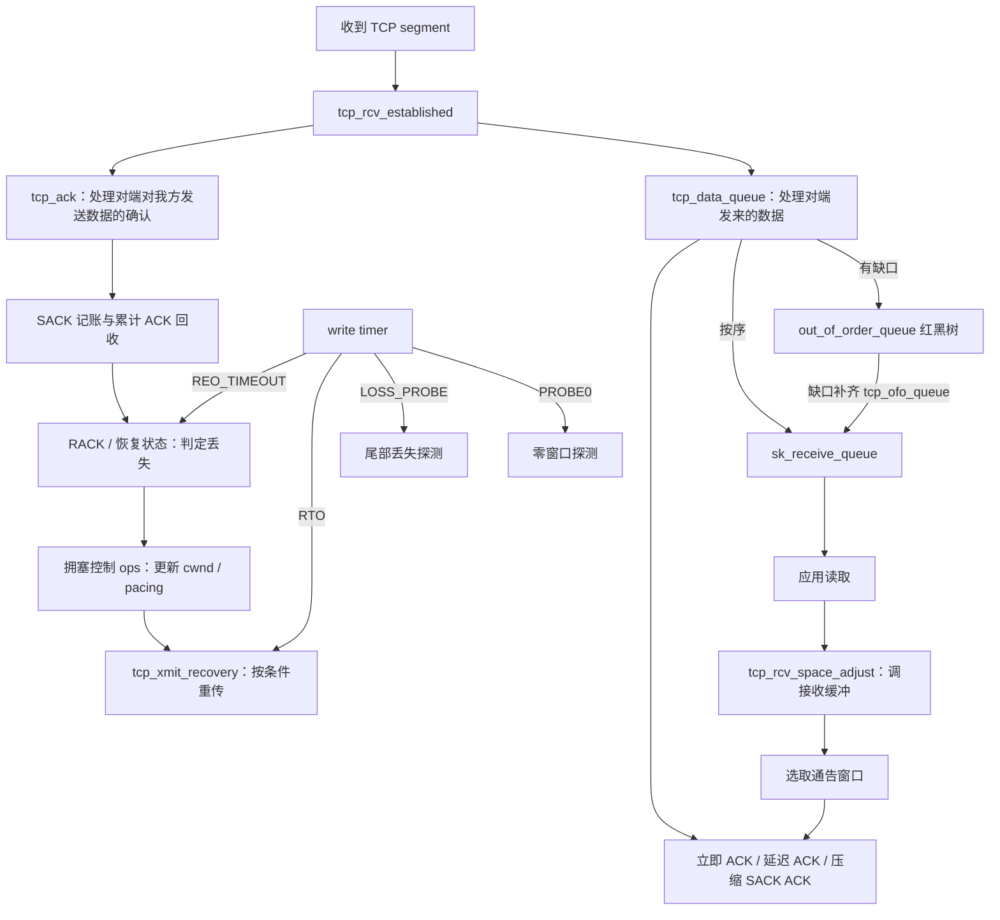

# 第 4 章：TCP 可靠性与性能机制

本篇回答：ACK 怎样驱动缓存回收、丢失检测和发送？乱序数据存在哪里？SACK、RACK、RTO 各解决什么问题？CUBIC 如何接入 TCP？接收窗口、自动调优、Nagle、delayed ACK 和 TSO/GSO 怎样相互影响？

前置阅读：[第 3 章](03-connection-lifecycle.md)，以及 TCP 字节序列号、累计 ACK、窗口的协议含义。预计阅读时间：60 分钟，实验另需 30–45 分钟。

范围：x86_64、IPv4、普通 TCP。源码根目录 `/home/chen/code/linux-lab/src/linux-6.18`；本章使用前再次确认 `git describe --always --dirty --tags` 为 `v6.18`。引用均相对此目录。省略 IPv6、MPTCP 及 ECN 细节；图和调用链给出主干，不声称所有 ACK 都经过所有分支。

## 1. 总览：接收、发送与反馈是同一连接里的两条方向



一个带数据的 TCP segment 也可能确认反方向的数据。`tcp_ack()` 处理“对端确认我发出的字节”；`tcp_ack_snd_check()` 处理“我该怎样确认收到的字节”。把两者混在一起，会误以为每收到数据都释放自己的接收队列。

`tcp_rcv_established()` 位于 `net/ipv4/tcp_input.c:6259`。它有 header prediction（报头预测）快路径，某些按序数据不必走下面通用的 `tcp_data_queue()`；下面的接收链明确是慢路径及乱序路径，不能用它给所有包的调用次数做相等断言。

## 2. ACK 的调用链：确认不只是 free 一个 skb

| 顺序 | 函数与源码 | 做什么 |
|---|---|---|
| 1 | `tcp_rcv_established()`，`net/ipv4/tcp_input.c:6259` | 校验并分流数据/ACK 的快慢路径 |
| 2 | `tcp_ack()`，`net/ipv4/tcp_input.c:3983` | 检查 ACK 范围，拒绝确认尚未发送的字节，更新发送端确认状态 |
| 3 | `tcp_ack_update_window()`，`net/ipv4/tcp_input.c:3731` | 在慢路径按序列号条件接受对端窗口更新，不能只见 window 字段就覆盖 |
| 4 | `tcp_sacktag_write_queue()`，`net/ipv4/tcp_input.c:2000` | 有 SACK 信息时标记发送重传树里已选择性确认的范围 |
| 5 | `tcp_clean_rtx_queue()`，`net/ipv4/tcp_input.c:3382` | 回收累计确认覆盖的数据，更新在途记账和 RTT 测量 |
| 6 | `tcp_fastretrans_alert()`，`net/ipv4/tcp_input.c:3108` | 对需要慢速恢复处理的 ACK 更新丢失与拥塞状态，决定后续恢复动作 |
| 7 | `tcp_cong_control()`，`net/ipv4/tcp_input.c:3638` | 根据算法 ops 与恢复状态更新 cwnd、发送 pacing（按时间节奏发送） |
| 8 | `tcp_xmit_recovery()`，`net/ipv4/tcp_input.c:3945` | 根据恢复动作调用实际重传队列发送 |

`tcp_ack()` 中直接调用这些步骤的主线见 `net/ipv4/tcp_input.c:4071`、`net/ipv4/tcp_input.c:4097`、`net/ipv4/tcp_input.c:4124`、`net/ipv4/tcp_input.c:4143`。旧 ACK、无在途数据、有效 SACK 等还有不同分支，所以上表是条件性的执行次序，不是固定八连调用。

发送侧至少要区分三个量：

- `snd_una`：累计确认左边界，之前的字节已被确认。
- `snd_nxt`：下一发送序列号；ACK 不能合法地确认其后的未发送数据。
- `snd_wnd` 与 `snd_cwnd`：前者是对端允许接收的字节窗口，后者是本机拥塞控制允许的段数窗口，单位不同。字段见 `include/linux/tcp.h:226`、`include/linux/tcp.h:305`。

发送未确认数据不只是“一个 skb 算一个包”。`tcp_packets_in_flight()`，`include/net/tcp.h:1385`，采用：

```c
return tp->packets_out - tcp_left_out(tp) + tp->retrans_out;
```

`tcp_left_out()` 包含 SACK 与 lost 记账，见 `include/net/tcp.h:1366`。这些计数按 TCP 逻辑段计算，GSO skb 可以表示多个段。把拥塞窗口直接和链表长度比较会得到错误结果。

## 3. 接收乱序与 SACK：数据树和发送侧记账不要画成一张表

假设 `rcv_nxt=1000`，先收到字节区间 `[2000,3000)`：累计 ACK 仍指向 1000；若已协商 SACK，ACK 的选项可告知“2000 到 2999 已收到”。等 `[1000,2000)` 到达后，内核才能把连续前缀推进到 3000。应用按字节流读取，不先读出缺口后面的 2000。

| 顺序 | 函数与源码 | 做什么 |
|---|---|---|
| 1 | `tcp_data_queue()`，`net/ipv4/tcp_input.c:5358` | 按 `rcv_nxt`、窗口与序列范围决定按序、重复、越界或乱序 |
| 2 | `tcp_data_queue_ofo()`，`net/ipv4/tcp_input.c:5132` | 检查内存，将乱序 skb 插入按序列号组织的红黑树，处理覆盖/合并并更新 SACK 块 |
| 3 | `tcp_ofo_queue()`，`net/ipv4/tcp_input.c:5043` | 缺口补齐后从最左节点开始，把可连续交付的区间转到接收队列 |
| 4 | `tcp_ack_snd_check()`，`net/ipv4/tcp_input.c:5954` → `__tcp_ack_snd_check()`，`net/ipv4/tcp_input.c:5887` | 决定立即确认、delayed ACK 或 SACK ACK 压缩 |
| 5 | `tcp_sacktag_write_queue()`，`net/ipv4/tcp_input.c:2000` | 在另一端收到上述 SACK 后更新其发送重传树的记账 |

接收方的 `out_of_order_queue` 与发送方的 `tcp_rtx_queue` 都使用红黑树，但角色不同：前者是已收到但还缺前缀的数据，后者是已发送而仍需跟踪的数据。名称带 `write_queue` 的 `tcp_sacktag_write_queue()` 在本版本会访问重传树；不能拿函数名替代结构检查。

`tcp_data_queue_ofo()` 使用 `ooo_last_skb` 加速尾部追加，并可合并相邻 skb，见 `net/ipv4/tcp_input.c:5175`。所以红黑树不意味着每包都做一次完整 O(log N) 查找。也不能承诺所有乱序段必保留：`tcp_try_rmem_schedule()`，`net/ipv4/tcp_input.c:5115`，可能在内存限制下失败。

SACK（Selective Acknowledgment，选择性确认）是接收信息；RACK 是发送端判断丢失的算法。SACK 不会让 `snd_una` 越过未补齐的缺口，也不等价于应用已经读走数据。DSACK（重复数据的 SACK 报告）还可给发送端提供“可能误重传”的反馈；本章不展开所有恢复撤销条件。

## 4. RACK、重传与定时器

### 4.1 RACK 不等于数到三个重复 ACK

RACK（Recent ACKnowledgment，基于最近确认的丢失检测）比较**本地发送时间**。当较晚发送的数据已被 ACK/SACK 确认，较早发送却未确认的数据就有了可疑依据；再考虑 RTT 和 reordering window（允许乱序的时间窗口），才判断是否标记丢失。不是给每个 skb 都单独启动一个 RTO，也不要求对端 TCP timestamp 选项来提供这份本地发送时间。

| 顺序 | 函数与源码 | 做什么 |
|---|---|---|
| 1 | `tcp_rack_advance()`，`net/ipv4/tcp_recovery.c:118` | ACK/SACK 记账时更新已确认段中最新的发送时间、对应 RTT 和结束序列号 |
| 2 | `tcp_identify_packet_loss()`，`net/ipv4/tcp_input.c:3077` | 在恢复判断中分流：非 SACK 的 NewReno 路径或 RACK 路径 |
| 3 | `tcp_rack_mark_lost()`，`net/ipv4/tcp_recovery.c:95` | 有新确认进展时检测丢失；若仍需等待则设置 REO_TIMEOUT |
| 4 | `tcp_rack_detect_loss()`，`net/ipv4/tcp_recovery.c:58` | 遍历按发送时间组织的未 SACK 队列，对超时的可疑 skb 标 lost |
| 5 | `tcp_rack_reo_timeout()`，`net/ipv4/tcp_recovery.c:149` | 等待乱序期限后再检查，必要时进入恢复并发送重传 |
| 6 | `tcp_xmit_retransmit_queue()`，`net/ipv4/tcp_output.c:3659` → `tcp_retransmit_skb()`，`net/ipv4/tcp_output.c:3629` | 按发送额度实际重传，并更新重传记账 |

不是第 1 步每次都会紧接第 5 步；第 3 步安排未来事件，第 5 步才在未来真正执行。`tcp_rack_advance()` 的两个调用来源包括 SACK 标记和累计 ACK 清理，见 `net/ipv4/tcp_input.c:1569`、`net/ipv4/tcp_input.c:3445`。

`tcp_rack_reo_wnd()`，`net/ipv4/tcp_recovery.c:5`，根据是否已见乱序、恢复状态、最小 RTT 和 `reo_wnd_steps` 决定容忍量；某些条件下可为 0。`tcp_rack_update_reo_wnd()`，`net/ipv4/tcp_recovery.c:187`，根据 DSACK 反馈调整它。不要把它写成永远固定的 RTT/4。

还有一个命名陷阱：`tcp_is_reno()`，`include/net/tcp.h:1361`，判断的是**没有协商 SACK**，不能从此断言该 socket 的拥塞控制 ops 名字叫 Reno。一个 CUBIC 连接也可能没有 SACK。

### 4.2 定时器是多种协议事件，不是一个“TCP 超时”

`tcp_init_xmit_timers()`，`net/ipv4/tcp_timer.c:895`，建立 write、delack、keepalive 定时器，并初始化 pacing 和 compressed ACK 的高精度定时器。普通被动握手的 request 定时器另见第 3 章。

| 事件 | 调度或分发依据 | 到期执行函数与源码 | 主要目的 |
|---|---|---|---|
| RTO：Retransmission Timeout，重传超时 | write timer，`ICSK_TIME_RETRANS` | `tcp_retransmit_timer()`，`net/ipv4/tcp_timer.c:531` | 缺少充分确认反馈时的可靠性兜底；检查终止条件、进入 loss、重传队首并重设超时 |
| RACK 乱序等待 | write timer，`ICSK_TIME_REO_TIMEOUT` | `tcp_rack_reo_timeout()`，`net/ipv4/tcp_recovery.c:149` | 给可疑段一定时间，减少把乱序误判为丢失 |
| TLP：Tail Loss Probe，尾部丢失探测 | write timer，`ICSK_TIME_LOSS_PROBE` | `tcp_send_loss_probe()`，`net/ipv4/tcp_output.c:3107` | 发新数据或重传尾部，尝试得到反馈，避免只能长等 RTO |
| persist / 零窗口探测 | write timer，`ICSK_TIME_PROBE0` | `tcp_probe_timer()`，`net/ipv4/tcp_timer.c:387` | 有数据待发但对端窗口为 0 时探测窗口恢复 |
| delayed ACK | 独立 delack timer | `tcp_delack_timer_handler()`，`net/ipv4/tcp_timer.c:307` | 已安排但尚未发出的确认到期发送 |
| keepalive | 独立 socket timer | `tcp_keepalive_timer()`，`net/ipv4/tcp_timer.c:779` | 按启用条件检查空闲连接，也含孤儿 FIN_WAIT2 的清理处理 |
| pacing | 高精度 timer | `tcp_pace_kick()`，`net/ipv4/tcp_output.c:1397` | 到允许发送的时刻重新推动发送 |
| compressed ACK | 高精度 timer | `tcp_compressed_ack_kick()`，`net/ipv4/tcp_timer.c:867` | 合并短时间内的部分 SACK ACK，避免确认过于密集 |

write timer 通过 `icsk_pending` 在前四种事件之间分发，见 `tcp_write_timer_handler()`，`net/ipv4/tcp_timer.c:691`；事件常量见 `include/net/inet_connection_sock.h:139`。**四个逻辑事件不代表四个独立并行挂起的底层 timer。**

TLP 的调度有 SACK、拥塞状态和在途数据等条件，见 `tcp_schedule_loss_probe()`，`net/ipv4/tcp_output.c:3036`。RTO 会退避，但不能把 SYN、薄流、本地资源失败等分支一律简化成无条件乘 2。普通已建立连接的一次 RTO 重传调用见 `net/ipv4/tcp_timer.c:627`。

定时器到期也不意味着立即改 socket：`tcp_write_timer()`，`net/ipv4/tcp_timer.c:726`，发现应用持有 socket 时把工作延后。观察到 timer 到期和观察到发送报文之间存在调度与锁的边界。

### 4.3 重传 tracepoint 能证明什么

`tcp_retransmit_skb()` → `__tcp_retransmit_skb()`，`net/ipv4/tcp_output.c:3487`，最后会经过下层发送接口。`tcp:tcp_retransmit_skb` 的触发位于`net/ipv4/tcp_output.c:3625`，字段定义在 `include/trace/events/tcp.h:16`，含 `err`。

这个 tracepoint 记录的是内核重传路径及其返回值，不证明物理网卡已经把帧送到线路上；同样不直接说明原因一定是 RTO。RACK、恢复路径、TLP 重传等需要结合调用栈或上面的执行函数区分。`err != 0` 的事件不能当作成功发包数。

## 5. 拥塞控制框架：CUBIC 只负责它被委派的部分

`tcp_congestion_ops` 位于 `include/net/tcp.h:1230`；socket 通过 `icsk_ca_ops` 选择算法，并把算法私有数据放入 `icsk_ca_priv`，见 `include/net/inet_connection_sock.h:91`、`include/net/inet_connection_sock.h:135`。

| 接口 | 作用 | CUBIC 对应函数 |
|---|---|---|
| `init` | 初始化算法私有状态 | `cubictcp_init()`，`net/ipv4/tcp_cubic.c:129` |
| `cong_avoid` | 按 ACK 进展调整拥塞窗口 | `cubictcp_cong_avoid()`，`net/ipv4/tcp_cubic.c:324` |
| `ssthresh` | 给出丢失后的慢启动阈值 | `cubictcp_recalc_ssthresh()`，`net/ipv4/tcp_cubic.c:341` |
| `set_state` | 接收拥塞状态变化通知 | `cubictcp_state()`，`net/ipv4/tcp_cubic.c:358` |
| `pkts_acked` | 获得 ACK/RTT 样本 | `cubictcp_acked()`，`net/ipv4/tcp_cubic.c:452` |
| `cong_control` | 可接管更完整的拥塞控制和 pacing 更新 | CUBIC 不设置这个成员；不能与 `cong_avoid` 当作两次连续回调 |

注册与使用链：

1. `cubictcp_register()`，`net/ipv4/tcp_cubic.c:504` → `tcp_register_congestion_control()`，`net/ipv4/tcp_cong.c:92`：注册名为 `cubic` 的 ops。ops 表见 `net/ipv4/tcp_cubic.c:478`。
2. `tcp_assign_congestion_control()`，`net/ipv4/tcp_cong.c:215`：为 socket 选择算法并持有相应引用；`tcp_init_congestion_control()`，`net/ipv4/tcp_cong.c:235`，执行 init。
3. ACK 后的 `tcp_cong_control()`，`net/ipv4/tcp_input.c:3638`：若算法提供 `cong_control` 则调用后返回；否则按恢复状态做公共窗口缩减或进入 `tcp_cong_avoid()`，`net/ipv4/tcp_input.c:3293`。
4. CUBIC 的 `cubictcp_cong_avoid()`，`net/ipv4/tcp_cubic.c:324`：先判断是否被 cwnd 限制，慢启动时用公共逻辑，再由 `bictcp_update()`，`net/ipv4/tcp_cubic.c:214`，根据时间与上次拥塞前的窗口计算增长节奏。
5. 实际数据发送仍由 `tcp_write_xmit()`，`net/ipv4/tcp_output.c:2901`，综合 pacing、cwnd、对端窗口和队列限制决定。

CUBIC 用距 epoch（本轮增长起点）的时间及上次最大窗口影响增长曲线；它不是收到每个 ACK 就无条件加 1。`cubictcp_recalc_ssthresh()` 也并非固定把窗口减半：代码使用可配置的 `beta / BICTCP_BETA_SCALE` 比例，不在这里硬编码运行时参数。

CUBIC 的任务不包括保存全部重传 skb、实现接收乱序树或解析 TCP 握手。公共 TCP 框架维护可靠性与恢复状态，算法计算允许发送量并接收事件；源码接口的这种拆分允许替换算法而不重写整个协议栈。

## 6. 接收窗口与缓冲区自动调优

`rwnd`（接收方通告的窗口）回答“还能接收多少字节”；`sk_rcvbuf` 是 socket 接收内存预算；`sk_rmem_alloc` 记已占用内存，其中包含 skb 的实际占用。它们不是同一个数字。一个只载几十字节的 skb 也有元数据和分配开销，不能按 payload 之和直接推导全部内存成本。注释与准入判断见 `net/ipv4/tcp_input.c:5094`。

| 顺序 | 函数与源码 | 做什么 |
|---|---|---|
| 1 | 接收/应用消费路径调用 `tcp_rcv_space_adjust()`，例见 `net/ipv4/tcp.c:2303` | 应用读取推进 `copied_seq` 后，给调优逻辑机会 |
| 2 | `tcp_rcv_space_adjust()`，`net/ipv4/tcp_input.c:933` | 按接收 RTT 间隔观察应用消费量，并扣除当前还未读取的字节 |
| 3 | `tcp_rcvbuf_grow()`，`net/ipv4/tcp_input.c:894` | 在允许自动调优时扩大预算；受 `tcp_rmem[2]` 限制，也考虑乱序跨度 |
| 4 | `__tcp_select_window()`，`net/ipv4/tcp_output.c:3251` | 根据可用空间、窗口限制、缩放和内存压力求候选窗口 |
| 5 | `tcp_select_window()`，`net/ipv4/tcp_output.c:262` | 结合当前通告状态及缩放编码，产生 TCP header 使用的窗口 |

`tcp_grow_window()`，`net/ipv4/tcp_input.c:682`，在收包侧调节接收窗口相关阈值；它和“应用读取后扩大 `sk_rcvbuf`”不是同一个动作。

`tcp_moderate_rcvbuf`、`tcp_rmem` 注册见 `net/ipv4/sysctl_net_ipv4.c:1328`、`net/ipv4/sysctl_net_ipv4.c:1429`。本版本 `tcp_rcvbuf_grow()` 在关闭自动调优或设置 `SOCK_RCVBUF_LOCK` 时不扩大 `sk_rcvbuf`；显式设置 `SO_RCVBUF` 会走用户锁定接收缓冲的代码，见 `net/core/sock.c:980`。因此实验中要比较自动调优，就不要同时在应用中固定 SO_RCVBUF 后还期待同一增长路径生效。

TCP 接收窗口也不能保证永不丢弃报文：内存竞争和乱序对象成本仍可能令准入失败。把本地可用内存、已通告信用和应用消费速度区分开，才知道吞吐为何受限。

## 7. Nagle、delayed ACK 与 TSO/GSO

### Nagle：发送方向的短段等待

`tcp_nagle_check()`，`net/ipv4/tcp_output.c:2148`，在短段、已有在途数据及 `tcp_minshall_check()` 等条件下决定等待；`tcp_nagle_test()`，`net/ipv4/tcp_output.c:2272`，还处理紧急数据、FIN 和显式 push 等条件。这是带 Minshall 改进的实现，不能简化成“有任何未确认字节就禁止发送所有短段”。

`TCP_NODELAY` 通过 `__tcp_sock_set_nodelay()`，`net/ipv4/tcp.c:3635`，设置 `TCP_NAGLE_OFF` 并推动待发数据。它不绕过 cwnd、rwnd、pacing 或设备背压。`TCP_CORK`（应用要求暂存零散输出）还有独立语义，不能把二者当作完全对称的开关。

### delayed ACK：接收方向的确认等待

`__tcp_ack_snd_check()`，`net/ipv4/tcp_input.c:5887`，按收到的数据量、窗口变化、quickack 和强制 ACK 标记等决定何时确认。`tcp_send_delayed_ack()`，`net/ipv4/tcp_output.c:4364`，可能设置 timer，也可能发现旧期限将到而立即 ACK。不要写成“Linux 永远每两个包 ACK 一次”或“永远等固定 40ms”。

Nagle 与 delayed ACK 可能让某些小请求模式互相等待：发送者希望 ACK 到来后再发短尾段，接收者希望再收到数据或等期限到再 ACK。是否发生、等待多久受 quickack、应用写入方式和传输历史影响。`TCP_QUICKACK` 处理见 `net/ipv4/tcp.c:3653`，只是改变相关 ACK 策略状态，不是永久保证以后每个段一个 ACK。

### TSO/GSO：批量表示与分段，不改字节流可靠性

TSO（TCP Segmentation Offload，网卡 TCP 分段卸载）允许把分段交给支持的设备；GSO（Generic Segmentation Offload，通用分段卸载）提供软件分段体系。TCP 可以用一个较大的 skb 表示多个逻辑段，然后由下层按能力处理。

| 顺序 | 函数与源码 | 做什么 |
|---|---|---|
| 1 | `tcp_write_xmit()`，`net/ipv4/tcp_output.c:2901` | 选取可发数据并检查各类发送限制 |
| 2 | `tcp_set_skb_tso_segs()`，`net/ipv4/tcp_output.c:1669` | 按 MSS 算逻辑段数，保存 TCP GSO 分段大小 |
| 3 | `tcp_tso_should_defer()`，`net/ipv4/tcp_output.c:2366` | 多段 skb 在条件允许时等待更合适的批量发送机会 |
| 4 | `tcp_transmit_skb()` 的调用，`net/ipv4/tcp_output.c:2999` | 交给下层发包；这时不一定已经拆成线路上逐个段 |
| 5 | `tcp_event_new_data_sent()`，`net/ipv4/tcp_output.c:69` | 推进发送序列，把 skb 从待发送队列转入重传树，按逻辑段增加记账 |
| 6 | `tcp4_gso_segment()`，`net/ipv4/tcp_offload.c:98` → `tcp_gso_segment()`，`net/ipv4/tcp_offload.c:132` | 下层需要 TCP 软件分段时使用；不是每个硬件 TSO skb 都必经此分支 |

网络设备校验路径里的 GSO 调用见 `net/core/dev.c:3997`。TX completion（设备发送完成）最多说明设备不再需要某份发送资源；收到远端 ACK 才能推进可靠传输的确认边界。一次 DMA 完成不等于对端收到数据。

## 8. 关键数据结构

| 结构与源码 | 字段 | 本章含义 |
|---|---|---|
| `sock`，`include/net/sock.h:399`、`include/net/sock.h:477` | `sk_receive_queue`、`sk_write_queue`、`tcp_rtx_queue` | 可读数据、待发数据、已发送待跟踪数据 |
| `sock`，`include/net/sock.h:414`、`include/net/sock.h:431` | `sk_rmem_alloc`、`sk_rcvbuf` | 内存占用与接收预算 |
| `tcp_sock`，`include/linux/tcp.h:226`、`include/linux/tcp.h:305` | `snd_wnd`、`snd_cwnd`、`snd_una`、`snd_nxt`、`rcv_nxt` | 两种发送额度与双向字节边界 |
| `tcp_sock`，`include/linux/tcp.h:230`、`include/linux/tcp.h:248`、`include/linux/tcp.h:310` | `lost_out`、`sacked_out`、`retrans_out`、`packets_out` | 逻辑段记账，不能直接替换成 skb 数量 |
| `tcp_sock`，`include/linux/tcp.h:255`、`include/linux/tcp.h:279`、`include/linux/tcp.h:380` | `out_of_order_queue`、`tsorted_sent_queue`、`rack` | 接收乱序树、发送时间顺序队列、RACK 时间与容忍状态 |
| `tcp_sock`，`include/linux/tcp.h:309`、`include/linux/tcp.h:320`、`include/linux/tcp.h:360` | `srtt_us`、`rcv_wnd`、`rcvq_space` | 平滑 RTT（字段值左移 3 位）、通告窗口、应用消费测量 |
| `inet_connection_sock`，`include/net/inet_connection_sock.h:86`、`include/net/inet_connection_sock.h:101` | `icsk_rto`、`icsk_pending`、`icsk_ca_ops` | RTO、write timer 当前事件、算法接口 |
| `tcp_skb_cb`，`include/net/tcp.h:1022` | `seq`、`end_seq`、`sacked` | 每个 skb 的序列范围与发送侧 SACK/lost/retrans 标记 |
| CUBIC 的 `bictcp`，`net/ipv4/tcp_cubic.c:86` | `cnt`、`last_max_cwnd`、`epoch_start` | 每次增长所需 ACK 数、上次峰值、当前增长周期 |

## 9. 为什么这样设计

以下取舍是依据源码的解释，推测不作为历史作者意图的引文。

- **ACK 集中驱动反馈。** 同一次确认更新 RTT、回收、丢失记账和拥塞控制。推测：复用已访问的连接状态减少重复工作，但也令 ACK 路径成为性能热点，需快慢路径和条件回调。
- **乱序按范围组织，尾部追加另做优化。** 红黑树处理任意插入，尾节点缓存和合并优化常见情况。推测：这兼顾异常乱序与大多近似有序的实际负载。
- **算法与可靠性分开。** `tcp_congestion_ops` 更换发送控制策略，公共层保留重传和确认语义。推测：使算法实验与协议正确性边界更清楚，也减少每个算法重复维护状态机。
- **timer 只表达等待，处理函数执行状态变化。** 共享 write timer 通过事件标记分发，应用占锁时延后。推测：减少每连接资源，同时显式处理调度与并发；代价是不能只看 timer 名字推断原因。
- **批量数据仍按逻辑段记账。** GSO 降低每 skb 开销，同时保留 MSS、序列范围和段数。推测：吞吐优化不必牺牲拥塞窗口与重传算法的度量精度。

## 10. 验证实验：用一个 QEMU 客体构造可控链路

**执行状态：未在 v6.18 QEMU 客体实跑；输出均为示意。** 不在宿主运行。客体需 root、iproute2（含 `tc`）、iperf3、bpftrace、可选 ethtool。`uname -r` 应为该 v6.18 构建。配置名已核对：`CONFIG_NET_NS`（`init/Kconfig:1402`）、`CONFIG_VETH`（`drivers/net/Kconfig:440`）、`CONFIG_NET_SCH_NETEM`（`net/sched/Kconfig:195`），追踪配置见第 3 章。

### 10.1 只在本实验新建的 namespace 内施加损伤

确认客体中没有 `ll4c`、`ll4s`，然后执行；若名称已存在，换名字，不删除既有对象：

```bash
sudo bash <<'SH'
set -eu
ip netns add ll4c
ip netns add ll4s
ip link add v4c type veth peer name v4s
ip link set v4c netns ll4c
ip link set v4s netns ll4s
ip -n ll4c addr add 192.0.2.1/24 dev v4c
ip -n ll4s addr add 192.0.2.2/24 dev v4s
ip -n ll4c link set lo up
ip -n ll4s link set lo up
ip -n ll4c link set v4c up
ip -n ll4s link set v4s up
ip netns exec ll4c tc qdisc add dev v4c root netem delay 20ms
ip netns exec ll4s tc qdisc add dev v4s root netem delay 20ms
SH
```

这里是一个客体内两个隔离网络栈，经 veth 通信；没有模拟真实网卡 DMA。先保留分段卸载默认值观察整体表现。若要减少大 skb 对 netem 丢包粒度的影响，客体安装 ethtool 后检查两端 `ethtool -k`，在支持的情况下关闭 TSO/GSO/GRO，并记录成功或不支持的项。不能把“netem loss 1%”直接解释成物理线速 TCP 段恰好随机丢 1%。

### 10.2 基线与 CUBIC、接收缓冲

先确认可用算法和接收调优设置；sysctl 注册已核对 `net/ipv4/sysctl_net_ipv4.c:964`、`net/ipv4/sysctl_net_ipv4.c:971`、`net/ipv4/sysctl_net_ipv4.c:1328`、`net/ipv4/sysctl_net_ipv4.c:1429`：

```bash
sudo ip netns exec ll4c sysctl net.ipv4.tcp_available_congestion_control
sudo ip netns exec ll4s sysctl net.ipv4.tcp_moderate_rcvbuf net.ipv4.tcp_rmem
```

终端 B 启动一次性服务端，终端 C 启动客户端。若没有 cubic，记录缺少算法/模块，本实验不冒称用了 CUBIC：

```bash
# 终端 B
sudo ip netns exec ll4s iperf3 -s -1
# 终端 C，等终端 B 开始监听后再运行
sudo ip netns exec ll4c iperf3 -c 192.0.2.2 -t 20 -C cubic
```

流量运行时在另一个终端观察双端：

```bash
sudo ip netns exec ll4c ss -tinm dst 192.0.2.2
sudo ip netns exec ll4s ss -tinm src 192.0.2.2
```

预期输出会包含算法名 `cubic`、`rtt:...`、`cwnd:...` 和 socket 内存信息。记录多个时刻，而不是把某个 cwnd 当作常量。iperf3 有控制连接和数据连接，按传输字节量辨别；仅按端口过滤仍可能看到两者。若接收预算没有增长，先检查应用消费量是否达到增长条件，不能仅凭它断言调优失败。

需要看到源码路径时，先检查相应函数可探测，再在无其他业务的客体做短时计数：

```bash
sudo bpftrace -l 'kprobe:tcp_rcv_space_adjust'
sudo bpftrace -l 'kprobe:tcp_rcvbuf_grow'
sudo bpftrace -e '
kprobe:tcp_rcv_space_adjust,kprobe:tcp_rcvbuf_grow
{ @[probe] = count(); }'
```

函数被调用不等于预算一定增加；要比较同一连接前后的 `ss -m` 或读取 `sk_rcvbuf` 才能证实实际增长。这正对应源码中条件提前返回的分支。

### 10.3 丢包、乱序与不同重传原因

再次启动服务端前，先给客户端发送方向加入随机丢包：

```bash
sudo ip netns exec ll4c tc qdisc replace dev v4c root netem delay 20ms loss 1%
sudo bpftrace -lv 'tracepoint:tcp:tcp_retransmit_skb'
sudo bpftrace -e '
tracepoint:tcp:tcp_retransmit_skb
/args->family == 2 && (args->sport == 5201 || args->dport == 5201)/
{ printf("retrans sk=%p ports=%d:%d err=%d\n",
         args->skaddr, args->sport, args->dport, args->err); }'
```

在终端 B/C 重复 20 秒 iperf3。预期吞吐和 `cwnd` 会变化，重传探针可出现：

```text
retrans sk=0x... ports=客户端端口:5201 err=0
```

随机实验不保证某个次数；没有事件时增大传输时长并检查 qdisc 的 `tc -s qdisc show dev v4c` 丢包计数。不要预填测量数字。

另一次实验，先检查这些函数存在，再记录计数：

```bash
sudo bpftrace -l 'kprobe:tcp_rack_reo_timeout'
sudo bpftrace -l 'kprobe:tcp_retransmit_timer'
sudo bpftrace -l 'kprobe:tcp_send_loss_probe'
sudo bpftrace -e '
kprobe:tcp_rack_reo_timeout,kprobe:tcp_retransmit_timer,kprobe:tcp_send_loss_probe
{ @[probe] = count(); }'
```

RACK 可以在 ACK 处理时立即判定，不必经过 `tcp_rack_reo_timeout()`；该计数为 0 不能证明 RACK 未工作。若要强制制造没有确认反馈的时段，在一次持续传输已开始后，将服务端 veth 出方向临时设为 100% 丢包，3 秒后恢复：

```bash
sudo bash <<'SH'
set -eu
trap 'ip netns exec ll4s tc qdisc replace dev v4s root netem delay 20ms' EXIT
ip netns exec ll4s tc qdisc replace dev v4s root netem loss 100%
sleep 3
SH
```

预期可以看到 TLP/RTO 等等待机制的活动；具体先后取决于开始损伤时连接已有的状态。这里也会丢控制连接反馈，不能直接用吞吐下降量反推数据连接重传次数。要归因单次重传，可在对应 tracepoint 打印内核调用栈，并将同一个 socket 地址与函数事件时间关联。

观察乱序则把客户端方向改成下面配置，另开一次传输：

```bash
sudo ip netns exec ll4c tc qdisc replace dev v4c root netem delay 20ms reorder 25% 50%
sudo bpftrace -l 'kprobe:tcp_data_queue_ofo'
sudo bpftrace -e 'kprobe:tcp_data_queue_ofo { @[probe] = count(); }'
```

`tcp_data_queue_ofo()` 为静态函数，优化可能令它不可探测。只有探针列表中存在时才执行；否则记录未确认并用抓包的序列号、SACK 块和接收端统计交叉检查。本实验不承诺每个乱序事件都触发重传。

### 10.4 小包与卸载的观察边界

可在上述基线传输期间比较 `tcp_send_delayed_ack` 与 `tcp_delack_timer_handler` 的计数；前者安排或提前发送 ACK，后者才是 timer 处理，次数不必相等。小请求 Nagle/delayed ACK 延迟的定量对照需要专门控制应用写入节奏，本篇未实跑，留为后续实验。

TSO/GSO 对照可在两端记录 ethtool 特性前后重复基线，并结合抓包/逻辑段计数比较。veth 实验可以展示软件大 skb 与分段，**不能验证物理 NIC 的 TSO 实现或性能收益**；需要 QEMU 虚拟网卡或真实网卡的独立实验。

完成所有流量并用 Ctrl-C 退出探针后，确认两个 namespace 内进程已结束，再清理仅本实验新建的对象：

```bash
sudo ip netns pids ll4c
sudo ip netns pids ll4s
# 上面两条为空后执行
sudo ip netns del ll4c
sudo ip netns del ll4s
```

## 11. 对用户态协议栈的启示

1. 分开定义字节序列边界、逻辑段数和内存占用。批量发包、TSO 与 mbuf 合并之后，这三种计量会立即分离。
2. 把“识别丢失”“选择恢复状态”“执行重传”“决定下一发送期限”作为不同操作；即使一个 worker 顺序执行，也不要把它们混成一个只按超时重发的函数。
3. 先实现明确的拥塞控制接口和应用背压，再做批量优化。接收有内存上限，发送有 cwnd/rwnd/pacing 约束；TX ring 空并不代表协议允许无限发送。

## 12. 要点回顾

- ACK 推动确认、RTT、丢失记账、拥塞控制和后续发送。
- 接收乱序树、发送重传树与发送时间队列是不同结构。
- SACK 报告范围，RACK 依据本地发送时间和反馈判断丢失。
- RTO 是兜底，write timer 还复用给 RACK、TLP 和零窗口探测。
- CUBIC 接入 ops，公共 TCP 保留可靠性与实际发送控制。
- rwnd、接收内存预算与应用读取速度是不同量。
- Nagle、delayed ACK 和 TSO/GSO 优化不同环节，不能互相当作开关替代。

## 13. 与 DPDK/VPP 的对照

| DPDK/VPP 经验 | 可以对照 | 不成立的地方 |
|---|---|---|
| mbuf 链或 vector 批处理 | 一个 GSO skb 表示多个逻辑段 | 一个 skb 不一定一个 TCP 段，cwnd 不能按 vector 长度计 |
| TX descriptor completion | 下层发送资源可回收 | 不代表远端 TCP 确认，仍有重传所有权 |
| ring 水位与 worker 背压 | socket 内存预算与应用消费 | 接收窗口已通告给远端，远端反馈有 RTT，不能只按本地 ring 空闲槽即时决定 |
| timer wheel / per-worker timer | TCP timer 的到期事件 | 仍须区分重排等待、可靠性超时、零窗口与 ACK；一个统一 tick 不等于一个协议策略 |
| feature node / ops 分发 | 拥塞控制 ops | 算法有每连接状态与严格的事件顺序，不能任意换节点后丢弃旧状态 |

## 14. 自测题

1. 收到 SACK `[2000,3000)` 后，为什么累计确认边界可能仍是 1000？两端哪些结构发生变化？
2. CUBIC 连接进入 `tcp_is_reno()` 分支是否矛盾？
3. RACK REO_TIMEOUT 与 RTO 是否是每连接两个独立的 write timer？它们的目标差别是什么？
4. 一个 GSO skb 表示 10 个逻辑段。把它发出后 `packets_out` 只加 1 会有什么问题？
5. 为什么打开 TCP_NODELAY 后，应用一次短写仍不保证马上上线路？为什么探测到 `tcp_rcvbuf_grow()` 也不证明接收预算增长？

<details>
<summary>参考答案</summary>

1. `[1000,2000)` 仍缺失。接收方把后到区间放入乱序树并生成 SACK；发送方更新重传树对应范围的 SACK 记账。累计 ACK 不能越过缺口，应用也不会先收到缺口后的字节。
2. 不矛盾。此处 `tcp_is_reno()` 识别未启用 SACK 的可靠性恢复路径，不等于拥塞控制 ops 必须选 Reno。
3. 不是。二者与 TLP、PROBE0 通过 `icsk_pending` 复用 write timer。REO_TIMEOUT 给疑似乱序等待，RTO 在确认反馈不足时兜底重传。
4. 低估在途数据，破坏 cwnd 限制、恢复和确认记账。必须依据 skb 的逻辑段数，且重分段后同步更新。
5. NODELAY 取消相应 Nagle 等待，但仍受 cwnd/rwnd、pacing、内存和设备队列限制。`tcp_rcvbuf_grow()` 有自动调优开关、用户锁和大小比较等分支，调用不代表实际写大 `sk_rcvbuf`。

</details>
