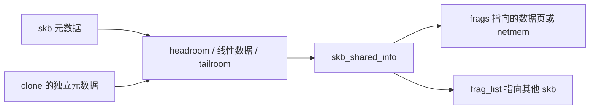

# A1. sk_buff：数据存储与协议状态分开

本篇回答：为什么不是一个连续缓冲区？clone 共享什么？headroom 为什么能省复制？前置阅读：网络栈全景、C 指针与引用计数。预计阅读：10 分钟。源码基准：Linux v6.18；路径均相对内核源码根目录。

## 1. 问题

TCP 必须保留未确认数据供重传，下层发送又要构造自己的头部。每次完整复制浪费带宽，直接共用可写缓冲区则会破坏旧状态。文件页、用户页、网卡接收页也不天然构成同一连续分配。

## 2. 约束

通用栈要兼容不同驱动、隧道和 scatter-gather（分散聚集）能力。小包应能直接访问包头，大数据应能复用已有页。设备发送完成与 TCP 收到 ACK 是不同释放时机。内存 fragment 是存储分段，不等于 IP 分片。

## 3. 方案

`sk_buff` 保存协议元数据；线性 head buffer 保存可直接访问的部分；`skb_shared_info.frags[]` 和 `frag_list` 表示非线性数据。定义见 `include/linux/skbuff.h:593`、`include/linux/skbuff.h:885`。shared info 位于 head buffer 末尾，不是 skb 的内嵌成员。

`__skb_clone()` 复制描述字段并增加 `dataref`，通常不复制 payload（载荷），见 `net/core/skbuff.c:1541`。这与多个持有者共用同一个 skb 元数据的引用计数是两回事。写共享数据前仍需确认可写性，不能把 clone 当成深拷贝。

TCP 的特殊约定写在 `include/linux/skbuff.h:632`：`dataref` 低 16 位统计总引用，高 16 位统计只保留 payload 的引用。唯一需要头部的 clone 可在预留空间写头；多个可写头部持有者则要复制。该约定不支持任意数量、不同头部长度的 payload-only 对象。

`skb_reserve()` 只移动空 skb 的 data/tail，预留 headroom，不搬数据（`include/linux/skbuff.h:2925`）。空间不够或头部共享时，`skb_cow_head()` 请求写时复制，见 `include/linux/skbuff.h:3885`。省复制依赖布局与所有权条件，不是接口的无条件保证。

## 4. 演进

| commit / 作者 | 动机与证据 | 性能数据 |
|---|---|---|
| `b2b5ce9d1ccf` / Eric Dumazet | 引入 `build_skb()`；先给 RX ring 准备数据区，收包完成后才构造元数据，避免初始化后长时间等待导致 cache 变冷。 | 该提交未提供性能数据。 |
| `9ec7ea146208` / Jakub Kicinski | 重写 payload-only/dataref 文档，说明已有约定；不能当作 clone 的最初引入。 | 该提交未提供性能数据。 |

用 `git log -S 'SKB_DATAREF_SHIFT' -- include/linux/skbuff.h` 可继续向前追溯。2005 年 Git 初始树已包含相关机制；真正初次引入的提交与动机【未确认】，不把初始导入当设计起源。

## 5. 取舍

减少数据复制，换来引用计数、非线性遍历、COW 和失败分支。headroom 以空间换追加头部的速度；小包多、封装浅时可能浪费内存。从代码可推断，跨 CPU clone、频繁改 payload、设备缺少相应能力时，这套通用表示的成本更明显；这里没有本机性能测量。

## 6. 用户态对照

lwIP 2.2.0 的 `pbuf` 同样有链、引用计数与预留头部；连续 `PBUF_RAM` 和外部引用类型承担不同所有权契约。小栈也无法消除缓冲区生命期问题。[固定版本 pbuf.h](https://raw.githubusercontent.com/lwip-tcpip/lwip/STABLE-2_2_0_RELEASE/src/include/lwip/pbuf.h)

## 7. 验证

在目标 v6.18 上用 `perf record -a -g -- sleep 10` 观察既有测试流量，检查 `skb_clone`、头部扩展与复制的调用栈；同样负载改变封装层数后比较每字节 CPU 成本。采样可能漏掉短函数，符号不存在不能解释为从未调用。此实验未运行。

## 要点回顾

- 包描述符和 payload 可以独立复制、共享和释放。
- headroom 与共享引用都是调用契约；违反契约会变成正确性问题。
- 非线性数据省复制，也使访问、校验和与硬件适配更复杂。

## 自测

1. clone 后能否随意改 payload？
2. `skb_reserve()` 是否分配内存？
3. 一个 skb 是否一定对应一个线上包？

答案

1. 不能；独立元数据不代表独占数据。2. 不分配，只在已有空缓冲区中预留空间。3. 不一定，C2 的 GSO 可让一个 skb 表示多个待分段报文。

## 与 DPDK/VPP 的对照

可把 skb 的共享数据类比 DPDK indirect mbuf，把 headroom 类比 mbuf 预留头部；但 skb 还服务 socket 记账、可靠重传与通用内核上下文。DPDK 是包处理框架，本身不提供这些 TCP 保证。[DPDK 24.11 Mbuf 文档](https://doc.dpdk.org/guides-24.11/prog_guide/mbuf_lib.html)
