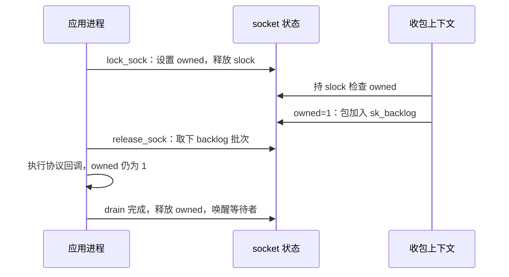

# B1. socket 双重锁：把不能等待的收包工作暂存起来

本篇回答：进程持有 socket 时 softirq 怎么办？backlog 为何不是普通接收队列？前置阅读：softirq、A2。预计阅读：9 分钟。源码基准：Linux v6.18。

## 1. 问题

应用调用与收包处理都要修改连接状态。只用一个长时间自旋锁会让进程无法安全睡眠，也会让收包 CPU 忙等；允许二者直接并发则破坏序列号、队列等状态。

## 2. 约束

socket 可以被多个应用线程访问；收包不能睡眠等待任意进程。通用内核还要让其他设备、线程获得运行机会，并限制攻击者积压的数据。

## 3. 方案

`socket_lock_t` 包含 `slock` 自旋锁、`owned` 所有权标记和 `wq` 等待队列，见 `include/net/sock.h:83`。`owned` 不是线程 ID。`lock_sock_nested()` 用短自旋区交接所有权；返回后不持续持有 `slock`，见 `net/core/sock.c:3717`。

IPv4 普通连接在 `net/ipv4/tcp_ipv4.c:2370` 分流：未被用户拥有就直接调用 `tcp_v4_do_rcv()`，否则 `tcp_add_backlog()` 暂存。listener 有专门快路径，见 B3。

`release_sock()` 先 drain，再执行协议释放回调，最后交还所有权（`net/core/sock.c:3731`）。`__release_sock()` 把当前链摘下、释放自旋锁并允许 BH，逐包运行协议回调；期间新包可加入下一批，见 `net/core/sock.c:3163`。6.18 每约 16 包检查一次重新调度机会；backlog 长度在整轮末尾才清零，以免持续生产者无限刷新预算。

这里 backlog 是每 socket 尚待协议处理的 skb，不是 listen 的半连接/accept 队列，也不是 RPS 的每 CPU 输入队列。进入 backlog 不表示已通过完整 TCP 状态处理，更不表示应用可读。

## 4. 演进

| commit / 作者 | 动机 | 正文数据 |
|---|---|---|
| `8eae939f1400` / Zhu Yi | 为 backlog 加上限，避免多发送者边 drain 边填充绕过接收限制。 | UDP loopback netperf 触发 OOM；该提交未提供性能数据。问题可影响其他使用 backlog 的协议。 |
| `5413d1babe8f` / Eric Dumazet | 协议回调准备好后，drain 期间允许 BH，减少其他收包等待。 | 曾观测连续占 CPU 超过 5 ms 并导致 NIC ring 丢包；未提供改后分位延迟。 |

双重锁在 Git 初始树中已经存在；最初引入的历史【未确认】。当前行为以源码为准，不能把旧版本每包调度等细节照搬到 6.18。

## 5. 取舍

避免 softirq 等待进程，以排队和所有权交接换兼容性。长系统调用可能推迟协议处理；drain 又会增加一次应用调用的尾延迟。限制队列会丢包，但无界队列会耗尽内存。

## 6. 用户态对照

lwIP 2.2.0 把核心协议执行放在受约束的核心上下文；其他线程用消息或核心锁进入，raw API 不能任意跨线程调用。它能简化连接并发，代价是应用必须遵守执行模型。[固定版本多线程说明](https://raw.githubusercontent.com/lwip-tcpip/lwip/STABLE-2_2_0_RELEASE/doc/doxygen/main_page.h)

## 7. 验证

目标机对既有收发程序运行系统级 `perf record -a -g -- sleep 10`，看 `__release_sock` 热点来自哪些调用者。热点意味着工作在拥有者上下文完成，不等于“解锁指令很慢”。本篇未做实际压测。

## 要点回顾

- 长期持有的是协议状态的所有权，不是一直自旋。
- backlog 移交的是待处理工作。
- drain 期间仍需预算、调度和内存边界。

## 自测

1. `lock_sock()` 返回后 `slock` 是否一直锁住？
2. backlog 中的数据能直接给应用吗？
3. 为什么不能每取下一批就把整轮预算无限重置？

答案

1. 否。2. 不能，仍要执行协议回调。3. 持续生产者可能令 drain 永不结束并绕过资源限制。

## 与 DPDK/VPP 的对照

VPP worker 固定处理队列的模型使“哪个执行者拥有状态”更明确，跨 worker 的工作仍需交接。[VPP 25.02 多线程说明](https://docs.fd.io/vpp/25.02/developer/corearchitecture/multi_thread.html) 不能把单 worker 快路径的无锁假设扩展成任意线程共享 TCP 状态都安全。
