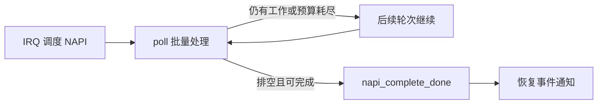

# C1. NAPI：批量处理，但不能无限占住 CPU

本篇回答：NAPI 为何缓解中断压力？每次 poll 和一轮 softirq 的预算有何区别？前置阅读：softirq、RX 路径、B3。预计阅读：8 分钟。源码基准：Linux v6.18。

## 1. 问题

高包速下逐包中断会把 CPU 时间消耗在固定入口成本上。只改成无限轮询又会饿死同核其他队列和进程。NAPI（网络事件轮询机制）把通知与批量处理拆开。

## 2. 约束

同一机器可能同时跑低延迟 RPC、大流量传输与普通应用；驱动的 RX/TX 完成处理也不同。NAPI 不天然等于一条队列或一根中断，映射由驱动决定。

## 3. 方案

典型流程是 IRQ 调度 NAPI 后保持设备相应中断屏蔽，poll 批量处理，排空后用 `napi_complete_done()` 结束并恢复通知。驱动契约见 `Documentation/networking/napi.rst:58`、`Documentation/networking/napi.rst:120`；完成函数在 `net/core/dev.c:6649`。

有两层预算：驱动 poll 的 `budget` 限制本轮 RX 包数；`net_rx_action()` 的 `netdev_budget` 与 `netdev_budget_usecs` 限制一次 NET_RX softirq 批次，见 `net/core/dev.c:7745`。时间检查实际转为 jiffies，且在一次 poll 返回后进行，因此不是精确到微秒的抢占器。

TX completion 的 skb 回收可以不受 RX budget 约束；`budget=0` 可能表示只做 TX 回收，此时不能使用 RX 的 page_pool/XDP API，也不能调用 `napi_complete_done()`。恰好处理了 budget 个且已经排空时，驱动还要遵守“返回 budget 意味着仍需继续”的契约（`Documentation/networking/napi.rst:63`）。

## 4. 演进

`7acf8a1e8a28`，Matthew Whitehead：把固定 2 jiffies 改成 `netdev_budget_usecs` 参数，使不同硬件能调节 softirq 时间预算。正文例子中快机可设 1000 μs，486DX-25 需 4000 μs 才避免其测试的 time_squeeze 增长；这不是统一建议值。该提交未提供吞吐/延迟性能数据，也不是 NAPI 的最初引入。

当前 `net_rx_action()` 旁边仍有“2 jiffies”旧注释，实际代码读取可配置值；不能用注释覆盖实现。早期 NAPI 起源提交本篇【未确认】。

## 5. 取舍

批处理摊薄开销，但预算过大会延迟其他工作，过小会频繁重调度。中断合并、NAPI 预算、GRO 持有和应用调度都会影响延迟，不能把全部改善或退化归给一个参数。

## 6. 用户态对照

Seastar 固定提交 `e417c0c0ebeb1f0578b1dd5b3dd4f65decff0a4b` 的教程说明：长 CPU 计算不让出会使 reactor（事件循环）停顿，影响 I/O 轮询。它把公平调度责任部分放到协作式应用中。[已核对的教程源码](https://github.com/scylladb/seastar/blob/e417c0c0ebeb1f0578b1dd5b3dd4f65decff0a4b/doc/tutorial.md#L341)

## 7. 验证

在目标机对受控流量采样：`sudo perf record -a -e napi:napi_poll -- sleep 10`，再 `sudo perf script` 查看 work/budget。事件定义已核对 `include/trace/events/napi.h:14`。work 常等于 budget 表示持续用满 poll，不直接证明丢包；同时看应用 p99、驱动统计与 CPU。这里仅给方法，未运行。

## 要点回顾

- 通知和处理分离；轮询仍要预算。
- RX 包预算与 softirq 时间预算不是同一个量。
- 时间预算不是严格的实时截止线。

## 自测

1. budget=0 能正常收 RX 包吗？
2. 增大预算为何可能伤害 p99？
3. 一条 NAPI 是否一定对应一条 RX 队列？

答案

1. 不应收 RX；它允许特定 TX 清理工作。2. 同核其他工作等待更久。3. 不一定，取决于驱动映射。

## 与 DPDK/VPP 的对照

熟悉的 burst 也在摊薄固定成本。区别是 NAPI 把轮询嵌入通用内核调度；专用 worker 可持续轮询，但仍需控制单队列或单节点占用，才能服务其他流与应用任务。
