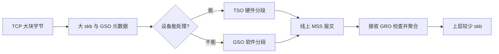

# C2. GRO/GSO/TSO：尽量晚分段，尽量早聚合

本篇回答：三个缩写分别在哪一侧工作？为何一个 skb 能代表多个线上包？前置阅读：A1、C1、MTU/MSS。预计阅读：9 分钟。源码基准：Linux v6.18。

## 1. 问题

同一批 TCP 字节若始终按 MSS 小包穿越每一层，路由、队列、计数和函数调用都重复很多次。线速要求分段，不代表软件所有层都必须先分段。

## 2. 约束

聚合必须尊重协议边界与校验和语义；网卡能力、隧道、转发路径和报文类型不同。不能为了聚合丢失接收端或转发时需要的信息。

## 3. 方案

| 机制 | 工作位置 | 作用 |
|---|---|---|
| GRO（通用接收聚合） | 接收侧 | 将可兼容报文聚合，减少后续逐包处理 |
| GSO（通用分段卸载） | 发送软件框架 | 大 skb 穿过较多软件层，必要时软件分段 |
| TSO（TCP 分段卸载） | 发送设备 | 网卡按元数据生成各线上 TCP 段 |

权威契约见 `Documentation/networking/segmentation-offloads.rst:24`、第 119、133 行。`skb_shared_info.gso_size/gso_type` 描述分段大小与类型，见 `include/linux/skbuff.h:593`；不是普通 payload 中藏了一组完整线上包。

`validate_xmit_skb()` 检查设备特性，需软件分段时调用 `skb_gso_segment()`，见 `net/core/dev.c:3977`。因此关闭 NIC TSO 不代表 TCP 上层从此只分配 MSS 大小的 skb。校验和卸载与分段契约相连，不能任意改 GSO 元数据而不修正 checksum 语义。

## 4. 演进

| commit / 作者 | 动机 | 性能数据 |
|---|---|---|
| `d565b0a1a9b6` / Herbert Xu | 引入协议无关 GRO 框架，由协议回调判定匹配、合并与 flush。 | 该提交未提供性能数据。历史的持有链长度不是 6.18 的固定规则。 |
| `0a6b2a1dc2a2` / Eric Dumazet | TCP 改为始终使用 GSO 表示，修复无 SG/GSO 时内部 pacing 为每 MSS 设高精度 timer 的成本。 | 40 Gbit 单 TCP_STREAM、BBR+pfifo_fast、SG 关闭时约 0.66→14.9 Gbit/s；限定该实验条件，不能推广成所有 TSO 的收益。 |

第二个提交也指出更少发送/重传队列对象和更便宜的 SACK 处理；它改变 TCP 的使用方式，不是 GSO 最初实现。

## 5. 取舍

批量减少软件对象和函数开销，但放大单次工作量，也会影响排队延迟和统计含义。主机抓到大于 MTU 的“包”可能是卸载表示，不能直接判定线上超 MTU；需在链路另一侧或明确卸载位置观察。大 skb 的长度、段数和整数上限也扩大安全审计面，见 F2。

## 6. 用户态对照

Seastar 固定提交 `e417c0c0...` 的 DPDK 后端在 `src/net/dpdk.cc:620` 设置 TCP checksum/TSO 信息，并在第 1590 行检查设备 TSO 能力。用户态 TCP 也可晚分段，但必须兑现 PMD 元数据契约。[固定源码](https://github.com/scylladb/seastar/blob/e417c0c0ebeb1f0578b1dd5b3dd4f65decff0a4b/src/net/dpdk.cc#L620)

## 7. 验证

目标 VM/设备记录 `ethtool -k` 能力；在相同负载下分别改变接收 GRO 与发送 TSO，记录原设置并恢复。比较 cycles/byte、线侧 PPS 与 p99，不能只比较主机抓包条数。此实验未运行；驱动不支持开关时不把错误当生效。

## 要点回顾

- GRO 聚合接收，GSO 描述并完成软件分段，TSO 使用设备分段。
- 大 skb 不是线上大包的充分证据。
- 更少对象也改变计数与攻击面的边界。

## 自测

1. 关闭硬件 TSO 是否保证上层没有 GSO skb？
2. GRO 是任意字节拼接吗？
3. 比较卸载开关时为何看线侧 PPS？

答案

1. 否，可软件分段。2. 否，协议回调验证可合并性。3. 主机 skb 数会被卸载改变，不等于线上报文数量。

## 与 DPDK/VPP 的对照

DPDK mbuf 的 TSO 标记/段大小与 GSO 元数据承担相近契约，但一次 vector 批量处理多个包不等于把它们 GRO 成一个逻辑包；“减少循环固定成本”与“改变包表示”要分开。
