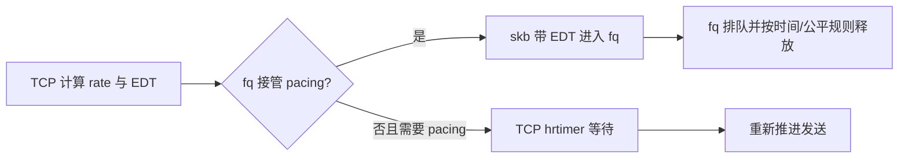

# D2. pacing 与 EDT：先计算允许发送的时刻，再安排交付

本篇回答：cwnd 和 pacing 分别约束什么？fq 与 TCP 内部 pacing 如何分工？前置阅读：C2、C3、D1、拥塞窗口。预计阅读：10 分钟。源码基准：Linux v6.18。

## 1. 问题

cwnd（拥塞窗口）限定可以有多少数据在途，却不保证这些数据均匀发送。ACK 一起到达或应用一次提交大批数据时，瞬间突发仍可能打满下游队列。

## 2. 约束

用户可以装不同 qdisc；不能强迫每台主机都用 fq。GSO 批量收益还应保留；排队产生的人工延迟不能无意污染 RTT 估计。定时调度也必须使用一致时钟。

## 3. 方案

TCP 用 `sk_pacing_rate` 表示节奏速率，用 `tcp_wstamp_ns` 跟踪最早发送时刻。发送构造时把该时刻放进 skb delivery time，见 `net/ipv4/tcp_output.c:1464`；发送后按长度/速率推进，并考虑调度抖动，见 `net/ipv4/tcp_output.c:1408`。EDT 是 Earliest Departure Time（最早离开时刻），不是保证准时上线路的 deadline。

`tcp_needs_internal_pacing()` 检查 `SK_PACING_NEEDED`（`include/net/tcp.h:1488`）。需要且时刻尚未到时，`tcp_pacing_check()` 安排 pacing hrtimer、保留 socket 引用并停止本轮推进，见 `net/ipv4/tcp_output.c:2728`。fq 接管时设置 `SK_PACING_FQ`，不会再逐包要求 TCP 用同一套内部 timer 等待。

fq 保存 `time_to_send`，过早的流进入节流结构，必要时用 watchdog 唤醒，见 `net/sched/sch_fq.c:558`、第 688 行。6.18 还考虑 `offload_horizon`，允许配合硬件提前下发；不能把所有 dequeue 都说成与 EDT 精确相等。设备队列、驱动与线速仍会影响实际出线。

## 4. 演进

| commit / 作者 | 动机 | 正文数据 |
|---|---|---|
| `218af599fa63` / Eric Dumazet | 增加内部 pacing 回退，让需要 pacing 的连接不强制依赖 fq。 | 800 流、每流约 48 Mbit/s、40G NIC，示例内部 pacing 约 240 万中断/s，fq 约 170 万；两者实际吞吐不同，不是严格等负载成本对比。 |
| `ab408b6dc744` / Eric Dumazet | TCP 自己计算 EDT，避免 fq 的节奏/quantum 人工抬高 RTT 与 RPC 尾延迟。 | 指定低速 100/100 B TCP_RR 测试，p99 3825→63 μs；不是一般业务保证。 |
| `fb420d5d91c1` / Eric Dumazet | 从短暂采用的 TAI 改回 MONOTONIC，修复 TAI 大跳变导致的问题。 | 该提交未提供性能数据。 |

## 5. 取舍

EDT 将“协议认为何时可发”与“调度器实际释放”拆开，利于批量和硬件下沉；状态、时间戳语义和反馈却更复杂。内部 pacing 提供兼容退路，大量流时 timer 成本可能增加。pacing 不是链路预约，也不替代拥塞控制。

## 6. 用户态对照

Seastar native TCP 固定提交 `e417c0c0...` 的 `include/seastar/net/tcp.hh:530` 按发送窗口与 cwnd 限制可发字节。该段本身不是 EDT 调度器；不能从“拥塞窗口检查存在”推导“精细 pacing 已实现”。专用栈可把节奏调度放在 shard/发送器中，本篇未核实该版本有与 Linux EDT 对等的完整 pacing 机制。[已读源码](https://github.com/scylladb/seastar/blob/e417c0c0ebeb1f0578b1dd5b3dd4f65decff0a4b/include/seastar/net/tcp.hh#L530)

## 7. 验证

在目标测试链路上比较相同拥塞算法与速率约束下的 fq 和非 fq 配置，记录 qdisc 统计、timer 活动、线侧发包间隔、p99 与吞吐。保留并恢复原 qdisc；不能在宿主业务接口直接照抄历史命令。这里未运行，未测得 EDT 收益。

## 要点回顾

- cwnd 管在途数量，pacing 管发送节奏。
- fq 接管与内部 timer 是分工，不是盲目双重等待。
- EDT 表示最早时间，不保证精确出线。

## 自测

1. cwnd 足够大是否自动平滑发包？
2. 没有 fq 能否仍有 TCP pacing？
3. EDT 到了就保证 NIC 立刻发吗？

答案

1. 否。2. 可以，内部 hrtimer 提供回退。3. 不保证，还受队列、设备和调度影响。

## 与 DPDK/VPP 的对照

TX burst 很大不等于发送节奏正确；专用 poll worker 可检查时间后再发，也可使用硬件时间调度。但 TCP 仍需决定允许的 rate，PMD 发送成功也不能证明报文按目标时间上线路。
