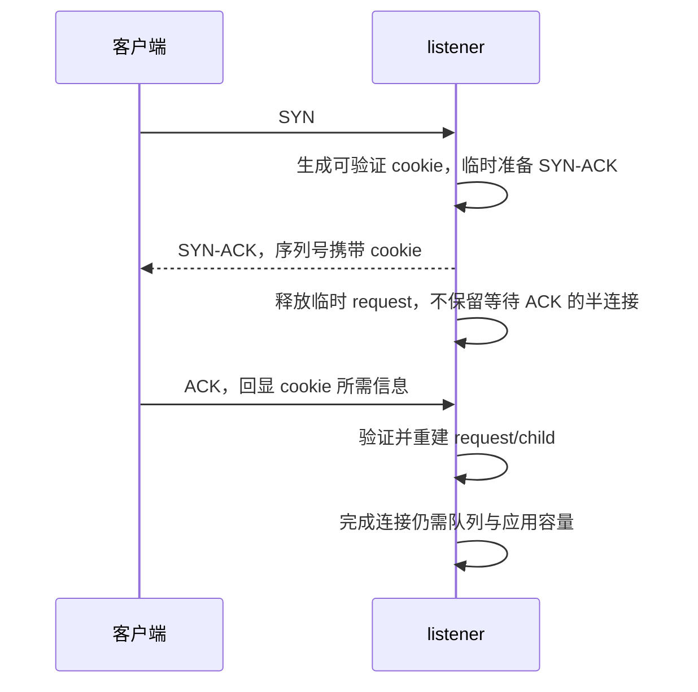

# F1. SYN flood 与 syncookies：把承诺状态的时刻向后移

本篇回答：SYN flood 耗尽什么？cookie 如何避免保留半连接？为什么它不是万能过载方案？前置阅读：握手、B2、B3、A2。预计阅读：14 分钟。源码基准：Linux v6.18。

## 1. 问题：用很少输入要求服务端保存状态

正常握手中，收到 SYN 后服务端要记住协商参数，发送 SYN-ACK 并等待 ACK。攻击者可以让这些请求长期不能完成，造成状态与 timer 积压。瓶颈可能是半连接存量，也可能更早出现在链路、RX 队列和 CPU；“SYN flood”不是单一资源问题。

因此防护不只问“每秒能接收多少 SYN”，还要问：多少握手成功、正常连接能否及时 accept、无效请求是否占用长寿命状态。

## 2. 约束：未完成握手不可信，但合法客户端也会丢包

服务端不能假定所有 SYN 都来自可达的客户端，也不能把一次丢包直接判成攻击。部署要兼容 TCP options（选项）、不同 MSS、正常重传和老设备。握手之后 accept queue 与应用处理能力仍有限；把半连接问题解决后，后面的容量不会凭空增加。

## 3. 方案：编码必要信息，收到有效 ACK 再重建

正常路径使用 `request_sock`，B3 已说明它在 ehash 中可被后续包直接找到。`tcp_conn_request()` 判断队列压力和 cookie 配置，见 `net/ipv4/tcp_input.c:7380`。配置 `tcp_syncookies=1` 用作溢出退路，2 为无条件测试模式；编译条件是 `CONFIG_SYN_COOKIES`，见 `Documentation/networking/ip-sysctl.rst:922`。

cookie 路径将可验证信息编码进 SYN-ACK 序列号：地址端口、客户端序列号、时间相关计数、密钥 hash 和有限的 MSS 信息，见 `secure_tcp_syn_cookie()`，`net/ipv4/syncookies.c:85`。收到 ACK 后验证 cookie 和时效，恢复必要状态再创建连接；普通 IPv4 检查见 `cookie_tcp_check()` / `cookie_v4_check()`，`net/ipv4/syncookies.c:358`、第 400 行。

“无状态”仅指**不跨握手等待保留该半连接**。6.18 仍分配临时 request 用于构造回复（`net/ipv4/tcp_input.c:7423`），cookie 路径发完 SYN-ACK 后 `reqsk_free()`（第 7542 行）。系统仍有秘密、配置、计数和 listener。因此“收到 SYN 完全不分配内存、完全无状态”是错误描述。

cookie 的位数有限，不能原样保存所有协商数据。当前实现可在 TCP timestamp（时间戳）低位编码 window scaling、SACK、ECN 等信息，见 `cookie_init_timestamp()`（`net/ipv4/syncookies.c:62`）；解码还校验本地开关（第 236 行）。没有时间戳时可恢复能力受限；`net/ipv4/tcp_input.c:7441` 会清理相关选项。文档中“不能使用 TCP 扩展”的概括不能覆盖这条已经存在的条件支持。

## 4. 演进：保留越来越多语义，但空间仍有限

| commit / 作者 | 动机 | 性能数据 |
|---|---|---|
| `4dfc28170259` / Florian Westphal | 借 SYN-ACK 时间戳回显恢复 SACK 与窗口扩大，使 cookie 下保留更多协商能力。 | 该提交未提供性能数据。 |
| `172d69e63c7f` / Florian Westphal | 把 ECN 支持信息编码进时间戳，补足 cookie 下的 ECN 协商。 | 该提交未提供性能数据。 |
| `079096f103fa` / Eric Dumazet | 普通 request 移入 ehash，降低 listener 锁压力；它优化有状态路径，不是 cookie 本身。 | 正文称正常锁压力减半，未给 benchmark，详见 B3。 |

syncookies 最初引入 Linux 的 Git 前历史，本篇【未确认】；上述提交只作为可追溯的演进，不冒充起源。

## 5. 取舍：省状态不等于省掉所有攻击成本

| 避免或改善 | 仍需付出的成本/边界 |
|---|---|
| 大量未完成握手长期占 request 和 timer | 每个请求仍有解析、校验、hash、路由与回复成本 |
| 不可达伪造源耗尽半连接 | 链路和 CPU 仍可先被打满 |
| ACK 后才承诺更多状态 | 能完成握手的攻击者仍可消耗完整连接和应用资源 |
| 时间戳带回部分协商信息 | 有限编码不是保存任意 TCP 扩展状态 |

cookie 校验主要证明对方能回显服务端构造的信息，不提供应用身份认证或数据加密。也不能仅用 `SyncookiesSent` 增长判定恶意攻击：合法突发与应用过载同样可能触发。

`tcp_conn_request()` 还会检查 accept queue 已满并计 `ListenOverflows`（`net/ipv4/tcp_input.c:7418`）。只增大 SYN backlog、只开 cookie 或只增加 RX worker，未必改善成功连接率。A2 的全局和租户内存约束也继续生效。

## 6. 用户态对照

lwIP 2.2.1 的正常监听路径在 `src/core/tcp_in.c:659` 分配 PCB，第 680 行进入 SYN_RCVD；分配失败会放弃该次请求。[固定源码](https://github.com/lwip-tcpip/lwip/blob/77dcd25a72509eb83f72b033d219b1d40cd8eb95/src/core/tcp_in.c#L630) 小型部署可限制 PCB 池和 backlog，但这不同于 Linux cookie 推迟保留状态。本篇只核对该路径，不据此宣称所有用户态栈都没有 SYN 防护。

## 7. 验证：分别观测状态、CPU 与成功连接

本篇未发送洪泛流量。目标隔离 VM 的低速实验可以先把 cookie 设为测试模式，用现有 TCP 客户端正常握手，确认回退语义及协商选项，再恢复原值；不需要以大量流量触发才能理解机制。

建议每次运行保存前后差值：

- `nstat -az` 中 SyncookiesSent/Recv/Failed、ListenOverflows/ListenDrops。
- `ss -tan state syn-recv` 与成功 ESTABLISHED/accept 数量。
- 应用连接 p99、CPU 与 RX 丢包，区分状态瓶颈和算力瓶颈。

名称映射核对于 `net/ipv4/proc.c:173`、第 195 行。counter 是事件计数，不是同时在线半连接数量；测试模式会改变正常握手条件，也不能用它模拟所有真实攻击压力。此处未实际修改 sysctl。

## 要点回顾

- cookie 推迟保存半连接，不取消临时处理与全局状态。
- 某些 options 可条件恢复，不能概括为全支持或全不支持。
- 成功连接率、CPU 和各层队列都需观察。
- 可达性证明不是身份认证。

## 自测

1. cookie 路径有没有临时 `request_sock`？
2. SYN cookie 能解决 accept 应用处理太慢吗？
3. cookie 下 SACK/窗口扩大为何与 timestamp 有关？
4. SyncookiesSent 增长能否单独证明攻击？

答案

1. 有，构造回复后释放，不跨等待阶段保存。2. 不能。3. 当前实现借时间戳回显携带部分协商位。4. 不能，合法突发/过载也可能触发。

## 与 DPDK/VPP 的对照

PMD 快速丢弃和 worker 分流可提高前端处理能力，但不会自动解决握手状态放大。无论内核还是用户态，需要分别规划无状态筛选、协议状态额度、正常连接公平性与应用处理容量；纯 PPS 指标不足以比较防护效果。
