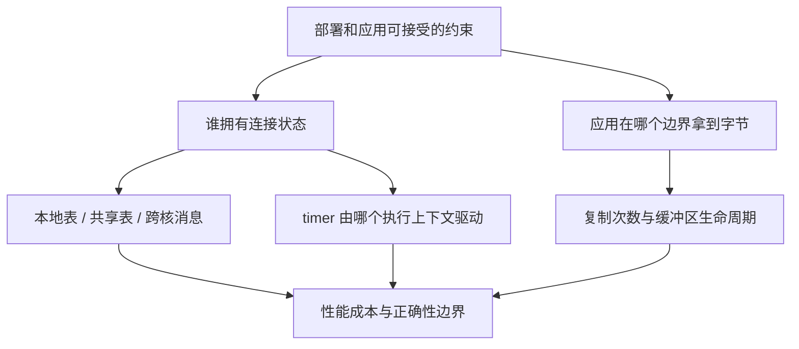

# 横向对比：真正改变的是状态归属、交付边界与部署假设

本篇回答：四种用户态路线分别放弃什么、保留什么？内核为了通用性付出哪些协调成本？只有 10 小时该读哪里？

前置阅读：本目录四篇导读，至少读过 `lwip.md` 与 `vpp.md`。预计阅读时间：35 分钟；末尾另有 10 小时源码阅读安排。

固定版本：lwIP `77dcd25a72509eb83f72b033d219b1d40cd8eb95`（2.2.1）；VPP `1573e751c5478d3914d26cdde153390967932d6b`（v25.06）；Seastar `e417c0c0ebeb1f0578b1dd5b3dd4f65decff0a4b`；F-Stack `eb6b32c825543a29dafcc92288e20bfd7db6362b`；Linux `v6.18`。源码目录和上游链接见 [README](README.md)。以下 `项目 文件路径:行号` 明确限定各引用的根目录。

本篇没有性能实测数据。“可能减少某项成本”是从结构得出的推测，不表示在任意负载上快于 Linux。

## 九个维度放在一起

| 维度 | lwIP | VPP host stack | Seastar native | F-Stack |
|---|---|---|---|---|
| 1. 路径 | port → pbuf → IP/TCP → raw callback 或 socket | RX graph → TCP 状态 node → session FIFO / event → 应用 | RX → shard → IPv4/TCP → future / stream | DPDK → veth → BSD IP/TCP → socket buffer → ff API |
| 2. 缓冲区 / 复制 | pbuf chain；raw 引用；普通 socket RX 复制；TX 引用需保留到 ACK | vlib_buffer → RX FIFO 有复制；segment API 可避开下一次复制 | fragment / deleter；某 DPDK 内存后端 RX 复制；data source 共享片段 | DPDK mbuf 外挂到 BSD mbuf；普通 recv 复制；可选 ZC API 另管生命周期 |
| 3. 连接查找 | active 链表，命中移到表头 | session bihash；value 带 worker 与 session index | shard 本地 unordered_map；本地 XOR hash 与 RSS Toeplitz 分离 | BSD PCB bucket / 链；Jenkins 地址 hash 与端口组合，完整匹配再核对四元组 |
| 4. timer | fast/slow 扫描 + 通用有序 timeout 链表 | worker 两级轮；ACK 用 session event；TIME_WAIT 用 WAITCLOSE | reactor 位分桶 timer_set；lowres_clock；TIME_WAIT timer 未完成 | TCP 逻辑 timer → callout → F-Stack tick wheel；DPDK 时钟驱动 |
| 5. 线程 / RSS | 核心串行化；RSS 不自动创建独立实例 | 连接归 worker；错误 worker 在 tcp-input drop；需正确前置分流 | 连接归 shard；软件转送；主动 open 选端口迎合 RSS | 传统多进程；此 commit 还有 per-worker VNET 的 thread_mode，完整并发审计未完成 |
| 6. TCP 能力 | 固定 Reno 风格；SACK 为接收端发送能力；WS/TS 默认关；TSO/LRO 未确认 | NewReno/CUBIC、SACK、WS/TS 有路径；GSO/TSO 依赖后端，LRO 未确认 | NewReno 风格、WS；不把 SACK/TS 类型当端到端支持；TIME_WAIT / keepalive 有缺口；DPDK TSO/LRO 有条件 | NewReno/CUBIC、SACK、WS/TS；TSO/LRO 需配置与后端；移植后互通未实测 |
| 7. API | raw callback、netconn、socket，抽象层次有成本差别 | session FIFO / events；VCL 普通与 segment API | future、connected_socket、data source/sink；不能当 BSD FD | ff BSD 风格调用、loop/event；可选专用 ZC API |
| 8. 简化 / 保留 | 小连接集、串行核心、可裁剪；换掉大规模连接查找 | 固定 worker + 批处理通知，保留完整 transport/session 协调 | 应用与协议共享 shard，缩小跨核共享；部分协议功能仍未完成 | 保留 BSD 协议与 socket 结构，替换设备、时间和 OS 适配 |
| 9. 测试 | 可构包和驱动虚拟时间的 TCP 单测 | TCP 内部单测 + Python echo 传输测试 | packet / 框架 / DNS 测试；native TCP 协议覆盖未确认 | glue layer 单测 + 无物理 NIC 的 EAL 集成测试；协议覆盖未确认 |

表中依据可按九维度在 [lwIP](lwip.md)、[VPP](vpp.md)、[Seastar](seastar.md)、[F-Stack](f-stack.md) 逐项检查。几个决定性锚点：`lwIP src/core/tcp_in.c:250`、`VPP src/vnet/session/session.h:783`、`Seastar include/seastar/net/tcp.hh:618`、`F-Stack lib/ff_syscall_wrapper.c:1360`。WS 为 window scaling（窗口缩放），TS 为 timestamps（时间戳）；TSO 为发送分段卸载，LRO 为接收大包聚合。

## 四种设计哲学，不是四个快慢名次

**lwIP 假设资源少、连接集可控、应用能配合核心串行执行。** 链表节省表结构，周期扫描压低 timer 管理复杂度，raw API 把数据生命周期交给应用。代价是连接数和回调阻塞时间直接影响进展。证据为 `lwIP src/core/tcp_in.c:250`、`lwIP src/core/tcp.c:1196`、`lwIP src/core/tcp_out.c:362`。这里“假设”是对实现的设计归纳，不是保证所有 lwIP 产品都采用同一部署。

**VPP 假设部署者能控制 graph、worker 与 session 应用边界。** frame 批量处理和统一发布 event 让每包开销分摊；FIFO 让 stream 生命周期脱离 NIC buffer；连接所有权要求分流保持稳定。证据为 `VPP src/vnet/tcp/tcp_input.c:1481`、`VPP src/vnet/session/session.h:772`、`VPP src/vnet/session/session_lookup.c:979`。代价是共享 FIFO 的内存流量与部署正确性。

**Seastar native 假设应用愿意围绕 shard 和 future 组织工作。** 相同 owner 同时驱动协议、应用 continuation 和释放动作，主动连接甚至选择合适的端口来维持归属。证据为 `Seastar src/net/native-stack-impl.hh:175`、`Seastar include/seastar/net/tcp.hh:842`、`Seastar src/net/net.cc:310`。换来本地状态访问，放弃任意线程共享连接的自由；协议缺口另算，不能被架构优点掩盖。

**F-Stack 假设更重要的是复用现有协议/应用语义，并愿意维护 OS 适配边界。** RX、timer、socket 外壳连接 DPDK 与 BSD 栈，证据为 `F-Stack lib/ff_veth.c:475`、`F-Stack lib/ff_kern_timeout.c:1251`、`F-Stack lib/ff_syscall_wrapper.c:1502`。换来的可能是更低的环境协调成本；付出的是兼容层验证、版本升级和线程模式审计。

这张图是依据各实现归纳的设计关系图，不是某个项目的实际函数调用图。

## Linux 为“通用”保留了什么

| 维度 | Linux 6.18 的已确认事实 | 用户态路线如何改约束 | 得失 |
|---|---|---|---|
| 缓冲区 | skb 支持非线性数据；普通 TCP recv 路径有复制，`Linux include/linux/skbuff.h:885`、`Linux net/ipv4/tcp.c:2823` | raw/fragment/ZC API 可交出引用；VPP 用 FIFO 脱离 NIC buffer | 可少复制，但应用承担释放/背压约定；某些路径仍复制 |
| 并发 | TCP RX 使用 socket 的 BH 锁；用户持有 socket 时转 backlog；recv 使用 socket lock，`Linux net/ipv4/tcp_ipv4.c:2370`、`Linux net/ipv4/tcp.c:2927` | 串行实例、worker/shard owner 或进程隔离 | 减少共享状态协调；应用及流量分配需要遵守 owner |
| lookup | established hash 经 RCU（读复制更新）遍历并取引用，重新核对匹配，`Linux net/ipv4/inet_hashtables.c:527` | lwIP 用小链表；Seastar 用本地表；VPP 保留可找到 owner 的 session 表 | 小范围可简化，但扩容、迁移、错误分流不再免费 |
| timer | 普通连接 timer 在通用 timer 系统注册；Linux 有每 CPU 多级轮，也有高精度 pacing timer，`Linux net/ipv4/inet_connection_sock.c:765`、`Linux kernel/time/timer.c:65`、`Linux kernel/time/timer.c:206`、`Linux net/ipv4/tcp_timer.c:899` | 自己的 loop 驱动扫描、轮或 bucket timer | 可与业务批处理协调；loop 忙会延迟；“用户态栈用轮、Linux 用树”是错误概括 |
| 批处理 | GRO（通用接收聚合）会合并数据并在接收路径完成处理，`Linux net/core/gro.c:624` | VPP frame / DPDK burst / reactor 输出集中处理 | 用户态更易统一应用和网络的批次；不能声称 Linux 完全逐包或没有聚合 |
| API | recv 需处理 flags、锁、错误队列与时间戳等语义，`Linux net/ipv4/tcp.c:2913` | raw、FIFO、future 或 ff socket，选定支持范围 | 可缩短常见路径；复杂 FD/socket 行为与隔离语义不能自动继承 |

“通用性导致这些成本”是设计推测，其依据是实现确实为不同执行上下文、数据所有权和可选语义提供协调。**并不是每包都会执行所有选项分支，也不是有锁就一定有竞争。** 实际成本由命中路径、CPU 归属、cache、包长、offload 和负载决定。

## 共性与最大分歧

共性首先是**控制状态的所有者**，其次是让 packet / stream / 应用数据的边界可明确管理，再把时间驱动并入自己的执行循环。对应证据：`lwIP src/include/lwip/opt.h:222`、`VPP src/vnet/session/session_lookup.c:979`、`Seastar src/net/net.cc:317`、`F-Stack lib/ff_dpdk_if.c:3617`。这些选择经常同时减少同步和调度路径，收益却不能在没有测量时相加成一个性能数字。

它们最不同的地方是应用 API 与协议覆盖。lwIP raw 把协议交付直接暴露给应用；VPP 在 FIFO 处隔离应用；Seastar 把应用调度纳入同一 shard；F-Stack 保留 BSD 语义。另一个分歧是资源规模：lwIP 的线性扫描与 VPP 的 bihash / worker 分工服务不同假设。不能把“用户态”当成一种固定架构。

Seastar native 的 TIME_WAIT FIXME 尤其说明：某项实现短，并不总是因为有更好的算法，也可能功能尚未完成，见 `Seastar include/seastar/net/tcp.hh:619`。F-Stack 反过来保留很多内核式结构，仍能改变运行环境。这两点共同否定“只要删掉协议复杂性就会快”的推断。

## 内核网络栈的瓶颈到底在哪里

本次源码能支持的结论是：**潜在瓶颈集中在每包/每字节跨边界的协调成本，必须按负载测量，不能归因于一个 TCP 函数。** 需要分别考虑：

1. **执行边界**：应用等待/唤醒、网络处理与应用是否在同 CPU、socket 状态是否竞争。Linux RX / recv 的并发入口见 `Linux net/ipv4/tcp_ipv4.c:2370`、`Linux net/ipv4/tcp.c:2927`。
2. **数据边界**：复制多少字节、存活多少 descriptor、引用是否跨核归还。VPP FIFO 复制与 Seastar 复制型 DPDK backend 的证据是 `VPP src/svm/svm_fifo.c:40`、`Seastar src/net/dpdk.cc:2025`。用户态同样受内存带宽和 cache 影响。
3. **摊销边界**：一次调用/轮询处理多少包、一次通知交付多少字节。VPP 帧尾统一发布 event 与 Linux GRO 都是减少粒度的机制，见 `VPP src/vnet/tcp/tcp_input.c:1481`、`Linux net/core/gro.c:624`。
4. **协议与排队本身**：RTT、丢包、拥塞窗口、接收端背压不会因为移到用户态消失；各栈仍保留 ACK、RTO 和流控状态。省掉必要语义可能使 benchmark 变快，却不再比较同一个服务。

以上是待测假设，不是“Linux 比四者都慢”的结论。未来比较必须同时固定包长、连接数量、API、CPU/queue 映射、offload、loss 和应用工作量，并分别记录吞吐、CPU、复制字节数和尾延迟；对协议能力不同的栈还要单列正确性边界。

## 如果只有 10 小时

| 时间 | 文件与锚点 | 阅读产物 |
|---|---|---|
| 0–1.5 h | lwIP `src/core/tcp_in.c:250`、`src/core/tcp.c:1196`、`src/core/tcp_out.c:362` | 画出 PCB 查找、RTO 扫描和 TX buffer 释放时间线 |
| 1.5–4 h | VPP `src/vnet/tcp/tcp_input.c:1411`、`src/vnet/session/session.h:772`、`src/vnet/session/session_lookup.c:957`、`src/vnet/tcp/tcp_output.c:1019` | 在熟悉 graph 上补 FIFO、owner 和 ACK event，不只画 packet 箭头 |
| 4–6 h | Seastar `include/seastar/net/tcp.hh:664`、`include/seastar/net/tcp.hh:842`、`src/net/native-stack-impl.hh:175`、`src/net/tcp.cc:34` | 分清两个 hash、future 与数据所有权；把 option 声明和实现分开 |
| 6–7 h | F-Stack `lib/ff_dpdk_if.c:2224`、`lib/ff_veth.c:467`、`lib/ff_kern_timeout.c:1251`、`lib/ff_syscall_wrapper.c:1360` | 标出驱动、timer、应用三条适配边界 |
| 7–9 h | Linux `net/ipv4/tcp_ipv4.c:2370`、`net/ipv4/tcp.c:2913`、`include/linux/skbuff.h:885`、`kernel/time/timer.c:65` | 为同一 RX payload 画 skb → socket → 应用与锁/等待的时间线 |
| 9–10 h | 回到本文和 `OPEN-QUESTIONS.md` | 写 3 个可测假设，每个列控制变量、观察值、能推翻假设的结果 |

表中的项目名同样限定该行路径的源码根目录。不要花这 10 小时从头通读四套目录；优先理解状态何时转交、谁可修改、何时可释放。

## 要点回顾

- 用户态栈并不是一个统一架构，也不必都用 DPDK。
- 所有权、复制边界、调度和 API 必须一起设计。
- RSS 分流 hash 与内部连接表 hash 不应混淆。
- Linux 也有 timer wheel、聚合和非线性缓冲区。
- 缺失协议语义不能自动解释成成功的性能优化。
- 源码比较提出瓶颈假设，受控测量才能判定实际瓶颈。

## 自测

1. 为什么“用户态少一次系统调用”不足以预测总吞吐？
2. 四个栈中，哪些地方能直接证明仍有复制？
3. 只用 echo benchmark 比较四者时，TIME_WAIT 差异会带来什么问题？
4. 为什么连接固定到核会影响应用 API，而不只是网卡配置？

参考答案

1. 总成本还包括 packet/byte 处理、复制、cache、调度、协议等待和背压，瓶颈可能根本不在 syscall。
2. lwIP socket 接收、VPP packet 到 FIFO/普通应用读、Seastar 非特定内存后端 RX、F-Stack 普通 recv 均有明确复制路径；具体条目见各篇。
3. 可能比较了不同状态保留和协议语义，短连接容量与资源成本不可直接视为等价结果。
4. 应用调用、回调、future continuation 和 buffer 释放也会修改连接相关状态，必须遵守 owner 或通过消息转交。

## 与 DPDK/VPP 的对照

你已经熟悉 packet 的“queue → worker → buffer 生命周期”。TCP 要把这套思路延长到“连接 → stream → 应用确认消费 → 重传数据可释放”。最值得保留的 DPDK/VPP 直觉是明确所有权和批处理；需要放下的直觉是“收到包并转发完就结束”：可靠字节流的状态可能在包释放之后继续存活很久。
