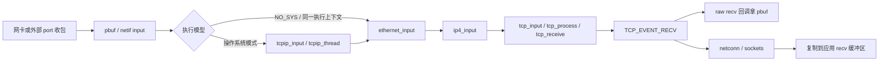

# lwIP：先看见一个 TCP 状态机需要什么

本篇回答：小内存系统如何组织收包、连接和时间？raw API 的零拷贝到底到哪里？哪些 TCP 能力不能只看配置宏？

前置阅读：`../00-kernel-basics/README.md`；了解 TCP 四元组、ACK、重传。预计阅读时间：35 分钟，源码练习另需 60 分钟。

固定版本：**STABLE-2_2_1_RELEASE**，commit `77dcd25a72509eb83f72b033d219b1d40cd8eb95`。本地源码 `/tmp/p6-sources/lwip`；本文无前缀引用均相对此目录。实际访问的[上游固定版本](https://github.com/lwip-tcpip/lwip/tree/77dcd25a72509eb83f72b033d219b1d40cd8eb95)。Linux 对照为 `v6.18`，路径见本目录 README。

## 1. 主路径：端口层负责喂包，TCP 把 pbuf 交给回调



驱动接入只是边界，lwIP 核心不自带统一 DPDK RX loop。移植示例在 `contrib/examples/ethernetif/ethernetif.c:214` 提示驱动可以预分配缓冲区；实际是否复制由 port 决定。进入核心后，`src/netif/ethernet.c:81`、`src/netif/ethernet.c:186`、`src/core/ipv4/ip4.c:743` 串起 Ethernet、IPv4、TCP。TCP 成功接收的数据在 `src/core/tcp_in.c:501` 交给 `TCP_EVENT_RECV`。有 OS 时，`src/api/tcpip.c:297` 将 Ethernet 包送入 TCP/IP 线程路径；其消息执行点在 `src/api/tcpip.c:165`。

对应 Linux 的“驱动 → IP → TCP → socket”分层仍然存在；改变的是执行环境和应用交付方式。Linux TCP IPv4 入口为 `Linux net/ipv4/tcp_ipv4.c:2202`，常规应用读取入口为 `Linux net/ipv4/tcp.c:2913`，不能把 lwIP 的 raw 回调当成一次 Linux `recv()`。

## 2. pbuf：描述数据及所有权，未承诺全路径零拷贝

`struct pbuf` 用 `next` 串联片段，`payload` 指向数据，`len/tot_len` 描述片段及链长，`ref` 管理引用；定义见 `src/include/lwip/pbuf.h:186`。`pbuf_custom` 允许外部缓冲区自定义释放行为，见 `src/include/lwip/pbuf.h:245`。这与 DPDK 的 mbuf chain、external buffer 有对应关系，但 pbuf 并不要求来自 hugepage mempool，也没有统一的 NIC descriptor 所有权约定。

RX raw 回调可以直接消费收到的 pbuf，避免再复制一次；应用消费后用 `tcp_recved()` 归还接收窗口，见 `src/core/tcp.c:972`。这里“释放 pbuf”和“更新 TCP 流控窗口”是两件事。换成 socket API，`src/api/sockets.c:1024` 明确用 `pbuf_copy_partial()` 复制到调用者的缓冲区。

TX `tcp_write()` 不设置 `TCP_WRITE_FLAG_COPY` 时引用应用数据；应用必须一直保持数据不变，直到远端 ACK，见 `src/core/tcp_out.c:362`。这跳过的是应用到 TCP 队列的一次复制，**不是**已经证明 NIC DMA、重传、驱动接入全部零拷贝。Linux `sk_buff` 也能描述共享的非线性数据，定义见 `Linux include/linux/skbuff.h:885`；两者的区别不能概括为“pbuf 零拷贝、skb 必复制”。

## 3. 连接查找：链表换小内存，不是大流表

`src/core/tcp_in.c:250` 起依次扫描 active PCB（Protocol Control Block，协议控制块）链表。匹配 remote/local IP 和 port 后，将命中的 PCB 移到链表头，利用流量局部性。没有命中才查 TIME_WAIT 链表及监听链表，见 `src/core/tcp_in.c:286`、`src/core/tcp_in.c:318`。

这里没有四元组哈希表，更没有按 RSS 自动分片的每核连接表。全局链表变量见 `src/core/tcp.c:176`。平均代价取决于连接数量和包的局部性：单流常命中表头，多条交替活跃连接会增加扫描量。这是从循环和 move-to-front 行为推导的复杂度，不是性能实测结论。

## 4. 时间：两个周期扫描，加一个有序超时链表

| 事情 | 实现 | 证据 |
|---|---|---|
| 重传超时 RTO | `tcp_slowtmr()` 扫 active PCB，比较 `rtime/rto`，准备并提交重传 | `src/core/tcp.c:1196`、`src/core/tcp.c:1279` |
| delayed ACK（延迟确认） | `tcp_fasttmr()` 扫描 `TF_ACK_DELAY`，触发 ACK 输出 | `src/core/tcp.c:1483`、`src/core/tcp.c:1497` |
| TIME_WAIT | slow timer 扫 TIME_WAIT 链表，比较停留时间与 `2 * TCP_MSL` | `src/core/tcp.c:1441` |
| 核心周期 | fast 为 250 ms；每两次 fast 调一次 slow，为 500 ms | `src/core/tcp.c:236` |
| 通用 timeout 容器 | 按绝对到期时间插入单链表；不是时间轮 | `src/core/timeouts.c:205` |
| 时间来源 | port 提供毫秒级 `sys_now()`，`sys_check_timeouts()` 检查到期项 | `src/include/lwip/sys.h:453`、`src/core/timeouts.c:352` |

不要把“250 ms 扫描”理解为每个 ACK 都恰好等待 250 ms。立即 ACK 条件、扫描相位、port 何时驱动定时器都会改变实际延迟。没有 OS 的模式需要应用持续驱动超时检查；停止事件循环也会停止 TCP 的进展。

## 5. 线程与 RSS：核心串行化先于多核吞吐

有 OS 的标准入口通过 `tcpip_thread()` 处理消息，见 `src/api/tcpip.c:136`。启用 core locking 后也可以在持有 TCP/IP 核心锁时调用核心；锁定要求见 `src/include/lwip/opt.h:182`、`src/include/lwip/opt.h:222`。因此不能简单写成“lwIP 只能一个线程调用”，准确约束是**核心状态的访问必须串行化**。

RSS 可以帮助你的 port 收包，但它本身不会把上述全局 PCB 链表变成每核私有连接表。若希望多个独立 lwIP 实例各服务自己的流，需要额外设计实例隔离和分流；这是后续工程题，本篇不提供实现。

## 6. TCP 完整度：分别核对协商、收发与恢复

| 能力 | 此版本已确认结论 | 证据 |
|---|---|---|
| 拥塞控制 | 固定的慢启动、拥塞避免、三次重复 ACK 快重传/快恢复；这里称 Reno 风格是对行为的归纳，不宣称完整 NewReno 或 CUBIC | `src/core/tcp_in.c:1190`、`src/core/tcp_in.c:1234`、`src/core/tcp_in.c:1262` |
| SACK（选择确认） | 可协商并**发送接收端 SACK block**，默认关闭；不能等同发送端 scoreboard 恢复 | `src/include/lwip/opt.h:1325`、`src/core/tcp_in.c:2013`、`src/core/tcp_out.c:1197` |
| SACK 的边界 | 解析器处理 SACK-permitted，未见接收 SACK block 的对应 case；仅凭 `TF_SACK` 不应写成双向完整支持 | `src/core/tcp_in.c:2012`、`src/core/tcp_in.c:2027` |
| Window scaling（窗口缩放） | 默认关闭；有 SYN 选项解析和窗口缩放路径 | `src/include/lwip/opt.h:1530`、`src/core/tcp_in.c:1961` |
| Timestamps（时间戳） | 默认关闭；启用后解析对端 TS 并生成输出 TS；完整 PAWS/互通验证未做 | `src/include/lwip/opt.h:1493`、`src/core/tcp_in.c:1988`、`src/core/tcp_out.c:1143` |
| TSO/LRO（发送分段卸载/大包接收卸载） | 【未确认】统一端到端支持；本篇未固定任何 NIC port，不能从核心配置推导驱动能力 | 核心发送入口 `src/core/tcp_out.c:1608`，port 边界 `contrib/examples/ethernetif/ethernetif.c:214` |

## 7. API 的选择其实是生命周期的选择

raw API 注册 `tcp_recv()`、`tcp_sent()` 回调，见 `src/core/tcp.c:2020`、`src/core/tcp.c:2040`。应用接受“回调驱动、不能阻塞核心、自己管理数据何时可释放”的约束，换取更短交付路径。`netconn` / sockets 封装用消息和缓冲区提供更熟悉的接口；socket RX 的复制证据见上文 `src/api/sockets.c:1024`。

与 BSD socket 的函数形状相似，不等于全部 Linux socket 选项、文件描述符行为和系统调用语义相同。本篇没有做 API 兼容矩阵，不能直接宣称现有程序无需改动。

## 8. 省略了什么，为什么可以省

可以从上述实现确认：连接表无需通用并发哈希；TCP 时间处理无需每连接维护大型通用调度系统；raw 模式也无需经过用户/内核边界。推测其共同前提是“连接数量和内存预算可控、应用接受串行事件循环”。其代价是查找和 timer 扫描随连接数增长，阻塞回调会拖延整个实例。

这不代表 lwIP 没有资源限制、没有协议状态，或者适合直接替换数据中心 Linux TCP。Linux 的 socket 接收有锁与共享接收状态，见 `Linux net/ipv4/tcp.c:2913`；lwIP 把其中一部分协调责任移到了 port 和应用。

## 9. 项目怎样测试，以及读者能亲眼验证什么

单元测试会构造 TCP 包、驱动输入和计时，并断言状态。可从 `test/unit/tcp/test_tcp.c:160` 的顺序接收、`test/unit/tcp/test_tcp.c:446` 的快重传恢复、`test/unit/tcp/test_tcp.c:717` 的 RTO 与序号回绕读起。`test/unit/Makefile:7` 把 `check` 转交 Unix port。

本任务只核实源码，**没有构建或运行项目测试，没有抓包结果**。可在固定 checkout 执行下列只读练习，先写预测，再查看代码：

```sh
cd /tmp/p6-sources/lwip
git describe --always --tags
rg -n 'tcp_active_pcbs|Move this PCB' src/core/tcp_in.c
rg -n 'TF_ACK_DELAY|TCP_MSL|rtime >= pcb->rto' src/core/tcp.c
rg -n 'TCP_WRITE_FLAG_COPY|must not change' src/core/tcp_out.c
```

进阶实验建议：以后用 Unix port 的测试替换虚拟时间并制造三次重复 ACK，观察快重传先于 slow timer；改变 active 连接的访问顺序观察链表头变化。硬件吞吐实验另列在 `OPEN-QUESTIONS.md`。

## 要点回顾

- raw API 能交付 pbuf，但 socket API 仍有复制。
- 不复制 TX 数据就要保留到远端 ACK，代价转成生命周期约束。
- active 连接是 move-to-front 链表，不是 RSS 分片哈希表。
- TCP 定时事件主要靠 250/500 ms 周期扫描。
- SACK-permitted 与发送 SACK block 不证明完整发送端 SACK 恢复。
- 小状态、串行核心和应用配合，是本篇最值得借鉴的组合。

## 自测

1. 不设置 `TCP_WRITE_FLAG_COPY` 后，`tcp_write()` 返回就能改写原缓冲区吗？
2. 两个 RSS 队列分别调用 lwIP 核心，为什么不自动等于两个无锁实例？
3. `TF_SACK` 为真能否证明发送端会利用 SACK 精确重传？
4. delayed ACK 的 250 ms 与实际 ACK 延迟是什么关系？

<details>
<summary>参考答案</summary>

1. 不能。数据仍可能用于第一次发送或重传，要等对端 ACK。
2. PCB 等状态仍是共享全局状态，需要核心串行化；收包队列分离不等于状态分离。
3. 不能。此版本明确存在接收端发送 SACK 的路径，发送端 block 解析与 scoreboard 不能由该标志推出。
4. 它是 fast timer 的周期；立即 ACK 条件、扫描相位和事件循环调度决定实际时延。

</details>

## 与 DPDK/VPP 的对照

`pbuf` 可类比 mbuf 的数据描述与引用所有权；`netif input` 可类比驱动到图节点的入口。但 lwIP 没有 VPP 的 vector graph 调度、worker 连接所有权和共享 FIFO 应用模型。最有价值的阅读方式是先看“一个连接最少需要维护哪些状态”，不要把 lwIP 的低内存目标当成 DPDK 大流量目标。
