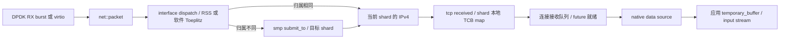

# Seastar native stack：连接归属与 future 是同一个设计问题

本篇回答：按核分片怎样消除连接状态竞争？RSS 和本地哈希是不是一回事？native stack 的协议完整度与 DPDK 后端有什么边界？

前置阅读：C++ move / RAII（资源获取即初始化）、TCP 基本状态、`lwip.md`。预计阅读时间：40 分钟，源码练习另需 90 分钟。

固定 commit：**`e417c0c0ebeb1f0578b1dd5b3dd4f65decff0a4b`**。本地 `/tmp/p6-sources/seastar`；无前缀路径相对此目录。实际访问的[上游固定版本](https://github.com/scylladb/seastar/tree/e417c0c0ebeb1f0578b1dd5b3dd4f65decff0a4b)。Linux 对照为 `v6.18`。

范围是 **native network stack**，不要把 Seastar framework、POSIX backend 与 native TCP 混在一起。另一个 POSIX socket 实现在 `src/net/posix-stack.cc:266`；它不能作为 native TCP 支持某功能的证据。

## 1. 路径：网卡队列、协议与应用都进入 shard

shard（分片）是当前 reactor（事件循环）所服务的状态域。native 初始化会给各 shard 设置本地硬件 queue 或 proxy queue，见 `src/net/native-stack.cc:110`。硬件队列少于 shard 时存在代理路径，因此不是始终“一核一条物理 RX queue”。



DPDK burst 入口见 `src/net/dpdk.cc:2193`，packet 送至 L2 见 `src/net/dpdk.cc:2175`。L2 按协议分发，必要时转到目标 shard，见 `src/net/net.cc:325`；IPv4 将 payload 交给 transport，见 `src/net/ip.cc:228`；TCP 入口和查找见 `include/seastar/net/tcp.hh:891`。应用交付通过 data source 的 `get()` 等待并读取连接数据，见 `src/net/native-stack-impl.hh:175`。

Linux 也按 IP/TCP 分层；其入口 `Linux net/ipv4/tcp_ipv4.c:2202` 并不要求消费 socket 的应用线程与网卡接收 CPU 永久绑定。Seastar native 将这一自由度收窄到 shard 的生命周期与 future 调度中。

## 2. packet：fragment 加释放动作，不保证后端不复制

`net::packet` 持有 fragments 和 deleter（释放动作），可引用外部片段、移动或共享数据，见 `include/seastar/net/packet.hh:83`、`include/seastar/net/packet.hh:206`、`include/seastar/net/packet.hh:619`。native data source 将片段包装成 `temporary_buffer`，释放器捕获共享 packet 来维持生命周期，见 `src/net/native-stack-impl.hh:180`。

但 DPDK 模板后端的差别必须写清：

- `dpdk_qp<false>::from_mbuf()` 分配新空间并 `rte_memcpy()`，随后归还原 mbuf，见 `src/net/dpdk.cc:2007`、`src/net/dpdk.cc:2025`。
- `dpdk_qp<true>::from_mbuf()` 为数据地址构造 fragment 和 deleter，并记录可回收的 mbuf descriptor，见 `src/net/dpdk.cc:2059`。这是特定内存后端的接入路径，不能推广到所有 Seastar 部署。
- packet 的 header 不连续时可能 linearize（线性化），其实现会复制片段，见 `src/net/packet.cc:40`、`src/net/packet.cc:52`。

因此“应用收到引用同一片段的 temporary_buffer”与“RX 已经经历一次复制”可以同时成立。与 Linux `sk_buff` 的对照也应逐条看共享片段和复制边界，而非按语言 C/C++ 分类；`Linux include/linux/skbuff.h:885` 同样具有非线性数据描述。

## 3. 连接表与 RSS：两个不同的 hash

TCB（TCP Control Block，TCP 控制块）表是 `std::unordered_map<connid, lw_shared_ptr<tcb>, connid_hash>`，见 `include/seastar/net/tcp.hh:664`。`connid` 为本地/远端 IP 与 port，见 `include/seastar/net/ip.hh:100`。本地 map 的 hash 是四个字段各自 `std::hash` 的 XOR，见 `include/seastar/net/ip.hh:401`。

**选择 shard 的 hash 是另一条路径。** `connid::hash(rss_key)` 使用 Toeplitz，见 `include/seastar/net/ip.hh:117`。L2 优先采用 packet 自带的硬件 RSS hash，没有时计算软件 Toeplitz，见 `src/net/net.cc:331`。本地表的碰撞处理与包该去哪个 CPU 是两个问题。

主动连接还会反复选择源端口，直到预计的返回流 RSS 落到当前 shard 且四元组未占用，见 `include/seastar/net/tcp.hh:842`。这把“连接归属”向前移动到了连接建立阶段，避免每个返回包都跨核转发。

## 4. 时间：reactor 管 timer，TIME_WAIT 仍是明确缺口

| 事情 | 源码结论 |
|---|---|
| 重传 | `timer<lowres_clock> _retransmit`，按 now + RTO rearm；`include/seastar/net/tcp.hh:395`、`include/seastar/net/tcp.hh:483` |
| delayed ACK | 注册 callback 输出 ACK；尚未 armed 时 arm 200 ms；第二个 full-size segment 可提前确认；`include/seastar/net/tcp.hh:977`、`include/seastar/net/tcp.hh:1859`、`include/seastar/net/tcp.hh:1876` |
| 时间来源 | `lowres_clock` 为廉价、缓存的单调时钟；更新从 `std::chrono::steady_clock::now()` 取得；`include/seastar/core/lowres_clock.hh:41`、`src/core/reactor.cc:657` |
| timer 容器 | `timer_set` 有按 timestamp 与 `_last` 的二进制差异选择的 buckets，延后排序成本；不是通常的固定 tick 环形时间轮；`include/seastar/core/timer-set.hh:31`、`include/seastar/core/timer-set.hh:57`、`include/seastar/core/timer-set.hh:73` |
| TIME_WAIT | `do_time_wait()` 明确留下实现 timer 的 FIXME，设状态后立即 `cleanup()`；cleanup 移除 TCB；`include/seastar/net/tcp.hh:618`、`include/seastar/net/tcp.hh:2061` |

TIME_WAIT 不是“采用了更高效的计时器”——本版本确实没有完成该等待保留逻辑。其协议后果需要专门实验，不能把这个缺口当成通用 TCP 可以安全省略的优化。上表 200 ms 同样是 arm 的目标，reactor 忙碌会影响实际执行时刻。

## 5. 线程：本地所有权减少锁，跨核依旧有成本

创建 native stack 与本地 queue 的工作被投递到各 shard，见 `src/net/native-stack.cc:110`、`src/net/native-stack.cc:136`。TCB map 属于对应 TCP 对象；常规收发在该 shard 内推进状态，不需要为任意外部线程共享同一 TCB 设计访问接口。

跨核包通过 `smp::submit_to()` 转送，并用 `free_on_cpu(src_cpu)` 协调原 CPU 的释放，见 `src/net/net.cc:310`。这说明“share nothing（尽量不共享可变状态）”不等于不存在消息、跨核队列、原子操作或缓存一致性成本。本篇只能确认连接处理的所有权模型，不能宣称整个框架无锁。

应用的一个长时间不让出的计算任务会推迟同 shard 的协议和 timer。这是协作式执行的调度代价；未来实验应测 tail latency（尾延迟）与 reactor stall，而非只测平均吞吐。

## 6. TCP 完整度：类型声明不等于线上支持

| 能力 | 本版本 native TCP 的结论 | 证据 |
|---|---|---|
| CC | 慢启动、拥塞避免、RFC6582 风格 NewReno 恢复；本篇未确认可插拔 CUBIC/BBR | `include/seastar/net/tcp.hh:1426`、`include/seastar/net/tcp.hh:2048` |
| SACK | 能认出 SYN 中 kind 4 的 SACK-permitted 并置标志；输出选项只生成 MSS / window scale，未形成完整 SACK 收发恢复路径，不能宣称支持 | `include/seastar/net/tcp.hh:95`、`src/net/tcp.cc:59`、`src/net/tcp.cc:81` |
| Window scaling | 有解析、协商输出和窗口运算 | `src/net/tcp.cc:52`、`src/net/tcp.cc:96`、`include/seastar/net/tcp.hh:1090` |
| Timestamps | 虽有 option 类型和字段，parse/fill 没有对应正常协商处理；本篇不记为已支持 | `include/seastar/net/tcp.hh:141`、`src/net/tcp.cc:34`、`src/net/tcp.cc:81` |
| TSO | TCP 在硬件能力启用时填写分段大小；DPDK 检查 TX capability；硬件实效未测 | `include/seastar/net/tcp.hh:1680`、`src/net/dpdk.cc:1590`、`src/net/dpdk.cc:636` |
| LRO | DPDK backend 在构建具备 `RTE_ETHDEV_HAS_LRO_SUPPORT` 时，再按配置和设备 RX capability 启用，并有 LRO mbuf 接收路径；不代表所有后端都有 | `src/net/dpdk.cc:1554`、`src/net/dpdk.cc:1973` |
| TIME_WAIT / keepalive | TIME_WAIT timer 未完成；native keepalive 明确报告不支持 | `include/seastar/net/tcp.hh:619`、`src/net/native-stack-impl.hh:271` |

尤其不要把 Seastar 上层应用的生产使用情况直接当作 native TCP 的成熟度证据：应用可能使用 POSIX backend，那里实际运行的是内核协议栈。

## 7. API：future 承担等待，片段所有权承担生命周期

`accept()` 返回 `future<accept_result>`，见 `src/net/native-stack-impl.hh:73`；data source 等待 `wait_for_data()` 后返回 temporary buffer，见 `src/net/native-stack-impl.hh:175`。future（未来结果）让等待变成可组合的异步依赖，不必为每条连接阻塞一个线程。

代价是应用要按 asynchronous API（异步接口）组织控制流和错误处理，并遵守 shard 所有权。自定义 socket options 在 native 实现中直接抛出不支持异常，见 `src/net/native-stack-impl.hh:295`。熟悉的 `connected_socket` 名称不能推出 BSD FD 兼容或完整 `setsockopt()` 语义。

## 8. 专用假设与局限

推测：核心假设是“应用愿意与网络栈共享 reactor 和调度约束、连接固定在 shard、部署愿意配置专门的设备后端”。于是未来结果、片段释放、RSS 源端口选择和本地 TCB map 能共同减少系统调用、迁核和共享状态同步。

但有两类东西必须区分：shard 归属是有意的架构取舍；TIME_WAIT timer 的 FIXME、native keepalive 与部分 TCP options 的缺失是当前实现边界。不能把所有未实现功能包装为可安全忽略的需求。

## 9. 测试：框架测试不等于 native TCP 协议验证

项目有 packet 片段、header 操作等单元测试，见 `tests/unit/packet_test.cc:87`，也有网络接口测试，见 `tests/unit/network_interface_test.cc:39`，DNS over TCP 行为测试见 `tests/unit/dns_test.cc:256`。这些能说明相关组件有测试，**不能证明当前运行时选了 native backend，也不能证明完成了 native TCP 的丢包/乱序/RFC 覆盖**。本次未找到足以证明上述完整覆盖的独立测试集，记为【未确认】。

本次未编译、未运行测试或抓包。只读练习：

```sh
cd /tmp/p6-sources/seastar
git rev-parse HEAD
rg -n '_sack_received|_timestamps_received' src/net/tcp.cc include/seastar/net/tcp.hh
rg -n 'TIME_WAIT state timer|remove_from_tcbs' include/seastar/net/tcp.hh
rg -n 'from_mbuf|rte_memcpy' src/net/dpdk.cc
```

读完后分别标记：字段存在、被解析、会被输出、会改变恢复行为。未来实际测试必须固定 native backend 与内存后端，抓 SYN options、FIN 后旧段和重传，避免测了 POSIX 却给 native 写结论。

## 要点回顾

- native backend 与 POSIX backend 的 TCP 能力不能混用。
- 本地 map hash 与 RSS Toeplitz hash 是两套机制。
- 主动连接通过选择源端口使回包归属当前 shard。
- fragment / deleter 减少上层复制，但某 DPDK 内存后端仍复制 RX。
- reactor timer 使用按时间位分桶的容器，TIME_WAIT timer 未完成。
- future 和 shard 同时约束应用与网络状态机。

## 自测

1. TCB map 的 XOR hash 是 NIC 配置的 RSS key 吗？
2. native data source 返回共享片段，能否推出 DPDK RX 没复制？
3. 看见 `tcp_option::timestamps` 类型就能写“支持 timestamps”吗？
4. Seastar 应用跑通 TCP，为何不能直接证明 native TIME_WAIT 完整？

<details>
<summary>参考答案</summary>

1. 不是。前者选择本地表桶；后者使用 Toeplitz 确定 shard。
2. 不能。`dpdk_qp<false>` 的 RX 路径明确复制，之后仍可以共享该新片段。
3. 不能。必须查 parse、fill、协商状态与实际使用；本版本不能据类型声明记为支持。
4. 应用可能使用 POSIX backend；即使用 native，普通收发成功也没验证 FIN 后状态保留。

</details>

## 与 DPDK/VPP 的对照

shard 类似 VPP worker 的连接所有者，packet fragment 类似 mbuf chain 的数据片段。类比止于调度：VPP 以 graph frame 和 session event 推进，Seastar 把应用 continuation、网络和 timer 放入 reactor。对你未来的栈设计，最值得带走的是“先规定谁拥有连接，再规定 API 能怎样等待和释放数据”。
