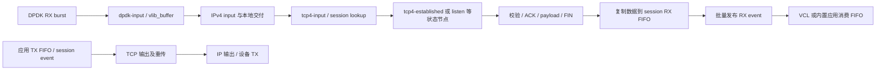

# VPP host stack：把 TCP 状态放进 graph 与 session 调度

本篇回答：TCP 怎样嵌入熟悉的 graph node？连接所有权、FIFO 和 RSS 如何配合？共享内存与零拷贝哪里容易混淆？

前置阅读：VPP graph、frame、worker、buffer 的基本使用；本目录 `lwip.md`。预计阅读时间：40 分钟，源码练习另需 90 分钟。

固定版本：**v25.06**，commit `1573e751c5478d3914d26cdde153390967932d6b`。本地 `/tmp/p6-sources/vpp`，本文无前缀路径相对此目录；实际访问的[上游固定版本](https://github.com/FDio/vpp/tree/1573e751c5478d3914d26cdde153390967932d6b)。Linux 对照为 `v6.18`。

## 1. 路径：graph 批量送达，TCP 仍逐连接更新状态



DPDK 节点的取包与 metadata 转换见 `src/plugins/dpdk/device/node.c:113`、`src/plugins/dpdk/device/node.c:371`。TCP 注册为 IP 本地协议处理者，见 `src/vnet/tcp/tcp.c:1531`；输入节点见 `src/vnet/tcp/tcp_input.c:3010`。状态与 flags 决定下一节点，例如 ESTABLISHED 的 ACK 被送至 established 节点，见 `src/vnet/tcp/tcp_input.c:3136`。

`tcp46_established_inline()` 接收一个 frame，循环处理每个 buffer，按顺序做段合法性、ACK、payload、FIN；最后批量发布 session enqueue event、处理延后的 dequeue，并释放收包 buffer，见 `src/vnet/tcp/tcp_input.c:1411`、`src/vnet/tcp/tcp_input.c:1481`。**vector 是调度与访存优化单位，四元组连接仍是协议状态单位。** 同一 frame 不代表同一 TCP 连接，也不能把 ACK 更新任意并行化。

Linux 同样在 TCP 入口选择连接并处理状态，见 `Linux net/ipv4/tcp_ipv4.c:2202`。VPP 的不同在于图节点、session 调度和应用 FIFO 一起定义了执行方式，而非把内核 socket API 原封不动放进一个 node。

## 2. buffer 与 FIFO：两种生命周期

`vlib_buffer` 描述 packet，`current_data/current_length/next_buffer` 支持头部游标和 buffer chain，见 `src/vlib/buffer.h:112`。session FIFO 描述 stream（字节流），接收序号及乱序偏移决定数据落在哪里。

顺序接收经 `session_enqueue_stream_connection()` 调 `svm_fifo_enqueue()`；乱序接收用带 offset 的入队，见 `src/vnet/session/session.h:772`。FIFO 的写入包含 `clib_memcpy_fast()`，见 `src/svm/svm_fifo.c:40`、`src/svm/svm_fifo.c:840`。随后收包 frame 的 buffer 被释放，见 `src/vnet/tcp/tcp_input.c:1485`。因此默认 RX 路径确实在 packet → FIFO 边界复制数据。

普通 `vppcom_session_read()` 经 `app_recv_stream_raw()` 再复制到应用缓冲区，见 `src/vcl/vppcom.c:2174`、`src/vnet/session/application_interface.h:786`、`src/svm/svm_fifo.c:71`。`vppcom_session_read_segments()` 能取得 FIFO segments，见 `src/vcl/vppcom.c:2240`、`src/vcl/vppcom.c:2289`；这可避免 FIFO → 应用的再次复制，但需要遵守消费/归还约定，也不会消除此前 packet → FIFO 的复制。

Linux 的 `sk_buff` 与 socket 缓冲区也不是同一个抽象；`Linux include/linux/skbuff.h:885` 是包描述，`Linux net/ipv4/tcp.c:2913` 是应用读路径。最值得观察的指标是每条边实际复制的字节数，而不是 API 是否使用共享内存。

## 3. lookup：共享查找表与 worker 私有状态并存

IPv4 使用 `bihash_16_8`，IPv6 使用 `bihash_48_8`，见 `src/vnet/session/session_lookup.c:80`。IPv4 key 包含地址、端口、transport protocol，见 `src/vnet/session/session_lookup.c:84`；先用 FIB index 选择 session table，见 `src/vnet/session/session_lookup.c:968`。`bihash_16_8` 的哈希在有 CRC32C intrinsic 时使用 CRC32C，否则使用组合后 key 的 xxhash，见 `src/vppinfra/bihash_16_8.h:62`。

命中值携带 thread index 与 session index。查找路径检查线程是否吻合，随后取该线程的 session / transport connection，见 `src/vnet/session/session_lookup.c:979`。每 worker 保存 connection pool 和 timer wheel，见 `src/vnet/tcp/tcp.h:90`、`src/vnet/tcp/tcp.h:131`。所以“每核持有连接状态”不等于“所有 lookup hash 都是每核私有”。

## 4. 时间：RTO 用轮，ACK 用 session event

| 事情 | 此版本实现与证据 |
|---|---|
| RTO / SYN 重传 | worker timer wheel 触发 handlers；`src/vnet/tcp/tcp.c:1227`、`src/vnet/tcp/tcp_output.c:1309` |
| TIME_WAIT | WAITCLOSE timer 的 TIME_WAIT 分支安排清理；`src/vnet/tcp/tcp.c:1217`；进入 TIME_WAIT 后的设置见 `src/vnet/tcp/tcp_input.c:2277` |
| 轮结构 | 两个 wheel，每环 1024 slots；`src/vnet/tcp/tcp_types.h:461`；tick 配置 0.0001 秒见 `src/vnet/tcp/tcp_types.h:81` |
| 时间来源与驱动 | `vlib_time_now()` 缓存到 worker；`src/vnet/tcp/tcp_inlines.h:249`；`tcp_update_time()` 执行 expire / dispatch，见 `src/vnet/tcp/tcp.c:1299` |
| delayed ACK 对应机制 | 此版本 timer 枚举没有 DELACK，见 `src/vnet/tcp/tcp_types.h:64`。顺序接收调用 `tcp_program_ack()`，见 `src/vnet/tcp/tcp_input.c:1278`；它设置 SNDACK 并投递 custom TX event，见 `src/vnet/tcp/tcp_output.c:1019`；调度后合并/发送 ACK，见 `src/vnet/tcp/tcp_output.c:1964`、`src/vnet/tcp/tcp_output.c:2049` |

这里的 ACK 推迟是事件调度/合并机制，不能套用“独立 40 ms delayed ACK timer”。配置的 timer tick 也不保证 callback 在 100 μs 内实时执行，worker 被其他工作占用时仍会迟到。

## 5. 线程、连接归属与 RSS 的边界

接收新 SYN 的 worker 分配连接，见 `src/vnet/tcp/tcp_input.c:2631`。后续流量需到达连接所属 worker。DPDK 的 RSS 默认包含 TCP，配置会与 NIC 能力取交集，见 `src/plugins/dpdk/device/init.c:328`、`src/plugins/dpdk/device/init.c:472`。

一个容易误读的分支：**此处 tcp-input 的 WRONG_THREAD 结果会 drop**，见 `src/vnet/tcp/tcp_input.c:2777`，并非自动把包 handoff 到 owner。其他部署可以在更早的分流/重定向层保证归属，但本篇没有验证任意插件组合；不能把“VPP 有 handoff 能力”当成这条 TCP 路径已经自动修复 RSS 错配。

也不能写“VPP host stack 完全无锁”：这里确认的是连接的 worker 所有权和错误线程检查。应用、共享 FIFO、控制面和跨 worker 协调是另外的同步边界。

## 6. TCP 能力：有恢复机制，也有后端条件

| 能力 | 已确认实现 | 证据 |
|---|---|---|
| CC（拥塞控制） | NewReno 与 CUBIC 注册；默认 CUBIC | `src/vnet/tcp/tcp_newreno.c:136`、`src/vnet/tcp/tcp_cubic.c:269`、`src/vnet/tcp/tcp.c:1643` |
| SACK | 解析/生成 SACK block；更新 scoreboard，并按 SACK 恢复 | `src/vnet/tcp/tcp_packet.h:369`、`src/vnet/tcp/tcp_packet.h:453`、`src/vnet/tcp/tcp_sack.c:347`、`src/vnet/tcp/tcp_output.c:1723` |
| Window scaling | 选项解析与生成 | `src/vnet/tcp/tcp_packet.h:342`、`src/vnet/tcp/tcp_packet.h:421` |
| Timestamps | 选项解析与生成；具体互通未实跑 | `src/vnet/tcp/tcp_packet.h:353`、`src/vnet/tcp/tcp_packet.h:436` |
| GSO/TSO | TCP 输出可置 GSO metadata 与分段大小，后续由软件/设备路径兑现；未实测 NIC TSO | `src/vnet/tcp/tcp_output.c:2143`、`src/vnet/tcp/tcp_output.c:2159` |
| LRO | 【未确认】当前部署的接收聚合能力；RX backend 与接口配置未固定，不能由 TCP 中存在 GSO 字段推导 | 接入边界 `src/plugins/dpdk/device/node.c:113` |

支持选项的源码路径不等于已经完成全部 RFC 互通/异常包验证，测试覆盖另看下一节。

## 7. API：session 是中心，VCL 是应用适配层

应用通过 RX/TX FIFO 和 event 与 session 层交互。普通 VCL read/write 是函数接口，见 `src/vcl/vppcom.c:2228`、`src/vcl/vppcom.c:2505`；segment API 暴露更直接的 buffer 使用方式。图节点只负责网络状态机和调度，并不要求应用也写成 VPP graph node。

收益是可批量发布事件、应用与网络线程可独立安排。成本是 FIFO 容量、事件及时性、应用 worker 和 transport worker 的配合，以及 API 适配工作。不能由 VCL 提供 read/write 名称就推出完整 Linux FD / socket 兼容；本篇未做 LD_PRELOAD 兼容测试。

## 8. 换来的是什么，省下的是什么

推测：这一设计假设部署者愿意控制 CPU、RX 队列和应用 API，使 packet 处理与 stream 应用交付解耦。worker 归属让单连接状态不用在任意 CPU 间迁移；批处理减少每包重复调度/通知；FIFO 让应用不必持有 NIC buffer。证据分别为 `src/vnet/session/session_lookup.c:979`、`src/vnet/tcp/tcp_input.c:1481`、`src/vnet/session/session.h:783`。

它没有删除 TCP 的重传、乱序和流控，也没有删除所有复制。最大的局限是：分流及 worker 归属变成部署正确性的组成部分，且 FIFO 边界可能成为内存带宽成本。

## 9. 测试与只读练习

项目内部 `test tcp all` 覆盖 SACK、lookup、delivery 等检查，见 `src/plugins/unittest/tcp_test.c:1583`、`src/plugins/unittest/tcp_test.c:1602`。Python 测试调用它，并有 echo 数据传输测试，见 `test/asf/test_tcp.py:125`、`test/asf/test_tcp.py:64`。

本次没有构建 VPP、启动实例或测吞吐。可以在固定 checkout 完成三项只读追踪：

```sh
cd /tmp/p6-sources/vpp
git describe --always --tags
rg -n 'WRONG_THREAD' src/vnet/session/session_lookup.c src/vnet/tcp/tcp_input.c
rg -n 'tcp_program_ack|tcp_send_acks' src/vnet/tcp/tcp_output.c
rg -n 'svm_fifo_enqueue|clib_memcpy_fast' src/vnet/session/session.h src/svm/svm_fifo.c
```

亲手画出“输入数据已入 FIFO，但应用尚未消费”的时刻：NIC buffer 是否还存在？窗口是否仍有空间？ACK event 是否已经执行？这三个问题对应三种不同状态，不能只看一个队列长度。

## 要点回顾

- graph 的批量单位和 TCP 的连接状态单位不同。
- 默认 packet → session FIFO 接收路径有复制。
- segment API 避免的可能是 FIFO → 应用的下一次复制。
- lookup table 与连接 pool 的共享/私有边界不同。
- 此版本 WRONG_THREAD 在 tcp-input 被丢弃。
- v25.06 ACK 使用 session event；RTO/TIME_WAIT 使用 timer wheel。

## 自测

1. 每核连接 pool 是否证明每核也有独立 session hash？
2. `read_segments()` 能否证明 NIC 到应用全路径零拷贝？
3. 错 worker 收到已建立连接的包时，此处 tcp-input 怎样处理？
4. 为什么不能给此版本填一个凭记忆得来的 DELACK timer 值？

<details>
<summary>参考答案</summary>

1. 不能。查找表按 session/FIB 范围选取，value 携带 owner thread。
2. 不能。前面的 packet → FIFO 已复制；它仅改变后面的消费边界。
3. WRONG_THREAD 进入 drop；前置分流必须保证归属。
4. 当前枚举没有 DELACK，ACK 由 custom TX event 调度；需要沿具体版本执行路径解释。

</details>

## 与 DPDK/VPP 的对照

你熟悉的 RX burst、buffer index、frame 和 next node 全部还在。新增的难点是 packet 到有序 stream 的转换：FIFO、序号、ACK 后 TX 数据释放、connection owner。理解 host stack 不能只顺着 graph 箭头，还要追踪 session event 与 timer 这两条没有新包也能推进状态的路径。
