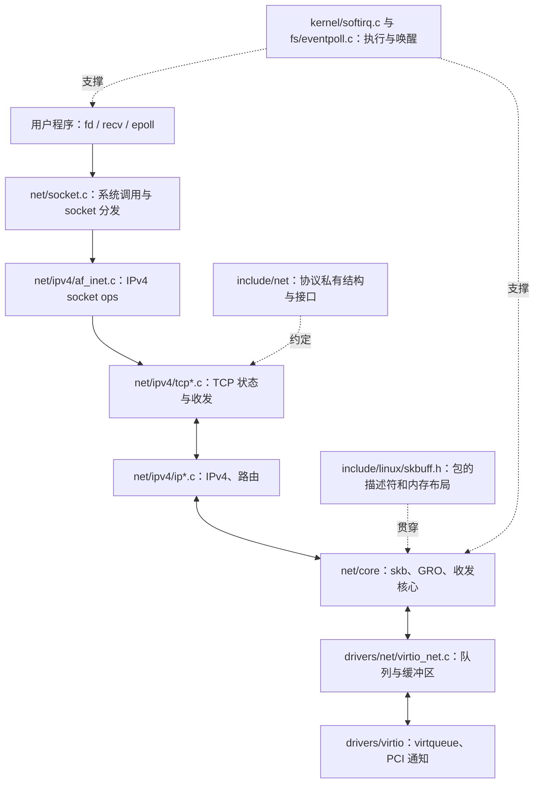

# 第 0 章：读内核前的准备

本章目标：把已有的 C/C++、VPP/DPDK 经验接到 Linux 的对象、执行上下文和代码组织上，为阅读 IPv4/TCP 收包路径准备足够的基础。下一章：[接收路径](01-tcp-receive-path.md)。

- 源码：`/home/chen/code/linux-lab/src/linux-6.18`。
- 核验：`git describe --always --dirty --tags` 输出 `v6.18`；HEAD 为 `7d0a66e4bb9081d75c82ec4957c50034cb0ea449`。
- 核验日期：2026-10-01。跟踪文件无修改；内核仓库有未跟踪的 `notes/`，不影响本章源码引用。
- 范围：x86_64、IPv4、普通 TCP、virtio_net。图和主线默认普通非 PREEMPT_RT、非 threaded NAPI、非 busy-poll 路径；条件分支另外说明。
- 引用约定：`路径:行号` 相对上述源码根目录，通常指函数定义起点或关键调用点；以符号名重新定位。按本次学习要求保留行号，优先于学习仓库 README 的旧约定。
- 证据边界：代码事实来自本地源码；设计动机标为推断；实验输出都是预期形状，**未在 QEMU 实测**。

## 1. 总览图与代码地图



| 位置 | 负责什么 | 首轮阅读入口 |
|---|---|---|
| `net/` | 网络子系统实现；不等于只有协议 | `net/socket.c`、`net/core/dev.c`、`net/core/gro.c`、`net/core/skbuff.c` |
| `net/ipv4/` | IPv4、TCP、路由和 IPv4 socket 接口 | `ip_input.c`、`tcp_ipv4.c`、`tcp_input.c`、`tcp.c` |
| `include/net/` | 网络子系统内部接口和协议对象 | `sock.h`、`inet_sock.h`、`inet_connection_sock.h`、`tcp.h` |
| `include/linux/skbuff.h` | `sk_buff`、共享数据描述、队列和包访问 helper | `struct sk_buff` 在 `include/linux/skbuff.h:885` |
| `include/linux/tcp.h` | 内核 TCP 对象；不要和 `include/net/tcp.h` 混淆 | `struct tcp_sock` 在 `include/linux/tcp.h:200` |
| `include/uapi/` | 向用户态公开的 ABI 定义 | 阅读系统调用参数、socket 选项时再查 |
| `drivers/net/` | 网卡实现、队列管理、offload 能力 | `drivers/net/virtio_net.c`；物理网卡在 `drivers/net/ethernet/intel/` |
| `drivers/virtio/` | virtio 传输层、virtqueue 实现 | `virtio_ring.c`、`virtio_pci_common.c` |
| `kernel/softirq.c` | 软中断执行机制 | 与 `net/core/dev.c` 的 `net_rx_action()` 一起读 |
| `fs/eventpoll.c` | epoll 等待、ready list、唤醒 | 第 1 章连接到 socket waitqueue |
| `Documentation/networking/` | 本版本随源码保存的网络文档 | `skbuff.rst`、`napi.rst`、`page_pool.rst` |

一个实用阅读原则：沿“调用点 → 回调赋值 → 回调实现”跳转。C 的函数指针分发不会自动显示成直连调用图。看到 `sk->sk_prot->recvmsg`，既要找它的声明，也要找 `.recvmsg = tcp_recvmsg`。

## 2. 调用链：从对象创建理解两层 ops

这里截取 IPv4/TCP socket 创建的内部子链，先不展开完整 `socket()` 系统调用。

| 步骤 | 函数 / 位置 | 一句话说明 |
|---|---|---|
| 1 | `inet_create()` — `net/ipv4/af_inet.c:254` | 按 socket 类型和协议在 `inetsw` 中选择实现；查表使用 RCU 读侧。 |
| 2，注册证据 | `inetsw_array` — `net/ipv4/af_inet.c:1155` | `SOCK_STREAM + IPPROTO_TCP` 对应 `tcp_prot` 与 `inet_stream_ops`。 |
| 3，调用点 | `inet_create()` — `net/ipv4/af_inet.c:320` | 设置 `sock->ops`，取出 `answer_prot`，随后调用 `sk_alloc()`。 |
| 4 | `sk_alloc()` — `net/core/sock.c:2290` | 分配协议对象，并把 `sk_prot`、`sk_prot_creator` 指向协议实现。 |
| 5，4 的内部调用 | `sk_prot_alloc()` — `net/core/sock.c:2225` | 用协议 slab 或 `prot->obj_size` 分配实际对象，不是只分配一个基类 `sock`。 |
| 6，返回创建函数 | `sock_init_data()` — `net/core/sock.c:3707` | 经 `sock_init_data_uid()` 初始化通用队列、回调并关联 `socket` 与 `sock`。 |
| 7，回调调用点 | `inet_create()` — `net/ipv4/af_inet.c:385` | 调用 `sk->sk_prot->init(sk)`，普通 IPv4/TCP 对应 `tcp_v4_init_sock()`。 |
| 8 | `tcp_v4_init_sock()` — `net/ipv4/tcp_ipv4.c:2523` | 初始化 TCP 对象，并设置 IPv4 的连接层操作。 |

两张 ops 表不能混为一张：

- `struct socket::ops` 是 `struct proto_ops`，面向 socket 操作；`inet_stream_ops` 的 `.recvmsg = inet_recvmsg`，见 `net/ipv4/af_inet.c:1054`。
- `struct sock::sk_prot` 是 `struct proto`，面向协议实现；`tcp_prot` 的 `.recvmsg = tcp_recvmsg`、`.backlog_rcv = tcp_v4_do_rcv`，见 `net/ipv4/tcp_ipv4.c:3485`。类型定义在 `include/net/sock.h:1259`。

这类似显式写出的 C++ 多态接口，但对象布局、生命周期和并发规则都由 C 代码负责。函数指针只是行为分发，本身不保证线程安全。

## 3. 必须先认识的内核惯用法

| 惯用法 | 本地证据 | 阅读时怎么理解 |
|---|---|---|
| `container_of` | `include/linux/container_of.h:19`；`container_of_const` 在 `:35` | 从内嵌成员地址减去成员偏移，得到外层对象地址。不是分配、复制或动态类型检查。此版本注释建议新代码优先使用保留 const 的变体。 |
| `list_head` | `include/linux/types.h:199`；`list_add_tail()` 在 `include/linux/list.h:189` | 双向侵入式链表。节点嵌入业务对象；同一个节点不能同时挂在两个链上。 |
| `hlist` | `include/linux/types.h:203`；`hlist_add_head()` 在 `include/linux/list.h:1033` | 桶头只需一个指针；节点保存 `next` 和 `pprev`，适合哈希桶。查 TCP 表还会遇到 `hlist_nulls_node`，不要把它当普通 `hlist` 宏使用。 |
| RCU 读侧 | `rcu_read_lock()` — `include/linux/rcupdate.h:863`；`rcu_read_unlock()` — `:893` | 在读侧临界区内，按 RCU 发布和回收规则访问对象；读取指针还要看 `rcu_dereference`。它不阻止并行写入，也不等于“对象所有字段不变”。 |
| per-CPU | `DEFINE_PER_CPU` — `include/linux/percpu-defs.h:113`；`softnet_data` 实例在 `net/core/dev.c:456` | 每 CPU 各有一份，减少跨核写共享；持有某 CPU 的指针时要核对迁移/抢占约束，不能拿到指针就假设永远是本 CPU。 |
| ops 表 | 上节两张表；`napi_struct::poll` — `include/linux/netdevice.h:391` | 通用层调用具体实现。必须找到赋值点才能确定真实调用链。 |
| `likely/unlikely` | `include/linux/compiler.h:76` | 给编译器的分支概率提示；不改变真假，不提供锁或内存序。开启分支统计时实现会不同。 |
| 引用计数 | `skb_get()` — `include/linux/skbuff.h:2011`；`sock_hold()` — `include/net/sock.h:814`；`sock_put()` — `:1969` | 引用决定对象能否释放；多个持有者仍需协议规定的锁来保护可变状态。 |

以 `tcp_sk()` 为例，本版本的真实定义是：

```c
/* include/linux/tcp.h:552 */
#define tcp_sk(ptr) container_of_const(ptr, struct tcp_sock, inet_conn.icsk_inet.sk)
```

这里传入的 `sock *` 必须确实来自 TCP 对象。宏沿内嵌成员路径还原外层地址；它不会把 UDP 对象“转换”为 TCP。

本章普通 RCU 读侧临界区不主动睡眠；可被抢占和可以任意阻塞是不同约束，见 `include/linux/rcupdate.h:820` 起的说明。

RCU 与引用计数解决的问题不同：RCU 适合高频查表时保护读侧生命周期；离开临界区后继续持有对象通常要另外取得有效引用，具体以查表 API 的约定为准。不能把每次查表机械地改成 `sock_hold()`：加引用前对象也必须仍然有效。`refcount_inc_not_zero()` 的接口在 `include/linux/refcount.h:333`，第 1 章会看到它在 socket 查找中的使用。

### 3.1 硬中断、软中断、NAPI

它们不是三个固定线程：

- 硬中断先处理设备通知。virtio RX callback 主要安排 NAPI，避免在硬中断里完整执行 TCP。
- NAPI 是队列的轮询/调度对象。`NET_RX_SOFTIRQ` 是软件中断类别，定义在 `include/linux/interrupt.h:552`；`net_dev_init()` 内注册 `net_rx_action` 的调用点在 `net/core/dev.c:13064`。
- 普通路径的 `net_rx_action()`（`net/core/dev.c:7745`）处理本 CPU 的 NAPI poll list；驱动的 poll 每次有工作预算。持续繁忙会继续轮询，不要求每批包都重新触发一次硬中断。
- 软中断可在中断返回等上下文执行，也可由 `ksoftirqd/N` 执行。看到当前进程名不等于包属于那个进程；第 1 章实验按 CPU 和函数关系观察。
- 普通硬中断/软中断路径不能按用户线程的思路等待可睡眠锁。NAPI 还存在 threaded/busy-poll 等模式，本轮主线不把它们展开。

与 DPDK 对照：轮询处理队列很熟悉，但 Linux 还要公平分配 CPU 给应用，并在中断、轮询、进程系统调用之间交接 socket 状态。`sk_backlog` 正是后面必须读懂的一处交接。

## 4. 两个核心数据结构

### 4.1 `sk_buff`：元数据与包数据分开

`struct sk_buff`（`include/linux/skbuff.h:885`）是描述符，不是把整个包内嵌进结构体。一个 skb 可同时引用线性区和非线性数据。

```text
独立的 struct sk_buff 描述符
  head ──► [ headroom | 线性有效数据 | tailroom | skb_shared_info ]
                       ↑data          ↑head+tail ↑head+end
                                                ├─ frags[] → 页/页片段
                                                └─ frag_list → 其他 skb

线性数据长度 = len - data_len
总有效数据长度 = len
非线性数据长度 = data_len
```

图中的线性有效数据结束于 `head + tail`；`skb_shared_info` 从 `head + end` 开始。x86_64 下 `tail/end` 是相对 `head` 的整数偏移，不是裸指针，类型分支在 `include/linux/skbuff.h:718`。优先通过 `skb_tail_pointer()`、`skb_end_pointer()` 访问。

| 字段 / helper | 位置 | 读本轮代码时的作用 |
|---|---|---|
| `head/data/tail/end` | `include/linux/skbuff.h:1092` | 分配起点、当前协议数据起点、线性有效数据末尾、线性区容量末尾。 |
| `len/data_len` | `include/linux/skbuff.h:934` | 总数据和非线性数据长度；`skb_headlen()` 在 `:2531` 实现两者相减。 |
| `mac_header/network_header/transport_header` | `include/linux/skbuff.h:1081` | 相对 `head` 的协议头偏移；`data` 随 `pull` 改变，不代表所有协议头地址跟着丢失。 |
| `dev/protocol/ip_summed` | `include/linux/skbuff.h:885` | 入设备、二层协议分类和校验和状态；不能把所有接收包都假设为软件重新计算校验和。 |
| `cb[48]` | `include/linux/skbuff.h:918` | 当前层使用的临时控制区。TCP 用它保存序号等；跨层读写要遵守该层的所有权约定。 |
| `next/prev/rbnode` | `include/linux/skbuff.h:886` | 链表节点与红黑树节点占用 union；TCP 接收队列和乱序树使用不同组织方式。 |
| `truesize` | `include/linux/skbuff.h:1096` | socket 内存记账量，不等于 TCP payload 字节数。 |
| `users` | `include/linux/skbuff.h:1097` | 描述符的引用数。 |
| `nr_frags/frags/frag_list/dataref` | `struct skb_shared_info` — `include/linux/skbuff.h:593` | 页片段数组、其他 skb 的链和共享数据引用计数；`skb_shinfo()` 在 `:1783` 定位它。 |

这里的“分片”是内存散布方式，不自动等于 IPv4 分片。一个未做 IP 分片的 TCP 包可以是 non-linear skb；GRO 合并后的 skb 也可能比 MTU 大。

常用 helper 的真实效果：

| helper | 定义 | 改什么 |
|---|---|---|
| `skb_reserve()` | `include/linux/skbuff.h:2925` | 仅用于空 skb，同时前移 `data/tail` 以预留 headroom，不增加 `len`。 |
| `skb_put()` | `net/core/skbuff.c:2576` | 要求线性 skb，增加尾部有效长度，返回原尾指针供写入；不自动扩容。 |
| `skb_push()` | `net/core/skbuff.c:2597` | 向前移动 `data`、增加 `len`，通常用于加协议头。 |
| `skb_pull()` | `net/core/skbuff.c:2617` | 向后移动 `data`、减少 `len`；它本身不搬动 payload，也不自动把 frags 拉到线性区。 |

clone 与共享要拆成两层看：

1. `skb_get()`（`include/linux/skbuff.h:2011`）增加同一描述符的 `users`，返回同一个指针。
2. `skb_clone()`（`net/core/skbuff.c:2031`）产生另一个描述符；内部 `__skb_clone()`（`:1541`）复制数据指针、把新描述符 `users` 设为 1，并增加共享数据的 `dataref`。
3. 所以新旧描述符可各自调整元数据，但写共享 payload/头部前还必须满足可写性要求。`skb_shared()`（`include/linux/skbuff.h:2110`）和 `skb_cloned()`（`:2029`）检查的不是同一件事。

DPDK 类比：skb 的描述符/数据分离、链式片段和 clone 引用管理，与 mbuf 有相似之处；Linux 还把路由、socket 记账、校验和、GSO/GRO 等跨层状态串在一起，不宜机械照搬所有字段。

### 4.2 `sock → inet_sock → inet_connection_sock → tcp_sock`

这是按首成员嵌入实现的层次；`struct socket` 另在外面，把文件描述符体系接到协议对象。

```text
struct socket                     include/linux/net.h:116
  sk ───────────────────────────────┐
  ops → inet_stream_ops             │
  wq                                ▼
struct tcp_sock                     include/linux/tcp.h:200
  inet_conn: struct inet_connection_sock   include/net/inet_connection_sock.h:78
    icsk_inet: struct inet_sock             include/net/inet_sock.h:212
      sk: struct sock                      include/net/sock.h:354
        __sk_common: struct sock_common    include/net/sock.h:150
```

从外往内是内嵌布局，从 `sock *` 往外则通过 `inet_sk()`（`include/net/inet_sock.h:355`）、`inet_csk()`（`include/net/inet_connection_sock.h:145`）、`tcp_sk()`（`include/linux/tcp.h:552`）取得更具体视图。

| 层 | 本轮只需记住的字段 | 用途与定义位置 |
|---|---|---|
| `sock_common` | `skc_daddr/skc_rcv_saddr/skc_dport/skc_num/skc_state/skc_refcnt` | 地址、端口、状态、引用；`include/net/sock.h:150`。远端端口为网络字节序，`skc_num` 是本地端口的主机序视图。 |
| `sock` | `sk_prot/sk_state/sk_refcnt` | 此版本中这些名字是访问 `__sk_common` 成员的宏别名，见 `include/net/sock.h:360`，不是另一份重复字段。 |
| `sock` | `sk_receive_queue/sk_backlog/sk_lock` | 已进入接收队列的数据、用户占用 socket 时暂存的包、socket 并发控制；`include/net/sock.h:399`、`:408`、`:461`。 |
| `sock` | `sk_rmem_alloc/sk_rcvbuf/sk_rcvlowat` | 已记账的接收内存、接收预算、可读低水位；`include/net/sock.h:414`、`:431`、`:443`。 |
| `sock` | `sk_wq/sk_data_ready/sk_backlog_rcv` | 等待队列、数据可读通知、处理 backlog 的回调；`include/net/sock.h:435`、`:441`、`:567`。 |
| `inet_sock` | `sk/inet_saddr/inet_sport` | IPv4 层内嵌基类与本地发送地址/端口；`include/net/inet_sock.h:212`。`inet_daddr/inet_rcv_saddr/inet_dport/inet_num` 也是公共字段的别名。 |
| `inet_connection_sock` | `icsk_inet/icsk_ack/icsk_af_ops` | 连接层、ACK 调度状态、地址族操作；`include/net/inet_connection_sock.h:78`。accept 队列、定时器、拥塞控制留到后续章节。 |
| `tcp_sock` | `pred_flags/rcv_nxt/copied_seq` | 首部预测、下一期待序号、应用下一待读序号；`include/linux/tcp.h:302`、`:305`、`:244`。 |
| `tcp_sock` | `out_of_order_queue/rcv_wnd` | 乱序红黑树、接收窗口；`include/linux/tcp.h:255`、`:320`。 |

对于普通无 FIN 的稳定数据接收，`rcv_nxt - copied_seq` 可帮助理解“已按序收到但应用未读”的量；序号是 32 位环形空间，实际代码用 TCP 的序号比较与状态规则，不能随意用普通有符号大小比较代替。

## 5. 为什么这样设计

以下是依据代码结构的设计解释，不声称是提交作者的原话。

1. **元数据与 payload 分离，降低搬运成本。** `__skb_clone()` 共享数据，`skb_pull()` 只移动起点；抓包、分层解析和重传等场景可以复用数据。但“能共享”意味着写入和回收必须分别考虑。
2. **通用对象配协议 ops，控制扩展成本。** `inet_create()` 选择接口表，调用者无须复制整套 fd/等待队列代码；TCP 私有状态仍有自己的结构。代价是读代码要显式追踪回调赋值。
3. **per-CPU + NAPI 分批处理，减少共享写和通知成本。** `softnet_data` 分 CPU、`net_rx_action()` 有预算；这与数据面批处理相似，同时为其他任务留出 CPU。
4. **RCU、引用计数、锁各司其职。** 查表读侧不必对所有读者加同一把写锁，引用延长生命周期，socket 锁保护协议状态。三者组合比“对象有引用就线程安全”更精确。

## 6. 阅读工具与验证实验

### 6.1 仓库跳转

本地已有约 7.9 MB 的 `compile_commands.json`，已检查其中 `tcp_input.c`、`dev.c`、`virtio_net.c` 的记录指向当前存在的源码目录。能否在你的 IDE 正常解析尚未实测。

```bash
cd /home/chen/code/linux-lab/src/linux-6.18
git describe --always --dirty --tags
rg -n '^void tcp_rcv_established|tcp_rcv_established\(' net/ipv4 include/net
rg -n '\.recvmsg\s*=\s*(inet_recvmsg|tcp_recvmsg)' net/ipv4
nl -ba net/ipv4/tcp_input.c | sed -n '5950,6040p'
```

建议让 IDE 的 clangd 使用这个源码根目录的编译数据库；先试跳转 `tcp_sk`、`tcp_rcv_established` 和 `inet_stream_ops`。具体编辑器启动参数未确认，不把某款 IDE 的设置当作内核事实。

数据库来自真实编译留下的 `.cmd`，不是从头文件猜 include 路径。已构建后可用仓库脚本重建索引：

```bash
python3 scripts/clang-tools/gen_compile_commands.py \
    -d /home/chen/code/linux-lab/src/linux-6.18 \
    -o /home/chen/code/linux-lab/src/linux-6.18/compile_commands.json
```

参数与解析逻辑见 `scripts/clang-tools/gen_compile_commands.py:29`、`:64`、`:152`。如果以后采用 `O=/另一个构建目录`，`-d` 必须指向实际构建目录，并让 IDE 找到输出数据库。`make compile_commands.json` 目标也存在（`Makefile:2073`），但依赖构建产物，可能触发构建，不把它当纯文本索引命令。

不依赖编译数据库的备选：

```bash
make ARCH=x86 COMPILED_SOURCE=1 cscope
cscope -d
```

目标在 `Makefile:2043`，索引生成逻辑在 `scripts/tags.sh:128`。需要已安装 cscope；是否只收录已编译文件由该脚本的 `COMPILED_SOURCE` 分支决定。未编译启用的条件分支仍用 `rg` 查看。静态跳转看到的候选关系，要结合 ops 注册和运行配置确认。

### 6.2 QEMU：先观察执行上下文

学习仓库 `scripts/run-qemu.sh` 目前传入 `-device e1000`，其 `mkinitramfs.sh` 构建的是最小 BusyBox 环境。核查时内核 `bzImage` 已存在，但该脚本使用的 `qemu/initramfs.cpio.gz` 尚不存在。本次只写笔记，不改这些脚本。第 1 章给出复用现有内核/initramfs、选择 virtio_net 的完整启动命令。

当前源码树 `.config` 已启用 `CONFIG_X86_64`、`CONFIG_VIRTIO_NET`、`CONFIG_FUNCTION_TRACER`、`CONFIG_FUNCTION_GRAPH_TRACER`、`CONFIG_KPROBE_EVENTS`、`CONFIG_BPF_SYSCALL`、`CONFIG_BPF_EVENTS`；没有发现启用的 `CONFIG_DEBUG_INFO_BTF`。这只是构建配置，guest 实际运行内核仍需检查 `uname -r`。最小 initramfs 不自动附带 bpftrace/perf/Python，先用不需要这些用户态包的 ftrace。

在专用学习 guest 以 root 执行，网络按第 1 章配置好。本实验使用 tracefs 根目录；本版本 `set_graph_function`、`max_graph_depth` 是全局文件，不在 tracing instance 子目录中（`kernel/trace/ftrace.c:7086`、`kernel/trace/trace_functions_graph.c:1717`）。不要同时运行其他 tracing 实验：

```sh
uname -r
mount -t tracefs tracefs /sys/kernel/tracing 2>/dev/null || true
T=/sys/kernel/tracing
echo 0 > "$T/tracing_on"
echo 0 > "$T/events/enable"
echo function_graph > "$T/current_tracer"
echo funcgraph-proc > "$T/trace_options"
echo net_rx_action > "$T/set_graph_function"
echo 4 > "$T/max_graph_depth"
echo 1 > "$T/events/irq/softirq_entry/enable"
echo 1 > "$T/events/napi/napi_poll/enable"
: > "$T/trace"
echo 1 > "$T/tracing_on"
ping -c 3 10.0.2.2
echo 0 > "$T/tracing_on"
cat "$T/trace"
echo 0 > "$T/events/enable"
echo nofuncgraph-proc > "$T/trace_options"
echo nop > "$T/current_tracer"
echo > "$T/set_graph_function"
echo 0 > "$T/max_graph_depth"
```

期望形状，次数、耗时和缩进随编译/流量变化：

```text
... softirq_entry: vec=3 [action=NET_RX]
... net_rx_action() {
...   napi_poll() {
...     __napi_poll() {
...       virtnet_poll() { ... }
...       napi_poll: ... device eth0 work 1 budget 64
...     }
...   }
... }
```

ping 只用来触发驱动、NAPI 和 IP 接收，本实验还不证明 TCP。`napi:napi_poll` 的 `work/budget` 字段见 `include/trace/events/napi.h:14`；软中断事件见 `include/trace/events/irq.h:103`。ftrace 的控制接口依据本仓库 `Documentation/trace/ftrace.rst`，函数被内联/优化时不保证每层都能看到。guest 网卡名不一定是 `eth0`。

判断实验是否成功：能看到 virtio poll 与 NET_RX 活动，并能区分当前 CPU、当前任务和协议 socket 的归属；不要要求“一次硬中断对应一个 skb”。第 1 章再用 TCP 流量观察完整路径。

## 7. 自测题

1. 为什么 `tcp_sk(sk)` 不能用来判断 `sk` 是否属于 TCP？
2. `skb_get()` 和 `skb_clone()` 分别共享什么？`users == 1` 是否证明 payload 可写？
3. 一个 skb 的 `len=4096`、`data_len=3072`，线性有效数据有多少？这是否证明发生了 IP 分片？
4. RCU、引用计数、socket 锁各解决什么问题？为什么有引用仍可能产生状态竞争？
5. 静态调用图找不到 `tcp_recvmsg()` 的直接调用者时，应去哪里找回调证据？

## 8. 对用户态协议栈的启示

- 先确定包描述符、数据缓冲区和连接对象各自的所有权。是否 clone、是否跨核、何时归还 pool，比字段名称更重要。
- 单核独占流可以简化 Linux 的锁与 backlog 机制，但不能省掉生命周期、缓冲区记账和异步通知规则。
- 把批处理、协议状态推进和应用消费分开建模。即使全在一个轮询线程中，它们也不是同一个时间点。

<details>
<summary>自测答案</summary>

1. 宏只做成员地址到外层地址的计算，没有运行时类型检查；调用者必须先知道对象确属 TCP。
2. `skb_get()` 共享同一描述符；`skb_clone()` 创建新描述符但共享数据。`users==1` 只表明描述符没有其他引用，数据仍可能被 clone 共享。
3. 1024 字节。不能证明 IP 分片；这只是内存布局。
4. RCU 保护遵守其协议的读侧访问期，引用延长对象生命周期，锁/其他同步机制保护可变状态。引用不串行化字段修改。
5. 找 `struct proto` 的 `recvmsg` 字段、`tcp_prot.recvmsg = tcp_recvmsg`，再追 `inet_recvmsg()` 的间接调用；外层还有 `inet_stream_ops.recvmsg = inet_recvmsg`。

</details>
