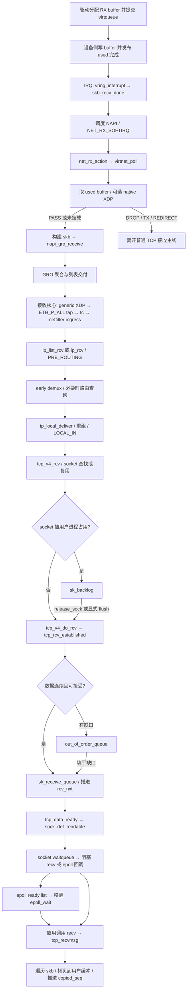

# 第 1 章：从 virtio_net 收到包，到应用 recv 得到字节

本章沿一个送给本机已建立 IPv4/TCP 连接的数据段，贯通 RX buffer、NAPI、GRO、IPv4、TCP、可读通知与用户拷贝。先读主线，再回到各阶段的条件分支。前置：[第 0 章](00-kernel-networking-preparation.md)。

- 源码：`/home/chen/code/linux-lab/src/linux-6.18`；`git describe --always --dirty --tags` = `v6.18`。
- HEAD：`7d0a66e4bb9081d75c82ec4957c50034cb0ea449`；核验日期：2026-10-01。
- `文件:行号` 均相对此源码根目录，指函数定义或明确标出的调用点。行号只用于这个固定提交。
- 主线：x86_64、virtio PCI、普通 NAPI softirq、IPv4 本地投递、普通 TCP socket；不展开 IPv6/MPTCP、bridge/OVS、AF_XDP、TLS、busy-poll、threaded NAPI。
- 设备协商、运行时配置会改变分支；代码事实、设计推断、实验预期分开叙述。**本章实验未在 QEMU 实测，所有输出均为示意。**

## 1. 总览图



图中的箭头既有直接调用，也有异步交接：设备完成、中断安排 softirq、GRO 暂存、socket backlog、进程唤醒都可能打断单一调用栈。不能期待一次 function_graph 记录从 IRQ 连续嵌套到用户 `recv()`。

三个计量单位也要分清：设备交付的包、GRO/TCP 队列里的 skb、应用消费的字节。它们没有一一对应关系。

## 2. 调用链，按真实执行阶段推进

### 2.1 包到达之前：谁提供 RX buffer，ring 里到底是什么

驱动先提供内存，设备才能接收。包写入描述符指向的 **RX buffer**；ring 保存描述符或完成信息，不能把二者混为一个存放帧内容的数组。

virtio guest 能确认的是“提交可写 buffer → 消费完成信息”的协议边界。QEMU/vhost 后端如何把宿主侧数据写入 guest RAM，**未确认**；不能仅凭 guest 源码断言物理网卡直接 PCIe DMA 到这些页。`virtqueue_map_single_attrs()`（`drivers/virtio/virtio_ring.c:3254`）也区分 DMA map API 与直接地址路径。

| 顺序 / 分支 | 函数 + 源码位置 | 做什么 |
|---|---|---|
| 网卡启用 | `virtnet_open()` — `drivers/net/virtio_net.c:3214` | 给已启用的 RX queue 预填 buffer；缺内存可安排 refill work。 |
| 公共补充入口 | `try_fill_recv()` — `drivers/net/virtio_net.c:2827` | 按 mergeable → big → small 分派，循环提交到可用描述符用尽或出错，再按需通知设备。 |
| small | `add_recvbuf_small()` — `drivers/net/virtio_net.c:2668` | 预留 virtio header、数据、XDP headroom 与共享信息空间，分配页片段。 |
| mergeable | `add_recvbuf_mergeable()` — `drivers/net/virtio_net.c:2766` | 按包长估计与容量选片段大小，提交可被设备组合使用的输入 buffer。 |
| 页片段补充 | `skb_page_frag_refill()` — `net/core/sock.c:3100` | 为驱动的 `alloc_frag` 补页；它不是 page_pool API。 |
| small/mergeable 内部 | `virtnet_rq_alloc()` — `drivers/net/virtio_net.c:1003` | 管理映射、页片段 offset、映射引用及页引用。 |
| 描述符提交 | `virtqueue_add_inbuf_premapped()` — `drivers/virtio/virtio_ring.c:2430` | 把已映射的输入 scatterlist 交给 virtqueue 实现。 |
| split ring 示例 | `virtqueue_add_split()` — `drivers/virtio/virtio_ring.c:533` | 设置可写描述符，写 avail ring；`:682` 的 `virtio_wmb()` 后发布 avail index。packed ring 是另一实现分支。 |
| big 分支 | `add_recvbuf_big()` — `drivers/net/virtio_net.c:2700` | 用多页 SG 和普通 `virtqueue_add_inbuf()` 提交较大 buffer 组合。 |
| big 页缓存 | `get_a_page()` / `give_pages()` — `drivers/net/virtio_net.c:699` / `:689` | 从 `rq->pages` 缓存取页、归还未消耗页；缓存空时分配。 |

`mergeable_rx_bufs` 的含义是一个设备交付的包可占多个 RX buffer；**它和 GRO 合并多个 TCP 段是两件事**。特性来自 `VIRTIO_NET_F_MRG_RXBUF` 协商，赋值点在 `drivers/net/virtio_net.c:6898`。是否启用、split/packed ring、设备侧 offload，必须记录 guest 实际环境。

**page_pool 在哪里？** 本树 `virtio_net.c` 没有使用 page_pool，代表主线不能虚构这一层。

page_pool 是网络收包页/页片段的分配与回收设施：复用页、缓存 DMA 映射，处理返回路径；不是 skb 描述符池，也不负责 TCP 重组。入口 `page_pool_create()`（`net/core/page_pool.c:366`）、`page_pool_alloc_pages()`（`:669`）、`page_pool_put_page()`（`include/net/page_pool/helpers.h:360`）。本树文档 `Documentation/networking/page_pool.rst:51` 解释按队列组织分配缓存；`:76` 说明 CPU 侧 DMA 同步仍由驱动负责。这里保留概念，读本驱动时实际追的是 `alloc_frag` 和自管 DMA 引用。

物理网卡的对应位置：

| 驱动 | 提交与取回 | 与 virtio 的差别 |
|---|---|---|
| `igb` | `igb_alloc_mapped_page()` — `drivers/net/ethernet/intel/igb/igb_main.c:9159`；`igb_alloc_rx_buffers()` — `:9208`；`igb_clean_rx_irq()` — `:9019` | 分配/映射页，把 DMA 地址填入硬件 descriptor，完成后检查 writeback 与内存屏障；`igb_msix_ring()`（`:7156`）安排 NAPI，`igb_poll()`（`:8281`）清理 RX。 |
| `ice` | `ice_alloc_mapped_page()` — `drivers/net/ethernet/intel/ice/ice_txrx.c:801`；`ice_alloc_rx_bufs()` — `:883`；`ice_clean_rx_irq()` — `:1381` | 同样面向硬件描述符和 DMA，检查 DD 完成位；`ice_msix_clean_rings()` — `drivers/net/ethernet/intel/ice/ice_lib.c:498`，进入 `ice_napi_poll()` — `ice_txrx.c:1702`。 |

本版本这两个驱动的普通 RX 也使用自己的页复用机制，不能概括成“物理网卡都用 page_pool”。它们不同于 virtio 的主要部分在设备队列、DMA、完成格式与 offload 能力，进入 skb/GRO 之后复用上层协议栈。

### 2.2 硬中断 → NAPI 调度 → NET_RX_SOFTIRQ

主线选择每 virtqueue 一个 MSI-X vector；共享 vector 和 INTx 单列。

| 阶段 | 函数 + 源码位置 | 做什么 |
|---|---|---|
| x86 设备中断 | `common_interrupt` — `arch/x86/kernel/irq.c:318` | 经 `call_irq_handler` 进入对应 IRQ flow；这里不是与下一行直接相邻的一次 C 调用。 |
| IRQ action 分发 | `__handle_irq_event_percpu()` — `kernel/irq/handle.c:177` | 在 `:203` 调已注册的 `action->handler`。 |
| 注册证据 | `vp_find_one_vq_msix()` — `drivers/virtio/virtio_pci_common.c:330` | `:365` 用 `request_irq(..., vring_interrupt, ..., vq)` 注册 per-vq handler。 |
| virtqueue handler | `vring_interrupt()` — `drivers/virtio/virtio_ring.c:2693` | 检查有 used 工作且队列正常后，调用 `vq->vq.callback`。 |
| callback 注册证据 | `virtnet_find_vqs()` — `drivers/net/virtio_net.c:6459` | RX callback 在 `:6497` 设为 `skb_recv_done`。 |
| RX callback | `skb_recv_done()` — `drivers/net/virtio_net.c:2861` | 找 RX queue 并安排其 NAPI。 |
| 通知转轮询 | `virtqueue_napi_schedule()` — `drivers/net/virtio_net.c:751` | `napi_schedule_prep()` 成功后抑制 virtqueue callback，再调 `__napi_schedule()`。 |
| 原子调度门闩 | `napi_schedule_prep()` — `net/core/dev.c:6607` | 原子更新 SCHED/MISSED 等状态，避免同一 NAPI 重复入队。 |
| 当前 CPU 调度 | `__napi_schedule()` — `net/core/dev.c:6588` | 取得本 CPU `softnet_data` 并进入内部调度函数。 |
| 放 poll list | `____napi_schedule()` — `net/core/dev.c:4842` | 普通模式挂本 CPU `poll_list`，需要时 raise `NET_RX_SOFTIRQ`。 |
| IRQ 退出条件分支 | `irq_exit_rcu()` / `__irq_exit_rcu()` — `kernel/softirq.c:737` / `:713` | 满足条件时 `invoke_softirq()`；不是所有 softirq 都必定在这个返回点执行。 |
| 执行 softirq action | `handle_softirqs()` — `kernel/softirq.c:579` | `:622` 调 action；超出处理限制且仍有工作时可唤醒 `ksoftirqd`。 |
| NET_RX 注册证据 | `net_dev_init()` 内调用 — `net/core/dev.c:13064` | `open_softirq(NET_RX_SOFTIRQ, net_rx_action)`。 |

共享 MSI-X 先经 `vp_vring_interrupt()`（`drivers/virtio/virtio_pci_common.c:83`）遍历队列；INTx 先经 `vp_interrupt()`（`:106`）读/清 ISR。不能把这几个分支画成每个包都串行经过。

### 2.3 poll 预算、取包与 native XDP

| 阶段 | 函数 + 源码位置 | 做什么 |
|---|---|---|
| NET_RX action | `net_rx_action()` — `net/core/dev.c:7745` | 轮转本 CPU 的 NAPI 列表，控制总工作量和时间。 |
| 通用 poll | `napi_poll()` / `__napi_poll()` — `net/core/dev.c:7647` / `:7580` | 调驱动回调；`:7594` 实际传入 `n->weight`。 |
| 驱动注册证据 | `virtnet_alloc_queues()` — `drivers/net/virtio_net.c:6536` | `:6557` 注册 `virtnet_poll`，随后设置 weight。 |
| virtio poll | `virtnet_poll()` — `drivers/net/virtio_net.c:3114` | 可顺带 TX 回收，调 `virtnet_receive()`，按需 flush XDP redirect；未用满预算时尝试完成。 |
| RX 与补 buffer | `virtnet_receive()` — `drivers/net/virtio_net.c:3022` | 普通分支调取包函数，空闲描述符达到补充条件后尝试 GFP_ATOMIC refill。 |
| 消费 used | `virtnet_receive_packets()` — `drivers/net/virtio_net.c:2994` | 外层最多处理 budget 个包；mergeable 一个包可消耗多个 buffer。 |
| small/mergeable 取回 | `virtnet_rq_get_buf()` / `virtnet_rq_unmap()` — `drivers/net/virtio_net.c:967` / `:935` | 从 virtqueue 取 token/长度，处理 DMA 映射引用和必要的 CPU 同步。 |
| ring 封装 | `virtqueue_get_buf_ctx()` — `drivers/virtio/virtio_ring.c:2538` | 分派 split/packed；split 实现在 `:815`，读 used 前后遵守相应内存屏障。 |
| 模式分派 | `receive_buf()` — `drivers/net/virtio_net.c:2618` | 检查长度，按 mergeable → big → small 生成 skb。 |
| 完成与竞态复查 | `virtqueue_napi_complete()` — `drivers/net/virtio_net.c:760` | 配合恢复通知与 `napi_complete_done()`，再检查队列；若完成窗口中又到包则重新调度。 |

预算有两层，不能套成 `min(剩余全局预算, weight)`：驱动每轮收到 `napi->weight`，默认 virtio weight 为 64（`drivers/net/virtio_net.c:30`、`include/linux/netdevice.h:2786`）；`net_rx_action()` 每轮返回后才扣 `work`，还检查 `netdev_budget_usecs`。所以总工作量可跨过全局阈值一点才退出。`work == budget` 只说明本轮用满配额，不单独证明 ring 仍有包；继续轮询可在下一轮确认。

构建 skb 与 XDP 的分支：

| 分支 | 函数 + 源码位置 | 数据与所有权 |
|---|---|---|
| small 普通路径 | `receive_small()` — `drivers/net/virtio_net.c:2044` → `receive_small_build_skb()` — `:1928` → `virtnet_build_skb()` — `:830` | 在已有 buffer 上建立 skb。 |
| small XDP | `receive_small_xdp()` — `drivers/net/virtio_net.c:1953` | 先执行 XDP，PASS 后才建立 skb；DROP/TX/REDIRECT 分别回收或转移 buffer。 |
| mergeable 普通路径 | `receive_mergeable()` — `drivers/net/virtio_net.c:2462` | 按 `num_buffers` 取齐包，首 buffer 经 `page_to_skb()`，其余由 `virtnet_skb_append_frag()`（`:2419`）接入。 |
| mergeable XDP | `receive_mergeable_xdp()` — `drivers/net/virtio_net.c:2359` | 准备 xdp_buff，PASS 后由 `build_skb_from_xdp_buff()`（`:2158`）构建 skb。 |
| XDP action | `virtnet_xdp_handler()` — `drivers/net/virtio_net.c:1791` | 调 `bpf_prog_run_xdp()`，分派 PASS/TX/REDIRECT/DROP/ABORTED。 |
| big | `receive_big()` — `drivers/net/virtio_net.c:2096` | 验证长度后 `page_to_skb()`；这个接收分支自身没有 native XDP 调用。 |
| 页变 skb | `page_to_skb()` — `drivers/net/virtio_net.c:847` | 条件适合可直接 build；否则分配 skb，小包可复制帧，大包可复制头部并挂页片段。 |
| skb 外壳 | `build_skb()` — `net/core/skbuff.c:481` | 包装已有数据 buffer，本调用不等于拷贝整个 payload。 |
| Ethernet 解析 helper | `eth_type_trans()` — `net/ethernet/eth.c:155` | 保存 MAC header 位置、pull Ethernet 头、判定包类型并返回协议号；由下行调用。 |
| 上交收尾 | `virtnet_receive_done()` — `drivers/net/virtio_net.c:2577` | 设置 hash、校验和/GSO、RX queue，调用 `eth_type_trans()` 后在 `:2610` 交 GRO。 |

native XDP 的适用组合还受挂载与设备协商约束；这里不推断 big 模式一定能挂某种程序。native XDP 的 DROP 发生在普通 skb 建立前，因此后面的 skb drop tracepoint 未必看得到。

### 2.4 GRO：既有同流合并，也有多 skb 批量上交

| 函数 + 源码位置 | 做什么 |
|---|---|
| `napi_gro_receive()` — `include/linux/netdevice.h:4190` | 本版本是 inline 包装，转 `gro_receive_skb(&napi->gro, skb)`。 |
| `gro_receive_skb()` — `net/core/gro.c:624` | 设置 NAPI 信息、tracepoint 和 GRO offset，调 `dev_gro_receive()` 后按结果收尾。 |
| `dev_gro_receive()` — `net/core/gro.c:462` | 按二层协议调用 GRO offload，实现流匹配、合并或普通交付。 |
| `inet_gro_receive()` — `net/ipv4/af_inet.c:1462` | 解析 IPv4 并按 IP protocol 找 transport GRO。 |
| `tcp4_gro_receive()` → `tcp_gro_receive()` — `net/ipv4/tcp_offload.c:446` / `:312` | 校验/比较 TCP 头与流状态，决定能否合并连续数据；底层合并见 `skb_gro_receive()` — `net/core/gro.c:92`。 |
| `gro_skb_finish()` — `net/core/gro.c:598` | NORMAL 入交付列表，HELD 留待聚合，MERGED 等按各自所有权处理。 |
| `gro_complete()` — `net/core/gro.c:254` | 多段聚合结束时执行协议 complete 回调；单段跳过回调并清 gso_size，再交 normal list；不是旧教程里的 `napi_gro_complete`。 |
| `inet_gro_complete()` / `tcp4_gro_complete()` — `net/ipv4/af_inet.c:1588` / `net/ipv4/tcp_offload.c:469` | 完成聚合后的协议长度、校验和及 GSO 等元数据。 |
| `gro_normal_one()` → `gro_normal_list()` — `include/net/gro.h:538` / `:520` | 先挂 `gro.rx_list`，批量送入 `netif_receive_skb_list_internal()`。 |
| `napi_complete_done()` — `net/core/dev.c:6649` | 完成时可在 `:6681` flush GRO；用满预算的 `__napi_poll()` 也有 flush 路径（`:7631`）。 |

GRO 中的 TCP 解析尚未进入连接状态机；TCP 正式处理在更后面的 `tcp_v4_rcv()`。GRO 也不保证每个输入段立即向上交付。即使没有合并成功，NORMAL 的 skb 仍可通过列表交付；关闭 GRO 聚合不保证所有流量改走 `ip_rcv()`。

### 2.5 协议无关接收核心：tap、tc、netfilter ingress、EtherType

先看从 GRO 常见的列表入口：

| 顺序 | 函数 + 源码位置 | 做什么 |
|---|---|---|
| 1 | `netif_receive_skb_list_internal()` — `net/core/dev.c:6283` | 时间戳与可选 RPS；未转移的包继续本 CPU 列表处理。 |
| 2 | `__netif_receive_skb_list()` — `net/core/dev.c:6197` | 处理 pfmemalloc 等分组后进入 list core。 |
| 3 | `__netif_receive_skb_list_core()` — `net/core/dev.c:6131` | 对每个 skb 执行接收核心，再按最终 packet_type 等条件分组。 |
| 4 | `__netif_receive_skb_core()` — `net/core/dev.c:5849` | 执行下表中的公共二层接收操作。 |
| 5 | `__netif_receive_skb_list_ptype()` — `net/core/dev.c:6111` | 有 `list_func` 时整批分发；否则回退单包 callback。 |
| 注册证据 | `ip_packet_type` — `net/ipv4/af_inet.c:1879` | `ETH_P_IP` 对应 `.func=ip_rcv`、`.list_func=ip_list_rcv`。 |

普通、不含 VLAN/rx_handler/重定向、非 pfmemalloc 的 skb 在 common core 中的次序：

| 次序 | 调用点 / 函数 + 源码位置 | 意义 |
|---|---|---|
| 1 | `do_xdp_generic()` 调用 — `net/core/dev.c:5889` | generic XDP 在已有 skb 上执行，位置晚于驱动 native XDP。 |
| 2 | `ptype_all` 遍历 — `net/core/dev.c:5911`、`:5918`；`deliver_skb()` — `:2465` | 给 netns/设备上的抓包 tap 交付，包含 AF_PACKET 使用的订阅。 |
| 3 | `sch_handle_ingress()` — `net/core/dev.c:4389`，调用 `:5930` | tc ingress，包含 tcx BPF 与传统 classifier/action 分支。 |
| 4 | `nf_ingress()` — `net/core/dev.c:5830`，调用 `:5938` | netfilter 的 NETDEV ingress，不是 IPv4 PRE_ROUTING。 |
| 5 | 按 `skb->protocol` 匹配 — `net/core/dev.c:6019` | 选择 EtherType 协议处理者；最后一个回调留给外层执行，保留批量交付机会。 |

AF_PACKET 的普通回调为 `packet_rcv()`（`net/packet/af_packet.c:2114`），mmap ring 为 `tpacket_rcv()`（`:2227`）。抓包工具实际选哪条取决于其用户态配置，未从 guest 实测。此处位于 tc/netfilter ingress 之前的是 `ETH_P_ALL/ptype_all` tap；特定 EtherType 的 AF_PACKET 订阅在后面的协议分发阶段（`net/core/dev.c:6033`）。所以“抓到了包”不代表 TCP 或应用接收成功。

单 skb 分支同样要认识：`netif_receive_skb()`（`net/core/dev.c:6331`）→ `netif_receive_skb_internal()`（`:6256`）→ `__netif_receive_skb()`（`:6172`）→ `__netif_receive_skb_one_core()`（`:6071`）→ common core → `ip_rcv()`。RPS 的目标 CPU backlog 就可能回到这个单包分支。只 probe `netif_receive_skb()` 或 `ip_rcv()` 会漏掉直接进入列表 API 的正常路径。

### 2.6 IPv4：PRE_ROUTING → early demux → 路由 → 本地投递

| 顺序 / 分支 | 函数 + 源码位置 | 做什么 |
|---|---|---|
| 列表入口 | `ip_list_rcv()` — `net/ipv4/ip_input.c:648` | 对各 skb 做 IPv4 核心校验并分 sublist。 |
| 单包入口 | `ip_rcv()` — `net/ipv4/ip_input.c:564` | 校验后走 PRE_ROUTING，其正常 continuation 是 `ip_rcv_finish()`（`:439`）。 |
| 共享校验 | `ip_rcv_core()` — `net/ipv4/ip_input.c:460` | 检查包类型、IHL/version/header checksum/total length，设置 transport header 和 IP cb。 |
| 列表 hook | `ip_sublist_rcv()` — `net/ipv4/ip_input.c:639` | `:642` 执行 `NF_HOOK_LIST(... NF_INET_PRE_ROUTING ...)`，保留放行包。 |
| hook 实现 | `NF_HOOK_LIST()` — `include/linux/netfilter.h:323`；`nf_hook_slow_list()` — `net/netfilter/core.c:651` | 遍历启用的 hook；是否有 conntrack/NAT/丢弃由配置决定。 |
| 列表 finish | `ip_list_rcv_finish()` — `net/ipv4/ip_input.c:602` | 逐包 finish core，可复用 route hint，再按 dst 分组。 |
| 共同 finish core | `ip_rcv_finish_core()` — `net/ipv4/ip_input.c:322` | 顺序为可选 hint、可选 early demux、必要时 route lookup。 |
| early demux | `tcp_v4_early_demux()` — `net/ipv4/tcp_ipv4.c:1982` | 查已建立哈希，关联 `skb->sk` 和引用回收方式，可复用 `sk_rx_dst`。 |
| 必要时查路由 | `ip_route_input_noref()` → `ip_route_input_rcu()` → `ip_route_input_slow()` — `net/ipv4/route.c:2546` / `:2494` / `:2263` | 普通单播进入 FIB 查询；LOCAL 路由的 input 回调设为本地投递。 |
| 回调设置证据 | `rt_dst_alloc()` — `net/ipv4/route.c:1645` | `:1668` 在 `RTCF_LOCAL` 条件下设置 `rt->dst.input = ip_local_deliver`。 |
| 列表末端 | `ip_sublist_rcv_finish()` — `net/ipv4/ip_input.c:578` | 对各包调用 `dst_input()`。 |
| dst 调度 | `dst_input()` — `include/net/dst.h:472` | 调 `skb_dst(skb)->input`；不是写死本地投递，转发路由会走其他回调。 |
| 本地投递 | `ip_local_deliver()` — `net/ipv4/ip_input.c:248` | 有 IP 分片先 `ip_defrag()`；随后执行 `NF_INET_LOCAL_IN`。 |
| 本地 finish | `ip_local_deliver_finish()` — `net/ipv4/ip_input.c:227` | pull 掉 IP 头，交给 IP protocol 分发。 |
| L4 分发 | `ip_protocol_deliver_rcu()` — `net/ipv4/ip_input.c:187` | 按 `inet_protos[protocol]` 调 handler；TCP 对应 `tcp_v4_rcv()`。 |
| TCP 注册证据 | TCP handler 设置 / 注册 — `net/ipv4/af_inet.c:1936` / `:1942` | `IPPROTO_TCP` 的 handler 绑定 `tcp_v4_rcv`。 |

early demux 位于 PRE_ROUTING **之后、必要的完整路由查询之前**。条件见 `net/ipv4/ip_input.c:337`：相关 sysctl 开启、没有现成 dst/关联 socket、非 IP 分片等。route hint 或有效缓存会进一步减少重复工作；不能说每个包都执行完整 FIB lookup 和两次 socket 查表。

early demux 只提前找到对象/路由，不处理 TCP ACK 和接收队列。IP 分片也可能已被 PRE_ROUTING 中启用的 netfilter hook 重组；本地投递这一层仍明确检查。IPv4 分片、virtio mergeable buffers、skb 非线性片段、TCP 序号乱序是四种不同概念。

### 2.7 TCP 入口、socket 查找、socket ownership 与 backlog

| 函数 + 源码位置 | 做什么 |
|---|---|
| `tcp_v4_rcv()` — `net/ipv4/tcp_ipv4.c:2202` | 检查 PACKET_HOST、TCP 首部长度、校验和状态，查 socket；TIME_WAIT、NEW_SYN_RECV、LISTEN 留给第 3 章。 |
| `__inet_lookup_skb()` — `include/net/inet_hashtables.h:472` | 先经 `inet_steal_sock()` 复用 skb 已有关联（包括 early demux），没有才查表。 |
| `__inet_lookup()` — `include/net/inet_hashtables.h:395` | 先 established hash，未命中再 listener；记录引用责任。 |
| `__inet_lookup_established()` — `net/ipv4/inet_hashtables.c:527` | RCU 遍历 ehash，匹配地址端口、netns/设备等；取得非零引用后再次确认匹配，必要时重试。 |
| `tcp_filter()` — `net/ipv4/tcp_ipv4.c:2163` | 执行 socket filter；这是 socket 过滤，不是 netfilter hook。 |
| `tcp_v4_fill_cb()` — `net/ipv4/tcp_ipv4.c:2177` | 准备 seq/end_seq/ack_seq/tcp_flags 等 TCP 控制信息。 |
| ownership 分支调用点 — `net/ipv4/tcp_ipv4.c:2370` | 持 socket 自旋锁检查 ownership；未被用户占用则直接 `tcp_v4_do_rcv()`，否则走 `tcp_add_backlog()`，通常返回后在 `:2379` 解锁；backlog 错误路径可在 helper 内先解锁。 |
| `tcp_add_backlog()` — `net/ipv4/tcp_ipv4.c:2020` | 尝试与 backlog 尾部合并，再按内存限制暂存待处理包。 |
| `lock_sock_nested()` — `net/core/sock.c:3717` | 用户进程获取 socket ownership；并非整个 recv 期间一直持有自旋锁。 |
| `release_sock()` → `__release_sock()` — `net/core/sock.c:3731` / `:3163` | 用户释放 ownership 前逐包排空 backlog。 |
| `sk_backlog_rcv()` — `include/net/sock.h:1153` | 经 `sk->sk_backlog_rcv` 回到 TCP；`tcp_prot.backlog_rcv = tcp_v4_do_rcv` 见 `net/ipv4/tcp_ipv4.c:3504`；`inet_create()` 在 `net/ipv4/af_inet.c:361` 将它绑定到 `sk_backlog_rcv` 字段。 |
| `tcp_v4_do_rcv()` — `net/ipv4/tcp_ipv4.c:1906` | ESTABLISHED 分支进入 `tcp_rcv_established()`，其他状态分开处理。 |

这里的 backlog 是“socket 当前不能立即处理”的缓冲，不等于字节序乱序。它还不同于网络核心 RPS 使用的 per-CPU backlog。经 `release_sock()` 继续处理时，TCP 后半段会出现在应用进程上下文；不能按 RX trace 的 PID 直接认定目标应用。

### 2.8 已建立连接快路径 → 有序接收队列

`tcp_rcv_established()`（`net/ipv4/tcp_input.c:6259`）不是无条件快路径。`:6299` 的条件同时匹配预测头、`seq == rcv_nxt`、ACK 不超过已发送边界；时间戳、校验和、内存等后续检查也可能使其回退。

| 分支 / 函数 + 源码位置 | 做什么 |
|---|---|
| 快路径纯 ACK — `net/ipv4/tcp_input.c:6330` | 处理 ACK 后释放 skb；没有 payload，不进入应用接收队列。 |
| 快路径数据 — `net/ipv4/tcp_input.c:6362` | 校验通过后清理元数据、pull TCP 头，在 `:6395` 直接调用 `tcp_queue_rcv()`。 |
| `tcp_queue_rcv()` — `net/ipv4/tcp_input.c:5283` | 尝试与接收队列尾 skb 合并，推进 `rcv_nxt`；不能合并才新增队列节点。 |
| `tcp_add_receive_queue()` — `include/net/tcp.h:758` | 用 `__skb_queue_tail()` 挂 `sk_receive_queue`。 |
| `skb_set_owner_r()` — `include/net/sock.h:2415` | 设置接收 skb 的 owner/destructor，并按 `truesize` 记接收内存账。 |
| 慢路径调用段 — `net/ipv4/tcp_input.c:6418` | 执行长度/校验和/状态校验、ACK 等处理，然后在 `:6448` 调 `tcp_data_queue()`。 |
| `tcp_data_queue()` — `net/ipv4/tcp_input.c:5358` | 按序数据入队，旧数据/超窗口拒收，未来序号进入乱序树；填缺口后尝试推进乱序队列。 |
| `tcp_data_queue_ofo()` — `net/ipv4/tcp_input.c:5132` | 乱序红黑树入口；本章只记其位置，合并/SACK 细节留第 4 章。 |
| `tcp_ofo_queue()` — `net/ipv4/tcp_input.c:5043` | 从最小序号开始，将已连续的数据转入/合并接收队列；仍有 gap 就停止。 |
| `tcp_data_ready()` — `net/ipv4/tcp_input.c:5352` | 按可读条件调用 `sk_data_ready`，不是每收一个 skb 必然唤醒一次。 |
| `tcp_epollin_ready()` — `include/net/tcp.h:1692` | 结合 `rcv_nxt-copied_seq`、lowat、内存压力/窗口状态判断可读通知条件。 |

最小的序号例子：当前 `rcv_nxt=1000`、`copied_seq=1000`。先收到 `[1200,1400)`，它进乱序树，应用还读不到。再收到 `[1000,1200)`，缺口消失，TCP 可推进到 `rcv_nxt=1400`。应用读取 150 字节后，`copied_seq=1150`，剩下的有序字节仍在接收队列中。该例忽略 FIN、窗口边界、序号回绕，只表达两个进度的分工。

### 2.9 可读通知与 epoll：两级等待队列

先理解注册，否则 `sock_def_readable()` 为什么会调用 epoll 就显得凭空出现。

| 注册阶段：函数 + 源码位置 | 做什么 |
|---|---|
| `ep_insert()` — `fs/eventpoll.c:1564` | 把 poll table 的 qproc 设成 `ep_ptable_queue_proc`，并调用 `ep_item_poll()`。 |
| `ep_item_poll()` → `vfs_poll()` — `fs/eventpoll.c:1044` / `include/linux/poll.h:78` | 通过被监控文件的 poll ops 查询并注册等待。 |
| `sock_poll()` — `net/socket.c:1425` | socket 文件 `.poll` 分发到 socket ops；IPv4 stream 的 `.poll=tcp_poll` 在 `net/ipv4/af_inet.c:1063`。 |
| `tcp_poll()` — `net/ipv4/tcp.c:536` | 调 `sock_poll_wait()` 注册，并检查当前 TCP 就绪状态。 |
| `sock_poll_wait()` → `poll_wait()` — `include/net/sock.h:2383` / `include/linux/poll.h:42` | 对 `sock->wq.wait` 调 poll table 的 qproc。 |
| `ep_ptable_queue_proc()` — `fs/eventpoll.c:1358` | 把回调为 `ep_poll_callback` 的 wait entry 挂到 socket waitqueue。 |

| 到包后的阶段：函数 + 源码位置 | 做什么 |
|---|---|
| 默认绑定 — `sock_init_data_uid()` 内 `net/core/sock.c:3662` | 普通 socket 的 `sk_data_ready = sock_def_readable`；`:3654` 关联 `sk_wq`。 |
| `sock_def_readable()` — `net/core/sock.c:3542` | 读取 `sk_wq`，在 socket 等待队列上报告 EPOLLIN 等事件。 |
| `wake_up_interruptible_sync_poll` — `include/linux/wait.h:246` | 经 `__wake_up_sync_key()` 携带事件 mask 唤醒等待项。 |
| `__wake_up_common()` — `kernel/sched/wait.c:92` | 遍历 wait entry 并调用 `curr->func`，因此可进入 epoll 注册的回调。 |
| `ep_poll_callback()` — `fs/eventpoll.c:1247` | 匹配事件，把 epitem 放 ready list（扫描期间可走 ovflist），再唤醒 `ep->wq`。 |
| `ep_poll()` — `fs/eventpoll.c:1936` | 等待线程睡在 `ep->wq`；收到唤醒后尝试向用户交付事件。 |
| `ep_autoremove_wake_function()` — `fs/eventpoll.c:1882` | 经 `default_wake_function()` — `kernel/sched/core.c:7264` 到 `try_to_wake_up()`，使任务可运行。 |
| `ep_try_send_events()` → `ep_send_events()` — `fs/eventpoll.c:1895` / `:1763` | 再次 poll 确认事件，把就绪记录复制到用户 event 数组。 |

socket waitqueue 上挂的是 epoll 回调；等待 `epoll_wait` 的线程睡在 epoll 自己的 `ep->wq`。唤醒只让线程可运行，不保证立即获得 CPU；返回的是就绪记录，**不是 TCP payload**。

阻塞 `recv` 不必经过 epoll：`sk_wait_data()`（`net/core/sock.c:3224`）直接在 socket waitqueue 等数据；`sk_wait_event`（`include/net/sock.h:1193`）释放 ownership、睡眠、重新获取并检查条件。应用可以在数据已排队后才调用 recv，此时不必先经历一次睡眠唤醒。

### 2.10 recv：从 skb 拷贝到用户缓冲区

x86_64 的原生 syscall 表有 `recvfrom`（`arch/x86/entry/syscalls/syscall_64.tbl:57`）和 `recvmsg`（`:59`），没有独立的 `recv` 项。这里以 recv API 经 `recvfrom` 系统调用的路径为例；guest libc 的实际包装**未确认**，应在实验里用 `strace` 检查，不能因为仓库中存在 `SYSCALL_DEFINE4(recv)` 就画成本架构的必经入口。

| 函数 + 源码位置 | 做什么 |
|---|---|
| `__sys_recvfrom()` — `net/socket.c:2269` | 用 `import_ubuf(ITER_DEST, ...)` 准备用户目的 iterator，从 fd 找 socket，进入接收分发。 |
| `sock_recvmsg()` / `sock_recvmsg_nosec()` — `net/socket.c:1096` / `:1075` | 经 LSM 检查，再用 `socket->ops->recvmsg` 分发。 |
| `inet_recvmsg()` — `net/ipv4/af_inet.c:875` | 启用 RFS 且满足记录条件时更新应用 CPU 提示，通过 `sk->sk_prot->recvmsg` 进入 TCP。 |
| ops 证据：`inet_stream_ops` — `net/ipv4/af_inet.c:1054`；`tcp_prot` — `net/ipv4/tcp_ipv4.c:3485` | 前者 recvmsg 是 `inet_recvmsg`，后者 recvmsg 是 `tcp_recvmsg`。 |
| `tcp_recvmsg()` — `net/ipv4/tcp.c:2913` | 普通分支获取 socket ownership，调用 locked 版本，最后释放并处理 backlog。 |
| `tcp_recvmsg_locked()` — `net/ipv4/tcp.c:2633` | 从 `copied_seq` 开始遍历 receive queue，计算 skb 内 offset；不足时按阻塞/非阻塞语义返回或等待。 |
| `skb_copy_datagram_msg()` — `include/linux/skbuff.h:4214` | 把 `msg->msg_iter` 传给 skb 拷贝 helper，调用点在 `net/ipv4/tcp.c:2823`。 |
| `skb_copy_datagram_iter()` → `__skb_datagram_iter()` — `net/core/datagram.c:531` / `:389` | 分别处理线性区、`frags[]`、`frag_list`，不要求整个 skb 预先线性化。 |
| `simple_copy_to_iter()` — `net/core/datagram.c:518` | 调 `copy_to_iter()` — `include/linux/uio.h:217`。 |
| `_copy_to_iter()` → `copy_to_user_iter()` — `lib/iov_iter.c:179` / `:17` | 用户 iterator 分支最终在 `:25` 调 `raw_copy_to_user()` 写应用缓冲区。 |
| 消费调用点 — `net/ipv4/tcp.c:2856` | 普通非 PEEK 读取推进 `copied_seq`；完整消费后在 `:2882` 调 `tcp_eat_recv_skb()`。 |
| `tcp_eat_recv_skb()` — `net/ipv4/tcp.c:1575` | 摘队列并解除接收内存记账，释放可以延迟。 |
| 收尾调用点 — `net/ipv4/tcp.c:2898` | 调 `tcp_cleanup_rbuf()` 更新 ACK/接收窗口相关状态。 |

`MSG_PEEK` 不能按“消费”解释；FIN 还会消耗一个 TCP 序号。这里聚焦普通 payload 接收。普通 recv 保留这次到用户缓冲的拷贝，即使驱动构建 skb 或 GRO 合并没有复制 payload，也不构成端到端零拷贝。

### 2.11 支线：RSS / RPS / RFS

| 机制 | 源码入口 | 分发发生在哪里 |
|---|---|---|
| RSS | `virtnet_set_rxfh()` — `drivers/net/virtio_net.c:5595` → `virtnet_commit_rss_command()` — `:4249`；`virtnet_set_affinity()` — `:4012` | 设备侧按 hash/indirection 选 RX queue，IRQ affinity 决定通知 CPU；virtio 支持取决于协商，不能默认 QEMU 已启用。 |
| RX hash 报告 | `virtio_skb_set_hash()` — `drivers/net/virtio_net.c:2548` | 将设备报告的 hash 分类写入 skb，供后续软件使用。 |
| 物理 RSS 对照 | `igb_setup_mrqc()` — `drivers/net/ethernet/intel/igb/igb_main.c:4523` | 设置硬件 RSS key 与 indirection table。 |
| RPS | `get_rps_cpu()` — `net/core/dev.c:4988` | 在接收 internal 层、公共 L2 core 前选软件处理 CPU；列表与单包路径都有调用。 |
| RPS 排队与唤醒 | `enqueue_to_backlog()` — `net/core/dev.c:5246`；`napi_schedule_rps()` — `:5158`；`rps_trigger_softirq()` — `:5128` | 放目标 CPU 的输入队列，必要时 IPI 通知其处理。 |
| RPS 目标 CPU | `process_backlog()` — `net/core/dev.c:6522` | 取包后走 `__netif_receive_skb()`，进入单 skb 分支。 |
| RFS 应用提示 | `sock_rps_record_flow()` — `include/net/rps.h:160`；接收调用在 `net/ipv4/af_inet.c:883` | 记录应用 CPU，发送路径也可记录；`get_rps_cpu()` 优先结合 flow table 使用它。 |

RFS 改变目标 CPU 前用旧队列进度与 `last_qtail` 判断是否可迁移（`net/core/dev.c:5047` 起），避免旧 CPU 积压与新 CPU 新包交错导致重排。配置入口见本树 `Documentation/networking/scaling.rst:223` 的 `rps_cpus`、`:388` 的 `rps_sock_flow_entries`、`:392` 的 `rps_flow_cnt`。本章只标位置，不同时开启所有机制，以免实验主线难以解释。

### 2.12 支线：哪里会丢包，drop reason 能看到多少

| 层 | 函数 / 调用位置 | 例子 |
|---|---|---|
| 驱动 / native XDP | `receive_buf()` — `drivers/net/virtio_net.c:2618`；`virtnet_xdp_handler()` — `:1791` | 短帧、分配失败、XDP_DROP；尚无 skb 时不在 skb drop tracepoint 覆盖范围。 |
| 软件 CPU backlog | `enqueue_to_backlog()` — `net/core/dev.c:5246` | `CPU_BACKLOG`，队列积压/限制。 |
| tc / netfilter | `sch_handle_ingress()` — `net/core/dev.c:4431` 调用段；`nf_hook_slow()` — `net/netfilter/core.c:616` | `TC_INGRESS`、`NETFILTER_DROP` 等策略丢弃，具体 reason 以对应调用与本树枚举为准。 |
| IPv4 | `ip_rcv_core()` — `net/ipv4/ip_input.c:548`、`:551` 分支 | IP 校验和或头部非法；路由也可因反向路径检查拒收。 |
| TCP 查找/校验 | `tcp_v4_rcv()` — `net/ipv4/tcp_ipv4.c:2388`、`:2396` | `NO_SOCKET`、`TCP_CSUM`。 |
| socket backlog | `tcp_add_backlog()` — `net/ipv4/tcp_ipv4.c:2154` | `SOCKET_BACKLOG`。 |
| TCP 接收内存/序号 | `tcp_data_queue()` — `net/ipv4/tcp_input.c:5414`、`:5452`、`:5467` | `PROTO_MEM`、`TCP_OLD_DATA`、`TCP_OVERWINDOW`；旧数据拒收不必意味着设备故障。 |

`sk_skb_reason_drop()`（`net/core/skbuff.c:1201`）最终在引用释放条件满足时产生 `skb:kfree_skb`；其字段在 `include/trace/events/skb.h:24`：`skbaddr/location/rx_sk/protocol/reason`。正常消费有 `skb:consume_skb` 分支，不能把每次释放当异常丢包。枚举以本树 `include/net/dropreason-core.h` 为准，不照抄其他版本的数字。

设备尚未写入 buffer、ring 枯竭、native XDP、共享 skb 尚未最终释放等情况，都可能使单个 drop tracepoint 不能覆盖全部“应用少收到数据”的原因；同时查看驱动统计、TCP 统计和路径上的实际事件。

## 3. 关键数据结构：只记本章用到的字段

第 0 章已经解释 skb 内存布局和 sock 继承，这里按交接位置组织字段。

| 对象 / 定义位置 | 字段 | 本章用途 |
|---|---|---|
| `receive_queue` — `drivers/net/virtio_net.c:327` | `vq/napi/xdp_prog/alloc_frag/pages/sg/mrg_avg_pkt_len` | virtqueue、轮询对象、XDP 程序、片段/页缓存、SG 与包长估计。 |
| `virtnet_rq_dma` — `drivers/net/virtio_net.c:294` | `addr/ref/len/need_sync` | 驱动映射生命周期；该 ref 不等于 page 引用。 |
| `napi_struct` — `include/linux/netdevice.h:379` | `state/poll_list/poll/weight/gro` | 单实例调度状态、挂队列、回调、配额、GRO 工作区。 |
| `softnet_data` — `include/linux/netdevice.h:3495`；实例 `net/core/dev.c:456` | `poll_list/input_pkt_queue/process_queue` | 本 CPU NAPI 调度及 RPS backlog 队列。 |
| `gro_node` — `include/linux/netdevice.h:356` | `hash/rx_list/rx_count` | 聚合桶与待交付列表；rx_count 可按 segs 累加，不必等于列表节点数。 |
| `packet_type` — `include/linux/netdevice.h:2915` | `type/func/list_func` | EtherType 到单包/列表回调。 |
| `sk_buff` — `include/linux/skbuff.h:885` | `dev/protocol/ip_summed/sk/_skb_refdst/cb/len/data_len/truesize` | 当前层的设备、协议、校验、socket/路由提示、控制区、有效长度和内存记账。 |
| `tcp_skb_cb` — `include/net/tcp.h:1022` | `seq/end_seq/tcp_flags/ack_seq` | TCP 将 skb->cb 解释为序号/标志；不是 skb 独立拥有另一份 TCP 对象。 |
| `sock` — `include/net/sock.h:354` | `sk_receive_queue/sk_backlog/sk_lock/sk_rmem_alloc/sk_rcvbuf` | 有序数据、待处理包、串行化与内存限额。具体字段见 `:399`、`:408`、`:461`、`:414`、`:431`。 |
| `sock` — `include/net/sock.h:420` | `sk_rx_dst/sk_wq/sk_data_ready/sk_rcvlowat` | 接收路由缓存、等待队列、可读通知、低水位；后三者在 `:435`、`:441`、`:443`。 |
| `tcp_sock` — `include/linux/tcp.h:200` | `rcv_nxt/copied_seq/pred_flags/out_of_order_queue/snd_nxt` | 接收/消费边界、头预测、乱序存放、ACK 合法边界；见 `:305`、`:244`、`:302`、`:255`、`:306`。 |
| `eventpoll` — `fs/eventpoll.c:189` 起相关字段 | `wq/rdllist/ovflist` | epoll 等待线程、ready 项、扫描期间到达项。 |

## 4. 为什么这样设计

以下是从代码关系推导的性能、并发和扩展性解释。

1. **用 NAPI 把通知成本摊到一批包。** IRQ 只安排处理，繁忙时持续 poll；weight、全局 budget 和时间限制同时防止一个队列长期占用 CPU。完成时再检查队列，封住“重新开通知时刚好来了包”的竞态。
2. **缓冲区复用与分段表示降低搬运成本。** 驱动页片段、build_skb、GRO、TCP coalesce 各在不同层复用已有数据；小包复制/大包挂页并存，说明局部性、引用成本和拷贝量需要一起权衡。
3. **已建立连接缓存常见条件，但保留严格回退。** early demux 复用 socket/路由，header prediction 缩短按序数据路径；异常 ACK、乱序、选项和内存条件回到通用逻辑。快路径成立依赖状态不变量。
4. **socket ownership 让系统调用与协议推进串行化。** 用户拷贝可能有睡眠条件，不能一直持自旋锁；softirq 又不能等待进程睡眠锁。backlog 允许短时暂存，再由 owner 排空，代价是额外排队和记账。
5. **socket 只报告事件，epoll 通过回调连接。** TCP 无须直接管理 epoll 对象；同一个 socket waitqueue 还能服务阻塞 recv。两级等待队列让协议层与应用事件机制分开。
6. **收到、可读、消费各自推进。** `rcv_nxt` 与 `copied_seq` 分离，使可靠确认和应用背压可以独立工作；乱序数据可以缓存，但有缺口时不能冒充已交付的字节流。


## 5. QEMU 验证实验

实验分两档：现有 BusyBox initramfs 可以做 ftrace 主线与 drop reason；epoll Python 程序、bpftrace、perf、strace 需要装有相应工具的 guest 用户空间。两档都必须运行本份源码编出的内核，不能用宿主机内核的结果代替。

命令与预期依据上面的源码和本仓库 tracing 文档编写；**未启动 QEMU 实测**。运行前后记录 `uname -r`、网卡、offload、tracepoint 可用性，输出示意不构成性能结论。

### 5.1 用现有学习环境启动 virtio RX 实验

学习仓库原 `scripts/run-qemu.sh` 使用 e1000。本次不改脚本。已确认内核 `arch/x86/boot/bzImage` 存在，但脚本引用的 `qemu/initramfs.cpio.gz` 尚不存在；宿主需先运行学习仓库现有的 `scripts/mkinitramfs.sh` 生成它（本轮没有执行）。本机 `/usr/bin/busybox` 已确认为静态链接，满足该脚本的这一前提。随后宿主另开终端用下面的命令复用内核和 initramfs。QEMU 参数是实验配置，不是 Linux guest 源码的实现证据。

```bash
KDIR=/home/chen/code/linux-lab/src/linux-6.18
LEARN=/home/chen/code/linux-lab/linux-learning
qemu-system-x86_64 \
  -kernel "$KDIR/arch/x86/boot/bzImage" \
  -initrd "$LEARN/qemu/initramfs.cpio.gz" \
  -append 'console=ttyS0 panic=1 nokaslr' \
  -m 2G -smp 2 -nographic -no-reboot \
  -virtfs "local,path=$LEARN,mount_tag=share,security_model=none" \
  -netdev 'user,id=n0,net=10.0.2.0/24,host=10.0.2.2,dhcpstart=10.0.2.15,hostfwd=tcp:127.0.0.1:18080-10.0.2.15:8080,hostfwd=tcp:127.0.0.1:18081-10.0.2.15:8081' \
  -device virtio-net-pci,netdev=n0
```

这里不要求 KVM；能使用 KVM 时可自行加入 `-enable-kvm -cpu host`。启动文件若尚不存在，应先完成学习仓库的内核与 initramfs 构建；本轮未执行构建。guest 控制台中：

```sh
uname -r
ip link
# 按 ip link 输出设置真实接口名。
IF=eth0
ip link set "$IF" up
ip addr add 10.0.2.15/24 dev "$IF"
ip route add default via 10.0.2.2
readlink -f "/sys/class/net/$IF/device/driver"
cat /proc/interrupts
```

driver 路径应以 `virtio_net` 结束。若已有地址/路由，不重复 add。宿主发往 `127.0.0.1:18080` 的连接由 QEMU 转到 **guest 的 virtio 网卡**；这和在 guest 内连接 `127.0.0.1` 完全不同。宿主转发端本身也处理 TCP，不把该流量的分段细节当作真实物理 NIC 的性能样本。

有 ethtool 的 guest 还记录：

```sh
ethtool -i "$IF"
ethtool -k "$IF"
ethtool -l "$IF"
```

某项返回“不支持”也是实验环境事实。native XDP 未挂载时，只会走检查/普通接收；本章不假装可以在 trace 中看到不存在的 BPF 程序执行。

### 5.2 最小环境：ftrace 同时看 IRQ、协议处理与应用读取

在专用 guest 的 root shell 执行，期间不要叠加其他 tracing 实验。使用 tracefs **根目录**，因为这份源码的 `set_graph_function` 和 `max_graph_depth` 是全局文件，不在实例子目录里（`kernel/trace/ftrace.c:7086`、`kernel/trace/trace_functions_graph.c:1717`）。

```sh
mount -t tracefs tracefs /sys/kernel/tracing 2>/dev/null || true
T=/sys/kernel/tracing
cat "$T/available_tracers"
grep -E '^(vring_interrupt|net_rx_action|tcp_v4_rcv|tcp_recvmsg|release_sock)( |$)' \
  "$T/available_filter_functions"

# 上面列出拟用的 graph 根；若缺某符号，先移除该名字再设置。
echo 0 > "$T/tracing_on"
echo 0 > "$T/events/enable"
echo function_graph > "$T/current_tracer"
printf '%s\n' vring_interrupt net_rx_action tcp_v4_rcv tcp_recvmsg release_sock \
  > "$T/set_graph_function"
echo 18 > "$T/max_graph_depth"
echo funcgraph-proc > "$T/trace_options"
echo 1 > "$T/events/irq/irq_handler_entry/enable"
echo 1 > "$T/events/irq/softirq_raise/enable"
echo 1 > "$T/events/irq/softirq_entry/enable"
echo 1 > "$T/events/napi/napi_poll/enable"
echo 1 > "$T/events/sock/sk_data_ready/enable"
echo 1 > "$T/events/skb/skb_copy_datagram_iovec/enable"
: > "$T/trace"

# 本机 BusyBox 已检查支持 nc -l -p；guest 实际 applet 仍以 nc --help 为准。
# 保持 stdin 打开但不提供数据，避免 nc 因 stdin EOF 提前发 FIN。
test -p /tmp/ch1-nc-in || mkfifo /tmp/ch1-nc-in
exec 3<> /tmp/ch1-nc-in
nc -l -p 8080 < /tmp/ch1-nc-in > /tmp/tcp-rx.bin &
RX_PID=$!
echo 1 > "$T/tracing_on"
```

宿主另一终端发送，连接建立后刻意间隔发送，让 guest 有机会阻塞等待数据：

```bash
python3 - <<'PY'
import socket, time
with socket.create_connection(('127.0.0.1', 18080), timeout=5) as s:
    time.sleep(1)
    for _ in range(3):
        s.sendall(b'A' * 4096)
        time.sleep(0.2)
    s.shutdown(socket.SHUT_WR)
PY
```

回 guest 停止、查看、清理：

```sh
echo 0 > "$T/tracing_on"
cat "$T/trace" > /tmp/ch1-rx.trace
wait "$RX_PID"
exec 3>&-
rm /tmp/ch1-nc-in
wc -c /tmp/tcp-rx.bin
cat /tmp/ch1-rx.trace
echo 0 > "$T/events/enable"
echo nofuncgraph-proc > "$T/trace_options"
echo nop > "$T/current_tracer"
echo > "$T/set_graph_function"
echo 0 > "$T/max_graph_depth"
```

文件成功收满时为 `12288` 字节。若发送端异常退出而 nc 仍未结束，先 `kill "$RX_PID"` 再做 wait/关闭 fd/删除 FIFO 清理。不要改成 `nc </dev/null`：它会在 stdin EOF 时提前关闭写方向，发送 FIN，使之后的数据偏离 ESTABLISHED 主线。nc 可能用 `read()` 读取 socket；其内核入口 `sock_read_iter()`（`net/socket.c:1153`）在 `:1170` 同样调用 `sock_recvmsg()`。这个实验验证共同的 TCP 接收与拷贝实现，下一实验用显式 `recv()`。不要给 RX graph 加服务器 PID 过滤，否则软中断段可能被排除。

预期形状，下面省略很多层且不保证每个 helper 有独立符号：

```text
... irq_handler_entry: ... name=virtio...-input.0
... vring_interrupt() { ... skb_recv_done() { ... __napi_schedule() ... } }
... softirq_entry: vec=3 [action=NET_RX]
... net_rx_action() {
...   ... virtnet_poll() { ... gro_receive_skb() { ... } }
...   ... netif_receive_skb_list_internal() {
...     ... ip_list_rcv() {
...       ... tcp_v4_rcv() {
...         ... tcp_rcv_established() { ... sock_def_readable() { ... } }
...       }
...     }
...   }
...   napi_poll: ... device eth0 work 3 budget 64
... }
... nc-123 ... tcp_recvmsg() {
...   ... skb_copy_datagram_iter() { ... skb_copy_datagram_iovec: ... len=4096 }
... }
```

GRO 交付可以发生在驱动调用栈或通用 NAPI flush 中，不能要求上述缩进固定。源码中的 static/inline helper 可能被编译器折叠；缺一个 trace 名字不等于缺一段逻辑。若进入 socket backlog，`tcp_v4_rcv` 内可能止于 `tcp_add_backlog`，后半段出现在 `release_sock` 下。

此实验成功标准：能分别看到 RX 通知/轮询、IPv4/TCP 处理以及应用读取时的 copy 事件。快路径命中率、GRO 合并倍数、特定预算是否耗尽没有固定预期。

### 5.3 有 Python 的 guest：观察 epoll 通知，再显式 recv

在带 Python 3 的 guest 执行；现有最小 BusyBox 镜像没有自动提供 Python。仍使用同一 v6.18 内核、virtio 网卡和上述端口转发。先停止或等上一轮 nc 退出，确保 8080 空闲。

```sh
cat > /tmp/epoll-rx.py <<'PY'
import os, select, socket, time

listener = socket.socket(socket.AF_INET, socket.SOCK_STREAM)
listener.setsockopt(socket.SOL_SOCKET, socket.SO_REUSEADDR, 1)
listener.bind(('0.0.0.0', 8080))
listener.listen(1)
print('server pid', os.getpid(), flush=True)
conn, peer = listener.accept()
conn.setblocking(False)
ep = select.epoll()
ep.register(conn.fileno(), select.EPOLLIN)   # LT：不设置 EPOLLET
print('registered', peer, flush=True)
total = 0
done = False
try:
    while not done:
        events = ep.poll(5)
        if not events:
            print('timeout', flush=True)
            break
        for fd, mask in events:
            print('event', hex(mask), 'before recv', flush=True)
            time.sleep(0.05)                # 让“已ready但未消费”可见
            while True:
                try:
                    data = conn.recv(4096)
                except BlockingIOError:
                    break
                if not data:
                    done = True
                    break
                total += len(data)
                print('recv', len(data), 'total', total, flush=True)
finally:
    ep.unregister(conn.fileno())
    ep.close()
    conn.close()
    listener.close()
print('done', total, flush=True)
PY
python3 /tmp/epoll-rx.py
```

宿主重跑上一节发送程序。需要捕获“已挂到 socket waitqueue 后再到数据”，因此保留连接后的 1 秒延迟；guest 负载高时还应看 `registered` 输出后再发送。

可在启动 server 前复用 5.2 的 ftrace 配置；有 bpftrace 时在 guest 另一终端观察，先确认 probe 存在：

```sh
sudo bpftrace -l 'kprobe:ep_poll_callback'
sudo bpftrace -lv 'tracepoint:sock:sk_data_ready'
sudo bpftrace -lv 'tracepoint:skb:skb_copy_datagram_iovec'
sudo bpftrace -e '
tracepoint:sock:sk_data_ready
/args->family == 2 && args->protocol == 6/
{ printf("ready cpu=%d comm=%s sk=%p\n", cpu, comm, args->skaddr); }
kprobe:ep_poll_callback
{ printf("ep callback cpu=%d comm=%s\n", cpu, comm); }
tracepoint:skb:skb_copy_datagram_iovec
{ printf("copy cpu=%d pid=%d comm=%s skb=%p len=%d\n",
         cpu, pid, comm, args->skbaddr, args->len); }
'
```

按 Ctrl-C 停止。字段来自 `include/trace/events/sock.h:240`、`include/trace/events/skb.h:76`，脚本不读取内核结构体，避免依赖本地未启用的 BTF 类型布局；bpftrace 本身还需在 guest 安装并满足其版本所需环境。若 `ep_poll_callback` 不可探测，移除该 kprobe 并使用可用的 function_graph/源码核对这一段，不把“没有 probe”写成“没有唤醒”。

预期的时间关系示意：

```text
ready cpu=0 comm=swapper/0 sk=0xffff...
ep callback cpu=0 comm=swapper/0
# 用户程序输出 event 0x1 before recv
copy cpu=1 pid=231 comm=python3 skb=0xffff... len=4096
# 用户程序输出 recv 4096 total 4096
```

输出可以交错、合并或多次触发，不保证同一 CPU、固定 comm 或一一对应；EOF 也可触发可读。脚本全局观察，copy 可能来自其他 socket；只给 copy 分支加服务器 PID 过滤是可行的，不能把 RX ready 分支也按它过滤。

验证用户 `recv()` 的实际 syscall 包装，可将启动 server 的最后一行替换为：

```sh
strace -f -e trace=recvfrom,recvmsg,read,epoll_wait,epoll_pwait,epoll_pwait2 \
  python3 /tmp/epoll-rx.py
```

常见预期是 `epoll_wait/epoll_pwait... = 1` 后出现 `recvfrom(..., 4096, ...) = 4096`；这里 libc/Python 的具体 syscall 选择仍以 guest 输出为准。

### 5.4 验证 GRO 列表路径与 NAPI 预算

使用已安装 bpftrace/perf 的 guest；另起一次 nc 或 Python server 并从宿主发送。先列出所需 kprobe，缺失的符号不要强行加入脚本：

```sh
sudo bpftrace -l 'kprobe:ip*rcv*'
sudo bpftrace -l 'kprobe:tcp_v4*'
sudo bpftrace -e '
kprobe:ip_rcv,
kprobe:ip_list_rcv,
kprobe:tcp_v4_early_demux,
kprobe:tcp_v4_rcv
{ @[probe] = count(); }
tracepoint:napi:napi_poll
{ @poll[str(args->dev_name), args->work, args->budget] = count(); }
interval:s:10 { exit(); }
'
```

可能看到：

```text
@[kprobe:ip_list_rcv]: 12
@[kprobe:tcp_v4_early_demux]: 9
@[kprobe:tcp_v4_rcv]: 18
@poll[eth0, 3, 64]: 4
```

`ip_rcv` 可以没有命中，列表入口一次含多个包；因此不能用函数调用次数差算丢包率。小流量未必出现 `work=64`，early demux 也可以被 hint/dst/sk 条件跳过。

如果想比较 GRO 输入与公共接收 core 的 skb 数量/长度：

```sh
sudo perf record -a -o /tmp/rx-gro.data \
  -e net:napi_gro_receive_entry -e net:netif_receive_skb -- sleep 10
sudo perf script -i /tmp/rx-gro.data
```

tracepoint 分别在 `include/trace/events/net.h:236`、`:151`；触发点是 `net/core/gro.c:629` 和 `net/core/dev.c:5863`。示意为若干 `napi_gro_receive_entry ... len=...`，再出现 `netif_receive_skb ... len=...`。合并成功时后者可能更长、个数更少；QEMU 后端也可能已聚合数据，所以不预设倍数。这里选 common core 的 `net:netif_receive_skb`，不是只覆盖外层单包 API 的 `netif_receive_skb_entry`。

### 5.5 查看 drop reason：最小 ftrace 即可

本节仅在 guest 的 8081 确实没有 listener 时进行；5.1 已将宿主 18081 转发到它。

guest root 开始记录：

```sh
T=/sys/kernel/tracing
echo 0 > "$T/tracing_on"
echo nop > "$T/current_tracer"
echo 0 > "$T/events/enable"
echo 1 > "$T/events/skb/kfree_skb/enable"
: > "$T/trace"
echo 1 > "$T/tracing_on"
```

宿主触发一次连接：

```bash
python3 - <<'PY'
import socket
try:
    with socket.create_connection(('127.0.0.1', 18081), timeout=3):
        pass
except OSError as e:
    print(type(e).__name__, e)
PY
```

guest 停止并读取：

```sh
echo 0 > "$T/tracing_on"
cat "$T/trace"
echo 0 > "$T/events/enable"
```

到达 TCP 且没有匹配 socket 时的预期形状：

```text
... kfree_skb: skbaddr=... rx_sk=... protocol=2048 location=tcp_v4_rcv+... reason: NO_SOCKET
```

若被更早的防火墙拒绝，reason 会不同；若宿主转发未成功，guest 可以完全没有事件。不要为得到预期文本而推断实际未发生的路径。ftrace/perf 会按本内核的符号映射打印 reason，bpftrace `args->reason` 通常为枚举值；对应关系查本树，不能套固定数字。

## 6. 自测题

1. 同一条 virtio RX 流量，`tcp_v4_rcv()` 有命中而 `ip_rcv()` 没命中，可能是什么原因？
2. `mergeable_rx_bufs`、skb 的 `frags[]`、IPv4 分片、TCP 乱序分别解决什么问题？page_pool 是否在本驱动普通 RX 主线上？
3. 应用正在 recv 并拥有 socket，新包到达后进入哪个队列？它和 RPS backlog、乱序树、接收队列有什么区别？
4. ESTABLISHED 的数据段是否都经过 `tcp_data_queue()`？收到一个未来序号段能否推进 `copied_seq`？
5. `epoll_wait()` 被唤醒是否说明 payload 已复制？它等待在哪个队列，socket 等待队列上又是什么？

## 7. 对用户态 TCP 栈的启示

- **保留三类状态边界。** ingress 暂存、TCP 乱序区间、应用可读字节各有语义；维护 receive-next 和 application-consumed 两个进度，不能只围绕 mbuf 的到达/释放设计接口。
- **单核 flow owner 可以简化同步，但迁核要有交接协议。** Linux socket backlog 和 RFS 的旧队列排空条件分别说明并发串行化与迁移保序的成本；用户态独占流能减少锁，跨核时仍需解决这些问题。
- **分别优化 buffer、协议批处理和应用通知。** ring 配额、GRO 类合并、流表缓存、ready 队列是不同层的优化点。先保证所有权与 TCP 状态不变量，再引入快路径、批量 API 或 buffer loan。

## 8. 本轮发现与待验证点

源码已确认：virtio_net 不用 page_pool；GRO 实现在 `net/core/gro.c`，常走列表 IPv4 接收；early demux 在普通路由查询前；TCP 快路径直接 `tcp_queue_rcv`；socket backlog 可在进程上下文继续处理；epoll 不复制 payload。

以下仍是 **未确认**，适合作为第一轮 QEMU 实验记录，而不是用经验补齐：

- 实际协商的 mergeable/offload/RSS、split/packed ring、MSI-X vector 分配，以及是否启用了其他 NAPI 模式。
- 当前 guest 的可探测函数、bpftrace/perf/Python/strace 可用性；源码树 `.config` 和运行中的内核是否一致。
- QEMU/vhost 后端的具体内存搬运链；本章只证明 guest 侧 buffer 提交与消费接口。
- 本实验负载下的快路径命中、GRO 合并比例、backlog 出现频率与实际唤醒时序；以上输出尚无实测样本。

后续章节已完成：[第 2 章：发送路径](02-tcp-send-path.md)、[第 3 章：连接生命周期](03-tcp-connection-lifecycle.md)、[第 4 章：可靠性与性能](04-tcp-reliability-performance.md)、[第 5 章：用户态栈设计取舍](05-userspace-tcp-design.md)。

<details>
<summary>自测答案</summary>

1. GRO 常经 `netif_receive_skb_list_internal → ip_list_rcv`，共同 finish/local delivery 后仍会进入 TCP。还要排除 probe 不可用或过滤条件错误。
2. mergeable 解决一个设备交付包跨多个 RX buffer；frags 是 skb 的内存散布表示；IPv4 分片需要按 IP 层规则重组；TCP 乱序按连接序号等待缺口填平。本版本 virtio 普通 RX 没有 page_pool 调用。
3. 进入 socket 的 `sk_backlog`，在 `release_sock`/显式 flush 时继续 TCP。RPS backlog 是跨 CPU 软件收包队列，乱序树存未来序号，`sk_receive_queue` 存应用可消费的有序数据。
4. 不都经过；header prediction 快路径数据直接 `tcp_queue_rcv`，纯 ACK 无数据入队。未来序号段先进入乱序树，不能推进应用消费边界；正常 recv 消费才推进 `copied_seq`。
5. 没有。epoll 等待线程睡在 `ep->wq`，socket waitqueue 挂的是 `ep_poll_callback` wait entry。回调把监控项变成 ready 再唤醒 epoll；应用之后 recv 才复制 payload。

</details>
