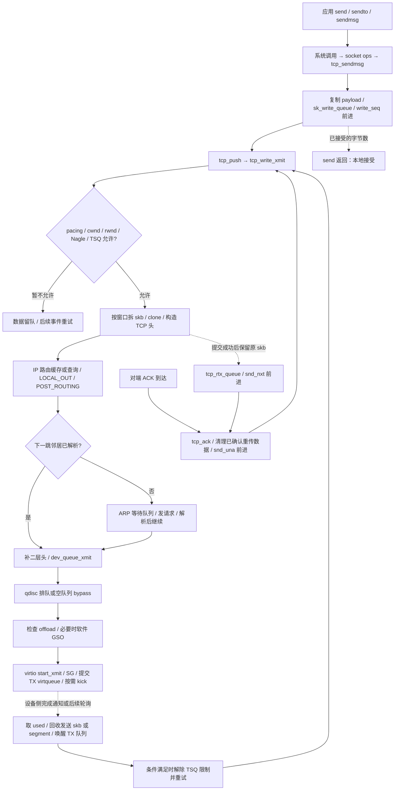

# 第 2 章：从 send() 到 virtio_net 发送与回收

本章沿已建立 IPv4/TCP 连接的一次普通复制发送，追踪字节进入 TCP、分段与窗口判断、IP/邻居输出、qdisc、virtqueue 提交和资源回收。前置：[第 1 章](01-tcp-receive-path.md)；下一章：[连接生命周期](03-tcp-connection-lifecycle.md)。重传、拥塞算法的内部机制见[第 4 章](04-tcp-reliability-performance.md)。

- 源码：`/home/chen/code/linux-lab/src/linux-6.18`；本轮执行 `git describe --always --dirty --tags` 得到 `v6.18`。
- HEAD：`7d0a66e4bb9081d75c82ec4957c50034cb0ea449`；核验日期：2026-10-01。
- `文件:行号` 相对源码根目录，指函数定义或明确标出的调用点；仅适用于这个提交。
- 范围：x86_64、IPv4、已建立普通 TCP、virtio_net、普通 NAPI。主线排除 zerocopy、splice、TLS、隧道和 TCP Fast Open。
- 代码事实来自本地源码；设计动机标为推断。**实验未在 QEMU 实测，输出仅示意形状。**

## 1. 总览图：三个“完成”边界



`send()` 返回、设备 TX 完成、对端 TCP 确认不是同一个事件，彼此之间也不能假定一个固定的观测顺序：

| 边界 | 实际表示什么 | 不代表什么 |
|---|---|---|
| `send()` 返回正数 | 本次调用接受了这些字节；普通复制路径已取得内核持有的数据。 | 不保证已到驱动、已上网或已收到 ACK；也可能只接受部分字节。 |
| 驱动取回 TX 完成 | 设备侧不再需要这个发送 buffer，可归还描述符和相关引用。 | 不表示对端 TCP 已收到，更不表示对端应用已读取。 |
| TCP 收到有效累计 ACK | TCP 可以推进确认边界并释放相应重传数据。 | 不表示对端应用已经消费数据。 |

图中异步虚线不是 C 函数调用。比如 ARP 排队、qdisc 延后运行、设备完成、ACK 处理都可能发生在另一段调用栈。virtio guest 的 used 完成仅是 guest/设备后端协议边界；QEMU/vhost 后端实际出包过程**未确认**。

## 2. 调用链，按真实执行阶段推进

### 2.1 send API：x86_64 的系统调用入口与复制入队

本树有通用 `SYSCALL_DEFINE4(send, ...)`，但 x86_64 原生 syscall 表没有独立 `send` 项；有 44 号 `sendto` 与 46 号 `sendmsg`（`arch/x86/entry/syscalls/syscall_64.tbl:56`）。用户库如何实现 `send()` 不在本仓库中，**未确认**；实验用 `strace` 确定实际入口。不要从通用 C 定义推断每个架构都暴露相同 syscall。

| 步骤 | 函数 + 源码位置 | 做什么 |
|---|---|---|
| sendto 系统调用 | `SYSCALL_DEFINE6(sendto, ...)` — `net/socket.c:2247` → `__sys_sendto()` — `:2209` | 导入用户 buffer 为 `iov_iter`，查 fd，处理地址与非阻塞标志；导入 iterator 本身还没有复制整个 payload。 |
| 安全检查和分发 | `__sock_sendmsg()` — `net/socket.c:737` → `sock_sendmsg_nosec()` — `:725` | 先做 LSM 检查，再调用 `sock->ops->sendmsg`。此路径不要求先调用公开包装 `sock_sendmsg()`。 |
| 第一张 ops | `inet_stream_ops` 的 `.sendmsg = inet_sendmsg` — `net/ipv4/af_inet.c:1070` | IPv4 stream socket 绑定到 INET 分发层。 |
| INET 分发 | `inet_sendmsg()` — `net/ipv4/af_inet.c:846` | 准备 socket，调用 `sk->sk_prot->sendmsg`。 |
| 第二张 ops | `tcp_prot` 的 `.sendmsg = tcp_sendmsg` — `net/ipv4/tcp_ipv4.c:3502` | 普通 TCP 协议对象绑定到 TCP 实现。 |
| socket 串行化 | `tcp_sendmsg()` — `net/ipv4/tcp.c:1408` | `lock_sock()` 后调用 locked 实现，结束时 `release_sock()`；后者可能处理第 1 章的 backlog。 |
| 复制循环 | `tcp_sendmsg_locked()` — `net/ipv4/tcp.c:1078` | 检查连接与错误，向发送队尾追加字节；内存不足时等待或按非阻塞规则退出。 |
| 包装大小 | `tcp_send_mss()` — `net/ipv4/tcp.c:961` | 同时计算有效 MSS 和 skb 的 `size_goal`；后者可以覆盖多个 MSS。 |
| 分配描述符 | `tcp_stream_alloc_skb()` — `net/ipv4/tcp.c:907` | 分配带头部预留空间的 skb，设置 `CHECKSUM_PARTIAL`。 |
| 建立待发送记录 | `tcp_skb_entail()` — `net/ipv4/tcp.c:701` | 用当前 `write_seq` 初始化 seq/end_seq，挂 `sk_write_queue` 并记账。 |
| 普通复制调用点 | `tcp_sendmsg_locked()` — `net/ipv4/tcp.c:1272` | 调 `skb_copy_to_page_nocache()` 将 iterator 数据复制到 page frag。 |
| 复制 helper | `skb_copy_to_page_nocache()` — `include/net/sock.h:2288` | 复制后增加 skb 长度、socket 发送内存记账；调用者更新 frags 与 `write_seq/end_seq`。 |
| 等空间 | `tcp_sendmsg_locked()` — `net/ipv4/tcp.c:1366` | 调 `sk_stream_wait_memory()`；已复制一部分时可以返回部分成功，不能把所有错误都理解成零字节接受。 |

与 DPDK 的对应关系是：应用传入的是字节流，TCP 在这里决定如何组织成 skb/page frags。一次 `send(64 KiB)` 不保证生成一个 skb，更不保证恰好一个设备 descriptor 或一个 TCP 线包。

复制成功时推进 `write_seq`；真正提交新数据时推进 `snd_nxt`；确认到达时推进 `snd_una`。这三个游标把“应用写入”“TCP 已发送”“TCP 已确认”分开。比较序号要采用 TCP 的回绕规则，不能把普通无符号大小比较替换进协议逻辑。

### 2.2 TCP 何时可以发送，发多少

| 阶段 | 函数 + 源码位置 | 做什么 |
|---|---|---|
| 发起 push | `tcp_push()` — `net/ipv4/tcp.c:745` | 处理 `MSG_MORE`、push 标志与 autocork 条件，可能暂留数据；否则继续。 |
| 待发送入口 | `__tcp_push_pending_frames()` — `net/ipv4/tcp_output.c:3172` | 调 `tcp_write_xmit()`；完全发不出去且需要探测时检查 probe timer。 |
| 发送循环 | `tcp_write_xmit()` — `net/ipv4/tcp_output.c:2901` | 从发送队头取 skb，依次核对 pacing、cwnd、rwnd、Nagle/TSO 延后、TSQ 等限制。 |
| pacing | `tcp_pacing_check()` — `net/ipv4/tcp_output.c:2728` | TCP 内部 pacing 分支决定当前是否应等待发送时刻；具体行为也受 qdisc 能力影响。 |
| 拥塞配额 | `tcp_cwnd_test()` — `net/ipv4/tcp_output.c:2238` | 用 cwnd 减去估计在途段数，并限制本次 GSO skb 的段配额。 |
| 对端窗口 | `tcp_snd_wnd_test()` — `net/ipv4/tcp_output.c:2295` | 先确认至少第一个 MSS 大小的数据能放进接收方通告窗口。 |
| Nagle / 批量延后 | `tcp_nagle_test()` — `net/ipv4/tcp_output.c:2272`；`tcp_tso_should_defer()` — `:2366` | 分别处理单段小包与多段聚合 skb 是否应继续等待。 |
| 确定可发长度 | `tcp_mss_split_point()` — `net/ipv4/tcp_output.c:2204` | 综合 MSS、段配额、窗口右边界及尾段 Nagle 规则给出可发送字节数。 |
| 拆待发送 skb | `tso_fragment()` — `net/ipv4/tcp_output.c:2314` | 本次只能发一部分时，将剩余字节放到新的待发送 skb；这还不是最终逐线包分段。 |
| 控制下层积压 | `tcp_small_queue_check()` — `net/ipv4/tcp_output.c:2770` | 按 `sk_wmem_alloc`、pacing rate 等约束单连接在 qdisc/设备中的占用，必要时标记 TSQ throttled。 |
| 构造并提交 | `tcp_transmit_skb()` — `net/ipv4/tcp_output.c:1643` → `__tcp_transmit_skb()` — `:1447` | 普通新数据传 `clone_it=1`；构造 TCP 头、校验和描述和 GSO 参数，然后进入 IP。 |
| 原 skb 转入重传树 | `tcp_event_new_data_sent()` — `net/ipv4/tcp_output.c:69` | 成功提交后从 `sk_write_queue` 摘除原 skb，插入 `sk->tcp_rtx_queue`，推进 `snd_nxt` 并记在途段数。 |

本版本不是“已发与未发 skb 一直共用同一发送链表”的布局：**待发送是 `sk_write_queue`，已发送未累计确认的数据在 `tcp_rtx_queue` 红黑树**。发送给下层的是 clone；若数据已被 clone，代码也可能用 `pskb_copy()` 独立复制线性区，非线性页片段仍共享；对应实现 `__pskb_copy_fclone()` 在 `net/core/skbuff.c:2159`。保留重传材料不等于每次发送复制全部 payload。

两个窗口的单位不同：

```text
对端窗口右边界 = snd_una + snd_wnd             // 字节序号空间
拥塞窗口额度   = snd_cwnd - 估计在途段数       // TCP 段计数
估计在途段数   = packets_out - (sacked_out + lost_out) + retrans_out
```

证据：`tcp_wnd_end()`（`include/net/tcp.h:1450`）、`tcp_left_out()`（`:1366`）、`tcp_packets_in_flight()`（`:1385`）。`tcp_cwnd_test()` 还施加半 cwnd 等批量限制，所以不能把上面概念公式当成完整发包算法。恢复状态下的在途估计也不是简单的 `snd_nxt - snd_una`。

### 2.3 IP 输出：路由、netfilter、MTU

| 顺序 | 函数 + 源码位置 | 做什么 |
|---|---|---|
| IPv4 回调证据 | `ipv4_specific` 的 `.queue_xmit = ip_queue_xmit` — `net/ipv4/tcp_ipv4.c:2484` | `icsk_af_ops` 决定 TCP 提交到 IPv4 的具体实现。 |
| TCP 校验和准备 | `tcp_v4_send_check()` — `net/ipv4/tcp_ipv4.c:675` | 由发送 TCP 头代码调用，准备 IPv4 TCP 校验和相关状态。 |
| IP 发送入口 | `ip_queue_xmit()` — `net/ipv4/ip_output.c:546` → `__ip_queue_xmit()` — `:463` | 检查 socket 路由缓存，必要时查路由，然后构造 IP 头。 |
| 缓存未命中 | `ip_route_output_flow()` — `net/ipv4/route.c:2929` | 为 flow 查询输出路由；调用点在 `net/ipv4/ip_output.c:496`，不是每次都重做查询。 |
| LOCAL_OUT | `ip_local_out()` — `net/ipv4/ip_output.c:125` → `__ip_local_out()` — `:102` | 填 IP 总长/头校验和，进入 `NF_INET_LOCAL_OUT`；允许继续时走 dst 输出。 |
| 路由动作分发 | `dst_output()` — `include/net/dst.h:462` | 调路由项输出回调；普通本地 IPv4 外发进入 `ip_output()`。 |
| POST_ROUTING | `ip_output()` — `net/ipv4/ip_output.c:428` | 设置输出设备，进入 `NF_INET_POST_ROUTING`，随后调用 finish output。 |
| egress 与 MTU | `ip_finish_output()` — `net/ipv4/ip_output.c:318` → `__ip_finish_output()` — `:297` | 先处理 cgroup egress BPF；再按 GSO/MTU 决定下行或 IP 分片。 |
| GSO 的 MTU 检查 | `ip_finish_output_gso()` — `net/ipv4/ip_output.c:249` | 若每个未来 segment 满足 MTU，直接保留大 skb；超出时走软件分段及必要的 IP 分片分支。 |
| 到邻居 | `ip_finish_output2()` — `net/ipv4/ip_output.c:200` | 保证二层 headroom，通过路由的下一跳取得邻居并输出。 |

**TCP 分段、软件 GSO、IPv4 分片是三个层次。** 正常 TCP 用 MSS 控制线上的段大小；GSO skb 可以远大于 MTU，因为它描述多个未来 TCP 段。IP 层检查的是这种描述是否合理，不能看到 `skb->len > MTU` 就断言网络上发了一个超 MTU 帧。

`LOCAL_OUT`、`POST_ROUTING` 是挂载点：未配置 hook 时不会凭空出现复杂过滤处理；存在 hook 时可能丢弃、排队或修改包，不能把接下来的箭头当作无条件执行。

### 2.4 邻居子系统：解析下一跳，必要时等待 ARP

| 分支 | 函数 + 源码位置 | 做什么 |
|---|---|---|
| 选下一跳邻居 | `ip_neigh_for_gw()` — `include/net/route.h:412` | 按 route 选择网关或直连目的地址的邻居；本章选择 IPv4 下一跳分支。 |
| 公共输出 | `neigh_output()` — `include/net/neighbour.h:534` | 已连接且缓存头可用时走 `neigh_hh_output()`，否则调邻居的 output 回调。 |
| 缓存二层头 | `neigh_hh_output()` — `include/net/neighbour.h:494` | 复制缓存的链路层头，最终调 `dev_queue_xmit()`。 |
| 解析分支 | `neigh_resolve_output()` — `net/core/neighbour.c:1575` | 触发邻居状态处理；无需等待时构造二层头并进入设备输出。 |
| 进入等待 | `__neigh_event_send()` — `net/core/neighbour.c:1200` | 未解析时把 skb 放进 `neigh->arp_queue`，启动探测；队列有字节限制并可丢包。 |
| ARP 请求 | `arp_solicit()` — `net/ipv4/arp.c:333` → `arp_send_dst()` — `:301` → `arp_xmit()` — `:660` | 生成 ARP 请求并经 ARP 输出 hook 发出；是新 ARP 包，不是把 TCP payload 塞进 ARP。 |
| 解析成功后继续 | `neigh_update()` — `net/core/neighbour.c:1517` → `__neigh_update()` — `:1328` | 状态变为可用时，在 `:1471` 起排空等待队列并重新调用 output。 |

远程目的地址的 MAC 通常不是本机 ARP 查询对象；默认路由场景查询的是下一跳网关。等待 ARP 期间，本次 TCP 下层提交可能已经返回成功，原数据也已进入重传树；后续下层丢包由 TCP 可靠性机制处理。这解释了“应用 send 已返回，但抓不到 TCP 数据线包”的一种原因。

### 2.5 qdisc 到驱动：排队、绕过和软件分段

| 顺序 / 分支 | 函数 + 源码位置 | 做什么 |
|---|---|---|
| 二层输出公共入口 | `dev_queue_xmit()` — `include/linux/netdevice.h:3363` → `__dev_queue_xmit()` — `net/core/dev.c:4670` | 执行启用的 netfilter egress、tc egress，再选择 TX 队列和该队列的 qdisc。 |
| 队列选择 | `netdev_core_pick_tx()` — `net/core/dev.c:4621` | 进入具体设备/通用选队列逻辑；不能假定总在 queue 0。 |
| 有 qdisc enqueue | `__dev_xmit_skb()` — `net/core/dev.c:4124` | 可先排队再运行；若支持 bypass、队列空且取得运行权，可直接发。 |
| 入队 | `dev_qdisc_enqueue()` — `net/core/dev.c:4112` | 调 `q->enqueue`，具体排队和丢包策略由 qdisc 实现决定。 |
| 出队循环 | `__qdisc_run()` — `net/sched/sch_generic.c:415` → `qdisc_restart()` — `:393` | 在配额内取包发送；配额用尽后按 qdisc 类型安排继续执行。 |
| 直接交驱动前 | `sch_direct_xmit()` — `net/sched/sch_generic.c:319` | 校验输出 skb，取得 TX 锁；驱动忙时重新入队。 |
| 能力校验 | `validate_xmit_skb()` — `net/core/dev.c:3977` | 设备不能接收当前 GSO 表示时调 `skb_gso_segment()`；必要时线性化或完成 checksum。 |
| skb 列表发送 | `dev_hard_start_xmit()` — `net/core/dev.c:3851` → `xmit_one()` — `:3834` | 逐个处理软件 GSO 后的 skb，记录 net tracepoint，调用驱动。 |
| 驱动 ops | `netdev_start_xmit()` — `include/linux/netdevice.h:5251` → `__netdev_start_xmit()` — `:5243` | 最终调 `dev->netdev_ops->ndo_start_xmit`。 |
| virtio 注册证据 | `.ndo_start_xmit = start_xmit` — `drivers/net/virtio_net.c:6270` | 确认本章实际驱动回调。 |
| 异步重跑 qdisc | `__netif_schedule()` — `net/core/dev.c:3374` → `__netif_reschedule()` — `:3360` | 将 qdisc 放本 CPU output list，raise `NET_TX_SOFTIRQ`。 |
| NET_TX action | `net_tx_action()` — `net/core/dev.c:5652` | 处理该 CPU 的待回收 skb 和待运行 qdisc。 |

**不是每次发送都需要 NET_TX_SOFTIRQ。** 应用系统调用栈可以直接走到驱动；队列不空、预算耗尽或设备恢复可发送时，才可能看到另一次异步执行。`noqueue` 的无 enqueue 分支与“有 qdisc 但空队列 bypass”也不是同一种情况；前者在 `__dev_queue_xmit()` 内另行处理，常见于软件设备。

发送 skb 的描述符身份可能在软件分段时改变。`validate_xmit_skb()`（`net/core/dev.c:3977`，关键调用 `:3997` / `:4001`）生成 segment 列表并消费原大 skb；`tcp_gso_segment()`（`net/ipv4/tcp_offload.c:132`，`:217` 起）把 `tcp_wfree`/socket 关联交给这些 segment，并调整 `sk_wmem_alloc`。驱动完成时释放实际收到的发送 skb；TCP 重传树中的原 skb 仍按 ACK 生命周期管理。不能要求同一个发送 skb 地址从 TCP 一直保留到每次设备完成。

TSO/GSO 的边界在这里变得具体：如果设备认可相应能力，大 skb 连同 `gso_size/gso_segs` 继续下传；否则核心层软件分段。virtio 的“设备能力”是和后端协商的能力，不能据此断言一定由物理 NIC 执行 TSO。

### 2.6 virtio TX：提交描述符与完成回收

| 阶段 | 函数 + 源码位置 | 做什么 |
|---|---|---|
| 驱动发送 | `start_xmit()` — `drivers/net/virtio_net.c:3369` | 按 skb queue mapping 找 send_queue；处理旧完成、提交新包、流控与按需 kick。 |
| skb 转 virtio SG | `xmit_skb()` — `drivers/net/virtio_net.c:3315` | 从 skb 生成 virtio header 的 checksum/GSO 描述，构造线性区与 frags 的 SG。 |
| 加到 virtqueue | `virtnet_add_outbuf()` — `drivers/net/virtio_net.c:571` → `virtqueue_add_outbuf()` — `drivers/virtio/virtio_ring.c:2337` | 提交设备可读 buffer；保存 skb token 供完成时取回。 |
| 通知设备调用点 | `start_xmit()` — `drivers/net/virtio_net.c:3414` | 结合 `xmit_more`、队列状态、BQL 与 event suppression，按需 `virtqueue_notify()`；每 skb 不一定一次通知。 |
| 队列流控 | `tx_may_stop()` — `drivers/net/virtio_net.c:1107` | descriptor 不足时停止对应 TX queue；完成回收后可以唤醒。 |
| TX callback 注册 | `virtnet_find_vqs()` 内 — `drivers/net/virtio_net.c:6498` | 设置 TX callback 为 `skb_xmit_done`。 |
| 设备完成通知 | `vring_interrupt()` — `drivers/virtio/virtio_ring.c:2693` → `skb_xmit_done()` — `drivers/net/virtio_net.c:778` | 中断 handler 调 callback；callback 抑制后续通知，并调度 TX NAPI 或唤醒子队列。 |
| TX NAPI 回收 | `virtnet_poll_tx()` — `drivers/net/virtio_net.c:3255` | 普通 skb 分支调 `free_old_xmit()`，有空间时 wake TX queue，并完成 NAPI/复查竞态。 |
| RX 顺带回收 | `virtnet_poll_cleantx()` — `drivers/net/virtio_net.c:3062` | RX poll 可在取得 TX queue 锁后顺带回收对应发送队列。 |
| 回收封装 | `free_old_xmit()` — `drivers/net/virtio_net.c:1078` → `virtnet_free_old_xmit()` — `:634` → `__free_old_xmit()` — `:590` | 从 `virtqueue_get_buf()` 取回完成 token，普通 skb 调 `napi_consume_skb()`，更新完成记账。 |
| 恢复发送队列 | `netif_tx_wake_queue()` — `net/core/dev.c:3402` | 清驱动停止位，必要时安排 qdisc 继续发送。 |

`napi_tx` 在源码中默认 true（`drivers/net/virtio_net.c:33`），TX poll 注册在 `:6560`。运行配置仍应记录：TX NAPI 可被关闭。关闭时 `start_xmit()` 在下次提交前回收旧完成，`skb_xmit_done()` 主要负责唤醒子队列，而且提交后调用 `skb_orphan()` 提前解除 socket 所有权。

因此，不能写成“每次 TX 中断直接释放一个 skb”。通知可能被抑制；一次 poll 能回收多个完成；RX poll 能做 TX 清理；设备通知与本地 skb 析构之间也不总是一对一。

`__tcp_transmit_skb()` 设置数据 skb 的 destructor 为 `tcp_wfree()`（`net/ipv4/tcp_output.c:1535`）。其释放路径减少 `sk_wmem_alloc`；若先前受 TSQ 限制，会经 per-CPU `tsq_work` 安排发送重试：

```text
tcp_wfree()             net/ipv4/tcp_output.c:1350
  → queue_work(system_bh_wq, ...)
  → tcp_tsq_workfn()    net/ipv4/tcp_output.c:1261
  → tcp_tsq_handler()   net/ipv4/tcp_output.c:1246
  → tcp_tsq_write()     net/ipv4/tcp_output.c:1228
  → tcp_write_xmit()
```

这里是本版本的 **BH workqueue**，不能套旧资料的 tasklet 函数名。socket 被用户占用时，handler 标记延后处理。上述 non-NAPI `skb_orphan()` 分支还说明：看到 `tcp_wfree()` 本身不够证明设备已完成。

对端 ACK 处理是另一条链：`tcp_ack()`（`net/ipv4/tcp_input.c:3983`）调用 `tcp_clean_rtx_queue()`（`:3382`）清理确认过的重传数据。设备释放它持有的发送 skb，与 TCP 释放重传持有者分开；共享页必须等相关引用全部结束才能复用。

物理网卡对应位置：

| 驱动 | 发送与完成入口 | 与 virtio 的差别 |
|---|---|---|
| igb | `igb_xmit_frame()` — `drivers/net/ethernet/intel/igb/igb_main.c:6631` → `igb_xmit_frame_ring()` — `:6529` → `igb_tx_map()` — `:6276`；`igb_clean_tx_irq()` — `:8330` | 映射 skb 线性区/分片到 DMA 地址，填写硬件 TX descriptor 并写 tail；清理时检查 DD、归还映射和 skb。由 `igb_poll()`（`:8281`）调用清理。 |
| ice | `ice_start_xmit()` — `drivers/net/ethernet/intel/ice/ice_txrx.c:2701` → `ice_xmit_frame_ring()` — `:2586` → `ice_tx_map()` — `:1833`；`ice_clean_tx_irq()` — `:269` | 同样有硬件 descriptor、DMA map/unmap、完成位和 tail 通知，具体格式/offload 参数不同；由 `ice_napi_poll()`（`:1702`）清理。 |

## 3. 关键数据结构

| 对象 / 字段 | 本地定义位置 | 本章如何使用 |
|---|---|---|
| `sock::sk_write_queue / tcp_rtx_queue` | `include/net/sock.h:477` | 未发送 skb 链表 / 已发送 skb 重传红黑树；不是驱动 ring。 |
| `sk_wmem_queued / sk_wmem_alloc / sk_sndbuf` | `include/net/sock.h:472`、`:510` | 持久发送队列记账 / 下层发送引用相关记账 / 发送缓冲限制；都不能直接解释成纯 payload 字节。 |
| `sk_pacing_rate` | `include/net/sock.h:485` | 字节每秒的 pacing rate，也是 TSQ 限制的输入。 |
| `tcp_sock::write_seq / snd_nxt / snd_una` | `include/linux/tcp.h:272`、`:306` | 已接受的尾序号 / 已发送尾序号 / 待累计确认起点。 |
| `snd_wnd / mss_cache / snd_cwnd` | `include/linux/tcp.h:226` | 对端通告窗口、有效 MSS 缓存、拥塞窗口；单位与作用不同。 |
| `packets_out / sacked_out / lost_out / retrans_out` | `include/linux/tcp.h:310`、`:230`、`:248` | 在途与恢复记账，按逻辑 TCP 段计算，不等于 skb 个数。 |
| `tcp_skb_cb::seq / end_seq / tcp_gso_segs / tcp_gso_size` | `include/net/tcp.h:1023` | TCP 队列里的序号范围和分段记账；`end_seq` 还计入 SYN/FIN 占用。 |
| `skb_shared_info::gso_size / gso_segs / gso_type / frags` | `include/linux/skbuff.h:593` | 下层理解大 skb 如何分段，以及 payload 的散布布局。 |
| `neighbour::nud_state / ha / hh / arp_queue / output` | `include/net/neighbour.h:138` | 邻居可用性、链路地址/缓存头、等待解析的包和输出回调。 |
| `Qdisc::enqueue / dequeue / flags / q` | `include/net/sch_generic.h:73` | 排队策略与运行状态；bypass 由能力和当前队列状态共同决定。 |
| virtio `send_queue::vq / sg / napi` | `drivers/net/virtio_net.c:302` | 设备队列、SG 临时数组与完成轮询对象。 |

## 4. 为什么这样设计

以下是结合实现的设计推断，而非作者原话。

1. **把接受字节与设备发送分开，才能承受背压。** 应用可以先把数据交给 TCP；cwnd、对端窗口、ARP 或驱动 ring 阻塞时，队列保存进度。三个序号游标让重试不依赖某次系统调用仍在运行。
2. **重传持有者与设备持有者分开，才能共享 payload。** TCP 需要保存字节直到确认，设备只需保存到其读取完成。clone 与页引用让两种生命周期独立，不必为每一次初传/重传全量复制。
3. **多个 MSS 合成 skb，降低逐包开销。** TCP、IP、qdisc 和驱动可摊薄函数调用、分配、锁与通知成本；同时 `gso_segs` 让拥塞控制仍按逻辑 TCP 段记账，不能把一个 64 KiB skb 当一个 MSS。
4. **cwnd、rwnd、TSQ、BQL 分别约束不同瓶颈。** cwnd 面向网络拥塞，rwnd 面向对端接收空间，TSQ 约束单连接下层积压，驱动/BQL 面向本地设备排队。只有 descriptor 可用远不足以判断 TCP 是否该发。
5. **qdisc 和驱动使用 ops，便于独立扩展。** TCP 不必了解 virtio/igb/ice 的 ring 格式；调度策略也不必写进 TCP。代价是读代码时必须追踪函数指针赋值，不能只看静态调用图。
6. **批量通知和多路径回收减少中断成本。** 发送可连续提交，回收可按 NAPI 批量进行；恢复通知后复查队列，处理“准备休眠时又完成”的竞态。

## 5. QEMU 验证实验

复用第 1 章 §5.1 的 virtio 启动与网络配置。这里使用有 Python 3、ftrace 的完整 guest；bpftrace/ethtool 为第二个实验的附加工具。必须运行这份源码编出的 guest 内核，不能用宿主内核追踪结果替代。当前学习环境仍需准备第 1 章所述的 initramfs/用户空间；本轮未构建或启动 QEMU。

### 5.1 function_graph：用户发送与设备回收属于不同调用栈

专用 guest 的 root shell 执行。使用 tracefs 根目录，避免与其他 tracing 会话共享设置。记录 `uname -r`、`ethtool -i eth0`、`ethtool -k eth0`、`tc -s qdisc show dev eth0`；接口名以实际环境为准。

```sh
mount -t tracefs tracefs /sys/kernel/tracing 2>/dev/null || true
T=/sys/kernel/tracing
cat "$T/available_tracers"
test -r "$T/available_filter_functions" || exit 1
awk '$1 == "tcp_sendmsg" { found=1 } END { exit !found }' \
    "$T/available_filter_functions" || { echo "tcp_sendmsg 不可追踪"; exit 1; }
echo 0 > "$T/tracing_on"
echo 0 > "$T/events/enable"
echo function_graph > "$T/current_tracer"
# 清除前轮遗留过滤；static helper 可能内联，只选实际可追踪的根。
: > "$T/set_graph_function"
: > "$T/set_ftrace_filter"
: > "$T/set_ftrace_pid"
GRAPH_ROOTS=0
for f in tcp_sendmsg net_tx_action virtnet_poll_tx virtnet_poll_cleantx \
         skb_xmit_done tcp_tsq_workfn; do
    if awk -v n="$f" '$1 == n { found=1 } END { exit !found }' \
        "$T/available_filter_functions"; then
        echo "$f" >> "$T/set_graph_function"
        GRAPH_ROOTS=$((GRAPH_ROOTS + 1))
    else
        echo "not traceable: $f"
    fi
done
test "$GRAPH_ROOTS" -gt 0 || { echo "没有可用 graph 根"; exit 1; }
echo 20 > "$T/max_graph_depth"
echo funcgraph-proc > "$T/trace_options"
echo 1 > "$T/events/net/net_dev_start_xmit/enable"
echo 1 > "$T/events/net/net_dev_xmit/enable"
echo 1 > "$T/events/sock/sock_send_length/enable"
echo 1 > "$T/events/napi/napi_poll/enable"
: > "$T/trace"
echo 1 > "$T/tracing_on"

cat > /tmp/ch2-send.py <<'PY'
import socket, time
with socket.socket() as ls:
    ls.setsockopt(socket.SOL_SOCKET, socket.SO_REUSEADDR, 1)
    ls.bind(('0.0.0.0', 8080))
    ls.listen(1)
    c, peer = ls.accept()
    with c:
        c.settimeout(15)
        for _ in range(16):
            c.sendall(b'T' * 65536)
            time.sleep(0.02)
        print('sendall accepted 1048576 bytes locally', flush=True)
        reply = b''
        while len(reply) < 2:
            data = c.recv(2 - len(reply))
            if not data:
                raise RuntimeError('peer closed before application reply')
            reply += data
        assert reply == b'ok'
        print('peer application reported receive completion', flush=True)
PY
python3 /tmp/ch2-send.py
```

宿主另一个终端运行；连接的是第 1 章的 hostfwd，经过 guest virtio：

```bash
python3 - <<'PY'
import socket
with socket.create_connection(('127.0.0.1', 18080), timeout=15) as s:
    n = 0
    while n < 1048576:
        data = s.recv(min(65536, 1048576 - n))
        if not data:
            raise RuntimeError(f'early EOF at {n}')
        n += len(data)
    s.sendall(b'ok')
    print('received', n)
PY
```

guest 程序退出后保存并清理：

```sh
echo 0 > "$T/tracing_on"
cat "$T/trace" > /tmp/ch2-tx.trace
echo 0 > "$T/events/enable"
echo nofuncgraph-proc > "$T/trace_options"
echo nop > "$T/current_tracer"
: > "$T/set_graph_function"
echo 0 > "$T/max_graph_depth"
grep -E 'tcp_sendmsg|tcp_write_xmit|ip_queue_xmit|start_xmit|virtnet_poll|free_old_xmit|sock_send_length' /tmp/ch2-tx.trace
```

预期能整理出以下片段，缩进和中间 helper 会受编译、ARP、qdisc、offload 影响。若 trace 头部 entries 表明环形缓冲发生覆盖，可减小流量或在重跑前提高 `buffer_size_kb`，不能用缺失片段证明某条路径从未执行：

```text
python3 → tcp_sendmsg → tcp_sendmsg_locked → tcp_push → tcp_write_xmit
          → __tcp_transmit_skb → ip_queue_xmit → ... → start_xmit
sock_send_length: ... length = 65536, error = 0 ...
... 另一段调用栈 ...
virtnet_poll_tx → free_old_xmit → ...
或 virtnet_poll_cleantx → free_old_xmit → ...
```

`net_dev_xmit ... rc=0` 记录的是驱动发送回调返回值，**不是 TX completion tracepoint**（定义在 `include/trace/events/net.h:72`）。`sock_send_length` 记录本次协议 send 的返回值（`include/trace/events/sock.h:298`），不能当 ACK 字节数。`sendall()` 也可能在内部做多次 send，输出不保证总是每行 65536。

可选：关闭 graph 后用 `strace -e trace=sendto,sendmsg,write python3 /tmp/ch2-send.py` 重跑一次，确定用户库实际用哪个 syscall。不要依赖进程 PID 过滤来找 TX 完成，因为回收可能在 softirq 上下文。

### 5.2 bpftrace：观察交给驱动的是大 GSO skb 还是普通段

在 guest 新终端先检查事件字段，再开始追踪；另两个终端重跑上面的 server/client。事件定义已核对 `include/trace/events/net.h:14`。

```sh
bpftrace -lv 'tracepoint:net:net_dev_start_xmit'
bpftrace -e '
tracepoint:net:net_dev_start_xmit
/str(args->name) == "eth0"/
{
  printf("len=%u data_len=%u gso_size=%u gso_segs=%u queue=%u\n",
         args->len, args->data_len, args->gso_size,
         args->gso_segs, args->queue_mapping);
}'
```

Ctrl-C 停止。预期大数据发送中可能出现 `len=... gso_size=1448 gso_segs=...`，也可能有 `gso_size=0 gso_segs=1` 等普通 skb；这里的数字**不是固定值**，取决于 MSS/options、窗口、协商和批量大小。`len` 包含当时 skb 已有的头部，不等于应用写入大小。

可做受控对比：在这台专用 guest 记录 `ethtool -k eth0` 的原始 TSO/GSO 设置，执行 `ethtool -K eth0 tso off gso off` 后重跑，并按记录恢复原值；命令若报告不支持，保留该事实。预期交给驱动的多段 GSO skb 减少/消失；不要要求所有事件都有数据，因为纯 ACK/SYN/FIN 也经过这里。一次大 `sendall()` 仍可以在 TCP 层被拆为多份，不应期待驱动收到完全相同数量的 skb。

两次实验都不能从 guest trace 推断后端物理 NIC 的线包形态；若要确认真正线包，需要在明确的后端观察点另做抓包，当前未验证。

## 6. 自测题

1. 应用 `send()` 返回 65536，但 `snd_nxt` 只推进了其中一部分，能否成立？剩余数据在哪里？
2. 一份 payload 已收到 virtio TX 完成，为什么还不能释放所有底层页？反过来看到 `tcp_wfree()` 是否足以证明 TX 完成？
3. 一个 skb 有 32 个 GSO 段，cwnd 剩 8 段、对端窗口只剩 4 MSS，能否一次交驱动发完？判断涉及哪些函数？
4. function_graph 没有出现 `net_tx_action()`，却出现 `start_xmit()`，是否说明 trace 丢了必经步骤？
5. `net_dev_xmit rc=0`、virtqueue used、对端 ACK、对端应用回复 `ok`，各自证明哪个层次的完成？

## 7. 对用户态协议栈的启示

1. **先实现明确的多阶段所有权。** 将待发送字节、未确认数据、设备持有的 mbuf/descriptor 分开；ACK 与 TX completion 各减自己的引用。即使单核轮询，也不能把这两种生命周期合并。
2. **发送调度器显式列出所有限制与重试来源。** 同时检查 rwnd/cwnd、重传状态、内存和设备额度；新 ACK、窗口更新、定时器、TX 回收都能触发重试。暂不能发必须保存原因和下一次唤醒条件。
3. **先保证 MSS 级协议记账，再引入 offload。** 没有 TSO 时用软件分段也能实现正确 TCP；启用 GSO/TSO 后仍按逻辑段数控制 cwnd，并验证 checksum、MTU、引用与 completion 语义。

<details>
<summary>自测答案</summary>

1. 可以。`tcp_sendmsg_locked()` 接受数据后推进 `write_seq`；窗口、pacing、TSQ 等可阻止全量发送，未发部分留在 `sk_write_queue`。已提交的部分进入 `tcp_rtx_queue` 并推进 `snd_nxt`。
2. 未确认数据仍由 TCP 重传记录持有；共享页要等所有引用结束。`tcp_wfree()` 也可能由 non-NAPI virtio 的 `skb_orphan()` 提前触发，所以它不是可靠的设备完成事件。
3. 不能原样发完。`tcp_cwnd_test()` 算段额度，`tcp_snd_wnd_test()` 检查第一段，`tcp_mss_split_point()` 算可发长度，必要时 `tso_fragment()` 拆 skb；另有批量、Nagle、pacing 等限制，不能直接认定必发 4 MSS。
4. 不是。空队列 bypass 或本次同步运行 qdisc 都可以从系统调用栈直接进入驱动；NET_TX softirq 是条件性续跑路径。
5. 分别是驱动回调接受/消费了 skb、设备侧归还 buffer、对端 TCP 确认数据、该实验的对端应用实际读完并主动回复。后两项不由设备完成替代，`rc=0` 也不保证线上发送成功。

</details>
