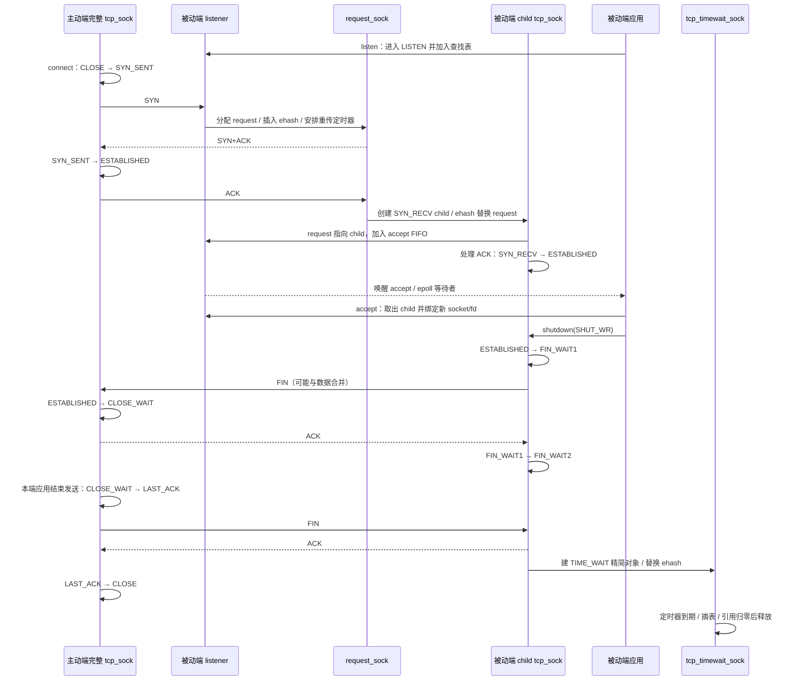

# 第 3 章：TCP 连接生命周期

本章把一个连接的对象变化与协议状态变化放在同一条时间线上：listener 接 SYN，request 保存握手状态，child 承担字节流，关闭后由精简对象保留必要的尾部状态。前置：[第 1 章](01-tcp-receive-path.md)与[第 2 章](02-tcp-send-path.md)。

- 源码：`/home/chen/code/linux-lab/src/linux-6.18`；`git describe --always --dirty --tags` = `v6.18`。
- HEAD：`7d0a66e4bb9081d75c82ec4957c50034cb0ea449`；核验日期：2026-10-01。
- `文件:行号` 相对此源码根目录，指函数定义起点或明确标出的调用点。字段、回调与分支均经本地源码核验。
- 主线：x86_64、IPv4、普通 TCP；不启用 TCP Fast Open、TCP_DEFER_ACCEPT、修复模式、认证扩展和 reuseport 迁移。重要例外单独说明。
- 代码事实与设计推断分开。**实验未在 QEMU 实测；预期输出只说明应观察到的形状。**

## 1. 总览图



这里主动建连的是 C，主动关闭的是 S。两个角色互相独立，不能把“客户端”永久等同于 TIME_WAIT 持有者。图中的两次 FIN 和相应 ACK 是协议事件；线上不保证恰好四个独立报文。

listener 一直保持 LISTEN。不是同一个 listener 先变 SYN_RECV 再变 ESTABLISHED；每个新连接有自己的 request 和 child。syncookie 分支在 SYN 后不保留 request，最终 ACK 才重建握手信息，见 2.5。

## 2. 调用链与状态推进

### 2.1 listen：准备监听对象与容量

| 步骤 | 函数 + 源码位置 | 一句话说明 |
|---|---|---|
| 1 | `__sys_listen()` — `net/socket.c:1932` | 从 fd 取得 socket 并进入 socket 层监听入口。 |
| 2 | `__sys_listen_socket()` — `net/socket.c:1918` | 用 `somaxconn` 截断 backlog，再调用 `sock->ops->listen`。 |
| 3，ops 证据 | `inet_stream_ops` — `net/ipv4/af_inet.c:1054` | `.listen = inet_listen`，`.accept = inet_accept`。 |
| 4 | `inet_listen()` — `net/ipv4/af_inet.c:232` | 持 socket 锁，检查类型和 socket 层状态。 |
| 5 | `__inet_listen_sk()` — `net/ipv4/af_inet.c:193` | 写 `sk_max_ack_backlog`；已在 LISTEN 时只调整监听参数。 |
| 6 | `inet_csk_listen_start()` — `net/ipv4/inet_connection_sock.c:1340` | 初始化 request 队列、进入 LISTEN，取得本地端口并调用协议 `.hash` 注册监听者。 |
| 7，协议表证据 | `tcp_prot` — `net/ipv4/tcp_ipv4.c:3485` | `.get_port = inet_csk_get_port`，`.hash = inet_hash`，`.accept = inet_csk_accept`。 |

`listen(backlog)` 不是预先分配 backlog 个完整连接。这里只建立监听状态、查找入口、计数与队列头；每个 request/child 在包到来后按需分配。

必须把“两条队列”翻译成本版本的实际组织：

```text
listener: 完整 tcp_sock，sk_state = TCP_LISTEN
  icsk_accept_queue.qlen / young —— 未完成 request 的计数
  各 request: TCP_NEW_SYN_RECV —— 分散在 ehash 桶 + 各自 rsk_timer

  icsk_accept_queue.rskq_accept_head —— req0 → req1 → ... → tail
                                          |       |
                                       req->sk req->sk
                                          |       |
                                        child0  child1
  sk_ack_backlog —— 等待 accept 的 child 数
```

半连接“队列”在此是逻辑集合。`reqsk_queue_hash_req()`（`net/ipv4/inet_connection_sock.c:1170`）直接调用 `inet_ehash_insert()`，并设置 `rsk_timer`；`request_sock_queue` 中没有一个普通 SYN FIFO 头。全连接队列才由 `rskq_accept_head/tail` 和 `request_sock::dl_next` 串起来，节点仍是 request，完整连接通过 `req->sk` 关联。

容量也不能套用旧版口诀：本版本 `inet_csk_reqsk_queue_is_full()`（`include/net/inet_connection_sock.h:286`）判断 `qlen > sk_max_ack_backlog`；`sk_acceptq_is_full()`（`include/net/sock.h:1070`）判断 `sk_ack_backlog > sk_max_ack_backlog`。都是源码中的严格 `>`，不是 `>=`。`tcp_max_syn_backlog` 仍在 `tcp_conn_request()`（`net/ipv4/tcp_input.c:7466` 附近）用于关闭 syncookies 时的额外保护条件；不能把它描述为这里唯一的 SYN 队列硬上限。并发到包也使 backlog 不宜理解为逐包严格准入的精确槽位数。

### 2.2 主动打开：connect 到第三次握手

| 步骤 | 函数 + 源码位置 | 一句话说明 |
|---|---|---|
| 1 | `__sys_connect()` / `__sys_connect_file()` — `net/socket.c:2108` / `:2085` | 拷贝地址并调用 socket 的 `.connect`。 |
| 2 | `inet_stream_connect()` / `__inet_stream_connect()` — `net/ipv4/af_inet.c:744` / `:626` | 持锁调用协议 `.connect`，随后处理阻塞等待或非阻塞 `EINPROGRESS`。 |
| 3 | `tcp_v4_connect()` — `net/ipv4/tcp_ipv4.c:224` | 选择路由与本地地址，写远端地址端口，进入 SYN_SENT，选择本地端口并加入连接哈希。 |
| 4，端口与哈希子过程 | `inet_hash_connect()` — `net/ipv4/inet_hashtables.c:1227` | 检查端口和四元组冲突，配合已有绑定完成主动连接注册。 |
| 5 | `tcp_connect()` — `net/ipv4/tcp_output.c:4249` | 初始化连接、创建 SYN skb、加入重传树、发送 SYN 并安排重传定时器。 |
| 6，接收 SYN+ACK | `tcp_v4_rcv()` → `tcp_v4_do_rcv()` — `net/ipv4/tcp_ipv4.c:2202` / `:1906` | 查到主动端完整 socket，非 ESTABLISHED 分支交给状态处理器。 |
| 7 | `tcp_rcv_state_process()` — `net/ipv4/tcp_input.c:6910` | SYN_SENT 分支调用专用握手处理。 |
| 8 | `tcp_rcv_synsent_state_process()` — `net/ipv4/tcp_input.c:6612` | 校验 ACK/SYN/RST、处理选项与 ACK，初始化接收序号和窗口。 |
| 9 | `tcp_finish_connect()` — `net/ipv4/tcp_input.c:6493` | 进入 ESTABLISHED，初始化传输与拥塞控制所需状态。 |
| 10，回到 8 | 调用点 — `net/ipv4/tcp_input.c:6739` 起 | 调 `sk_state_change` 通知连接完成，并发送或安排第三次 ACK。 |

第 5 步关键片段：

```c
/* net/ipv4/tcp_output.c:4321 起，省略中间时间戳/ECN初始化 */
tcp_init_nondata_skb(buff, sk, tp->write_seq, TCPHDR_SYN);
/* ... */
tcp_connect_queue_skb(sk, buff);
/* ... */
tcp_rbtree_insert(&sk->tcp_rtx_queue, buff);
```

SYN 消耗一个序号，也需要可靠发送。它不是发完即可释放的“控制包特例”。第 8 步确认 SYN 后更新 `snd_una`；接收 SYN 设置 `rcv_nxt = peer_isn + 1`。后面的数据发送与重传接着使用同一序号空间。

`connect()` 返回成功不代表对端应用已经调用 `accept()`。主动端收到有效 SYN+ACK 后已经可以进入 ESTABLISHED；对端还要收到最终 ACK 并完成其处理。第三次 ACK 的立即发送也不是无条件：`tcp_rcv_synsent_state_process()` 有结合待写数据、defer-accept 参数和 pingpong 模式安排 ACK 的分支（`:6745` 起）。普通实验不要把延迟到下一包的 ACK 误诊成漏发。

收到没有 ACK 的有效 SYN 时，主动端可进入 SYN_RECV，处理 simultaneous open（`net/ipv4/tcp_input.c:6783` 起）。因此完整 socket 的 SYN_RECV 不只来自被动 child。

### 2.3 被动打开前半程：SYN → request → SYN+ACK

| 步骤 | 函数 + 源码位置 | 一句话说明 |
|---|---|---|
| 1 | `tcp_v4_rcv()` — `net/ipv4/tcp_ipv4.c:2202` | 连接查找未命中已有连接时可命中 listener；LISTEN 分支进入 `tcp_v4_do_rcv`。 |
| 2 | `tcp_v4_do_rcv()` — `net/ipv4/tcp_ipv4.c:1906` | 对 LISTEN 执行 cookie 检查入口，再把普通 SYN 交给状态处理器。 |
| 3 | `tcp_rcv_state_process()` — `net/ipv4/tcp_input.c:6910` | LISTEN 只接受合适的 SYN；通过 `icsk_af_ops->conn_request` 分发。 |
| 4，回调证据 | `ipv4_specific` — `net/ipv4/tcp_ipv4.c:2483` | `.conn_request = tcp_v4_conn_request`，`.syn_recv_sock = tcp_v4_syn_recv_sock`。 |
| 5 | `tcp_v4_conn_request()` — `net/ipv4/tcp_ipv4.c:1735` | 排除广播/多播，再进入通用 TCP request 建立。 |
| 6 | `tcp_conn_request()` — `net/ipv4/tcp_input.c:7380` | 检查容量与 cookie 条件，解析 SYN 选项，准备初始序号、路由和接收窗口。 |
| 7 | `inet_reqsk_alloc()` — `net/ipv4/inet_connection_sock.c:923` | 分配小对象，将其查表状态设为 TCP_NEW_SYN_RECV。 |
| 8 | `inet_csk_reqsk_queue_hash_add()` → `reqsk_queue_hash_req()` — `net/ipv4/inet_connection_sock.c:1190` / `:1170` | 普通非 cookie 分支插入 ehash、启动 request 定时器、增加 listener 的半连接计数。 |
| 9，发送回调 | `tcp_request_sock_ipv4_ops` 的 `.send_synack` — `net/ipv4/tcp_ipv4.c:1732` | 确认 `af_ops->send_synack` 实际选择 `tcp_v4_send_synack`。 |
| 10 | `tcp_v4_send_synack()` — `net/ipv4/tcp_ipv4.c:1187` | 取得路由，构造 SYN+ACK，计算 IPv4 TCP 校验和，再交 IP 发送。 |
| 11，10 的子过程 | `tcp_make_synack()` / `ip_build_and_send_pkt()` — `net/ipv4/tcp_output.c:3887` / `net/ipv4/ip_output.c:151` | 前者组 TCP SYN+ACK 及选项，后者建立 IPv4 头并进入输出路径。 |
| 超时支线 | `reqsk_timer_handler()` — `net/ipv4/inet_connection_sock.c:1057` | 根据重试数、队列压力及 defer-accept 决定重发 SYN+ACK、重新安排计时或移除 request。 |

这里的两个 SYN_RECV 必须分开：协议还在等第三次 ACK；查找表里 request 的内部 `skc_state` 是 **TCP_NEW_SYN_RECV**。创建后的完整 child 才使用 **TCP_SYN_RECV**。两者共享 `sock_common` 前缀，但 request 不是拥有完整 TCP 发送接收队列的 `tcp_sock`。

### 2.4 最终 ACK：从 request 换成 child，然后 accept

| 步骤 | 函数 + 源码位置 | 一句话说明 |
|---|---|---|
| 1 | `tcp_v4_rcv()` 的 NEW_SYN_RECV 分支 — `net/ipv4/tcp_ipv4.c:2255` 起 | 查到 request，取得 listener 引用，再验证并处理最终 ACK。 |
| 2 | `tcp_check_req()` — `net/ipv4/tcp_minisocks.c:688` | 验证 ACK 序号、接收窗口、时间戳及 RST/SYN，必要时重发 SYN+ACK。 |
| 3 | `tcp_v4_syn_recv_sock()` — `net/ipv4/tcp_ipv4.c:1755` | 检查 accept 容量，创建 child，继承端口并尝试用 child 替换 request 的哈希位置。 |
| 4，3 的子过程 | `tcp_create_openreq_child()` → `inet_csk_clone_lock()` — `net/ipv4/tcp_minisocks.c:547` / `net/ipv4/inet_connection_sock.c:1219` | 克隆 listener 的配置，按 request 初始化 TCP 序号/选项；完整 child 初态为 SYN_RECV。 |
| 5，哈希交换 | `inet_ehash_nolisten()` → `inet_ehash_insert()` — `net/ipv4/inet_hashtables.c:738` / `:705` | 持 ehash 桶锁移除旧 request 并发布 child；失败者不能再取得该 request 的所有权。 |
| 6 | `inet_csk_complete_hashdance()` — `net/ipv4/inet_connection_sock.c:1425` | `own_req` 成功者撤销半连接计时/计数，并把 request 与 child 移入 accept 队列。 |
| 7，6 的子过程 | `inet_csk_reqsk_queue_add()` — `net/ipv4/inet_connection_sock.c:1400` | 设置 `req->sk = child`，链接 FIFO，增加 `sk_ack_backlog`。 |
| 8，回到收包入口 | `tcp_child_process()` — `net/ipv4/tcp_minisocks.c:977` | 在 child 上处理这个 ACK；SYN_RECV 状态变化后通知 listener 的 `sk_data_ready`。 |
| 9，8 的子过程 | `tcp_rcv_state_process()` — `net/ipv4/tcp_input.c:6910`；状态赋值 `:7028` | 再验证 ACK，初始化传输，child 进入 ESTABLISHED，可继续处理该段携带的数据。 |
| 10，应用另一条调用栈 | `__sys_accept4()` → `__sys_accept4_file()` → `do_accept()` — `net/socket.c:2050` / `:2011` / `:1951` | 准备新 socket、file 与 fd，经 `.accept` 取得协议层 child。 |
| 11 | `inet_accept()` → `inet_csk_accept()` — `net/ipv4/af_inet.c:776` / `net/ipv4/inet_connection_sock.c:663` | 空队列时等待，否则取 FIFO 首项并返回 `req->sk`。 |
| 12 | `reqsk_queue_remove()` — `include/net/request_sock.h:210` | 从 accept FIFO 脱链，减少 `sk_ack_backlog`。 |
| 13 | `__inet_accept()` — `net/ipv4/af_inet.c:756` | 将 child graft 到新 socket，设置 socket 层 SS_CONNECTED；fd 在系统调用返回路径安装。 |

顺序比“握手完才入队”更细：实现先发布 child、入 accept 队列，再由该 ACK 把 child 推进 ESTABLISHED 并唤醒 listener。child 锁保护这段交接；应用拿到后也要锁 child。`accept()` 本身不收第三个 ACK、不发送 SYN+ACK、不完成握手。

`own_req` 不是冗余布尔值。重复 ACK 或不同 CPU 并发处理时，可能同时尝试创建 child；只有成功替换 request 哈希节点的一方完成移交。`tcp_v4_rcv()` 在发现 request 被其他 CPU 抢先处理时还会重做 lookup（`net/ipv4/tcp_ipv4.c:2302` 起），尝试把包交给已发布的 child。

accept 队列满时，`tcp_v4_syn_recv_sock()` 返回失败；`tcp_check_req()` 的 `listen_overflow`（`net/ipv4/tcp_minisocks.c:933`）按 `tcp_abort_on_overflow` 决定保留 request/忽略当前 ACK，还是复位。因而客户端 `connect()` 已成功与服务端暂时没有可 accept 的 child 可以同时出现。

两个偏离主线的入口：`TCP_DEFER_ACCEPT` 可让纯 ACK 暂不生成普通 child（`tcp_check_req()`，`:897` 起）；TFO 可在 SYN 阶段提前生成 child 并入 accept 队列（`tcp_conn_request()`，`net/ipv4/tcp_input.c:7514` 起）。本章普通路径不据此推导所有配置的 accept 时机。

### 2.5 syncookies：少保存半连接状态，最终 ACK 再重建

| 阶段 | 函数 + 源码位置 | 一句话说明 |
|---|---|---|
| 触发 | `tcp_conn_request()` — `net/ipv4/tcp_input.c:7380` | SYN 集合满或 `tcp_syncookies == 2` 时询问 cookie 策略，仍先检查 accept 队列容量。 |
| 策略 | `tcp_syn_flood_action()` — `net/ipv4/tcp_input.c:7284` | `CONFIG_SYN_COOKIES` 与 sysctl 允许时使用 cookie，否则丢弃并计数。 |
| 编码与发送 | `cookie_init_sequence()` — `include/net/tcp.h:2422`；调用点 `net/ipv4/tcp_input.c:7488` | 将可校验信息编码进 SYN+ACK 初始序号；发送后释放临时 request。 |
| 最终 ACK 无 request | `tcp_v4_cookie_check()` — `net/ipv4/tcp_ipv4.c:1870` | ACK 通过 listener 接收路径进入 IPv4 cookie 校验。 |
| 验证 | `cookie_v4_check()` → `cookie_tcp_check()` — `net/ipv4/syncookies.c:400` / `:358` | 检查 cookie、MSS 与可恢复选项，重新构造 request，并为 child 准备路由窗口。 |
| request 恢复 | `cookie_tcp_reqsk_alloc()` — `net/ipv4/syncookies.c:318` | 从 ACK 和解码出的参数重建 request，不能假定原始 SYN 的全部信息仍在。 |
| 建连接 | `tcp_get_cookie_sock()` — `net/ipv4/syncookies.c:197` | 调 `syn_recv_sock` 创建 child，并把新 request/child 加入 accept FIFO。 |
| 完成 | `tcp_v4_do_rcv()` → `tcp_child_process()` — `net/ipv4/tcp_ipv4.c:1906` / `net/ipv4/tcp_minisocks.c:977` | ACK 继续驱动 child 到 ESTABLISHED，唤醒监听应用。 |

cookie 分支**仍临时分配 request 来构造 SYN+ACK**。节省的是跨包等待第三次 ACK 的常驻状态，不是 SYN 路径完全零分配。代码只有 `!want_cookie` 才执行 request 的 ehash 插入与定时器安排；发送 cookie SYN+ACK 后立刻 `reqsk_free(req)`（`net/ipv4/tcp_input.c:7543` 起）。因此服务端也没有该 request 的定时器来主动重发这个 cookie SYN+ACK；重来的 SYN 可再次触发应答。

cookie 不能解决应用 accept 太慢造成的无限完整连接堆积。成功校验最终 ACK 后仍要分配 child、做路由、占 accept 容量；选项恢复还受编码空间和 timestamp 条件限制。它不是扩充常态吞吐量的通用开关。

### 2.6 shutdown/close 与 FIN：状态变化不等于立刻发包

| 步骤 / 分支 | 函数 + 源码位置 | 一句话说明 |
|---|---|---|
| shutdown 系统调用 | `__sys_shutdown()` → `__sys_shutdown_sock()` — `net/socket.c:2475` / `:2464` | 找到 socket 并调用 `.shutdown`。 |
| IPv4 half-close | `inet_shutdown()` — `net/ipv4/af_inet.c:893` | 将用户 how 转成收/发关闭位，持锁设置 `sk_shutdown` 并分发协议操作。 |
| TCP half-close | `tcp_shutdown()` — `net/ipv4/tcp.c:3055` | 关闭发送方向时按状态表推进并排入 FIN；没有将 socket 标为 orphan。 |
| 最后 file 释放 | `sock_close()` → `__sock_release()` — `net/socket.c:1453` / `:653` | socket 的 file release 回调经 `.release` 释放协议关联。 |
| IPv4 close | `inet_release()` — `net/ipv4/af_inet.c:413` | 根据 linger 等条件选择等待时间，调用 `.close = tcp_close`。 |
| TCP close | `tcp_close()` → `__tcp_close()` — `net/ipv4/tcp.c:3295` / `:3123` | 处理未读数据、listener 或 FIN 关闭，脱离用户 socket 后允许协议异步收尾。 |
| 状态选择 | `tcp_close_state()` — `net/ipv4/tcp.c:3040`；`new_state` 表 `:3024` | ESTABLISHED → FIN_WAIT1，CLOSE_WAIT → LAST_ACK，并告诉调用者是否需要发送 FIN。 |
| FIN 排队 | `tcp_send_fin()` — `net/ipv4/tcp_output.c:3757` | 把 FIN 附到待发 skb 或另建控制 skb，递增序号并推送待发数据。 |
| 收到 FIN | `tcp_fin()` — `net/ipv4/tcp_input.c:4675` | 标记接收关闭，按当前状态转到 CLOSE_WAIT/CLOSING/TIME_WAIT，并通知应用。 |
| ACK 推进关闭状态 | `tcp_rcv_state_process()` — `net/ipv4/tcp_input.c:6910` | 根据 ACK 后的 `snd_una == write_seq` 确认本端 FIN 已被确认，推进 FIN_WAIT2 或结束 LAST_ACK。 |

FIN 像 SYN 一样消耗一个序号。`tcp_send_fin()` 只是按发送规则排队并尝试发送；未发数据、窗口、内存状态都可能影响何时真正上线。`__tcp_close()` 的源码注释（`net/ipv4/tcp.c:3182` 起）明确指出，Linux 可以在 FIN 尚未真正发送时就进入 FIN_WAIT1。

`shutdown(SHUT_WR)` 保留 fd 和接收方向，应用还能读对端后续数据；收到 FIN 后 `tcp_fin()` 只设置接收关闭，另一方向仍可发送。`close()` 是释放应用引用的过程，协议对象可继续留存等待 ACK、FIN 或超时；有 dup/其他引用时，一次 fd close 也不一定触发最后的 socket release。

正常时序与异常分支放在一起看：

| 当前状态 + 事件 | 下一步 | 源码证据 |
|---|---|---|
| ESTABLISHED + 本端结束发送 | FIN_WAIT1，排 FIN | `tcp_close_state()` / `tcp_shutdown()` — `net/ipv4/tcp.c:3040` / `:3055` |
| ESTABLISHED + 按序收到对端 FIN | CLOSE_WAIT；通知读端 EOF | `tcp_fin()` — `net/ipv4/tcp_input.c:4675` |
| CLOSE_WAIT + 本端结束发送 | LAST_ACK，排 FIN | `new_state` — `net/ipv4/tcp.c:3033` |
| FIN_WAIT1 + 本端 FIN 被 ACK | FIN_WAIT2 | `tcp_rcv_state_process()` — `net/ipv4/tcp_input.c:7063` 起 |
| FIN_WAIT1 + 对端 FIN，但本端 FIN 尚未 ACK | CLOSING，回复 ACK | `tcp_fin()` — `net/ipv4/tcp_input.c:4702` 起 |
| FIN_WAIT2 + 对端 FIN | 回复 ACK，转 TIME_WAIT 精简对象 | `tcp_fin()` — `net/ipv4/tcp_input.c:4710` 起 |
| CLOSING + 本端 FIN 被 ACK | 转 TIME_WAIT | `tcp_rcv_state_process()` — `net/ipv4/tcp_input.c:7110` 起 |
| LAST_ACK + 本端 FIN 被 ACK | `tcp_done()` 进入 CLOSE | `tcp_rcv_state_process()` — `net/ipv4/tcp_input.c:7117` 起 |
| close 时有尚未被应用读取的 payload | 丢弃未读数据并发送 RST | `__tcp_close()` — `net/ipv4/tcp.c:3167` 起 |
| `SO_LINGER` 开启且超时为 0 | 进入 disconnect 复位分支 | `__tcp_close()` — `net/ipv4/tcp.c:3173` 起 |
| listener 被关闭 | 停止监听并处理尚未 accept 的 child | `inet_csk_listen_stop()` — `net/ipv4/inet_connection_sock.c:1474` |

FIN 和 ACK 可在同一段到来。状态处理器先处理 ACK，再交数据/FIN 处理，所以可能在一次接收调用里经过 FIN_WAIT2 后立即进入 TIME_WAIT。乱序 FIN 不能越过序号缺口提前交付 EOF：`tcp_fin()` 的数据队列调用点在 `net/ipv4/tcp_input.c:5425`，乱序补洞调用点在 `:5082`；具体队列推进见第 4 章。

### 2.7 TIME_WAIT：对象替换、继续收包与回收

| 阶段 | 函数 + 源码位置 | 一句话说明 |
|---|---|---|
| 转小对象 | `tcp_time_wait()` — `net/ipv4/tcp_minisocks.c:328` | 分配 TW 对象，保存序号/窗口/时间戳等，并完成连接哈希中的替换。 |
| 分配 | `inet_twsk_alloc()` — `net/ipv4/inet_timewait_sock.c:179` | 检查 TW 数量上限，分配专用 slab 对象，设置共同状态与实际子状态。 |
| 发布与启动计时 | `inet_twsk_hashdance_schedule()` — `net/ipv4/inet_timewait_sock.c:109` | 加入 bind/ehash，移除原完整 socket，并在锁内安排 TW 定时器。 |
| 结束完整对象协议状态 | `tcp_done()` — `net/ipv4/tcp.c:4987` | 原完整 socket 进入 CLOSE，清发送定时器；若已 orphan 则继续销毁，否则通知应用。 |
| TW 收包 | `tcp_v4_rcv()` 的 `do_time_wait` — `net/ipv4/tcp_ipv4.c:2417` 起 | 查找命中 TW 时绕过普通 TCP 接收入口。 |
| TW 状态处理 | `tcp_timewait_state_process()` — `net/ipv4/tcp_minisocks.c:100` | 检查窗口/时间戳及 FIN/SYN/RST，返回需要 ACK、RST、尝试新 SYN 或丢弃的动作。 |
| 到期 | `tw_timer_handler()` → `inet_twsk_kill()` — `net/ipv4/inet_timewait_sock.c:172` / `:49` | 从 ehash、bind 表摘除并释放它们及定时器持有的引用。 |
| 最后引用 | `inet_twsk_put()` → `inet_twsk_free()` — `net/ipv4/inet_timewait_sock.c:84` / `:75` | 引用归零才回收 TW slab 对象。 |
| 提前终止 | `inet_twsk_deschedule_put()` — `net/ipv4/inet_timewait_sock.c:241` | 同步关闭计时器并回收，例如满足条件的新 SYN 重新打开或部分 RST 分支。 |

本版本 `TCP_TIMEWAIT_LEN = 60 * HZ`（`include/net/tcp.h:141`）；`tcp_time_wait(..., TCP_TIME_WAIT, ...)` 强制使用此值，不是 `tcp_fin_timeout` 控制所有 TIME_WAIT。包到达可重置计时，分配失败也有直接关闭分支，因此不能承诺所有对象恰好存活 60 秒。

更容易漏读的一点：`tcp_timewait_sock` 还能承载已 orphan 的 **FIN_WAIT2**。`inet_twsk_alloc()` 设置共同 `tw_state = TCP_TIME_WAIT`，另外用 `tw_substate` 保存 TCP_FIN_WAIT2 或真正的 TCP_TIME_WAIT（`net/ipv4/inet_timewait_sock.c:201` 起）。`tcp_timewait_state_process()` 先分支处理 FIN_WAIT2，收到合格 FIN 后更新子状态并安排真正的 TIME_WAIT。对象类型与协议状态不是一一对应。

TIME_WAIT 仍需收包。对端可能因最后 ACK 丢失而重发 FIN，本端要再次应答；旧段也不能被直接当作下一代同四元组连接的数据。新 SYN、PAWS、RST 与 `tcp_rfc1337` 的处理见 `tcp_timewait_state_process()`（`:201` 起）。这不是无状态的固定睡眠。

普通收包状态分派可归纳为：ESTABLISHED → `tcp_rcv_established()`；NEW_SYN_RECV → request + `tcp_check_req()`；TW 对象 → `tcp_timewait_state_process()`；其余完整 socket → `tcp_rcv_state_process()`。分派证据是 `tcp_v4_rcv()` 与 `tcp_v4_do_rcv()`，不是一个巨大 switch 负责全部生命周期。

## 3. 关键数据结构：只保留本章要读的字段

| 对象 / 字段 | 源码位置 | 含义与生命周期 |
|---|---|---|
| `sock::sk_state` | `include/net/sock.h:378` 的别名 | 共同前缀中的查表状态；读对象之前先判它是不是 request/TW。 |
| `sk_ack_backlog / sk_max_ack_backlog` | `include/net/sock.h:527` | accept 当前计数与 listen 参数上限。 |
| `sk_shutdown` | `include/net/sock.h:523` | 收/发方向关闭位；和整体 TCP 状态互补。 |
| `inet_connection_sock::icsk_accept_queue` | `include/net/inet_connection_sock.h:81` | listener 的 request 计数与 accept FIFO 容器。 |
| `icsk_af_ops / icsk_syn_retries` | `include/net/inet_connection_sock.h:92` / `:103` | IPv4 回调分发及握手重试配置。 |
| `request_sock::__req_common` | `include/net/request_sock.h:52` | 共同查表前缀；包含 listener 指针、引用、地址端口等复用字段。 |
| `request_sock::dl_next / sk` | `include/net/request_sock.h:59` / `:71` | accept 链的下一节点与已创建 child；不能把二者误读成两种半连接链。 |
| `rsk_timer / num_timeout / num_retrans` | `include/net/request_sock.h:69` / `:67` / `:61` | request 定时器、超时轮次和重传次数。 |
| `request_sock_queue::qlen / young` | `include/net/request_sock.h:190` | 未完成请求总量与尚未超时的请求量。 |
| `rskq_accept_head / rskq_accept_tail / rskq_lock` | `include/net/request_sock.h:185` 起 | accept FIFO 的头尾与保护它的锁。 |
| `inet_request_sock` 的地址端口与协商位 | `include/net/inet_sock.h:69` 起 | 保存 child 初始化需要的 IPv4 标识及窗口缩放/SACK/timestamp 协商结果。 |
| `tcp_request_sock::rcv_isn / snt_isn / rcv_nxt` | `include/linux/tcp.h:161` 起 | 对端/本端初始序号和 SYN+ACK 确认位置。 |
| `tcp_sock::snd_una / snd_nxt / rcv_nxt` | `include/linux/tcp.h:305` 起 | 最早未确认、下一发送、下一期望接收序号；SYN/FIN 也推进序号。 |
| `write_seq / copied_seq / linger2` | `include/linux/tcp.h:272` / `:244` / `:471` | 发送缓冲尾、应用读取位置、orphan FIN_WAIT2 策略参数。 |
| `inet_timewait_sock::__tw_common / tw_substate / tw_timer` | `include/net/inet_timewait_sock.h:33` 起 | 小对象共同查表头、实际关闭子状态、回收定时器。 |
| `tcp_timewait_sock::tw_rcv_nxt / tw_snd_nxt / tw_rcv_wnd / tw_ts_recent` | `include/linux/tcp.h:559` 起 | TW 收包判定、回复 ACK 和时间戳保护所需的有限状态。 |

`TCP_*` 数值来自 `include/net/tcp_states.h:12`。实验里 1=ESTABLISHED、2=SYN_SENT、3=SYN_RECV、4=FIN_WAIT1、5=FIN_WAIT2、6=TIME_WAIT、7=CLOSE、8=CLOSE_WAIT、9=LAST_ACK、10=LISTEN、11=CLOSING、12=NEW_SYN_RECV；这些数值不应写成自己用户态栈的隐含 ABI。

## 4. 为什么这样设计

以下是从本地实现推导的设计取舍，而非把所有意图都当作源码直接陈述。

1. **把对象大小与可信程度对应起来。** SYN 只说明有人声称要连接，先分配 request 比直接创建完整 TCP 队列、拥塞控制和 socket 关联便宜；有效 ACK 才提升为 child。依据：`tcp_conn_request()` 与 `tcp_create_openreq_child()` 的分阶段分配。cookie 进一步缩短未验证请求的常驻时间。
2. **握手推进与应用调度解耦。** 收包侧完成协议并把 child 交给 FIFO，应用被调度后再 accept；短暂进程调度延迟不必停住整个监听端口。依据：`tcp_child_process()` 通知 listener，`inet_csk_accept()` 只消费队列。这也要求容量限制和溢出策略，不能把队列无限增大。
3. **哈希交换是并发所有权移交。** request、child、TW 复用共同查表前缀，在 ehash 中转换对象；桶锁、引用与发布顺序防止两个 CPU 同时提升同一请求。依据：`inet_ehash_insert()`、`own_req` 和 `inet_twsk_hashdance_schedule()`。这不是一次无锁指针赋值就能安全替代的过程。
4. **关闭时保留必要协议状态，及时释放昂贵状态。** fd、完整 TCP 对象、TW 小对象生命周期不同；最后 ACK 和重复 FIN 的恢复不应依赖应用仍活着。依据：`sock_orphan()` 交接、`tcp_time_wait()` 小对象与 `tcp_done()`。用户态也不能在应用 release 时立刻删流表。
5. **半关闭支持两个方向独立结束。** FIN 的序号语义让接收方知道字节流何时完整；一方结束发送后仍可读取回复。依据：`sk_shutdown`、`tcp_shutdown()`、`tcp_fin()`。若只设计一个布尔 `closed`，会丢掉 CLOSE_WAIT/FIN_WAIT2 所表达的区别。

## 5. 验证实验：观察对象交接与关闭时间线

### 5.1 环境与观测前提

复用第 1 章 5.1 的同一 v6.18 QEMU 内核、virtio 网卡与 `18080 → guest:8080` 转发。本章程序需要 **guest 内 Python 3**；原最小 BusyBox initramfs 不自动具备它。bpftrace 还需要 guest 已安装工具及相应内核配置；ftrace 需要 `CONFIG_FUNCTION_TRACER`、`CONFIG_FUNCTION_GRAPH_TRACER` 与可用符号。不要把“仓库有源码”当作运行中内核一定可探测。

`ss` 是可选观测工具，还需要 guest 有 iproute2 和内核 INET_DIAG/TCP_DIAG 支持；当前源码树 `.config` 未启用 INET_DIAG，未补齐前跳过下文的 `ss` 命令，以 trace 为准。

以下 tracing 命令在 guest root shell 执行。若工具缺失，先使用已有完整用户空间的 QEMU 磁盘；本章没有实际构建或启动镜像。

```sh
uname -r
mkdir -p /sys/kernel/tracing
mountpoint -q /sys/kernel/tracing || mount -t tracefs tracefs /sys/kernel/tracing
cat /sys/kernel/tracing/events/sock/inet_sock_set_state/format
bpftrace -lv 'tracepoint:sock:inet_sock_set_state'
bpftrace -l 'kprobe:tcp_time_wait'
```

tracepoint 的字段已经在本地 `include/trace/events/sock.h:140` 核验：`skaddr/oldstate/newstate/sport/dport/family/protocol`。端口字段已转换到 host byte order，过滤时无需 `ntohs`。

### 5.2 一组可控流量：先等 accept，再由 guest 主动半关闭

执行顺序：先在一个 guest 终端启动 5.3 的状态探针，再在另一个 guest 终端运行下面 server，随后在宿主运行 client。server 在监听后等待放行文件，尚不调用 `accept()`；只有从 guest trace 确认目标 child 已进入 ESTABLISHED，才在第三个 guest shell 创建文件放行。这样建立的是先观察、后调用的因果顺序，不依赖不同终端输出的显示顺序。

每轮只运行一个 server。程序启动时自动删除旧放行文件，成功放行后也删除它；正常轮和 cookie 轮都要各自观察、各自放行。server 和 host client 都预留五分钟用于人工操作。放行后，server 关闭发送方向，但继续把对端数据读到 EOF，避免未读数据 close 变成 RST。

```sh
cat > /tmp/ch3-server.py <<'PY'
import os, socket, time
gate = '/tmp/ch3-allow-accept'
try:
    os.unlink(gate)
except FileNotFoundError:
    pass
with socket.socket(socket.AF_INET, socket.SOCK_STREAM) as listener:
    listener.setsockopt(socket.SOL_SOCKET, socket.SO_REUSEADDR, 1)
    listener.bind(('0.0.0.0', 8080))
    listener.listen(8)
    print('LISTEN; waiting for /tmp/ch3-allow-accept before accept()', flush=True)
    deadline = time.monotonic() + 300
    while not os.path.exists(gate):
        if time.monotonic() >= deadline:
            raise TimeoutError('no release marker within 300 seconds')
        time.sleep(0.05)
    os.unlink(gate)
    conn, addr = listener.accept()
    with conn:
        conn.settimeout(20)
        print('ACCEPT', addr, flush=True)
        conn.sendall(b'ready\n')
        conn.shutdown(socket.SHUT_WR)
        print('SHUT_WR; still receiving', flush=True)
        chunks = []
        while True:
            data = conn.recv(4096)
            if not data:
                break
            chunks.append(data)
        print('peer EOF; received', b''.join(chunks), flush=True)
PY
python3 /tmp/ch3-server.py
```

看到 LISTEN 后在宿主执行；client 会在接收 server 数据时等待 guest 放行：

```sh
python3 - <<'PY'
import socket, time
with socket.create_connection(('127.0.0.1', 18080), timeout=300) as conn:
    print('CONNECT returned; waiting for guest release marker', flush=True)
    chunks = []
    while True:
        data = conn.recv(4096)
        if not data:
            break
        chunks.append(data)
    print('server EOF', b''.join(chunks), flush=True)
    time.sleep(2)
    conn.sendall(b'reply after peer SHUT_WR\n')
    conn.shutdown(socket.SHUT_WR)
PY
```

保持两个程序运行。等 5.3 的 guest 状态探针实际输出目标 child 的 `3->1 8080:临时端口`，再在另一个 **guest shell** 执行：

```sh
# 必须先看到本轮目标 child 的 SYN_RECV → ESTABLISHED，再执行此行。
touch /tmp/ch3-allow-accept
```

此时 server 才能越过等待循环调用 `accept()`，之后打印 ACCEPT、发送 ready、主动半关闭，并读完 host 回复。等待期间没有相应 guest 状态事件，就不放行；先检查探针、virtio/转发配置和连接是否成功，必要时停止本轮并重跑。`ss` 不是本实验前提。

QEMU user networking 中，宿主 `connect()` 的完成还受转发端自身 TCP 影响，所以宿主的 CONNECT 打印不能替代 guest 的 `3->1`。这里的证据是“观察到 guest 建连事件之后才允许程序调用 accept”，而不是比较两个终端谁先刷出文字。5.4 的 graph 对照使用其自身的状态事件确认后放行；5.5 的每轮仍使用 5.3 状态探针确认后放行。

### 5.3 bpftrace：把状态事件与 TW 转换放在一起

先开观测，再运行 5.2 的一轮流量。看到本轮 child 的 `3->1` 后按 5.2 创建放行文件；保留探针观察后续关闭状态，整轮结束后 Ctrl-C：

```sh
bpftrace -e '
tracepoint:sock:inet_sock_set_state
/args->family == 2 && args->protocol == 6 &&
 (args->sport == 8080 || args->dport == 8080)/
{
  printf("sk=%p %d->%d %d:%d\n", args->skaddr,
         args->oldstate, args->newstate, args->sport, args->dport);
}
kprobe:tcp_time_wait
{
  printf("TW handoff sk=%p requested_state=%d\n", arg0, arg1);
}'
```

`tcp_time_wait` 探针没有端口过滤，保持 guest 空闲，用相同 `sk` 地址和相邻时间关联；不要把其他连接的转换算入目标连接。x86_64 下该入口第二个参数就是协议目标状态，定义见 `net/ipv4/tcp_minisocks.c:328`。

预期形状，地址/临时端口/邻接顺序会变：

```text
sk=listener 7->10 8080:0
sk=child   10->3 8080:ephemeral     # clone 后设置 SYN_RECV，旧值继承 LISTEN
sk=child    3->1 8080:ephemeral     # 看到本行后才创建放行文件，允许 accept
sk=child    1->4 8080:ephemeral     # guest SHUT_WR
sk=child    4->5 8080:ephemeral     # FIN 被确认，仍能接收宿主回复
TW handoff sk=child requested_state=6
sk=child    5->7 8080:ephemeral     # 完整 socket 结束；TW 小对象继续存在
```

**不应要求同一个 `sk` 一定输出 `5->6`。** `tcp_time_wait()` 创建另外一个小对象，原完整 socket 经 `tcp_done()` 进入 CLOSE；TW 初始化也不是通过该 tracepoint 发布。用 `ss -nto state time-wait '( sport = :8080 )'` 观察小对象，并在约 60 秒后重复检查。实际到期受重发/重置计时影响。listener 退出的 `10->7` 是另一对象，不是 child 再次关闭。

若希望看到 guest 主动打开的 `7->2->1`，可让宿主在 `127.0.0.1:19090` 启动 Python TCP 服务，再从 guest 连接 QEMU 默认宿主地址 `10.0.2.2:19090`，把上面端口过滤改成 19090；不要把宿主自己内核的主动打开当成 guest `tcp_v4_connect()` 的事件。

### 5.4 function_graph：观察 request → child → accept 的不同调用栈

在空闲 guest 执行；这组命令使用 tracefs 全局 tracer 配置，先停止其他 tracing 会话。符号必须先核对，不能把“没有输出”直接当作没有执行。

```sh
T=/sys/kernel/tracing
for fn in tcp_conn_request tcp_check_req tcp_child_process inet_csk_accept tcp_time_wait; do
    grep -w "$fn" "$T/available_filter_functions" || exit 1
done
echo 0 > "$T/tracing_on"
echo 0 > "$T/events/enable"
echo nop > "$T/current_tracer"
: > "$T/set_ftrace_pid"
: > "$T/set_ftrace_filter"
: > "$T/set_graph_function"
: > "$T/trace"
printf '%s\n' tcp_conn_request tcp_check_req tcp_child_process inet_csk_accept tcp_time_wait > "$T/set_graph_function"
echo 6 > "$T/max_graph_depth"
echo function_graph > "$T/current_tracer"
echo funcgraph-proc > "$T/trace_options"
echo 1 > "$T/events/sock/inet_sock_set_state/enable"
echo 1 > "$T/tracing_on"
```

启动 5.2 的 server/client 后，server 仍等待放行。无需同时运行 bpftrace，在另一 guest shell 查看当前 graph 与状态事件：

```sh
T=/sys/kernel/tracing
grep -E 'tcp_child_process|inet_sock_set_state' "$T/trace"
# 确认本轮 sport=8080 的 child 已从 SYN_RECV 进入 ESTABLISHED，再放行。
touch /tmp/ch3-allow-accept
```

应看到 child 接收处理以及对应 ESTABLISHED 事件，此时尚未调用应用侧 `inet_csk_accept()`。若还没看到对应状态，先继续观察，不执行 touch。只读 `trace` 不会清空缓冲。程序完成一轮后停止并保存；关闭 graph 专有选项时 tracer 仍保持 function_graph：

```sh
echo 0 > "$T/tracing_on"
cat "$T/trace" > /tmp/ch3-graph.txt
echo 0 > "$T/events/enable"
echo nofuncgraph-proc > "$T/trace_options"
echo nop > "$T/current_tracer"
: > "$T/set_graph_function"
echo 0 > "$T/max_graph_depth"
cat /tmp/ch3-graph.txt
```

预期能在不同栈片段看到：

```text
tcp_conn_request() {
  inet_reqsk_alloc();
  inet_csk_reqsk_queue_hash_add();
  tcp_v4_send_synack();
}
tcp_check_req() {
  tcp_v4_syn_recv_sock();
  inet_csk_complete_hashdance();
}
tcp_child_process() { tcp_rcv_state_process(); }
inet_csk_accept() { ... }
tcp_time_wait() { inet_twsk_alloc(); inet_twsk_hashdance_schedule(); tcp_done(); }
```

这是调用关系的缩略图，不是逐行预测真实输出。编译器内联/裁剪、静态函数名后缀和最大深度会改变可见节点；softirq 与应用 `accept()` 必然可能是不同任务/CPU。若要观察 60 秒后的释放，把 `tw_timer_handler` 加到已确认可追踪的根函数列表，再保持采集直到到期。

### 5.5 对照 syncookie 分支，不需要制造 SYN 洪泛

在这台测试 guest 内，用单次正常连接和 `tcp_syncookies=2` 强制走 cookie 分支；需要 `CONFIG_SYN_COOKIES`。保持 5.3 的状态探针运行，用它确认每轮 child 的 `3->1` 并按 5.2 放行。另一个 guest shell 启动下面计数探针；每轮独立启动，整轮结束后 Ctrl-C 查看本轮计数，再为下一轮重新启动，避免累计值混淆。观察期间保持其他网络流量少：

```sh
bpftrace -l 'kprobe:inet_csk_reqsk_queue_hash_add'
bpftrace -l 'kprobe:tcp_get_cookie_sock'
bpftrace -e '
kprobe:inet_csk_reqsk_queue_hash_add { @normal_req_hash = count(); }
kprobe:tcp_get_cookie_sock { @cookie_child_attempt = count(); }
'
```

第一轮确认原 sysctl 为 0 或 1 后运行 5.2；看到本轮 `3->1` 后创建放行文件，待 server/client 结束后停止计数探针，正常未溢出时预期 `normal_req_hash` 增长。

第二轮重新启动计数探针，再在 guest 的 server shell 中执行下面命令，另在宿主运行同一 client。server 自动删除上轮标记；本轮再次等状态探针显示新的 child `3->1`，然后在另一 guest shell 执行 `touch /tmp/ch3-allow-accept`。server 结束后才恢复 sysctl，并停止计数探针查看本轮结果：

```sh
old_cookie=$(cat /proc/sys/net/ipv4/tcp_syncookies)
trap 'printf "%s\n" "$old_cookie" > /proc/sys/net/ipv4/tcp_syncookies' EXIT HUP INT TERM
printf '2\n' > /proc/sys/net/ipv4/tcp_syncookies
python3 /tmp/ch3-server.py
printf '%s\n' "$old_cookie" > /proc/sys/net/ipv4/tcp_syncookies
trap - EXIT HUP INT TERM
```

第二轮预期 `cookie_child_attempt` 增长，目标 SYN 不再增加 `normal_req_hash`。该探针计数的是入口尝试次数；并不保证 child 最终分配成功，也不是每连接永远恰好一次。可结合状态 trace 与 accept 成功判断结果。syncookie 最终 ACK 路径和普通 request 查表路径不同，不应期待第二轮仍经过同样的 `tcp_check_req()` 主链。

## 6. 自测题

1. listener、request、child、TW 四类对象分别在何时产生？listener 会不会在每次握手后变成 ESTABLISHED？
2. `request_sock_queue::qlen` 与 `sock::sk_ack_backlog` 各计数什么？普通半连接放在哪里，accept FIFO 的节点又是什么？
3. 客户端 connect 成功但服务端尚未调用 accept，连接能否已经 ESTABLISHED？accept 队列满时为什么两端可能暂时认识不同？
4. `shutdown(SHUT_WR)` 后能否收到数据？什么情况下应用 close 会走 RST，为什么实验要读到 EOF？
5. 为什么状态 trace 中可以出现 FIN_WAIT2 → CLOSE，但 `ss` 同时仍显示 TIME_WAIT？syncookie SYN 路径真的完全不分配 request 吗？

## 7. 对用户态协议栈的启示

- **先设计对象生命周期，再编码状态 switch。** 把 listener、等待握手对象、完整连接、关闭尾部记录分开；定义流表替换、定时器取消、应用引用释放的归属。单线程每核流表能简化跨核锁，仍要防止计时回调访问已复用连接，宜带 generation 或等价校验。
- **把应用 API 与协议进度解耦。** connect/accept/half-close/read-EOF 是不同事件；应用慢时需要有限队列和明确溢出策略。别把 accept 实现成发送第三次握手，也别把关闭 fd 实现成立即删除流表。
- **先完成正常关闭和丢包恢复，再加抗压优化。** 最小栈也需要 SYN/FIN 序号、重传、重复段处理、TIME_WAIT 与双向半关闭；cookie 可以后加，但不能用删掉 request/TW 计时来冒充简化。

继续阅读：[第 4 章：TCP 可靠性与性能机制](04-tcp-reliability-performance.md)。

<details>
<summary>自测答案</summary>

1. listen 准备 listener；普通 SYN 创建 request；有效最终 ACK 使 request 提升为 child；关闭尾部可创建 TW 小对象。listener 持续 LISTEN。TFO 是提前创建 child 的单列例外。
2. qlen 是未完成请求计数，普通 request 插入 ehash 并各自有计时器；sk_ack_backlog 是待 accept 的 child 计数。accept FIFO 串 request，req->sk 指向 child；这不是两个相同的 FIFO。
3. 可以，协议由收包路径推进，accept 只是交付 child。主动端收到 SYN+ACK 就进入 ESTABLISHED；对端 ACK 尚未处理或 accept 容量不足时，服务端可仍保留 request，等待重试或按策略复位。
4. 可以，SHUT_WR 只关闭发送。close 丢弃未读 payload 或使用零超时 linger 等条件可能复位；读尽对端数据再结束，能避免把未读数据丢弃分支误认为正常四次挥手。
5. 协议收尾交给另外分配的 TW 小对象，原完整 socket 经 tcp_done 进入 CLOSE；小对象在哈希中继续接包和等待计时。cookie SYN 分支临时分配 request 来构造 SYN+ACK，但不将它保留在普通 request 哈希/定时等待集合里。

</details>
