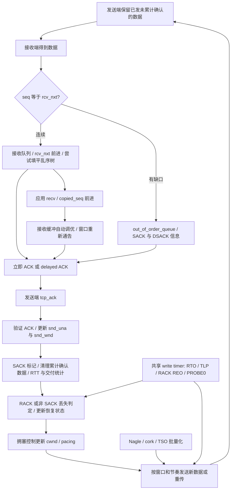

# 第 4 章：TCP 如何在丢包、乱序和资源约束下持续前进

本章把第 1 章的接收链和第 2 章的发送链连接起来：ACK 更新发送端账本，发送端判断丢失并决定重传；接收端用乱序树保存缺口之后的数据，通过窗口与 ACK 控制对端的推进速度。

- 源码：`/home/chen/code/linux-lab/src/linux-6.18`；`git describe --always --dirty --tags` = `v6.18`。
- HEAD：`7d0a66e4bb9081d75c82ec4957c50034cb0ea449`；核验日期：2026-10-01。
- `文件:行号` 相对此源码根目录，指函数定义或明确标出的调用点；只对应这个提交。
- 范围：IPv4、普通已建立 TCP、CUBIC；连接建立/销毁定时器衔接第 3 章，不展开 MPTCP、TLS、TCP-AO。
- **实验尚未在 QEMU 实测；输出均为预期形状。** 当前内核配置和 guest 工具不足以直接运行全部扩展实验，具体前提见第 5 节。

## 1. 总览图：两端各维护一套账本



图中发送端和接收端可以是同一个双向连接的两种职责。ACK 包本身也可能携带数据，所以一次 `tcp_rcv_established()` 可以同时推进发送账本和接收账本。

先分清四件事：数据已发出、对方 SACK 过、累计 ACK 已越过、应用已读走。它们对应的所有权和计数不同。NIC TX completion 只能证明本地发送资源可回收，不能代替 TCP ACK。

## 2. 调用链与状态变化

### 2.1 ACK：先验证，再记账，最后决定还能发送多少

| 顺序 | 函数 + 源码位置 | 做什么 |
|---|---|---|
| 1 | `tcp_rcv_established()` — `net/ipv4/tcp_input.c:6259` | 在已建立连接的快/慢路径中处理 ACK 和数据，进入本章共同入口。 |
| 2 | `tcp_ack()` — `net/ipv4/tcp_input.c:3983` | 检查 ACK 是否过旧或确认了未发送数据；分普通前进 ACK、复杂 ACK、旧 ACK 分支。 |
| 3 | `tcp_ack_update_window()` — `net/ipv4/tcp_input.c:3731` | 慢路径验证窗口更新并维护 `snd_una`、`snd_wnd`；纯前进快路径可直接推进发送确认状态。 |
| 4，可选 | `tcp_sacktag_write_queue()` — `net/ipv4/tcp_input.c:2000` | 解析 SACK block，查找并标记发送重传树中的区间；名称虽有 write_queue，不能据此认为操作的是未发送链表。 |
| 5 | `tcp_clean_rtx_queue()` — `net/ipv4/tcp_input.c:3382` | 按累计 ACK 清理重传树，处理 GSO skb 的部分确认，修正段计数并形成 RTT 样本。 |
| 6 | `tcp_ack_update_rtt()` — `net/ipv4/tcp_input.c:3239` | 选择可用 RTT 样本；调用 `tcp_rtt_estimator()`（`:1037`）与 `tcp_set_rto()`（`:1142`），有效样本才清 backoff。 |
| 7，可选 | `tcp_fastretrans_alert()` — `net/ipv4/tcp_input.c:3108` | 可疑 ACK 触发丢失/恢复状态处理，检查 SACK reneging、DSACK 撤销、退出或进入 Recovery。 |
| 8 | `tcp_rate_gen()` — `net/ipv4/tcp_rate.c:117` | 根据新交付与丢失生成采样结果，提供给拥塞控制。 |
| 9 | `tcp_cong_control()` — `net/ipv4/tcp_input.c:3638` | 在状态处理之后更新拥塞窗口/发送速率；CUBIC 使用通用框架加 `cong_avoid` 分支。 |
| 10，可选 | `tcp_xmit_recovery()` — `net/ipv4/tcp_input.c:3945` | 根据前面产生的恢复动作，选择尝试新数据或进入重传队列处理。 |
| 11 | `tcp_xmit_retransmit_queue()` — `net/ipv4/tcp_output.c:3659` | 扫描需要重传的段，受 cwnd、pacing、TSQ 等限制。 |
| 12 | `tcp_retransmit_skb()` → `__tcp_retransmit_skb()` — `net/ipv4/tcp_output.c:3629` / `:3487` | 准备待重传区间、检查是否仍在本地队列、必要时裁剪/拆分，并更新重传账本。 |
| 13 | `tcp_transmit_skb()` — `net/ipv4/tcp_output.c:1643` | 从重传准备函数回到第 2 章共同的 TCP/IP 输出路径。 |

这不是每个 ACK 都执行全部步骤的直线：`tcp_ack()` 没有未确认包时可进入 `no_queue`；旧 ACK 仍可能携带有效 SACK/DSACK，进入 `old_ack`。因此“ACK 没有推进 `snd_una` 就完全没用”不成立。

ACK 的主要安全边界也在这里：`ack > snd_nxt` 返回 `SKB_DROP_REASON_TCP_ACK_UNSENT_DATA`；过旧 ACK 有独立检查和 challenge ACK 条件。计数更新之前必须完成序号合法性判断。

重传树保存已发送、尚未被累计确认的数据。SACK 表示对端报告收到某区间，但对端可能因内存压力放弃保存它，发送端不能据 SACK 就永久删除重传数据。接收侧 `tcp_prune_ofo_queue()`（`net/ipv4/tcp_input.c:5708`）确实能裁掉乱序数据并重置 SACK 状态；这是需要保留恢复余地的源码证据。

### 2.2 乱序队列：先保留区间，只有填平缺口才能交付

用半开区间表示 payload，暂不考虑 SYN/FIN 消耗的序号：

| 时间 | 接收到的数据 | `rcv_nxt` | 乱序树与应用可读结果 |
|---|---|---:|---|
| t0 | 尚缺 `[1000, 2000)` | 1000 | 无数据可连续交付。 |
| t1 | `[2000, 3000)` | 1000 | 入乱序树；可报告 SACK，累计 ACK 仍为 1000。 |
| t2 | `[3000, 4000)` | 1000 | 可能与尾 skb 合并；逻辑上仍保存 `[2000, 4000)`。 |
| t3 | `[1000, 2000)` | 先到 2000，再到 4000 | 顺序入接收队列后排空连续乱序区间，应用才获得完整连续字节流。 |

| 顺序 / 分支 | 函数 + 源码位置 | 做什么 |
|---|---|---|
| 接收分类 | `tcp_data_queue()` — `net/ipv4/tcp_input.c:5358` | 区分顺序、窗口外、重叠和乱序数据，决定入普通接收队列还是 OFO。 |
| OFO 入口 | `tcp_data_queue_ofo()` — `net/ipv4/tcp_input.c:5132` | 先检查接收内存；关闭 header prediction、安排 ACK，再按序号插入红黑树。 |
| 尾部捷径 | 同函数 `net/ipv4/tcp_input.c:5175` 的注释及后续分支 | 先尝试与 `ooo_last_skb` 合并；位于尾后时直接定位尾节点右侧，省去树查找。 |
| 重叠处理 | 同函数 `net/ipv4/tcp_input.c:5200` 起 | 完全重复可丢；同起点而覆盖更大可替换；新段覆盖的右侧节点可移除；保留 DSACK 信息。 |
| 更新 SACK | `tcp_sack_new_ofo_skb()` — `net/ipv4/tcp_input.c:4887` | 更新向对端通告的 SACK 区间集合。 |
| 连续数据入队 | `tcp_queue_rcv()` — `net/ipv4/tcp_input.c:5283` | 把可连续接收的数据排入/合并到接收队列，并推进接收序号。 |
| 填洞后搬运 | `tcp_ofo_queue()` — `net/ipv4/tcp_input.c:5043` | 从树最左节点开始，只取起点不晚于 `rcv_nxt` 的区间；丢弃完全过期重复段，合并或加入接收队列。 |
| 内存回收 | `tcp_prune_ofo_queue()` — `net/ipv4/tcp_input.c:5708` | 从较远的尾部裁剪乱序数据，受新到段位置与内存条件约束，记录 OFO prune drop reason。 |

不要把“树有序”理解成“每个 skb 的 payload 区间绝不重叠”。代码允许某些部分重叠情形，后续交付按序号与 `rcv_nxt` 处理。更不能把所有右侧节点删除：遇到仅部分覆盖的右节点会停下。

`tcp_ofo_queue()` 自己能处理 FIN。若在搬运时遇到 FIN，调用 `tcp_fin()`（`net/ipv4/tcp_input.c:4675`）后立即终止，因为 FIN 处理会清空乱序树；不能沿旧的树遍历指针继续走。

### 2.3 SACK、RACK、恢复状态与拥塞算法是不同层

**SACK 提供到达证据，RACK 用发送时间判断哪些未确认数据可能丢失；CUBIC 决定允许多少在途数据。** 三者可以一起工作。

| 步骤 | 函数 + 源码位置 | 状态与含义 |
|---|---|---|
| 标记 SACK | `tcp_sacktag_one()` — `net/ipv4/tcp_input.c:1546` | 更新 skb 的 SACK/lost/retrans 标志和连接计数；重复区间可能提供 DSACK 证据。 |
| 记录较新的到达证据 | `tcp_rack_advance()` — `net/ipv4/tcp_recovery.c:118` | 记录已被 ACK/SACK 的段中较新的发送时间、关联 RTT 和结束序号；排除部分重传歧义。 |
| 选择 loss 判定 | `tcp_identify_packet_loss()` — `net/ipv4/tcp_input.c:3077` | 非 SACK 连接调用 NewReno 判定，否则进入 RACK；可取消此次 ACK 对旧 timer 重排的要求。 |
| 扫描入口 | `tcp_rack_mark_lost()` — `net/ipv4/tcp_recovery.c:95` | 只有 `rack.advanced` 时才重新扫描；还需等待时安排 REO timeout。 |
| 真正判丢 | `tcp_rack_detect_loss()` — `net/ipv4/tcp_recovery.c:58` | 遍历按发送时间组织的 `tsorted_sent_queue`，标记满足时间条件的未确认 skb。 |
| 容忍乱序 | `tcp_rack_reo_wnd()` — `net/ipv4/tcp_recovery.c:5` | 根据是否见过乱序、恢复状态、min RTT 与 DSACK 调整容忍窗口。 |
| 超时继续判丢 | `tcp_rack_reo_timeout()` — `net/ipv4/tcp_recovery.c:149` | 等待窗口结束后重新判定，必要时进入 Recovery、执行重传并恢复 RTO。 |
| 非 SACK 分支 | `tcp_newreno_mark_lost()` — `net/ipv4/tcp_recovery.c:217` | 用重复 ACK/恢复中的部分 ACK 标记队首段，必要时拆 GSO skb。 |
| 进入恢复 | `tcp_enter_recovery()` — `net/ipv4/tcp_input.c:2957` | 建立恢复期状态，配合后续拥塞控制和重传执行。 |
| DSACK 撤销 | `tcp_try_undo_dsack()` — `net/ipv4/tcp_input.c:2701` | 在证据支持时尝试撤销不必要的拥塞响应；并非收到 DSACK 就无条件恢复。 |

RACK 的判定可以翻译成两个条件：已有“发送得比候选段更晚”的段被确认；候选段从发送到现在经过的时间达到 `rack.rtt_us + reo_wnd`。时间计算在 `tcp_rack_skb_timeout()`（`net/ipv4/tcp_recovery.c:32`）。这不是单纯“见到三个重复 ACK 就重传”。

乱序容忍窗口常从 min RTT 的四分之一出发，乘 `reo_wnd_steps` 并受平滑 RTT 限制；尚未观察到乱序、满足恢复/重复确认条件时也可为零。`tcp_rack_update_reo_wnd()`（`net/ipv4/tcp_recovery.c:187`）利用 DSACK 调整步数，避免长时间重复误判。

**命名陷阱：** `tcp_is_reno()`（`include/net/tcp.h:1361`）实际返回 `!tcp_is_sack(tp)`，表示本连接没有 SACK，不是检查当前拥塞算法是否名叫 `reno`。CUBIC socket 同样可以走非 SACK 恢复分支。

### 2.4 定时器：事件很多，底层 timer 对象没有那么多

注册入口 `tcp_init_xmit_timers()`（`net/ipv4/tcp_timer.c:895`）同时建立普通 timer 和两个 hrtimer。每条完整 TCP socket 的主要定时设施如下：

| 事件 | 挂在哪个对象 | 到期路径与来源 | 解决的问题 |
|---|---|---|---|
| RTO | `icsk_retransmit_timer`，`icsk_pending=ICSK_TIME_RETRANS` | `tcp_write_timer()` — `net/ipv4/tcp_timer.c:726` → `tcp_write_timer_handler()` — `:691` → `tcp_retransmit_timer()` — `:531` | ACK 长期没有带来进展时的最终恢复兜底。 |
| TLP/PTO | 同一 `icsk_retransmit_timer`，`ICSK_TIME_LOSS_PROBE` | handler → `tcp_send_loss_probe()` — `net/ipv4/tcp_output.c:3107` | 尾部丢失时没有后续数据触发足够 ACK，主动发探测恢复 ACK 时钟。 |
| RACK REO | 同一 `icsk_retransmit_timer`，`ICSK_TIME_REO_TIMEOUT` | handler → `tcp_rack_reo_timeout()` — `net/ipv4/tcp_recovery.c:149` | 给可能乱序的段一个等待窗口，届时重新判丢。 |
| 零窗 probe | 同一 `icsk_retransmit_timer`，`ICSK_TIME_PROBE0` | handler → `tcp_probe_timer()` — `net/ipv4/tcp_timer.c:387` → `tcp_send_probe0()` — `net/ipv4/tcp_output.c:4555` | 对方通告零窗口后，持续探测窗口是否重新开放。 |
| delayed ACK | 独立 `icsk_delack_timer` | `tcp_delack_timer()` — `net/ipv4/tcp_timer.c:359` → `tcp_delack_timer_handler()` — `:307` | 数据接收后允许短时合并 ACK，而不无限等待。 |
| keepalive | `sk_timer` | `tcp_keepalive_timer()` — `net/ipv4/tcp_timer.c:779` | 启用 keepalive 后探测空闲连接；同回调也处理部分 orphan FIN_WAIT2 生命周期。 |
| 发送 pacing | `tcp_sock.pacing_timer`，hrtimer | `tcp_pace_kick()` — `net/ipv4/tcp_output.c:1397` | 到发送时间后重新驱动发送；它不是 loss detector。 |
| SACK ACK 压缩 | `tcp_sock.compressed_ack_timer`，hrtimer | `tcp_compressed_ack_kick()` — `net/ipv4/tcp_timer.c:867` | 乱序 ACK 场景中压缩重复反馈；与普通 delayed ACK 的 timer 不同。 |

共享 timer 的明确实现是 `inet_csk_reset_xmit_timer()`（`include/net/inet_connection_sock.h:222`）：四个发送侧事件都写入 `icsk_pending`，再重设同一个 `icsk_retransmit_timer`。同一时刻不是四个独立 timer 各自等待。

安排和执行必须分开读：

1. `tcp_schedule_loss_probe()`（`net/ipv4/tcp_output.c:3036`）只决定是否安排 TLP。代码要求有未确认数据、协商 SACK、适当拥塞状态与配置；超时由 RTT 推导，一包在途还要考虑 delayed ACK，并受更早 RTO 限制。
2. 到期的 `tcp_send_loss_probe()` 优先尝试发送新段，否则重传最后一段；GSO 尾包必要时先拆分。之后重新安排 RTO。**TLP 触发不等于已经判定整条流丢包。**
3. `tcp_rearm_rto()`（`net/ipv4/tcp_input.c:3304`）从 TLP/REO 切回 RTO 时计算剩余时间，不能把每次切换都解释为从头再等一个完整 RTO。
4. 真正 RTO 到期后，`tcp_retransmit_timer()` 进入 loss、重传队首、处理重试上限并重新安排。普通情形指数退避；代码还存在 thin stream/SYN 等特殊线性退避分支，不能一概写成每次翻倍。
5. 零窗有两种情形：没有在途段但还有待发数据时走 PROBE0；已经有在途数据而窗口收缩到零，`tcp_retransmit_timer()` 自身也有 zero-window probe 分支。keepalive 则在仍有待发/在途数据时跳过探测，不能代替这两条路径。

普通 timer 回调运行时仍可能遇到 socket 被用户线程占用。`tcp_write_timer()`/`tcp_delack_timer()` 先拿 BH socket lock；若 `sock_owned_by_user()` 为真，设置 deferred 标志并持有引用，等 `tcp_release_cb()`（`net/ipv4/tcp_output.c:1299`）执行实际 handler。因此 timer “到了期限”与协议状态“完成处理”不总是同一时刻。

pacing 的安排入口 `tcp_pacing_check()`（`net/ipv4/tcp_output.c:2728`）检查发送时间戳；到期经 `tcp_pace_kick()` → `tcp_tsq_handler()`（`:1246`）继续发送。只有需要内置 pacing 时才走这条链；不能把它当成每次发包必有的调用。

第 3 章的 request_sock SYN-ACK 重传、TIME_WAIT 回收属于另外的对象生命周期。本表限定完整 TCP socket 的主要发送/接收性能定时器。

### 2.5 拥塞控制：通用可靠性引擎上插一张 ops 表

`struct tcp_congestion_ops` 在 `include/net/tcp.h:1230`。可替换的是拥塞策略，不是让算法自己管理完整 socket、ACK 合法性与 skb 生命周期。

| 阶段 | 函数 + 源码位置 | 做什么 |
|---|---|---|
| 注册 | `tcp_register_congestion_control()` — `net/ipv4/tcp_cong.c:92` | 校验必需回调，将算法加入 RCU 保护的注册表。 |
| 选择 | `tcp_assign_congestion_control()` — `net/ipv4/tcp_cong.c:215` | 选择网络命名空间默认算法、取得模块引用并清空每连接私有区。 |
| 初始化 | `tcp_init_congestion_control()` — `net/ipv4/tcp_cong.c:235` | 调当前算法的可选 `init` 回调。 |
| ACK 后策略入口 | `tcp_cong_control()` — `net/ipv4/tcp_input.c:3638` | 若算法有 `cong_control` 就调用它；否则使用通用 reduction / `cong_avoid` 路径。 |
| CUBIC 避免拥塞 | `cubictcp_cong_avoid()` — `net/ipv4/tcp_cubic.c:324` | 非 cwnd-limited 时返回；slow start 后按 CUBIC 增长。 |
| 曲线更新 | `bictcp_update()` — `net/ipv4/tcp_cubic.c:214` | 用 epoch、历史最大窗口、三次时间曲线算出 ACK 增窗间隔 `cnt`。 |
| 增窗执行 | `tcp_slow_start()` / `tcp_cong_avoid_ai()` — `net/ipv4/tcp_cong.c:455` / `:469` | 按已确认段计数推进窗口，受阈值与 clamp 限制。 |
| 丢失阈值 | `cubictcp_recalc_ssthresh()` — `net/ipv4/tcp_cubic.c:341` | 结束当前 epoch、更新历史最大窗口，算新的 slow-start threshold。 |
| RTT 反馈 | `cubictcp_acked()` — `net/ipv4/tcp_cubic.c:452` | 过滤不适用 RTT 样本，更新最小延迟并驱动 HyStart。 |
| 状态通知 | `tcp_set_ca_state()` — `net/ipv4/tcp_cong.c:37` → `cubictcp_state()` — `net/ipv4/tcp_cubic.c:358` | 通用框架先通知算法再更新状态；CUBIC 在 Loss 状态重置相应私有状态。 |

CUBIC 的普通增窗调用桥接是 `tcp_cong_control()` → `tcp_cong_avoid()`（`net/ipv4/tcp_input.c:3293`）→ `icsk_ca_ops->cong_avoid` → `cubictcp_cong_avoid()`。

CUBIC 回调表 `cubictcp`（`net/ipv4/tcp_cubic.c:478`）没有实现 `cong_control`，实现的是 `cong_avoid`、`ssthresh`、`pkts_acked` 等；撤销窗口回调复用 `tcp_reno_undo_cwnd`。不要把其他算法的完整 rate-sample 接口直接套到 CUBIC。

本树 CUBIC 的 `beta=717/1024`（`net/ipv4/tcp_cubic.c:50`），是丢失阈值计算的缩放参数；不能据此说任何时间窗口都瞬间变为旧值的 70%，实际恢复期间还有通用 reduction 控制。HyStart 使用 ACK train 与 delay 两类检测（同文件 `:39`、`:55`）；这里没有把它写成 HyStart++。

`TCP_CA_Open/Disorder/CWR/Recovery/Loss` 是拥塞控制状态，定义于 `include/uapi/linux/tcp.h:199` 起。它和 `TCP_ESTABLISHED`、`FIN_WAIT1` 等连接状态是两套状态机；一条 ESTABLISHED 连接可以在 Open 与 Recovery 之间反复切换。

### 2.6 接收窗口、缓冲预算和自动调优

`rwnd` 约束接收端容量，`cwnd` 约束发送端对网络在途数据的估计。二者单位也不同：`snd_wnd` 是字节，`snd_cwnd` 是逻辑 TCP 段数。

接收缓冲自动调优沿应用消费进度发生，不是只看网卡收到多少数据：

| 步骤 | 函数 + 源码位置 | 做什么 |
|---|---|---|
| 建立初始预算 | `tcp_init_buffer_space()` — `net/ipv4/tcp_input.c:722` | 初始化测量时间/序号，设置窗口 clamp 与初始 `rcvq_space`。 |
| 应用读后测量 | `tcp_rcv_space_adjust()` — `net/ipv4/tcp_input.c:933` | 按接收 RTT 周期读取 `copied_seq` 增量，扣去仍积压的连续数据，决定是否需要增长。普通 recv 调用点在 `net/ipv4/tcp.c:2863`。 |
| 增长实际预算 | `tcp_rcvbuf_grow()` — `net/ipv4/tcp_input.c:894` | 估算下一阶段窗口需求，考虑增长和 OFO 跨度，转换为内存预算，受 `tcp_rmem[2]` 限制。 |
| 内存与字节换算 | `tcp_win_from_space()` / `tcp_space_from_win()` — `include/net/tcp.h:1612` / `:1626` | 利用 `scaling_ratio` 换算 skb 内存开销与可通告的 payload 窗口。 |
| 选择当前窗口 | `__tcp_select_window()` — `net/ipv4/tcp_output.c:3251` | 同时考虑剩余内存、window_clamp、rcv_ssthresh、MSS、窗口缩放与内存压力。 |
| 编码通告窗口 | `tcp_select_window()` — `net/ipv4/tcp_output.c:262` | 更新 `rcv_wnd/rcv_wup`，维护已通告窗口的右边界约束并进行 window scale 编码。 |
| 消费后反馈 | `__tcp_cleanup_rbuf()` — `net/ipv4/tcp.c:1514` | 应用腾出足够空间时发送 ACK/窗口更新，避免发送端继续以旧的小窗口等待。 |

`tcp_rcvbuf_grow()` 在 `tcp_moderate_rcvbuf=0` 或 `SOCK_RCVBUF_LOCK` 时不增长 `sk_rcvbuf`。显式 `SO_RCVBUF` 会改变自动调优行为，所以对比实验不能一边手工锁小 buffer、一边期待自动扩容。

本版本不能按旧文章的 `tcp_adv_win_scale` 公式解释所有接收窗口。该 sysctl 在本树文档已标注“Obsolete since linux-6.6”（`Documentation/networking/ip-sysctl.rst:346`）；实际热路径使用 `scaling_ratio`，由 `tcp_measure_rcv_mss()`（`net/ipv4/tcp_input.c:227`）按数据长度与 `truesize` 比例参与更新（`:244`）。`truesize` 包含记账开销，不等于可交付字节数。

默认路径维持已通告的接收右边界，避免随意收缩。6.18 另有 `tcp_shrink_window` 条件分支，并要求非零窗口缩放；不能写“Linux 在任何配置下绝不缩窗”。本树默认值为 0（`net/ipv4/tcp_ipv4.c:3670`）。

### 2.7 Nagle、delayed ACK、TSO/GSO：三个层面，互相影响

| 机制 | 决策在哪里 | 约束什么 |
|---|---|---|
| Nagle / Minshall 变体 | `tcp_nagle_check()` — `net/ipv4/tcp_output.c:2148`；`tcp_nagle_test()` — `:2272` | 有未确认小段时是否暂缓继续发不足 MSS 的新数据；还受 cork、NODELAY、PUSH、FIN 等条件影响。 |
| delayed ACK | `__tcp_ack_snd_check()` — `net/ipv4/tcp_input.c:5887` → `tcp_send_delayed_ack()` — `net/ipv4/tcp_output.c:4364` | 收到数据后何时回 ACK；快确认、窗口更新、协议状态等可要求立即发。 |
| SACK ACK 压缩 | 同一 ACK 检查函数的 OFO 分支 → `compressed_ack_timer` | 初始重复 ACK 之后，按配置和时间界限压缩反馈，不是无限推迟。 |
| TSO/GSO 大 skb | `tcp_set_skb_tso_segs()` — `net/ipv4/tcp_output.c:1669`；`tcp_tso_autosize()` — `:2170` | 用一个 skb 表示多个逻辑 TCP 段，减少逐 skb 软件处理。 |
| 发送批次判断 | `tcp_write_xmit()` — `net/ipv4/tcp_output.c:2901` | 对单段做 Nagle 判断，多段还可能走 `tcp_tso_should_defer()`（`:2366`），同时遵守发送/拥塞窗口。 |
| 软件分段后备 | `validate_xmit_skb()` — `net/core/dev.c:3977` → `skb_gso_segment()` 调用点 `:3997`；TCP 实现 `tcp_gso_segment()` — `net/ipv4/tcp_offload.c:132` | 下层不能处理该 GSO skb 时，发送前走软件分段分支。 |

Nagle 等待 ACK，delayed ACK 等待更多数据或 timer；小请求若被应用拆成两次小 write，可能形成额外等待。这里是机制推断，真实时延还受 quickack、应用读行为、RTT、cork 等条件影响，不能保证每次稳定出现固定 40 ms。

`TCP_NODELAY` 去掉的是 Nagle 限制，不会越过零接收窗口、拥塞窗口或发送队列限制；也不等于关闭 TSO/GSO。`TCP_CORK` 和 `MSG_MORE` 对批量化的使用在第 2 章继续对照发送路径。

GSO 下一个 skb 可能表示 N 个 MSS 段。ACK/SACK 可能只确认其中一部分，loss probe 可能只重传尾段。因此 `tcp_skb_pcount()` 的逻辑段数参与 `packets_out`、cwnd 和重传计数，不能用 skb 节点数代替它。`tcp_clean_rtx_queue()` 的 `tcp_tso_acked()`（`net/ipv4/tcp_input.c:3340`）分支就是部分确认的证据。

## 3. 本章要记住的数据结构

字段位置列的是定义处；嵌入关系已在第 0 章说明。

| 对象与字段 | 定义位置 | 读本章时的用途 |
|---|---|---|
| `sock.tcp_rtx_queue` / `sk_write_queue` | `include/net/sock.h:477` / `:479` | 已发送未累计确认的重传树 / 尚未发送的数据链表。 |
| `sock.sk_rmem_alloc` / `sk_rcvbuf` / `sk_userlocks` | `include/net/sock.h:414` / `:431` / `:430` | 实际接收内存记账、预算与用户显式锁定标志。 |
| `tcp_sock.snd_una/snd_nxt` / `snd_wnd` | `include/linux/tcp.h:307` / `:306` / `:226` | 最早待确认序号、下一发送序号、对端通告窗口。 |
| `snd_cwnd/snd_ssthresh` | `include/linux/tcp.h:228` / `:252` | 以逻辑段数计的拥塞窗口与 slow-start 阈值。 |
| `packets_out/sacked_out/lost_out/retrans_out` | `include/linux/tcp.h:310` / `:231` / `:230` / `:248` | 在途估算所需的不同状态计数；不是四条物理队列。 |
| `rcv_nxt/copied_seq` | `include/linux/tcp.h:305` / `:244` | 累计连续接收进度 / 应用消费进度。 |
| `out_of_order_queue/ooo_last_skb` | `include/linux/tcp.h:255` / `:435` | 乱序区间树与尾节点缓存。 |
| `rx_opt/selective_acks` | `include/linux/tcp.h:325` / `:439` | 协商结果与本端将通告的 SACK 区间。 |
| `tsorted_sent_queue/rack` | `include/linux/tcp.h:279` / `:380` | 按发送时间排列的未 SACK skb，以及已交付时间证据/乱序容忍状态。 |
| `window_clamp/rcv_ssthresh/scaling_ratio` | `include/linux/tcp.h:308` / `:212` / `:233` | 接收窗口上限、当前接收增长阈值、payload 与内存换算比例。 |
| `rcvq_space` 的 `space/seq/time` | `include/linux/tcp.h:360` | 每 RTT 消费能力测量的历史量；不是 skb 队列本身。 |
| `inet_connection_sock.icsk_pending/icsk_rto/icsk_backoff` | `include/net/inet_connection_sock.h:101` / `:86` / `:102` | 共享 write timer 当前事件、超时与退避状态。 |
| `icsk_ack.pending/quick/ato/rcv_mss` | `include/net/inet_connection_sock.h:107` 起 | ACK 待发状态、快确认计数、延迟估计与接收 MSS。 |
| `icsk_ca_ops/icsk_ca_state/icsk_ca_priv` | `include/net/inet_connection_sock.h:91` / `:96` / `:135` | 当前拥塞策略、恢复状态、每连接算法私有空间。 |
| CUBIC `bictcp.cnt/last_max_cwnd/epoch_start/bic_K` | `net/ipv4/tcp_cubic.c:86` 起 | ACK 增窗间隔、历史峰值、曲线 epoch 与拐点时间。 |
| `TCP_SKB_CB(skb)->sacked` 的发送标志 | `include/net/tcp.h:1005` 起 | `TCPCB_SACKED_ACKED/TCPCB_SACKED_RETRANS/TCPCB_LOST`；结合每 skb 逻辑段数更新账本。 |

一个可用的核对式来自 `tcp_packets_in_flight()`（`include/net/tcp.h:1385`）：

```text
in_flight = packets_out - (sacked_out + lost_out) + retrans_out
```

这是发送端对仍在网络里的段数估计。原发已判丢的数据不再占原有在途估算，重传副本又进入网络；因此既要减 loss，又要加 retrans。调试时不能把它简单替换成 `snd_nxt - snd_una`。

## 4. 为什么这样设计

以下为结合代码的设计推断；有直接源码注释支持的地方另行指出。

1. **把可靠性账本与拥塞策略分开。** ACK/SACK 合法性、保留重传数据、RTT、恢复状态由公共路径处理；ops 控制窗口策略。推断：不同算法共享复杂的正确性约束，避免每换一种算法重做 skb 生命周期与超时协议。
2. **乱序树加尾缓存，同时照顾最坏情况和常见情况。** 红黑树支持任意序号位置插入；源码 `tcp_data_queue_ofo()` 的注释明确说明 `ooo_last_skb` 省去常见尾插的 O(log N) 查找。推断：不能只因常见顺序到达就选整体线性扫描，也不必让每次尾插支付树搜索成本。
3. **SACK 确认状态与真正可释放状态分开。** 接收端内存回收允许撤销先前 OFO 保留。推断：sender 保留到累计确认，使两端在资源紧张时仍能恢复字节流，代价是额外记账和恢复分支。
4. **用时间证据处理乱序，而不只数重复 ACK。** RACK 的注释直接对比包数、序号距离、发送时间三种度量。推断：发送时间更容易统一处理原发、重传和尾部问题；DSACK 驱动窗口调整则降低误重传概率。
5. **共享发送 timer，用独立状态表达当前目的。** 四个事件都占同一 timer 对象。推断：每连接元数据较少，也要求切换时保留 RTO 的时间语义，不能无意延长最终超时。
6. **接收窗口从实际内存与消费速度推导。** 源码使用 `truesize`、`scaling_ratio` 与 `copied_seq` 测量。推断：只按网络到达速率扩容会奖励不读数据的应用；只按 payload 记账又会忽略大量小 skb 的真实成本。
7. **timer 与接收软中断服从同一 socket 并发约束。** 回调可推迟到 `tcp_release_cb()`，并以引用保护对象。推断：异步到期不能越过用户持锁直接修改协议状态，否则 send/recv、ACK 和超时会破坏同一账本。

## 5. QEMU 验证实验

### 5.1 环境、范围与依赖

启动方式沿用[第 1 章 §5.1](01-tcp-receive-path.md#51-用现有学习环境启动-virtio-rx-实验)。以下命令都在**专用 QEMU guest 的 root shell**运行，除非标明宿主侧。

这份源码目录当前 `.config` 已启用 `CONFIG_FUNCTION_GRAPH_TRACER`、`CONFIG_VETH`、`CONFIG_NET_NS` 和 CUBIC，但 **`CONFIG_NET_SCH_NETEM`、`CONFIG_INET_DIAG` 未启用**。当前配置不等于已经运行的 bzImage 配置，启动后仍需核对。

- §5.2 的 ftrace 可以复用第 1 章 BusyBox + 宿主 Python 的连接流量，先观察正常 ACK。
- §5.3–§5.6 的扩展实验要求 guest 有 Python 3、完整 iproute2 的 `ip/tc`、netem 内核支持；最小 initramfs 没有提供这些工具。
- `ethtool` 用于检查/关闭实验 veth offload；`ss -ti` 还需 guest 内核的 INET_DIAG/TCP_DIAG 支持。
- bpftrace 为可选观测器，需相应 BPF/tracepoint 支持与用户态工具。没有 bpftrace 时用 ftrace 结果即可。
- 本章没有执行配置变更、重新编译、安装工具或修改网络；准备扩展 guest 后再运行相应实验。

丢包实验使用 **同一 guest 内两个 network namespace 之间的 veth**。这条流量不会经过 virtio 网卡，目的是隔离验证 TCP 机制；需要验证驱动部分时，再按第 1/2 章使用 virtio。QEMU user/hostfwd 在宿主侧中转 TCP，在宿主转发连接上制造丢包不等于在 guest 所见 TCP 连接上丢掉相同序号的段。

### 5.2 ftrace：把 ACK、恢复和定时器放到同一时间线上

在 tracefs 根目录配置。不要使用服务器 PID 过滤，否则 softirq 和 timer 上下文可能被漏掉；也不要与其他 tracing 实验同时运行。

```sh
mount -t tracefs tracefs /sys/kernel/tracing 2>/dev/null || true
T=/sys/kernel/tracing
echo 0 > "$T/tracing_on"
echo 0 > "$T/events/enable"
echo function_graph > "$T/current_tracer"
: > "$T/set_graph_function"
: > "$T/set_ftrace_filter"
: > "$T/set_ftrace_pid"
echo 16 > "$T/max_graph_depth"
echo funcgraph-proc > "$T/trace_options"

# 某些 static helper 会被内联；只添加运行中确实能 trace 的函数。
GRAPH_ROOTS=0
for f in tcp_ack tcp_data_queue_ofo tcp_ofo_queue tcp_write_timer_handler \
         tcp_retransmit_timer tcp_send_loss_probe tcp_rack_reo_timeout \
         tcp_probe_timer tcp_delack_timer_handler tcp_keepalive_timer \
         tcp_rcv_space_adjust cubictcp_cong_avoid tcp_write_xmit \
         tcp_send_delayed_ack; do
    if awk -v n="$f" '$1 == n { found=1 } END { exit !found }' \
        "$T/available_filter_functions"; then
        echo "$f" >> "$T/set_graph_function"
        GRAPH_ROOTS=$((GRAPH_ROOTS + 1))
    else
        echo "not traceable: $f"
    fi
done
test "$GRAPH_ROOTS" -gt 0 || { echo "没有可用 graph 根"; exit 1; }
echo 1 > "$T/events/tcp/tcp_retransmit_skb/enable"
echo 1 > "$T/events/tcp/tcp_cong_state_set/enable"
: > "$T/trace"
echo 1 > "$T/tracing_on"
```

此时可用第 1 章流量先验证正常 ACK，也可运行下一节的 bulk 流量。停止并保存：

```sh
echo 0 > "$T/tracing_on"
cat "$T/trace" > /tmp/ch4.trace
cat /tmp/ch4.trace
echo 0 > "$T/events/enable"
echo nofuncgraph-proc > "$T/trace_options"
echo nop > "$T/current_tracer"
: > "$T/set_graph_function"
echo 0 > "$T/max_graph_depth"
```

`nofuncgraph-proc` 在切换到 `nop` **之前**恢复。每轮实验重新开始前清 trace，结束立即保存；高包速率可能覆盖环形缓冲，trace 头部的 entries 信息可提示记录不完整。

预期形状，省略层级/内联函数，以下不表示所有事件必然出现：

```text
tcp_ack() {
  tcp_clean_rtx_queue() { ... }
  tcp_fastretrans_alert() { ... }
  ... cubictcp_cong_avoid() ...
}
tcp_data_queue_ofo() { ... }
tcp_ofo_queue() { ... }
tcp_write_timer_handler() {
  tcp_rack_reo_timeout() { ... tcp_xmit_retransmit_queue() ... }
}
... tcp_retransmit_skb: ... sport=... dport=9094 ... err=0
... tcp_cong_state_set: ... cong_state=3
```

`cong_state=3` 是 Recovery，4 是 Loss，0 是 Open。tracepoint 的 `err=0` 只表示该次重传调用返回成功，不能证明对端已收到。事件定义分别是 `include/trace/events/tcp.h:16` 和 `:469`。

### 5.3 建立可控 peer 与通用工作负载

扩展 guest 中建立隔离 peer；地址只放在新建的实验 veth 上：

```sh
ip netns add tcp4peer
ip link add tcp4a type veth peer name tcp4b
ip link set tcp4b netns tcp4peer
ip addr add 198.18.0.1/30 dev tcp4a
ip link set tcp4a up
ip netns exec tcp4peer ip addr add 198.18.0.2/30 dev tcp4b
ip netns exec tcp4peer ip link set lo up
ip netns exec tcp4peer ip link set tcp4b up

# 若安装了 ethtool，先记录能力，再关闭可关闭的聚合/分段 offload。
ethtool -k tcp4a
ip netns exec tcp4peer ethtool -k tcp4b
ethtool -K tcp4a tso off gso off gro off
ip netns exec tcp4peer ethtool -K tcp4b tso off gso off gro off
```

不支持的 feature 以实际输出为准。如果不能关闭，要记录下来：netem 面对的大 skb 和最终逻辑 TCP 段可能不是一一对应，不能把“1% skb 丢失”严格当成“1% MSS 段丢失”。

把这个小程序保存到 guest 的 `/tmp/tcp4.py`。netns 共用挂载命名空间，因此同一文件两端都能使用。

```python
import os
import socket
import sys
import time

role, mode = sys.argv[1:3]
address = ("198.18.0.2", 9094)

if role == "server":
    with socket.socket() as listener:
        listener.setsockopt(socket.SOL_SOCKET, socket.SO_REUSEADDR, 1)
        if mode == "stall":
            listener.setsockopt(socket.SOL_SOCKET, socket.SO_RCVBUF, 4096)
        listener.bind(address)
        listener.listen(1)
        with open("/tmp/tcp4.ready", "w") as marker:
            marker.write("ready")
        with listener.accept()[0] as conn:
            conn.settimeout(60)
            if mode == "idle":
                time.sleep(7)
            else:
                if mode == "stall":
                    time.sleep(6)
                total = 0
                while True:
                    if mode == "tiny":
                        conn.setsockopt(socket.IPPROTO_TCP, socket.TCP_QUICKACK, 0)
                    data = conn.recv(65536)
                    if not data:
                        break
                    total += len(data)
                print("received", total, flush=True)
else:
    with socket.create_connection(address, timeout=60) as conn:
        if mode == "idle":
            conn.setsockopt(socket.SOL_SOCKET, socket.SO_KEEPALIVE, 1)
            conn.setsockopt(socket.IPPROTO_TCP, socket.TCP_KEEPIDLE, 2)
            conn.setsockopt(socket.IPPROTO_TCP, socket.TCP_KEEPINTVL, 1)
            conn.setsockopt(socket.IPPROTO_TCP, socket.TCP_KEEPCNT, 3)
            time.sleep(7)
        elif mode == "tiny":
            conn.setsockopt(socket.IPPROTO_TCP, socket.TCP_NODELAY,
                            int(os.environ.get("NODELAY", "0")))
            for _ in range(100):
                conn.sendall(b"a")
                time.sleep(0.002)
                conn.sendall(b"b")
                time.sleep(0.02)
        else:
            payload = b"x" * 65536
            for _ in range(64):
                conn.sendall(payload)
        conn.shutdown(socket.SHUT_WR)
```

定义一次启动函数，之后每个 mode 都创建一条新连接：

```sh
run_tcp4()
{
    rm -f /tmp/tcp4.ready
    ip netns exec tcp4peer python3 /tmp/tcp4.py server "$1" &
    SERVER_PID=$!
    timeout 5 sh -c 'until test -f /tmp/tcp4.ready; do sleep 0.1; done' || {
        kill "$SERVER_PID" 2>/dev/null
        wait "$SERVER_PID"
        return 1
    }
    python3 /tmp/tcp4.py client "$1"
    CLIENT_RC=$?
    wait "$SERVER_PID"
    return "$CLIENT_RC"
}
```

### 5.4 丢包/乱序：观察 OFO → SACK/RACK → 重传

先在两端加入延迟，再在发送端加入丢包/乱序：

```sh
tc qdisc replace dev tcp4a root netem delay 20ms 5ms loss 1% reorder 10% 50%
ip netns exec tcp4peer tc qdisc replace dev tcp4b root netem delay 20ms
# 按 §5.2 开启 tracing 后运行：
run_tcp4 bulk
tc -s qdisc show dev tcp4a
# 然后按 §5.2 停止并保存 trace。
```

预期应用最终打印 `received 4194304`；接收端 trace 可出现 `tcp_data_queue_ofo`、填洞后的 `tcp_ofo_queue`，发送端出现 SACK/RACK 路径及重传事件。发生多少次 TLP、REO、RTO 取决于实际丢包位置和时序；随机 loss 不保证三种 timer 每轮都出现。

对照组将发送端 netem 改为纯延迟，再运行一次：

```sh
tc qdisc replace dev tcp4a root netem delay 20ms
run_tcp4 bulk
```

扩展观测可用 bpftrace 统计重传返回和恢复状态；在另一个 guest shell 启动，传输完成后 Ctrl-C：

```sh
bpftrace -e '
tracepoint:tcp:tcp_retransmit_skb
/args->sport == 9094 || args->dport == 9094/
{
  @retrans[args->err] = count();
}
tracepoint:tcp:tcp_cong_state_set
/args->sport == 9094 || args->dport == 9094/
{
  @ca_state[args->cong_state] = count();
}'
```

可能输出 `@retrans[0]: 8`、`@ca_state[3]: 2`、`@ca_state[0]: 2`。这些数字只是样例；重传多不等于一定是 RTO，多数时候要回看前面的调用栈来区分 RACK/TLP/RTO。

需要稳定观察 RTO 时，在 peer 接受 bulk 连接之后，短时把 `tcp4a` 的 loss 改为 100%，超过当前 RTO 再恢复；必须在专用实验链路操作并保留恢复命令。**先把 loss 设为 100% 再 connect 只会观察到握手重传，不是已建立连接的数据 RTO。** 本章不把这种人工时序实验伪装成稳定自动复现。

### 5.5 零窗与 keepalive：两种等待不是一回事

移除随机丢包，仅保留 §5.4 的纯延迟，再分别记录两轮 trace：

```sh
# server 把接收预算锁小，accept 后 6 秒不读。
run_tcp4 stall

# 两端不传业务数据，client 开启 2 秒 idle keepalive。
run_tcp4 idle
```

stall 预期仍最终收到 4194304 字节，但前 6 秒发送端可能阻塞于发送缓冲。接收端把可用窗口耗尽后，发送端可能出现 `tcp_probe_timer` → `tcp_send_probe0`；若尚有在途数据，也可能先经过 `tcp_retransmit_timer` 的零窗分支。server 开始读取后，由 ACK/窗口更新恢复发送。

idle 预期出现 `tcp_keepalive_timer`，对端正常响应探测，因此不会达到 keepalive 失败上限。两种实验都可能出现探测包，却由不同的状态与 timer 驱动；仅凭抓包里“小包/重复 ACK”无法完整判断原因。

若扩展内核已开启 INET_DIAG/TCP_DIAG，可在传输期间另一个 shell 运行：

```sh
ss -tin dst 198.18.0.2
ip netns exec tcp4peer ss -tmin
```

观察 sender 的 `cwnd/rtt/rto` 及 receiver 的 `skmem`。先对比 bulk 的自动预算与 stall 的显式 `SO_RCVBUF`，再把数据量加大、延迟加大观察调优。并非每次 4 MiB 传输都必定让 receive buffer 增长；初始预算足够时“不增长”也是符合实现的结果。

### 5.6 小包与 offload：比较决策，不能只数 skb

保持纯延迟并记录两轮 trace：

```sh
NODELAY=0 run_tcp4 tiny
NODELAY=1 run_tcp4 tiny
```

预期每轮应用均得到 200 字节。接收端显式设置 `TCP_QUICKACK=0` 只是给 delayed ACK 机会；它仍可因其他条件立即 ACK。观察 `tcp_send_delayed_ack`、`tcp_delack_timer_handler` 和发送调用间隔，比较 NODELAY 前后是否还有等待；没有固定延迟峰值并不说明 Nagle 不存在。

TSO/GSO 对照可先恢复 veth 支持的 offload，再跑 bulk；保留开启和关闭状态的 `ethtool -k` 输出，比较 `tcp_write_xmit`、软件 GSO 分段及 ACK 后计数处理的差异。这只能验证软件聚合/分段语义；硬件 TSO 或 virtio 后端承担的分段位置应在第 2 章的驱动实验里观察。

全部结束后，确认没有实验进程，再清理：

```sh
ip netns pids tcp4peer
# 若上面仍有实验 server，先正常结束或按记录的 PID 终止并 wait。
ip link del tcp4a
ip netns del tcp4peer
rm -f /tmp/tcp4.ready
```

删除 veth 同时删除其 qdisc；本章不修改 guest 的 virtio 接口、默认路由或全局 TCP sysctl。

## 6. 自测题

1. SACK 已报告 `[3000, 4000)` 到达，但累计 ACK 还是 1000。发送端能释放这个区间吗？接收端发生什么事会迫使它保留恢复能力？
2. 一条 CUBIC 连接进入 `tcp_is_reno()` 为真的分支，说明算法被切换成 Reno 了吗？SACK、RACK、CUBIC 分别负责什么？
3. 为什么看到 `tcp_write_timer_handler()` 不能断言发生 RTO？TLP、REO 与 RTO 如何复用对象？timer 到期而 socket 被用户占用时怎么办？
4. `sk_rcvbuf=256 KiB` 是否就应该向对端通告 256 KiB 窗口？应用一直不读时，为什么不能仅因线速高就继续无限扩容？
5. 一个 skb 表示 10 个逻辑段，累计 ACK 确认其中 4 段。能不能只把 `packets_out` 减 1？打开 NODELAY 是否能绕过此时的 cwnd/rwnd 限制？

## 7. 对用户态 TCP 协议栈的启示

1. **先把字节区间、逻辑段和 buffer 所有权分清。** 发送未确认区间、SACK scoreboard、接收连续队列与 OFO 区间可以共用 mbuf 存储，但确认、释放、重传必须各有明确条件。启用多段 offload 后仍按逻辑段计 congestion accounting。
2. **让“发现丢失”“进入恢复”“决定发送多少”“实际重传”成为清楚的接口。** 第一版可以用较简单的 Reno/NewReno 恢复与拥塞策略，但不能把可靠性绑死在某一种算法中；升级 RACK/CUBIC 时才能复用已有正确性约束。
3. **定时任务必须携带状态和对象生命期。** 单线程轮询可省去内核 socket 锁竞争，仍要处理过期 timer、已关闭连接、timer 角色切换与 budget 延迟。先保留 RTO/零窗/ACK/lifecycle 的完整语义，再优化为共享 timer 或时间轮。

继续阅读：[第 5 章：用户态 TCP 设计取舍](05-userspace-tcp-design.md)。发送方向对照[第 2 章](02-tcp-send-path.md)，连接状态与销毁定时器对照[第 3 章](03-tcp-connection-lifecycle.md)。

<details>
<summary>自测题答案</summary>

1. 不能仅因 SACK 释放。接收方可能因内存压力裁剪 OFO 队列并撤销先前接收承诺；`tcp_prune_ofo_queue()` 和 SACK reneging 处理正是这种恢复机制。累计 ACK 越过后才按规则清理重传数据。
2. 没有切算法。`tcp_is_reno()` 在本树表示未启用 SACK；SACK 描述收到哪些区间，RACK 根据交付/发送时间判断 loss，CUBIC 调整拥塞窗口增长与阈值。
3. handler 按 `icsk_pending` 分发 RTO、TLP、REO、PROBE0，它们复用同一个 `icsk_retransmit_timer`。重排时必须维护 RTO 时间语义。socket 被用户占用时，普通 write/delack timer 设置 deferred 标志、持引用，随后由 `tcp_release_cb()` 调实际 handler。
4. 不成立。`sk_rcvbuf` 是内存预算，payload 窗口还受 skb 开销、当前占用、scaling_ratio、clamp、rcv_ssthresh、window scale 等约束。调优测量应用消费进度，内存有上限；一直不读时应该通过流控让 sender 停下。
5. 不行。必须扣正确的逻辑段数并处理 GSO skb 部分确认，对相关 SACK/lost/retrans 计数同步更新。NODELAY 只改变 Nagle 条件，不能绕过拥塞窗口、接收窗口或发送资源限制。

</details>
