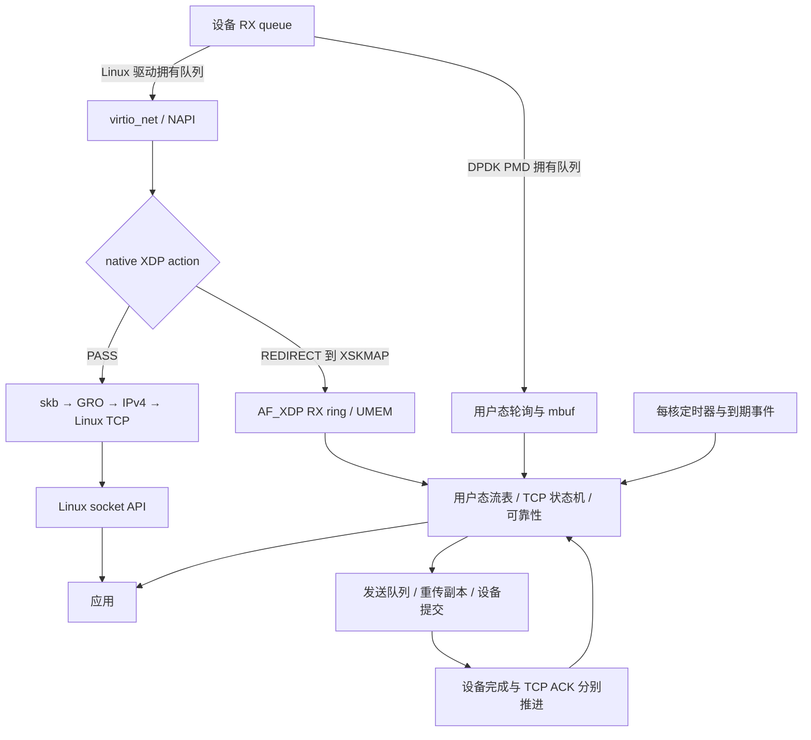

# 第 5 章：对实现用户态 TCP 协议栈的启示

本章把前四条内核主线转成用户态栈的设计约束：可以改变执行环境和数据结构，但必须保持连接、序号、重传、内存所有权与应用语义之间的一致性。前置：[接收](01-tcp-receive-path.md)、[发送](02-tcp-send-path.md)、[生命周期](03-tcp-connection-lifecycle.md)、[可靠性与性能](04-tcp-reliability-performance.md)。

- Linux 源码：`/home/chen/code/linux-lab/src/linux-6.18`；`git describe --always --dirty --tags` = `v6.18`。
- 固定提交：`7d0a66e4bb9081d75c82ec4957c50034cb0ea449`；核验日期：2026-10-01。
- 所有 Linux 函数、字段及 `文件:行号` 均以本地源码为准，范围为 x86_64、IPv4、TCP、virtio_net。
- “必须实现 / 可以简化 / 可以不做”是为本章界定的用户态栈目标所做的工程判断，不表示照抄 Linux 就自动通过完整协议一致性认证。
- F-Stack、Seastar 不在此 Linux 仓库中，不能由本地源码证明其实现。相关架构描述单独引用官方仓库/文档，访问于上述日期；具体部署版本、性能和兼容性**未确认**。AF_XDP 则直接核查本地 Linux 实现。
- QEMU 实验为待执行设计，输出是预期形状，**未在 QEMU 实测**。

## 1. 总览图：把数据面放在哪里



图中 DPDK 路径表示独占相应设备/队列的 PMD 场景，不代表所有 PMD 都以相同方式绕过内核。F-Stack 和 Seastar native/DPDK 模式属于这种用户态数据面类别；Seastar POSIX 模式仍使用 Linux socket。AF_XDP 位于 Linux 驱动/XDP 与用户缓冲区之间，本身没有代替 TCP 状态机。

## 2. 调用链：提取可复用的职责，而不是复制函数目录

### 2.1 普通 Linux TCP 给出的事件闭环

这里列的是几个相互触发的子链，不是一个从头到尾连续嵌套的 C 调用栈；完整链见前面各章。

| 子链 / 函数 + 本地位置 | 做什么 | 用户态需要保留的职责 |
|---|---|---|
| `virtnet_poll()` — `drivers/net/virtio_net.c:3114` | 有预算地消费设备队列并处理后续工作。 | 一个 owner 消费 RX queue；给 RX、TX、timer、应用回调各留运行机会。 |
| `__inet_lookup_established()` — `net/ipv4/inet_hashtables.c:527` | 在 ehash 中匹配连接并处理并发生命周期。 | 按地址/端口及隔离域定位 flow；查到的对象必须在本次使用期间有效。 |
| `tcp_rcv_established()` — `net/ipv4/tcp_input.c:6259` | 处理 ACK、按序数据与异常分支。 | 将输入包变成状态变更：哪些字节确认、哪些可交付、下一步是否可发送。 |
| `tcp_queue_rcv()` — `net/ipv4/tcp_input.c:5283` | 推进连续收到的 `rcv_nxt`，合并或新增接收 skb。 | 应用可读边界与单个 mbuf 的生命周期分开。 |
| `tcp_data_queue_ofo()` / `tcp_ofo_queue()` — `net/ipv4/tcp_input.c:5132` / `:5043` | 缓存未来序号，缺口填平后释放连续字节给接收队列。 | 一个按序号管理的区间集合；其实现不一定是 Linux 的红黑树。 |
| `tcp_data_ready()` → `sock_def_readable()` — `net/ipv4/tcp_input.c:5352` / `net/core/sock.c:3542` | 报告可读，不拷贝 payload。 | ready 通知与应用读取是两个接口，通知可以合并。 |
| `tcp_recvmsg_locked()` — `net/ipv4/tcp.c:2633` | 从有序队列复制数据，普通读取推进 `copied_seq`。 | 应用消费后才释放相关接收容量；buffer loan 也应有显式归还时点。 |
| `tcp_write_xmit()` — `net/ipv4/tcp_output.c:2901` | 按拥塞窗口、对端窗口、MSS、pacing 等约束提交发送。 | “有待发数据”不等于“现在允许发”。 |
| `tcp_clean_rtx_queue()` — `net/ipv4/tcp_input.c:3382` | ACK 推进后清理重传队列、更新统计/RTT。 | 设备发完后仍可能需要保留重传数据，直到协议确认允许释放。 |
| `tcp_init_xmit_timers()` — `net/ipv4/tcp_timer.c:895` | 注册写定时器、延迟 ACK、keepalive，并建立 pacing/压缩 ACK 的 hrtimer。 | 到期事件必须回到连接 owner，不能把超时和 RX 当成互不相干的修改者。 |
| `tcp_write_timer()` → `tcp_write_timer_handler()` — `net/ipv4/tcp_timer.c:726` / `:691` | 确认事件仍有效；socket 被占用时可延后，由 pending 类型分派具体动作。 | timer 回调先检查对象是否还有效、事件是否被重新安排，再推进状态。 |

一个连接在用户态主循环中的典型顺序可以是：接收一批包 → 将输入分派给各 flow → 处理到期事件 → 选出允许发送的数据 → 提交一批 TX → 发布 ready 事件。**这是建议的执行结构，不是 Linux 函数或已实现代码。** 顺序可以调整，但回调不能重入到一半完成的连接更新中。

### 2.2 AF_XDP 在本地代码中从哪里分出去

主线选择 native XDP；有无 zero-copy pool 决定最前端 buffer 来自哪里，不改变“必须由程序选择 REDIRECT 才送 XSK”的条件。

| 步骤 / 函数 + 本地位置 | 做什么 |
|---|---|
| 建立驱动 pool 关联：`virtnet_xsk_pool_enable()` — `drivers/net/virtio_net.c:5921` | 检查 queue、headroom、RX/TX DMA device 等条件并建立 XSK pool；big 且非 mergeable 会被拒绝。存在该函数不保证当前 QEMU 配置能启用 zero-copy。 |
| RX 分支：`virtnet_receive()` — `drivers/net/virtio_net.c:3022` | 有 `rq->xsk_pool` 时走 XSK buffer 分支，否则仍走普通 RX 分配。 |
| XSK pool 取包：`virtnet_receive_xsk_bufs()` — `drivers/net/virtio_net.c:2972` → `virtnet_receive_xsk_buf()` — `:1411` | 消费 virtqueue buffer，准备 xdp_buff，再按 small/mergeable 分派。 |
| small 示例：`virtnet_receive_xsk_small()` — `drivers/net/virtio_net.c:1242` | 调 XDP handler；PASS 转 `xsk_construct_skb()`（`:1213`），REDIRECT 成功则不交普通 skb/TCP 路径。mergeable 有对应分支 `virtnet_receive_xsk_merge()`（`:1355`）。 |
| 共同 native handler：`virtnet_xdp_handler()` — `drivers/net/virtio_net.c:1791` | 执行 BPF 程序；XDP_REDIRECT 时在 `:1827` 调 `xdp_do_redirect()`。普通 small/mergeable 的 native XDP 也使用这个 handler。 |
| map 分发：`xdp_do_redirect()` — `net/core/filter.c:4488` | 如果目标是 XSKMAP，进入 `__xdp_do_redirect_xsk()`（`:4393`）。 |
| XSK 投递：`__xsk_map_redirect()` — `net/xdp/xsk.c:386` | 调 `xsk_rcv()`，并把 socket 加到待 flush 列表。 |
| 数据模式：`xsk_rcv()` — `net/xdp/xsk.c:366` | MEM_TYPE_XSK_BUFF_POOL 进入 `xsk_rcv_zc()`（`:163`）；其他输入使用 `__xsk_rcv()`（`:234`）复制到 UMEM。 |
| 批量发布：`xdp_do_flush()` — `net/core/filter.c:4329` → `__xsk_map_flush()` — `net/xdp/xsk.c:403` | 在 NAPI 批次中完成发布；其中 `xsk_flush()`（`:343`）提交 RX producer、归还 FILL 消费位置并通知 socket 可读。 |
| 用户观察 | RX ring 中出现 UMEM 地址和长度，应用消费帧；后面的 IPv4/TCP 由用户态实现决定，不存在自动调用 Linux `tcp_v4_rcv()` 的步骤。 |

generic XDP 是另一挂点：`do_xdp_generic()`（`net/core/dev.c:5528`）在已有 skb 的接收核心执行，重定向经 `xdp_do_generic_redirect()`（`net/core/filter.c:4574`）、`xdp_do_generic_redirect_map()`（`:4516`）到 `xsk_generic_rcv()`（`net/xdp/xsk.c:350`）。本树 `xsk_generic_rcv()` 固定调用复制实现；native 的 `xsk_rcv()` 可以走 copy，也可以在驱动与绑定条件满足时走 zero-copy。因此 **AF_XDP 并不一律在构建 skb 之前分流，也不一律零拷贝**。

本地文档 `Documentation/networking/af_xdp.rst:243` 说明 `XDP_COPY/XDP_ZEROCOPY` 强制模式；实际是否 zero-copy 可通过 `XDP_OPTIONS_ZEROCOPY` 查询，处理代码在 `net/xdp/xsk.c:1720`。文档开头保留了早期关于 copy 的描述，判断本版本能力应结合这些后续段落和实际 `xsk_rcv_zc()` 代码，不能只读简介。

### 2.3 现有方案对比：究竟省掉哪段 Linux 路径

外部描述只用于标出架构边界，不比较未经复现的吞吐量或延迟，也不声称它们采用 Linux 6.18 的 TCP 实现。

| 方案 / 模式 | 包从哪里到应用 | 与第 1 章的对应位置 |
|---|---|---|
| F-Stack，DPDK 数据路径 | PMD 收包，用户态运行移植自 FreeBSD 的 TCP/IP 栈。 | 相应设备/队列由用户态数据面接管，通常不会先经过本章的 Linux virtio_net → GRO → IPv4/TCP；不是在 `tcp_v4_rcv()` 内挂一个 hook。 |
| Seastar native + DPDK | PMD 收包，进入 Seastar 自己的分片式 TCP/IP 栈和应用执行框架。 | 同样在 Linux 普通设备收包/TCP 路径之外；“使用 Seastar”本身还不足以确定走这个模式。 |
| Seastar POSIX | 应用使用 Linux 标准 socket 能力。 | 仍保留前几章的 Linux TCP 主线；改变应用调度/API 并不等于替换协议栈。 |
| AF_XDP native / generic | Linux 驱动/NAPI 仍在；XDP 程序选择帧，送 XSK ring/UMEM。 | native 在驱动 skb 主线之前分支，generic 在已有 skb 的接收核心分支；两者对被重定向的帧都不自动执行内核 TCP。 |

F-Stack 的 TCP/IP 来源与 DPDK 架构见[官方 README](https://github.com/F-Stack/f-stack/blob/dev/README.md)。收包循环中实际调用 `rte_eth_rx_burst()` 并分派数据，见[官方 `ff_dpdk_if.c`](https://github.com/F-Stack/f-stack/blob/dev/lib/ff_dpdk_if.c)；具体透传到内核的可选模式不在此简表展开。

Seastar 的 native 栈与 DPDK/vhost 后端见[官方 native-stack 文档](https://github.com/scylladb/seastar/blob/master/doc/native-stack.md)；POSIX 与 native 模式的区分见[官方 Networking 页面](https://seastar.io/networking/)，POSIX socket 实现还可交叉阅读[官方 `posix-stack.cc`](https://github.com/scylladb/seastar/blob/master/src/net/posix-stack.cc)。vhost 开发后端的宿主拓扑与 PMD 独占设备不同，不能笼统说所有 native 配置都没有内核参与。

AF_XDP 的界限由上一节本地源码直接证明：`struct xdp_sock` 嵌入 `struct sock`，但不是 `struct tcp_sock`，不提供 SYN/ACK 状态、重传和有序字节流。把 TCP 帧送入 UMEM 只是得到实现 TCP 所需的输入。

## 3. 关键数据结构与概念对照

### 3.1 不必照搬布局，要保留语义

| Linux 结构 / 字段与本地位置 | 用户态对应 | 应保留的约束 |
|---|---|---|
| `sk_buff` — `include/linux/skbuff.h:885`；`head/data/len/data_len/truesize/users` | mbuf 或自有 packet descriptor + 数据块 | 描述符引用、数据块引用与内存占用是不同量；设备归还并不等于协议不再使用数据。 |
| `skb_shared_info` — `include/linux/skbuff.h:593`；`frags/frag_list/dataref` | 多段 mbuf、共享 payload 或重传数据引用 | 不要求把每次接收都线性化；需要写共享头部时确保可写，不能因描述符独占就假设 payload 独占。 |
| `napi_struct` — `include/linux/netdevice.h:379`；`poll/weight/state` | 主循环的 RX/TX 批量任务与预算 | 单次处理配额之外，还需要给 timer 和应用工作留时间；完全忙等不是忽略公平性的理由。 |
| `sock_common` — `include/net/sock.h:150`；地址端口、状态、引用 | flow key + 连接控制块 | 四元组只在明确的协议/隔离域内唯一；连接销毁与晚到包/旧 timer 之间需要防复用机制。 |
| `tcp_sock` — `include/linux/tcp.h:200`；`snd_una/snd_nxt/write_seq` | 发送已确认、已发送、已接收应用数据三条边界 | 发送 API 接收数据、发给设备、对端确认分别推进；重传不能新分配序号。 |
| 同一对象；`rcv_nxt/copied_seq/out_of_order_queue` | 连续收到、应用消费、未来序号区间 | 收到未来序号只扩充缓存，不应报告不存在的连续字节。 |
| `sock` — `include/net/sock.h:354`；`sk_receive_queue/sk_backlog/sk_rcvbuf/sk_rmem_alloc` | ready bytes、跨线程 mailbox、buffer budget | 单 owner 能省一部分锁；队列满时仍要有背压/丢弃规则和统计，不能无限分配。 |
| `inet_connection_sock` — `include/net/inet_connection_sock.h:78`；`icsk_pending/icsk_rto/icsk_retransmit_timer/icsk_ack` | timer kind、deadline、generation、ACK 状态 | 事件种类与计时设施分开；ACK 取消旧重传后，旧到期事件不能重新作用于连接。 |
| `request_sock` — `include/net/request_sock.h:51`；`rsk_timer/sk/dl_next` | 轻量半连接/待 accept 记录 | 半连接与完整连接可使用不同资源预算；第 3 章说明本版 accept 链还保留 request 节点。 |
| `xdp_sock` — `include/net/xdp_sock.h:48`；`rx/tx/pool/umem/queue_id/zc` | AF_XDP IO adapter 的状态 | 必须区分这个 packet IO socket 与用户态 TCP 连接表。 |
| `xdp_umem` — `include/net/xdp_sock.h:23`；`addrs/size/chunk_size/users/zc` | 共享帧存储区 | FILL/RX/TX/COMPLETION 是所有权交接；不能把同一帧同时当空闲 RX buffer 与待重传 payload。 |

`snd_una/snd_nxt` 在 `include/linux/tcp.h:307` / `:306`，`rcv_nxt/copied_seq` 在 `:305` / `:244`；其余字段用结构定义和前章字段表定位。用户态字段名称可以不同，逻辑边界不应合并。

### 3.2 内核定时器 ↔ 用户态时间轮

Linux 普通 `timer_list` 本身就使用多层时间轮：层级定义在 `kernel/time/timer.c:167`，每 CPU `timer_base` 在 `:250`，`enqueue_timer()` 在 `:612`，`mod_timer()` 在 `:1193`。不能把这个对照理解成“Linux 没有时间轮，所以要换成时间轮”。

高精度定时器另有 `hrtimer`：`enqueue_hrtimer()`（`kernel/time/hrtimer.c:1078`）使用 `timerqueue_add()`，队列结构含 `rb_root_cached`（`include/linux/timerqueue_types.h:13`）。`tcp_init_xmit_timers()` 同时注册普通 timer 和 pacing/压缩 ACK 的 hrtimer，说明精度、唤醒频率和维护成本需要分层选择。

用户态第一版可以把 RTO、delayed ACK、keepalive、TIME_WAIT 到期事件放进每核时间轮或小顶堆；选择是工程建议，不是 Linux 的唯一正确复刻。保证单调时间、到期精度、取消与重新安排、连接引用/generation、长停顿后的追赶预算，通常比容器名称更先影响正确性。更细的 pacing 后续再选择高精度设施。

## 4. 功能取舍：先界定第一版的目标

这里把第一版限定为：IPv4 TCP endpoint、单进程、每流固定 owner、少量静态路由、普通 socket 风格的字节读写、先在受控 QEMU 网络验证。长期要运行在真实有丢包、乱序和应用背压的网络上，因此“先跑通 echo”不能作为可靠性完成的标准。

### 4.1 必须实现：可以换算法，不能丢语义

| 必须保留的能力 | 本地对照入口 | 理由 / 最小完成条件 |
|---|---|---|
| 输入长度与校验、合法序号/ACK/状态检查 | `ip_rcv_core()` — `net/ipv4/ip_input.c:460`；`tcp_validate_incoming()` — `net/ipv4/tcp_input.c:6084`；`tcp_ack()` — `:3983` | 包来自外部，不能用“头部看起来像 TCP”代替验证；错误 ACK 不能释放尚未发送的数据。 |
| 安全遍历 TCP 选项、处理 peer MSS 与有效发送大小 | `tcp_parse_options()` — `net/ipv4/tcp_input.c:4268`；`__tcp_mtu_to_mss()` — `net/ipv4/tcp_output.c:1908` | 即便暂不协商窗口缩放/SACK/时间戳，也要检查 data offset 与 option length，并让发送 payload 受 peer MSS、路径 MTU 和实际头部长度约束；不能一律假定 MSS 为 1460。 |
| 序号环绕、SYN/FIN 占序号、重复数据去重、有序交付 | `before()/after()/between()` — `include/net/tcp.h:313`；`tcp_data_queue()` — `net/ipv4/tcp_input.c:5358` | 字节流正确性不取决于是否高性能；应用不应收到重复或有缺口的字节。 |
| 建连、主动/被动关闭、RST、半关闭与旧连接隔离 | 第 3 章的 `tcp_rcv_state_process`、`tcp_close`、`tcp_time_wait` 链 | 必须区分双方各自关闭方向，保存必要旧连接状态或等价防护；不能立即任意复用四元组。 |
| 未确认数据保存、ACK 清理与 RTO 重传 | `tcp_clean_rtx_queue()` — `net/ipv4/tcp_input.c:3382`；`tcp_retransmit_timer()` — `net/ipv4/tcp_timer.c:531` | 丢一个段或 ACK 不能让连接永久挂住；设备 TX completion 不能当作 TCP ACK。 |
| RTT/RTO 估计、超时退避及重传样本处理 | `tcp_ack_update_rtt()` — `net/ipv4/tcp_input.c:3239`；`tcp_rtt_estimator()` — `:1037`；上述重传定时器 | 不用固定极短超时反复重传放大拥塞；重传后的 ACK 不能未经区分地当成准确原始 RTT。 |
| 接收窗口、对端窗口约束、零窗口恢复 | `tcp_wnd_end()` — `include/net/tcp.h:1450`；`tcp_probe_timer()` — `net/ipv4/tcp_timer.c:387` | 应用暂停读取时应背压；不能越过对端允许范围，也不能因一次窗口更新丢失永久停住。 |
| 基础拥塞控制和丢包后的降速 | `tcp_cwnd_test()` — `net/ipv4/tcp_output.c:2238`；`tcp_reno_cong_avoid()` — `net/ipv4/tcp_cong.c:495` | 接收窗口不代表路径容量；可以先用较简单的 Reno 类机制，不能在真实网络上把 cwnd 固定成无限大。 |
| 内存所有权、连接/队列容量上限、取消与超时回收 | `skb_set_owner_r()` — `include/net/sock.h:2415`；`tcp_add_backlog()` — `net/ipv4/tcp_ipv4.c:2020` | 缓冲区、timer、晚到事件不能访问释放或复用后的对象；满载时必须能有界退化。 |
| 与选择的 IP/链路环境对应的可达性 | 第 2 章邻居/ARP 与路由链 | 若只用静态邻居/默认路由，明确测试拓扑限制；进入一般网络前补足邻居变化、PMTU/ICMP 等适配，不能宣称静态局域网原型是通用 IPv4 栈。 |

序号比较要按环形序号模型实现。Linux 的 `before()` 把无符号差转成有符号比较；在 C++ 中移植时还要核对目标语言的整数转换规则和允许比较的距离范围，而不是把内核 GNU C 写法当跨语言规范。

### 4.2 可以先简化：明确放弃的性能或适用范围

| 可先简化的部分 | 第一版选择 | 原因与代价 |
|---|---|---|
| SACK、RACK、TLP | 初期不宣告尚未实现的 SACK 等选项，先跑通累计 ACK、RTO 和基础快速重传；再逐项加入。 | 减少 scoreboard/时间序列复杂度，丢包恢复效率下降；协商了一种能力就不能随意忽略其语义。对照第 4 章。 |
| 乱序容器 | 使用有容量上限的有序区间表，流量规模较小时不必立即实现红黑树；更早的受控原型可拒收未来段并依赖重传。 | 必须保留 ACK/去重/连续交付正确性；拒收乱序会显著恶化重排网络性能，不应长期当作工业级目标。 |
| CUBIC/拥塞控制插件框架 | 先固定一种经过验证的基础控制器。 | 插拔框架和 CUBIC 算法可以后置，拥塞限制本身不能省。 |
| delayed ACK 与 Nagle | 先立即 ACK，并允许立即发送满足窗口条件的小数据。 | 更易观察因果，可能增加包率；不需要一开始复制 ACK 压缩、交互预测和多个例外。入口见第 4 章。 |
| 窗口缩放、时间戳及收发缓冲自动调优 | 初期只协商已实现选项，固定有界 buffer。 | 牺牲高带宽时延积能力和自动适配；固定 buffer 也要正确通告剩余容量。`tcp_rcvbuf_grow()` 在 `net/ipv4/tcp_input.c:894`。 |
| GRO/GSO/TSO、checksum offload | 先按实际 MSS 构造帧，软件完成校验。 | 更容易验证线速报文与状态机一致性；之后开启 offload 要同时正确设置包布局和元数据。 |
| RSS/RFS 与动态迁核 | 先让一条 flow 固定属于一个线程，用明确 mailbox 交接跨线程请求。 | 减少连接状态并发；吞吐和负载均衡能力受限。需要迁核时再实现旧队列排空与 timer 迁移。 |
| syncookies、快速建连优化、精细 pacing | 先有界半连接表、超时回收，关闭尚未实现的扩展。 | 可用于受控学习网络，面对连接洪泛或复杂互联网负载还不够；不能把压测未触及的容量问题当作已解决。 |
| IPv4 分片、动态路由和地址配置 | 首轮只在明确限制 MTU/不产生分片的拓扑验证；对不支持的分片显式拒收，不误解析为 TCP。 | 这是缩小环境范围，不是已经完整实现 IPv4；扩大互操作范围时要补相应处理。 |

### 4.3 可以不做：对本项目目标没有必要的 Linux 通用设施

| 可以省掉的内容 | 理由 | 仍需保留什么 |
|---|---|---|
| Linux fd/VFS/syscall ABI 与完整 epoll 内部对象 | 自用用户态栈可暴露回调、future 或 handle API，不必重建整个操作系统接口。 | EOF、错误、背压、部分读写、可读/可写通知、取消等应用语义；若承诺兼容 POSIX，范围会改变。 |
| softirq、IRQ 子系统、ksoftirqd 的完整复刻 | PMD 主循环已有执行环境；AF_XDP 由内核驱动继续承担其中一部分。 | 预算、事件优先级、队列 owner、通知与轮询之间的竞态处理。 |
| Linux RCU/per-CPU 宏与 socket ownership 机制原样移植 | 每流独占线程可以用更简单的数据访问协议。 | 生命周期保护和跨线程协议；把锁删掉而没有 owner 不构成简化。 |
| 通用 netfilter、所有 qdisc、复杂策略路由及内核管理接口 | 本项目是 endpoint，不是复刻完整 Linux 网络操作系统。 | 需要的限速/调度、邻居与最小路由、统计诊断能力。 |
| IPv6、MPTCP、SCTP、无线、bridge/OVS | 已在学习范围外，也非第一版 IPv4/TCP endpoint 必需。 | 清晰的协议拒绝与范围说明；日后增加能力再扩展。 |

“可以不做”的依据是项目范围，不是说这些设施在 Linux 中没有价值。将来如果要替换任意应用的系统 TCP socket，兼容性会把不少接口重新纳入范围。

## 5. 为什么这样设计

以下为基于本地实现的设计推断与用户态建议。

1. **把 IO buffer 与重传数据的生命周期分开。** Linux 原始发送 skb 与下层 clone 分工，AF_XDP COMPLETION 只说明 TX 帧可以重新使用。用户态可以复制、引用或保留独立 payload，但必须能在晚到 ACK 前再次生成重传包；一味追求不复制可能耗尽 RX UMEM。
2. **让一个 flow 的事件串行推进，先解决正确性再减少锁。** 内核在 RX、syscall、timer 之间用 ownership/backlog/延后回调协调；用户态把这些事件汇聚到 owner 可以简化同步。跨核转发只解决“交给谁”，不能省掉有序交接和取消规则。
3. **用预算隔离工作类型，控制尾延迟。** NAPI 预算保护其他队列/任务；用户态 RX burst 也不能无限执行到 ring 空才检查 RTO，否则持续流量会饿死 timer，造成假超时或恢复迟滞。
4. **先建立可观测的不变量，再增加快路径。** `snd_una/snd_nxt/write_seq`、`copied_seq/rcv_nxt`、各队列字节数和 timer generation 都应能查询。这样后续引入 SACK、GSO、零拷贝时能检查是否破坏原语义，而不是只比较 PPS。
5. **协议模块与 IO 后端通过所有权接口连接。** 同一 TCP 状态机可以接虚拟设备、PMD 或 AF_XDP；后端提交/归还帧的接口不能冒充“对端确认”。保留这个分界，有助于先做确定性测试，再做设备性能优化。

## 6. QEMU 验证实验：从 Linux 行为提炼自己的检查项

### 6.1 同时观察协议进度、ready 与应用消费

环境复用[第 1 章 §5.1](01-tcp-receive-path.md)：同份 v6.18 内核、virtio 网络与宿主端口转发。Python/bpftrace 需要完整 guest 用户空间；最小 BusyBox 环境可改用下一节的 ftrace。先列出 tracepoint，实际 guest 缺少哪个就先解决配置/工具条件，不伪造输出。

guest 终端 A：

```sh
sudo bpftrace -lv 'tracepoint:tcp:tcp_probe'
sudo bpftrace -lv 'tracepoint:sock:sk_data_ready'
sudo bpftrace -lv 'tracepoint:skb:skb_copy_datagram_iovec'
sudo bpftrace -e '
tracepoint:tcp:tcp_probe
/args->family == 2 && (args->sport == 8080 || args->dport == 8080)/
{
  printf("tcp cpu=%d cookie=%llu snd_una=%u snd_nxt=%u cwnd=%u rwnd=%u\n",
         cpu, args->sock_cookie, args->snd_una, args->snd_nxt,
         args->snd_cwnd, args->snd_wnd);
}
tracepoint:sock:sk_data_ready
/args->family == 2 && args->protocol == 6/
{ printf("ready cpu=%d comm=%s sk=%p\n", cpu, comm, args->skaddr); }
tracepoint:skb:skb_copy_datagram_iovec
{ printf("copy cpu=%d pid=%d len=%d\n", cpu, pid, args->len); }
interval:s:20 { exit(); }
'
```

`tcp_probe` 字段依据 `include/trace/events/tcp.h:367`，位于 `tcp_rcv_established()` 入口的观测点；它不是完成本次 ACK 处理后的快照，也没有直接给出 `copied_seq`。`snd_cwnd` 单位是段，`snd_wnd` 是对端通告窗口的字节量，不能直接把两个整数相减。

guest 终端 B 启动一个先延迟消费、再回一条应用确认的 server：

```sh
python3 - <<'PY'
import socket, time
with socket.socket(socket.AF_INET, socket.SOCK_STREAM) as server:
    server.setsockopt(socket.SOL_SOCKET, socket.SO_REUSEADDR, 1)
    server.bind(('0.0.0.0', 8080))
    server.listen(1)
    conn, addr = server.accept()
    with conn:
        time.sleep(1)                 # TCP 已可接收，应用暂不消费
        total = 0
        while True:
            data = conn.recv(4096)
            if not data:
                break
            total += len(data)
        conn.sendall(('received=%d\n' % total).encode())
        print('application consumed', total, flush=True)
PY
```

宿主随后发送；对端应用回复有独立含义，不等同 TCP ACK：

```bash
python3 - <<'PY'
import socket, time
with socket.create_connection(('127.0.0.1', 18080), timeout=5) as s:
    s.sendall(b'A' * 16384)
    print('sendall returned; peer application consumption is still unknown')
    s.shutdown(socket.SHUT_WR)
    reply = b''
    while True:
        data = s.recv(4096)
        if not data:
            break
        reply += data
    print(reply.decode(), end='')
PY
```

预期形状：

```text
ready cpu=0 comm=... sk=...
tcp cpu=0 cookie=... snd_una=... snd_nxt=... cwnd=... rwnd=...
... 过一段时间后才出现应用消费 ...
copy cpu=1 pid=... len=4096
copy cpu=1 pid=... len=4096
... 用户程序输出 application consumed 16384
... 宿主输出 received=16384
```

ready、TCP 输入、copy 的具体数量/先后可变；它们不是逐包一一对应。脚本的 ready/copy 分支未按 flow 精确过滤，只适合空闲实验 guest；可以对 copy 单独加 server PID 条件，不能把软中断 RX 也按应用 PID 过滤。这个实验检验“收到”和“应用消费”不同步，不能只凭它证明重传、zero-copy 或某种旁路模式。

### 6.2 用 ftrace/perf 看主循环必须服务的不同事件

最小 guest 可用 root tracefs，捕获同一流量中的 NAPI、可读、拷贝和普通 timer 事件。它会记录全局 timer，后续按函数名识别 TCP 项；不保证短连接必然触发重传或 delayed ACK timer。

```sh
mount -t tracefs tracefs /sys/kernel/tracing 2>/dev/null || true
T=/sys/kernel/tracing
echo 0 > "$T/tracing_on"
echo nop > "$T/current_tracer"
echo 0 > "$T/events/enable"
echo 1 > "$T/events/napi/napi_poll/enable"
echo 1 > "$T/events/timer/timer_expire_entry/enable"
echo 1 > "$T/events/sock/sk_data_ready/enable"
echo 1 > "$T/events/skb/skb_copy_datagram_iovec/enable"
: > "$T/trace"
echo 1 > "$T/tracing_on"
# 另一终端触发本节或第1章的TCP实验；结束后执行：
echo 0 > "$T/tracing_on"
cat "$T/trace"
echo 0 > "$T/events/enable"
```

若没有第二个 guest 控制终端，先按第 1 章的 FIFO+nc 方式在后台启动 server，再开 tracing，从宿主触发即可。不要把 `nc </dev/null` 用作保持 ESTABLISHED 的实验。

装有 perf 的 guest 可替代为：

```sh
sudo perf record -a -o /tmp/tcp-events.data \
  -e napi:napi_poll -e timer:timer_expire_entry \
  -e sock:sk_data_ready -e skb:skb_copy_datagram_iovec -- sleep 15
sudo perf script -i /tmp/tcp-events.data
```

预期包含 `napi_poll ... work ... budget ...`、`sk_data_ready ...`、`skb_copy_datagram_iovec ... len=...`；如果 TCP 定时器到期，可出现 `timer_expire_entry ... function=tcp_delack_timer` 或其他 TCP timer 名称。函数与字段依据 `include/trace/events/napi.h:14`、`include/trace/events/timer.h:92` 及第 1 章事件定义。没有 RTO 事件可能只是没有丢包，不能据此删掉用户态栈的重传定时器。可重复的丢包/零窗实验见第 4 章。

### 6.3 旁路实验的判定方法与当前边界

本轮没有安装 F-Stack/Seastar、绑定 PMD 或装载 AF_XDP 程序，不能把“内核没 trace 到包”当作已验证旁路。以后为其中一个 IO backend 做实验时，需要同时证明：

1. 后端确实收到指定 flow 的帧，有包内容/计数或应用层回显。
2. native AF_XDP 的目标 flow 命中 XDP redirect，并在对应 queue 的 XSK RX ring 消费；generic/copy/zero-copy 模式分别记录。
3. 内核 `tcp_v4_rcv()` 对这个 flow 没有执行，而同一 guest 的普通 TCP 对照流仍可被相同探针观察。

第 2 点相关内核入口已列在 §2.2。应用程序、NIC/QEMU 协商和 UMEM 配置目前**未确认**，因此这里给出可证伪的判定条件，不提供一个缺少 XSK 初始化、只挂探针就宣称旁路成功的命令。

## 7. 自测题

1. PMD 或 AF_XDP completion 返回一个 TX buffer，是否可以立即删除对应 TCP 未确认数据？
2. 每流固定一个 worker 后，哪些 Linux 并发机制可以简化，哪些生命周期问题仍存在？
3. AF_XDP native、generic、zero-copy 三个词分别描述什么？为什么有 XSK socket 还不等于有 TCP 栈？
4. 第一版不实现 RACK/CUBIC/GSO，和第一版不实现拥塞控制/RTO/接收窗口，区别在哪里？
5. 为什么“每轮一直 poll 到 RX ring 空，再处理 timer”的用户态设计可能在高负载下出问题？

## 8. 对实现工作的直接启示

- 先定义连接不变量和 buffer 状态转换，再选 IO backend。最初的可交付结果应是有界内存下，经过丢包、乱序、重复 ACK、半关闭和应用暂停读取仍能正确收发。
- 将 flow owner、packet IO、TCP 状态机、timer、应用通知做成可单独观察的接口；保留一次确定性输入触发哪些状态变化的记录能力。
- 优化顺序可以是：正确的基础栈 → 批量收发/固定 owner → 更好的恢复与窗口 → offload/少拷贝。每加一项，都复查发送提交、对端确认、应用消费这三种完成语义。

<details>
<summary>自测答案</summary>

1. 不能。completion 只结束设备对该提交 buffer 的使用；仍需在协议允许之前保存或能重建未确认 payload。若设备 buffer 要复用，可另外保留副本/引用，但不能一边让设备覆盖一边把它当重传数据。
2. 可简化 per-flow 自旋锁、socket ownership/backlog 和跨核读侧保护；晚到包、timer 取消、handle 复用、跨线程应用请求和 owner 迁移仍需明确规则。
3. native/generic 是 XDP 的执行挂点；copy/zero-copy 是与 UMEM 的数据搬运方式。本树 generic 固定 copy；native 是否 zero-copy 还取决于驱动与绑定条件。AF_XDP 提供帧 IO，没有替用户实现 TCP 的连接、序号、ACK、重传和字节流语义。
4. 前者可由更简单实现替代，主要损失性能和适应能力；后者删除了可靠传输、网络公平性或流量控制所需职责，不再满足本章设定的可用 TCP 栈目标。
5. 持续 RX 可能永远不空，timer/TX/应用回调被饿死。需要分配工作预算、定期检查 deadline，并控制突发到期事件的处理成本。

</details>
