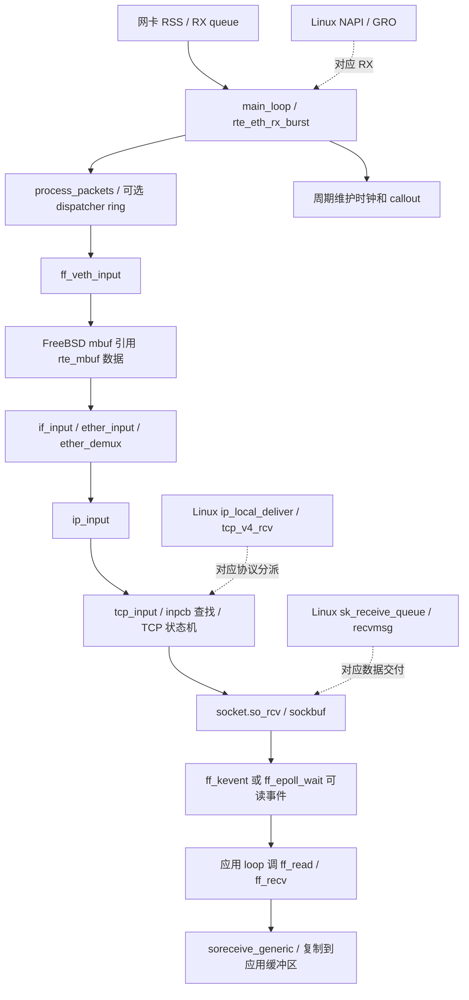

# F-Stack：保留成熟 TCP，把运行环境换成单核进程与 DPDK

- 固定版本：tag **`1.24`**（没有 `v` 前缀），commit **`a7f935c73472941f8a38de0b73ffbc4297acee68`**。
- 官方源码：[F-Stack/f-stack 固定快照](https://github.com/F-Stack/f-stack/tree/a7f935c73472941f8a38de0b73ffbc4297acee68)。阅读日期：2026-10-02。
- Linux 对照：本地 `v6.18`，commit `7d0a66e4bb9081d75c82ec4957c50034cb0ea449`。
- 范围：IPv4、普通 `ff_*` socket API、仓库自带配置（`functions_default=freebsd`）；区分普通构建与 `FF_USE_PAGE_ARRAY` 等条件分支。只做源码核查，未编译或测性能。链接均为固定 commit 的 `文件路径:行号`。
- FreeBSD 基线以随仓库代码为准：`__FreeBSD_version=1300139`；README 中同时留有不同历史版本描述，不能以旧宣传段落给当前代码定版。[freebsd/sys/param.h:63](https://github.com/F-Stack/f-stack/blob/a7f935c73472941f8a38de0b73ffbc4297acee68/freebsd/sys/param.h#L63)

核心洞见：移植内核 TCP 不等于保留内核的调度、锁和用户/内核边界。F-Stack 保留 `inpcb → tcpcb → socket/sockbuf` 体系，把执行收敛到每进程的轮询循环，连 mutex 操作也替换成空宏。它证明“更换运行模型”与“重新实现协议”是两件事。[freebsd/netinet/tcp_input.c:875](https://github.com/F-Stack/f-stack/blob/a7f935c73472941f8a38de0b73ffbc4297acee68/freebsd/netinet/tcp_input.c#L875) [lib/ff_dpdk_if.c:2035](https://github.com/F-Stack/f-stack/blob/a7f935c73472941f8a38de0b73ffbc4297acee68/lib/ff_dpdk_if.c#L2035) [lib/include/sys/mutex.h:59](https://github.com/F-Stack/f-stack/blob/a7f935c73472941f8a38de0b73ffbc4297acee68/lib/include/sys/mutex.h#L59)

## 1. 从 DPDK 收包到应用

| 路径段 | 已核验的调用依据 |
| --- | --- |
| 网卡到移植层 | `main_loop` burst RX 后逐包调用 `process_packets`；随后 `ff_veth_input` 包装 mbuf。[lib/ff_dpdk_if.c:2137](https://github.com/F-Stack/f-stack/blob/a7f935c73472941f8a38de0b73ffbc4297acee68/lib/ff_dpdk_if.c#L2137) [lib/ff_dpdk_if.c:1441](https://github.com/F-Stack/f-stack/blob/a7f935c73472941f8a38de0b73ffbc4297acee68/lib/ff_dpdk_if.c#L1441) [lib/ff_dpdk_if.c:1268](https://github.com/F-Stack/f-stack/blob/a7f935c73472941f8a38de0b73ffbc4297acee68/lib/ff_dpdk_if.c#L1268) |
| L2/L3 | `ff_veth_process_packet` 调 `ifp->if_input`；`ether_ifattach` 安装 `ether_input`，EtherType 决定 `NETISR_IP`。此快照 netisr 默认 direct dispatch，不意味着每层都切线程。[lib/ff_veth.c:418](https://github.com/F-Stack/f-stack/blob/a7f935c73472941f8a38de0b73ffbc4297acee68/lib/ff_veth.c#L418) [freebsd/net/if_ethersubr.c:979](https://github.com/F-Stack/f-stack/blob/a7f935c73472941f8a38de0b73ffbc4297acee68/freebsd/net/if_ethersubr.c#L979) [freebsd/net/if_ethersubr.c:903](https://github.com/F-Stack/f-stack/blob/a7f935c73472941f8a38de0b73ffbc4297acee68/freebsd/net/if_ethersubr.c#L903) [freebsd/net/netisr.c:152](https://github.com/F-Stack/f-stack/blob/a7f935c73472941f8a38de0b73ffbc4297acee68/freebsd/net/netisr.c#L152) |
| IP/TCP | `ip_input` 经协议表调用 TCP；`tcp_input` 查 PCB，把有效流数据加入接收 sockbuf。[freebsd/netinet/ip_input.c:829](https://github.com/F-Stack/f-stack/blob/a7f935c73472941f8a38de0b73ffbc4297acee68/freebsd/netinet/ip_input.c#L829) [freebsd/netinet/tcp_input.c:613](https://github.com/F-Stack/f-stack/blob/a7f935c73472941f8a38de0b73ffbc4297acee68/freebsd/netinet/tcp_input.c#L613) [freebsd/netinet/tcp_input.c:1930](https://github.com/F-Stack/f-stack/blob/a7f935c73472941f8a38de0b73ffbc4297acee68/freebsd/netinet/tcp_input.c#L1930) |
| 应用 | 示例在 `ff_run` 回调内调用 kqueue、`ff_read`、`ff_write`；普通 `ff_recvfrom` 调 `kern_recvit(..., UIO_SYSSPACE, ...)`。[example/main.c:64](https://github.com/F-Stack/f-stack/blob/a7f935c73472941f8a38de0b73ffbc4297acee68/example/main.c#L64) [example/main.c:108](https://github.com/F-Stack/f-stack/blob/a7f935c73472941f8a38de0b73ffbc4297acee68/example/main.c#L108) [example/main.c:198](https://github.com/F-Stack/f-stack/blob/a7f935c73472941f8a38de0b73ffbc4297acee68/example/main.c#L198) [lib/ff_syscall_wrapper.c:1096](https://github.com/F-Stack/f-stack/blob/a7f935c73472941f8a38de0b73ffbc4297acee68/lib/ff_syscall_wrapper.c#L1096) |
| Linux 对应 | NAPI poll、TCP RX、普通 `tcp_recvmsg` 是对应职责，不是一一相同的调用。[net/core/dev.c:7745](https://github.com/torvalds/linux/blob/7d0a66e4bb9081d75c82ec4957c50034cb0ea449/net/core/dev.c#L7745) [net/ipv4/tcp_ipv4.c:2202](https://github.com/torvalds/linux/blob/7d0a66e4bb9081d75c82ec4957c50034cb0ea449/net/ipv4/tcp_ipv4.c#L2202) [net/ipv4/tcp.c:2913](https://github.com/torvalds/linux/blob/7d0a66e4bb9081d75c82ec4957c50034cb0ea449/net/ipv4/tcp.c#L2913) |

## 2. 包缓冲区与零拷贝边界

`rte_mbuf` 负责驱动侧收发；FreeBSD `mbuf` 携带协议侧链、包头、外部存储引用。RX 的 `ff_mbuf_gethdr` / `ff_mbuf_get` 用 `m_extadd` 引用 DPDK 数据，析构回调再释放对应 DPDK buffer，因此这一段不复制 payload，但仍分配 FreeBSD mbuf 元数据。[freebsd/sys/mbuf.h:312](https://github.com/F-Stack/f-stack/blob/a7f935c73472941f8a38de0b73ffbc4297acee68/freebsd/sys/mbuf.h#L312) [lib/ff_veth.c:302](https://github.com/F-Stack/f-stack/blob/a7f935c73472941f8a38de0b73ffbc4297acee68/lib/ff_veth.c#L302) [lib/ff_veth.c:367](https://github.com/F-Stack/f-stack/blob/a7f935c73472941f8a38de0b73ffbc4297acee68/lib/ff_veth.c#L367) [lib/ff_veth.c:395](https://github.com/F-Stack/f-stack/blob/a7f935c73472941f8a38de0b73ffbc4297acee68/lib/ff_veth.c#L395)

普通 socket RX 仍复制：默认 `pru_soreceive` 补为 `soreceive_generic`，执行 `uiomove`，`UIO_SYSSPACE` 分支执行 `bcopy`。可选 `tcp_soreceive_stream` 才切换到 `soreceive_stream → m_mbuftouio`，同样有复制路径。在同一地址空间调用类似 syscall 的函数，只消除了特权切换，没有自动消除字节流 API 的复制。[freebsd/kern/uipc_domain.c:157](https://github.com/F-Stack/f-stack/blob/a7f935c73472941f8a38de0b73ffbc4297acee68/freebsd/kern/uipc_domain.c#L157) [freebsd/kern/uipc_socket.c:2206](https://github.com/F-Stack/f-stack/blob/a7f935c73472941f8a38de0b73ffbc4297acee68/freebsd/kern/uipc_socket.c#L2206) [freebsd/kern/subr_uio.c:260](https://github.com/F-Stack/f-stack/blob/a7f935c73472941f8a38de0b73ffbc4297acee68/freebsd/kern/subr_uio.c#L260) [freebsd/netinet/tcp_subr.c:1207](https://github.com/F-Stack/f-stack/blob/a7f935c73472941f8a38de0b73ffbc4297acee68/freebsd/netinet/tcp_subr.c#L1207) [freebsd/kern/uipc_socket.c:2567](https://github.com/F-Stack/f-stack/blob/a7f935c73472941f8a38de0b73ffbc4297acee68/freebsd/kern/uipc_socket.c#L2567)

普通 TX 的 `ff_dpdk_if_send` 新建 `rte_mbuf`，用 `ff_mbuf_copydata` 复制 FreeBSD mbuf 数据。`FF_USE_PAGE_ARRAY` 是另一个编译分支，在 Makefile 中默认注释；不能把此优化路径推广到所有构建。还有独立 `FF_ZC_SEND` 选项；`ff_zc_mbuf_write` 自身仍 `bcopy`，`ff_zc_mbuf_read` 是 TODO，所以函数名称不是端到端零拷贝证据。[lib/ff_dpdk_if.c:1865](https://github.com/F-Stack/f-stack/blob/a7f935c73472941f8a38de0b73ffbc4297acee68/lib/ff_dpdk_if.c#L1865) [lib/ff_dpdk_if.c:1910](https://github.com/F-Stack/f-stack/blob/a7f935c73472941f8a38de0b73ffbc4297acee68/lib/ff_dpdk_if.c#L1910) [lib/Makefile:46](https://github.com/F-Stack/f-stack/blob/a7f935c73472941f8a38de0b73ffbc4297acee68/lib/Makefile#L46) [lib/Makefile:203](https://github.com/F-Stack/f-stack/blob/a7f935c73472941f8a38de0b73ffbc4297acee68/lib/Makefile#L203) [lib/ff_veth.c:327](https://github.com/F-Stack/f-stack/blob/a7f935c73472941f8a38de0b73ffbc4297acee68/lib/ff_veth.c#L327) [lib/ff_veth.c:360](https://github.com/F-Stack/f-stack/blob/a7f935c73472941f8a38de0b73ffbc4297acee68/lib/ff_veth.c#L360)

对照 `sk_buff`：两者都有“元数据与实际数据存储分离”的能力，Linux 还通过 `skb_shared_info` 管理 fragments。用户态不必把包布局简化成一个连续数组；真正要明确的是谁持有数据、谁负责最终释放，以及 stream API 在哪一层复制。[include/linux/skbuff.h:593](https://github.com/torvalds/linux/blob/7d0a66e4bb9081d75c82ec4957c50034cb0ea449/include/linux/skbuff.h#L593) [include/linux/skbuff.h:885](https://github.com/torvalds/linux/blob/7d0a66e4bb9081d75c82ec4957c50034cb0ea449/include/linux/skbuff.h#L885)

## 3. 连接查找：进程内 PCB 哈希，RSS 是另一层哈希

`inpcbinfo.ipi_hashbase` 是桶数组，桶里是 `inpcb` 的 `CK_LIST`；IPv4 的 `INP_PCBHASH` 用远端地址与两个端口的 XOR/折叠结果取掩码。哈希不含本地地址，但桶内匹配会核对完整地址与端口，不能把“hash 输入较少”误认为“只匹配三元组”。[freebsd/netinet/in_pcb.h:491](https://github.com/F-Stack/f-stack/blob/a7f935c73472941f8a38de0b73ffbc4297acee68/freebsd/netinet/in_pcb.h#L491) [freebsd/netinet/in_pcb.h:673](https://github.com/F-Stack/f-stack/blob/a7f935c73472941f8a38de0b73ffbc4297acee68/freebsd/netinet/in_pcb.h#L673) [freebsd/netinet/in_pcb.c:2424](https://github.com/F-Stack/f-stack/blob/a7f935c73472941f8a38de0b73ffbc4297acee68/freebsd/netinet/in_pcb.c#L2424)

进程根据 `proc_id → lcore → RX/TX queue` 运行自己的协议状态。这与所有核竞争一个全局 TCP 表不同；DPDK ring/mempool 可以跨进程共享，不能据此推断 PCB 也共享。[lib/ff_dpdk_if.c:255](https://github.com/F-Stack/f-stack/blob/a7f935c73472941f8a38de0b73ffbc4297acee68/lib/ff_dpdk_if.c#L255) [lib/ff_dpdk_if.c:264](https://github.com/F-Stack/f-stack/blob/a7f935c73472941f8a38de0b73ffbc4297acee68/lib/ff_dpdk_if.c#L264) [lib/ff_dpdk_if.c:285](https://github.com/F-Stack/f-stack/blob/a7f935c73472941f8a38de0b73ffbc4297acee68/lib/ff_dpdk_if.c#L285)

`ff_rss_check` 另用 Toeplitz hash 预测四元组对应的 NIC 队列；主动连接自动选端口时，`in_pcbconnect_setup` 内反复选端口，直到反方向流量落到当前队列。**PCB hash 用来找连接；RSS hash 用来选连接的执行者，两者不是同一张表。**[lib/ff_dpdk_if.c:2291](https://github.com/F-Stack/f-stack/blob/a7f935c73472941f8a38de0b73ffbc4297acee68/lib/ff_dpdk_if.c#L2291) [freebsd/netinet/in_pcb.c:1508](https://github.com/F-Stack/f-stack/blob/a7f935c73472941f8a38de0b73ffbc4297acee68/freebsd/netinet/in_pcb.c#L1508)

## 4. 定时器：DPDK 提供节拍，TCP 仍使用移植的时间轮

| 对象 | 机制和时间来源 |
| --- | --- |
| 时钟驱动 | `init_clock` 按 `rte_get_timer_hz()` 注册周期 `rte_timer`；轮询循环检查 TSC 并调用 `rte_timer_manage`；回调 `ff_hardclock` 增加 `ticks` 后执行 `callout_tick`。仓库配置 `hz=100`，即目标节拍 10ms，实际执行受轮询延迟影响。[lib/ff_dpdk_if.c:856](https://github.com/F-Stack/f-stack/blob/a7f935c73472941f8a38de0b73ffbc4297acee68/lib/ff_dpdk_if.c#L856) [lib/ff_dpdk_if.c:2062](https://github.com/F-Stack/f-stack/blob/a7f935c73472941f8a38de0b73ffbc4297acee68/lib/ff_dpdk_if.c#L2062) [lib/ff_kern_timeout.c:1204](https://github.com/F-Stack/f-stack/blob/a7f935c73472941f8a38de0b73ffbc4297acee68/lib/ff_kern_timeout.c#L1204) [config.ini:235](https://github.com/F-Stack/f-stack/blob/a7f935c73472941f8a38de0b73ffbc4297acee68/config.ini#L235) |
| RTO | `tcp_timer_activate(TT_REXMT)` 选择 `tcp_timer_rexmt`，交给 `callout_reset_on`。[freebsd/netinet/tcp_timer.c:893](https://github.com/F-Stack/f-stack/blob/a7f935c73472941f8a38de0b73ffbc4297acee68/freebsd/netinet/tcp_timer.c#L893) [freebsd/netinet/tcp_timer.c:913](https://github.com/F-Stack/f-stack/blob/a7f935c73472941f8a38de0b73ffbc4297acee68/freebsd/netinet/tcp_timer.c#L913) |
| delayed ACK | `TT_DELACK → tcp_timer_delack`，同一 callout 体系。[freebsd/netinet/tcp_timer.c:270](https://github.com/F-Stack/f-stack/blob/a7f935c73472941f8a38de0b73ffbc4297acee68/freebsd/netinet/tcp_timer.c#L270) [freebsd/netinet/tcp_timer.c:909](https://github.com/F-Stack/f-stack/blob/a7f935c73472941f8a38de0b73ffbc4297acee68/freebsd/netinet/tcp_timer.c#L909) |
| callout 容器 | `cc_callwheel` 的桶链表；`ticks + delta` 为到期时间，通过 `time & callwheelmask` 入桶。这里是移植后的单个 `cc_cpu`，不要照抄原 FreeBSD 注释写成完整多 CPU 调度。[lib/ff_kern_timeout.c:143](https://github.com/F-Stack/f-stack/blob/a7f935c73472941f8a38de0b73ffbc4297acee68/lib/ff_kern_timeout.c#L143) [lib/ff_kern_timeout.c:165](https://github.com/F-Stack/f-stack/blob/a7f935c73472941f8a38de0b73ffbc4297acee68/lib/ff_kern_timeout.c#L165) [lib/ff_kern_timeout.c:298](https://github.com/F-Stack/f-stack/blob/a7f935c73472941f8a38de0b73ffbc4297acee68/lib/ff_kern_timeout.c#L298) [lib/ff_kern_timeout.c:351](https://github.com/F-Stack/f-stack/blob/a7f935c73472941f8a38de0b73ffbc4297acee68/lib/ff_kern_timeout.c#L351) |
| TIME_WAIT | 真正 TIME_WAIT 是 `tcptw` 的 `V_twq_2msl` TAILQ；`tw_time=ticks+2*tcp_msl`，`tcp_slowtimo` 扫描队首。**不是每个 TIME_WAIT 都挂 `tt_2msl` callout**；该 timer 另处理尚未压缩的控制块关闭状态。[freebsd/netinet/tcp_timewait.c:659](https://github.com/F-Stack/f-stack/blob/a7f935c73472941f8a38de0b73ffbc4297acee68/freebsd/netinet/tcp_timewait.c#L659) [freebsd/netinet/tcp_timewait.c:703](https://github.com/F-Stack/f-stack/blob/a7f935c73472941f8a38de0b73ffbc4297acee68/freebsd/netinet/tcp_timewait.c#L703) [freebsd/netinet/tcp_timer.c:247](https://github.com/F-Stack/f-stack/blob/a7f935c73472941f8a38de0b73ffbc4297acee68/freebsd/netinet/tcp_timer.c#L247) [freebsd/netinet/tcp_timer.c:309](https://github.com/F-Stack/f-stack/blob/a7f935c73472941f8a38de0b73ffbc4297acee68/freebsd/netinet/tcp_timer.c#L309) |

下层 DPDK timer 实际用 skiplist 管理，不能因此把 TCP 定时容器也叫 skiplist。栈内 timecounter 取 TSC 换算时间，`CLOCK_REALTIME` 只另行更新缓存墙钟。[dpdk/lib/timer/rte_timer.c:351](https://github.com/F-Stack/f-stack/blob/a7f935c73472941f8a38de0b73ffbc4297acee68/dpdk/lib/timer/rte_timer.c#L351) [lib/ff_kern_timeout.c:1217](https://github.com/F-Stack/f-stack/blob/a7f935c73472941f8a38de0b73ffbc4297acee68/lib/ff_kern_timeout.c#L1217) [lib/ff_host_interface.c:205](https://github.com/F-Stack/f-stack/blob/a7f935c73472941f8a38de0b73ffbc4297acee68/lib/ff_host_interface.c#L205)

## 5. 线程、进程与 RSS

主模型是多个绑定 CPU 的进程，各自运行网络循环与应用回调。RX burst、定时器推进和 `lr->loop` 串行出现于同一 `main_loop`；应用长时间占用回调，会推迟该进程收包和到期处理，这是从执行顺序得出的设计限制。[lib/ff_dpdk_if.c:2035](https://github.com/F-Stack/f-stack/blob/a7f935c73472941f8a38de0b73ffbc4297acee68/lib/ff_dpdk_if.c#L2035) [lib/ff_dpdk_if.c:2167](https://github.com/F-Stack/f-stack/blob/a7f935c73472941f8a38de0b73ffbc4297acee68/lib/ff_dpdk_if.c#L2167) [lib/ff_config.c:116](https://github.com/F-Stack/f-stack/blob/a7f935c73472941f8a38de0b73ffbc4297acee68/lib/ff_config.c#L116)

它利用单执行者假设把 mutex 操作替换为空操作，不能当成可让任意 pthread 并发调用同一 socket 的 BSD 栈。RSS key、可用 flow-type 和队列数在设备初始化时协商；可选 packet dispatcher 能通过 ring 把包转给其他队列，但这是显式额外路径。[lib/include/sys/mutex.h:59](https://github.com/F-Stack/f-stack/blob/a7f935c73472941f8a38de0b73ffbc4297acee68/lib/include/sys/mutex.h#L59) [lib/ff_dpdk_if.c:660](https://github.com/F-Stack/f-stack/blob/a7f935c73472941f8a38de0b73ffbc4297acee68/lib/ff_dpdk_if.c#L660) [lib/ff_dpdk_if.c:1465](https://github.com/F-Stack/f-stack/blob/a7f935c73472941f8a38de0b73ffbc4297acee68/lib/ff_dpdk_if.c#L1465)

## 6. TCP 实现完整度

| 能力 | 1.24 源码结论 |
| --- | --- |
| 拥塞控制 | 构建列入 NewReno、HTCP、CUBIC；FreeBSD 初始默认指针是 NewReno，**随仓库 `config.ini` 将算法改成 CUBIC**。另有默认编入的可选 RACK/BBR TCP function blocks，仓库仍选 `functions_default=freebsd`；这是另一层协议实现选择，不能与 `cc.algorithm` 混为一谈。实际运行取决于装载的配置。[lib/Makefile:51](https://github.com/F-Stack/f-stack/blob/a7f935c73472941f8a38de0b73ffbc4297acee68/lib/Makefile#L51) [lib/Makefile:551](https://github.com/F-Stack/f-stack/blob/a7f935c73472941f8a38de0b73ffbc4297acee68/lib/Makefile#L551) [config.ini:288](https://github.com/F-Stack/f-stack/blob/a7f935c73472941f8a38de0b73ffbc4297acee68/config.ini#L288) [freebsd/netinet/tcp_stacks/bbr.c:14925](https://github.com/F-Stack/f-stack/blob/a7f935c73472941f8a38de0b73ffbc4297acee68/freebsd/netinet/tcp_stacks/bbr.c#L14925)[lib/Makefile:505](https://github.com/F-Stack/f-stack/blob/a7f935c73472941f8a38de0b73ffbc4297acee68/lib/Makefile#L505) [freebsd/netinet/cc/cc.c:87](https://github.com/F-Stack/f-stack/blob/a7f935c73472941f8a38de0b73ffbc4297acee68/freebsd/netinet/cc/cc.c#L87) [config.ini:265](https://github.com/F-Stack/f-stack/blob/a7f935c73472941f8a38de0b73ffbc4297acee68/config.ini#L265) |
| SACK | 有收端 SACK block 维护与发端 `tcp_sack_doack`/恢复；配置启用。[freebsd/netinet/tcp_input.c:2301](https://github.com/F-Stack/f-stack/blob/a7f935c73472941f8a38de0b73ffbc4297acee68/freebsd/netinet/tcp_input.c#L2301) [freebsd/netinet/tcp_input.c:2498](https://github.com/F-Stack/f-stack/blob/a7f935c73472941f8a38de0b73ffbc4297acee68/freebsd/netinet/tcp_input.c#L2498) [config.ini:272](https://github.com/F-Stack/f-stack/blob/a7f935c73472941f8a38de0b73ffbc4297acee68/config.ini#L272) |
| 窗口缩放、时间戳 | option parser 实际处理 WINDOW 和 TIMESTAMP；RFC1323 默认开、配置也开。[freebsd/netinet/tcp_input.c:3445](https://github.com/F-Stack/f-stack/blob/a7f935c73472941f8a38de0b73ffbc4297acee68/freebsd/netinet/tcp_input.c#L3445) [freebsd/netinet/tcp_input.c:3453](https://github.com/F-Stack/f-stack/blob/a7f935c73472941f8a38de0b73ffbc4297acee68/freebsd/netinet/tcp_input.c#L3453) [freebsd/netinet/tcp_subr.c:254](https://github.com/F-Stack/f-stack/blob/a7f935c73472941f8a38de0b73ffbc4297acee68/freebsd/netinet/tcp_subr.c#L254) [config.ini:276](https://github.com/F-Stack/f-stack/blob/a7f935c73472941f8a38de0b73ffbc4297acee68/config.ini#L276) |
| TSO / checksum | DPDK 能力检测与 FreeBSD `IFCAP_TSO` 桥接存在，但配置 `tso=0` 默认关闭 TSO。依赖 NIC 能力和开关。[lib/ff_dpdk_if.c:736](https://github.com/F-Stack/f-stack/blob/a7f935c73472941f8a38de0b73ffbc4297acee68/lib/ff_dpdk_if.c#L736) [lib/ff_veth.c:857](https://github.com/F-Stack/f-stack/blob/a7f935c73472941f8a38de0b73ffbc4297acee68/lib/ff_veth.c#L857) [config.ini:21](https://github.com/F-Stack/f-stack/blob/a7f935c73472941f8a38de0b73ffbc4297acee68/config.ini#L21) |
| LRO | `tcp_lro.c` 被编译不等于接收路径已启用。DPDK 硬件 LRO 配置块明确 `#if 0`；本次未确认另有接入此 RX 路径的软件 LRO 调用，不能记为实际开启。[lib/Makefile:493](https://github.com/F-Stack/f-stack/blob/a7f935c73472941f8a38de0b73ffbc4297acee68/lib/Makefile#L493) [lib/ff_dpdk_if.c:697](https://github.com/F-Stack/f-stack/blob/a7f935c73472941f8a38de0b73ffbc4297acee68/lib/ff_dpdk_if.c#L697) |

这里的“完整度较高”仅相对本次另三种实现的上述能力；没有做 RFC 一致性认证，也不意味着任意 FreeBSD 功能移植后都可用。

## 7. 应用 API 及代价

提供 `ff_socket` / `ff_read` / `ff_recv` 等 BSD 风格接口和 kqueue；epoll 包装翻译到 kqueue，`ff_epoll_wait` 的这条实现没有把 `timeout` 传成阻塞等待时间，实际由主循环持续调用。`ff_kevent_do_each` 明确给 `kern_kevent` 传零 timeout。与 Linux epoll 的阻塞、调度语义不能完全等同。[lib/ff_syscall_wrapper.c:1428](https://github.com/F-Stack/f-stack/blob/a7f935c73472941f8a38de0b73ffbc4297acee68/lib/ff_syscall_wrapper.c#L1428)[lib/ff_api.h:100](https://github.com/F-Stack/f-stack/blob/a7f935c73472941f8a38de0b73ffbc4297acee68/lib/ff_api.h#L100) [lib/ff_api.h:126](https://github.com/F-Stack/f-stack/blob/a7f935c73472941f8a38de0b73ffbc4297acee68/lib/ff_api.h#L126) [lib/ff_api.h:137](https://github.com/F-Stack/f-stack/blob/a7f935c73472941f8a38de0b73ffbc4297acee68/lib/ff_api.h#L137) [lib/ff_epoll.c:148](https://github.com/F-Stack/f-stack/blob/a7f935c73472941f8a38de0b73ffbc4297acee68/lib/ff_epoll.c#L148)

优势是能保留大量现成应用的数据流和 socket 代码；代价是普通 stream copy、socket/PCB 层次和兼容封装仍然存在，应用还须融入 `ff_run` 的执行模型。对 utcp 而言，这条路线适合“迁移应用成本比极简协议代码更重要”的目标；这是基于 API 和运行方式的设计推断。[lib/ff_init.c:59](https://github.com/F-Stack/f-stack/blob/a7f935c73472941f8a38de0b73ffbc4297acee68/lib/ff_init.c#L59) [lib/ff_syscall_wrapper.c:1070](https://github.com/F-Stack/f-stack/blob/a7f935c73472941f8a38de0b73ffbc4297acee68/lib/ff_syscall_wrapper.c#L1070) [example/main.c:198](https://github.com/F-Stack/f-stack/blob/a7f935c73472941f8a38de0b73ffbc4297acee68/example/main.c#L198)

## 8. 相比内核省了什么，为什么能省

| 省略或替换 | 能成立的前提 / 保留的成本 |
| --- | --- |
| NIC IRQ/softirq 主路径换成 DPDK poll | 进程获得专用队列和 CPU 时间；仍有轮询成本、队列耗尽和 NUMA 问题。源码显示 burst 与预取，没有为本次机器测量收益。[lib/ff_dpdk_if.c:2137](https://github.com/F-Stack/f-stack/blob/a7f935c73472941f8a38de0b73ffbc4297acee68/lib/ff_dpdk_if.c#L2137) |
| 内核锁替换为 no-op | 同一协议实例按串行方式执行；不能推出任意线程安全。[lib/include/sys/mutex.h:59](https://github.com/F-Stack/f-stack/blob/a7f935c73472941f8a38de0b73ffbc4297acee68/lib/include/sys/mutex.h#L59) |
| syscall 边界换成库函数 | 同一进程地址空间内运行，但保留 `kern_recvit` / sockbuf / 数据复制。[lib/ff_syscall_wrapper.c:1096](https://github.com/F-Stack/f-stack/blob/a7f935c73472941f8a38de0b73ffbc4297acee68/lib/ff_syscall_wrapper.c#L1096) [freebsd/kern/subr_uio.c:260](https://github.com/F-Stack/f-stack/blob/a7f935c73472941f8a38de0b73ffbc4297acee68/freebsd/kern/subr_uio.c#L260) |
| 通用调度换成显式回调 | 应用必须及时归还执行权；协议 timers 和包处理共享预算。[lib/ff_dpdk_if.c:2167](https://github.com/F-Stack/f-stack/blob/a7f935c73472941f8a38de0b73ffbc4297acee68/lib/ff_dpdk_if.c#L2167) |
| 保留成熟 TCP 状态机 | 省开发协议细节的工作，却继承 FreeBSD 数据结构、移植兼容层和上游同步负担；维护负担是由保留代码层次作出的推断。[lib/Makefile:490](https://github.com/F-Stack/f-stack/blob/a7f935c73472941f8a38de0b73ffbc4297acee68/lib/Makefile#L490) [lib/ff_syscall_wrapper.c:1070](https://github.com/F-Stack/f-stack/blob/a7f935c73472941f8a38de0b73ffbc4297acee68/lib/ff_syscall_wrapper.c#L1070) |

## 9. 它怎样测试，可借鉴什么

已确认仓库提供：HTTP 示例的 accept/read/write/kqueue 流程、Nginx CPS/RPS/带宽测试结果说明，以及每核 pcap dump。它们分别适合应用互通冒烟测试、性能回归和线上包证据。[example/main.c:64](https://github.com/F-Stack/f-stack/blob/a7f935c73472941f8a38de0b73ffbc4297acee68/example/main.c#L64) [example/main.c:108](https://github.com/F-Stack/f-stack/blob/a7f935c73472941f8a38de0b73ffbc4297acee68/example/main.c#L108) [README.md:155](https://github.com/F-Stack/f-stack/blob/a7f935c73472941f8a38de0b73ffbc4297acee68/README.md#L155) [lib/ff_dpdk_pcap.c:56](https://github.com/F-Stack/f-stack/blob/a7f935c73472941f8a38de0b73ffbc4297acee68/lib/ff_dpdk_pcap.c#L56)

**未确认**：这个 tag 下有覆盖 TCP 乱序、重传、TIME_WAIT 状态的专用自动化回归套件。检索了项目测试路径、`packetdrill`/pcap 相关代码；仓库附带 DPDK、Redis、libxo 的测试不能自动算作 F-Stack TCP 的协议测试覆盖。README 的性能图也不能证明 Linux 6.18 的性能上限，其说明使用的是 Linux 3.10 环境，并区分了 IRQ affinity/reuseport 配置。[README.md:157](https://github.com/F-Stack/f-stack/blob/a7f935c73472941f8a38de0b73ffbc4297acee68/README.md#L157) [README.md:165](https://github.com/F-Stack/f-stack/blob/a7f935c73472941f8a38de0b73ffbc4297acee68/README.md#L165)

给 utcp 的启示（建议，不是 F-Stack 已实现的测试）：单独测试 `rte_mbuf ↔ mbuf` 生命周期、普通/TSO 输出、RSS 反向流归核、多进程端口分配；此外仍须建立可注入报文和虚拟时钟的协议测试，不能仅用 HTTP 吞吐证明正确性。对应风险来自本节和缓冲区/RSS/timer 的上述证据。

## 最值得带走的取舍

最大价值是用成熟协议实现缩短开发路径，再用单执行者与 DPDK 改变运行成本；最大局限是兼容结构和复制边界仍在，且正确性依赖串行调用与稳定分流。先读 `ff_dpdk_if.c` 的 `main_loop`、`ff_veth.c` 的包装，再读 `in_pcb.c` 的 RSS 选端口，比先钻进整个 FreeBSD TCP 更容易看清这条路线。[lib/ff_dpdk_if.c:2035](https://github.com/F-Stack/f-stack/blob/a7f935c73472941f8a38de0b73ffbc4297acee68/lib/ff_dpdk_if.c#L2035) [lib/ff_veth.c:367](https://github.com/F-Stack/f-stack/blob/a7f935c73472941f8a38de0b73ffbc4297acee68/lib/ff_veth.c#L367) [freebsd/netinet/in_pcb.c:1508](https://github.com/F-Stack/f-stack/blob/a7f935c73472941f8a38de0b73ffbc4297acee68/freebsd/netinet/in_pcb.c#L1508)
