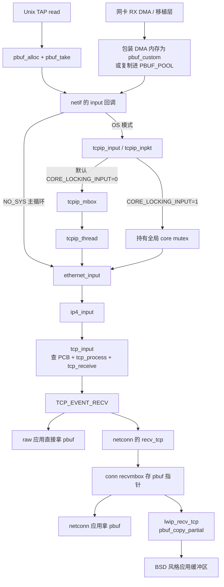

# lwIP：把 TCP 压缩到一个可串行推进的状态机

核查日期：2026-10-02。

版本固定：`STABLE-2_2_0_RELEASE`，commit [`0a0452b2c39bdd91e252aef045c115f88f6ca773`](https://github.com/lwip-tcpip/lwip/tree/0a0452b2c39bdd91e252aef045c115f88f6ca773)。源码检出于 `/tmp/utcp-stack-research/lwip`。Linux 对照固定为本地 v6.18，commit `7d0a66e4bb9081d75c82ec4957c50034cb0ea449`。下文符号均先经 `rg -n` 确认，再读调用点、定义及条件编译；未运行构建或测试。所谓“默认”指此版本 `src/include/lwip/opt.h` 的后备默认值，应用的 `lwipopts.h` 可以覆盖。

lwIP 最值得 utcp 借鉴的是：**协议逻辑只需要一份串行状态，应用接口和网卡接口都是外接适配层**。raw 回调直接消费 `pbuf`；netconn/socket 在同一核心上叠加消息队列、阻塞语义和拷贝。少量连接时，这使状态、生命周期和错误路径都容易读懂。代价是核心本身没有随 CPU 数量扩展的连接分片机制。证据：[src/api/tcpip.c:127](https://github.com/lwip-tcpip/lwip/blob/0a0452b2c39bdd91e252aef045c115f88f6ca773/src/api/tcpip.c#L127)、[src/api/api_msg.c:296](https://github.com/lwip-tcpip/lwip/blob/0a0452b2c39bdd91e252aef045c115f88f6ca773/src/api/api_msg.c#L296)、[src/api/sockets.c:958](https://github.com/lwip-tcpip/lwip/blob/0a0452b2c39bdd91e252aef045c115f88f6ca773/src/api/sockets.c#L958)、[src/core/tcp_in.c:250](https://github.com/lwip-tcpip/lwip/blob/0a0452b2c39bdd91e252aef045c115f88f6ca773/src/core/tcp_in.c#L250)。

## 1. 整体架构与 Linux 对应

lwIP 是可嵌入的协议库，不以 DPDK 为前提。网卡移植层把一帧交给 `netif->input`：模板 `ethernetif_input()` 的边界在 [contrib/examples/ethernetif/ethernetif.c:256](https://github.com/lwip-tcpip/lwip/blob/0a0452b2c39bdd91e252aef045c115f88f6ca773/contrib/examples/ethernetif/ethernetif.c#L256)。模板内 `low_level_input()` 含未填好的硬件伪代码，不能当成已实现的某块网卡驱动；DMA 零拷贝示例也只是移植示例。这个边界以下的真实硬件描述符处理由具体 port 提供。证据：[contrib/examples/ethernetif/ethernetif.c:185](https://github.com/lwip-tcpip/lwip/blob/0a0452b2c39bdd91e252aef045c115f88f6ca773/contrib/examples/ethernetif/ethernetif.c#L185)、[doc/ZeroCopyRx.c:25](https://github.com/lwip-tcpip/lwip/blob/0a0452b2c39bdd91e252aef045c115f88f6ca773/doc/ZeroCopyRx.c#L25)。

图中边的依据：Unix TAP 的 `read→pbuf_take` 在 [contrib/ports/unix/port/netif/tapif.c:262](https://github.com/lwip-tcpip/lwip/blob/0a0452b2c39bdd91e252aef045c115f88f6ca773/contrib/ports/unix/port/netif/tapif.c#L262)；`tcpip_input→tcpip_inpkt` 在 [src/api/tcpip.c:288](https://github.com/lwip-tcpip/lwip/blob/0a0452b2c39bdd91e252aef045c115f88f6ca773/src/api/tcpip.c#L288)，入队和可选持锁直调在 [src/api/tcpip.c:245](https://github.com/lwip-tcpip/lwip/blob/0a0452b2c39bdd91e252aef045c115f88f6ca773/src/api/tcpip.c#L245)，线程取消息与执行输入函数在 [src/api/tcpip.c:139](https://github.com/lwip-tcpip/lwip/blob/0a0452b2c39bdd91e252aef045c115f88f6ca773/src/api/tcpip.c#L139)、[src/api/tcpip.c:177](https://github.com/lwip-tcpip/lwip/blob/0a0452b2c39bdd91e252aef045c115f88f6ca773/src/api/tcpip.c#L177)；Ethernet→IPv4→TCP 在 [src/netif/ethernet.c:170](https://github.com/lwip-tcpip/lwip/blob/0a0452b2c39bdd91e252aef045c115f88f6ca773/src/netif/ethernet.c#L170)、[src/core/ipv4/ip4.c:728](https://github.com/lwip-tcpip/lwip/blob/0a0452b2c39bdd91e252aef045c115f88f6ca773/src/core/ipv4/ip4.c#L728)；状态机完成后才调用应用回调，在 [src/core/tcp_in.c:437](https://github.com/lwip-tcpip/lwip/blob/0a0452b2c39bdd91e252aef045c115f88f6ca773/src/core/tcp_in.c#L437)、[src/core/tcp_in.c:500](https://github.com/lwip-tcpip/lwip/blob/0a0452b2c39bdd91e252aef045c115f88f6ca773/src/core/tcp_in.c#L500)；netconn 的适配注册、投递和取包在 [src/api/api_msg.c:517](https://github.com/lwip-tcpip/lwip/blob/0a0452b2c39bdd91e252aef045c115f88f6ca773/src/api/api_msg.c#L517)、[src/api/api_msg.c:326](https://github.com/lwip-tcpip/lwip/blob/0a0452b2c39bdd91e252aef045c115f88f6ca773/src/api/api_msg.c#L326)、[src/api/api_lib.c:727](https://github.com/lwip-tcpip/lwip/blob/0a0452b2c39bdd91e252aef045c115f88f6ca773/src/api/api_lib.c#L727)；socket 最后复制在 [src/api/sockets.c:1020](https://github.com/lwip-tcpip/lwip/blob/0a0452b2c39bdd91e252aef045c115f88f6ca773/src/api/sockets.c#L1020)。裸机示例把 IRQ 收包和主循环协议处理分开，在 [doc/NO_SYS_SampleCode.c:1](https://github.com/lwip-tcpip/lwip/blob/0a0452b2c39bdd91e252aef045c115f88f6ca773/doc/NO_SYS_SampleCode.c#L1)、[doc/NO_SYS_SampleCode.c:84](https://github.com/lwip-tcpip/lwip/blob/0a0452b2c39bdd91e252aef045c115f88f6ca773/doc/NO_SYS_SampleCode.c#L84)。

| 职责 | lwIP 固定版本 | Linux 6.18 中的对应位置 |
|---|---|---|
| 网卡交付协议栈 | port 将 `pbuf` 交给 `netif->input`，[contrib/examples/ethernetif/ethernetif.c:265](https://github.com/lwip-tcpip/lwip/blob/0a0452b2c39bdd91e252aef045c115f88f6ca773/contrib/examples/ethernetif/ethernetif.c#L265) | 常规 NAPI/GRO 入口 `napi_gro_receive()`，[Linux include/linux/netdevice.h:4190](https://github.com/torvalds/linux/blob/7d0a66e4bb9081d75c82ec4957c50034cb0ea449/include/linux/netdevice.h#L4190)；后续接收分发 `__netif_receive_skb_core()`，[Linux net/core/dev.c:5849](https://github.com/torvalds/linux/blob/7d0a66e4bb9081d75c82ec4957c50034cb0ea449/net/core/dev.c#L5849) |
| IPv4 本地交付 | `ethernet_input→ip4_input→tcp_input`，[src/core/ipv4/ip4.c:743](https://github.com/lwip-tcpip/lwip/blob/0a0452b2c39bdd91e252aef045c115f88f6ca773/src/core/ipv4/ip4.c#L743) | `ip_rcv→ip_local_deliver→ip_protocol_deliver_rcu→tcp_v4_rcv`，[Linux net/ipv4/ip_input.c:564](https://github.com/torvalds/linux/blob/7d0a66e4bb9081d75c82ec4957c50034cb0ea449/net/ipv4/ip_input.c#L564)、[Linux net/ipv4/ip_input.c:248](https://github.com/torvalds/linux/blob/7d0a66e4bb9081d75c82ec4957c50034cb0ea449/net/ipv4/ip_input.c#L248)、[Linux net/ipv4/ip_input.c:187](https://github.com/torvalds/linux/blob/7d0a66e4bb9081d75c82ec4957c50034cb0ea449/net/ipv4/ip_input.c#L187)、[Linux net/ipv4/tcp_ipv4.c:2202](https://github.com/torvalds/linux/blob/7d0a66e4bb9081d75c82ec4957c50034cb0ea449/net/ipv4/tcp_ipv4.c#L2202) |
| TCP 状态与数据 | `tcp_process/tcp_receive`，[src/core/tcp_in.c:791](https://github.com/lwip-tcpip/lwip/blob/0a0452b2c39bdd91e252aef045c115f88f6ca773/src/core/tcp_in.c#L791)、[src/core/tcp_in.c:1154](https://github.com/lwip-tcpip/lwip/blob/0a0452b2c39bdd91e252aef045c115f88f6ca773/src/core/tcp_in.c#L1154) | `tcp_v4_do_rcv` 分到 established/state process，[Linux net/ipv4/tcp_ipv4.c:1906](https://github.com/torvalds/linux/blob/7d0a66e4bb9081d75c82ec4957c50034cb0ea449/net/ipv4/tcp_ipv4.c#L1906)；接收排队在 [Linux net/ipv4/tcp_input.c:5358](https://github.com/torvalds/linux/blob/7d0a66e4bb9081d75c82ec4957c50034cb0ea449/net/ipv4/tcp_input.c#L5358) |
| 交付应用 | raw 回调或 netconn/socket 包装，[src/include/lwip/priv/tcp_priv.h:198](https://github.com/lwip-tcpip/lwip/blob/0a0452b2c39bdd91e252aef045c115f88f6ca773/src/include/lwip/priv/tcp_priv.h#L198) | 普通 socket 接收通过 `tcp_recvmsg` 加锁后消费队列，[Linux net/ipv4/tcp.c:2913](https://github.com/torvalds/linux/blob/7d0a66e4bb9081d75c82ec4957c50034cb0ea449/net/ipv4/tcp.c#L2913)；普通复制分支在 [Linux net/ipv4/tcp.c:2823](https://github.com/torvalds/linux/blob/7d0a66e4bb9081d75c82ec4957c50034cb0ea449/net/ipv4/tcp.c#L2823) |

这里比较的是常规 IPv4 TCP 路径。Linux 的 XDP、不同驱动、GRO 合并后的 list 路径等不必逐个强行映射到 lwIP；lwIP 图中的硬件边界也不代表固定 DPDK 驱动。

## 2. 包缓冲区与零拷贝边界

`struct pbuf` 是单链 scatter/gather：`next`、`payload`、当前片段 `len`、整包 `tot_len`、类型/标志、引用计数 `ref`、输入接口索引。`len/tot_len` 都是 16 位，不宜把一个 `pbuf` 的长度表达能力等同于任意大的 TCP 字节流；开启窗口缩放后交付超过 64 KiB 的接收链时，输入路径会用 `pbuf_split_64k()` 分段回调。证据：[src/include/lwip/pbuf.h:186](https://github.com/lwip-tcpip/lwip/blob/0a0452b2c39bdd91e252aef045c115f88f6ca773/src/include/lwip/pbuf.h#L186)、[src/core/tcp_in.c:478](https://github.com/lwip-tcpip/lwip/blob/0a0452b2c39bdd91e252aef045c115f88f6ca773/src/core/tcp_in.c#L478)。

| 类型或路径 | 分配、所有权与拷贝边界 | 源码 |
|---|---|---|
| `PBUF_RAM` | pbuf 和 payload 连续分配，主要给 TX 使用 | [src/include/lwip/pbuf.h:146](https://github.com/lwip-tcpip/lwip/blob/0a0452b2c39bdd91e252aef045c115f88f6ca773/src/include/lwip/pbuf.h#L146) |
| `PBUF_POOL` | RX 池块，可串链；源码明确警告不要让大量 TX 等待 ACK 耗尽 RX 池，否则连 ACK 也收不到 | [src/include/lwip/pbuf.h:161](https://github.com/lwip-tcpip/lwip/blob/0a0452b2c39bdd91e252aef045c115f88f6ca773/src/include/lwip/pbuf.h#L161) |
| `PBUF_ROM` / `PBUF_REF` | 元数据和外部 payload 分离；`REF` 标识数据可能变化，某些排队场景需要复制，不能把它理解为永久免拷贝承诺 | [src/include/lwip/pbuf.h:153](https://github.com/lwip-tcpip/lwip/blob/0a0452b2c39bdd91e252aef045c115f88f6ca773/src/include/lwip/pbuf.h#L153) |
| `pbuf_custom` | 外部 DMA 内存加自定义释放回调；`pbuf_alloced_custom()` 只包装指针，最后引用释放时调用驱动回收逻辑 | [src/include/lwip/pbuf.h:245](https://github.com/lwip-tcpip/lwip/blob/0a0452b2c39bdd91e252aef045c115f88f6ca773/src/include/lwip/pbuf.h#L245)、[src/core/pbuf.c:363](https://github.com/lwip-tcpip/lwip/blob/0a0452b2c39bdd91e252aef045c115f88f6ca773/src/core/pbuf.c#L363)、[src/core/pbuf.c:765](https://github.com/lwip-tcpip/lwip/blob/0a0452b2c39bdd91e252aef045c115f88f6ca773/src/core/pbuf.c#L765) |
| raw RX | TCP 把原接收链交给 `tcp_recv_fn`；按序恢复、去重主要移动指针/串链，应用可直接处理 payload | [src/core/tcp_in.c:1380](https://github.com/lwip-tcpip/lwip/blob/0a0452b2c39bdd91e252aef045c115f88f6ca773/src/core/tcp_in.c#L1380)、[src/core/tcp_in.c:500](https://github.com/lwip-tcpip/lwip/blob/0a0452b2c39bdd91e252aef045c115f88f6ca773/src/core/tcp_in.c#L500) |
| raw TX | `tcp_write()` 不带 `TCP_WRITE_FLAG_COPY` 时引用应用 payload，并单独分配头部；应用内存必须保持有效且不变直到远端 ACK | [src/core/tcp_out.c:362](https://github.com/lwip-tcpip/lwip/blob/0a0452b2c39bdd91e252aef045c115f88f6ca773/src/core/tcp_out.c#L362)、[src/core/tcp_out.c:620](https://github.com/lwip-tcpip/lwip/blob/0a0452b2c39bdd91e252aef045c115f88f6ca773/src/core/tcp_out.c#L620) |
| netconn RX / socket RX | netconn 邮箱投递 pbuf 指针，`netconn_recv_tcp_pbuf_flags()` 能把链交给应用；socket `recv` 为字节缓冲区语义执行 `pbuf_copy_partial()` | [src/api/api_msg.c:326](https://github.com/lwip-tcpip/lwip/blob/0a0452b2c39bdd91e252aef045c115f88f6ca773/src/api/api_msg.c#L326)、[src/api/api_lib.c:803](https://github.com/lwip-tcpip/lwip/blob/0a0452b2c39bdd91e252aef045c115f88f6ca773/src/api/api_lib.c#L803)、[src/api/sockets.c:1020](https://github.com/lwip-tcpip/lwip/blob/0a0452b2c39bdd91e252aef045c115f88f6ca773/src/api/sockets.c#L1020) |
| socket TX | `lwip_send()` 给 netconn 设置 `NETCONN_COPY`，因此 socket API 不能直接继承 raw TX 的免拷贝属性 | [src/api/sockets.c:1446](https://github.com/lwip-tcpip/lwip/blob/0a0452b2c39bdd91e252aef045c115f88f6ca773/src/api/sockets.c#L1446) |

**“网卡到应用零拷贝”有条件**：port 必须让 DMA 数据一直活到最后一个 pbuf 引用释放；应用必须用 raw 或接收 pbuf 的 netconn 接口；不得经过强制复制的驱动/适配分支。DMA 示例展示描述符随 custom pbuf 一起回收，[doc/ZeroCopyRx.c:1](https://github.com/lwip-tcpip/lwip/blob/0a0452b2c39bdd91e252aef045c115f88f6ca773/doc/ZeroCopyRx.c#L1)；实际 Unix TAP port 则先 `read` 到栈数组，再 `pbuf_take` 到池，已经发生一次显式用户态复制，[contrib/ports/unix/port/netif/tapif.c:267](https://github.com/lwip-tcpip/lwip/blob/0a0452b2c39bdd91e252aef045c115f88f6ca773/contrib/ports/unix/port/netif/tapif.c#L267)。TX 若配置 `LWIP_NETIF_TX_SINGLE_PBUF=1`，`tcp_write()` 会强制加 COPY，[src/core/tcp_out.c:425](https://github.com/lwip-tcpip/lwip/blob/0a0452b2c39bdd91e252aef045c115f88f6ca773/src/core/tcp_out.c#L425)。因此不能只看 `pbuf` 类型便宣布整个系统零拷贝。

Linux `sk_buff` 除数据还携带 socket、设备、时间、各层 control buffer、路由和可选 conntrack 元数据；`skb_shared_info` 另存页片段、共享引用计数及 GSO 参数。lwIP 在 pbuf 中保留的跨层信息少得多，把大部分 TCP 状态留在 `tcp_pcb`。这是字段对照，不给出脱离编译配置的“每包固定多少字节”结论。证据：[Linux include/linux/skbuff.h:885](https://github.com/torvalds/linux/blob/7d0a66e4bb9081d75c82ec4957c50034cb0ea449/include/linux/skbuff.h#L885)、[Linux include/linux/skbuff.h:593](https://github.com/torvalds/linux/blob/7d0a66e4bb9081d75c82ec4957c50034cb0ea449/include/linux/skbuff.h#L593)、[src/include/lwip/pbuf.h:186](https://github.com/lwip-tcpip/lwip/blob/0a0452b2c39bdd91e252aef045c115f88f6ca773/src/include/lwip/pbuf.h#L186)、[src/include/lwip/tcp.h:242](https://github.com/lwip-tcpip/lwip/blob/0a0452b2c39bdd91e252aef045c115f88f6ca773/src/include/lwip/tcp.h#L242)。

## 3. 连接查找：没有哈希表

`tcp_active_pcbs`、`tcp_tw_pcbs`、监听 PCB 是全局单链表。`tcp_input()` 先线性扫描 active，再扫描 TIME_WAIT，最后扫描监听链；active 以两端 IP/port 匹配，另检查可选绑定 netif；命中 active 或 listener 后搬到表头，以利用连续包的局部性。**哈希方式：不适用。多核表分布：未实现内建的 per-core 分表。** 证据：[src/core/tcp.c:171](https://github.com/lwip-tcpip/lwip/blob/0a0452b2c39bdd91e252aef045c115f88f6ca773/src/core/tcp.c#L171)、[src/include/lwip/tcp.h:212](https://github.com/lwip-tcpip/lwip/blob/0a0452b2c39bdd91e252aef045c115f88f6ca773/src/include/lwip/tcp.h#L212)、[src/core/tcp_in.c:246](https://github.com/lwip-tcpip/lwip/blob/0a0452b2c39bdd91e252aef045c115f88f6ca773/src/core/tcp_in.c#L246)、[src/core/tcp_in.c:286](https://github.com/lwip-tcpip/lwip/blob/0a0452b2c39bdd91e252aef045c115f88f6ca773/src/core/tcp_in.c#L286)、[src/core/tcp_in.c:318](https://github.com/lwip-tcpip/lwip/blob/0a0452b2c39bdd91e252aef045c115f88f6ca773/src/core/tcp_in.c#L318)。

这不是遗漏一个“必要优化”，而是连接规模假设的结果：默认活动 PCB 池只有 5 个、监听 PCB 池 8 个；小规模下链表省掉哈希桶和维护成本。但默认数值可以配置，并非硬上限；只增大池而不更换查表方式，会放大最坏 O(N) 查找。后半句是依据数据结构的复杂度推导。证据：[src/include/lwip/opt.h:425](https://github.com/lwip-tcpip/lwip/blob/0a0452b2c39bdd91e252aef045c115f88f6ca773/src/include/lwip/opt.h#L425)、[src/core/tcp_in.c:250](https://github.com/lwip-tcpip/lwip/blob/0a0452b2c39bdd91e252aef045c115f88f6ca773/src/core/tcp_in.c#L250)。

Linux 的 established 查找先算 hash、选 `ehash` 桶，再做 RCU 链遍历及 socket 引用获取，适用于共享并发访问。lwIP 以整个核心串行化省掉这里的 RCU/并发删除协议，付出的代价是一个实例不能靠多条接收线程同时推进不同连接。证据：[Linux net/ipv4/inet_hashtables.c:527](https://github.com/torvalds/linux/blob/7d0a66e4bb9081d75c82ec4957c50034cb0ea449/net/ipv4/inet_hashtables.c#L527)、[src/api/tcpip.c:127](https://github.com/lwip-tcpip/lwip/blob/0a0452b2c39bdd91e252aef045c115f88f6ca773/src/api/tcpip.c#L127)。

## 4. 定时器：有序 timeout 链表 + 周期扫描 PCB

这里有两层，均不是时间轮。外层 `sys_timeout()` 以 `sys_now()+msecs` 得到绝对到期时间，把 `struct sys_timeo` 插入按到期时间排序的单链表；`sys_check_timeouts()` 从表头弹出已到期项并运行回调。TCP 只挂一个周期任务 `tcpip_tcp_timer()`，只有存在 active/TIME_WAIT PCB 才继续重排；内层 `tcp_tmr()` 分别推进 fast/slow 扫描。证据：[src/include/lwip/timeouts.h:93](https://github.com/lwip-tcpip/lwip/blob/0a0452b2c39bdd91e252aef045c115f88f6ca773/src/include/lwip/timeouts.h#L93)、[src/core/timeouts.c:183](https://github.com/lwip-tcpip/lwip/blob/0a0452b2c39bdd91e252aef045c115f88f6ca773/src/core/timeouts.c#L183)、[src/core/timeouts.c:299](https://github.com/lwip-tcpip/lwip/blob/0a0452b2c39bdd91e252aef045c115f88f6ca773/src/core/timeouts.c#L299)、[src/core/timeouts.c:352](https://github.com/lwip-tcpip/lwip/blob/0a0452b2c39bdd91e252aef045c115f88f6ca773/src/core/timeouts.c#L352)、[src/core/timeouts.c:144](https://github.com/lwip-tcpip/lwip/blob/0a0452b2c39bdd91e252aef045c115f88f6ca773/src/core/timeouts.c#L144)、[src/core/tcp.c:236](https://github.com/lwip-tcpip/lwip/blob/0a0452b2c39bdd91e252aef045c115f88f6ca773/src/core/tcp.c#L236)。

| TCP 任务 | 实现与默认粒度 | 源码 |
|---|---|---|
| delayed ACK | `tcp_ack` 先置 `TF_ACK_DELAY`，再次需要 ACK 时改成立即 ACK；`tcp_fasttmr` 每 250 ms 扫描 active PCB，把剩余 delayed ACK 发出。因此是到下一轮扫描，不是为每包独立启动 250 ms timer | [src/include/lwip/priv/tcp_priv.h:445](https://github.com/lwip-tcpip/lwip/blob/0a0452b2c39bdd91e252aef045c115f88f6ca773/src/include/lwip/priv/tcp_priv.h#L445)、[src/core/tcp.c:1483](https://github.com/lwip-tcpip/lwip/blob/0a0452b2c39bdd91e252aef045c115f88f6ca773/src/core/tcp.c#L1483) |
| 重传 | `tcp_slowtmr` 每 500 ms 增加 `tcp_ticks` 和连接 `rtime`，达到 `rto` 后回退 RTO、收缩 cwnd、重传；`rttest`/RTT 估计也使用该粗 tick | [src/core/tcp.c:1196](https://github.com/lwip-tcpip/lwip/blob/0a0452b2c39bdd91e252aef045c115f88f6ca773/src/core/tcp.c#L1196)、[src/core/tcp.c:1274](https://github.com/lwip-tcpip/lwip/blob/0a0452b2c39bdd91e252aef045c115f88f6ca773/src/core/tcp.c#L1274)、[src/core/tcp_in.c:1347](https://github.com/lwip-tcpip/lwip/blob/0a0452b2c39bdd91e252aef045c115f88f6ca773/src/core/tcp_in.c#L1347) |
| TIME_WAIT | 同一 slow 扫描遍历 `tcp_tw_pcbs`，比较 `tcp_ticks-pcb->tmr > 2*TCP_MSL/TCP_SLOW_INTERVAL` 后回收；默认 MSL=60 s，正常定时老化约 120 s 后再受 tick 粒度影响 | [src/core/tcp.c:1441](https://github.com/lwip-tcpip/lwip/blob/0a0452b2c39bdd91e252aef045c115f88f6ca773/src/core/tcp.c#L1441)、[src/include/lwip/priv/tcp_priv.h:133](https://github.com/lwip-tcpip/lwip/blob/0a0452b2c39bdd91e252aef045c115f88f6ca773/src/include/lwip/priv/tcp_priv.h#L133) |
| 时间来源 | 核心只要求 port 提供毫秒 `sys_now()`；Unix port 使用单调时钟。TCP timestamp option 直接填写 `sys_now()`，不要和 RTT 的 500 ms tick 混淆 | [src/include/lwip/sys.h:453](https://github.com/lwip-tcpip/lwip/blob/0a0452b2c39bdd91e252aef045c115f88f6ca773/src/include/lwip/sys.h#L453)、[contrib/ports/unix/port/sys_arch.c:86](https://github.com/lwip-tcpip/lwip/blob/0a0452b2c39bdd91e252aef045c115f88f6ca773/contrib/ports/unix/port/sys_arch.c#L86)、[contrib/ports/unix/port/sys_arch.c:736](https://github.com/lwip-tcpip/lwip/blob/0a0452b2c39bdd91e252aef045c115f88f6ca773/contrib/ports/unix/port/sys_arch.c#L736)、[src/core/tcp_out.c:1143](https://github.com/lwip-tcpip/lwip/blob/0a0452b2c39bdd91e252aef045c115f88f6ca773/src/core/tcp_out.c#L1143) |

OS 模式的 tcpip 线程按下一次 timeout 的间隔阻塞在 mailbox，超时醒来跑 `sys_check_timeouts()`；不是专门开一条 timer 线程。`NO_SYS` 主循环负责调度超时。证据：[src/api/tcpip.c:84](https://github.com/lwip-tcpip/lwip/blob/0a0452b2c39bdd91e252aef045c115f88f6ca773/src/api/tcpip.c#L84)、[doc/NO_SYS_SampleCode.c:117](https://github.com/lwip-tcpip/lwip/blob/0a0452b2c39bdd91e252aef045c115f88f6ca773/doc/NO_SYS_SampleCode.c#L117)。上述 250/500 ms 可编译期覆盖，默认定义在 [src/include/lwip/priv/tcp_priv.h:116](https://github.com/lwip-tcpip/lwip/blob/0a0452b2c39bdd91e252aef045c115f88f6ca773/src/include/lwip/priv/tcp_priv.h#L116)。低内存时 `tcp_alloc()` 还会尝试淘汰最老 TIME_WAIT，故“TIME_WAIT 一定保留完整 2MSL”也不成立，[src/core/tcp.c:1844](https://github.com/lwip-tcpip/lwip/blob/0a0452b2c39bdd91e252aef045c115f88f6ca773/src/core/tcp.c#L1844)。

对 utcp 的含义是：小规模阶段可以先用扫描获得可验证的超时状态机；大量连接或低时延场景必须重新评估 O(N) 扫描与 500 ms 重传时钟，不能照搬默认值。这个建议是由粒度、链表和扫描代码推导，不是性能测量。Linux 对应的是独立 write/delack/keepalive timer，加上 pacing 与 compressed ACK 的高精度 timer，[Linux net/ipv4/tcp_timer.c:895](https://github.com/torvalds/linux/blob/7d0a66e4bb9081d75c82ec4957c50034cb0ea449/net/ipv4/tcp_timer.c#L895)。

## 5. 线程模型、连接归属与 RSS

`NO_SYS=1` 只提供 raw API，调用者保证任一时刻仅一个执行上下文进入核心；`NO_SYS=0` 提供 tcpip 线程和 netconn/socket 层。**该 tag 的后备默认 `LWIP_TCPIP_CORE_LOCKING=1`**：其他线程可持全局 core mutex 执行核心操作，因此准确说法是“核心串行化”，不是“所有函数始终只能在同一物理线程执行”。默认输入路径 `LWIP_TCPIP_CORE_LOCKING_INPUT=0` 仍把包送入 tcpip mailbox；改成 1 才在调用者线程持锁处理输入。证据：[src/include/lwip/opt.h:82](https://github.com/lwip-tcpip/lwip/blob/0a0452b2c39bdd91e252aef045c115f88f6ca773/src/include/lwip/opt.h#L82)、[src/include/lwip/opt.h:182](https://github.com/lwip-tcpip/lwip/blob/0a0452b2c39bdd91e252aef045c115f88f6ca773/src/include/lwip/opt.h#L182)、[src/include/lwip/opt.h:194](https://github.com/lwip-tcpip/lwip/blob/0a0452b2c39bdd91e252aef045c115f88f6ca773/src/include/lwip/opt.h#L194)、[src/api/tcpip.c:245](https://github.com/lwip-tcpip/lwip/blob/0a0452b2c39bdd91e252aef045c115f88f6ca773/src/api/tcpip.c#L245)、[src/api/tcpip.c:443](https://github.com/lwip-tcpip/lwip/blob/0a0452b2c39bdd91e252aef045c115f88f6ca773/src/api/tcpip.c#L443)。

连接没有 `owner_cpu`，也没有在核心查表前执行 RSS hash→worker handoff 的逻辑；一份全局 PCB 状态接受串行进入。**CPU 绑核/RSS 配置属于具体 port，通用核心中未确认有内建实现。** 可确认的结论仅是：增加 NIC RX 队列不会自动让同一 lwIP 实例并行处理不同连接；RSS 收到多条队列后仍须遵守核心串行约束。依据 [src/core/tcp.c:171](https://github.com/lwip-tcpip/lwip/blob/0a0452b2c39bdd91e252aef045c115f88f6ca773/src/core/tcp.c#L171)、[src/core/tcp_in.c:250](https://github.com/lwip-tcpip/lwip/blob/0a0452b2c39bdd91e252aef045c115f88f6ca773/src/core/tcp_in.c#L250)、[src/api/tcpip.c:245](https://github.com/lwip-tcpip/lwip/blob/0a0452b2c39bdd91e252aef045c115f88f6ca773/src/api/tcpip.c#L245)，以及对 `src`/`contrib/ports` 的 RSS 相关符号检索。

同一个 socket 也不能从“socket 层对 core 线程安全”推导出“任意多线程操作同一连接都安全”。默认 `LWIP_NETCONN_FULLDUPLEX=0`；开启读、写、close 分属线程的支持还要求 per-thread semaphore 配置。证据：[src/include/lwip/opt.h:1972](https://github.com/lwip-tcpip/lwip/blob/0a0452b2c39bdd91e252aef045c115f88f6ca773/src/include/lwip/opt.h#L1972)、[doc/doxygen/main_page.h:351](https://github.com/lwip-tcpip/lwip/blob/0a0452b2c39bdd91e252aef045c115f88f6ca773/doc/doxygen/main_page.h#L351)。pbuf 释放时对引用计数更新有 `SYS_ARCH_PROTECT`，所以它也不是笼统的“整个库无锁”，[src/core/pbuf.c:749](https://github.com/lwip-tcpip/lwip/blob/0a0452b2c39bdd91e252aef045c115f88f6ca773/src/core/pbuf.c#L749)。

## 6. TCP 实现完整度

| 能力 | 此版本结论与默认配置 | 源码依据 |
|---|---|---|
| 拥塞控制 | 内建慢启动、按已 ACK 字节增长的拥塞避免、3 dupACK 快重传和快恢复；新 ACK 退出快恢复并把 cwnd 设回 ssthresh。可称 **Reno 风格 + RFC 3465 ABC**；源码未给这整套逻辑一个算法模块名。未发现可选择的 CUBIC/BBR 模块 | [src/core/tcp_in.c:1210](https://github.com/lwip-tcpip/lwip/blob/0a0452b2c39bdd91e252aef045c115f88f6ca773/src/core/tcp_in.c#L1210)、[src/core/tcp_in.c:1238](https://github.com/lwip-tcpip/lwip/blob/0a0452b2c39bdd91e252aef045c115f88f6ca773/src/core/tcp_in.c#L1238)、[src/core/tcp_in.c:1260](https://github.com/lwip-tcpip/lwip/blob/0a0452b2c39bdd91e252aef045c115f88f6ca773/src/core/tcp_in.c#L1260)、[src/core/tcp_out.c:1787](https://github.com/lwip-tcpip/lwip/blob/0a0452b2c39bdd91e252aef045c115f88f6ca773/src/core/tcp_out.c#L1787) |
| SACK 接收方能力 | 支持记录本端收到的乱序区间并**向对端发送 SACK**；`LWIP_TCP_SACK_OUT=0` 默认关闭，启用后默认保存 4 个区间，SACK 当前只放在纯 ACK | [src/include/lwip/opt.h:1306](https://github.com/lwip-tcpip/lwip/blob/0a0452b2c39bdd91e252aef045c115f88f6ca773/src/include/lwip/opt.h#L1306)、[src/include/lwip/tcp.h:288](https://github.com/lwip-tcpip/lwip/blob/0a0452b2c39bdd91e252aef045c115f88f6ca773/src/include/lwip/tcp.h#L288)、[src/core/tcp_out.c:2091](https://github.com/lwip-tcpip/lwip/blob/0a0452b2c39bdd91e252aef045c115f88f6ca773/src/core/tcp_out.c#L2091) |
| SACK 发送方恢复 | **没有实现读取对端 SACK blocks 来维护发送端 scoreboard 和选择性重传**。`tcp_parseopt()` 只识别 SACK_PERM，其余未知选项跳过；所以不能在对比表仅写“SACK 支持” | [src/core/tcp_in.c:2002](https://github.com/lwip-tcpip/lwip/blob/0a0452b2c39bdd91e252aef045c115f88f6ca773/src/core/tcp_in.c#L2002)、[src/core/tcp_in.c:2017](https://github.com/lwip-tcpip/lwip/blob/0a0452b2c39bdd91e252aef045c115f88f6ca773/src/core/tcp_in.c#L2017) |
| 窗口缩放 | 有 SYN 协商及发送/接收缩放处理；`LWIP_WND_SCALE=0` 默认关闭 | [src/core/tcp_in.c:1951](https://github.com/lwip-tcpip/lwip/blob/0a0452b2c39bdd91e252aef045c115f88f6ca773/src/core/tcp_in.c#L1951)、[src/core/tcp_in.c:1168](https://github.com/lwip-tcpip/lwip/blob/0a0452b2c39bdd91e252aef045c115f88f6ca773/src/core/tcp_in.c#L1168)、[src/include/lwip/opt.h:1512](https://github.com/lwip-tcpip/lwip/blob/0a0452b2c39bdd91e252aef045c115f88f6ca773/src/include/lwip/opt.h#L1512) |
| TCP timestamps | 支持协商、产生 TSval 和回显最近 TS；默认关闭。该版本注释明确主要用于帮助对端，本地并未真正利用，不应等同于 Linux 完整 PAWS/基于 timestamp 的 RTT 路径 | [src/include/lwip/opt.h:1475](https://github.com/lwip-tcpip/lwip/blob/0a0452b2c39bdd91e252aef045c115f88f6ca773/src/include/lwip/opt.h#L1475)、[src/core/tcp_in.c:1977](https://github.com/lwip-tcpip/lwip/blob/0a0452b2c39bdd91e252aef045c115f88f6ca773/src/core/tcp_in.c#L1977)、[src/core/tcp_out.c:1143](https://github.com/lwip-tcpip/lwip/blob/0a0452b2c39bdd91e252aef045c115f88f6ca773/src/core/tcp_out.c#L1143) |
| 乱序队列 | `TCP_QUEUE_OOSEQ` 默认随 TCP 开启，可关闭；按序号排列 `tcp_seg` 链，支持重叠裁剪和重新接续；可配置每连接字节或 pbuf 上限 | [src/include/lwip/opt.h:1298](https://github.com/lwip-tcpip/lwip/blob/0a0452b2c39bdd91e252aef045c115f88f6ca773/src/include/lwip/opt.h#L1298)、[src/include/lwip/opt.h:1394](https://github.com/lwip-tcpip/lwip/blob/0a0452b2c39bdd91e252aef045c115f88f6ca773/src/include/lwip/opt.h#L1394)、[src/include/lwip/tcp.h:337](https://github.com/lwip-tcpip/lwip/blob/0a0452b2c39bdd91e252aef045c115f88f6ca773/src/include/lwip/tcp.h#L337)、[src/core/tcp_in.c:1380](https://github.com/lwip-tcpip/lwip/blob/0a0452b2c39bdd91e252aef045c115f88f6ca773/src/core/tcp_in.c#L1380) |
| TSO/GSO、LRO/GRO | 在所读 TCP/pbuf/netif 核心未找到原生 offload 描述/合并框架，**通用支持未确认，不能标为支持**；`tcp_write` 明确按 MSS 软件切段，pbuf 无 `gso_size` 等字段。某 port 能否接收特定硬件聚合帧需另外验证 | [src/core/tcp_out.c:600](https://github.com/lwip-tcpip/lwip/blob/0a0452b2c39bdd91e252aef045c115f88f6ca773/src/core/tcp_out.c#L600)、[src/include/lwip/pbuf.h:186](https://github.com/lwip-tcpip/lwip/blob/0a0452b2c39bdd91e252aef045c115f88f6ca773/src/include/lwip/pbuf.h#L186) |
| checksum offload 对接 | 可全局或按 netif 禁止软件生成/校验，由 port/硬件承担；默认 TCP 软件生成和检查开启。这是 checksum 配置，不能据此推导 TSO/LRO | [src/include/lwip/opt.h:2337](https://github.com/lwip-tcpip/lwip/blob/0a0452b2c39bdd91e252aef045c115f88f6ca773/src/include/lwip/opt.h#L2337)、[src/include/lwip/opt.h:2360](https://github.com/lwip-tcpip/lwip/blob/0a0452b2c39bdd91e252aef045c115f88f6ca773/src/include/lwip/opt.h#L2360)、[src/include/lwip/opt.h:2395](https://github.com/lwip-tcpip/lwip/blob/0a0452b2c39bdd91e252aef045c115f88f6ca773/src/include/lwip/opt.h#L2395) |

这些开关反映“小内存 + 可裁剪”目标。默认 MSS=536、接收窗=4×MSS、发送缓冲=2×MSS、初始 RTO=3 s 都是保守后备值，不能拿它们当作针对数据中心 RTT/带宽配置后的 lwIP 性能。证据：[src/include/lwip/opt.h:1274](https://github.com/lwip-tcpip/lwip/blob/0a0452b2c39bdd91e252aef045c115f88f6ca773/src/include/lwip/opt.h#L1274)、[src/include/lwip/opt.h:1328](https://github.com/lwip-tcpip/lwip/blob/0a0452b2c39bdd91e252aef045c115f88f6ca773/src/include/lwip/opt.h#L1328)、[src/include/lwip/opt.h:1350](https://github.com/lwip-tcpip/lwip/blob/0a0452b2c39bdd91e252aef045c115f88f6ca773/src/include/lwip/opt.h#L1350)。

## 7. 应用 API 与代价

raw TCP 接口以 `tcp_accept_fn/tcp_recv_fn/tcp_sent_fn` 回调暴露状态；`tcp_write` 只排队，`tcp_output` 请求发送；收到数据后应用通过 `tcp_recved` 归还接收窗口信用。`tcp_sent` 的语义是远端确认字节，正好是无 COPY 发送缓冲可回收的时间点。应用需要管理 pbuf 生命周期、背压、异步连接失败及不能长时间占住核心的回调。最后一点是同步回调执行路径的推论。证据：[src/include/lwip/tcp.h:61](https://github.com/lwip-tcpip/lwip/blob/0a0452b2c39bdd91e252aef045c115f88f6ca773/src/include/lwip/tcp.h#L61)、[src/include/lwip/tcp.h:85](https://github.com/lwip-tcpip/lwip/blob/0a0452b2c39bdd91e252aef045c115f88f6ca773/src/include/lwip/tcp.h#L85)、[src/core/tcp_out.c:354](https://github.com/lwip-tcpip/lwip/blob/0a0452b2c39bdd91e252aef045c115f88f6ca773/src/core/tcp_out.c#L354)、[src/core/tcp.c:972](https://github.com/lwip-tcpip/lwip/blob/0a0452b2c39bdd91e252aef045c115f88f6ca773/src/core/tcp.c#L972)、[src/include/lwip/priv/tcp_priv.h:198](https://github.com/lwip-tcpip/lwip/blob/0a0452b2c39bdd91e252aef045c115f88f6ca773/src/include/lwip/priv/tcp_priv.h#L198)。

netconn 通过回调把数据放进每连接邮箱，应用得到更接近顺序执行的接口；若邮箱满，`recv_tcp()` 返回 `ERR_MEM` 而不释放包，TCP 将它放在 `refused_data`，由后续 fast timer 再尝试交付。这里 **ACK 表示协议已接收，应用处理完成和释放窗口是另一件事**。证据：[src/api/api_msg.c:322](https://github.com/lwip-tcpip/lwip/blob/0a0452b2c39bdd91e252aef045c115f88f6ca773/src/api/api_msg.c#L322)、[src/core/tcp_in.c:511](https://github.com/lwip-tcpip/lwip/blob/0a0452b2c39bdd91e252aef045c115f88f6ca773/src/core/tcp_in.c#L511)、[src/core/tcp.c:1512](https://github.com/lwip-tcpip/lwip/blob/0a0452b2c39bdd91e252aef045c115f88f6ca773/src/core/tcp.c#L1512)。

BSD 风格 socket 封装继续增加 fd 状态、字节流复制与阻塞/唤醒语义。它有利于移植应用，但 socket API 的存在不代表这些 fd 自动成为宿主 Linux 原生 socket。默认 socket/netconn 均开启、裸机模式不能使用它们；多线程规则见上一节。代码可证明的主要成本是 RX/TX copy、邮箱和（按 core-locking 配置）同步操作；这里不估算未经测量的微秒或 CPU 百分比。证据：[src/api/sockets.c:958](https://github.com/lwip-tcpip/lwip/blob/0a0452b2c39bdd91e252aef045c115f88f6ca773/src/api/sockets.c#L958)、[src/api/sockets.c:1446](https://github.com/lwip-tcpip/lwip/blob/0a0452b2c39bdd91e252aef045c115f88f6ca773/src/api/sockets.c#L1446)、[src/api/tcpip.c:443](https://github.com/lwip-tcpip/lwip/blob/0a0452b2c39bdd91e252aef045c115f88f6ca773/src/api/tcpip.c#L443)、[src/include/lwip/opt.h:1944](https://github.com/lwip-tcpip/lwip/blob/0a0452b2c39bdd91e252aef045c115f88f6ca773/src/include/lwip/opt.h#L1944)、[src/include/lwip/opt.h:1994](https://github.com/lwip-tcpip/lwip/blob/0a0452b2c39bdd91e252aef045c115f88f6ca773/src/include/lwip/opt.h#L1994)、[src/include/lwip/opt.h:82](https://github.com/lwip-tcpip/lwip/blob/0a0452b2c39bdd91e252aef045c115f88f6ca773/src/include/lwip/opt.h#L82)。

## 8. 相比内核省掉什么，为什么可以省

| lwIP 的简化 | 可省的前提与代价 | 对照证据 |
|---|---|---|
| 不为多个执行者同时改同一套 TCP 状态设计并发协议 | 核心整体串行，所以无需逐连接 socket 锁 + 用户占用时的 backlog 协议；多核吞吐因此不能自动增长 | lwIP [src/api/tcpip.c:134](https://github.com/lwip-tcpip/lwip/blob/0a0452b2c39bdd91e252aef045c115f88f6ca773/src/api/tcpip.c#L134)；Linux [Linux net/ipv4/tcp_ipv4.c:2370](https://github.com/torvalds/linux/blob/7d0a66e4bb9081d75c82ec4957c50034cb0ea449/net/ipv4/tcp_ipv4.c#L2370)、[Linux net/ipv4/tcp.c:2927](https://github.com/torvalds/linux/blob/7d0a66e4bb9081d75c82ec4957c50034cb0ea449/net/ipv4/tcp.c#L2927) |
| 流表用链表、定时器用扫描 | 可接受较少连接与较粗 timer；省了大型哈希表/大量 timer 节点维护，但连接数增大后扫描成本线性增长 | [src/core/tcp_in.c:250](https://github.com/lwip-tcpip/lwip/blob/0a0452b2c39bdd91e252aef045c115f88f6ca773/src/core/tcp_in.c#L250)、[src/core/tcp.c:1210](https://github.com/lwip-tcpip/lwip/blob/0a0452b2c39bdd91e252aef045c115f88f6ca773/src/core/tcp.c#L1210)、[src/include/lwip/opt.h:425](https://github.com/lwip-tcpip/lwip/blob/0a0452b2c39bdd91e252aef045c115f88f6ca773/src/include/lwip/opt.h#L425) |
| 把策略做成编译选项，显式控制内存 | 应用已知资源预算，可减少未用状态；关闭乱序缓冲/SACK/窗口缩放会影响异常网络或高 BDP 性能 | [src/include/lwip/opt.h:1298](https://github.com/lwip-tcpip/lwip/blob/0a0452b2c39bdd91e252aef045c115f88f6ca773/src/include/lwip/opt.h#L1298)、[src/include/lwip/opt.h:1306](https://github.com/lwip-tcpip/lwip/blob/0a0452b2c39bdd91e252aef045c115f88f6ca773/src/include/lwip/opt.h#L1306)、[src/include/lwip/opt.h:1512](https://github.com/lwip-tcpip/lwip/blob/0a0452b2c39bdd91e252aef045c115f88f6ca773/src/include/lwip/opt.h#L1512) |
| raw API 可去掉每次 socket 交付的复制/唤醒 | 应用接受回调、共享地址空间及缓冲生命周期责任；所有应用不再享有“随便传入一个 buffer、返回后即可改写”的发送语义 | [src/core/tcp_out.c:362](https://github.com/lwip-tcpip/lwip/blob/0a0452b2c39bdd91e252aef045c115f88f6ca773/src/core/tcp_out.c#L362)、[src/include/lwip/tcp.h:85](https://github.com/lwip-tcpip/lwip/blob/0a0452b2c39bdd91e252aef045c115f88f6ca773/src/include/lwip/tcp.h#L85)、[src/api/sockets.c:1020](https://github.com/lwip-tcpip/lwip/blob/0a0452b2c39bdd91e252aef045c115f88f6ca773/src/api/sockets.c#L1020) |
| 包对象只留较少通用元数据 | 不在 pbuf 中承载 Linux skb 的每一类设备、路由、过滤、调度/offload 数据；具体 port 和上层功能自行接入 | [src/include/lwip/pbuf.h:186](https://github.com/lwip-tcpip/lwip/blob/0a0452b2c39bdd91e252aef045c115f88f6ca773/src/include/lwip/pbuf.h#L186)；Linux [Linux include/linux/skbuff.h:885](https://github.com/torvalds/linux/blob/7d0a66e4bb9081d75c82ec4957c50034cb0ea449/include/linux/skbuff.h#L885)、[Linux include/linux/skbuff.h:593](https://github.com/torvalds/linux/blob/7d0a66e4bb9081d75c82ec4957c50034cb0ea449/include/linux/skbuff.h#L593) |

**设计意图推断**：lwIP 的中心约束更接近“资源有限、网络规模和应用可预知”，不是“独占大量 CPU 的最高 PPS”。最能体现这个约束的是内存不足时，`tcp_alloc()` 会依次尝试回收 TIME_WAIT、LAST_ACK、CLOSING，再淘汰符合优先级条件的活动连接。它追求有界资源下继续运转，不是无条件保住全部连接。证据：[src/core/tcp.c:1838](https://github.com/lwip-tcpip/lwip/blob/0a0452b2c39bdd91e252aef045c115f88f6ca773/src/core/tcp.c#L1838)。不要把 lwIP 的简化推广成所有用户态栈共有的取舍。

## 9. 它如何测试，以及 utcp 可以照搬的测试边界

| 测试层 | 此版本已有方式 | 给 utcp 的直接参考 |
|---|---|---|
| 纯协议单元测试 | Check 测试框架注册 TCP、乱序、状态机、pbuf、timer、socket 等 suite，[test/unit/lwip_unittests.c:77](https://github.com/lwip-tcpip/lwip/blob/0a0452b2c39bdd91e252aef045c115f88f6ca773/test/unit/lwip_unittests.c#L77) | 把报文输入和 timer 推进变成可注入接口，不让每个测试都依赖网卡 |
| 报文构造/输出捕获 | helper 构造带可控 seq/ack/window/flags 的 IP+TCP pbuf；注入 `tcp_input()`；假 `netif->output` 捕获输出包并统计，[test/unit/tcp/tcp_helper.c:52](https://github.com/lwip-tcpip/lwip/blob/0a0452b2c39bdd91e252aef045c115f88f6ca773/test/unit/tcp/tcp_helper.c#L52)、[test/unit/tcp/tcp_helper.c:259](https://github.com/lwip-tcpip/lwip/blob/0a0452b2c39bdd91e252aef045c115f88f6ca773/test/unit/tcp/tcp_helper.c#L259)、[test/unit/tcp/tcp_helper.c:280](https://github.com/lwip-tcpip/lwip/blob/0a0452b2c39bdd91e252aef045c115f88f6ca773/test/unit/tcp/tcp_helper.c#L280) | 同时断言输出报文、连接状态、应用可见字节；helper 中直接修改 IP 全局上下文被源码标为测试 hack，不作为生产接口范本 |
| 确定性虚拟时间 | 测试 `sys_now()` 返回可写的 `lwip_sys_now`；timer 测试手动前推，覆盖 32 位时间回绕；TCP 状态测试直接推进 fast/slow timer，[test/unit/arch/sys_arch.c:45](https://github.com/lwip-tcpip/lwip/blob/0a0452b2c39bdd91e252aef045c115f88f6ca773/test/unit/arch/sys_arch.c#L45)、[test/unit/core/test_timers.c:178](https://github.com/lwip-tcpip/lwip/blob/0a0452b2c39bdd91e252aef045c115f88f6ca773/test/unit/core/test_timers.c#L178)、[test/unit/tcp/test_tcp_state.c:23](https://github.com/lwip-tcpip/lwip/blob/0a0452b2c39bdd91e252aef045c115f88f6ca773/test/unit/tcp/test_tcp_state.c#L23) | 重传/TIME_WAIT/延迟 ACK 测试无需真实 sleep；时钟回绕列入必测 |
| TCP 异常场景 | 快重传恢复、seq 回绕/RTO、链路断开、零窗口探测、重叠乱序与 FIN，[test/unit/tcp/test_tcp.c:446](https://github.com/lwip-tcpip/lwip/blob/0a0452b2c39bdd91e252aef045c115f88f6ca773/test/unit/tcp/test_tcp.c#L446)、[test/unit/tcp/test_tcp.c:717](https://github.com/lwip-tcpip/lwip/blob/0a0452b2c39bdd91e252aef045c115f88f6ca773/test/unit/tcp/test_tcp.c#L717)、[test/unit/tcp/test_tcp.c:1275](https://github.com/lwip-tcpip/lwip/blob/0a0452b2c39bdd91e252aef045c115f88f6ca773/test/unit/tcp/test_tcp.c#L1275)、[test/unit/tcp/test_tcp.c:1500](https://github.com/lwip-tcpip/lwip/blob/0a0452b2c39bdd91e252aef045c115f88f6ca773/test/unit/tcp/test_tcp.c#L1500)、[test/unit/tcp/test_tcp_oos.c:154](https://github.com/lwip-tcpip/lwip/blob/0a0452b2c39bdd91e252aef045c115f88f6ca773/test/unit/tcp/test_tcp_oos.c#L154) | 不只测三次握手和 echo；用小段构造复杂重排/重叠，逐步核对队列边界 |
| 生命周期/资源 | teardown 断言 PCB、segment、pbuf pool 归零；通用 helper 检查 heap 与 pool 无遗留，[test/unit/tcp/tcp_helper.c:36](https://github.com/lwip-tcpip/lwip/blob/0a0452b2c39bdd91e252aef045c115f88f6ca773/test/unit/tcp/tcp_helper.c#L36)、[test/unit/lwip_unittests.c:50](https://github.com/lwip-tcpip/lwip/blob/0a0452b2c39bdd91e252aef045c115f88f6ca773/test/unit/lwip_unittests.c#L50) | ACK、reset、abort、超时和申请失败路径都应断言资源账目 |
| 模糊测试 | `test/fuzz` 从 stdin 读 Ethernet 帧，供 AFL/AFL++ 变异；支持把失败样本转 pcap；建议关闭 checksum 检查让畸形报文进入深层 parser，[test/fuzz/README:2](https://github.com/lwip-tcpip/lwip/blob/0a0452b2c39bdd91e252aef045c115f88f6ca773/test/fuzz/README#L2)、[test/fuzz/README:27](https://github.com/lwip-tcpip/lwip/blob/0a0452b2c39bdd91e252aef045c115f88f6ca773/test/fuzz/README#L27) | fuzz parser 和协议状态；fuzz 中为覆盖率关闭 checksum，不意味着互通测试也关闭 |
| CI 与配置矩阵 | GCC/Clang 跑单元测试，另用 `iteropts.sh` 验证配置组合，[.github/workflows/ci-linux.yml:10](https://github.com/lwip-tcpip/lwip/blob/0a0452b2c39bdd91e252aef045c115f88f6ca773/.github/workflows/ci-linux.yml#L10)、[.github/workflows/ci-linux.yml:25](https://github.com/lwip-tcpip/lwip/blob/0a0452b2c39bdd91e252aef045c115f88f6ca773/.github/workflows/ci-linux.yml#L25)、[.github/workflows/ci-linux.yml:37](https://github.com/lwip-tcpip/lwip/blob/0a0452b2c39bdd91e252aef045c115f88f6ca773/.github/workflows/ci-linux.yml#L37) | 编译裁剪是产品行为的一部分，默认配置通过不能代表全部开关组合 |

这里确认的是“仓库包含这些测试以及 CI 配置”，不是本次已执行通过，也不是 RFC 全面一致性的证明。NIC offload 正确性、真实丢包网络中的长期稳定性和 Linux 双端互通结果，本次未确认。

## 阅读抓手与结论

在总计 10 小时的跨栈阅读中，建议给 lwIP **2.5 小时**：

1. **25 分钟**：`pbuf` 和 `tcp_pcb`，把 buffer/segment/connection 分开画所有权图。[src/include/lwip/pbuf.h:186](https://github.com/lwip-tcpip/lwip/blob/0a0452b2c39bdd91e252aef045c115f88f6ca773/src/include/lwip/pbuf.h#L186)、[src/include/lwip/tcp.h:242](https://github.com/lwip-tcpip/lwip/blob/0a0452b2c39bdd91e252aef045c115f88f6ca773/src/include/lwip/tcp.h#L242)
2. **50 分钟**：先查表，再读一条 established 输入线：`tcp_input→tcp_process→tcp_receive→TCP_EVENT_RECV`，重点看回调失败后谁保留 pbuf。[src/core/tcp_in.c:250](https://github.com/lwip-tcpip/lwip/blob/0a0452b2c39bdd91e252aef045c115f88f6ca773/src/core/tcp_in.c#L250)、[src/core/tcp_in.c:437](https://github.com/lwip-tcpip/lwip/blob/0a0452b2c39bdd91e252aef045c115f88f6ca773/src/core/tcp_in.c#L437)、[src/core/tcp_in.c:1154](https://github.com/lwip-tcpip/lwip/blob/0a0452b2c39bdd91e252aef045c115f88f6ca773/src/core/tcp_in.c#L1154)、[src/core/tcp_in.c:511](https://github.com/lwip-tcpip/lwip/blob/0a0452b2c39bdd91e252aef045c115f88f6ca773/src/core/tcp_in.c#L511)
3. **30 分钟**：`tcp_write` 的 COPY/no-COPY、`unsent/unacked` 队列和 `tcp_output`。[src/core/tcp_out.c:393](https://github.com/lwip-tcpip/lwip/blob/0a0452b2c39bdd91e252aef045c115f88f6ca773/src/core/tcp_out.c#L393)、[src/include/lwip/tcp.h:337](https://github.com/lwip-tcpip/lwip/blob/0a0452b2c39bdd91e252aef045c115f88f6ca773/src/include/lwip/tcp.h#L337)、[src/core/tcp_out.c:1241](https://github.com/lwip-tcpip/lwip/blob/0a0452b2c39bdd91e252aef045c115f88f6ca773/src/core/tcp_out.c#L1241)
4. **20 分钟**：timer 从 `sys_timeout` 到 `tcp_slowtmr/fasttmr`，理解“时钟到了”和“协议计数推进”是两层。[src/core/timeouts.c:183](https://github.com/lwip-tcpip/lwip/blob/0a0452b2c39bdd91e252aef045c115f88f6ca773/src/core/timeouts.c#L183)、[src/core/tcp.c:1196](https://github.com/lwip-tcpip/lwip/blob/0a0452b2c39bdd91e252aef045c115f88f6ca773/src/core/tcp.c#L1196)、[src/core/tcp.c:1483](https://github.com/lwip-tcpip/lwip/blob/0a0452b2c39bdd91e252aef045c115f88f6ca773/src/core/tcp.c#L1483)
5. **25 分钟**：选快重传和乱序 FIN 测试，各手工走一次包序列。[test/unit/tcp/test_tcp.c:446](https://github.com/lwip-tcpip/lwip/blob/0a0452b2c39bdd91e252aef045c115f88f6ca773/test/unit/tcp/test_tcp.c#L446)、[test/unit/tcp/test_tcp_oos.c:154](https://github.com/lwip-tcpip/lwip/blob/0a0452b2c39bdd91e252aef045c115f88f6ca773/test/unit/tcp/test_tcp_oos.c#L154)

**核心洞见**：先把 TCP 做成可确定性推进的单所有者状态机，再在两端接 NIC 和应用适配器。lwIP 证明这个边界足以容纳 raw 零拷贝、netconn 阻塞接口和 socket 兼容层；三者的成本可以逐层指认，[src/api/api_msg.c:517](https://github.com/lwip-tcpip/lwip/blob/0a0452b2c39bdd91e252aef045c115f88f6ca773/src/api/api_msg.c#L517)、[src/core/tcp_out.c:362](https://github.com/lwip-tcpip/lwip/blob/0a0452b2c39bdd91e252aef045c115f88f6ca773/src/core/tcp_out.c#L362)、[src/api/sockets.c:1020](https://github.com/lwip-tcpip/lwip/blob/0a0452b2c39bdd91e252aef045c115f88f6ca773/src/api/sockets.c#L1020)。

**最大局限**：同一实例的核心串行化、线性连接查找与全表 timer 扫描，决定它不能直接作为大量 CPU/连接的 utcp 架构；有限的发送端恢复能力也使它不适合充当现代 Linux TCP 的完整替代品。证据：[src/api/tcpip.c:127](https://github.com/lwip-tcpip/lwip/blob/0a0452b2c39bdd91e252aef045c115f88f6ca773/src/api/tcpip.c#L127)、[src/core/tcp_in.c:250](https://github.com/lwip-tcpip/lwip/blob/0a0452b2c39bdd91e252aef045c115f88f6ca773/src/core/tcp_in.c#L250)、[src/core/tcp.c:1210](https://github.com/lwip-tcpip/lwip/blob/0a0452b2c39bdd91e252aef045c115f88f6ca773/src/core/tcp.c#L1210)、[src/core/tcp_in.c:2002](https://github.com/lwip-tcpip/lwip/blob/0a0452b2c39bdd91e252aef045c115f88f6ca773/src/core/tcp_in.c#L2002)。

**它对内核瓶颈的启示**：同在用户态，换用 socket 包装依然引入拷贝和同步；拿掉内核边界也不会拿掉线性算法或错误的共享模型。仅从源码能推导“所有权交接、并发协调、API 语义、连接规模”应分别测量，不能推导“TCP 状态机本身不是瓶颈”或“系统调用一定占大头”。依据 [src/api/sockets.c:1020](https://github.com/lwip-tcpip/lwip/blob/0a0452b2c39bdd91e252aef045c115f88f6ca773/src/api/sockets.c#L1020)、[src/api/tcpip.c:443](https://github.com/lwip-tcpip/lwip/blob/0a0452b2c39bdd91e252aef045c115f88f6ca773/src/api/tcpip.c#L443)、[src/core/tcp_in.c:250](https://github.com/lwip-tcpip/lwip/blob/0a0452b2c39bdd91e252aef045c115f88f6ca773/src/core/tcp_in.c#L250)；实际占比须由 utcp 基准与 profile 确认。
