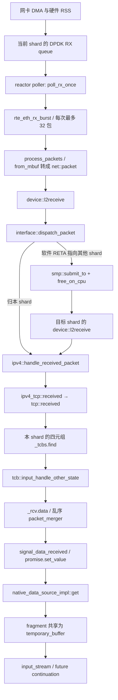

# Seastar native stack：把 TCP、内存所有权和应用调度固定在同一个 shard

版本：`seastar-25.05.0`，commit `8df8212e53577e1d8477a5c901457cd61d88afc7`，仓库 <https://github.com/scylladb/seastar>。`git ls-remote --tags` 核验 tag 后浅克隆，以下行号均属于此 commit。阅读日期：2026-10-02。Linux 对照固定为 v6.18，commit `7d0a66e4bb9081d75c82ec4957c50034cb0ea449`。

范围只包括 **native TCP/IP + DPDK 路径**，辅以 reactor、buffer 和 API 的必要代码。Seastar 框架也可使用 POSIX 后端；框架提供某个接口，不等于 native TCP 实现了它。native 入口实际持有 `interface`、`ipv4`，`listen()` 最终调用 `tcpv4_listen()`，`connect()` 明确要求 IPv4/TCP。[src/net/native-stack.cc:156](https://github.com/scylladb/seastar/blob/8df8212e53577e1d8477a5c901457cd61d88afc7/src/net/native-stack.cc#L156) [src/net/native-stack.cc:246](https://github.com/scylladb/seastar/blob/8df8212e53577e1d8477a5c901457cd61d88afc7/src/net/native-stack.cc#L246) [src/net/native-stack-impl.hh:133](https://github.com/scylladb/seastar/blob/8df8212e53577e1d8477a5c901457cd61d88afc7/src/net/native-stack-impl.hh#L133)

最值得借鉴的是**从主动连接选源端口开始，就维护“包、TCB、应用 continuation 属于同一个 shard”的不变量**。它同时影响 RSS、流表、引用计数和 API。最大的限制是 native TCP 的协议完整度：该版本 `TIME_WAIT` 定时器仍未实现；不能因为 Seastar 的应用框架成熟，就把 native TCP 当成完整内核 TCP 的替代品。[include/seastar/net/tcp.hh:830](https://github.com/scylladb/seastar/blob/8df8212e53577e1d8477a5c901457cd61d88afc7/include/seastar/net/tcp.hh#L830) [include/seastar/net/tcp.hh:612](https://github.com/scylladb/seastar/blob/8df8212e53577e1d8477a5c901457cd61d88afc7/include/seastar/net/tcp.hh#L612)

## 1. 架构与完整收包路径

路径上的具体边：DPDK 在 `rx_start()` 注册 reactor poller，`poll_rx_once()` 批量收 mbuf；`process_packets()` 设置校验和/RSS 元数据后调用 L2。`device::l2receive()` 向当前 shard 的接收 stream 投递；`interface` 注册的回调调用 `dispatch_packet()`，去掉以太头后交给 IPv4；IPv4 去掉 IP 头，通过 `_l4` 协议表调用 TCP。[src/net/dpdk.cc:1976](https://github.com/scylladb/seastar/blob/8df8212e53577e1d8477a5c901457cd61d88afc7/src/net/dpdk.cc#L1976) [src/net/dpdk.cc:222](https://github.com/scylladb/seastar/blob/8df8212e53577e1d8477a5c901457cd61d88afc7/src/net/dpdk.cc#L222) [src/net/dpdk.cc:2197](https://github.com/scylladb/seastar/blob/8df8212e53577e1d8477a5c901457cd61d88afc7/src/net/dpdk.cc#L2197) [src/net/dpdk.cc:2141](https://github.com/scylladb/seastar/blob/8df8212e53577e1d8477a5c901457cd61d88afc7/src/net/dpdk.cc#L2141) [include/seastar/net/net.hh:275](https://github.com/scylladb/seastar/blob/8df8212e53577e1d8477a5c901457cd61d88afc7/include/seastar/net/net.hh#L275) [src/net/net.cc:265](https://github.com/scylladb/seastar/blob/8df8212e53577e1d8477a5c901457cd61d88afc7/src/net/net.cc#L265) [src/net/net.cc:331](https://github.com/scylladb/seastar/blob/8df8212e53577e1d8477a5c901457cd61d88afc7/src/net/net.cc#L331) [src/net/ip.cc:52](https://github.com/scylladb/seastar/blob/8df8212e53577e1d8477a5c901457cd61d88afc7/src/net/ip.cc#L52) [src/net/ip.cc:231](https://github.com/scylladb/seastar/blob/8df8212e53577e1d8477a5c901457cd61d88afc7/src/net/ip.cc#L231) [src/net/tcp.cc:157](https://github.com/scylladb/seastar/blob/8df8212e53577e1d8477a5c901457cd61d88afc7/src/net/tcp.cc#L157)

TCP 查表和状态分派在 `tcp::received()`；顺序数据以 `packet` 进入 `_rcv.data`，更新序号与窗口，再兑现等待数据的 promise；应用 data source 等待 future，`read()` 拼接 packet，随后逐 fragment 返回 `temporary_buffer`。这里的数据流和调度流属于同一 reactor，不需要 syscall 才能唤醒应用逻辑。最后一句是由调用路径推导，不是端到端性能测量。[include/seastar/net/tcp.hh:865](https://github.com/scylladb/seastar/blob/8df8212e53577e1d8477a5c901457cd61d88afc7/include/seastar/net/tcp.hh#L865) [include/seastar/net/tcp.hh:1496](https://github.com/scylladb/seastar/blob/8df8212e53577e1d8477a5c901457cd61d88afc7/include/seastar/net/tcp.hh#L1496) [include/seastar/net/tcp.hh:561](https://github.com/scylladb/seastar/blob/8df8212e53577e1d8477a5c901457cd61d88afc7/include/seastar/net/tcp.hh#L561) [include/seastar/net/tcp.hh:1795](https://github.com/scylladb/seastar/blob/8df8212e53577e1d8477a5c901457cd61d88afc7/include/seastar/net/tcp.hh#L1795) [src/net/native-stack-impl.hh:175](https://github.com/scylladb/seastar/blob/8df8212e53577e1d8477a5c901457cd61d88afc7/src/net/native-stack-impl.hh#L175)

Linux 的对应关系如下。图是正常 IPv4/TCP 收包和常规 `recvmsg` 的功能对照，省略 netfilter、路由和异常分支，不表示每个包必经 GRO。

对应源码：NAPI/GRO 包装与实现 [Linux include/linux/netdevice.h:4190](https://github.com/torvalds/linux/blob/7d0a66e4bb9081d75c82ec4957c50034cb0ea449/include/linux/netdevice.h#L4190) [Linux net/core/gro.c:624](https://github.com/torvalds/linux/blob/7d0a66e4bb9081d75c82ec4957c50034cb0ea449/net/core/gro.c#L624)；IPv4 收包/本地交付 [Linux net/ipv4/ip_input.c:564](https://github.com/torvalds/linux/blob/7d0a66e4bb9081d75c82ec4957c50034cb0ea449/net/ipv4/ip_input.c#L564) [Linux net/ipv4/ip_input.c:248](https://github.com/torvalds/linux/blob/7d0a66e4bb9081d75c82ec4957c50034cb0ea449/net/ipv4/ip_input.c#L248)；TCP 入口与 established 状态 [Linux net/ipv4/tcp_ipv4.c:2202](https://github.com/torvalds/linux/blob/7d0a66e4bb9081d75c82ec4957c50034cb0ea449/net/ipv4/tcp_ipv4.c#L2202) [Linux net/ipv4/tcp_input.c:6259](https://github.com/torvalds/linux/blob/7d0a66e4bb9081d75c82ec4957c50034cb0ea449/net/ipv4/tcp_input.c#L6259)；数据就绪通知 [Linux net/ipv4/tcp_input.c:5352](https://github.com/torvalds/linux/blob/7d0a66e4bb9081d75c82ec4957c50034cb0ea449/net/ipv4/tcp_input.c#L5352)；应用读取与普通 payload copy [Linux net/ipv4/tcp.c:2913](https://github.com/torvalds/linux/blob/7d0a66e4bb9081d75c82ec4957c50034cb0ea449/net/ipv4/tcp.c#L2913) [Linux net/ipv4/tcp.c:2823](https://github.com/torvalds/linux/blob/7d0a66e4bb9081d75c82ec4957c50034cb0ea449/net/ipv4/tcp.c#L2823)。Seastar native 的 packet stream、promise 和 data source 分别承担这条路径中的分层交付、就绪通知、应用取数据职责。

发送不是 VPP graph node 调度：TCP 注册 packet provider，IPv4/以太层逐层取包并加头，DPDK `_send()` 收集 mbuf 后调用 `rte_eth_tx_burst()`。这是 pull provider、reactor polling 与队列组合。[include/seastar/net/tcp.hh:792](https://github.com/scylladb/seastar/blob/8df8212e53577e1d8477a5c901457cd61d88afc7/include/seastar/net/tcp.hh#L792) [src/net/ip.cc:310](https://github.com/scylladb/seastar/blob/8df8212e53577e1d8477a5c901457cd61d88afc7/src/net/ip.cc#L310) [src/net/net.cc:273](https://github.com/scylladb/seastar/blob/8df8212e53577e1d8477a5c901457cd61d88afc7/src/net/net.cc#L273) [src/net/dpdk.cc:1282](https://github.com/scylladb/seastar/blob/8df8212e53577e1d8477a5c901457cd61d88afc7/src/net/dpdk.cc#L1282)

## 2. 包缓冲区与零拷贝边界

`net::packet` 是 fragment 数组加 `deleter`：`fragment` 只有 `base/size`；packet 的 impl 保存长度、片段数、offload 信息、RSS hash 和小块头部空间。析构动作可串接，以管理不同来源的内存。`share()` 共享底层数据，接口明确不是 copy-on-write；调用者不能把共享 payload 当作独占可写内存。[include/seastar/net/packet.hh:46](https://github.com/scylladb/seastar/blob/8df8212e53577e1d8477a5c901457cd61d88afc7/include/seastar/net/packet.hh#L46) [include/seastar/net/packet.hh:64](https://github.com/scylladb/seastar/blob/8df8212e53577e1d8477a5c901457cd61d88afc7/include/seastar/net/packet.hh#L64) [include/seastar/net/packet.hh:102](https://github.com/scylladb/seastar/blob/8df8212e53577e1d8477a5c901457cd61d88afc7/include/seastar/net/packet.hh#L102) [include/seastar/net/packet.hh:250](https://github.com/scylladb/seastar/blob/8df8212e53577e1d8477a5c901457cd61d88afc7/include/seastar/net/packet.hh#L250) [include/seastar/net/packet.hh:609](https://github.com/scylladb/seastar/blob/8df8212e53577e1d8477a5c901457cd61d88afc7/include/seastar/net/packet.hh#L609)

| 边界 | 此版本的实际行为 | 证据 |
|---|---|---|
| DPDK RX → packet，hugepages backend | `dpdk_qp<true>::from_mbuf()` 把 mbuf 的 data 指针交给 fragment 和 deleter；旧 mbuf 元数据进入待回收列表，之后补充新的 RX data buffer。LRO 链变多个 fragment | [src/net/dpdk.cc:2046](https://github.com/scylladb/seastar/blob/8df8212e53577e1d8477a5c901457cd61d88afc7/src/net/dpdk.cc#L2046) [src/net/dpdk.cc:2068](https://github.com/scylladb/seastar/blob/8df8212e53577e1d8477a5c901457cd61d88afc7/src/net/dpdk.cc#L2068) [src/net/dpdk.cc:2084](https://github.com/scylladb/seastar/blob/8df8212e53577e1d8477a5c901457cd61d88afc7/src/net/dpdk.cc#L2084) |
| DPDK RX → packet，普通 backend | `dpdk_qp<false>::from_mbuf()` 分配内存并 `rte_memcpy`，随后释放 mbuf；LRO 也合并复制。注释仍提及分配失败时给应用 mbuf，但实现实际丢包，应以实现为准 | [src/net/dpdk.cc:1982](https://github.com/scylladb/seastar/blob/8df8212e53577e1d8477a5c901457cd61d88afc7/src/net/dpdk.cc#L1982) [src/net/dpdk.cc:2016](https://github.com/scylladb/seastar/blob/8df8212e53577e1d8477a5c901457cd61d88afc7/src/net/dpdk.cc#L2016) |
| TCP 按序收包 → 应用 buffer | TCB 保存 packet，`read()` 移动/拼接队列中的 packet；data source 用 fragment 原地址构造 `temporary_buffer`，deleter 捕获 `packet::share()` 延长寿命，不复制该 payload | [include/seastar/net/tcp.hh:1503](https://github.com/scylladb/seastar/blob/8df8212e53577e1d8477a5c901457cd61d88afc7/include/seastar/net/tcp.hh#L1503) [include/seastar/net/tcp.hh:1795](https://github.com/scylladb/seastar/blob/8df8212e53577e1d8477a5c901457cd61d88afc7/include/seastar/net/tcp.hh#L1795) [src/net/native-stack-impl.hh:179](https://github.com/scylladb/seastar/blob/8df8212e53577e1d8477a5c901457cd61d88afc7/src/net/native-stack-impl.hh#L179) |
| 乱序/分片重组 | `packet_merger` 用 `std::map<Offset, packet>`；新插入以及部分 overlap 合并分支调用 `linearize()`，发生 payload copy，因此不能概括“TCP RX 永远零拷贝” | [include/seastar/net/packet-util.hh:39](https://github.com/scylladb/seastar/blob/8df8212e53577e1d8477a5c901457cd61d88afc7/include/seastar/net/packet-util.hh#L39) [include/seastar/net/packet-util.hh:76](https://github.com/scylladb/seastar/blob/8df8212e53577e1d8477a5c901457cd61d88afc7/include/seastar/net/packet-util.hh#L76) [include/seastar/net/packet-util.hh:97](https://github.com/scylladb/seastar/blob/8df8212e53577e1d8477a5c901457cd61d88afc7/include/seastar/net/packet-util.hh#L97) [src/net/packet.cc:50](https://github.com/scylladb/seastar/blob/8df8212e53577e1d8477a5c901457cd61d88afc7/src/net/packet.cc#L50) |
| packet → DPDK TX | hugepages backend 走 `from_packet_zc()`，其他 backend 走 copy。即使 zero-copy 分支，IOVA 无法转换会复制，片段数/网卡限制会触发 linearize | [src/net/dpdk.cc:1263](https://github.com/scylladb/seastar/blob/8df8212e53577e1d8477a5c901457cd61d88afc7/src/net/dpdk.cc#L1263) [src/net/dpdk.cc:673](https://github.com/scylladb/seastar/blob/8df8212e53577e1d8477a5c901457cd61d88afc7/src/net/dpdk.cc#L673) [src/net/dpdk.cc:720](https://github.com/scylladb/seastar/blob/8df8212e53577e1d8477a5c901457cd61d88afc7/src/net/dpdk.cc#L720) [src/net/dpdk.cc:955](https://github.com/scylladb/seastar/blob/8df8212e53577e1d8477a5c901457cd61d88afc7/src/net/dpdk.cc#L955) |
| 重传 | `output_one()` 对 payload `share()`，额外保留未确认数据副本描述；不必再复制完整 payload | [include/seastar/net/tcp.hh:1632](https://github.com/scylladb/seastar/blob/8df8212e53577e1d8477a5c901457cd61d88afc7/include/seastar/net/tcp.hh#L1632) [include/seastar/net/tcp.hh:1718](https://github.com/scylladb/seastar/blob/8df8212e53577e1d8477a5c901457cd61d88afc7/include/seastar/net/tcp.hh#L1718) |
| 跨 shard 回收 | `free_on_cpu()` 用 `smp::submit_to()` 把原 deleter 送回来源 shard 执行；减少直接跨核释放，增加消息与生命周期管理成本 | [src/net/packet.cc:79](https://github.com/scylladb/seastar/blob/8df8212e53577e1d8477a5c901457cd61d88afc7/src/net/packet.cc#L79) |

hugepages backend 的选择条件是 `net_opts->_hugepages`，不是“只要使用 DPDK 就自动零拷贝”。应用拿到共享 `temporary_buffer` 以后，如再拼成字符串或要求连续大块数据，后续是否复制取决于应用/stream 操作，本笔记不作全面零拷贝保证。[src/net/dpdk.cc:2242](https://github.com/scylladb/seastar/blob/8df8212e53577e1d8477a5c901457cd61d88afc7/src/net/dpdk.cc#L2242) [src/net/native-stack-impl.hh:175](https://github.com/scylladb/seastar/blob/8df8212e53577e1d8477a5c901457cd61d88afc7/src/net/native-stack-impl.hh#L175)

与 `sk_buff` 的差别不在“内核有链表、用户态没有”。Linux 同样有 scatter/gather fragment、共享数据和 offload 信息；但 skb 还同时承载 socket、device、时间戳、各层 control buffer、路由引用等通用语义。Seastar packet 的元数据和析构模型集中在本进程的 buffer 组合与设备交付。普通 Linux TCP 接收路径还要把 skb payload 复制给用户 buffer；它不是 Linux 所有接收 API 都必然复制的证明。[Linux include/linux/skbuff.h:593](https://github.com/torvalds/linux/blob/7d0a66e4bb9081d75c82ec4957c50034cb0ea449/include/linux/skbuff.h#L593) [Linux include/linux/skbuff.h:885](https://github.com/torvalds/linux/blob/7d0a66e4bb9081d75c82ec4957c50034cb0ea449/include/linux/skbuff.h#L885) [Linux net/ipv4/tcp.c:2823](https://github.com/torvalds/linux/blob/7d0a66e4bb9081d75c82ec4957c50034cb0ea449/net/ipv4/tcp.c#L2823) [include/seastar/net/packet.hh:102](https://github.com/scylladb/seastar/blob/8df8212e53577e1d8477a5c901457cd61d88afc7/include/seastar/net/packet.hh#L102)

## 3. 连接查找：本地表与 RSS 是两套哈希

`l4connid` 是本地/远端 IP、端口四元组，比较时检查全部四个字段；每个 TCP 实例维护 `std::unordered_map<connid, lw_shared_ptr<tcb>, connid_hash> _tcbs`，监听表则是 `unordered_map<uint16_t, listener*>`。收到包后用 `{to, from, dst_port, src_port}` 查 `_tcbs`，未命中才按本地端口找监听者。[include/seastar/net/ip.hh:108](https://github.com/scylladb/seastar/blob/8df8212e53577e1d8477a5c901457cd61d88afc7/include/seastar/net/ip.hh#L108) [include/seastar/net/tcp.hh:658](https://github.com/scylladb/seastar/blob/8df8212e53577e1d8477a5c901457cd61d88afc7/include/seastar/net/tcp.hh#L658) [include/seastar/net/tcp.hh:884](https://github.com/scylladb/seastar/blob/8df8212e53577e1d8477a5c901457cd61d88afc7/include/seastar/net/tcp.hh#L884)

**表内哈希**为四个字段的 `std::hash` 结果 XOR，不能把它说成 RSS Toeplitz。**选 shard 的哈希**是 `l4connid::hash(rss_key)`，按收到返回流量的源/目的顺序组装网络序字节，再做 Toeplitz。前者解决 shard 内查找，后者解决连接所有权。[include/seastar/net/ip.hh:409](https://github.com/scylladb/seastar/blob/8df8212e53577e1d8477a5c901457cd61d88afc7/include/seastar/net/ip.hh#L409) [include/seastar/net/ip.hh:125](https://github.com/scylladb/seastar/blob/8df8212e53577e1d8477a5c901457cd61d88afc7/include/seastar/net/ip.hh#L125)

被动连接由 NIC RSS/软件分流送到目标 shard，在那里创建 TCB；主动连接多核时反复抽取 41952–65535 的源端口，直到 `hash2cpu(id.hash(rss_key)) == this_shard_id()` 且本地表不冲突。这是“应用在哪个 shard 发起连接，回包就去哪个 shard”的具体实现。端口搜索代价/偏斜风险是代码可推导的代价，本文未测量高连接密度时的重试次数。[include/seastar/net/tcp.hh:662](https://github.com/scylladb/seastar/blob/8df8212e53577e1d8477a5c901457cd61d88afc7/include/seastar/net/tcp.hh#L662) [include/seastar/net/tcp.hh:830](https://github.com/scylladb/seastar/blob/8df8212e53577e1d8477a5c901457cd61d88afc7/include/seastar/net/tcp.hh#L830) [include/seastar/net/tcp.hh:913](https://github.com/scylladb/seastar/blob/8df8212e53577e1d8477a5c901457cd61d88afc7/include/seastar/net/tcp.hh#L913)

Linux 的 established 查找面向可并发访问的 ehash，计算 `inet_ehashfn()`、遍历 RCU 的 hlist_nulls，再取 socket 引用；Seastar 把每次查找的同步责任前移到归核，不在这个本地 `_tcbs.find()` 路径加 socket 锁。[Linux net/ipv4/inet_hashtables.c:527](https://github.com/torvalds/linux/blob/7d0a66e4bb9081d75c82ec4957c50034cb0ea449/net/ipv4/inet_hashtables.c#L527) [include/seastar/net/tcp.hh:885](https://github.com/scylladb/seastar/blob/8df8212e53577e1d8477a5c901457cd61d88afc7/include/seastar/net/tcp.hh#L885)

## 4. 定时器：按 shard 的基数分桶，TIME_WAIT 有明确缺口

TCB 的 `_delayed_ack`、`_retransmit`、`_persist` 都是 `timer<lowres_clock>`；超时回调分别安排输出、重传和零窗口探测。RTO 初值/最小值 1 秒、最大值 60 秒；RTT 用 `lowres_clock::now() - tx_time` 采样，按 RFC6298 的 SRTT/RTTVAR 公式更新，超时二倍退避。重传数据取最早未确认 segment，并降低拥塞窗口。[include/seastar/net/tcp.hh:390](https://github.com/scylladb/seastar/blob/8df8212e53577e1d8477a5c901457cd61d88afc7/include/seastar/net/tcp.hh#L390) [include/seastar/net/tcp.hh:965](https://github.com/scylladb/seastar/blob/8df8212e53577e1d8477a5c901457cd61d88afc7/include/seastar/net/tcp.hh#L965) [include/seastar/net/tcp.hh:1958](https://github.com/scylladb/seastar/blob/8df8212e53577e1d8477a5c901457cd61d88afc7/include/seastar/net/tcp.hh#L1958) [include/seastar/net/tcp.hh:2031](https://github.com/scylladb/seastar/blob/8df8212e53577e1d8477a5c901457cd61d88afc7/include/seastar/net/tcp.hh#L2031)

Delayed ACK：收到超过 MSS 的聚合 segment 立即 ACK；每第二个 full-sized segment ACK；其余场景首次挂 200ms timer，已有 timer 时不重复挂。填补乱序洞也会触发立即 ACK。因此“200ms delayed ACK”只是上限式等待分支，不是每包固定等待 200ms。[include/seastar/net/tcp.hh:1513](https://github.com/scylladb/seastar/blob/8df8212e53577e1d8477a5c901457cd61d88afc7/include/seastar/net/tcp.hh#L1513) [include/seastar/net/tcp.hh:1860](https://github.com/scylladb/seastar/blob/8df8212e53577e1d8477a5c901457cd61d88afc7/include/seastar/net/tcp.hh#L1860)

**TIME_WAIT 未实现正常保留期。** `do_time_wait()` 有 `FIXME: Implement TIME_WAIT state timer`，设置状态后立刻 `cleanup()`；后者清 buffer、取消重传/延迟 ACK、从 `_tcbs` 删除。这里不存在可以复述为“默认 2MSL”的本地实现。其对旧重复 segment 和同四元组快速复用的保护弱于保留 TIME_WAIT 的实现，这是由缺失状态保留推导的协议风险。[include/seastar/net/tcp.hh:612](https://github.com/scylladb/seastar/blob/8df8212e53577e1d8477a5c901457cd61d88afc7/include/seastar/net/tcp.hh#L612) [include/seastar/net/tcp.hh:2070](https://github.com/scylladb/seastar/blob/8df8212e53577e1d8477a5c901457cd61d88afc7/include/seastar/net/tcp.hh#L2070)

底层 `timer_set` 不是每 tick 顺序推进固定槽的普通时间轮，也不是每次插入都排序的最小堆。它保存 `timestamp_bits + 1` 个 intrusive-list bucket，用 `count_leading_zeros(timestamp ^ _last)` 选桶，位图记录非空桶；`expire(now)` 提取已过期桶，并把临界桶的未到期 timer 重新分桶。可以称为**基数分桶的 timer set**。源码给出的目标是：大量 TCP timer 在到期前被取消/重挂，把排序工作推迟到真正到期。[include/seastar/core/timer-set.hh:33](https://github.com/scylladb/seastar/blob/8df8212e53577e1d8477a5c901457cd61d88afc7/include/seastar/core/timer-set.hh#L33) [include/seastar/core/timer-set.hh:45](https://github.com/scylladb/seastar/blob/8df8212e53577e1d8477a5c901457cd61d88afc7/include/seastar/core/timer-set.hh#L45) [include/seastar/core/timer-set.hh:75](https://github.com/scylladb/seastar/blob/8df8212e53577e1d8477a5c901457cd61d88afc7/include/seastar/core/timer-set.hh#L75) [include/seastar/core/timer-set.hh:193](https://github.com/scylladb/seastar/blob/8df8212e53577e1d8477a5c901457cd61d88afc7/include/seastar/core/timer-set.hh#L193)

每个 reactor 有自己的 `_lowres_timers`；`lowres_clock::now()` 只读 thread-local 缓存，`update()` 从 `std::chrono::steady_clock::now()` 更新，reactor 主循环在检查工作前更新缓存并由 lowres timer poller 触发回调。其精度受循环推进/任务配额影响；`lowres_clock.hh` 说约 `task_quota`，默认任务配额选项 0.5ms。`timer.hh` 的“10ms”概述与此版本实现不一致，不应据此写成固定 10ms tick。[include/seastar/core/reactor.hh:254](https://github.com/scylladb/seastar/blob/8df8212e53577e1d8477a5c901457cd61d88afc7/include/seastar/core/reactor.hh#L254) [include/seastar/core/lowres_clock.hh:48](https://github.com/scylladb/seastar/blob/8df8212e53577e1d8477a5c901457cd61d88afc7/include/seastar/core/lowres_clock.hh#L48) [include/seastar/core/lowres_clock.hh:74](https://github.com/scylladb/seastar/blob/8df8212e53577e1d8477a5c901457cd61d88afc7/include/seastar/core/lowres_clock.hh#L74) [src/core/reactor.cc:623](https://github.com/scylladb/seastar/blob/8df8212e53577e1d8477a5c901457cd61d88afc7/src/core/reactor.cc#L623) [src/core/reactor.cc:2678](https://github.com/scylladb/seastar/blob/8df8212e53577e1d8477a5c901457cd61d88afc7/src/core/reactor.cc#L2678) [src/core/reactor.cc:3275](https://github.com/scylladb/seastar/blob/8df8212e53577e1d8477a5c901457cd61d88afc7/src/core/reactor.cc#L3275) [src/core/reactor.cc:3816](https://github.com/scylladb/seastar/blob/8df8212e53577e1d8477a5c901457cd61d88afc7/src/core/reactor.cc#L3816) [include/seastar/core/timer.hh:41](https://github.com/scylladb/seastar/blob/8df8212e53577e1d8477a5c901457cd61d88afc7/include/seastar/core/timer.hh#L41)

对 utcp 的启发：时间来源、timer 容器、TCP 超时策略是三个独立层次。可以借鉴取消便宜的容器，但不能照搬 TIME_WAIT 缺口；也不要让不让出 CPU 的应用任务无限推迟协议 timer。后者来自 reactor 同步运行 task 后才继续 poll 的执行顺序。[src/core/reactor.cc:2612](https://github.com/scylladb/seastar/blob/8df8212e53577e1d8477a5c901457cd61d88afc7/src/core/reactor.cc#L2612) [src/core/reactor.cc:3275](https://github.com/scylladb/seastar/blob/8df8212e53577e1d8477a5c901457cd61d88afc7/src/core/reactor.cc#L3275)

## 5. 线程、归核与 RSS

native 初始化对每个 shard 执行 `create_native_stack()`，所以 TCB 表和 IPv4 对象按 shard 存在。硬件队列足够时 queue id 取 `this_shard_id()`；不足时，多出的 shard 使用 proxy device，硬件队列配置软件分配权重。该模型是“每个连接由某 shard 独占”，不能简化成“一定每核一个独立硬件 RX 队列”。[src/net/native-stack.cc:119](https://github.com/scylladb/seastar/blob/8df8212e53577e1d8477a5c901457cd61d88afc7/src/net/native-stack.cc#L119) [src/net/native-stack.cc:145](https://github.com/scylladb/seastar/blob/8df8212e53577e1d8477a5c901457cd61d88afc7/src/net/native-stack.cc#L145) [src/net/native-stack.cc:156](https://github.com/scylladb/seastar/blob/8df8212e53577e1d8477a5c901457cd61d88afc7/src/net/native-stack.cc#L156)

DPDK 多 shard 时启用 RSS，设置 40/52 字节 key 并启用设备支持的 RSS hash 类型；硬件 RETA 按 `i % _num_queues` 分配。软件侧 `forward_dst()` 在需要 proxy 分流时使用 RSS hash 的高位查软件 RETA；若 mbuf 没带 RSS hash，`interface::dispatch_packet()` 自行提取 IP/端口再计算 Toeplitz。[src/net/dpdk.cc:1516](https://github.com/scylladb/seastar/blob/8df8212e53577e1d8477a5c901457cd61d88afc7/src/net/dpdk.cc#L1516) [src/net/dpdk.cc:2213](https://github.com/scylladb/seastar/blob/8df8212e53577e1d8477a5c901457cd61d88afc7/src/net/dpdk.cc#L2213) [include/seastar/net/net.hh:291](https://github.com/scylladb/seastar/blob/8df8212e53577e1d8477a5c901457cd61d88afc7/include/seastar/net/net.hh#L291) [src/net/net.cc:337](https://github.com/scylladb/seastar/blob/8df8212e53577e1d8477a5c901457cd61d88afc7/src/net/net.cc#L337) [src/net/ip.cc:86](https://github.com/scylladb/seastar/blob/8df8212e53577e1d8477a5c901457cd61d88afc7/src/net/ip.cc#L86) [include/seastar/net/tcp.hh:852](https://github.com/scylladb/seastar/blob/8df8212e53577e1d8477a5c901457cd61d88afc7/include/seastar/net/tcp.hh#L852)

软件跨 shard 转发走 `smp::submit_to()`，并安排原核回收；转发队列深度大于等于 1000 时不再进入投递分支。这个明确上限表明跨核既有排队也有丢包边界。IP 分片先按 IP 地址归核，重组后可按完整 L4 元组再次转到连接归属核。[src/net/net.cc:316](https://github.com/scylladb/seastar/blob/8df8212e53577e1d8477a5c901457cd61d88afc7/src/net/net.cc#L316) [src/net/packet.cc:79](https://github.com/scylladb/seastar/blob/8df8212e53577e1d8477a5c901457cd61d88afc7/src/net/packet.cc#L79) [src/net/ip.cc:86](https://github.com/scylladb/seastar/blob/8df8212e53577e1d8477a5c901457cd61d88afc7/src/net/ip.cc#L86) [src/net/ip.cc:189](https://github.com/scylladb/seastar/blob/8df8212e53577e1d8477a5c901457cd61d88afc7/src/net/ip.cc#L189)

TCB 使用 `lw_shared_ptr`；该指针实现明确不保证跨线程安全。并发简化来自对象只在所属 shard 使用，而不是给共享 TCB 换一套无锁哈希就结束。DPDK 负责自己的 CPU pinning，非 DPDK 路径由 `smp::pin()` 调用绑核。[include/seastar/net/tcp.hh:303](https://github.com/scylladb/seastar/blob/8df8212e53577e1d8477a5c901457cd61d88afc7/include/seastar/net/tcp.hh#L303) [include/seastar/net/tcp.hh:658](https://github.com/scylladb/seastar/blob/8df8212e53577e1d8477a5c901457cd61d88afc7/include/seastar/net/tcp.hh#L658) [include/seastar/core/shared_ptr.hh:44](https://github.com/scylladb/seastar/blob/8df8212e53577e1d8477a5c901457cd61d88afc7/include/seastar/core/shared_ptr.hh#L44) [src/core/reactor.cc:3936](https://github.com/scylladb/seastar/blob/8df8212e53577e1d8477a5c901457cd61d88afc7/src/core/reactor.cc#L3936)

代价由同样的所有权决定：连接负载可能偏斜，跨核应用协作需要显式消息；长时间不 yield 的计算会延后该 shard 的 RX、future 和 timer。源码证明的是这个调度约束，不是“Seastar 整个进程绝无锁”。Linux 则必须容纳应用线程与收包执行上下文对同一 socket 的访问，`tcp_v4_rcv()` 锁住 socket，若应用已持有 socket，包进入 backlog，常规 `tcp_recvmsg()` 也执行 `lock_sock()`。[src/core/reactor.cc:2612](https://github.com/scylladb/seastar/blob/8df8212e53577e1d8477a5c901457cd61d88afc7/src/core/reactor.cc#L2612) [src/net/net.cc:323](https://github.com/scylladb/seastar/blob/8df8212e53577e1d8477a5c901457cd61d88afc7/src/net/net.cc#L323) [Linux net/ipv4/tcp_ipv4.c:2370](https://github.com/torvalds/linux/blob/7d0a66e4bb9081d75c82ec4957c50034cb0ea449/net/ipv4/tcp_ipv4.c#L2370) [Linux net/ipv4/tcp.c:2927](https://github.com/torvalds/linux/blob/7d0a66e4bb9081d75c82ec4957c50034cb0ea449/net/ipv4/tcp.c#L2927)

## 6. TCP 实现完整度

下表只判断固定版本 native TCP 的执行路径，不把头文件里出现某个名字当作支持。

| 能力 | 判断 | 源码依据与边界 |
|---|---|---|
| 拥塞控制 | Reno/NewReno 路线；慢启动、AIMD、3 dupACK 快重传、partial ACK 恢复、limited transmit | `update_cwnd()`；恢复路径明确按 RFC6582；未见可插拔 CC 接口，不能写成支持 CUBIC/BBR。[include/seastar/net/tcp.hh:2057](https://github.com/scylladb/seastar/blob/8df8212e53577e1d8477a5c901457cd61d88afc7/include/seastar/net/tcp.hh#L2057) [include/seastar/net/tcp.hh:1360](https://github.com/scylladb/seastar/blob/8df8212e53577e1d8477a5c901457cd61d88afc7/include/seastar/net/tcp.hh#L1360) [include/seastar/net/tcp.hh:1413](https://github.com/scylladb/seastar/blob/8df8212e53577e1d8477a5c901457cd61d88afc7/include/seastar/net/tcp.hh#L1413) |
| SACK | 未形成可用 SACK 实现 | kind=4 的 `sack` 实为 SACK-permitted；parse 只置 `_sack_received`，fill/get_size 仅输出 MSS/WS；未找到 kind=5 block 或 scoreboard 执行路径。[include/seastar/net/tcp.hh:99](https://github.com/scylladb/seastar/blob/8df8212e53577e1d8477a5c901457cd61d88afc7/include/seastar/net/tcp.hh#L99) [src/net/tcp.cc:69](https://github.com/scylladb/seastar/blob/8df8212e53577e1d8477a5c901457cd61d88afc7/src/net/tcp.cc#L69) [src/net/tcp.cc:91](https://github.com/scylladb/seastar/blob/8df8212e53577e1d8477a5c901457cd61d88afc7/src/net/tcp.cc#L91) [src/net/tcp.cc:132](https://github.com/scylladb/seastar/blob/8df8212e53577e1d8477a5c901457cd61d88afc7/src/net/tcp.cc#L132) |
| 窗口缩放 | 已实现协商与窗口移位 | parse 处理 WS，fill 输出，`init_from_options()` 赋给发送/接收窗口尺度，发送时缩小 advertised window。[src/net/tcp.cc:62](https://github.com/scylladb/seastar/blob/8df8212e53577e1d8477a5c901457cd61d88afc7/src/net/tcp.cc#L62) [src/net/tcp.cc:106](https://github.com/scylladb/seastar/blob/8df8212e53577e1d8477a5c901457cd61d88afc7/src/net/tcp.cc#L106) [include/seastar/net/tcp.hh:1079](https://github.com/scylladb/seastar/blob/8df8212e53577e1d8477a5c901457cd61d88afc7/include/seastar/net/tcp.hh#L1079) [include/seastar/net/tcp.hh:1663](https://github.com/scylladb/seastar/blob/8df8212e53577e1d8477a5c901457cd61d88afc7/include/seastar/net/tcp.hh#L1663) |
| TCP timestamp / PAWS | native 路径未实现 | 有 `timestamps` 类型和 `_timestamps_received` 字段，但 parse 的 switch 无 timestamp 分支，fill/get_size 不发送 timestamp。不能从类型定义推导支持。[include/seastar/net/tcp.hh:145](https://github.com/scylladb/seastar/blob/8df8212e53577e1d8477a5c901457cd61d88afc7/include/seastar/net/tcp.hh#L145) [include/seastar/net/tcp.hh:185](https://github.com/scylladb/seastar/blob/8df8212e53577e1d8477a5c901457cd61d88afc7/include/seastar/net/tcp.hh#L185) [src/net/tcp.cc:44](https://github.com/scylladb/seastar/blob/8df8212e53577e1d8477a5c901457cd61d88afc7/src/net/tcp.cc#L44) [src/net/tcp.cc:91](https://github.com/scylladb/seastar/blob/8df8212e53577e1d8477a5c901457cd61d88afc7/src/net/tcp.cc#L91) |
| TSO | 有，取决于 NIC/DPDK 能力 | DPDK 检测 `RTE_ETH_TX_OFFLOAD_TCP_TSO`；TCP 在允许 checksum offload 且长度大于 MSS 时设置 `tso_seg_size`，驱动编码 TX TCP segmentation 标志。[src/net/dpdk.cc:1602](https://github.com/scylladb/seastar/blob/8df8212e53577e1d8477a5c901457cd61d88afc7/src/net/dpdk.cc#L1602) [include/seastar/net/tcp.hh:1680](https://github.com/scylladb/seastar/blob/8df8212e53577e1d8477a5c901457cd61d88afc7/include/seastar/net/tcp.hh#L1680) [src/net/dpdk.cc:650](https://github.com/scylladb/seastar/blob/8df8212e53577e1d8477a5c901457cd61d88afc7/src/net/dpdk.cc#L650) |
| LRO | 有条件支持 | 编译宏 `RTE_ETHDEV_HAS_LRO_SUPPORT`、配置 `_use_lro`、设备 offload 能力同时满足才启用；多 mbuf 接收路径专门处理 LRO。不是所有运行环境默认有效。[src/net/dpdk.cc:1567](https://github.com/scylladb/seastar/blob/8df8212e53577e1d8477a5c901457cd61d88afc7/src/net/dpdk.cc#L1567) [src/net/dpdk.cc:1982](https://github.com/scylladb/seastar/blob/8df8212e53577e1d8477a5c901457cd61d88afc7/src/net/dpdk.cc#L1982) [src/net/dpdk.cc:2046](https://github.com/scylladb/seastar/blob/8df8212e53577e1d8477a5c901457cd61d88afc7/src/net/dpdk.cc#L2046) |
| 校验和 offload | 有条件支持；否则软件计算 | RX 驱动丢弃 bad checksum，TCP 无 offload 时自行校验；TX 根据能力选择软件/硬件。[src/net/dpdk.cc:2168](https://github.com/scylladb/seastar/blob/8df8212e53577e1d8477a5c901457cd61d88afc7/src/net/dpdk.cc#L2168) [include/seastar/net/tcp.hh:876](https://github.com/scylladb/seastar/blob/8df8212e53577e1d8477a5c901457cd61d88afc7/include/seastar/net/tcp.hh#L876) [include/seastar/net/tcp.hh:1680](https://github.com/scylladb/seastar/blob/8df8212e53577e1d8477a5c901457cd61d88afc7/include/seastar/net/tcp.hh#L1680) |
| 乱序接收、重传、零窗口探测 | 已实现对应机制 | `_rcv.out_of_order`、最早未确认段重传、persist timer 均有执行代码；存在机制不等于所有边界都通过一致性测试。[include/seastar/net/tcp.hh:383](https://github.com/scylladb/seastar/blob/8df8212e53577e1d8477a5c901457cd61d88afc7/include/seastar/net/tcp.hh#L383) [include/seastar/net/tcp.hh:1958](https://github.com/scylladb/seastar/blob/8df8212e53577e1d8477a5c901457cd61d88afc7/include/seastar/net/tcp.hh#L1958) [include/seastar/net/tcp.hh:498](https://github.com/scylladb/seastar/blob/8df8212e53577e1d8477a5c901457cd61d88afc7/include/seastar/net/tcp.hh#L498) |
| TIME_WAIT | 不完整 | 设置状态后立即 cleanup，没有保留期 timer。[include/seastar/net/tcp.hh:612](https://github.com/scylladb/seastar/blob/8df8212e53577e1d8477a5c901457cd61d88afc7/include/seastar/net/tcp.hh#L612) |
| keepalive / socket option | keepalive 明确不支持；自定义 option 抛异常；nodelay setter 是空实现 | [src/net/native-stack-impl.hh:248](https://github.com/scylladb/seastar/blob/8df8212e53577e1d8477a5c901457cd61d88afc7/src/net/native-stack-impl.hh#L248) [src/net/native-stack-impl.hh:260](https://github.com/scylladb/seastar/blob/8df8212e53577e1d8477a5c901457cd61d88afc7/src/net/native-stack-impl.hh#L260) [src/net/native-stack-impl.hh:283](https://github.com/scylladb/seastar/blob/8df8212e53577e1d8477a5c901457cd61d88afc7/src/net/native-stack-impl.hh#L283) |
| IPv6 TCP / 多本地 IP / SCTP | 此 native 连接路径不支持 | `connect()` assert IPv4/TCP，忽略 local 参数并注明多 IP 未支持；native stack 持有 `ipv4`。框架其他后端的 IPv6 不可算进来。[src/net/native-stack-impl.hh:133](https://github.com/scylladb/seastar/blob/8df8212e53577e1d8477a5c901457cd61d88afc7/src/net/native-stack-impl.hh#L133) [src/net/native-stack.cc:160](https://github.com/scylladb/seastar/blob/8df8212e53577e1d8477a5c901457cd61d88afc7/src/net/native-stack.cc#L160) |

负面结论的检索范围为 `include/seastar/net/tcp.hh`、`src/net/tcp.cc`、`src/net/native-stack-impl.hh` 及其实际驱动调用链；使用 `rg -n 'sack|timestamps|cubic|bbr|congestion|TIME_WAIT|keepalive|nodelay'` 定位后阅读上下文。ECN、RACK/TLP、RFC 全量符合性未作专门审计，标为**未确认**，不能从此表推导全面符合/不符合。

## 7. 应用 API：名字像 socket，契约属于 reactor

公开对象是 `server_socket`、`connected_socket`，但 `accept()` 返回 `future<accept_result>`，连接读写是 `input_stream<char>` / `output_stream<char>`，没有 BSD 文件描述符兼容承诺。native server wrapper 把 TCP listener 返回的 future 转成 connected socket；底层 listener 的等待是 `_q.pop_eventually()`。[include/seastar/net/api.hh:183](https://github.com/scylladb/seastar/blob/8df8212e53577e1d8477a5c901457cd61d88afc7/include/seastar/net/api.hh#L183) [include/seastar/net/api.hh:326](https://github.com/scylladb/seastar/blob/8df8212e53577e1d8477a5c901457cd61d88afc7/include/seastar/net/api.hh#L326) [src/net/native-stack-impl.hh:74](https://github.com/scylladb/seastar/blob/8df8212e53577e1d8477a5c901457cd61d88afc7/src/net/native-stack-impl.hh#L74) [include/seastar/net/tcp.hh:741](https://github.com/scylladb/seastar/blob/8df8212e53577e1d8477a5c901457cd61d88afc7/include/seastar/net/tcp.hh#L741)

读：`get()` 没有数据时等待 `_conn->wait_for_data()`，有数据后产生共享 fragment 的 `temporary_buffer`。写：native sink 的 `put(packet)` 交给 TCP `send()`；`send()` 把数据移入 unsent 队列，返回 `wait_send_available()`，其语义是发送队列是否还有空间，**不是远端已经 ACK，也不是远端应用已经读取**。独立的 `wait_for_all_data_acked()` 才追踪 TCP ACK 清空。[src/net/native-stack-impl.hh:175](https://github.com/scylladb/seastar/blob/8df8212e53577e1d8477a5c901457cd61d88afc7/src/net/native-stack-impl.hh#L175) [src/net/native-stack-impl.hh:209](https://github.com/scylladb/seastar/blob/8df8212e53577e1d8477a5c901457cd61d88afc7/src/net/native-stack-impl.hh#L209) [include/seastar/net/tcp.hh:1807](https://github.com/scylladb/seastar/blob/8df8212e53577e1d8477a5c901457cd61d88afc7/include/seastar/net/tcp.hh#L1807) [include/seastar/net/tcp.hh:1816](https://github.com/scylladb/seastar/blob/8df8212e53577e1d8477a5c901457cd61d88afc7/include/seastar/net/tcp.hh#L1816) [include/seastar/net/tcp.hh:1770](https://github.com/scylladb/seastar/blob/8df8212e53577e1d8477a5c901457cd61d88afc7/include/seastar/net/tcp.hh#L1770)

换来的能力是同一进程中用 ownership 和 continuation 交付 payload，按队列空间做异步背压；成本是应用要适应 future/异步生命周期与 shard 所有权，不能任意把连接对象拿到另一个线程调用。并非“把现成 epoll 服务链接另一个库就完成迁移”。该判断依据 API 返回类型、非线程安全 TCB 引用和 shard 局部表。[include/seastar/net/tcp.hh:672](https://github.com/scylladb/seastar/blob/8df8212e53577e1d8477a5c901457cd61d88afc7/include/seastar/net/tcp.hh#L672) [include/seastar/core/shared_ptr.hh:44](https://github.com/scylladb/seastar/blob/8df8212e53577e1d8477a5c901457cd61d88afc7/include/seastar/core/shared_ptr.hh#L44) [src/net/native-stack-impl.hh:175](https://github.com/scylladb/seastar/blob/8df8212e53577e1d8477a5c901457cd61d88afc7/src/net/native-stack-impl.hh#L175)

## 8. 简化、省略与适用假设

| 核心假设 / 省略 | 如何决定代码 | 换来的收益与代价 |
|---|---|---|
| 应用接受按 shard 组织 | 每 shard 栈与表、RSS 反向归核、非线程安全引用 | 热路径不需要共享 TCB 锁；应用负载调整要考虑连接归属。[src/net/native-stack.cc:145](https://github.com/scylladb/seastar/blob/8df8212e53577e1d8477a5c901457cd61d88afc7/src/net/native-stack.cc#L145) [include/seastar/net/tcp.hh:830](https://github.com/scylladb/seastar/blob/8df8212e53577e1d8477a5c901457cd61d88afc7/include/seastar/net/tcp.hh#L830) [include/seastar/core/shared_ptr.hh:44](https://github.com/scylladb/seastar/blob/8df8212e53577e1d8477a5c901457cd61d88afc7/include/seastar/core/shared_ptr.hh#L44) |
| 应用接受专用异步 API | future 与 packet/temporary_buffer 成为边界 | 可把 NIC 内存寿命延伸到应用；保留完整 BSD option/FD 兼容性的要求被放弃。[src/net/native-stack-impl.hh:175](https://github.com/scylladb/seastar/blob/8df8212e53577e1d8477a5c901457cd61d88afc7/src/net/native-stack-impl.hh#L175) [src/net/native-stack-impl.hh:283](https://github.com/scylladb/seastar/blob/8df8212e53577e1d8477a5c901457cd61d88afc7/src/net/native-stack-impl.hh#L283) |
| 本机端点配置足够简单 | 单个 native `ipv4`；下一跳只判断同子网或默认网关；收到非本机目的地址直接返回，IP options 是 FIXME | 不必承载 Linux 通用路由/转发路径；不适合作为功能等价路由器。[src/net/native-stack.cc:160](https://github.com/scylladb/seastar/blob/8df8212e53577e1d8477a5c901457cd61d88afc7/src/net/native-stack.cc#L160) [src/net/ip.cc:240](https://github.com/scylladb/seastar/blob/8df8212e53577e1d8477a5c901457cd61d88afc7/src/net/ip.cc#L240) [src/net/ip.cc:155](https://github.com/scylladb/seastar/blob/8df8212e53577e1d8477a5c901457cd61d88afc7/src/net/ip.cc#L155) [src/net/ip.cc:168](https://github.com/scylladb/seastar/blob/8df8212e53577e1d8477a5c901457cd61d88afc7/src/net/ip.cc#L168) |
| 多连接的吞吐来自轮询与批量 | RX burst 32 包、TX burst、packet provider 轮询 | 每批摊薄驱动成本；轮询/应用执行需共享 reactor 时间预算。[src/net/dpdk.cc:222](https://github.com/scylladb/seastar/blob/8df8212e53577e1d8477a5c901457cd61d88afc7/src/net/dpdk.cc#L222) [src/net/dpdk.cc:2197](https://github.com/scylladb/seastar/blob/8df8212e53577e1d8477a5c901457cd61d88afc7/src/net/dpdk.cc#L2197) [src/net/dpdk.cc:1297](https://github.com/scylladb/seastar/blob/8df8212e53577e1d8477a5c901457cd61d88afc7/src/net/dpdk.cc#L1297) [src/core/reactor.cc:2612](https://github.com/scylladb/seastar/blob/8df8212e53577e1d8477a5c901457cd61d88afc7/src/core/reactor.cc#L2612) |
| 大量 TCP timer 不会真正到期 | 无序插入分桶，临到期才整理 | 重挂/取消的常见路径便宜；到期工作仍需执行并占 reactor 时间。[include/seastar/core/timer-set.hh:33](https://github.com/scylladb/seastar/blob/8df8212e53577e1d8477a5c901457cd61d88afc7/include/seastar/core/timer-set.hh#L33) [include/seastar/core/timer-set.hh:130](https://github.com/scylladb/seastar/blob/8df8212e53577e1d8477a5c901457cd61d88afc7/include/seastar/core/timer-set.hh#L130) [include/seastar/core/timer-set.hh:193](https://github.com/scylladb/seastar/blob/8df8212e53577e1d8477a5c901457cd61d88afc7/include/seastar/core/timer-set.hh#L193) |

TIME_WAIT、timestamp、SACK、keepalive 的缺失应记为**此版本实现限制**，不应全部美化为“专用环境因此可以安全省略”。源码没有证明其省略是某个可成立的网络假设，也没有证明所有部署都免受旧段、重排、长 RTT 的影响。证据分别是显式 FIXME 和选项/恢复路径。[include/seastar/net/tcp.hh:612](https://github.com/scylladb/seastar/blob/8df8212e53577e1d8477a5c901457cd61d88afc7/include/seastar/net/tcp.hh#L612) [src/net/tcp.cc:44](https://github.com/scylladb/seastar/blob/8df8212e53577e1d8477a5c901457cd61d88afc7/src/net/tcp.cc#L44) [src/net/tcp.cc:91](https://github.com/scylladb/seastar/blob/8df8212e53577e1d8477a5c901457cd61d88afc7/src/net/tcp.cc#L91) [src/net/native-stack-impl.hh:260](https://github.com/scylladb/seastar/blob/8df8212e53577e1d8477a5c901457cd61d88afc7/src/net/native-stack-impl.hh#L260)

“必须专用整机”并不是此版本 native stack 的可证明前提：源码同时提供 DPDK 和 virtio/vhost 测试入口。可证明的前提更具体：所选 backend 必须正确提供队列、buffer 和 offload 语义，应用不得破坏 shard 的调度和对象所有权。[src/net/native-stack.cc:83](https://github.com/scylladb/seastar/blob/8df8212e53577e1d8477a5c901457cd61d88afc7/src/net/native-stack.cc#L83) [doc/native-stack.md:4](https://github.com/scylladb/seastar/blob/8df8212e53577e1d8477a5c901457cd61d88afc7/doc/native-stack.md#L4) [src/net/dpdk.cc:2242](https://github.com/scylladb/seastar/blob/8df8212e53577e1d8477a5c901457cd61d88afc7/src/net/dpdk.cc#L2242)

## 9. 仓库自身的测试方式与 utcp 可借鉴部分

| 已确认测试 | 验证什么 | 不能据此声称什么 |
|---|---|---|
| Boost packet 单元测试 | `test_many_fragments` 做 append/trim 与字节序列比对，另有 prepend TCP/IP header 后的连续性/fragment 数断言 | 不是 TCP 状态机一致性测试。[tests/unit/packet_test.cc:32](https://github.com/scylladb/seastar/blob/8df8212e53577e1d8477a5c901457cd61d88afc7/tests/unit/packet_test.cc#L32) [tests/unit/packet_test.cc:86](https://github.com/scylladb/seastar/blob/8df8212e53577e1d8477a5c901457cd61d88afc7/tests/unit/packet_test.cc#L86) [tests/unit/CMakeLists.txt:384](https://github.com/scylladb/seastar/blob/8df8212e53577e1d8477a5c901457cd61d88afc7/tests/unit/CMakeLists.txt#L384) |
| timer 独立测试 | 取消、重挂、回调执行时的 scheduling group，并分别跑 steady/lowres 两种 clock | 不是 RTO/TIME_WAIT 协议时间线测试。[tests/unit/timer_test.cc:53](https://github.com/scylladb/seastar/blob/8df8212e53577e1d8477a5c901457cd61d88afc7/tests/unit/timer_test.cc#L53) [tests/unit/timer_test.cc:81](https://github.com/scylladb/seastar/blob/8df8212e53577e1d8477a5c901457cd61d88afc7/tests/unit/timer_test.cc#L81) [tests/unit/timer_test.cc:95](https://github.com/scylladb/seastar/blob/8df8212e53577e1d8477a5c901457cd61d88afc7/tests/unit/timer_test.cc#L95) [tests/unit/timer_test.cc:127](https://github.com/scylladb/seastar/blob/8df8212e53577e1d8477a5c901457cd61d88afc7/tests/unit/timer_test.cc#L127) |
| socket/future API 测试 | echo、skip、close notification 等，通过 loopback 和通用 network API 构造客户端/服务端 | 文件含 POSIX stack/file_desc 路径，默认 CMake 参数只设 `-c`；不能当成 native DPDK TCP 的覆盖证明。[tests/unit/socket_test.cc:36](https://github.com/scylladb/seastar/blob/8df8212e53577e1d8477a5c901457cd61d88afc7/tests/unit/socket_test.cc#L36) [tests/unit/socket_test.cc:57](https://github.com/scylladb/seastar/blob/8df8212e53577e1d8477a5c901457cd61d88afc7/tests/unit/socket_test.cc#L57) [tests/unit/socket_test.cc:88](https://github.com/scylladb/seastar/blob/8df8212e53577e1d8477a5c901457cd61d88afc7/tests/unit/socket_test.cc#L88) [tests/unit/socket_test.cc:116](https://github.com/scylladb/seastar/blob/8df8212e53577e1d8477a5c901457cd61d88afc7/tests/unit/socket_test.cc#L116) [tests/unit/CMakeLists.txt:93](https://github.com/scylladb/seastar/blob/8df8212e53577e1d8477a5c901457cd61d88afc7/tests/unit/CMakeLists.txt#L93) |
| native 集成测试说明 | 官方文档用 libvirt/virbr0/tap + vhost，运行 `--network-stack native` 的 HTTP 服务，再 ping/curl | 证明仓库给出可运行的端到端验证方式，不等于实际运行结果或自动化协议覆盖。[doc/native-stack.md:4](https://github.com/scylladb/seastar/blob/8df8212e53577e1d8477a5c901457cd61d88afc7/doc/native-stack.md#L4) [doc/native-stack.md:25](https://github.com/scylladb/seastar/blob/8df8212e53577e1d8477a5c901457cd61d88afc7/doc/native-stack.md#L25) [doc/native-stack.md:37](https://github.com/scylladb/seastar/blob/8df8212e53577e1d8477a5c901457cd61d88afc7/doc/native-stack.md#L37) |

本次对 `tests/` 和 `scripts/` 搜索 `packetdrill|tcp<|input_handle|TIME_WAIT|retransmit`，未找到直接注入 native TCP segment 并检查完整状态机时间线的测试套件；**native TCP 的专用 RFC/故障注入覆盖未确认**。这是限定目录、限定版本的检索结果，不是“项目从来没有测试”的断言。可复核的现有测试入口在 [tests/unit/CMakeLists.txt:42](https://github.com/scylladb/seastar/blob/8df8212e53577e1d8477a5c901457cd61d88afc7/tests/unit/CMakeLists.txt#L42)、[tests/unit/CMakeLists.txt:384](https://github.com/scylladb/seastar/blob/8df8212e53577e1d8477a5c901457cd61d88afc7/tests/unit/CMakeLists.txt#L384) 和上述测试文件。本次没有构建或运行它们。

给 utcp 的测试建议属于本文推导：沿用 packet 字节/所有权单测与虚拟网卡集成测试，再补可注入时钟的 segment 时间线测试，至少覆盖 SYN 丢失、乱序重叠、多段丢失/NewReno partial ACK、零窗口、FIN/重复 FIN、TIME_WAIT 四元组复用；分别在 copy/共享 buffer、offload 开关、单核/跨核转发条件下跑。这些建议对应实际可见的 buffer 分支、恢复分支、归核分支和 TIME_WAIT 缺口。[src/net/dpdk.cc:1263](https://github.com/scylladb/seastar/blob/8df8212e53577e1d8477a5c901457cd61d88afc7/src/net/dpdk.cc#L1263) [include/seastar/net/tcp.hh:1360](https://github.com/scylladb/seastar/blob/8df8212e53577e1d8477a5c901457cd61d88afc7/include/seastar/net/tcp.hh#L1360) [include/seastar/net/tcp.hh:612](https://github.com/scylladb/seastar/blob/8df8212e53577e1d8477a5c901457cd61d88afc7/include/seastar/net/tcp.hh#L612) [src/net/net.cc:316](https://github.com/scylladb/seastar/blob/8df8212e53577e1d8477a5c901457cd61d88afc7/src/net/net.cc#L316)

## 面向 utcp 的阅读摘记

优先读 `include/seastar/net/tcp.hh` 的 `connect()`、`received()`、TCB 结构和收发 future；再读 `src/net/net.cc` 的 `dispatch_packet()/forward()`；最后对照 `src/net/native-stack-impl.hh` 的 data source 和 `src/net/dpdk.cc` 的两套 `from_mbuf()`。这四处足以看见“同核连接所有权 → 分流 → buffer 寿命 → 应用调度”的闭环。定时器另读 `timer-set.hh` 的 33–143 行和 `expire()`。[include/seastar/net/tcp.hh:303](https://github.com/scylladb/seastar/blob/8df8212e53577e1d8477a5c901457cd61d88afc7/include/seastar/net/tcp.hh#L303) [include/seastar/net/tcp.hh:830](https://github.com/scylladb/seastar/blob/8df8212e53577e1d8477a5c901457cd61d88afc7/include/seastar/net/tcp.hh#L830) [src/net/net.cc:316](https://github.com/scylladb/seastar/blob/8df8212e53577e1d8477a5c901457cd61d88afc7/src/net/net.cc#L316) [src/net/native-stack-impl.hh:175](https://github.com/scylladb/seastar/blob/8df8212e53577e1d8477a5c901457cd61d88afc7/src/net/native-stack-impl.hh#L175) [src/net/dpdk.cc:2016](https://github.com/scylladb/seastar/blob/8df8212e53577e1d8477a5c901457cd61d88afc7/src/net/dpdk.cc#L2016) [src/net/dpdk.cc:2068](https://github.com/scylladb/seastar/blob/8df8212e53577e1d8477a5c901457cd61d88afc7/src/net/dpdk.cc#L2068) [include/seastar/core/timer-set.hh:33](https://github.com/scylladb/seastar/blob/8df8212e53577e1d8477a5c901457cd61d88afc7/include/seastar/core/timer-set.hh#L33) [include/seastar/core/timer-set.hh:193](https://github.com/scylladb/seastar/blob/8df8212e53577e1d8477a5c901457cd61d88afc7/include/seastar/core/timer-set.hh#L193)

**核心洞见：**要减少网络路径的协调成本，先统一连接、执行线程和内存归属，再设计 buffer/API；RSS 选端口和回到来源 shard 执行 deleter 是同一原则的两端。**最大局限：**这个干净的模型没有自动带来完整 TCP 语义；固定版本的 TIME_WAIT 和若干 option 缺口必须单独补齐。两者分别由归核/析构路径和显式缺失代码支持。[include/seastar/net/tcp.hh:830](https://github.com/scylladb/seastar/blob/8df8212e53577e1d8477a5c901457cd61d88afc7/include/seastar/net/tcp.hh#L830) [src/net/packet.cc:79](https://github.com/scylladb/seastar/blob/8df8212e53577e1d8477a5c901457cd61d88afc7/src/net/packet.cc#L79) [include/seastar/net/tcp.hh:612](https://github.com/scylladb/seastar/blob/8df8212e53577e1d8477a5c901457cd61d88afc7/include/seastar/net/tcp.hh#L612) [src/net/tcp.cc:91](https://github.com/scylladb/seastar/blob/8df8212e53577e1d8477a5c901457cd61d88afc7/src/net/tcp.cc#L91)

由该实现可推导的内核成本方向，是 syscall/唤醒边界、普通 recv 的 payload copy、同一连接跨执行上下文的同步、缓存与内存寿命迁移；不能从源码直接断言其中哪项在目标工作负载最慢，更不能推导“TCP 状态机本身就是主要瓶颈”。Linux 的锁/backlog 和常规 recv copy 与 Seastar 的 future/share 路径给出了需要分别测量的对照点。[Linux net/ipv4/tcp_ipv4.c:2370](https://github.com/torvalds/linux/blob/7d0a66e4bb9081d75c82ec4957c50034cb0ea449/net/ipv4/tcp_ipv4.c#L2370) [Linux net/ipv4/tcp.c:2823](https://github.com/torvalds/linux/blob/7d0a66e4bb9081d75c82ec4957c50034cb0ea449/net/ipv4/tcp.c#L2823) [src/net/native-stack-impl.hh:175](https://github.com/scylladb/seastar/blob/8df8212e53577e1d8477a5c901457cd61d88afc7/src/net/native-stack-impl.hh#L175)
