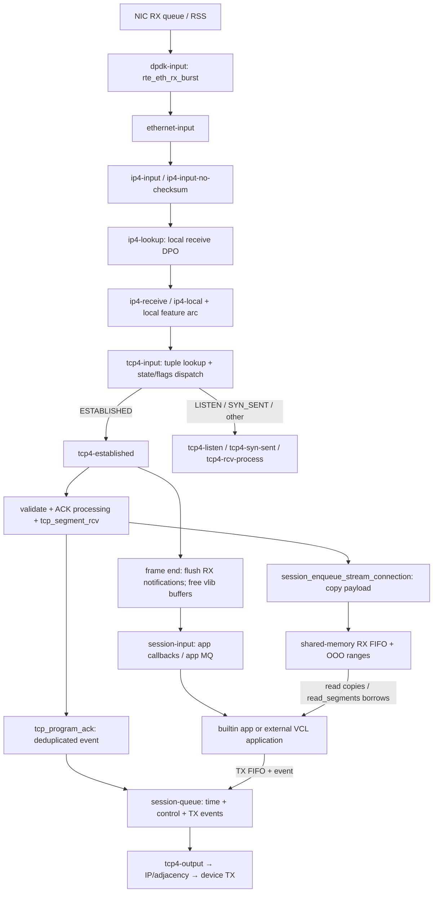

# VPP host stack：把 TCP 状态机和应用事件纳入 graph 调度

核查日期：2026-10-02。版本固定：FD.io VPP tag **v25.02**，commit **af12ed005d50809e130b93a4d9c934a961081dcf**。源码仓库 https://github.com/FDio/vpp；本文所有 VPP 链接固定到该 commit。Linux 对照固定 **v6.18 / 7d0a66e4bb9081d75c82ec4957c50034cb0ea449**。研究范围为 `src/vnet/tcp`、`src/vnet/session`、SVM FIFO、VCL 和 DPDK 插件；结论来自 `rg` 定位后读取实现，未编译、未执行测试、未实测性能。

核心洞见：**把“包的批量处理”和“连接的独占修改”分开，再让 session 层批量调度应用通知及发送。** TCP 并不是一个 graph node 包办全程：input 查表并按状态分流，established 等节点更新连接和 FIFO，session-input 通知应用，session-queue 调度 TX、ACK、重传与时钟。[src/vnet/tcp/tcp_input.c:2759](https://github.com/FDio/vpp/blob/af12ed005d50809e130b93a4d9c934a961081dcf/src/vnet/tcp/tcp_input.c#L2759)、[src/vnet/tcp/tcp_input.c:1446](https://github.com/FDio/vpp/blob/af12ed005d50809e130b93a4d9c934a961081dcf/src/vnet/tcp/tcp_input.c#L1446)、[src/vnet/session/session_input.c:320](https://github.com/FDio/vpp/blob/af12ed005d50809e130b93a4d9c934a961081dcf/src/vnet/session/session_input.c#L320)、[src/vnet/session/session_node.c:1953](https://github.com/FDio/vpp/blob/af12ed005d50809e130b93a4d9c934a961081dcf/src/vnet/session/session_node.c#L1953)。

最大的约束是连接对 RX worker 的亲和性。**该版本普通 TCP input 遇到已建立连接在错误 worker 上到达，会丢包，并未自动 handoff；主动建连时收到 SYN/SYN-ACK 后搬到当前 RX worker，是另一个专门的生命周期阶段。** 因而“按核连接”不是 RSS 配好后即可忘记的性能选项，而是此路径必须维持的条件。[src/vnet/session/session_lookup.c:979](https://github.com/FDio/vpp/blob/af12ed005d50809e130b93a4d9c934a961081dcf/src/vnet/session/session_lookup.c#L979)、[src/vnet/tcp/tcp_input.c:2742](https://github.com/FDio/vpp/blob/af12ed005d50809e130b93a4d9c934a961081dcf/src/vnet/tcp/tcp_input.c#L2742)、[src/vnet/tcp/tcp_input.c:1847](https://github.com/FDio/vpp/blob/af12ed005d50809e130b93a4d9c934a961081dcf/src/vnet/tcp/tcp_input.c#L1847)。这不否认用户可在更早的 graph 节点另加分流；本文未确认一个会为此 TCP 路径自动兜底的通用 handoff 配置。

## 1. 完整路径与 Linux 对照

图以 **DPDK + IPv4 + 本地 TCP 接收**为例；VPP 可以有其他网卡输入插件，接口 feature arc 也可插入节点。IPv6 有对应 tcp6 节点。[src/plugins/dpdk/device/node.c:563](https://github.com/FDio/vpp/blob/af12ed005d50809e130b93a4d9c934a961081dcf/src/plugins/dpdk/device/node.c#L563)、[src/vnet/tcp/tcp_input.c:2978](https://github.com/FDio/vpp/blob/af12ed005d50809e130b93a4d9c934a961081dcf/src/vnet/tcp/tcp_input.c#L2978)。

| 图中阶段/边 | 实现证据及 Linux 对应 |
| --- | --- |
| RSS 队列 → worker → DPDK RX | 多队列开启 RSS；队列分配给 worker；RX 以 burst 获取 mbuf。[src/plugins/dpdk/device/common.c:150](https://github.com/FDio/vpp/blob/af12ed005d50809e130b93a4d9c934a961081dcf/src/plugins/dpdk/device/common.c#L150)、[src/plugins/dpdk/device/init.c:550](https://github.com/FDio/vpp/blob/af12ed005d50809e130b93a4d9c934a961081dcf/src/plugins/dpdk/device/init.c#L550)、[src/plugins/dpdk/device/node.c:365](https://github.com/FDio/vpp/blob/af12ed005d50809e130b93a4d9c934a961081dcf/src/plugins/dpdk/device/node.c#L365)。Linux 对应驱动/NAPI 后进入 GRO/网络接收路径：[Linux net/core/gro.c:624](https://github.com/torvalds/linux/blob/7d0a66e4bb9081d75c82ec4957c50034cb0ea449/net/core/gro.c#L624)、[Linux net/core/dev.c:6256](https://github.com/torvalds/linux/blob/7d0a66e4bb9081d75c82ec4957c50034cb0ea449/net/core/dev.c#L6256)。 |
| DPDK → Ethernet → IP | mbuf 转 buffer index 后批量交给下一节点；IPv4 EtherType 选择 IP input，IP input 接到 ip4-lookup。[src/plugins/dpdk/device/node.c:438](https://github.com/FDio/vpp/blob/af12ed005d50809e130b93a4d9c934a961081dcf/src/plugins/dpdk/device/node.c#L438)、[src/vnet/ethernet/node.c:281](https://github.com/FDio/vpp/blob/af12ed005d50809e130b93a4d9c934a961081dcf/src/vnet/ethernet/node.c#L281)、[src/vnet/ip/ip4_input.c:377](https://github.com/FDio/vpp/blob/af12ed005d50809e130b93a4d9c934a961081dcf/src/vnet/ip/ip4_input.c#L377)。Linux 对应 `ip_rcv()`：[Linux net/ipv4/ip_input.c:564](https://github.com/torvalds/linux/blob/7d0a66e4bb9081d75c82ec4957c50034cb0ea449/net/ipv4/ip_input.c#L564)。 |
| 本地路由 → TCP | receive DPO 的 IPv4 node 是 ip4-receive；本地协议分派由 `ip4_register_protocol()` 加边，TCP 启用时注册。[src/vnet/dpo/receive_dpo.c:157](https://github.com/FDio/vpp/blob/af12ed005d50809e130b93a4d9c934a961081dcf/src/vnet/dpo/receive_dpo.c#L157)、[src/vnet/ip/ip4_forward.c:1886](https://github.com/FDio/vpp/blob/af12ed005d50809e130b93a4d9c934a961081dcf/src/vnet/ip/ip4_forward.c#L1886)、[src/vnet/ip/ip4_forward.c:1923](https://github.com/FDio/vpp/blob/af12ed005d50809e130b93a4d9c934a961081dcf/src/vnet/ip/ip4_forward.c#L1923)、[src/vnet/tcp/tcp.c:1532](https://github.com/FDio/vpp/blob/af12ed005d50809e130b93a4d9c934a961081dcf/src/vnet/tcp/tcp.c#L1532)。Linux 对应 `ip_local_deliver_finish()` 到 `tcp_v4_rcv()`：[Linux net/ipv4/ip_input.c:227](https://github.com/torvalds/linux/blob/7d0a66e4bb9081d75c82ec4957c50034cb0ea449/net/ipv4/ip_input.c#L227)、[Linux net/ipv4/tcp_ipv4.c:2202](https://github.com/torvalds/linux/blob/7d0a66e4bb9081d75c82ec4957c50034cb0ea449/net/ipv4/tcp_ipv4.c#L2202)。 |
| TCP input → 状态节点 | frame 内查表，缓存 `connection_index`，由 `dispatch_table[state][flags]` 选 next，批量 enqueue。[src/vnet/tcp/tcp_input.c:2766](https://github.com/FDio/vpp/blob/af12ed005d50809e130b93a4d9c934a961081dcf/src/vnet/tcp/tcp_input.c#L2766)、[src/vnet/tcp/tcp_input.c:2824](https://github.com/FDio/vpp/blob/af12ed005d50809e130b93a4d9c934a961081dcf/src/vnet/tcp/tcp_input.c#L2824)、[src/vnet/tcp/tcp_input.c:2908](https://github.com/FDio/vpp/blob/af12ed005d50809e130b93a4d9c934a961081dcf/src/vnet/tcp/tcp_input.c#L2908)。Linux 相应状态快路径为 `tcp_rcv_established()`：[Linux net/ipv4/tcp_input.c:6259](https://github.com/torvalds/linux/blob/7d0a66e4bb9081d75c82ec4957c50034cb0ea449/net/ipv4/tcp_input.c#L6259)。 |
| TCP → RX FIFO | established 验序号/ACK 后交给 `tcp_segment_rcv()`；后者调用 session 入队。乱序也直接写 FIFO 对应偏移。[src/vnet/tcp/tcp_input.c:1418](https://github.com/FDio/vpp/blob/af12ed005d50809e130b93a4d9c934a961081dcf/src/vnet/tcp/tcp_input.c#L1418)、[src/vnet/tcp/tcp_input.c:1220](https://github.com/FDio/vpp/blob/af12ed005d50809e130b93a4d9c934a961081dcf/src/vnet/tcp/tcp_input.c#L1220)、[src/vnet/tcp/tcp_input.c:1146](https://github.com/FDio/vpp/blob/af12ed005d50809e130b93a4d9c934a961081dcf/src/vnet/tcp/tcp_input.c#L1146)、[src/vnet/session/session.c:767](https://github.com/FDio/vpp/blob/af12ed005d50809e130b93a4d9c934a961081dcf/src/vnet/session/session.c#L767)。Linux 对应接收队列及 OFO 队列：[Linux net/ipv4/tcp_input.c:5358](https://github.com/torvalds/linux/blob/7d0a66e4bb9081d75c82ec4957c50034cb0ea449/net/ipv4/tcp_input.c#L5358)、[Linux net/ipv4/tcp_input.c:5132](https://github.com/torvalds/linux/blob/7d0a66e4bb9081d75c82ec4957c50034cb0ea449/net/ipv4/tcp_input.c#L5132)。 |
| FIFO → 应用 | 一个 frame 后集中处理 RX 通知并释放包；session-input 调用已注册 callback，外部应用经 app MQ 通知再读 FIFO。普通 VCL read 最后走 FIFO dequeue；segments API 直接取得 FIFO 片段。[src/vnet/tcp/tcp_input.c:1446](https://github.com/FDio/vpp/blob/af12ed005d50809e130b93a4d9c934a961081dcf/src/vnet/tcp/tcp_input.c#L1446)、[src/vnet/session/session.c:601](https://github.com/FDio/vpp/blob/af12ed005d50809e130b93a4d9c934a961081dcf/src/vnet/session/session.c#L601)、[src/vnet/session/session_input.c:114](https://github.com/FDio/vpp/blob/af12ed005d50809e130b93a4d9c934a961081dcf/src/vnet/session/session_input.c#L114)、[src/vcl/vppcom.c:2161](https://github.com/FDio/vpp/blob/af12ed005d50809e130b93a4d9c934a961081dcf/src/vcl/vppcom.c#L2161)、[src/vcl/vppcom.c:2277](https://github.com/FDio/vpp/blob/af12ed005d50809e130b93a4d9c934a961081dcf/src/vcl/vppcom.c#L2277)。Linux 普通 recv 对应 `tcp_recvmsg()` 及 skb 到用户缓冲区复制：[Linux net/ipv4/tcp.c:2913](https://github.com/torvalds/linux/blob/7d0a66e4bb9081d75c82ec4957c50034cb0ea449/net/ipv4/tcp.c#L2913)、[Linux net/ipv4/tcp.c:2823](https://github.com/torvalds/linux/blob/7d0a66e4bb9081d75c82ec4957c50034cb0ea449/net/ipv4/tcp.c#L2823)。 |

对熟悉 VPP 的读者，重点不是再学一次向量循环，而是注意 **stateful graph**：前一节点只在 `vnet_buffer(b)->tcp` 中放连接索引和解析结果，下一节点必须在相同 worker 上解释索引；同时并非每个包都触发一次应用回调。[src/vnet/tcp/tcp_input.c:2834](https://github.com/FDio/vpp/blob/af12ed005d50809e130b93a4d9c934a961081dcf/src/vnet/tcp/tcp_input.c#L2834)、[src/vnet/tcp/tcp_input.c:1405](https://github.com/FDio/vpp/blob/af12ed005d50809e130b93a4d9c934a961081dcf/src/vnet/tcp/tcp_input.c#L1405)、[src/vnet/session/session.c:802](https://github.com/FDio/vpp/blob/af12ed005d50809e130b93a4d9c934a961081dcf/src/vnet/session/session.c#L802)。

## 2. 包缓冲区与拷贝边界

`vlib_buffer_t` 的热字段包括 `current_data/current_length`、flags、引用计数、buffer pool、`next_buffer` 和 opaque metadata；支持链式 buffer。DPDK 布局把 `vlib_buffer_t` 放在 `rte_mbuf` 后，`vlib_buffer_from_rte_mbuf(x)` 是指针偏移；把网卡 buffer 交给 graph 不需要再复制 payload。[src/vlib/buffer.h:109](https://github.com/FDio/vpp/blob/af12ed005d50809e130b93a4d9c934a961081dcf/src/vlib/buffer.h#L109)、[src/vlib/buffer.h:164](https://github.com/FDio/vpp/blob/af12ed005d50809e130b93a4d9c934a961081dcf/src/vlib/buffer.h#L164)、[src/plugins/dpdk/buffer.h:20](https://github.com/FDio/vpp/blob/af12ed005d50809e130b93a4d9c934a961081dcf/src/plugins/dpdk/buffer.h#L20)、[src/plugins/dpdk/device/node.c:439](https://github.com/FDio/vpp/blob/af12ed005d50809e130b93a4d9c934a961081dcf/src/plugins/dpdk/device/node.c#L439)。

**这不等于 TCP 零拷贝到应用。** RX 按如下边界运行：NIC/mbuf → 同一数据的 vlib_buffer → **复制进 RX FIFO** → 普通 VCL read 再复制到应用 buffer。`session_enqueue_stream_connection()` 把 `vlib_buffer_get_current(b)` 交给 `svm_fifo_enqueue()`，其 copy helper 调 `clib_memcpy_fast()`；包在 established frame 结束时释放。[src/vnet/session/session.c:778](https://github.com/FDio/vpp/blob/af12ed005d50809e130b93a4d9c934a961081dcf/src/vnet/session/session.c#L778)、[src/svm/svm_fifo.c:29](https://github.com/FDio/vpp/blob/af12ed005d50809e130b93a4d9c934a961081dcf/src/svm/svm_fifo.c#L29)、[src/vnet/tcp/tcp_input.c:1450](https://github.com/FDio/vpp/blob/af12ed005d50809e130b93a4d9c934a961081dcf/src/vnet/tcp/tcp_input.c#L1450)、[src/vnet/session/application_interface.h:782](https://github.com/FDio/vpp/blob/af12ed005d50809e130b93a4d9c934a961081dcf/src/vnet/session/application_interface.h#L782)。VCL 的 `vppcom_session_read_segments()` 可省掉 **FIFO → 应用**这一段复制，但要在消费后调用 `vppcom_session_free_segments()`；并未省掉包到 FIFO 的复制。[src/vcl/vppcom.c:2228](https://github.com/FDio/vpp/blob/af12ed005d50809e130b93a4d9c934a961081dcf/src/vcl/vppcom.c#L2228)、[src/vcl/vppcom.c:2277](https://github.com/FDio/vpp/blob/af12ed005d50809e130b93a4d9c934a961081dcf/src/vcl/vppcom.c#L2277)、[src/vcl/vppcom.c:2303](https://github.com/FDio/vpp/blob/af12ed005d50809e130b93a4d9c934a961081dcf/src/vcl/vppcom.c#L2303)。

TX 的 TCP transport 选择 `TRANSPORT_TX_PEEK`，意味着发送后仍保留 FIFO 字节，以便对端 ACK 到来之前重传；常规 session TX 通过 `svm_fifo_peek()` 复制进新发包 buffer。可选 DMA 复制分支改变执行复制的设备，并不使数据复制消失。[src/vnet/tcp/tcp.c:1368](https://github.com/FDio/vpp/blob/af12ed005d50809e130b93a4d9c934a961081dcf/src/vnet/tcp/tcp.c#L1368)、[src/vnet/session/session_node.c:970](https://github.com/FDio/vpp/blob/af12ed005d50809e130b93a4d9c934a961081dcf/src/vnet/session/session_node.c#L970)、[src/vnet/tcp/tcp_output.c:1117](https://github.com/FDio/vpp/blob/af12ed005d50809e130b93a4d9c934a961081dcf/src/vnet/tcp/tcp_output.c#L1117)、[src/vnet/session/session.c:922](https://github.com/FDio/vpp/blob/af12ed005d50809e130b93a4d9c934a961081dcf/src/vnet/session/session.c#L922)。

FIFO 与 `sk_buff` 的区别是**流与包的生命周期分开**。FIFO 用 chunk、head/tail、乱序范围链表和 chunk 查找树承载字节流；`tcp_session_enqueue_ooo()` 直接以序号相对偏移写入，随后顺序数据填洞时可一次推进更多字节。[src/svm/fifo_types.h:63](https://github.com/FDio/vpp/blob/af12ed005d50809e130b93a4d9c934a961081dcf/src/svm/fifo_types.h#L63)、[src/svm/fifo_types.h:90](https://github.com/FDio/vpp/blob/af12ed005d50809e130b93a4d9c934a961081dcf/src/svm/fifo_types.h#L90)、[src/vnet/tcp/tcp_input.c:1136](https://github.com/FDio/vpp/blob/af12ed005d50809e130b93a4d9c934a961081dcf/src/vnet/tcp/tcp_input.c#L1136)、[src/vnet/tcp/tcp_input.c:1101](https://github.com/FDio/vpp/blob/af12ed005d50809e130b93a4d9c934a961081dcf/src/vnet/tcp/tcp_input.c#L1101)。Linux `sk_buff` 可进入 socket 接收队列，也携带 owner、路由和协议 metadata；正常接收路径可以在读取前保留 skb。[Linux include/linux/skbuff.h:885](https://github.com/torvalds/linux/blob/7d0a66e4bb9081d75c82ec4957c50034cb0ea449/include/linux/skbuff.h#L885)、[Linux include/net/sock.h:399](https://github.com/torvalds/linux/blob/7d0a66e4bb9081d75c82ec4957c50034cb0ea449/include/net/sock.h#L399)、[Linux net/ipv4/tcp_input.c:5287](https://github.com/torvalds/linux/blob/7d0a66e4bb9081d75c82ec4957c50034cb0ea449/net/ipv4/tcp_input.c#L5287)。**推断**：VPP 选择一次明确的流重组复制来及早归还 packet pool、简化跨进程应用边界；不应因为“用户态”就假定总复制次数比 Linux 少。

## 3. 连接查找：共享目录，worker 私有状态

`session_table_t` 有 IPv4 `clib_bihash_16_8_t` 和 IPv6 `clib_bihash_48_8_t`，另有各自 half-open 表。先按 FIB 选 session table，key 再编码 local/remote 地址、端口、transport protocol。IPv4 key 为 16 字节，IPv6 为 48 字节，value 均为 8 字节。[src/vnet/session/session_table.h:23](https://github.com/FDio/vpp/blob/af12ed005d50809e130b93a4d9c934a961081dcf/src/vnet/session/session_table.h#L23)、[src/vnet/session/session_lookup.c:84](https://github.com/FDio/vpp/blob/af12ed005d50809e130b93a4d9c934a961081dcf/src/vnet/session/session_lookup.c#L84)、[src/vnet/session/session_lookup.c:117](https://github.com/FDio/vpp/blob/af12ed005d50809e130b93a4d9c934a961081dcf/src/vnet/session/session_lookup.c#L117)、[src/vnet/session/session_lookup.c:968](https://github.com/FDio/vpp/blob/af12ed005d50809e130b93a4d9c934a961081dcf/src/vnet/session/session_lookup.c#L968)。

哈希实现不能笼统说“Toeplitz”：session bihash 在支持 intrinsic 时对 key 用 CRC32C，否则将若干 u64 XOR 后用 `clib_xxhash()`。NIC RSS 与这个软件流表哈希是两回事。[src/vppinfra/bihash_16_8.h:61](https://github.com/FDio/vpp/blob/af12ed005d50809e130b93a4d9c934a961081dcf/src/vppinfra/bihash_16_8.h#L61)、[src/vppinfra/bihash_48_8.h:60](https://github.com/FDio/vpp/blob/af12ed005d50809e130b93a4d9c934a961081dcf/src/vppinfra/bihash_48_8.h#L60)。本次未确认各 NIC 的 RSS key/RETA 默认值；DPDK 插件这里只选择 RSS flow types 并交给驱动配置。[src/plugins/dpdk/device/init.c:328](https://github.com/FDio/vpp/blob/af12ed005d50809e130b93a4d9c934a961081dcf/src/plugins/dpdk/device/init.c#L328)、[src/plugins/dpdk/device/common.c:155](https://github.com/FDio/vpp/blob/af12ed005d50809e130b93a4d9c934a961081dcf/src/plugins/dpdk/device/common.c#L155)。

已建立表 value 的高 32 位是 thread，低 32 位是 session index；再由 session 找 worker 私有连接 pool。表并非每核一份：查表需要检查返回 thread；建删表项会用 bihash bucket/allocator 同步。因此准确描述是“连接状态独占 + 共享查找目录”，不能把整个 VPP host stack 称为完全无锁。[src/vnet/session/session_lookup.c:979](https://github.com/FDio/vpp/blob/af12ed005d50809e130b93a4d9c934a961081dcf/src/vnet/session/session_lookup.c#L979)、[src/vnet/tcp/tcp_inlines.h:59](https://github.com/FDio/vpp/blob/af12ed005d50809e130b93a4d9c934a961081dcf/src/vnet/tcp/tcp_inlines.h#L59)、[src/vnet/tcp/tcp.h:85](https://github.com/FDio/vpp/blob/af12ed005d50809e130b93a4d9c934a961081dcf/src/vnet/tcp/tcp.h#L85)、[src/vppinfra/bihash_template.c:736](https://github.com/FDio/vpp/blob/af12ed005d50809e130b93a4d9c934a961081dcf/src/vppinfra/bihash_template.c#L736)、[src/vppinfra/bihash_template.h:270](https://github.com/FDio/vpp/blob/af12ed005d50809e130b93a4d9c934a961081dcf/src/vppinfra/bihash_template.h#L270)。

查找顺序先 established，再 half-open，再 session rules/listener。listen session 不绑定单个 thread；child 在收 SYN 的 worker 分配。[src/vnet/session/session_lookup.c:972](https://github.com/FDio/vpp/blob/af12ed005d50809e130b93a4d9c934a961081dcf/src/vnet/session/session_lookup.c#L972)、[src/vnet/session/session_lookup.c:989](https://github.com/FDio/vpp/blob/af12ed005d50809e130b93a4d9c934a961081dcf/src/vnet/session/session_lookup.c#L989)、[src/vnet/session/session_lookup.c:996](https://github.com/FDio/vpp/blob/af12ed005d50809e130b93a4d9c934a961081dcf/src/vnet/session/session_lookup.c#L996)、[src/vnet/session/session.c:1491](https://github.com/FDio/vpp/blob/af12ed005d50809e130b93a4d9c934a961081dcf/src/vnet/session/session.c#L1491)、[src/vnet/tcp/tcp_input.c:2596](https://github.com/FDio/vpp/blob/af12ed005d50809e130b93a4d9c934a961081dcf/src/vnet/tcp/tcp_input.c#L2596)。

## 4. 定时器：每 worker 时间轮，ACK 走事件

| 用途 | 该版本实际机制 |
| --- | --- |
| 基础结构 | 每 worker 一个 `tcp_timer_wheel_t`，两级轮、每级 1024 槽，tick **100 μs**；并非遍历所有连接。wheel geometry：[src/vnet/tcp/tcp_types.h:461](https://github.com/FDio/vpp/blob/af12ed005d50809e130b93a4d9c934a961081dcf/src/vnet/tcp/tcp_types.h#L461)，tick：[src/vnet/tcp/tcp_types.h:81](https://github.com/FDio/vpp/blob/af12ed005d50809e130b93a4d9c934a961081dcf/src/vnet/tcp/tcp_types.h#L81)，初始化：[src/vnet/tcp/tcp_timer.c:20](https://github.com/FDio/vpp/blob/af12ed005d50809e130b93a4d9c934a961081dcf/src/vnet/tcp/tcp_timer.c#L20)。 |
| 数据重传 | `tcp_retransmit_timer_set()` 将 RTO 转为 timer ticks；到期回调重新构造/发送未确认数据，RTO 加倍并上限截断。[src/vnet/tcp/tcp_timer.h:69](https://github.com/FDio/vpp/blob/af12ed005d50809e130b93a4d9c934a961081dcf/src/vnet/tcp/tcp_timer.h#L69)、[src/vnet/tcp/tcp_output.c:1312](https://github.com/FDio/vpp/blob/af12ed005d50809e130b93a4d9c934a961081dcf/src/vnet/tcp/tcp_output.c#L1312)、[src/vnet/tcp/tcp_output.c:1382](https://github.com/FDio/vpp/blob/af12ed005d50809e130b93a4d9c934a961081dcf/src/vnet/tcp/tcp_output.c#L1382)、[src/vnet/tcp/tcp_output.c:1396](https://github.com/FDio/vpp/blob/af12ed005d50809e130b93a4d9c934a961081dcf/src/vnet/tcp/tcp_output.c#L1396)。 |
| SYN 重传、零窗 persist | 独立 `RETRANSMIT_SYN` 与 `PERSIST` timer id；persist 复用 RTO。[src/vnet/tcp/tcp_types.h:65](https://github.com/FDio/vpp/blob/af12ed005d50809e130b93a4d9c934a961081dcf/src/vnet/tcp/tcp_types.h#L65)、[src/vnet/tcp/tcp_timer.h:83](https://github.com/FDio/vpp/blob/af12ed005d50809e130b93a4d9c934a961081dcf/src/vnet/tcp/tcp_timer.h#L83)、[src/vnet/tcp/tcp_output.c:1465](https://github.com/FDio/vpp/blob/af12ed005d50809e130b93a4d9c934a961081dcf/src/vnet/tcp/tcp_output.c#L1465)。 |
| delayed ACK | **没有传统几十毫秒 delayed-ACK 定时器。** timer enum 只有上述两个加 RETRANSMIT、WAITCLOSE。顺序数据调用 `tcp_program_ack()`，只排一个 custom TX event 并设置 SNDACK，直到 session 调度时 `tcp_session_custom_tx()` 生成 ACK。等待窗口是事件调度/批处理，不能写成固定延迟。[src/vnet/tcp/tcp_types.h:65](https://github.com/FDio/vpp/blob/af12ed005d50809e130b93a4d9c934a961081dcf/src/vnet/tcp/tcp_types.h#L65)、[src/vnet/tcp/tcp_input.c:1278](https://github.com/FDio/vpp/blob/af12ed005d50809e130b93a4d9c934a961081dcf/src/vnet/tcp/tcp_input.c#L1278)、[src/vnet/tcp/tcp_output.c:1022](https://github.com/FDio/vpp/blob/af12ed005d50809e130b93a4d9c934a961081dcf/src/vnet/tcp/tcp_output.c#L1022)、[src/vnet/tcp/tcp_output.c:2041](https://github.com/FDio/vpp/blob/af12ed005d50809e130b93a4d9c934a961081dcf/src/vnet/tcp/tcp_output.c#L2041)。`TCP_ALWAYS_ACK` 仅有定义、未找到调用点，不能依据宏注释推导另一条功能路径。[src/vnet/tcp/tcp_types.h:39](https://github.com/FDio/vpp/blob/af12ed005d50809e130b93a4d9c934a961081dcf/src/vnet/tcp/tcp_types.h#L39)。 |
| TIME_WAIT | 进入状态后用 `TCP_TIMER_WAITCLOSE`；重复 FIN 时重置；到期转 CLOSED 并排 cleanup。默认 `timewait_time=100000` ticks，即 **10 s**。[src/vnet/tcp/tcp_input.c:2375](https://github.com/FDio/vpp/blob/af12ed005d50809e130b93a4d9c934a961081dcf/src/vnet/tcp/tcp_input.c#L2375)、[src/vnet/tcp/tcp_input.c:2385](https://github.com/FDio/vpp/blob/af12ed005d50809e130b93a4d9c934a961081dcf/src/vnet/tcp/tcp_input.c#L2385)、[src/vnet/tcp/tcp.c:1218](https://github.com/FDio/vpp/blob/af12ed005d50809e130b93a4d9c934a961081dcf/src/vnet/tcp/tcp.c#L1218)、[src/vnet/tcp/tcp.c:1650](https://github.com/FDio/vpp/blob/af12ed005d50809e130b93a4d9c934a961081dcf/src/vnet/tcp/tcp.c#L1650)。这是此版本默认值，不是协议普适的 2MSL 秒数。 |
| 时间来源和驱动 | session-queue 读取 `vlib_time_now()`，通知 transport subscriber，`tcp_update_time()` 驱动轮并分发 pending timers。TCP 每包使用 worker 缓存的时间。[src/vnet/session/session_node.c:1965](https://github.com/FDio/vpp/blob/af12ed005d50809e130b93a4d9c934a961081dcf/src/vnet/session/session_node.c#L1965)、[src/vnet/tcp/tcp.c:1301](https://github.com/FDio/vpp/blob/af12ed005d50809e130b93a4d9c934a961081dcf/src/vnet/tcp/tcp.c#L1301)、[src/vnet/tcp/tcp_inlines.h:240](https://github.com/FDio/vpp/blob/af12ed005d50809e130b93a4d9c934a961081dcf/src/vnet/tcp/tcp_inlines.h#L240)。VLIB 时间最终由 `clib_cpu_time_now()` 计数与 clib_time 标定换算；adaptive 模式另用 `CLOCK_MONOTONIC` timerfd 唤醒节点。[src/vlib/main.h:325](https://github.com/FDio/vpp/blob/af12ed005d50809e130b93a4d9c934a961081dcf/src/vlib/main.h#L325)、[src/vppinfra/time.h:239](https://github.com/FDio/vpp/blob/af12ed005d50809e130b93a4d9c934a961081dcf/src/vppinfra/time.h#L239)、[src/vnet/session/session_node.c:2114](https://github.com/FDio/vpp/blob/af12ed005d50809e130b93a4d9c934a961081dcf/src/vnet/session/session_node.c#L2114)。 |

轮到期不意味着立即把所有工作一次做完。VPP 将 expiration 记录进 pending FIFO，并限制每 dispatch 处理量；回调还要检查连接是否释放、timer 是否在等待时被取消/重挂。[src/vnet/tcp/tcp.c:1237](https://github.com/FDio/vpp/blob/af12ed005d50809e130b93a4d9c934a961081dcf/src/vnet/tcp/tcp.c#L1237)、[src/vnet/tcp/tcp.c:1405](https://github.com/FDio/vpp/blob/af12ed005d50809e130b93a4d9c934a961081dcf/src/vnet/tcp/tcp.c#L1405)。对 utcp 的借鉴是把“到期时间正确”和“单轮执行预算”分别设计；100 μs tick 不等于 100 μs 的端到端执行保证。**该句为调度结构推断。**

## 5. 线程模型、RSS 与连接归核

DPDK RX queue 可显式绑定 workers，也可交 VPP 自动分配；多 RX 队列且未禁用 RSS 时配置 RSS，默认 flow types 包含 IP/UDP/TCP。[src/plugins/dpdk/device/init.c:550](https://github.com/FDio/vpp/blob/af12ed005d50809e130b93a4d9c934a961081dcf/src/plugins/dpdk/device/init.c#L550)、[src/plugins/dpdk/device/common.c:150](https://github.com/FDio/vpp/blob/af12ed005d50809e130b93a4d9c934a961081dcf/src/plugins/dpdk/device/common.c#L150)、[src/plugins/dpdk/device/init.c:328](https://github.com/FDio/vpp/blob/af12ed005d50809e130b93a4d9c934a961081dcf/src/plugins/dpdk/device/init.c#L328)。VPP worker 运行 graph，每个 TCP worker 保存私有连接池、时间轮及延后回收/通知队列。[src/vnet/tcp/tcp.h:85](https://github.com/FDio/vpp/blob/af12ed005d50809e130b93a4d9c934a961081dcf/src/vnet/tcp/tcp.h#L85)。

被动 open 在 SYN 接收核分配 child；主动 open 的有效 SYN/SYN-ACK 把 half-open 连接转入当前核 pool。之后 `_wt4/_wt6` 查找强制核一致，错误核返回 WRONG_THREAD，TCP input 丢弃。[src/vnet/tcp/tcp_input.c:2596](https://github.com/FDio/vpp/blob/af12ed005d50809e130b93a4d9c934a961081dcf/src/vnet/tcp/tcp_input.c#L2596)、[src/vnet/tcp/tcp_input.c:1847](https://github.com/FDio/vpp/blob/af12ed005d50809e130b93a4d9c934a961081dcf/src/vnet/tcp/tcp_input.c#L1847)、[src/vnet/session/session_lookup.c:979](https://github.com/FDio/vpp/blob/af12ed005d50809e130b93a4d9c934a961081dcf/src/vnet/session/session_lookup.c#L979)、[src/vnet/session/session_lookup.c:1207](https://github.com/FDio/vpp/blob/af12ed005d50809e130b93a4d9c934a961081dcf/src/vnet/session/session_lookup.c#L1207)、[src/vnet/tcp/tcp_input.c:2742](https://github.com/FDio/vpp/blob/af12ed005d50809e130b93a4d9c934a961081dcf/src/vnet/tcp/tcp_input.c#L2742)。**推断**：连接存续期改变 RX queue 的 worker 映射，或让同一入站流经不同 worker，必须另有显式策略；不能把 active-open 的一次转核理解为随时可迁移 established 连接。

应用线程与 TCP worker 不必同核。RX/TX FIFO 的 producer/consumer 字段分 cache line，外部 app MQ 则存在锁；builtin app 可以在 VPP 内通过 callback 消费数据。[src/svm/fifo_types.h:76](https://github.com/FDio/vpp/blob/af12ed005d50809e130b93a4d9c934a961081dcf/src/svm/fifo_types.h#L76)、[src/svm/fifo_types.h:83](https://github.com/FDio/vpp/blob/af12ed005d50809e130b93a4d9c934a961081dcf/src/svm/fifo_types.h#L83)、[src/vnet/session/session_input.c:89](https://github.com/FDio/vpp/blob/af12ed005d50809e130b93a4d9c934a961081dcf/src/vnet/session/session_input.c#L89)、[src/vnet/session/session_input.c:121](https://github.com/FDio/vpp/blob/af12ed005d50809e130b93a4d9c934a961081dcf/src/vnet/session/session_input.c#L121)。收益是 connection fast path 避免多核同时改一份 TCP 状态；代价是应用与协议栈仍可能产生 cacheline 迁移、FIFO 复制及事件通知。这些是从结构推导的开销项，并非实测占比。

## 6. TCP 实现完整度：按代码路径判定

| 功能 | 本版结论 | 证据 |
| --- | --- | --- |
| 拥塞控制 | **默认 CUBIC**；内置 NewReno；支持通过 CC vft 注册其他算法。不能从存在 delivery-rate tracker 推导有 BBR。 | [src/vnet/tcp/tcp.c:1644](https://github.com/FDio/vpp/blob/af12ed005d50809e130b93a4d9c934a961081dcf/src/vnet/tcp/tcp.c#L1644)、[src/vnet/tcp/tcp_cubic.c:253](https://github.com/FDio/vpp/blob/af12ed005d50809e130b93a4d9c934a961081dcf/src/vnet/tcp/tcp_cubic.c#L253)、[src/vnet/tcp/tcp_newreno.c:121](https://github.com/FDio/vpp/blob/af12ed005d50809e130b93a4d9c934a961081dcf/src/vnet/tcp/tcp_newreno.c#L121)、[src/vnet/tcp/tcp.c:91](https://github.com/FDio/vpp/blob/af12ed005d50809e130b93a4d9c934a961081dcf/src/vnet/tcp/tcp.c#L91)。 |
| SACK | 支持，SYN 默认声明允许；有发送 SACK block、接收 scoreboard 和 SACK 重传路径。不是仅解析 option。 | [src/vnet/tcp/tcp_output.c:183](https://github.com/FDio/vpp/blob/af12ed005d50809e130b93a4d9c934a961081dcf/src/vnet/tcp/tcp_output.c#L183)、[src/vnet/tcp/tcp_output.c:243](https://github.com/FDio/vpp/blob/af12ed005d50809e130b93a4d9c934a961081dcf/src/vnet/tcp/tcp_output.c#L243)、[src/vnet/tcp/tcp_sack.c:347](https://github.com/FDio/vpp/blob/af12ed005d50809e130b93a4d9c934a961081dcf/src/vnet/tcp/tcp_sack.c#L347)、[src/vnet/tcp/tcp_output.c:1726](https://github.com/FDio/vpp/blob/af12ed005d50809e130b93a4d9c934a961081dcf/src/vnet/tcp/tcp_output.c#L1726)。 |
| Window scale | 支持 SYN 协商；发端按 peer scale 解释窗口，接收 scale 按 FIFO 上限算。 | [src/vnet/tcp/tcp_output.c:106](https://github.com/FDio/vpp/blob/af12ed005d50809e130b93a4d9c934a961081dcf/src/vnet/tcp/tcp_output.c#L106)、[src/vnet/tcp/tcp_output.c:174](https://github.com/FDio/vpp/blob/af12ed005d50809e130b93a4d9c934a961081dcf/src/vnet/tcp/tcp_output.c#L174)、[src/vnet/tcp/tcp_input.c:1860](https://github.com/FDio/vpp/blob/af12ed005d50809e130b93a4d9c934a961081dcf/src/vnet/tcp/tcp_input.c#L1860)。 |
| Timestamp / PAWS | 支持 SYN option、回显及最近时间戳；有 PAWS 验证。 | [src/vnet/tcp/tcp_output.c:178](https://github.com/FDio/vpp/blob/af12ed005d50809e130b93a4d9c934a961081dcf/src/vnet/tcp/tcp_output.c#L178)、[src/vnet/tcp/tcp_input.c:1854](https://github.com/FDio/vpp/blob/af12ed005d50809e130b93a4d9c934a961081dcf/src/vnet/tcp/tcp_input.c#L1854)、[src/vnet/tcp/tcp_input.c:2486](https://github.com/FDio/vpp/blob/af12ed005d50809e130b93a4d9c934a961081dcf/src/vnet/tcp/tcp_input.c#L2486)。 |
| TSO/GSO | **支持但 TCP 默认 allow_tso=0**。需 TCP 开启/connection 属性允许，再检测出口接口 GSO capability；输出 buffer 标 GSO size，DPDK device 还需能力/配置满足。 | [src/vnet/tcp/tcp.c:1642](https://github.com/FDio/vpp/blob/af12ed005d50809e130b93a4d9c934a961081dcf/src/vnet/tcp/tcp.c#L1642)、[src/vnet/tcp/tcp_cli.c:1068](https://github.com/FDio/vpp/blob/af12ed005d50809e130b93a4d9c934a961081dcf/src/vnet/tcp/tcp_cli.c#L1068)、[src/vnet/tcp/tcp_input.c:1676](https://github.com/FDio/vpp/blob/af12ed005d50809e130b93a4d9c934a961081dcf/src/vnet/tcp/tcp_input.c#L1676)、[src/vnet/tcp/tcp_output.c:2146](https://github.com/FDio/vpp/blob/af12ed005d50809e130b93a4d9c934a961081dcf/src/vnet/tcp/tcp_output.c#L2146)、[src/plugins/dpdk/device/common.c:118](https://github.com/FDio/vpp/blob/af12ed005d50809e130b93a4d9c934a961081dcf/src/plugins/dpdk/device/common.c#L118)。 |
| LRO | DPDK plugin 有 `enable-lro` 配置并请求 `RTE_ETH_RX_OFFLOAD_TCP_LRO`，最后与设备能力相与。**这是设备接入层可选能力；未确认本版 host TCP 对所有 NIC LRO 输出形态的完整正确性/性能覆盖，也未确认独立的 host TCP 软件 LRO 模块。** | [src/plugins/dpdk/device/init.c:1184](https://github.com/FDio/vpp/blob/af12ed005d50809e130b93a4d9c934a961081dcf/src/plugins/dpdk/device/init.c#L1184)、[src/plugins/dpdk/device/common.c:115](https://github.com/FDio/vpp/blob/af12ed005d50809e130b93a4d9c934a961081dcf/src/plugins/dpdk/device/common.c#L115)、[src/plugins/dpdk/device/common.c:126](https://github.com/FDio/vpp/blob/af12ed005d50809e130b93a4d9c934a961081dcf/src/plugins/dpdk/device/common.c#L126)。 |
| checksum offload / pacing | TCP 配置默认均开启；硬件 offload 还受设备能力限制。 | [src/vnet/tcp/tcp.c:1641](https://github.com/FDio/vpp/blob/af12ed005d50809e130b93a4d9c934a961081dcf/src/vnet/tcp/tcp.c#L1641)、[src/plugins/dpdk/device/common.c:102](https://github.com/FDio/vpp/blob/af12ed005d50809e130b93a4d9c934a961081dcf/src/plugins/dpdk/device/common.c#L102)、[src/plugins/dpdk/device/common.c:126](https://github.com/FDio/vpp/blob/af12ed005d50809e130b93a4d9c934a961081dcf/src/plugins/dpdk/device/common.c#L126)。 |
| URG / Fast Open | established 的 URG 处理仍标 TODO；SYN-SENT ACK 数据处理留有“if we support Fast Open”TODO。不能视为兼容 Linux 的 URG/TFO 实现。 | [src/vnet/tcp/tcp_input.c:1429](https://github.com/FDio/vpp/blob/af12ed005d50809e130b93a4d9c934a961081dcf/src/vnet/tcp/tcp_input.c#L1429)、[src/vnet/tcp/tcp_input.c:1877](https://github.com/FDio/vpp/blob/af12ed005d50809e130b93a4d9c934a961081dcf/src/vnet/tcp/tcp_input.c#L1877)。 |
| TCP keepalive / ECN / BBR / MPTCP | 未确认完整实现。KEEPIDLE/KEEPINTVL 的 VCL 属性出现 `#VPP-TBD#`，不能把 socket option 被接受等同于 transport 正在发 probe；ECN 标志位定义也不能证明完整协商与拥塞反馈。 | [src/vcl/vppcom.c:4305](https://github.com/FDio/vpp/blob/af12ed005d50809e130b93a4d9c934a961081dcf/src/vcl/vppcom.c#L4305)、[src/vnet/tcp/tcp_types.h:65](https://github.com/FDio/vpp/blob/af12ed005d50809e130b93a4d9c934a961081dcf/src/vnet/tcp/tcp_types.h#L65)、[src/vnet/tcp/tcp_packet.h:30](https://github.com/FDio/vpp/blob/af12ed005d50809e130b93a4d9c934a961081dcf/src/vnet/tcp/tcp_packet.h#L30)。 |

这里的“支持”只表示目标版本存在实际路径，不等于已经验证所有 RFC 角落、互操作性或 Internet 长尾行为。具体协议一致性测试覆盖未确认。

## 7. 应用 API：session 原生、VCL、LD_PRELOAD

原生 session 应用注册 `session_cb_vft_t`，得到 accept/connected/disconnect/RX/TX 等事件，操作 session FIFO。TCP 通过 `transport_proto_vft_t` 接入 session：open/close、push_header、send_params、update_time、custom_tx 各有钩子。[src/vnet/session/application_interface.h:32](https://github.com/FDio/vpp/blob/af12ed005d50809e130b93a4d9c934a961081dcf/src/vnet/session/application_interface.h#L32)、[src/vnet/tcp/tcp.c:1342](https://github.com/FDio/vpp/blob/af12ed005d50809e130b93a4d9c934a961081dcf/src/vnet/tcp/tcp.c#L1342)。内置 echo server 的 callback 表是很短的使用样例。[src/plugins/hs_apps/echo_server.c:470](https://github.com/FDio/vpp/blob/af12ed005d50809e130b93a4d9c934a961081dcf/src/plugins/hs_apps/echo_server.c#L470)。

外部应用可用 VCL 的 `vppcom_session_create/connect/read/write`、poll/epoll 风格接口，也有上述 segments API。[src/vcl/vppcom.h:217](https://github.com/FDio/vpp/blob/af12ed005d50809e130b93a4d9c934a961081dcf/src/vcl/vppcom.h#L217)、[src/vcl/vppcom.h:240](https://github.com/FDio/vpp/blob/af12ed005d50809e130b93a4d9c934a961081dcf/src/vcl/vppcom.h#L240)、[src/vcl/vppcom.h:260](https://github.com/FDio/vpp/blob/af12ed005d50809e130b93a4d9c934a961081dcf/src/vcl/vppcom.h#L260)。LDP 提供 libc interposition，例如 `read()` 区分 VCL fd 和普通 libc fd；支持一部分 BSD socket 接口，不等于复现 Linux 所有 fd/socket 语义，未处理的 setsockopt 默认 `EOPNOTSUPP`。[src/vcl/ldp.c:369](https://github.com/FDio/vpp/blob/af12ed005d50809e130b93a4d9c934a961081dcf/src/vcl/ldp.c#L369)、[src/vcl/ldp.c:2145](https://github.com/FDio/vpp/blob/af12ed005d50809e130b93a4d9c934a961081dcf/src/vcl/ldp.c#L2145)。

代价是不同层次的：原生 callback 要按 session 生命周期改写应用；VCL read 保留一次 FIFO 到应用的复制；segments API 要显式管理借用生命周期；LDP 还需要 fd 映射、选项与事件兼容逻辑。这里的代价直接来自各条调用路径，不把 VCL/LDP 宣称为完全透明替代内核 socket。[src/vnet/session/application_interface.h:32](https://github.com/FDio/vpp/blob/af12ed005d50809e130b93a4d9c934a961081dcf/src/vnet/session/application_interface.h#L32)、[src/vnet/session/application_interface.h:782](https://github.com/FDio/vpp/blob/af12ed005d50809e130b93a4d9c934a961081dcf/src/vnet/session/application_interface.h#L782)、[src/vcl/vppcom.c:2303](https://github.com/FDio/vpp/blob/af12ed005d50809e130b93a4d9c934a961081dcf/src/vcl/vppcom.c#L2303)、[src/vcl/ldp.c:376](https://github.com/FDio/vpp/blob/af12ed005d50809e130b93a4d9c934a961081dcf/src/vcl/ldp.c#L376)。

## 8. 相比 Linux 简化了什么，以及成立条件

| 选择 | 获得什么，要求什么 |
| --- | --- |
| TCP 状态由固定 worker 修改 | 从 fast path 中排除“任意进程线程与 softirq 同时操作连接”的通用场景；条件是 RX 分流保持亲和性。Linux 为此存在 socket lock/backlog 等机制；VPP 以核匹配和 owner-thread timer assert 表达约束。[src/vnet/tcp/tcp_timer.h:21](https://github.com/FDio/vpp/blob/af12ed005d50809e130b93a4d9c934a961081dcf/src/vnet/tcp/tcp_timer.h#L21)、[src/vnet/session/session_lookup.c:979](https://github.com/FDio/vpp/blob/af12ed005d50809e130b93a4d9c934a961081dcf/src/vnet/session/session_lookup.c#L979)；[Linux include/net/sock.h:277](https://github.com/torvalds/linux/blob/7d0a66e4bb9081d75c82ec4957c50034cb0ea449/include/net/sock.h#L277)。 |
| 应用边界改成 FIFO + 事件 | 从数据路径移走普通 socket recv/send 系统调用和 kernel/user 地址空间复制边界，换成共享内存字节流和通知；实际 FIFO 拷贝仍在。没有普遍性结论说“去掉 syscall 就解决一切”。[src/vnet/session/session.c:767](https://github.com/FDio/vpp/blob/af12ed005d50809e130b93a4d9c934a961081dcf/src/vnet/session/session.c#L767)、[src/vnet/session/session_input.c:89](https://github.com/FDio/vpp/blob/af12ed005d50809e130b93a4d9c934a961081dcf/src/vnet/session/session_input.c#L89)、[src/vcl/vppcom.c:2161](https://github.com/FDio/vpp/blob/af12ed005d50809e130b93a4d9c934a961081dcf/src/vcl/vppcom.c#L2161)。 |
| TCP 复用 VPP 转发和 graph 平台 | TCP 自身无需重建设备轮询、IP 路由、feature arc、buffer pool 和 graph 批处理基础设施；代价是 utcp 若直接照搬 TCP 文件，会拖入整套 session/VLIB 依赖。TCP 协议注册和 transport vft 表给出依赖入口。[src/vnet/tcp/tcp.c:1532](https://github.com/FDio/vpp/blob/af12ed005d50809e130b93a4d9c934a961081dcf/src/vnet/tcp/tcp.c#L1532)、[src/vnet/tcp/tcp.c:1342](https://github.com/FDio/vpp/blob/af12ed005d50809e130b93a4d9c934a961081dcf/src/vnet/tcp/tcp.c#L1342)。此项是依赖结构推断。 |
| 更窄的兼容目标与生命周期政策 | URG/TFO 尚有 TODO，TIME_WAIT 默认 10 s，应用迟迟不 close 时 CLOSE_WAIT 默认 2 s；它不是把 Linux TCP 所有策略原封不动搬出来。[src/vnet/tcp/tcp_input.c:1429](https://github.com/FDio/vpp/blob/af12ed005d50809e130b93a4d9c934a961081dcf/src/vnet/tcp/tcp_input.c#L1429)、[src/vnet/tcp/tcp_input.c:1877](https://github.com/FDio/vpp/blob/af12ed005d50809e130b93a4d9c934a961081dcf/src/vnet/tcp/tcp_input.c#L1877)、[src/vnet/tcp/tcp.c:1648](https://github.com/FDio/vpp/blob/af12ed005d50809e130b93a4d9c934a961081dcf/src/vnet/tcp/tcp.c#L1648)。这些默认值体现选择，不构成 utcp 可无条件照抄的理由。 |

也不能说 VPP“删掉所有通用功能”：这里仍有 IPv4/IPv6、FIB scope、session rules、跨进程应用和可扩展 transport API。[src/vnet/session/session_table.h:23](https://github.com/FDio/vpp/blob/af12ed005d50809e130b93a4d9c934a961081dcf/src/vnet/session/session_table.h#L23)、[src/vnet/session/session_lookup.c:996](https://github.com/FDio/vpp/blob/af12ed005d50809e130b93a4d9c934a961081dcf/src/vnet/session/session_lookup.c#L996)、[src/vnet/tcp/tcp.c:1342](https://github.com/FDio/vpp/blob/af12ed005d50809e130b93a4d9c934a961081dcf/src/vnet/tcp/tcp.c#L1342)。其专用假设主要落在 **执行和所有权模型**，而不是“只实现一小块 TCP”。

## 9. 自身测试，以及给 utcp 的借鉴

VPP 分几层测 host stack，各层能证明的东西不同：

1. **内部数据结构/算法测试**：`src/plugins/unittest/tcp_test.c` 覆盖 SACK RX/TX、lookup、delivery-rate tracker 等。可以人为设定连接字段和时钟，直接检查 scoreboard holes/序号推进。[src/plugins/unittest/tcp_test.c:69](https://github.com/FDio/vpp/blob/af12ed005d50809e130b93a4d9c934a961081dcf/src/plugins/unittest/tcp_test.c#L69)、[src/plugins/unittest/tcp_test.c:666](https://github.com/FDio/vpp/blob/af12ed005d50809e130b93a4d9c934a961081dcf/src/plugins/unittest/tcp_test.c#L666)、[src/plugins/unittest/tcp_test.c:838](https://github.com/FDio/vpp/blob/af12ed005d50809e130b93a4d9c934a961081dcf/src/plugins/unittest/tcp_test.c#L838)、[src/plugins/unittest/tcp_test.c:1005](https://github.com/FDio/vpp/blob/af12ed005d50809e130b93a4d9c934a961081dcf/src/plugins/unittest/tcp_test.c#L1005)。注意 `test tcp all` 在本版只串联 sack、lookup、delivery，不能按名字以为它包含该文件所有子测试。[src/plugins/unittest/tcp_test.c:1581](https://github.com/FDio/vpp/blob/af12ed005d50809e130b93a4d9c934a961081dcf/src/plugins/unittest/tcp_test.c#L1581)。
2. **Python 驱动 VPP CLI/API**：`test/asf/test_tcp.py` 设置 loopback、路由表及 app namespace，执行 TCP 传输；另一 testcase 调 `test tcp all`。[test/asf/test_tcp.py:24](https://github.com/FDio/vpp/blob/af12ed005d50809e130b93a4d9c934a961081dcf/test/asf/test_tcp.py#L24)、[test/asf/test_tcp.py:64](https://github.com/FDio/vpp/blob/af12ed005d50809e130b93a4d9c934a961081dcf/test/asf/test_tcp.py#L64)、[test/asf/test_tcp.py:125](https://github.com/FDio/vpp/blob/af12ed005d50809e130b93a4d9c934a961081dcf/test/asf/test_tcp.py#L125)。SVM FIFO 另有大量独立测试与 Python 入口。[src/plugins/unittest/svm_fifo_test.c:2738](https://github.com/FDio/vpp/blob/af12ed005d50809e130b93a4d9c934a961081dcf/src/plugins/unittest/svm_fifo_test.c#L2738)、[test/asf/test_session.py:512](https://github.com/FDio/vpp/blob/af12ed005d50809e130b93a4d9c934a961081dcf/test/asf/test_session.py#L512)。
3. **容器/真实应用集成测试**：`extras/hs-test` 有内置 echo、VCL client/server、LDP、HTTP 等测试。`TcpWithLossTest()` 用 nsim 设置延迟和每 1000 包丢 1 包，再传输 50 MB；VCL 测试通过外部进程及共享内存边界。[extras/hs-test/echo_test.go:27](https://github.com/FDio/vpp/blob/af12ed005d50809e130b93a4d9c934a961081dcf/extras/hs-test/echo_test.go#L27)、[extras/hs-test/vcl_test.go:41](https://github.com/FDio/vpp/blob/af12ed005d50809e130b93a4d9c934a961081dcf/extras/hs-test/vcl_test.go#L41)、[extras/hs-test/ldp_test.go:1](https://github.com/FDio/vpp/blob/af12ed005d50809e130b93a4d9c934a961081dcf/extras/hs-test/ldp_test.go#L1)。

给 utcp 的具体参考是：**确定性状态/时钟测试 + 字节流 FIFO/重组测试 + 有损链路下真实应用互通**分开做。前两层的失败可定位到状态不变量，第三层检查事件丢失、背压和应用 API 边界。上述分层建议是基于测试组织的推断；本次没有运行这些测试，也没有确认完整 packetdrill/RFC conformance 覆盖。

## 建议先读的入口

| 顺序 | 文件/入口 | 看什么 |
| --- | --- | --- |
| 1 | [src/vnet/tcp/tcp_input.c:2791](https://github.com/FDio/vpp/blob/af12ed005d50809e130b93a4d9c934a961081dcf/src/vnet/tcp/tcp_input.c#L2791) → [src/vnet/tcp/tcp_input.c:1376](https://github.com/FDio/vpp/blob/af12ed005d50809e130b93a4d9c934a961081dcf/src/vnet/tcp/tcp_input.c#L1376) → [src/vnet/tcp/tcp_input.c:1220](https://github.com/FDio/vpp/blob/af12ed005d50809e130b93a4d9c934a961081dcf/src/vnet/tcp/tcp_input.c#L1220) | vector dispatch 如何串起查找、TCP 状态和流数据；重点区分 per-packet 与 frame-end 工作。 |
| 2 | [src/vnet/session/session.c:767](https://github.com/FDio/vpp/blob/af12ed005d50809e130b93a4d9c934a961081dcf/src/vnet/session/session.c#L767) → [src/svm/fifo_types.h:63](https://github.com/FDio/vpp/blob/af12ed005d50809e130b93a4d9c934a961081dcf/src/svm/fifo_types.h#L63) → [src/svm/svm_fifo.c:906](https://github.com/FDio/vpp/blob/af12ed005d50809e130b93a4d9c934a961081dcf/src/svm/svm_fifo.c#L906) | 包转字节流的复制边界、乱序写入和 FIFO 生命周期。 |
| 3 | [src/vnet/session/session_lookup.c:957](https://github.com/FDio/vpp/blob/af12ed005d50809e130b93a4d9c934a961081dcf/src/vnet/session/session_lookup.c#L957) → [src/vnet/tcp/tcp_input.c:1847](https://github.com/FDio/vpp/blob/af12ed005d50809e130b93a4d9c934a961081dcf/src/vnet/tcp/tcp_input.c#L1847) | 共享目录、owner worker 检查，以及建立阶段的归核。 |
| 4 | [src/vnet/session/session_node.c:1953](https://github.com/FDio/vpp/blob/af12ed005d50809e130b93a4d9c934a961081dcf/src/vnet/session/session_node.c#L1953) → [src/vnet/tcp/tcp_output.c:1022](https://github.com/FDio/vpp/blob/af12ed005d50809e130b93a4d9c934a961081dcf/src/vnet/tcp/tcp_output.c#L1022) → [src/vnet/tcp/tcp_output.c:2041](https://github.com/FDio/vpp/blob/af12ed005d50809e130b93a4d9c934a961081dcf/src/vnet/tcp/tcp_output.c#L2041) | graph 之外的连接事件调度如何完成 ACK、重传和应用 TX。 |
| 5 | [src/vnet/tcp/tcp_types.h:461](https://github.com/FDio/vpp/blob/af12ed005d50809e130b93a4d9c934a961081dcf/src/vnet/tcp/tcp_types.h#L461) → [src/vnet/tcp/tcp.c:1301](https://github.com/FDio/vpp/blob/af12ed005d50809e130b93a4d9c934a961081dcf/src/vnet/tcp/tcp.c#L1301) → [src/plugins/unittest/tcp_test.c:1005](https://github.com/FDio/vpp/blob/af12ed005d50809e130b93a4d9c934a961081dcf/src/plugins/unittest/tcp_test.c#L1005) | 时间轮几何、执行预算和可注入时间测试。 |

对于 utcp，最值得吸收的是 **connection owner、可合并事件、packet/stream 生命周期分离**三项；是否采用 VPP 的 FIFO 拷贝、外部 session 进程模型、10 s TIME_WAIT、错核丢包策略，需要由自己的目标重新决定。以上判断依据分别是 owner 检查、ACK 去重、FIFO enqueue 和默认配置，属于设计建议而非性能结论。[src/vnet/session/session_lookup.c:979](https://github.com/FDio/vpp/blob/af12ed005d50809e130b93a4d9c934a961081dcf/src/vnet/session/session_lookup.c#L979)、[src/vnet/tcp/tcp_output.c:1022](https://github.com/FDio/vpp/blob/af12ed005d50809e130b93a4d9c934a961081dcf/src/vnet/tcp/tcp_output.c#L1022)、[src/vnet/session/session.c:767](https://github.com/FDio/vpp/blob/af12ed005d50809e130b93a4d9c934a961081dcf/src/vnet/session/session.c#L767)、[src/vnet/tcp/tcp.c:1648](https://github.com/FDio/vpp/blob/af12ed005d50809e130b93a4d9c934a961081dcf/src/vnet/tcp/tcp.c#L1648)。
