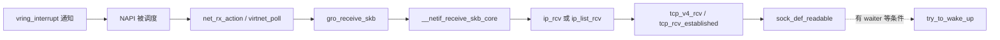

# 从收包路径到丢包原因的追踪库

本篇回答：怎样观察每个接收阶段、怎样读计数/耗时、怎样避免错误结论？前置阅读：[环境说明](../env/README.md)，`notes/02-datapath/rx-tx/README.md`。预计阅读时间：12 分钟。

所有脚本只用于本实验的 Linux v6.18 guest。函数定义和事件字段已核对源码，详见 [SOURCES.md](SOURCES.md)；**本次尚未在 guest 真正挂载 BPF/ftrace**。完整记录见 [REPORT.md](REPORT.md)。输出示例是格式说明，不是实测数据。

## 文件与推荐顺序

1. 先用 `run.sh rx-smoke 15` 验证 GRO/TCP 计数，再读 `SOURCES.md`。
2. `irq.bt`、`softirq-napi.bt` 看中断与 poll 的批处理尺度。
3. `rx-path.bt` 看 11 个阶段的 kprobe/kretprobe 计数和包围耗时。
4. `function-graph.sh` 看指定函数的同步子树；`perf-rx.sh` 保留事件时间序列。
5. `drop-reason.bt` 查软件丢包；`REPORT.md` 和 `../env/OPEN-QUESTIONS.md` 记录验证欠项。

`run.sh` 是 BPF 脚本统一入口，先检查权限、内核版本、bpftrace 版本、每个精确探测点，失败会指出缺项。不会静默删除不可用阶段。直接运行 `.bt` 可绕过这些检查，因此不作为默认用法。

## 三个检查层次

先有源码定义，然后要有编译后的可探测符号，最后要用流量验证它确实触发。源码 static 函数仍可能被优化；运行 `sudo bpftrace -l 'kprobe:gro_receive_skb'` 确认，ftrace 则查 `/sys/kernel/tracing/available_filter_functions`。源码里 `napi_gro_receive` 是 inline，因此本库换成 `gro_receive_skb`，证据在 `include/linux/netdevice.h:4190`。

本库以 [bpftrace 0.21 语言说明](https://bpftrace.org/docs/0.21) 中的 `args.field`、`hist`、`count` 和 entry/return probe 为基础，也对照了 [0.24 的 args 语法](https://bpftrace.org/docs/release_024/language)。未使用只在新版本存在的 map 遍历。wrapper 要求 ≥0.21；宿主 Ubuntu 22.04 的候选 0.14 不能直接用。版本检查不等于实际 BPF verifier 验证，新工具配内核也必须运行检查。

## 收包主线



箭头表示阶段联系，不是保证同步直接调用。GRO 可能暂存、合并后批量向上交付；中断只安排后续处理，用户线程实际运行还在调度器之后。开启 busy polling 或 threaded NAPI 时执行位置也会变化。

宿主终端 A、B 分别运行：

```bash
# A：等 READY 后才从 B 发流量
env/ssh.sh 1 'sudo /work/traces/run.sh rx-path 20'
# B
env/traffic.sh tcp 20M 10 1
```

`@calls[tcp_v4_rcv]: N` 是调用次数；`@us[tcp_v4_rcv]` 是以微秒为单位的 log2 直方图。计时从函数 entry 到 return，包括子调用与期间中断开销；不是函数独占 CPU 时间，也不是某个包从网卡到应用的延迟。计时 map 按 CPU、TID、函数和深度存储，处理同一执行者的递归。此模式针对这些通常不睡眠的收包阶段，不适合直接搬到会睡眠、迁移 CPU 的任意函数。

SSH 控制流量也进入计数。`try_to_wake_up` 包含非网络唤醒，不能和 TCP entry 一对一相减。暂时没看到 `ip_rcv` 也不能判断 IPv4 没处理：本库同时计数 `ip_list_rcv`。高频探针本身会扰动结果，先用低速短时间运行；比较数值时保留相同工具/配置/流量。

## 中断与 NAPI 分布

```bash
env/ssh.sh 1 'sudo /work/traces/run.sh irq 15'
env/ssh.sh 1 'sudo /work/traces/run.sh softirq-napi 15'
```

`@handlers[CPU, IRQ, name]` 配合 guest `/proc/interrupts` 判断实验网卡通知；`irq.bt` 也会统计其他设备。`@softirq_calls[CPU, vec]` 的 NET_RX vector 是 3，NET_TX 是 2，源码见 `include/linux/interrupt.h:548`。`@softirq_us` 反映 handler 包围时间，不是从 raised 到执行的等待。

`@poll_work[CPU, dev_name, napi指针]` 分开观察 NAPI 实例；`@poll_budget` 和 `@at_budget` 辅助识别满预算轮次。`napi_poll` 字段来自 `include/trace/events/napi.h:14`。普通 virtio TX NAPI 可回收后返回零，`work=0` 不能直接等同 RX 空转；`work>=budget` 也不能单独证明网卡或上层丢包。

## function_graph 与 perf

```bash
env/ssh.sh 1 'sudo /work/traces/function-graph.sh virtnet_poll 5 8' > /tmp/ll-rx.graph
# 另一个终端并行发流量，第三个参数把子树最大深度限制到 8。
env/ssh.sh 1 'sudo /work/traces/perf-rx.sh /tmp/ll-rx.perf.data 10'
env/ssh.sh 1 'sudo perf script -i /tmp/ll-rx.perf.data'
```

function_graph 使用独立 tracefs instance，仅追踪指定根函数及其同步子调用；退出时删自己的 instance。它输出有限 ring buffer 的最近记录，同时把每 CPU overrun 统计送到 stderr。丢记录时缩短时间或缩小子树；不要把不同上下文中的异步处理误画成一个连续子树。过滤接口依据 `Documentation/trace/ftrace.rst:340`。

Ubuntu `perf` 可能只是按 `uname -r` 转发的 wrapper。quick 初始化会在 guest 临时 `/usr/local/bin` overlay 中给 perf/bpftool 写入口，指向宿主已有 `/usr/lib/linux-tools/宿主版本/` 实体，绕过按 guest 版本查找的 wrapper；该操作不写宿主。宿主工具与 6.18 guest 的特性兼容性仍需验证，尤其新特性可改用完整模式或外置编译 v6.18 `tools/perf`。**仅检测到 perf 命令不是可用性验证。** 本任务未编译 perf。

## 软件丢包原因

```bash
env/ssh.sh 1 'sudo /work/traces/run.sh drop-reason 20'
env/ssh.sh 1 'sudo cat /sys/kernel/tracing/events/skb/kfree_skb/format'
```

`@drops[reason数字, location符号]` 以原因和值释放位置计数。对照运行 guest 的 `format` 中 print fmt，而不是网上旧版 enum 编号。`include/trace/events/skb.h:24` 定义 reason/location；`include/net/dropreason-core.h:139` 定义 core reason。正常无丢包时 map 为空是合理结果；不能仅为了“输出非空”把正常 `consume_skb` 算进丢包。

该脚本不覆盖所有网卡硬件丢包、XDP drop 或分配 skb 之前的丢包。还要对照 `ip -s link`、`ethtool -S`、tcpdump 和具体实验条件。`CONFIG_NET_DROP_MONITOR` 提供另一套 netlink 服务，不是读取本 tracepoint 的唯一前提。

## 要点回顾

- 每个阶段都明确计数单位，函数调用不等于线速包。
- GRO inline wrapper 要换点，IPv4 同时看单包和 list 入口。
- entry/return 直方图是包围耗时，不是端到端延迟。
- NAPI 要区分 RX/TX 实例；零 work 可能发生在完成回收之后。
- 软件 drop reason 不覆盖所有可能的丢包位置。
- 自检验证真实探针计数；本次尚欠 guest 实测。

## 自测题

1. 两台 VM 的 guest 同时显示 CPU0，是否证明它们在同一物理 CPU 上运行？
2. function_graph 为什么不能自动显示硬中断之后由另一上下文执行的全部 TCP 路径？
3. drop reason 没输出，能否证明没有丢包？
4. 自检看到 GRO/TCP 非零后，是否证明所有计数都来自 iperf3？

<details><summary>答案</summary>

1. 不能，guest CPU 编号是 vCPU 编号，调度到宿主哪个 CPU 是另一件事。
2. 它追踪同步调用子树；IRQ 到 softirq、唤醒到实际调度都可能跨上下文。
3. 不能，可能没触发本事件、丢在更早位置，或工作负载确实没有该类丢包。
4. 不能，SSH 等流量也会触发；iperf3 成功和探针非零是两项独立检查。

</details>

## 与 DPDK/VPP 的对照

| 熟悉的观察点 | 内核对应 | 不能直接等同的原因 |
|---|---|---|
| PMD burst 次数和大小 | NAPI poll 次数、work、budget | 中断调度、预算与 TX 回收具有额外语义 |
| node vector 个数 | GRO/list 上送批次 | 一个 skb 可表示聚合数据，单位发生变化 |
| node clocks / perf | kretprobe 包围时间、function_graph | 含嵌套调用、抢占/中断扰动和探针开销 |
| node error/drop counter | skb drop reason | 硬件和更早的数据路径丢弃可能没有 skb 事件 |
